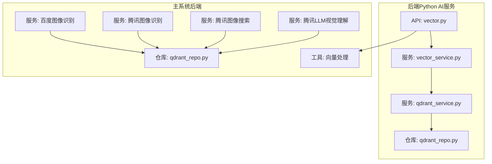
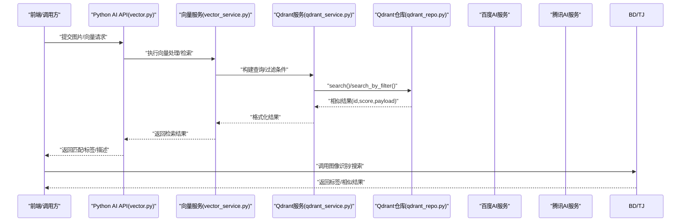
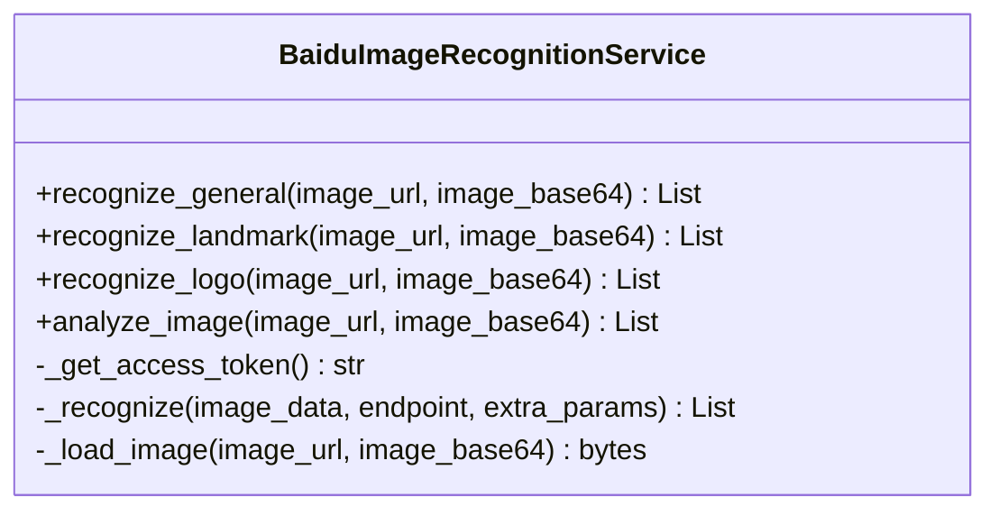
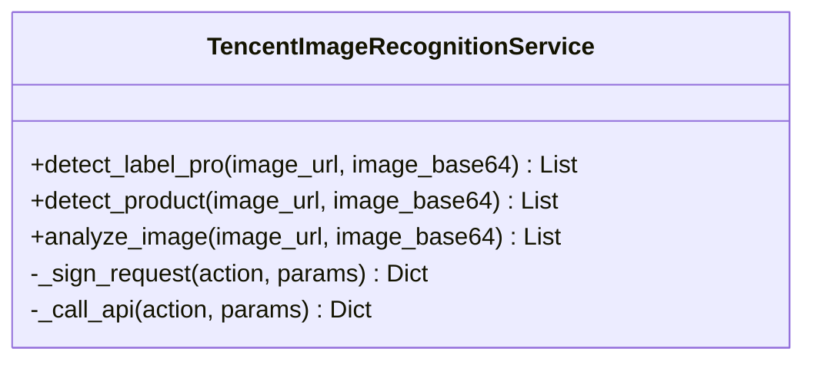
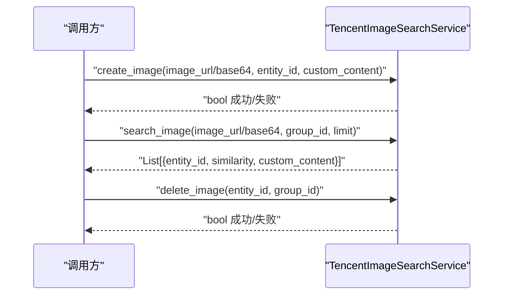
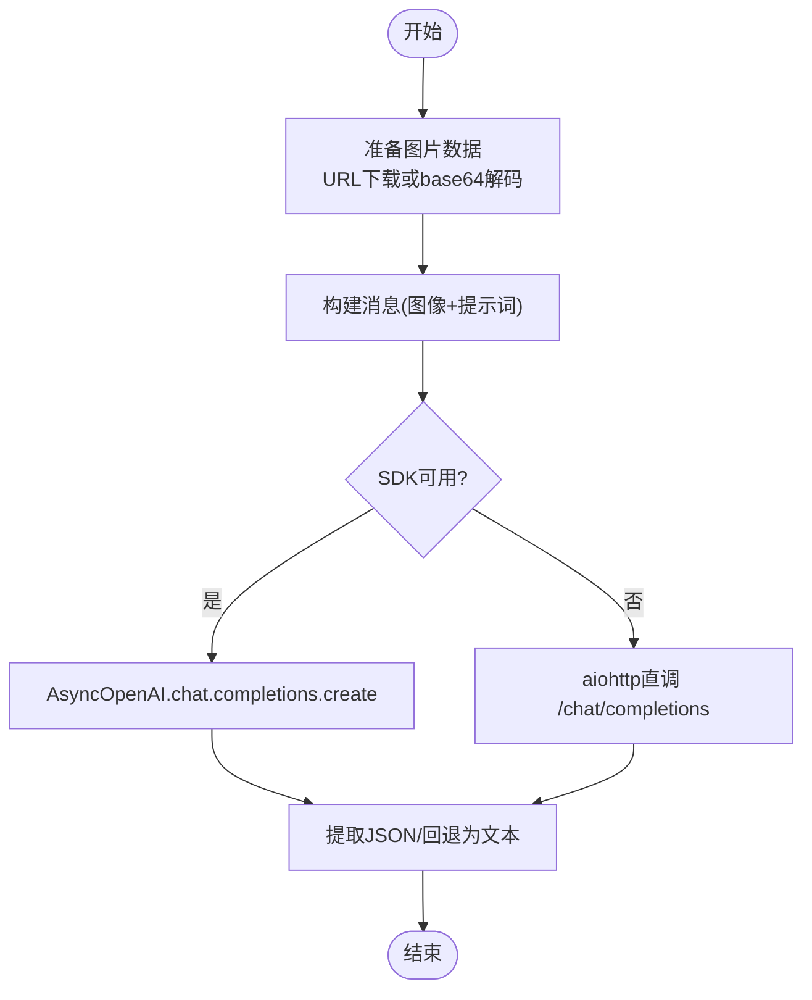
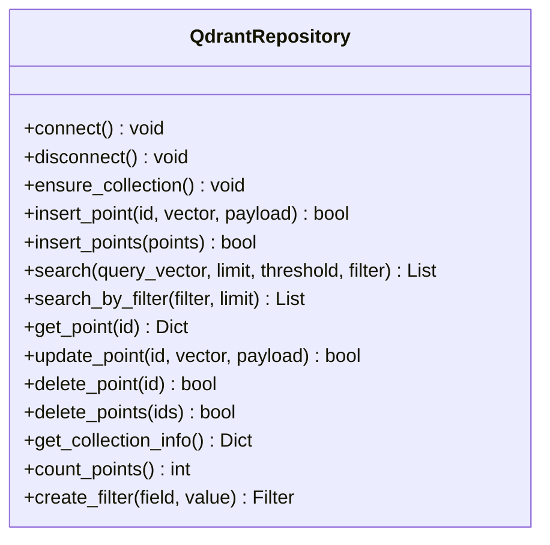
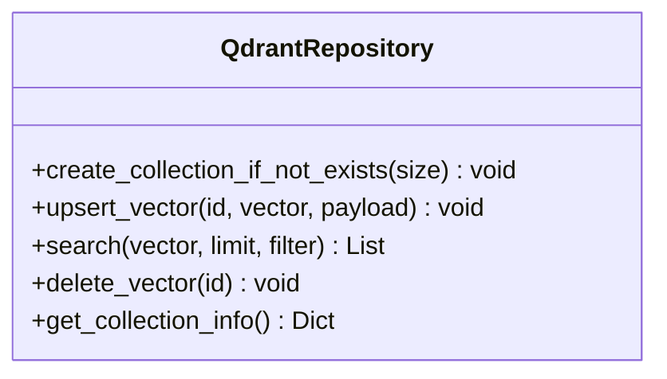
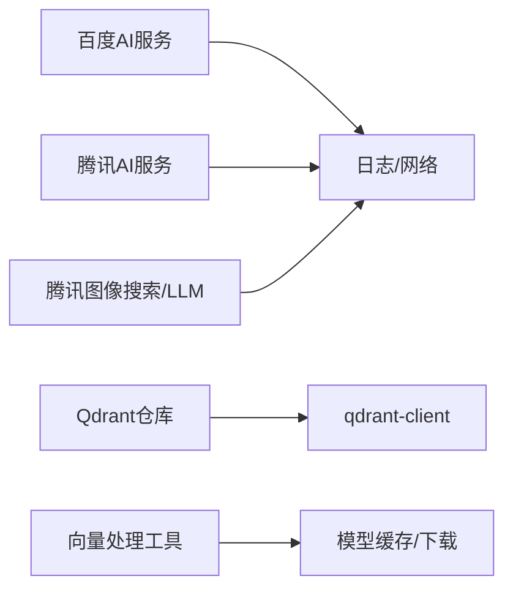

# AI服务开发

<cite>
**本文引用的文件**
- [baidu_image_recognition_service.py](file://backend/app/services/baidu_image_recognition_service.py)
- [tencent_image_recognition_service.py](file://backend/app/services/tencent_image_recognition_service.py)
- [tencent_image_search_service.py](file://backend/app/services/tencent_image_search_service.py)
- [tencent_llm_vision_service.py](file://backend/app/services/tencent_llm_vision_service.py)
- [qdrant_repo.py](file://backend/app/repositories/qdrant_repo.py)
- [qdrant_repo.py](file://python-ai/app/repositories/qdrant_repo.py)
- [ai_vector_processor.py](file://backend/app/services/ai_vector_processing/ai_vector_processor.py)
- [check_model_cache.py](file://backend/app/services/ai_vector_processing/check_model_cache.py)
- [download_model.py](file://backend/app/services/ai_vector_processing/download_model.py)
- [vector.py](file://python-ai/app/api/v1/vector.py)
- [vector_service.py](file://python-ai/app/services/vector_service.py)
- [qdrant_service.py](file://python-ai/app/services/qdrant_service.py)
- [qdrant_monitor.py](file://scripts/utils/qdrant_monitor.py)
</cite>

## 目录
1. [简介](#简介)
2. [项目结构](#项目结构)
3. [核心组件](#核心组件)
4. [架构总览](#架构总览)
5. [详细组件分析](#详细组件分析)
6. [依赖关系分析](#依赖关系分析)
7. [性能考虑](#性能考虑)
8. [故障排查指南](#故障排查指南)
9. [结论](#结论)
10. [附录](#附录)

## 简介
本开发指南面向“思觉智贸”AI服务模块，聚焦以下目标：
- 向量数据库设计与Qdrant集成实现细节
- AI模型集成策略：百度AI与腾讯AI服务接入
- 图像识别服务实现原理与相似性检索算法
- 性能优化、缓存策略与并发处理
- 产品向量化、图像特征提取与智能匹配的实践路径
- 与主系统的数据交换格式与API设计
- AI模型的训练、部署与监控策略

## 项目结构
AI相关能力在后端Python服务与主系统后端之间形成协同：
- 后端Python AI服务（python-ai）：提供向量检索、Qdrant操作、向量服务等
- 主系统后端（backend）：提供百度/腾讯AI图像识别、图像搜索、LLM视觉理解、Qdrant仓库封装、向量处理工具链

图表来源
- [vector.py](file://python-ai/app/api/v1/vector.py)
- [vector_service.py](file://python-ai/app/services/vector_service.py)
- [qdrant_service.py](file://python-ai/app/services/qdrant_service.py)
- [qdrant_repo.py](file://python-ai/app/repositories/qdrant_repo.py)
- [baidu_image_recognition_service.py](file://backend/app/services/baidu_image_recognition_service.py)
- [tencent_image_recognition_service.py](file://backend/app/services/tencent_image_recognition_service.py)
- [tencent_image_search_service.py](file://backend/app/services/tencent_image_search_service.py)
- [tencent_llm_vision_service.py](file://backend/app/services/tencent_llm_vision_service.py)
- [qdrant_repo.py](file://backend/app/repositories/qdrant_repo.py)
- [ai_vector_processor.py](file://backend/app/services/ai_vector_processing/ai_vector_processor.py)

章节来源
- [vector.py](file://python-ai/app/api/v1/vector.py)
- [vector_service.py](file://python-ai/app/services/vector_service.py)
- [qdrant_service.py](file://python-ai/app/services/qdrant_service.py)
- [qdrant_repo.py](file://python-ai/app/repositories/qdrant_repo.py)
- [baidu_image_recognition_service.py](file://backend/app/services/baidu_image_recognition_service.py)
- [tencent_image_recognition_service.py](file://backend/app/services/tencent_image_recognition_service.py)
- [tencent_image_search_service.py](file://backend/app/services/tencent_image_search_service.py)
- [tencent_llm_vision_service.py](file://backend/app/services/tencent_llm_vision_service.py)
- [qdrant_repo.py](file://backend/app/repositories/qdrant_repo.py)
- [ai_vector_processor.py](file://backend/app/services/ai_vector_processing/ai_vector_processor.py)

## 核心组件
- 百度AI图像识别服务：通用物体/地标/Logo识别，统一分析入口，支持URL/base64输入，多识别器融合去重排序
- 腾讯云图像识别服务：DetectLabelPro通用标签、DetectProduct商品识别，支持格式校验与转换
- 腾讯云图像搜索服务：Create/Search/Delete 图像，支持以图搜图与相似性检索
- 腾讯云LLM视觉理解服务：OpenAI兼容接口，图像详细描述与结构化解析
- Qdrant仓库封装：异步连接、集合确保、向量插入/批量插入、相似搜索、过滤搜索、点查询/更新/删除、集合统计
- 向量处理工具链：模型缓存检查、模型下载、向量处理器（后端Python AI服务侧亦提供向量服务）

章节来源
- [baidu_image_recognition_service.py](file://backend/app/services/baidu_image_recognition_service.py)
- [tencent_image_recognition_service.py](file://backend/app/services/tencent_image_recognition_service.py)
- [tencent_image_search_service.py](file://backend/app/services/tencent_image_search_service.py)
- [tencent_llm_vision_service.py](file://backend/app/services/tencent_llm_vision_service.py)
- [qdrant_repo.py](file://backend/app/repositories/qdrant_repo.py)
- [qdrant_repo.py](file://python-ai/app/repositories/qdrant_repo.py)
- [ai_vector_processor.py](file://backend/app/services/ai_vector_processing/ai_vector_processor.py)

## 架构总览
AI服务围绕“图像特征提取—向量入库—相似检索—结果融合”的闭环展开。前端/主系统触发任务，后端Python AI服务负责向量检索与Qdrant交互；同时，主系统后端提供第三方AI能力与图像搜索能力，二者通过统一的数据模型与API对接。

图表来源
- [vector.py](file://python-ai/app/api/v1/vector.py)
- [vector_service.py](file://python-ai/app/services/vector_service.py)
- [qdrant_service.py](file://python-ai/app/services/qdrant_service.py)
- [qdrant_repo.py](file://python-ai/app/repositories/qdrant_repo.py)
- [baidu_image_recognition_service.py](file://backend/app/services/baidu_image_recognition_service.py)
- [tencent_image_recognition_service.py](file://backend/app/services/tencent_image_recognition_service.py)
- [tencent_image_search_service.py](file://backend/app/services/tencent_image_search_service.py)

## 详细组件分析

### 百度AI图像识别服务
- 单例模式与令牌管理：自动获取/刷新access_token，预刷新策略降低过期风险
- 多识别器组合：通用物体、地标、Logo三类识别融合，去重并按置信度排序
- 输入适配：支持URL/本地路径/base64，自动下载与base64解码
- 输出标准化：统一返回(标签, 置信度)列表，便于上层融合

图表来源
- [baidu_image_recognition_service.py](file://backend/app/services/baidu_image_recognition_service.py)

章节来源
- [baidu_image_recognition_service.py](file://backend/app/services/baidu_image_recognition_service.py)

### 腾讯云图像识别服务
- 签名机制：TC3-HMAC-SHA256签名，构造标准请求头
- 识别能力：DetectLabelPro通用标签、DetectProduct商品识别
- 图像预处理：格式检测与转换（不支持格式转为JPEG），避免API拒绝
- 统一输出：(标签, 置信度)列表，支持去重与排序

图表来源
- [tencent_image_recognition_service.py](file://backend/app/services/tencent_image_recognition_service.py)

章节来源
- [tencent_image_recognition_service.py](file://backend/app/services/tencent_image_recognition_service.py)

### 腾讯云图像搜索服务
- 以图搜图：CreateImage入库、SearchImage检索、DeleteImage删除
- 图库分组：默认material_library，支持自定义group_id
- 结果解析：返回entity_id/similarity/custom_content，按相似度降序

图表来源
- [tencent_image_search_service.py](file://backend/app/services/tencent_image_search_service.py)

章节来源
- [tencent_image_search_service.py](file://backend/app/services/tencent_image_search_service.py)

### 腾讯云LLM视觉理解服务
- OpenAI兼容接口：优先使用AsyncOpenAI客户端，回退至aiohttp直调
- 提示词工程：结构化JSON输出约束，解析失败时回退为纯文本描述
- 数据准备：支持URL下载与base64传入，统一转为data URI

图表来源
- [tencent_llm_vision_service.py](file://backend/app/services/tencent_llm_vision_service.py)

章节来源
- [tencent_llm_vision_service.py](file://backend/app/services/tencent_llm_vision_service.py)

### Qdrant仓库封装（后端）
- 连接与集合管理：异步连接、超时控制、ensure_collection自动创建
- 向量操作：insert_point/insert_points、search/search_by_filter、get_point/update_point/delete_point/delete_points
- 过滤与阈值：支持score_threshold与Filter条件，SearchParams优化
- 工具方法：create_filter便捷构造

图表来源
- [qdrant_repo.py](file://backend/app/repositories/qdrant_repo.py)

章节来源
- [qdrant_repo.py](file://backend/app/repositories/qdrant_repo.py)

### Qdrant仓库封装（Python AI服务）
- 简化封装：collectionExists/createCollection/upsert/search/delete/getCollectionInfo
- 适用于轻量场景与快速原型

图表来源
- [qdrant_repo.py](file://python-ai/app/repositories/qdrant_repo.py)

章节来源
- [qdrant_repo.py](file://python-ai/app/repositories/qdrant_repo.py)

### 向量处理与模型管理（后端）
- 模型缓存检查与下载：避免重复下载，提升启动效率
- 向量处理器：统一向量化流程，支持批量处理与错误恢复

章节来源
- [ai_vector_processor.py](file://backend/app/services/ai_vector_processing/ai_vector_processor.py)
- [check_model_cache.py](file://backend/app/services/ai_vector_processing/check_model_cache.py)
- [download_model.py](file://backend/app/services/ai_vector_processing/download_model.py)

### Python AI服务：向量API与服务
- API层：提供向量检索、入库、统计等接口
- 服务层：封装向量计算与Qdrant交互
- 仓库层：Qdrant客户端封装

章节来源
- [vector.py](file://python-ai/app/api/v1/vector.py)
- [vector_service.py](file://python-ai/app/services/vector_service.py)
- [qdrant_service.py](file://python-ai/app/services/qdrant_service.py)

## 依赖关系分析
- 第三方服务依赖：aiohttp、numpy、qdrant-client、openai（可选）
- 配置依赖：BAIDU_AI_CONFIG、TENCENT_CLOUD_CONFIG、HUNYUAN_API_KEY
- 并发与超时：各HTTP调用均设置ClientTimeout，避免阻塞
- 错误处理：统一捕获异常并记录日志，返回空结果或默认值

图表来源
- [baidu_image_recognition_service.py](file://backend/app/services/baidu_image_recognition_service.py)
- [tencent_image_recognition_service.py](file://backend/app/services/tencent_image_recognition_service.py)
- [tencent_image_search_service.py](file://backend/app/services/tencent_image_search_service.py)
- [tencent_llm_vision_service.py](file://backend/app/services/tencent_llm_vision_service.py)
- [qdrant_repo.py](file://backend/app/repositories/qdrant_repo.py)
- [ai_vector_processor.py](file://backend/app/services/ai_vector_processing/ai_vector_processor.py)

## 性能考虑
- 并发与限流
  - 使用aiohttp异步HTTP调用，避免阻塞
  - 对第三方AI服务设置合理timeout，防止级联超时
- 缓存策略
  - 百度AI：access_token预刷新（提前5分钟），减少频繁获取
  - 模型缓存：检查本地缓存，避免重复下载
- 向量检索优化
  - Qdrant SearchParams启用HNSW ef与非精确搜索，平衡速度与精度
  - 合理设置score_threshold与limit，减少无效扫描
- 图像预处理
  - 腾讯AI服务对不支持格式进行转换，避免API拒绝导致重试
- 监控与告警
  - 使用脚本工具对Qdrant状态进行监控，及时发现异常

章节来源
- [baidu_image_recognition_service.py](file://backend/app/services/baidu_image_recognition_service.py)
- [tencent_image_recognition_service.py](file://backend/app/services/tencent_image_recognition_service.py)
- [qdrant_repo.py](file://backend/app/repositories/qdrant_repo.py)
- [qdrant_monitor.py](file://scripts/utils/qdrant_monitor.py)

## 故障排查指南
- 百度AI鉴权失败
  - 现象：获取access_token失败/返回error_code
  - 排查：核对BAIDU_AI_CONFIG配置、网络连通性、令牌有效期
- 腾讯云签名错误
  - 现象：API返回Error字段
  - 排查：确认SecretId/SecretKey/Region正确，时间戳与签名算法
- 图像格式不支持
  - 现象：腾讯AI识别失败或被拒
  - 排查：使用is_format_supported与convert_to_supported_format进行转换
- Qdrant连接失败
  - 现象：connect抛异常
  - 排查：确认Qdrant服务运行、网络可达、超时设置合理
- LLM视觉理解解析失败
  - 现象：JSON解析异常
  - 排查：检查提示词约束、SDK可用性、回退为纯文本描述

章节来源
- [baidu_image_recognition_service.py](file://backend/app/services/baidu_image_recognition_service.py)
- [tencent_image_recognition_service.py](file://backend/app/services/tencent_image_recognition_service.py)
- [tencent_image_search_service.py](file://backend/app/services/tencent_image_search_service.py)
- [tencent_llm_vision_service.py](file://backend/app/services/tencent_llm_vision_service.py)
- [qdrant_repo.py](file://backend/app/repositories/qdrant_repo.py)

## 结论
本指南梳理了“思觉智贸”AI服务模块的关键能力：百度/腾讯AI图像识别与搜索、LLM视觉理解、Qdrant向量检索与管理，以及向量处理与模型管理工具链。通过合理的并发、缓存与监控策略，可在保证稳定性的同时提升性能与可维护性。建议在实际落地中结合业务场景持续优化向量维度、相似度阈值与检索策略。

## 附录

### 数据交换格式与API设计要点
- 统一返回结构
  - 标签类：(标签, 置信度)列表，按置信度降序
  - 相似检索：包含entity_id、similarity、custom_content
  - LLM视觉理解：结构化JSON，包含产品类型、主题、元素列表、文字内容、整体描述
- 输入参数
  - 支持image_url与image_base64两种形式，自动去除data URI前缀
  - 腾讯AI服务对不支持格式进行转换
- 错误处理
  - 统一记录日志并返回空结果或默认值，避免中断上游流程

章节来源
- [baidu_image_recognition_service.py](file://backend/app/services/baidu_image_recognition_service.py)
- [tencent_image_recognition_service.py](file://backend/app/services/tencent_image_recognition_service.py)
- [tencent_image_search_service.py](file://backend/app/services/tencent_image_search_service.py)
- [tencent_llm_vision_service.py](file://backend/app/services/tencent_llm_vision_service.py)

### 训练、部署与监控策略
- 训练
  - 明确向量维度与距离度量（Cosine/Euclid/Dot），结合业务选择最优
  - 制定标签清洗与去重策略，提升检索质量
- 部署
  - Qdrant服务独立部署并配置持久化存储
  - 第三方AI服务配置密钥与区域，确保网络可达
- 监控
  - 建立Qdrant健康检查与容量监控
  - 记录API调用耗时与错误率，定期评估模型效果

章节来源
- [qdrant_repo.py](file://backend/app/repositories/qdrant_repo.py)
- [qdrant_monitor.py](file://scripts/utils/qdrant_monitor.py)