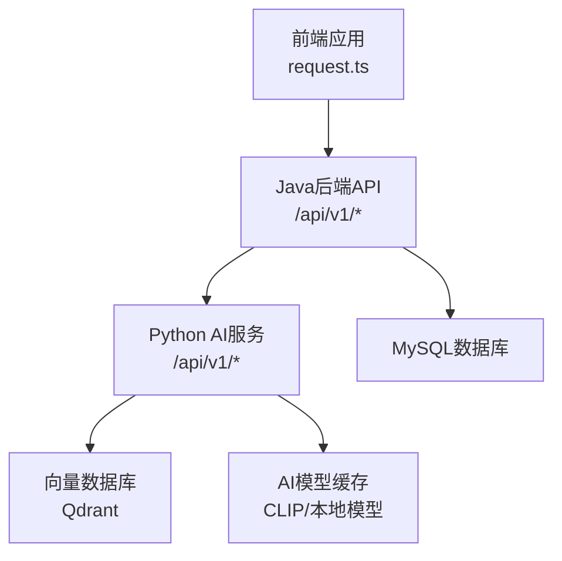
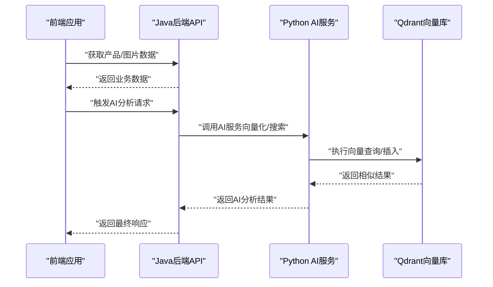
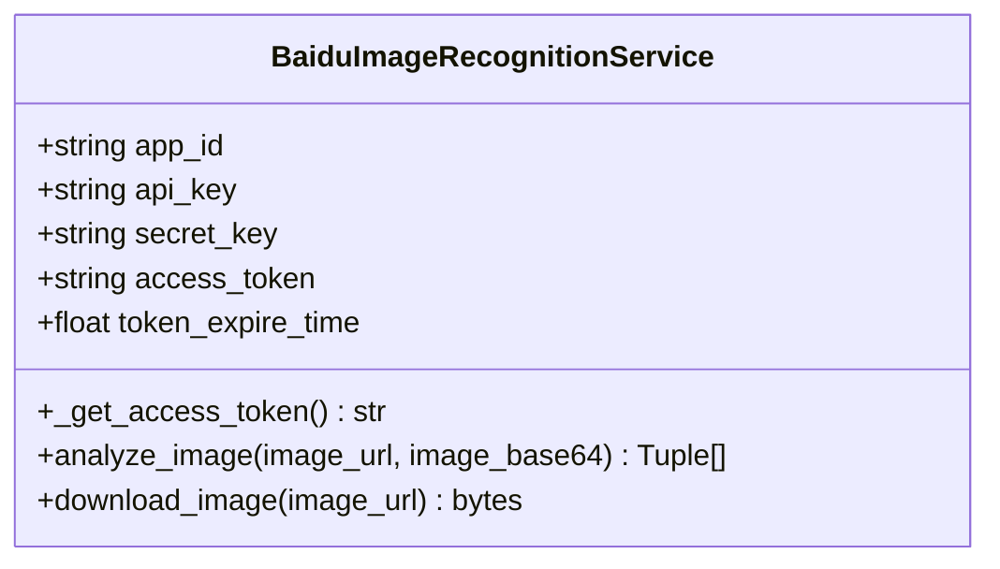
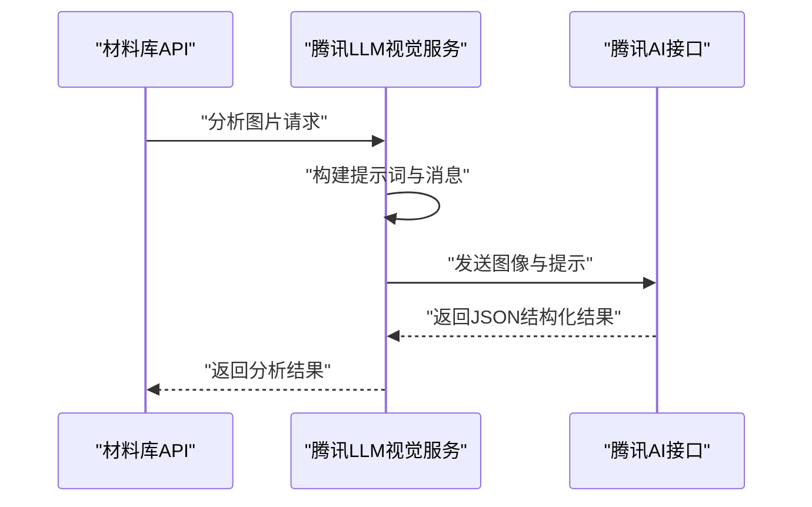
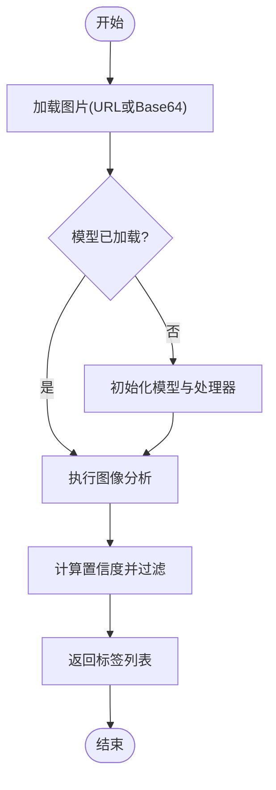
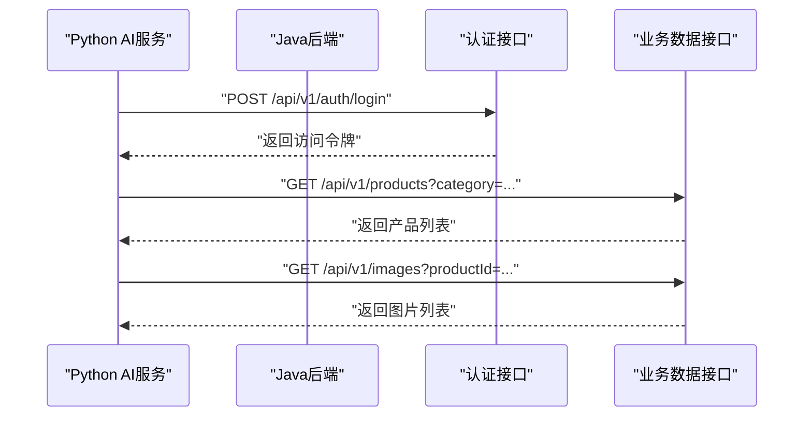
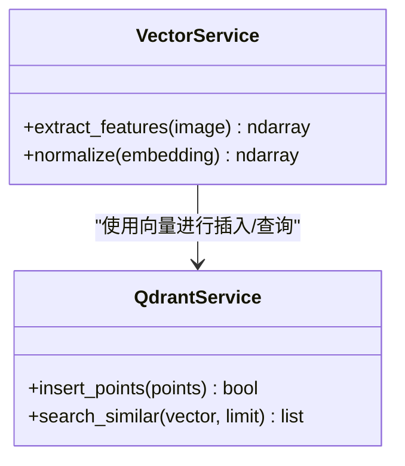
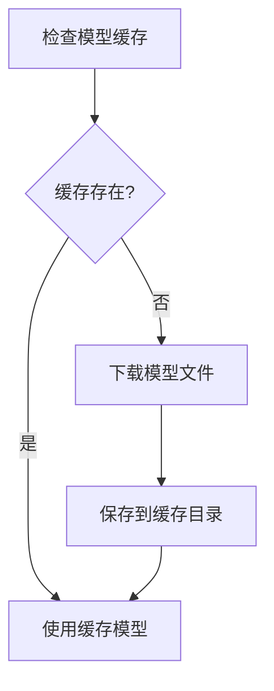
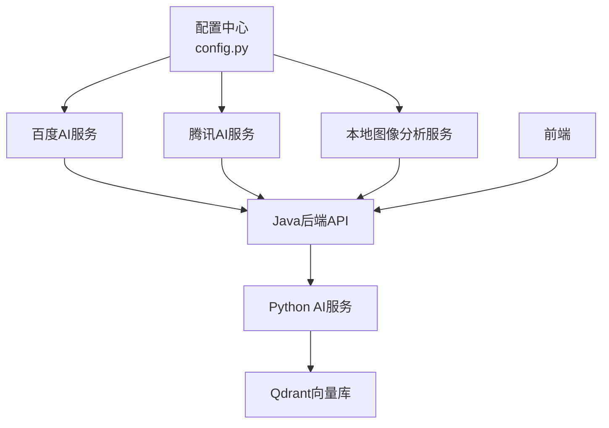

# AI模型集成

<cite>
**本文引用的文件**
- [baidu_image_recognition_service.py](file://backend/app/services/baidu_image_recognition_service.py)
- [tencent_llm_vision_service.py](file://backend/app/services/tencent_llm_vision_service.py)
- [image_analysis_service.py](file://backend/app/services/image_analysis_service.py)
- [material_library.py](file://backend/app/api/v1/material_library.py)
- [config.py](file://backend/app/config.py)
- [java_api_client.py](file://python-ai/app/clients/java_api_client.py)
- [qdrant_service.py](file://python-ai/app/services/qdrant_service.py)
- [vector_service.py](file://python-ai/app/services/vector_service.py)
- [ai_vector_processor.py](file://backend/app/services/ai_vector_processing/ai_vector_processor.py)
- [check_model_cache.py](file://backend/app/services/ai_vector_processing/check_model_cache.py)
- [download_model.py](file://backend/app/services/ai_vector_processing/download_model.py)
- [error_logger.py](file://scripts/utils/error_logger.py)
- [monitoring_service.py](file://backend/app/services/monitoring_service.py)
- [performance_monitor.py](file://backend/app/utils/performance_monitor.py)
- [timeout_middleware.py](file://scripts/utils/middleware/timeout_middleware.py)
- [Python-AI服务创建计划.md](file://docs/Python-AI服务创建计划.md)
- [架构设计文档-微服务分离方案.md](file://docs/架构设计文档-微服务分离方案.md)
- [request.ts](file://frontend/src/utils/request.ts)
</cite>

## 目录
1. [简介](#简介)
2. [项目结构](#项目结构)
3. [核心组件](#核心组件)
4. [架构概览](#架构概览)
5. [详细组件分析](#详细组件分析)
6. [依赖关系分析](#依赖关系分析)
7. [性能考虑](#性能考虑)
8. [故障排查指南](#故障排查指南)
9. [结论](#结论)
10. [附录](#附录)

## 简介
本技术指南面向思觉智贸的AI模型集成场景，系统性阐述如何在现有Java后端与Python AI服务之间建立稳定、可扩展的AI能力接入链路。重点覆盖以下方面：
- 多AI服务提供商集成：百度AI与腾讯AI的API接入与封装
- Java后端与Python AI服务的通信机制与数据交换格式
- API密钥管理、请求认证与错误处理策略
- 图像识别、文本分析与特征提取功能的实现路径
- 模型选择标准、性能评估与成本优化策略
- 模型版本管理、A/B测试与灰度发布流程
- 故障转移与降级策略，保障高可用
- 监控指标与性能调优方法

## 项目结构
项目采用前后端分离与微服务架构思路，AI能力主要分布在后端Python服务与Java后端之间协同工作：
- Java后端负责业务主流程与数据访问，提供API供前端与Python AI服务调用
- Python AI服务负责向量化、相似搜索与部分AI能力（后续逐步完善）
- 前端通过统一的HTTP客户端进行请求与错误处理

图表来源
- [架构设计文档-微服务分离方案.md](file://docs/架构设计文档-微服务分离方案.md)
- [request.ts](file://frontend/src/utils/request.ts)

章节来源
- [架构设计文档-微服务分离方案.md](file://docs/架构设计文档-微服务分离方案.md)
- [Python-AI服务创建计划.md](file://docs/Python-AI服务创建计划.md)

## 核心组件
本节梳理与AI集成直接相关的核心组件及其职责：
- 百度AI图像识别服务：封装百度AI的图像识别API，支持动物识别、菜品识别、地标识别、货币识别等
- 腾讯AI视觉服务：基于腾讯混元大模型进行图像内容分析，输出产品类型、主题、元素、文字与整体描述
- 本地图像分析服务：基于本地模型（如CLIP）进行图像元素识别与置信度分析
- Java API客户端：Python AI服务通过HTTP客户端调用Java后端获取业务数据
- 向量服务与Qdrant服务：负责图片向量化与相似搜索
- 模型缓存与下载：管理AI模型的版本、缓存与下载
- 监控与性能：提供性能监控与错误日志记录

章节来源
- [baidu_image_recognition_service.py](file://backend/app/services/baidu_image_recognition_service.py)
- [tencent_llm_vision_service.py](file://backend/app/services/tencent_llm_vision_service.py)
- [image_analysis_service.py](file://backend/app/services/image_analysis_service.py)
- [java_api_client.py](file://python-ai/app/clients/java_api_client.py)
- [qdrant_service.py](file://python-ai/app/services/qdrant_service.py)
- [vector_service.py](file://python-ai/app/services/vector_service.py)
- [ai_vector_processor.py](file://backend/app/services/ai_vector_processing/ai_vector_processor.py)
- [check_model_cache.py](file://backend/app/services/ai_vector_processing/check_model_cache.py)
- [download_model.py](file://backend/app/services/ai_vector_processing/download_model.py)
- [monitoring_service.py](file://backend/app/services/monitoring_service.py)

## 架构概览
下图展示了AI能力在系统中的整体交互流程：前端发起请求，Java后端提供业务数据与AI接口，Python AI服务负责向量化与相似搜索，同时可调用Java后端获取业务数据。

图表来源
- [架构设计文档-微服务分离方案.md](file://docs/架构设计文档-微服务分离方案.md)
- [material_library.py](file://backend/app/api/v1/material_library.py)

## 详细组件分析

### 百度AI图像识别服务
该服务封装了百度AI的图像识别能力，支持多类识别任务，并内置访问令牌管理与图片加载逻辑。

图表来源
- [baidu_image_recognition_service.py](file://backend/app/services/baidu_image_recognition_service.py)

章节来源
- [baidu_image_recognition_service.py](file://backend/app/services/baidu_image_recognition_service.py)

### 腾讯AI视觉服务（混元大模型）
该服务基于腾讯混元大模型进行图像内容分析，返回产品类型、主题、元素、文字与整体描述等结构化结果。

图表来源
- [tencent_llm_vision_service.py](file://backend/app/services/tencent_llm_vision_service.py)
- [material_library.py](file://backend/app/api/v1/material_library.py)

章节来源
- [tencent_llm_vision_service.py](file://backend/app/services/tencent_llm_vision_service.py)
- [material_library.py](file://backend/app/api/v1/material_library.py)

### 本地图像分析服务
该服务基于本地模型进行图像元素识别，支持返回带置信度的标签列表，并具备阈值过滤与设备选择能力。

图表来源
- [image_analysis_service.py](file://backend/app/services/image_analysis_service.py)

章节来源
- [image_analysis_service.py](file://backend/app/services/image_analysis_service.py)

### Java后端与Python AI服务通信
Python AI服务通过HTTP客户端调用Java后端，进行认证与数据获取；前端通过统一的HTTP客户端进行请求与错误处理。

图表来源
- [架构设计文档-微服务分离方案.md](file://docs/架构设计文档-微服务分离方案.md)
- [java_api_client.py](file://python-ai/app/clients/java_api_client.py)
- [request.ts](file://frontend/src/utils/request.ts)

章节来源
- [架构设计文档-微服务分离方案.md](file://docs/架构设计文档-微服务分离方案.md)
- [java_api_client.py](file://python-ai/app/clients/java_api_client.py)
- [request.ts](file://frontend/src/utils/request.ts)

### 向量服务与Qdrant服务
Python AI服务负责图片向量化与相似搜索，Qdrant作为向量数据库提供高效的相似度检索。

图表来源
- [vector_service.py](file://python-ai/app/services/vector_service.py)
- [qdrant_service.py](file://python-ai/app/services/qdrant_service.py)

章节来源
- [vector_service.py](file://python-ai/app/services/vector_service.py)
- [qdrant_service.py](file://python-ai/app/services/qdrant_service.py)

### 模型缓存与下载
Java后端提供模型缓存检查与下载功能，确保AI模型的可用性与版本一致性。

图表来源
- [check_model_cache.py](file://backend/app/services/ai_vector_processing/check_model_cache.py)
- [download_model.py](file://backend/app/services/ai_vector_processing/download_model.py)
- [ai_vector_processor.py](file://backend/app/services/ai_vector_processing/ai_vector_processor.py)

章节来源
- [check_model_cache.py](file://backend/app/services/ai_vector_processing/check_model_cache.py)
- [download_model.py](file://backend/app/services/ai_vector_processing/download_model.py)
- [ai_vector_processor.py](file://backend/app/services/ai_vector_processing/ai_vector_processor.py)

## 依赖关系分析
AI集成涉及的关键依赖关系如下：
- Java后端依赖Python AI服务进行向量化与相似搜索
- Python AI服务依赖Qdrant进行向量检索
- 前端通过HTTP客户端与后端交互，具备重试与错误上报机制
- 各AI服务依赖配置中心提供的密钥与参数

图表来源
- [config.py](file://backend/app/config.py)
- [baidu_image_recognition_service.py](file://backend/app/services/baidu_image_recognition_service.py)
- [tencent_llm_vision_service.py](file://backend/app/services/tencent_llm_vision_service.py)
- [image_analysis_service.py](file://backend/app/services/image_analysis_service.py)
- [material_library.py](file://backend/app/api/v1/material_library.py)

章节来源
- [config.py](file://backend/app/config.py)
- [material_library.py](file://backend/app/api/v1/material_library.py)

## 性能考虑
- 模型加载与设备选择：本地分析服务支持设备选择与模型加载，减少推理延迟
- 向量检索优化：Qdrant服务提供高效的相似度检索，建议合理设置索引与查询参数
- 网络与超时：前端HTTP客户端具备重试与超时配置，Java后端中间件提供超时保护
- 监控与日志：监控服务与性能监控工具提供实时指标，便于定位性能瓶颈

章节来源
- [image_analysis_service.py](file://backend/app/services/image_analysis_service.py)
- [qdrant_service.py](file://python-ai/app/services/qdrant_service.py)
- [request.ts](file://frontend/src/utils/request.ts)
- [timeout_middleware.py](file://scripts/utils/middleware/timeout_middleware.py)
- [monitoring_service.py](file://backend/app/services/monitoring_service.py)
- [performance_monitor.py](file://backend/app/utils/performance_monitor.py)

## 故障排查指南
- 错误分类与用户友好提示：错误日志工具提供错误类型映射，便于生成用户可理解的提示
- 日志记录与上报：前端在请求失败时自动上报错误日志，Java后端提供统一错误处理中间件
- 重试策略：前端HTTP客户端针对可重试状态码与错误类型进行指数退避重试
- 令牌与认证：Java后端提供认证接口，Python AI服务通过令牌访问受保护资源

章节来源
- [error_logger.py](file://scripts/utils/error_logger.py)
- [request.ts](file://frontend/src/utils/request.ts)
- [架构设计文档-微服务分离方案.md](file://docs/架构设计文档-微服务分离方案.md)

## 结论
本指南从架构、组件、通信机制、性能与故障处理等多个维度，系统阐述了思觉智贸的AI模型集成方案。通过明确的组件边界与数据流，结合完善的监控与错误处理策略，能够有效支撑图像识别、文本分析与特征提取等AI能力的稳定交付，并为后续的模型版本管理、A/B测试与灰度发布奠定基础。

## 附录
- API密钥管理与认证
  - 在配置中心集中管理各AI服务的密钥与参数
  - Java后端提供认证接口，前端与Python AI服务通过令牌访问受保护资源
- 数据交换格式
  - 统一使用JSON格式进行请求与响应
  - 图像数据支持URL与Base64两种输入方式
- 模型版本管理与A/B测试
  - 使用模型缓存与下载机制管理版本
  - 通过灰度发布逐步切换新模型，结合监控指标评估效果
- 成本优化策略
  - 合理设置阈值与Top-K参数，减少无效计算
  - 利用缓存与批量处理降低API调用频率