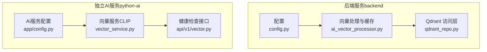
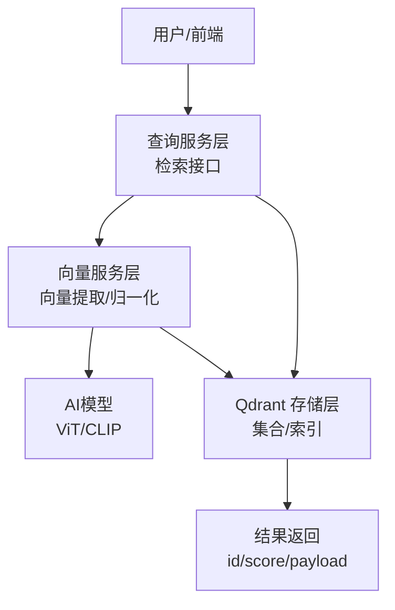
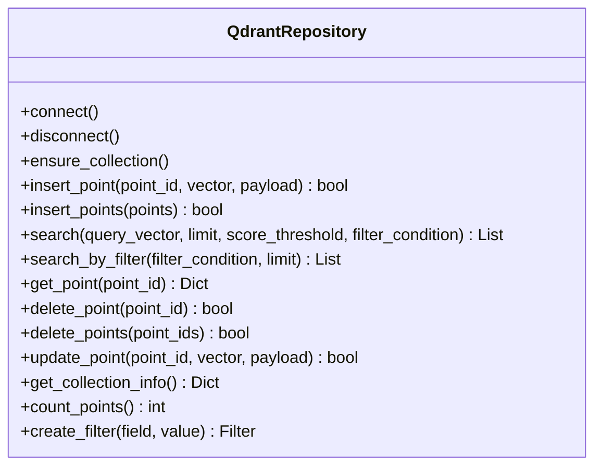
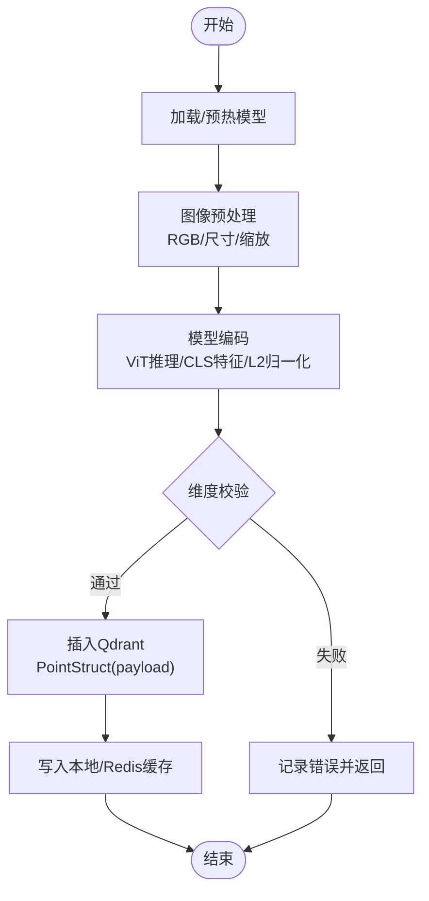
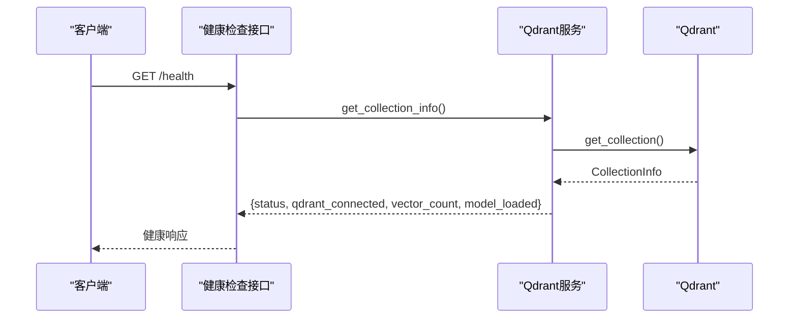
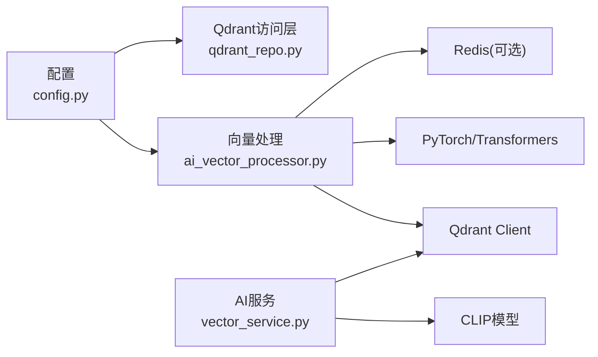

# 向量数据库设计

<cite>
**本文引用的文件**
- [backend/app/repositories/qdrant_repo.py](file://backend/app/repositories/qdrant_repo.py)
- [backend/app/services/ai_vector_processing/ai_vector_processor.py](file://backend/app/services/ai_vector_processing/ai_vector_processor.py)
- [backend/app/config.py](file://backend/app/config.py)
- [python-ai/app/config.py](file://python-ai/app/config.py)
- [python-ai/app/services/vector_service.py](file://python-ai/app/services/vector_service.py)
- [python-ai/app/api/v1/vector.py](file://python-ai/app/api/v1/vector.py)
</cite>

## 目录
1. [简介](#简介)
2. [项目结构](#项目结构)
3. [核心组件](#核心组件)
4. [架构总览](#架构总览)
5. [详细组件分析](#详细组件分析)
6. [依赖分析](#依赖分析)
7. [性能考虑](#性能考虑)
8. [故障排查指南](#故障排查指南)
9. [结论](#结论)
10. [附录](#附录)

## 简介
本技术文档面向“思觉智贸”向量数据库的设计与实现，聚焦于基于 Qdrant 的向量存储、索引与检索机制，覆盖向量维度设计、距离度量与相似性计算、批量插入/更新/删除流程、向量预处理与归一化策略、性能优化（索引选择、查询优化、内存管理）、以及与主系统的数据同步与一致性保障。文档以仓库中现有实现为依据，提供可操作的架构视图、流程图与时序图，并给出最佳实践建议。

## 项目结构
本项目包含两套向量相关实现：
- 后端 Python 实现（backend）：负责图像向量的编码、缓存与持久化到 Qdrant，提供批量构建缓存与增量同步能力。
- 独立 Python-AI 服务（python-ai）：提供向量服务与健康检查接口，支持 CLIP 模型向量提取与 Qdrant 连接。

图表来源
- [backend/app/config.py:86-93](file://backend/app/config.py#L86-L93)
- [backend/app/services/ai_vector_processing/ai_vector_processor.py:171-219](file://backend/app/services/ai_vector_processing/ai_vector_processor.py#L171-L219)
- [backend/app/repositories/qdrant_repo.py:14-56](file://backend/app/repositories/qdrant_repo.py#L14-L56)
- [python-ai/app/config.py:5-26](file://python-ai/app/config.py#L5-L26)
- [python-ai/app/services/vector_service.py:236-305](file://python-ai/app/services/vector_service.py#L236-L305)
- [python-ai/app/api/v1/vector.py:124-142](file://python-ai/app/api/v1/vector.py#L124-L142)

章节来源
- [backend/app/config.py:86-93](file://backend/app/config.py#L86-L93)
- [backend/app/services/ai_vector_processing/ai_vector_processor.py:171-219](file://backend/app/services/ai_vector_processing/ai_vector_processor.py#L171-L219)
- [backend/app/repositories/qdrant_repo.py:14-56](file://backend/app/repositories/qdrant_repo.py#L14-L56)
- [python-ai/app/config.py:5-26](file://python-ai/app/config.py#L5-L26)
- [python-ai/app/services/vector_service.py:236-305](file://python-ai/app/services/vector_service.py#L236-L305)
- [python-ai/app/api/v1/vector.py:124-142](file://python-ai/app/api/v1/vector.py#L124-L142)

## 核心组件
- Qdrant 访问层（backend）：封装 Qdrant 客户端连接、集合管理、点的插入/批量插入/更新/删除、检索与过滤检索、集合信息查询与统计。
- 向量处理与缓存（backend）：负责图像预处理、ViT 模型编码、向量归一化、本地/Redis 缓存、Qdrant 增量构建与一致性同步。
- AI 向量服务（python-ai）：提供 CLIP 模型向量提取、健康检查接口与 Qdrant 连接。
- 配置中心（backend/python-ai）：集中管理 Qdrant 地址、集合名、向量维度、距离度量、模型参数、缓存策略等。

章节来源
- [backend/app/repositories/qdrant_repo.py:14-56](file://backend/app/repositories/qdrant_repo.py#L14-L56)
- [backend/app/services/ai_vector_processing/ai_vector_processor.py:273-337](file://backend/app/services/ai_vector_processing/ai_vector_processor.py#L273-L337)
- [python-ai/app/services/vector_service.py:236-305](file://python-ai/app/services/vector_service.py#L236-L305)
- [backend/app/config.py:86-93](file://backend/app/config.py#L86-L93)
- [python-ai/app/config.py:5-26](file://python-ai/app/config.py#L5-L26)

## 架构总览
整体架构分为三层：
- 数据接入层：图像文件与元数据，经预处理与编码生成向量。
- 向量存储层：Qdrant 集合，按配置的向量维度与距离度量存储向量与 payload。
- 查询服务层：提供相似性检索、过滤检索与健康检查接口。

图表来源
- [backend/app/services/ai_vector_processing/ai_vector_processor.py:273-337](file://backend/app/services/ai_vector_processing/ai_vector_processor.py#L273-L337)
- [python-ai/app/services/vector_service.py:236-305](file://python-ai/app/services/vector_service.py#L236-L305)
- [backend/app/repositories/qdrant_repo.py:220-271](file://backend/app/repositories/qdrant_repo.py#L220-L271)

## 详细组件分析

### Qdrant 访问层（backend）
职责与能力：
- 连接管理：异步建立 Qdrant 客户端，超时控制，集合存在性检查与创建。
- 集合管理：根据配置创建集合，支持 Cosine/Euclid/Dot 距离度量。
- 点操作：单点/批量插入、更新、删除；检索与过滤检索；获取点详情、集合信息、统计点数。
- 过滤检索：通过零向量触发仅过滤的检索，便于只按 payload 条件筛选。

图表来源
- [backend/app/repositories/qdrant_repo.py:14-503](file://backend/app/repositories/qdrant_repo.py#L14-L503)

章节来源
- [backend/app/repositories/qdrant_repo.py:58-116](file://backend/app/repositories/qdrant_repo.py#L58-L116)
- [backend/app/repositories/qdrant_repo.py:118-130](file://backend/app/repositories/qdrant_repo.py#L118-L130)
- [backend/app/repositories/qdrant_repo.py:132-173](file://backend/app/repositories/qdrant_repo.py#L132-L173)
- [backend/app/repositories/qdrant_repo.py:174-218](file://backend/app/repositories/qdrant_repo.py#L174-L218)
- [backend/app/repositories/qdrant_repo.py:220-271](file://backend/app/repositories/qdrant_repo.py#L220-L271)
- [backend/app/repositories/qdrant_repo.py:272-313](file://backend/app/repositories/qdrant_repo.py#L272-L313)
- [backend/app/repositories/qdrant_repo.py:315-342](file://backend/app/repositories/qdrant_repo.py#L315-L342)
- [backend/app/repositories/qdrant_repo.py:344-388](file://backend/app/repositories/qdrant_repo.py#L344-L388)
- [backend/app/repositories/qdrant_repo.py:390-427](file://backend/app/repositories/qdrant_repo.py#L390-L427)
- [backend/app/repositories/qdrant_repo.py:429-449](file://backend/app/repositories/qdrant_repo.py#L429-L449)
- [backend/app/repositories/qdrant_repo.py:467-481](file://backend/app/repositories/qdrant_repo.py#L467-L481)
- [backend/app/repositories/qdrant_repo.py:482-503](file://backend/app/repositories/qdrant_repo.py#L482-L503)

### 向量处理与缓存（backend）
关键流程：
- 模型加载与预热：优先使用本地缓存，支持镜像源下载，GPU 半精度优化，预热减少首帧延迟。
- 图像预处理：统一 RGB 转换、尺寸校正、缩放，规避通道与尺寸异常。
- 向量编码：ViT 模型推理，提取 CLS 特征，L2 归一化，维度校验，GPU/CPU 自适应。
- 缓存策略：本地内存缓存（TTL/容量），可选 Redis 二级缓存，异步写入。
- Qdrant 同步：前置去重（按唯一 ID 检索），编码档案校验，批量增量构建缓存，资源限制与分批处理。

图表来源
- [backend/app/services/ai_vector_processing/ai_vector_processor.py:58-169](file://backend/app/services/ai_vector_processing/ai_vector_processor.py#L58-L169)
- [backend/app/services/ai_vector_processing/ai_vector_processor.py:231-271](file://backend/app/services/ai_vector_processing/ai_vector_processor.py#L231-L271)
- [backend/app/services/ai_vector_processing/ai_vector_processor.py:273-337](file://backend/app/services/ai_vector_processing/ai_vector_processor.py#L273-L337)
- [backend/app/services/ai_vector_processing/ai_vector_processor.py:418-502](file://backend/app/services/ai_vector_processing/ai_vector_processor.py#L418-L502)
- [backend/app/services/ai_vector_processing/ai_vector_processor.py:504-573](file://backend/app/services/ai_vector_processing/ai_vector_processor.py#L504-L573)

章节来源
- [backend/app/services/ai_vector_processing/ai_vector_processor.py:58-169](file://backend/app/services/ai_vector_processing/ai_vector_processor.py#L58-L169)
- [backend/app/services/ai_vector_processing/ai_vector_processor.py:231-337](file://backend/app/services/ai_vector_processing/ai_vector_processor.py#L231-L337)
- [backend/app/services/ai_vector_processing/ai_vector_processor.py:418-502](file://backend/app/services/ai_vector_processing/ai_vector_processor.py#L418-L502)
- [backend/app/services/ai_vector_processing/ai_vector_processor.py:504-573](file://backend/app/services/ai_vector_processing/ai_vector_processor.py#L504-L573)

### AI 向量服务（python-ai）
能力概览：
- 向量服务：加载 CLIP 模型，从图像路径或字节流提取向量，支持 L2 归一化与模拟向量回退。
- 健康检查：连接 Qdrant，返回集合状态与向量数量，指示模型加载状态。

图表来源
- [python-ai/app/api/v1/vector.py:124-142](file://python-ai/app/api/v1/vector.py#L124-L142)
- [python-ai/app/services/vector_service.py:236-305](file://python-ai/app/services/vector_service.py#L236-L305)

章节来源
- [python-ai/app/api/v1/vector.py:124-142](file://python-ai/app/api/v1/vector.py#L124-L142)
- [python-ai/app/services/vector_service.py:236-305](file://python-ai/app/services/vector_service.py#L236-L305)

## 依赖分析
- 配置驱动：Qdrant 主机、端口、集合名、向量维度、距离度量、模型参数、缓存 TTL/容量、批次限制等均来自配置文件，避免硬编码。
- 模块耦合：向量处理模块依赖配置模块与 Qdrant 客户端；Qdrant 访问层依赖 Qdrant 客户端模型；AI 服务依赖 CLIP 模型与 Qdrant 客户端。
- 外部依赖：PyTorch、Transformers、Qdrant Client、Redis（可选）。

图表来源
- [backend/app/config.py:86-93](file://backend/app/config.py#L86-L93)
- [backend/app/services/ai_vector_processing/ai_vector_processor.py:35-48](file://backend/app/services/ai_vector_processing/ai_vector_processor.py#L35-L48)
- [backend/app/repositories/qdrant_repo.py:1-6](file://backend/app/repositories/qdrant_repo.py#L1-L6)
- [python-ai/app/config.py:5-26](file://python-ai/app/config.py#L5-L26)
- [python-ai/app/services/vector_service.py:236-305](file://python-ai/app/services/vector_service.py#L236-L305)

章节来源
- [backend/app/config.py:86-93](file://backend/app/config.py#L86-L93)
- [backend/app/services/ai_vector_processing/ai_vector_processor.py:35-48](file://backend/app/services/ai_vector_processing/ai_vector_processor.py#L35-L48)
- [backend/app/repositories/qdrant_repo.py:1-6](file://backend/app/repositories/qdrant_repo.py#L1-L6)
- [python-ai/app/config.py:5-26](file://python-ai/app/config.py#L5-L26)
- [python-ai/app/services/vector_service.py:236-305](file://python-ai/app/services/vector_service.py#L236-L305)

## 性能考虑
- 索引与检索参数
  - 检索参数：使用 HNSW 并设置 ef 值，exact=false 以提升吞吐；支持 score_threshold 过滤低分结果。
  - 集合参数：根据向量维度与距离度量创建集合；可配置 HNSW 构建参数与优化器阈值。
- 设备与精度
  - GPU 可用时启用半精度（FP16），并开启 TF32 与 cuDNN benchmark；预热模型减少首帧延迟。
- 缓存策略
  - 本地内存缓存（TTL/容量控制），可选 Redis 二级缓存，异步写入降低请求阻塞。
- 批处理与资源控制
  - 批次限制与延时释放，避免高负载；批量插入与增量构建缓存，减少重复处理。
- 数据预处理
  - 固定输入尺寸、统一 RGB、缩放策略，确保编码一致性与性能稳定。

章节来源
- [backend/app/repositories/qdrant_repo.py:245-254](file://backend/app/repositories/qdrant_repo.py#L245-L254)
- [backend/app/repositories/qdrant_repo.py:103-109](file://backend/app/repositories/qdrant_repo.py#L103-L109)
- [backend/app/services/ai_vector_processing/ai_vector_processor.py:104-125](file://backend/app/services/ai_vector_processing/ai_vector_processor.py#L104-L125)
- [backend/app/services/ai_vector_processing/ai_vector_processor.py:140-165](file://backend/app/services/ai_vector_processing/ai_vector_processor.py#L140-L165)
- [backend/app/services/ai_vector_processing/ai_vector_processor.py:605-637](file://backend/app/services/ai_vector_processing/ai_vector_processor.py#L605-L637)
- [backend/app/services/ai_vector_processing/ai_vector_processor.py:504-573](file://backend/app/services/ai_vector_processing/ai_vector_processor.py#L504-L573)
- [backend/app/services/ai_vector_processing/ai_vector_processor.py:231-271](file://backend/app/services/ai_vector_processing/ai_vector_processor.py#L231-L271)

## 故障排查指南
- 连接与集合
  - 检查 Qdrant 地址/端口与网络连通性；确认集合存在且向量维度与距离度量配置一致。
  - 若创建集合失败，查看日志定位具体异常并重试。
- 模型加载
  - 本地缓存不可用时检查镜像源与网络；确认缓存目录权限与空间；必要时手动下载模型。
  - GPU 半精度失败时回退全精度；预热失败不影响使用但会影响首次推理速度。
- 编码与维度
  - 维度不匹配时检查模型输入尺寸与配置；确保预处理步骤正确执行。
- 缓存与一致性
  - 本地/Redis 缓存读写失败时检查 TTL/容量与连接参数；确认编码档案与 Qdrant 同步。
- 检索与过滤
  - 过滤条件构造错误会导致检索异常；使用便捷方法创建 Filter 并核对字段名与值类型。

章节来源
- [backend/app/repositories/qdrant_repo.py:80-82](file://backend/app/repositories/qdrant_repo.py#L80-L82)
- [backend/app/repositories/qdrant_repo.py:114-116](file://backend/app/repositories/qdrant_repo.py#L114-L116)
- [backend/app/services/ai_vector_processing/ai_vector_processor.py:65-100](file://backend/app/services/ai_vector_processing/ai_vector_processor.py#L65-L100)
- [backend/app/services/ai_vector_processing/ai_vector_processor.py:163-165](file://backend/app/services/ai_vector_processing/ai_vector_processor.py#L163-L165)
- [backend/app/services/ai_vector_processing/ai_vector_processor.py:316-321](file://backend/app/services/ai_vector_processing/ai_vector_processor.py#L316-L321)
- [backend/app/repositories/qdrant_repo.py:482-503](file://backend/app/repositories/qdrant_repo.py#L482-L503)

## 结论
本设计以配置为中心，结合模型预热、多级缓存与批量增量构建策略，在保证检索性能的同时兼顾了可维护性与可扩展性。通过明确的距离度量与检索参数配置，以及严格的维度校验与归一化流程，确保向量质量与一致性。建议在生产环境中持续监控 GPU/CPU 利用率、Qdrant 集合状态与缓存命中率，并根据业务规模动态调整批次大小与索引参数。

## 附录

### 向量维度与距离度量
- 向量维度：来源于配置，用于集合创建与编码输出校验。
- 距离度量：支持 Cosine、Euclid、Dot，映射为 Qdrant Distance 枚举。

章节来源
- [backend/app/config.py:91](file://backend/app/config.py#L91)
- [backend/app/repositories/qdrant_repo.py:118-130](file://backend/app/repositories/qdrant_repo.py#L118-L130)

### 相似性度量与检索流程
- 相似性：由距离度量决定，检索时可设置阈值与过滤条件。
- 流程：查询向量预处理 → 检索 → 结果格式化返回。

章节来源
- [backend/app/repositories/qdrant_repo.py:220-271](file://backend/app/repositories/qdrant_repo.py#L220-L271)

### 批量向量插入/更新/删除
- 插入：单点与批量插入，自动转换数组与列表。
- 更新：支持仅更新向量或仅更新 payload。
- 删除：单点与批量删除。

章节来源
- [backend/app/repositories/qdrant_repo.py:132-173](file://backend/app/repositories/qdrant_repo.py#L132-L173)
- [backend/app/repositories/qdrant_repo.py:174-218](file://backend/app/repositories/qdrant_repo.py#L174-L218)
- [backend/app/repositories/qdrant_repo.py:344-388](file://backend/app/repositories/qdrant_repo.py#L344-L388)
- [backend/app/repositories/qdrant_repo.py:390-427](file://backend/app/repositories/qdrant_repo.py#L390-L427)

### 数据预处理、归一化与压缩策略
- 预处理：统一 RGB、固定尺寸、缩放。
- 归一化：L2 归一化，避免数值溢出。
- 压缩：半精度（FP16）在 GPU 上使用，降低显存占用。

章节来源
- [backend/app/services/ai_vector_processing/ai_vector_processor.py:231-271](file://backend/app/services/ai_vector_processing/ai_vector_processor.py#L231-L271)
- [backend/app/services/ai_vector_processing/ai_vector_processor.py:310-317](file://backend/app/services/ai_vector_processing/ai_vector_processor.py#L310-L317)
- [backend/app/services/ai_vector_processing/ai_vector_processor.py:114-121](file://backend/app/services/ai_vector_processing/ai_vector_processor.py#L114-L121)

### 与主系统的数据同步与一致性
- 唯一标识：基于文件路径与修改时间生成唯一 ID，避免重复处理。
- 前置去重：先检索 Qdrant，存在即跳过。
- 编码档案：同步成功后再写入档案，确保档案与 Qdrant 一致。
- 增量构建：遍历缩略图目录，分批处理并释放资源。

章节来源
- [backend/app/services/ai_vector_processing/ai_vector_processor.py:339-382](file://backend/app/services/ai_vector_processing/ai_vector_processor.py#L339-L382)
- [backend/app/services/ai_vector_processing/ai_vector_processor.py:418-502](file://backend/app/services/ai_vector_processing/ai_vector_processor.py#L418-L502)
- [backend/app/services/ai_vector_processing/ai_vector_processor.py:504-573](file://backend/app/services/ai_vector_processing/ai_vector_processor.py#L504-L573)