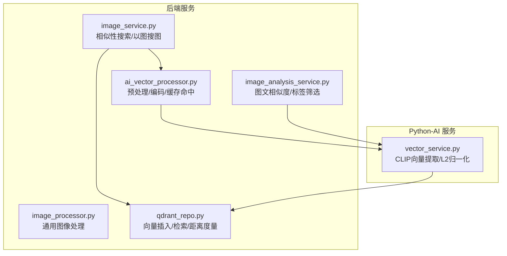
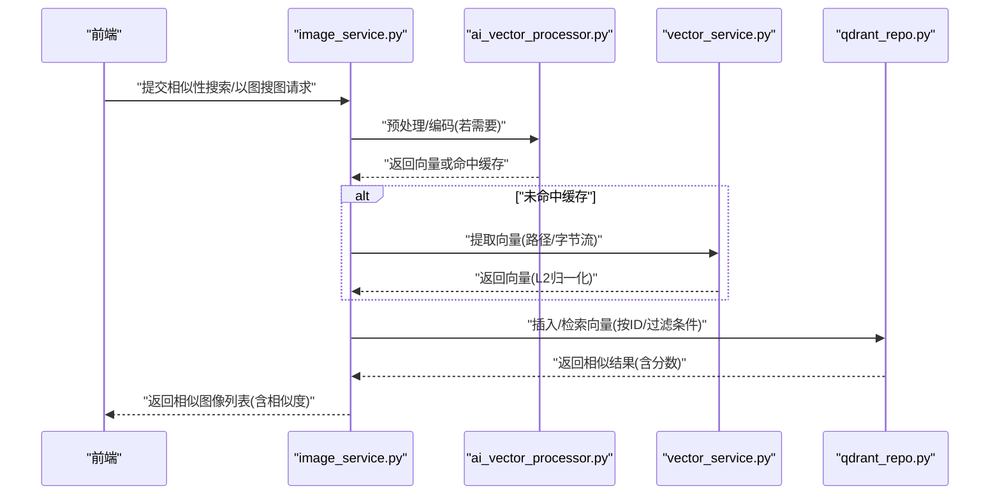
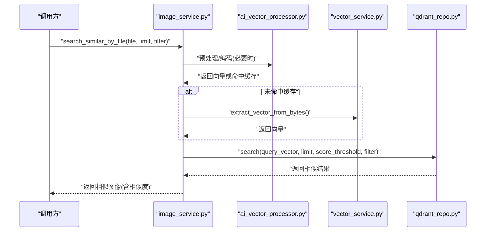
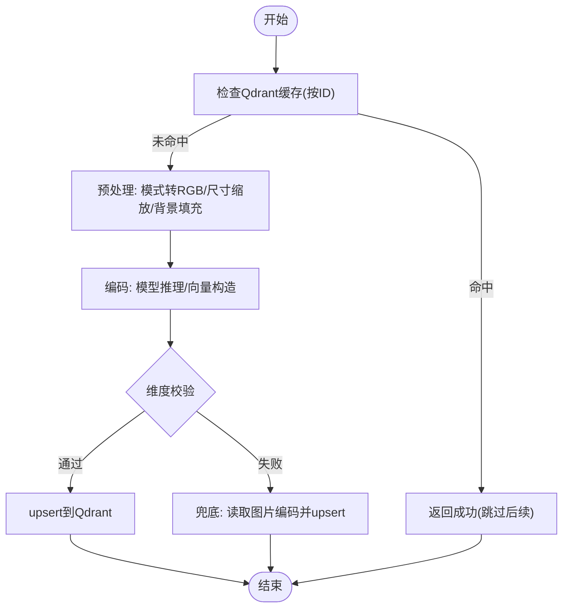
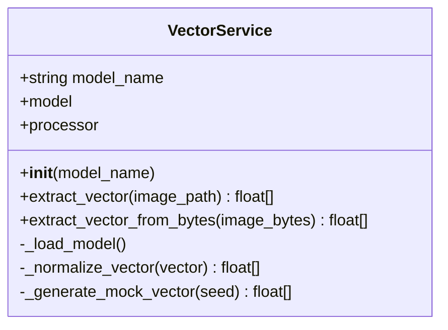
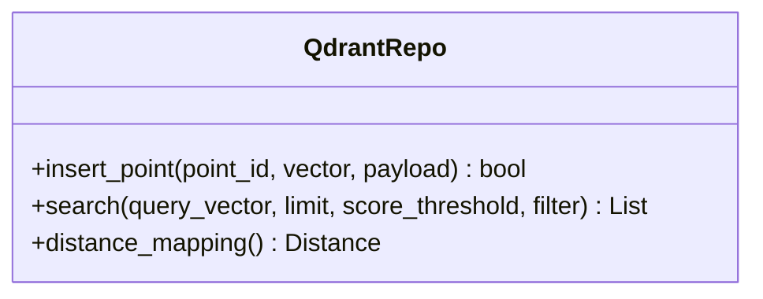
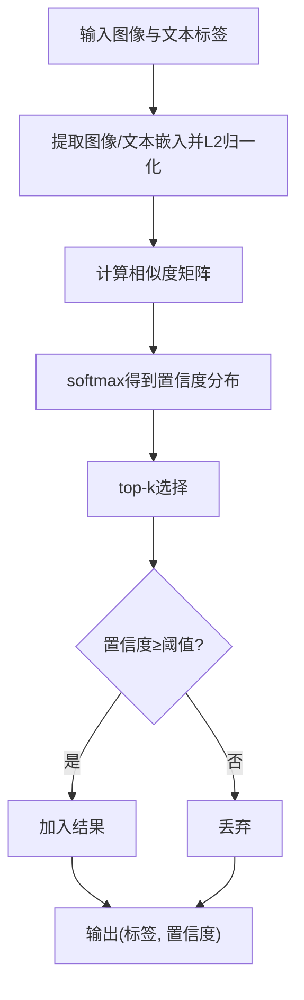
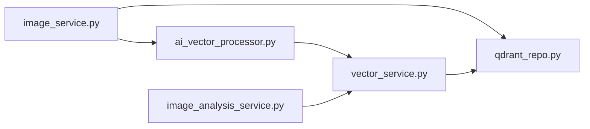

# 图像处理算法

<cite>
**本文引用的文件**
- [backend/app/services/image_service.py](file://backend/app/services/image_service.py)
- [backend/app/services/ai_vector_processing/ai_vector_processor.py](file://backend/app/services/ai_vector_processing/ai_vector_processor.py)
- [python-ai/app/services/vector_service.py](file://python-ai/app/services/vector_service.py)
- [backend/app/repositories/qdrant_repo.py](file://backend/app/repositories/qdrant_repo.py)
- [backend/app/utils/image_processor.py](file://backend/app/utils/image_processor.py)
- [backend/app/services/image_analysis_service.py](file://backend/app/services/image_analysis_service.py)
- [docs/Python-AI服务创建计划.md](file://docs/Python-AI服务创建计划.md)
</cite>

## 目录
1. [引言](#引言)
2. [项目结构](#项目结构)
3. [核心组件](#核心组件)
4. [架构总览](#架构总览)
5. [详细组件分析](#详细组件分析)
6. [依赖关系分析](#依赖关系分析)
7. [性能考量](#性能考量)
8. [故障排查指南](#故障排查指南)
9. [结论](#结论)
10. [附录](#附录)

## 引言
本技术文档面向“思觉智贸”图像处理算法体系，聚焦图像识别、特征提取与相似性分析的关键实现。文档覆盖图像预处理流程（尺寸调整、色彩校正、噪声抑制）、特征向量生成与归一化、相似度计算（余弦相似度、欧几里得距离、内积）以及图像质量评估与去重策略。同时给出批量处理的并发策略、性能优化建议、缓存与增量更新方案，并提供针对多格式图像的处理示例路径与最佳实践。

## 项目结构
后端采用分层架构，图像相关能力主要分布在以下模块：
- 图像服务层：负责相似性搜索、以图搜图、向量提取入口与结果组装
- AI 向量处理层：提供高性能预处理、编码与缓存命中判断
- Python-AI 服务：基于 CLIP 的向量提取与归一化
- Qdrant 存储层：向量插入、检索与距离度量配置
- 工具层：通用图像处理与预处理工具
- 图像分析服务：图文相似度评分与标签筛选

**图表来源**
- [backend/app/services/image_service.py:551-663](file://backend/app/services/image_service.py#L551-L663)
- [backend/app/services/ai_vector_processing/ai_vector_processor.py:229-441](file://backend/app/services/ai_vector_processing/ai_vector_processor.py#L229-L441)
- [python-ai/app/services/vector_service.py:38-95](file://python-ai/app/services/vector_service.py#L38-L95)
- [backend/app/repositories/qdrant_repo.py:126-173](file://backend/app/repositories/qdrant_repo.py#L126-L173)
- [backend/app/utils/image_processor.py](file://backend/app/utils/image_processor.py)
- [backend/app/services/image_analysis_service.py:380-452](file://backend/app/services/image_analysis_service.py#L380-L452)

**章节来源**
- [backend/app/services/image_service.py:551-663](file://backend/app/services/image_service.py#L551-L663)
- [backend/app/services/ai_vector_processing/ai_vector_processor.py:229-441](file://backend/app/services/ai_vector_processing/ai_vector_processor.py#L229-L441)
- [python-ai/app/services/vector_service.py:38-95](file://python-ai/app/services/vector_service.py#L38-L95)
- [backend/app/repositories/qdrant_repo.py:126-173](file://backend/app/repositories/qdrant_repo.py#L126-L173)
- [backend/app/utils/image_processor.py](file://backend/app/utils/image_processor.py)
- [backend/app/services/image_analysis_service.py:380-452](file://backend/app/services/image_analysis_service.py#L380-L452)

## 核心组件
- 图像相似性搜索服务：封装 Qdrant 检索、过滤与结果组装，支持按 ID 与文件两种方式触发
- AI 向量处理器：统一的预处理与编码流程，含缓存命中、格式校验、尺寸与模式标准化
- Python-AI 向量服务：基于 CLIP 的特征提取与 L2 归一化，提供字节流与路径两种输入
- Qdrant 存储：支持多种距离度量（余弦/欧几里得/点积），提供插入与 upsert
- 图像分析服务：图文相似度打分、Top-K 标签筛选与置信度阈值过滤
- 通用图像处理工具：尺寸缩放、模式转换、背景填充等

**章节来源**
- [backend/app/services/image_service.py:551-663](file://backend/app/services/image_service.py#L551-L663)
- [backend/app/services/ai_vector_processing/ai_vector_processor.py:229-441](file://backend/app/services/ai_vector_processing/ai_vector_processor.py#L229-L441)
- [python-ai/app/services/vector_service.py:38-95](file://python-ai/app/services/vector_service.py#L38-L95)
- [backend/app/repositories/qdrant_repo.py:126-173](file://backend/app/repositories/qdrant_repo.py#L126-L173)
- [backend/app/services/image_analysis_service.py:380-452](file://backend/app/services/image_analysis_service.py#L380-L452)

## 架构总览
整体流程：前端上传/选择图像 → 后端触发相似性搜索或以图搜图 → AI 向量处理器进行预处理与编码 → Python-AI 服务补充向量（若未命中）→ 结果写入/查询 Qdrant → 返回相似图像与相似度分数。

**图表来源**
- [backend/app/services/image_service.py:551-663](file://backend/app/services/image_service.py#L551-L663)
- [backend/app/services/ai_vector_processing/ai_vector_processor.py:229-441](file://backend/app/services/ai_vector_processing/ai_vector_processor.py#L229-L441)
- [python-ai/app/services/vector_service.py:38-95](file://python-ai/app/services/vector_service.py#L38-L95)
- [backend/app/repositories/qdrant_repo.py:126-173](file://backend/app/repositories/qdrant_repo.py#L126-L173)

## 详细组件分析

### 组件A：图像相似性搜索与以图搜图
- 功能要点
  - 支持按图像 ID 与文件路径两种方式发起相似性搜索
  - 使用 Qdrant 检索，支持过滤条件与分数阈值
  - 过滤自身 ID，组装相似度分数并返回图像详情
- 关键流程
  - 输入校验与向量准备
  - 调用 Qdrant 搜索接口
  - 结果去重与相似度回填
  - 日志记录与异常处理

**图表来源**
- [backend/app/services/image_service.py:584-649](file://backend/app/services/image_service.py#L584-L649)
- [backend/app/services/ai_vector_processing/ai_vector_processor.py:229-441](file://backend/app/services/ai_vector_processing/ai_vector_processor.py#L229-L441)
- [python-ai/app/services/vector_service.py:46-95](file://python-ai/app/services/vector_service.py#L46-L95)
- [backend/app/repositories/qdrant_repo.py:126-173](file://backend/app/repositories/qdrant_repo.py#L126-L173)

**章节来源**
- [backend/app/services/image_service.py:551-663](file://backend/app/services/image_service.py#L551-L663)

### 组件B：AI 向量处理器（预处理/编码/缓存）
- 功能要点
  - 快速预处理：统一模式(RGB)、尺寸缩放、背景填充、通道修复
  - 编码流程：固定目标尺寸、模型输入构建、特征提取与向量归一化
  - 缓存命中：基于缩略图路径生成唯一 ID，优先查询 Qdrant，避免重复编码
  - 兜底策略：若 Qdrant 缺失但档案存在，直接读取图片编码并 upsert
- 关键流程
  - 预处理：模式转换、尺寸校验、缩放
  - 编码：模型加载、推理、向量构造
  - 缓存：ID 生成、Qdrant 检索、upsert

**图表来源**
- [backend/app/services/ai_vector_processing/ai_vector_processor.py:229-441](file://backend/app/services/ai_vector_processing/ai_vector_processor.py#L229-L441)
- [backend/app/repositories/qdrant_repo.py:126-173](file://backend/app/repositories/qdrant_repo.py#L126-L173)

**章节来源**
- [backend/app/services/ai_vector_processing/ai_vector_processor.py:229-441](file://backend/app/services/ai_vector_processing/ai_vector_processor.py#L229-L441)

### 组件C：Python-AI 向量服务（CLIP 特征提取）
- 功能要点
  - 加载 CLIP 模型与处理器，支持路径与字节流两种输入
  - 特征提取后进行 L2 归一化，保证向量单位长度
  - 异常时生成模拟向量，保障系统可用性
- 关键流程
  - 模型加载与降级
  - 图像解码与预处理
  - 推理与向量归一化
  - 模拟向量生成

**图表来源**
- [python-ai/app/services/vector_service.py:38-95](file://python-ai/app/services/vector_service.py#L38-L95)
- [docs/Python-AI服务创建计划.md:223-305](file://docs/Python-AI服务创建计划.md#L223-L305)

**章节来源**
- [python-ai/app/services/vector_service.py:38-95](file://python-ai/app/services/vector_service.py#L38-L95)
- [docs/Python-AI服务创建计划.md:223-305](file://docs/Python-AI服务创建计划.md#L223-L305)

### 组件D：Qdrant 存储（插入/检索/距离度量）
- 功能要点
  - 插入/更新向量点，支持 payload 扩展
  - 检索支持多种距离度量（余弦/欧几里得/点积）
  - upsert 保证幂等性
- 关键流程
  - 向量类型转换
  - PointStruct 构造
  - upsert/检索调用

**图表来源**
- [backend/app/repositories/qdrant_repo.py:126-173](file://backend/app/repositories/qdrant_repo.py#L126-L173)

**章节来源**
- [backend/app/repositories/qdrant_repo.py:126-173](file://backend/app/repositories/qdrant_repo.py#L126-L173)

### 组件E：图像分析服务（图文相似度与标签筛选）
- 功能要点
  - 图像嵌入与文本嵌入 L2 归一化
  - 余弦相似度计算与 softmax 置信度
  - Top-K 选择与最小置信度阈值过滤
- 关键流程
  - 嵌入归一化
  - 相似度矩阵计算
  - 置信度排序与阈值过滤

**图表来源**
- [backend/app/services/image_analysis_service.py:380-452](file://backend/app/services/image_analysis_service.py#L380-L452)

**章节来源**
- [backend/app/services/image_analysis_service.py:380-452](file://backend/app/services/image_analysis_service.py#L380-L452)

## 依赖关系分析
- 组件耦合
  - image_service 依赖 ai_vector_processor 与 qdrant_repo
  - ai_vector_processor 依赖 Python-AI vector_service 作为兜底
  - image_analysis_service 依赖 vector_service 进行图文相似度
- 外部依赖
  - PIL/Pillow：图像解码、模式转换、缩放
  - Transformers/CLIP：特征提取
  - Qdrant Client：向量插入与检索
- 潜在循环依赖
  - 当前模块间为单向依赖，无明显循环

**图表来源**
- [backend/app/services/image_service.py:551-663](file://backend/app/services/image_service.py#L551-L663)
- [backend/app/services/ai_vector_processing/ai_vector_processor.py:229-441](file://backend/app/services/ai_vector_processing/ai_vector_processor.py#L229-L441)
- [python-ai/app/services/vector_service.py:38-95](file://python-ai/app/services/vector_service.py#L38-L95)
- [backend/app/repositories/qdrant_repo.py:126-173](file://backend/app/repositories/qdrant_repo.py#L126-L173)
- [backend/app/services/image_analysis_service.py:380-452](file://backend/app/services/image_analysis_service.py#L380-L452)

**章节来源**
- [backend/app/services/image_service.py:551-663](file://backend/app/services/image_service.py#L551-L663)
- [backend/app/services/ai_vector_processing/ai_vector_processor.py:229-441](file://backend/app/services/ai_vector_processing/ai_vector_processor.py#L229-L441)
- [python-ai/app/services/vector_service.py:38-95](file://python-ai/app/services/vector_service.py#L38-L95)
- [backend/app/repositories/qdrant_repo.py:126-173](file://backend/app/repositories/qdrant_repo.py#L126-L173)
- [backend/app/services/image_analysis_service.py:380-452](file://backend/app/services/image_analysis_service.py#L380-L452)

## 性能考量
- 预处理与编码
  - 固定目标尺寸与 RGB 模式减少模型输入差异，提升批处理一致性
  - 缓存命中优先，避免重复编码
- 检索性能
  - Qdrant upsert 幂等，支持大规模增量更新
  - 距离度量可按业务选择（余弦/欧几里得/点积）
- 批量处理
  - 建议使用队列与并发任务，结合限流与超时控制
  - 对于高并发场景，考虑分片与分区策略
- 内存与显存
  - 模型推理建议使用 eval 模式与合适的 batch size
  - 向量归一化与 numpy 操作尽量在 CPU 上完成，避免不必要的 GPU/CPU 切换

[本节为通用性能指导，不直接分析具体文件]

## 故障排查指南
- 常见问题
  - 图像模式异常：RGBA/CMYK/灰度等需转换为 RGB
  - 尺寸异常：宽高必须大于 0，避免 1x1
  - 向量维度不匹配：确保与模型输出一致
  - Qdrant 查询异常：检查集合是否存在、ID 是否正确
- 定位手段
  - 查看日志：各模块均包含错误日志与调试日志
  - 分段验证：逐段断点验证预处理、编码、插入与检索
  - 降级策略：模型加载失败时使用模拟向量保证服务可用
- 建议
  - 在预处理阶段集中处理异常，尽早失败
  - 对外部依赖（Qdrant/CLIP）增加重试与熔断

**章节来源**
- [backend/app/services/ai_vector_processing/ai_vector_processor.py:229-441](file://backend/app/services/ai_vector_processing/ai_vector_processor.py#L229-L441)
- [python-ai/app/services/vector_service.py:38-95](file://python-ai/app/services/vector_service.py#L38-L95)
- [backend/app/repositories/qdrant_repo.py:126-173](file://backend/app/repositories/qdrant_repo.py#L126-L173)

## 结论
本算法体系以“预处理-编码-存储-检索-结果组装”为主线，结合缓存命中与兜底策略，实现了高效稳定的图像相似性分析能力。通过 CLIP 特征提取与 Qdrant 向量检索，系统具备良好的扩展性与鲁棒性；同时提供图文相似度评分与标签筛选能力，满足多场景应用需求。

## 附录

### 图像预处理流程（尺寸调整、色彩校正、噪声去除）
- 尺寸调整：按最大边缩放到目标尺寸，保持纵横比
- 色彩校正：统一转换为 RGB，必要时进行背景填充
- 噪声去除：当前实现以模式转换与缩放为主，可结合中值滤波或双边滤波进一步优化

**章节来源**
- [backend/app/services/ai_vector_processing/ai_vector_processor.py:229-441](file://backend/app/services/ai_vector_processing/ai_vector_processor.py#L229-L441)

### 特征向量生成与向量化表示
- CLIP 特征：使用 CLIP 模型提取图像特征，随后进行 L2 归一化
- 向量维度：固定维度（如 512），确保检索一致性
- 模拟向量：模型加载失败时生成模拟向量，保障系统可用性

**章节来源**
- [python-ai/app/services/vector_service.py:38-95](file://python-ai/app/services/vector_service.py#L38-L95)
- [docs/Python-AI服务创建计划.md:223-305](file://docs/Python-AI服务创建计划.md#L223-L305)

### 相似度计算算法
- 余弦相似度：通过 L2 归一化后的向量点积计算
- 欧几里得距离：向量差的范数，越小越相似
- 内积（点积）：直接使用点积，适合已归一化的向量

**章节来源**
- [backend/app/repositories/qdrant_repo.py:126-173](file://backend/app/repositories/qdrant_repo.py#L126-L173)
- [backend/app/services/image_analysis_service.py:380-452](file://backend/app/services/image_analysis_service.py#L380-L452)

### 图像质量评估与去重
- 质量评估：可通过直方图均衡、锐度检测、清晰度评分等指标扩展
- 去重策略：基于向量相似度阈值与 ID 去重，结合缓存命中避免重复处理

**章节来源**
- [backend/app/services/image_service.py:551-663](file://backend/app/services/image_service.py#L551-L663)
- [backend/app/services/ai_vector_processing/ai_vector_processor.py:229-441](file://backend/app/services/ai_vector_processing/ai_vector_processor.py#L229-L441)

### 批量图像处理的并发策略与性能优化
- 并发策略：Celery 任务队列 + 限流 + 超时控制
- 性能优化：缓存命中优先、批处理、GPU/CPU 合理分配、I/O 与计算解耦

**章节来源**
- [backend/app/tasks/celery_app.py](file://backend/app/tasks/celery_app.py)
- [backend/app/tasks/image_tasks.py](file://backend/app/tasks/image_tasks.py)

### 图像缓存机制、增量更新与增量学习
- 缓存机制：基于缩略图路径生成唯一 ID，优先查询 Qdrant
- 增量更新：upsert 幂等，支持增量数据写入
- 增量学习：当前以静态模型为主，可扩展为在线学习框架（需额外模块）

**章节来源**
- [backend/app/services/ai_vector_processing/ai_vector_processor.py:229-441](file://backend/app/services/ai_vector_processing/ai_vector_processor.py#L229-L441)
- [backend/app/repositories/qdrant_repo.py:126-173](file://backend/app/repositories/qdrant_repo.py#L126-L173)

### 多格式图像处理示例路径
- JPEG/PNG/WebP 等常见格式：统一转换为 RGB，缩放到目标尺寸
- 不支持格式：跳过处理或记录日志
- 字节流与路径：分别对应不同的输入处理分支

**章节来源**
- [backend/app/services/ai_vector_processing/ai_vector_processor.py:229-441](file://backend/app/services/ai_vector_processing/ai_vector_processor.py#L229-L441)
- [python-ai/app/services/vector_service.py:46-95](file://python-ai/app/services/vector_service.py#L46-L95)