# 性能优化策略

<cite>
**本文引用的文件**
- [backend/app/repositories/qdrant_repo.py](file://backend/app/repositories/qdrant_repo.py)
- [backend/app/services/ai_vector_processing/ai_vector_processor.py](file://backend/app/services/ai_vector_processing/ai_vector_processor.py)
- [backend/app/repositories/mysql_repo.py](file://backend/app/repositories/mysql_repo.py)
- [backend/app/utils/performance_monitor.py](file://backend/app/utils/performance_monitor.py)
- [scripts/startup/start_prod_multiprocess.py](file://scripts/startup/start_prod_multiprocess.py)
- [frontend/src/utils/memoryMonitor.ts](file://frontend/src/utils/memoryMonitor.ts)
- [python-ai/app/repositories/qdrant_repo.py](file://python-ai/app/repositories/qdrant_repo.py)
- [backend/app/services/cache_warmup_service.py](file://backend/app/services/cache_warmup_service.py)
- [scripts/monitoring/performance_monitor.py](file://scripts/monitoring/performance_monitor.py)
- [backend/app/middleware/error_handler.py](file://backend/app/middleware/error_handler.py)
- [backend/app/middleware/timeout.py](file://backend/app/middleware/timeout.py)
- [backend/app/tasks/celery_app.py](file://backend/app/tasks/celery_app.py)
- [backend/app/services/monitoring_service.py](file://backend/app/services/monitoring_service.py)
- [backend/app/config.py](file://backend/app/config.py)
- [python-ai/app/config.py](file://python-ai/app/config.py)
- [backend/config.py](file://backend/config.py)
- [prometheus/prometheus.yml](file://prometheus/prometheus.yml)
- [k8s/backend-deployment.yaml](file://k8s/backend-deployment.yaml)
</cite>

## 目录
1. [简介](#简介)
2. [项目结构](#项目结构)
3. [核心组件](#核心组件)
4. [架构总览](#架构总览)
5. [详细组件分析](#详细组件分析)
6. [依赖关系分析](#依赖关系分析)
7. [性能考量](#性能考量)
8. [故障排查指南](#故障排查指南)
9. [结论](#结论)
10. [附录](#附录)

## 简介
本文件面向“思觉智贸AI服务”的性能优化，聚焦以下关键领域：
- 向量检索的性能瓶颈与优化策略
- 缓存机制设计与实现（多级缓存、LRU淘汰、热点数据预热）
- 并发处理架构（异步任务、线程池配置、资源限制）
- 内存管理与垃圾回收优化最佳实践
- 数据库查询优化、索引策略与连接池配置
- 监控指标采集与分析（响应时间、吞吐量、错误率）
- 负载均衡、熔断器与限流策略
- 性能测试与基准测试方法
- 容量规划与自动扩缩容配置

## 项目结构
该仓库采用多语言混合架构：Python后端提供AI向量检索与处理；Java后端提供网关与业务服务；前端负责UI与内存监控；Prometheus用于指标采集；Kubernetes用于部署与扩缩容。

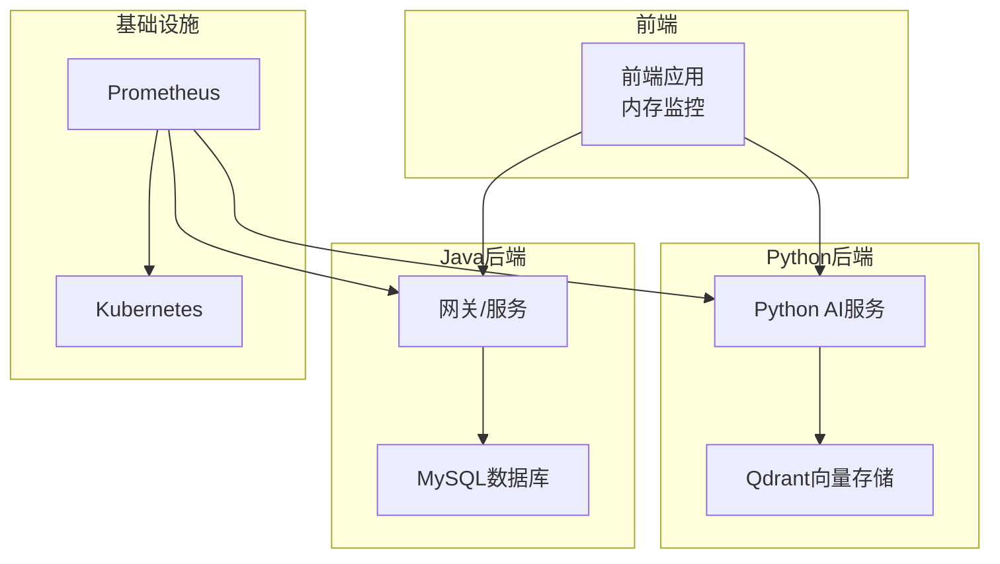

**图表来源**
- [frontend/src/utils/memoryMonitor.ts](file://frontend/src/utils/memoryMonitor.ts)
- [python-ai/app/repositories/qdrant_repo.py](file://python-ai/app/repositories/qdrant_repo.py)
- [backend/app/repositories/mysql_repo.py](file://backend/app/repositories/mysql_repo.py)
- [prometheus/prometheus.yml](file://prometheus/prometheus.yml)
- [k8s/backend-deployment.yaml](file://k8s/backend-deployment.yaml)

**章节来源**
- [backend/app/config.py](file://backend/app/config.py)
- [backend/config.py](file://backend/config.py)
- [python-ai/app/config.py](file://python-ai/app/config.py)

## 核心组件
- 向量检索与缓存：Python侧Qdrant访问与两级缓存（本地+Redis），并提供缩略图缓存预热
- 数据库连接池：基于aiomysql的连接池封装，内置查询性能指标统计
- 并发与异步：生产多进程脚本中的线程池管理，Celery异步任务
- 监控与告警：前端内存监控、后端性能指标、Prometheus采集、K8s扩缩容
- 中间件：错误处理与超时中间件，保障稳定性

**章节来源**
- [backend/app/repositories/qdrant_repo.py](file://backend/app/repositories/qdrant_repo.py)
- [backend/app/services/ai_vector_processing/ai_vector_processor.py](file://backend/app/services/ai_vector_processing/ai_vector_processor.py)
- [backend/app/repositories/mysql_repo.py](file://backend/app/repositories/mysql_repo.py)
- [backend/app/utils/performance_monitor.py](file://backend/app/utils/performance_monitor.py)
- [scripts/startup/start_prod_multiprocess.py](file://scripts/startup/start_prod_multiprocess.py)
- [frontend/src/utils/memoryMonitor.ts](file://frontend/src/utils/memoryMonitor.ts)

## 架构总览
下图展示AI向量检索的关键路径与性能相关组件：

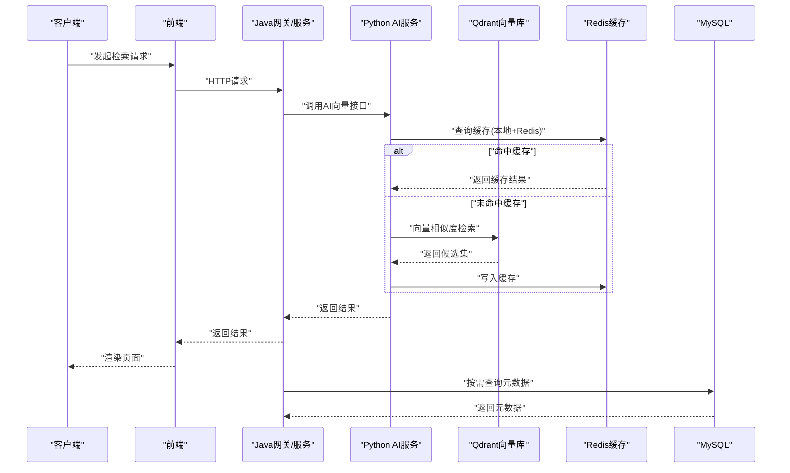

**图表来源**
- [backend/app/services/ai_vector_processing/ai_vector_processor.py](file://backend/app/services/ai_vector_processing/ai_vector_processor.py)
- [python-ai/app/repositories/qdrant_repo.py](file://python-ai/app/repositories/qdrant_repo.py)
- [backend/app/repositories/qdrant_repo.py](file://backend/app/repositories/qdrant_repo.py)

## 详细组件分析

### 向量检索性能瓶颈与优化策略
- 瓶颈识别
  - Qdrant检索延迟：大规模向量库的相似度计算与过滤条件组合可能成为瓶颈
  - 网络往返：Python AI服务与Qdrant之间的网络延迟
  - 热点数据：高并发下的重复检索导致重复计算
- 优化策略
  - 多级缓存：本地字典+Redis键值缓存，降低重复检索成本
  - 缩略图缓存预热：启动阶段批量构建常用向量结果缓存
  - 过滤优先：先过滤再向量检索，减少候选集规模
  - 分页与阈值：合理设置limit与score阈值，平衡召回与性能
  - 索引与分片：在Qdrant侧启用合适索引参数与分片策略（依据实际部署）

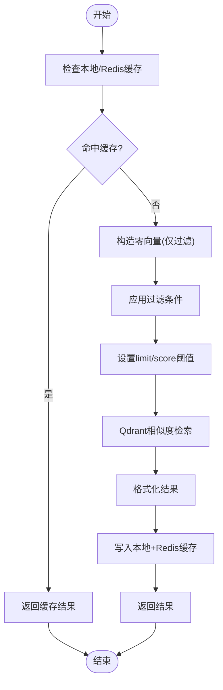

**图表来源**
- [backend/app/services/ai_vector_processing/ai_vector_processor.py](file://backend/app/services/ai_vector_processing/ai_vector_processor.py)
- [backend/app/repositories/qdrant_repo.py](file://backend/app/repositories/qdrant_repo.py)

**章节来源**
- [backend/app/services/ai_vector_processing/ai_vector_processor.py](file://backend/app/services/ai_vector_processing/ai_vector_processor.py)
- [backend/app/repositories/qdrant_repo.py](file://backend/app/repositories/qdrant_repo.py)
- [python-ai/app/repositories/qdrant_repo.py](file://python-ai/app/repositories/qdrant_repo.py)

### 缓存机制设计与实现
- 多级缓存
  - 本地缓存：以字典维护，带TTL与容量上限，超过容量按时间淘汰
  - Redis缓存：异步写入，统一TTL，支持分布式共享
- LRU淘汰
  - 通过“最久未使用”键的删除实现，保证热点数据优先保留
- 热点数据预热
  - 启动时扫描Qdrant集合，批量生成常用检索结果缓存
- 命中率与一致性
  - 读写分离：读取命中本地，未命中回源Qdrant并回填缓存
  - 异步写入：避免阻塞主流程

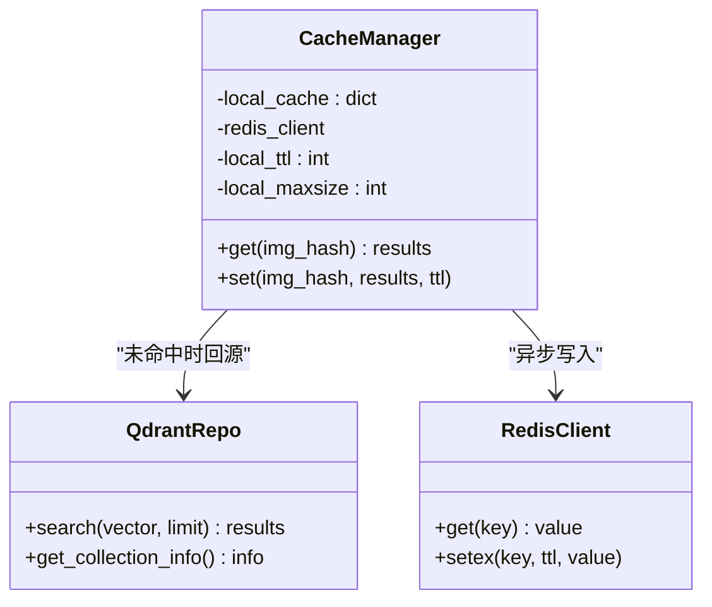

**图表来源**
- [backend/app/services/ai_vector_processing/ai_vector_processor.py](file://backend/app/services/ai_vector_processing/ai_vector_processor.py)
- [python-ai/app/repositories/qdrant_repo.py](file://python-ai/app/repositories/qdrant_repo.py)

**章节来源**
- [backend/app/services/ai_vector_processing/ai_vector_processor.py](file://backend/app/services/ai_vector_processing/ai_vector_processor.py)
- [backend/app/services/cache_warmup_service.py](file://backend/app/services/cache_warmup_service.py)

### 并发处理架构（异步任务、线程池、资源限制）
- 线程池管理
  - 动态初始化与关闭，限制最大线程数，支持任务提交与等待完成
  - 异常统一处理，避免线程泄漏
- 异步任务
  - Celery应用作为后台任务队列，适合耗时任务（如缓存预热、批量处理）
- 资源限制
  - 线程池大小与队列长度受系统CPU与内存约束
  - 任务超时与重试策略需结合业务特性配置

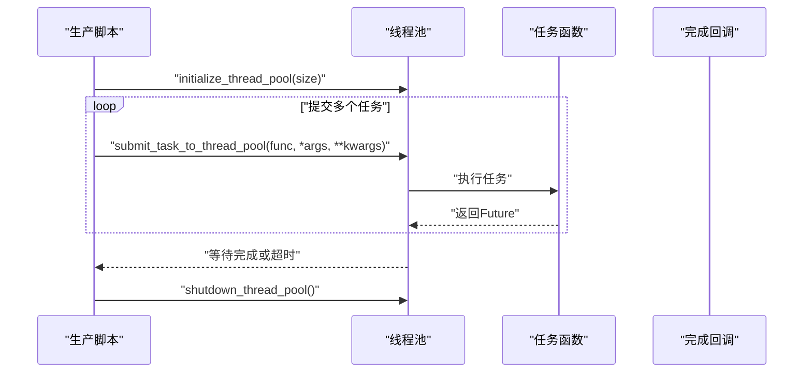

**图表来源**
- [scripts/startup/start_prod_multiprocess.py](file://scripts/startup/start_prod_multiprocess.py)
- [backend/app/tasks/celery_app.py](file://backend/app/tasks/celery_app.py)

**章节来源**
- [scripts/startup/start_prod_multiprocess.py](file://scripts/startup/start_prod_multiprocess.py)
- [backend/app/tasks/celery_app.py](file://backend/app/tasks/celery_app.py)

### 内存管理与垃圾回收优化
- 前端内存监控
  - 定期采样内存使用率，提供警告与临界阈值回调
  - 支持趋势分析与历史记录导出
- 后端内存优化建议
  - 控制缓存容量与TTL，避免内存膨胀
  - 及时释放大对象引用，配合GC周期观察
  - 对高频数据结构采用更紧凑的表示（如向量数组）

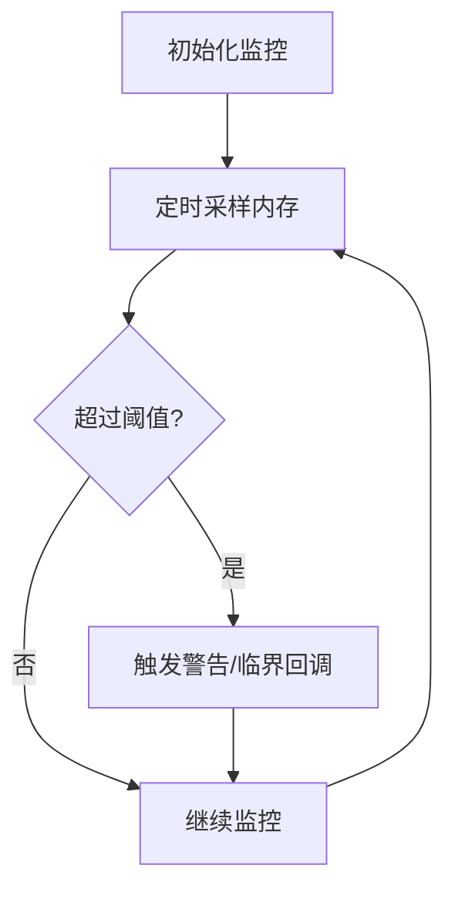

**图表来源**
- [frontend/src/utils/memoryMonitor.ts](file://frontend/src/utils/memoryMonitor.ts)

**章节来源**
- [frontend/src/utils/memoryMonitor.ts](file://frontend/src/utils/memoryMonitor.ts)

### 数据库查询优化、索引策略与连接池配置
- 连接池配置
  - 池大小、回收时间、超时、溢出连接数等参数可调
  - 事务隔离级别设置为READ COMMITTED，确保可见性
- 查询性能指标
  - 统计慢查询比例、平均执行时间、按查询类型分类
  - 支持重置指标，便于阶段性评估
- 索引策略
  - 按查询模式创建复合索引与单列索引
  - 定期分析查询计划，剔除无效索引

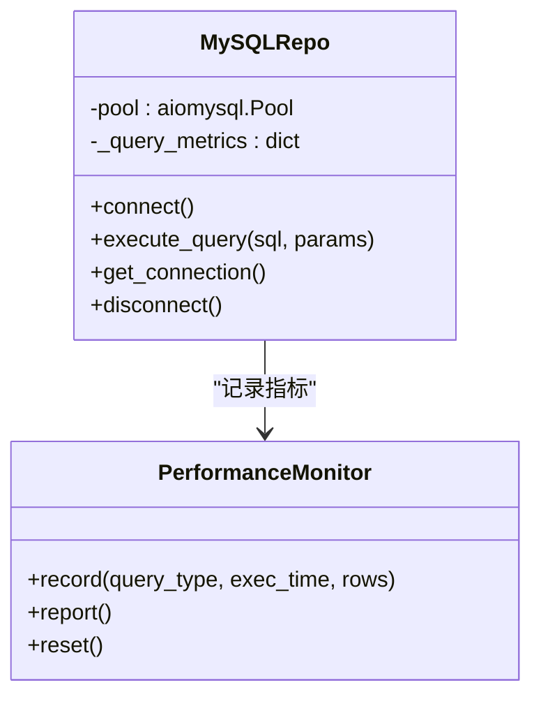

**图表来源**
- [backend/app/repositories/mysql_repo.py](file://backend/app/repositories/mysql_repo.py)
- [backend/app/utils/performance_monitor.py](file://backend/app/utils/performance_monitor.py)

**章节来源**
- [backend/app/repositories/mysql_repo.py](file://backend/app/repositories/mysql_repo.py)
- [backend/app/utils/performance_monitor.py](file://backend/app/utils/performance_monitor.py)

### 监控指标采集与分析
- 指标维度
  - 响应时间：P50/P95/P99延迟
  - 吞吐量：QPS、并发请求数
  - 错误率：HTTP 5xx、超时、业务异常
- 采集与存储
  - Prometheus抓取后端与Python服务指标
  - 前端内存使用率上报至后端或独立监控系统
- 分析与可视化
  - Grafana仪表盘展示趋势与告警
  - 告警规则基于阈值与同比/环比变化

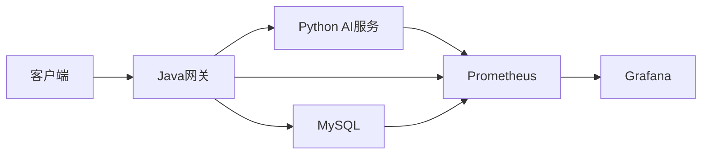

**图表来源**
- [prometheus/prometheus.yml](file://prometheus/prometheus.yml)
- [backend/app/services/monitoring_service.py](file://backend/app/services/monitoring_service.py)

**章节来源**
- [prometheus/prometheus.yml](file://prometheus/prometheus.yml)
- [backend/app/services/monitoring_service.py](file://backend/app/services/monitoring_service.py)
- [scripts/monitoring/performance_monitor.py](file://scripts/monitoring/performance_monitor.py)

### 负载均衡、熔断器与限流策略
- 负载均衡
  - Kubernetes Service与Ingress实现流量分发
  - 后端多副本部署，结合健康检查
- 熔断器
  - 在网关或服务层对下游依赖（如Qdrant、Redis、MySQL）实施快速失败
  - 基于错误率与响应时间触发熔断/半开/恢复
- 限流
  - 基于令牌桶/漏桶算法在网关层限制请求速率
  - 针对不同接口设置不同阈值，保护核心链路

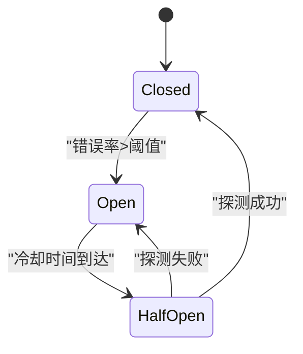

[本图为概念图，不直接映射具体文件，故无图表来源]

### 性能测试与基准测试
- 方法论
  - 压测工具：JMeter、Locust、wrk
  - 场景设计：峰值QPS、长尾延迟、突发流量
  - 指标采集：响应时间分布、错误率、资源占用
- 基准项
  - 向量检索P95延迟、缓存命中率、数据库慢查询占比
  - 前端内存峰值与GC频率
- 回归基线
  - 将关键指标纳入CI/CD，每次发布对比基线

[本节为通用方法论，不直接分析具体文件，故无章节来源]

### 容量规划与自动扩缩容
- 规划步骤
  - 识别瓶颈：CPU、内存、IO、网络
  - 压测确定饱和点：达到目标SLA的最大QPS
  - 设定扩容阈值：CPU/内存/延迟/错误率
- 自动扩缩容
  - Kubernetes HPA基于CPU/内存或自定义指标
  - PodDisruptionBudget保障扩缩过程稳定性
  - 资源配额与限制防止“单点突增”

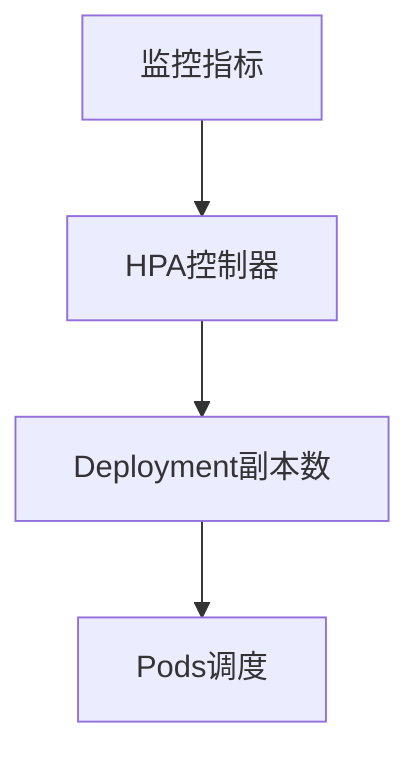

**图表来源**
- [k8s/backend-deployment.yaml](file://k8s/backend-deployment.yaml)

**章节来源**
- [k8s/backend-deployment.yaml](file://k8s/backend-deployment.yaml)

## 依赖关系分析
- 组件耦合
  - Python AI服务依赖Qdrant与Redis；Java网关依赖MySQL；前端依赖后端API
- 外部依赖
  - Qdrant、Redis、MySQL、Prometheus、K8s
- 潜在环路
  - 通过中间件与异步任务解耦，避免循环依赖

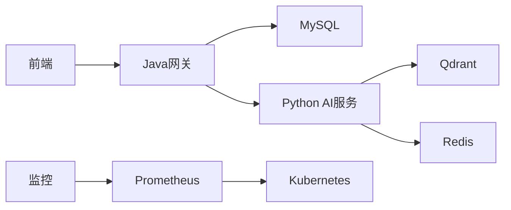

**图表来源**
- [backend/app/repositories/mysql_repo.py](file://backend/app/repositories/mysql_repo.py)
- [backend/app/services/ai_vector_processing/ai_vector_processor.py](file://backend/app/services/ai_vector_processing/ai_vector_processor.py)
- [python-ai/app/repositories/qdrant_repo.py](file://python-ai/app/repositories/qdrant_repo.py)
- [prometheus/prometheus.yml](file://prometheus/prometheus.yml)
- [k8s/backend-deployment.yaml](file://k8s/backend-deployment.yaml)

**章节来源**
- [backend/app/repositories/mysql_repo.py](file://backend/app/repositories/mysql_repo.py)
- [backend/app/services/ai_vector_processing/ai_vector_processor.py](file://backend/app/services/ai_vector_processing/ai_vector_processor.py)
- [python-ai/app/repositories/qdrant_repo.py](file://python-ai/app/repositories/qdrant_repo.py)
- [prometheus/prometheus.yml](file://prometheus/prometheus.yml)
- [k8s/backend-deployment.yaml](file://k8s/backend-deployment.yaml)

## 性能考量
- 向量检索
  - 优先过滤、限制候选集、合理阈值
  - 多级缓存与预热，提升命中率
- 缓存
  - 本地+Redis双层，异步写入，TTL与容量控制
- 并发
  - 线程池大小与任务超时，避免资源枯竭
- 数据库
  - 连接池参数与慢查询治理，定期索引优化
- 监控
  - 指标体系完善，告警阈值分级

[本节为通用指导，不直接分析具体文件，故无章节来源]

## 故障排查指南
- 常见问题
  - 缓存未命中：检查TTL与容量、Redis连通性
  - Qdrant检索慢：检查过滤条件、索引参数、网络延迟
  - 线程池阻塞：检查任务超时、线程数上限
  - 数据库连接池耗尽：调整池大小与超时
- 排查步骤
  - 查看后端日志与错误中间件输出
  - 抓取Prometheus指标定位瓶颈
  - 前端内存监控确认是否存在内存泄漏

**章节来源**
- [backend/app/middleware/error_handler.py](file://backend/app/middleware/error_handler.py)
- [backend/app/middleware/timeout.py](file://backend/app/middleware/timeout.py)
- [backend/app/repositories/mysql_repo.py](file://backend/app/repositories/mysql_repo.py)
- [backend/app/services/ai_vector_processing/ai_vector_processor.py](file://backend/app/services/ai_vector_processing/ai_vector_processor.py)

## 结论
通过多级缓存、连接池优化、并发线程池管理、完善的监控与告警体系，以及基于压测的容量规划与自动扩缩容，可显著提升“思觉智贸AI服务”的稳定性与性能。建议持续迭代指标体系与优化策略，结合业务增长动态调整资源配置。

[本节为总结，不直接分析具体文件，故无章节来源]

## 附录
- 关键配置位置
  - Python AI服务缓存与Qdrant配置：[python-ai/app/config.py](file://python-ai/app/config.py)
  - 后端服务配置：[backend/app/config.py](file://backend/app/config.py)、[backend/config.py](file://backend/config.py)
- 监控与部署
  - Prometheus配置：[prometheus/prometheus.yml](file://prometheus/prometheus.yml)
  - Kubernetes部署：[k8s/backend-deployment.yaml](file://k8s/backend-deployment.yaml)

**章节来源**
- [python-ai/app/config.py](file://python-ai/app/config.py)
- [backend/app/config.py](file://backend/app/config.py)
- [backend/config.py](file://backend/config.py)
- [prometheus/prometheus.yml](file://prometheus/prometheus.yml)
- [k8s/backend-deployment.yaml](file://k8s/backend-deployment.yaml)