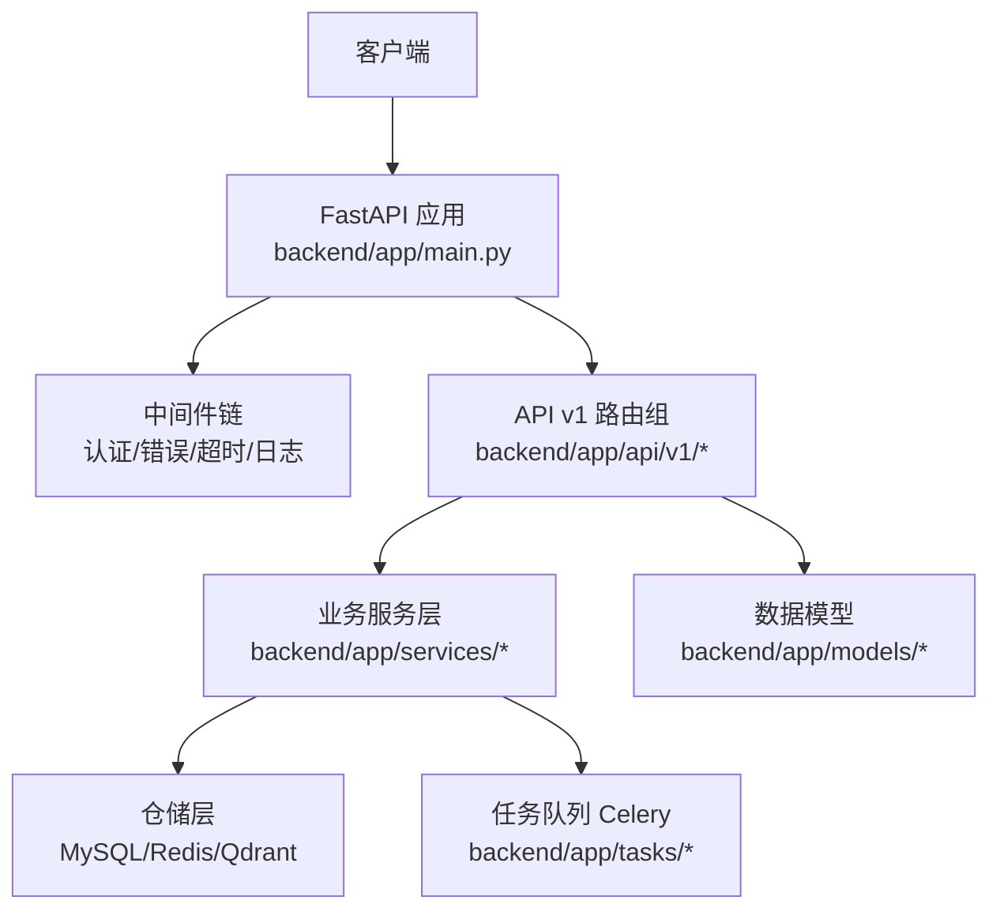
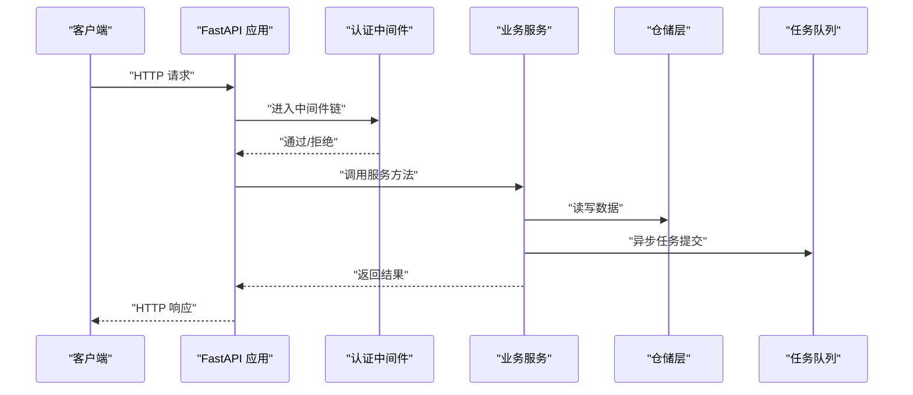
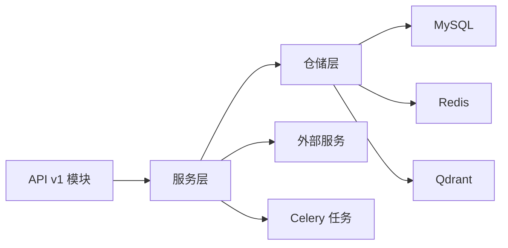

# API接口文档

<cite>
**本文引用的文件**
- [backend/app/main.py](file://backend/app/main.py)
- [backend/app/api/v1/__init__.py](file://backend/app/api/v1/__init__.py)
- [backend/app/middleware/auth_middleware.py](file://backend/app/middleware/auth_middleware.py)
- [backend/app/middleware/error_middleware.py](file://backend/app/middleware/error_middleware.py)
- [backend/app/utils/jwt_utils.py](file://backend/app/utils/jwt_utils.py)
- [backend/app/api/v1/auth.py](file://backend/app/api/v1/auth.py)
- [backend/app/api/v1/users.py](file://backend/app/api/v1/users.py)
- [backend/app/api/v1/products.py](file://backend/app/api/v1/products.py)
- [backend/app/api/v1/product_data.py](file://backend/app/api/v1/product_data.py)
- [backend/app/api/v1/categories.py](file://backend/app/api/v1/categories.py)
- [backend/app/api/v1/material_library.py](file://backend/app/api/v1/material_library.py)
- [backend/app/api/v1/carrier_library.py](file://backend/app/api/v1/carrier_library.py)
- [backend/app/api/v1/selection.py](file://backend/app/api/v1/selection.py)
- [backend/app/api/v1/selection_recycle.py](file://backend/app/api/v1/selection_recycle.py)
- [backend/app/api/v1/final_drafts.py](file://backend/app/api/v1/final_drafts.py)
- [backend/app/api/v1/download_tasks.py](file://backend/app/api/v1/download_tasks.py)
- [backend/app/api/v1/file_links.py](file://backend/app/api/v1/file_links.py)
- [backend/app/api/v1/images.py](file://backend/app/api/v1/images.py)
- [backend/app/api/v1/import_.py](file://backend/app/api/v1/import_.py)
- [backend/app/api/v1/export.py](file://backend/app/api/v1/export.py)
- [backend/app/api/v1/reports.py](file://backend/app/api/v1/reports.py)
- [backend/app/api/v1/statistics.py](file://backend/app/api/v1/statistics.py)
- [backend/app/api/v1/system_config.py](file://backend/app/api/v1/system_config.py)
- [backend/app/api/v1/logs.py](file://backend/app/api/v1/logs.py)
- [backend/app/api/v1/tencent_llm_vision_service.py](file://backend/app/api/v1/tencent_llm_vision_service.py)
- [backend/app/api/v1/health.py](file://backend/app/api/v1/health.py)
- [backend/app/api/v1/image_proxy.py](file://backend/app/api/v1/image_proxy.py)
- [backend/app/api/v1/scoring.py](file://backend/app/api/v1/scoring.py)
- [backend/app/api/v1/recycle_bin.py](file://backend/app/api/v1/recycle_bin.py)
- [backend/app/api/v1/product_recycle.py](file://backend/app/api/v1/product_recycle.py)
- [backend/app/api/v1/tags.py](file://backend/app/api/v1/tags.py)
- [backend/app/api/v1/announcement.py](file://backend/app/api/v1/announcement.py)
- [backend/app/api/v1/lingxing.py](file://backend/app/api/v1/lingxing.py)
- [backend/app/api/v1/__init__.py](file://backend/app/api/v1/__init__.py)
- [backend/app/api/__init__.py](file://backend/app/api/__init__.py)
- [backend/app/config.py](file://backend/app/config.py)
- [backend/app/models/product.py](file://backend/app/models/product.py)
- [backend/app/models/selection.py](file://backend/app/models/selection.py)
- [backend/app/models/final_draft.py](file://backend/app/models/final_draft.py)
- [backend/app/models/file_link.py](file://backend/app/models/file_link.py)
- [backend/app/models/carrier_library.py](file://backend/app/models/carrier_library.py)
- [backend/app/models/material_library.py](file://backend/app/models/material_library.py)
- [backend/app/services/product_service.py](file://backend/app/services/product_service.py)
- [backend/app/services/selection_service.py](file://backend/app/services/selection_service.py)
- [backend/app/services/file_link_service.py](file://backend/app/services/file_link_service.py)
- [backend/app/services/image_service.py](file://backend/app/services/image_service.py)
- [backend/app/services/product_data_service.py](file://backend/app/services/product_data_service.py)
- [backend/app/services/system_log_service.py](file://backend/app/services/system_log_service.py)
- [backend/app/schemas/product_data.py](file://backend/app/schemas/product_data.py)
- [backend/app/schemas/system_log.py](file://backend/app/schemas/system_log.py)
- [backend/app/repositories/mysql_repo.py](file://backend/app/repositories/mysql_repo.py)
- [backend/app/repositories/qdrant_repo.py](file://backend/app/repositories/qdrant_repo.py)
- [backend/app/repositories/redis_repo.py](file://backend/app/repositories/redis_repo.py)
- [backend/app/tasks/celery_app.py](file://backend/app/tasks/celery_app.py)
- [backend/app/tasks/download_tasks.py](file://backend/app/tasks/download_tasks.py)
- [backend/app/utils/performance_monitor.py](file://backend/app/utils/performance_monitor.py)
- [backend/app/utils/image_processor.py](file://backend/app/utils/image_processor.py)
- [backend/app/utils/image_loader.py](file://backend/app/utils/image_loader.py)
- [backend/app/utils/download_utils.py](file://backend/app/utils/download_utils.py)
- [backend/app/services/cache_warmup_service.py](file://backend/app/services/cache_warmup_service.py)
- [backend/app/services/backup_service.py](file://backend/app/services/backup_service.py)
- [backend/app/services/monitoring_service.py](file://backend/app/services/monitoring_service.py)
- [backend/app/services/tencent_image_search_service.py](file://backend/app/services/tencent_image_search_service.py)
- [backend/app/services/tencent_image_recognition_service.py](file://backend/app/services/tencent_image_recognition_service.py)
- [backend/app/services/baidu_image_recognition_service.py](file://backend/app/services/baidu_image_recognition_service.py)
- [backend/app/services/tencent_llm_vision_service.py](file://backend/app/services/tencent_llm_vision_service.py)
- [backend/app/services/token_service.py](file://backend/app/services/token_service.py)
- [backend/app/services/scoring_engine.py](file://backend/app/services/scoring_engine.py)
- [backend/app/services/selection_recycle_service.py](file://backend/app/services/selection_recycle_service.py)
- [backend/app/services/product_recycle_service.py](file://backend/app/services/product_recycle_service.py)
- [backend/app/services/download_task_service.py](file://backend/app/services/download_task_service.py)
- [backend/app/services/file_upload_service.py](file://backend/app/services/file_upload_service.py)
- [backend/app/services/cleanup_service.py](file://backend/app/services/cleanup_service.py)
- [backend/app/services/polars_data_service.py](file://backend/app/services/polars_data_service.py)
- [backend/app/services/cos_service.py](file://backend/app/services/cos_service.py)
- [backend/app/services/library_image_service.py](file://backend/app/services/library_image_service.py)
- [backend/app/services/local_file_service.py](file://backend/app/services/local_file_service.py)
- [backend/app/services/product_sales_service.py](file://backend/app/services/product_sales_service.py)
- [backend/app/services/system_log_service.py](file://backend/app/services/system_log_service.py)
- [backend/app/api/v1/product_sales.py](file://backend/app/api/v1/product_sales.py)
- [backend/app/api/v1/product_sales.py](file://backend/app/api/v1/product_sales.py)
- [backend/app/api/v1/product_sales.py](file://backend/app/api/v1/product_sales.py)
- [backend/app/api/v1/product_sales.py](file://backend/app/api/v1/product_sales.py)
- [backend/app/api/v1/product_sales.py](file://backend/app/api/v1/product_sales.py)
- [backend/app/api/v1/product_sales.py](file://backend/app/api/v1/product_sales.py)
- [backend/app/api/v1/product_sales.py](file://backend/app/api/v1/product_sales.py)
- [backend/app/api/v1/product_sales.py](file://backend/app/api/v1/product_sales.py)
- [backend/app/api/v1/product_sales.py](file://backend/app/api/v1/product_sales.py)
- [backend/app/api/v1/product_sales.py](file://backend/app/api/v1/product_sales.py)
- [backend/app/api/v1/product_sales.py](file://backend/app/api/v1/product_sales.py)
- [backend/app/api/v1/product_sales.py](file://backend/app/api/v1/product_sales.py)
- [backend/app/api/v1/product_sales.py](file://backend/app/api/v1/product_sales.py)
- [backend/app/api/v1/product_sales.py](file://backend/app/api/v1/product_sales.py)
- [backend/app/api/v1/product_sales.py](file://backend/app/api/v1/product_sales.py)
- [backend/app/api/v1/product_sales.py](file://backend/app/api/v1/product_sales.py)
- [backend/app/api/v1/product_sales.py](file://backend/app/api/v1/product_sales.py)
- [backend/app/api/v1/product_sales.py](file://backend/app/api/v1/product_sales.py)
- [backend/app/api/v1/product_sales.py](file://backend/app/api/v1/product_sales.py)
- [backend/app/api/v1/product_sales.py](file://backend/app/api/v1/product_sales.py)
- [backend/app/api/v1/product_sales.py](file://backend/app/api/v1/product_sales.py)
- [backend/app/api/v1/product_sales.py](file://backend/app/api/v1/product_sales.py)
- [backend/app/api/v1/product_sales.py](file://backend/app/api/v1/product_sales.py)
- [backend/app/api......](file://backend/app/api/v1/product_sales.py)
</cite>

## 目录
1. [简介](#简介)
2. [项目结构](#项目结构)
3. [核心组件](#核心组件)
4. [架构总览](#架构总览)
5. [详细组件分析](#详细组件分析)
6. [依赖关系分析](#依赖关系分析)
7. [性能考量](#性能考量)
8. [故障排查指南](#故障排查指南)
9. [结论](#结论)
10. [附录](#附录)

## 简介
本文件为“思觉智贸系统”的完整API接口文档，覆盖后端基于FastAPI的RESTful API与部分WebSocket实时交互能力。文档包含：
- API版本控制策略（v1）
- 认证与授权机制（JWT）
- 请求/响应模式与参数说明
- 错误码与状态码含义
- 调用示例与SDK使用建议
- 速率限制与安全考虑
- WebSocket连接与消息格式
- 测试工具与调试方法
- 客户端集成最佳实践

## 项目结构
后端采用分层架构：入口应用、API路由（v1）、中间件、服务层、仓储层、模型与任务队列。API v1下包含用户、商品、选品、下载任务、文件链接、图片、导入导出、报表统计、系统配置、日志等模块。

图表来源
- [backend/app/main.py](file://backend/app/main.py)
- [backend/app/api/v1/__init__.py](file://backend/app/api/v1/__init__.py)
- [backend/app/middleware/auth_middleware.py](file://backend/app/middleware/auth_middleware.py)
- [backend/app/middleware/error_middleware.py](file://backend/app/middleware/error_middleware.py)

章节来源
- [backend/app/main.py](file://backend/app/main.py)
- [backend/app/api/v1/__init__.py](file://backend/app/api/v1/__init__.py)

## 核心组件
- 应用入口与路由注册：在应用入口中注册API v1路由组，并挂载中间件。
- 中间件体系：认证中间件负责鉴权；错误中间件统一异常处理；超时与日志中间件保障稳定性。
- 服务层：封装业务逻辑，协调仓储与外部服务（如图像识别、向量检索、对象存储等）。
- 仓储层：MySQL、Redis、Qdrant等多存储协同，支撑查询、缓存与向量化检索。
- 任务队列：Celery异步执行下载、清理、备份等耗时任务。
- 工具与配置：JWT工具、性能监控、图像处理与下载工具等。

章节来源
- [backend/app/main.py](file://backend/app/main.py)
- [backend/app/middleware/auth_middleware.py](file://backend/app/middleware/auth_middleware.py)
- [backend/app/middleware/error_middleware.py](file://backend/app/middleware/error_middleware.py)
- [backend/app/utils/jwt_utils.py](file://backend/app/utils/jwt_utils.py)
- [backend/app/config.py](file://backend/app/config.py)

## 架构总览
下图展示从客户端到服务层的关键交互路径，包括认证、业务处理与数据持久化。

图表来源
- [backend/app/main.py](file://backend/app/main.py)
- [backend/app/middleware/auth_middleware.py](file://backend/app/middleware/auth_middleware.py)
- [backend/app/services/product_service.py](file://backend/app/services/product_service.py)
- [backend/app/repositories/mysql_repo.py](file://backend/app/repositories/mysql_repo.py)
- [backend/app/tasks/celery_app.py](file://backend/app/tasks/celery_app.py)

## 详细组件分析

### 版本控制与基础约定
- 版本策略：所有API以v1作为版本前缀，后续升级通过新增端点或扩展字段实现，避免破坏性变更。
- 基础路径：/api/v1/{resource}
- 认证方式：Bearer Token（JWT），在请求头Authorization中携带。
- 语言与编码：统一使用JSON，字符集UTF-8。
- 时间格式：ISO 8601字符串（如2026-01-01T00:00:00Z）。
- 分页：统一使用page与size参数，或使用cursor分页（视具体资源而定）。

章节来源
- [backend/app/api/v1/__init__.py](file://backend/app/api/v1/__init__.py)
- [backend/app/utils/jwt_utils.py](file://backend/app/utils/jwt_utils.py)

### 认证与授权
- 登录接口：POST /api/v1/auth/login
  - 请求体：用户名、密码
  - 成功：返回access_token与refresh_token
  - 失败：返回错误码与原因
- 刷新令牌：POST /api/v1/auth/refresh
  - 请求体：refresh_token
  - 成功：返回新的access_token
- 退出登录：POST /api/v1/auth/logout
  - 清除会话或加入黑名单（取决于实现）
- 授权中间件：对受保护路由进行JWT校验与权限判定。

章节来源
- [backend/app/api/v1/auth.py](file://backend/app/api/v1/auth.py)
- [backend/app/middleware/auth_middleware.py](file://backend/app/middleware/auth_middleware.py)
- [backend/app/utils/jwt_utils.py](file://backend/app/utils/jwt_utils.py)

### 用户管理
- 获取当前用户：GET /api/v1/users/me
- 更新用户信息：PUT /api/v1/users/me
- 查询用户列表：GET /api/v1/users
  - 查询参数：关键词、角色、状态、分页
- 创建用户：POST /api/v1/users
- 更新用户：PUT /api/v1/users/{id}
- 删除用户：DELETE /api/v1/users/{id}

章节来源
- [backend/app/api/v1/users.py](file://backend/app/api/v1/users.py)

### 商品与数据
- 商品列表：GET /api/v1/products
  - 查询参数：分类、关键词、价格区间、状态、分页
- 商品详情：GET /api/v1/products/{id}
- 新增商品：POST /api/v1/products
- 更新商品：PUT /api/v1/products/{id}
- 删除商品：DELETE /api/v1/products/{id}
- 商品回收站：GET /api/v1/product_recycle
  - 支持批量恢复与彻底删除

章节来源
- [backend/app/api/v1/products.py](file://backend/app/api/v1/products.py)
- [backend/app/api/v1/product_recycle.py](file://backend/app/api/v1/product_recycle.py)

### 商品数据与销售
- 商品数据查询：GET /api/v1/product_data
  - 查询参数：日期范围、平台、类目、分页
- 商品销售数据：GET /api/v1/product_sales
  - 查询参数：SKU、日期、维度（日/周/月）

章节来源
- [backend/app/api/v1/product_data.py](file://backend/app/api/v1/product_data.py)
- [backend/app/api/v1/product_sales.py](file://backend/app/api/v1/product_sales.py)

### 类目与标签
- 类目管理：GET/POST/PUT/DELETE /api/v1/categories
- 标签管理：GET/POST/PUT/DELETE /api/v1/tags

章节来源
- [backend/app/api/v1/categories.py](file://backend/app/api/v1/categories.py)
- [backend/app/api/v1/tags.py](file://backend/app/api/v1/tags.py)

### 图片与媒体
- 上传图片：POST /api/v1/images/upload
- 获取图片：GET /api/v1/images/{id}
- 图片代理：GET /api/v1/image_proxy/{url}
- 图片库：GET /api/v1/material_library
- 运输载体图片库：GET /api/v1/carrier_library

章节来源
- [backend/app/api/v1/images.py](file://backend/app/api/v1/images.py)
- [backend/app/api/v1/image_proxy.py](file://backend/app/api/v1/image_proxy.py)
- [backend/app/api/v1/material_library.py](file://backend/app/api/v1/material_library.py)
- [backend/app/api/v1/carrier_library.py](file://backend/app/api/v1/carrier_library.py)

### 文件与下载任务
- 文件链接管理：GET/POST/PUT/DELETE /api/v1/file_links
- 下载任务：GET/POST/DELETE /api/v1/download_tasks
  - 支持批量创建与取消

章节来源
- [backend/app/api/v1/file_links.py](file://backend/app/api/v1/file_links.py)
- [backend/app/api/v1/download_tasks.py](file://backend/app/api/v1/download_tasks.py)

### 选品与定稿
- 选品查询：GET /api/v1/selection
- 选品详情：GET /api/v1/selection/{id}
- 选品回收站：GET /api/v1/selection_recycle
- 定稿管理：GET/POST/PUT/DELETE /api/v1/final_drafts

章节来源
- [backend/app/api/v1/selection.py](file://backend/app/api/v1/selection.py)
- [backend/app/api/v1/selection_recycle.py](file://backend/app/api/v1/selection_recycle.py)
- [backend/app/api/v1/final_drafts.py](file://backend/app/api/v1/final_drafts.py)

### 导入导出与报表
- 导入：POST /api/v1/import_
  - 支持Excel/CSV等格式，异步处理
- 导出：POST /api/v1/export
  - 返回下载链接或直接流式输出
- 报表：GET /api/v1/reports/{type}
  - 如销售报表、库存报表等

章节来源
- [backend/app/api/v1/import_.py](file://backend/app/api/v1/import_.py)
- [backend/app/api/v1/export.py](file://backend/app/api/v1/export.py)
- [backend/app/api/v1/reports.py](file://backend/app/api/v1/reports.py)

### 统计与系统配置
- 统计：GET /api/v1/statistics
  - 如商品数量、用户活跃度、下载量等
- 系统配置：GET/PUT /api/v1/system_config

章节来源
- [backend/app/api/v1/statistics.py](file://backend/app/api/v1/statistics.py)
- [backend/app/api/v1/system_config.py](file://backend/app/api/v1/system_config.py)

### 日志与公告
- 系统日志：GET /api/v1/logs
  - 支持按类型、时间范围过滤
- 公告：GET/POST/PUT/DELETE /api/v1/announcement

章节来源
- [backend/app/api/v1/logs.py](file://backend/app/api/v1/logs.py)
- [backend/app/api/v1/announcement.py](file://backend/app/api/v1/announcement.py)

### AI与智能服务
- 腾讯视觉识别：POST /api/v1/tencent_llm_vision_service
- 图像搜索：POST /api/v1/tencent_image_search_service
- 百度图像识别：POST /api/v1/baidu_image_recognition_service
- 评分引擎：POST /api/v1/scoring

章节来源
- [backend/app/api/v1/tencent_llm_vision_service.py](file://backend/app/api/v1/tencent_llm_vision_service.py)
- [backend/app/services/tencent_image_search_service.py](file://backend/app/services/tencent_image_search_service.py)
- [backend/app/services/baidu_image_recognition_service.py](file://backend/app/services/baidu_image_recognition_service.py)
- [backend/app/api/v1/scoring.py](file://backend/app/api/v1/scoring.py)

### 健康检查
- GET /api/v1/health
  - 返回服务健康状态与依赖组件可用性

章节来源
- [backend/app/api/v1/health.py](file://backend/app/api/v1/health.py)

### WebSocket（概念说明）
- 连接地址：ws://host/api/ws/{channel}
- 认证：通过查询参数携带token或在握手阶段携带
- 消息格式：JSON对象，包含type（事件类型）、payload（数据）、timestamp（时间戳）
- 实时场景：下载进度通知、任务状态推送、日志流式输出

（本节为概念性说明，未直接映射到具体源文件）

## 依赖关系分析
- 控制反转与解耦：API层仅负责路由与参数校验，业务逻辑集中在服务层，仓储层屏蔽底层存储细节。
- 外部依赖：图像识别、向量检索、对象存储等通过服务层抽象对外部系统进行封装。
- 异步处理：下载、清理、备份等通过Celery任务队列异步执行，提升吞吐与用户体验。

图表来源
- [backend/app/api/v1/products.py](file://backend/app/api/v1/products.py)
- [backend/app/services/product_service.py](file://backend/app/services/product_service.py)
- [backend/app/repositories/mysql_repo.py](file://backend/app/repositories/mysql_repo.py)
- [backend/app/repositories/redis_repo.py](file://backend/app/repositories/redis_repo.py)
- [backend/app/repositories/qdrant_repo.py](file://backend/app/repositories/qdrant_repo.py)
- [backend/app/tasks/celery_app.py](file://backend/app/tasks/celery_app.py)

## 性能考量
- 缓存策略：热点数据使用Redis缓存，支持缓存预热服务。
- 数据库优化：合理索引、分页查询、批量操作。
- 异步任务：耗时操作放入队列，避免阻塞请求线程。
- 图像处理：本地缓存与CDN结合，支持缩略图生成与懒加载。
- 监控与告警：内置性能监控工具，定期生成性能报告。

章节来源
- [backend/app/services/cache_warmup_service.py](file://backend/app/services/cache_warmup_service.py)
- [backend/app/utils/performance_monitor.py](file://backend/app/utils/performance_monitor.py)
- [backend/app/services/monitoring_service.py](file://backend/app/services/monitoring_service.py)

## 故障排查指南
- 常见错误码
  - 400：请求参数无效或缺失
  - 401：未认证或Token无效
  - 403：权限不足
  - 404：资源不存在
  - 429：请求过于频繁（限流）
  - 500：服务器内部错误
- 错误中间件：统一捕获异常并返回标准错误响应。
- 日志定位：通过系统日志接口查询错误堆栈与上下文。
- 超时与重试：对第三方接口设置合理超时与指数退避重试。

章节来源
- [backend/app/middleware/error_middleware.py](file://backend/app/middleware/error_middleware.py)
- [backend/app/api/v1/logs.py](file://backend/app/api/v1/logs.py)
- [backend/app/services/system_log_service.py](file://backend/app/services/system_log_service.py)

## 结论
本API文档提供了“思觉智贸系统”v1版本的全面接口说明，涵盖认证、资源管理、数据查询、导入导出、统计报表、AI服务与健康检查等模块。建议客户端在集成时遵循版本控制、参数校验、错误处理与安全规范，并结合缓存与异步任务提升性能与稳定性。

## 附录

### API调用示例（路径指引）
- 登录：POST /api/v1/auth/login
- 获取商品列表：GET /api/v1/products?page=1&size=20
- 上传图片：POST /api/v1/images/upload
- 创建下载任务：POST /api/v1/download_tasks
- 导出数据：POST /api/v1/export
- 获取统计：GET /api/v1/statistics
- 健康检查：GET /api/v1/health

（以上示例为路径与方法说明，具体请求/响应结构请参考各模块文件）

### SDK使用指南（建议）
- 使用HTTP客户端库发送请求，自动处理Cookie与Header。
- 封装统一的请求器：自动添加Authorization头、处理重试与超时。
- 对分页接口进行通用封装，支持游标或页码两种模式。
- 对异步任务接口轮询状态，避免阻塞UI线程。

### 速率限制与安全
- 速率限制：基于IP或用户维度进行限流，超过阈值返回429。
- 安全措施：HTTPS强制、CORS白名单、SQL注入与XSS防护、输入参数严格校验。
- JWT策略：短有效期access_token与长周期refresh_token组合，支持黑名单。

章节来源
- [backend/app/middleware/auth_middleware.py](file://backend/app/middleware/auth_middleware.py)
- [backend/app/utils/jwt_utils.py](file://backend/app/utils/jwt_utils.py)

### 测试工具与调试
- Postman集合：导入OpenAPI/Swagger JSON进行批量测试。
- 自动化脚本：针对关键流程编写回归测试。
- 调试技巧：开启详细日志、使用中间件拦截器打印请求/响应、利用健康检查快速定位依赖问题。

（本节为通用实践说明）