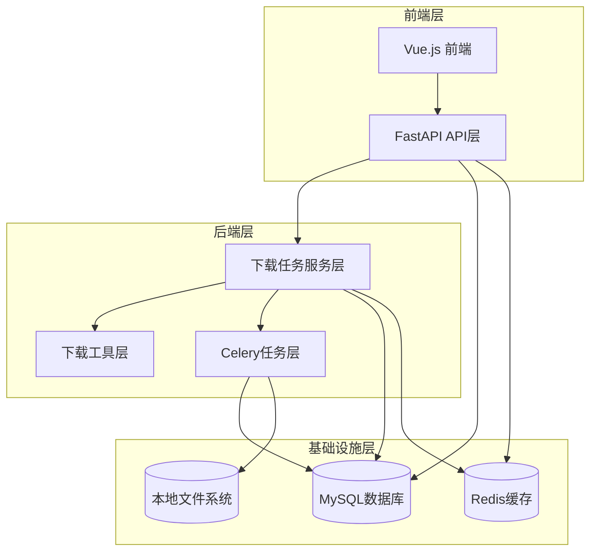
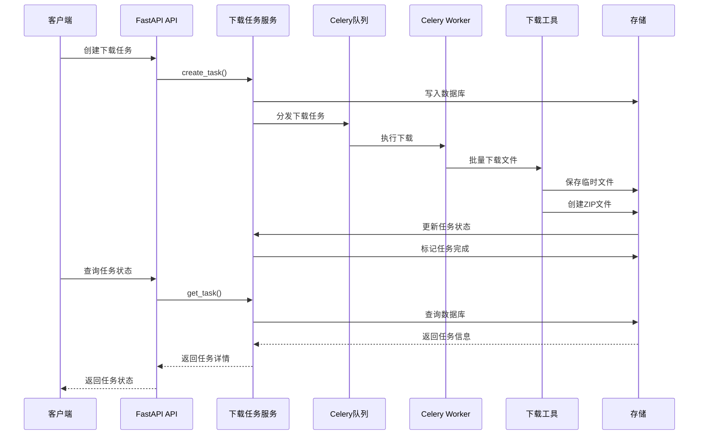
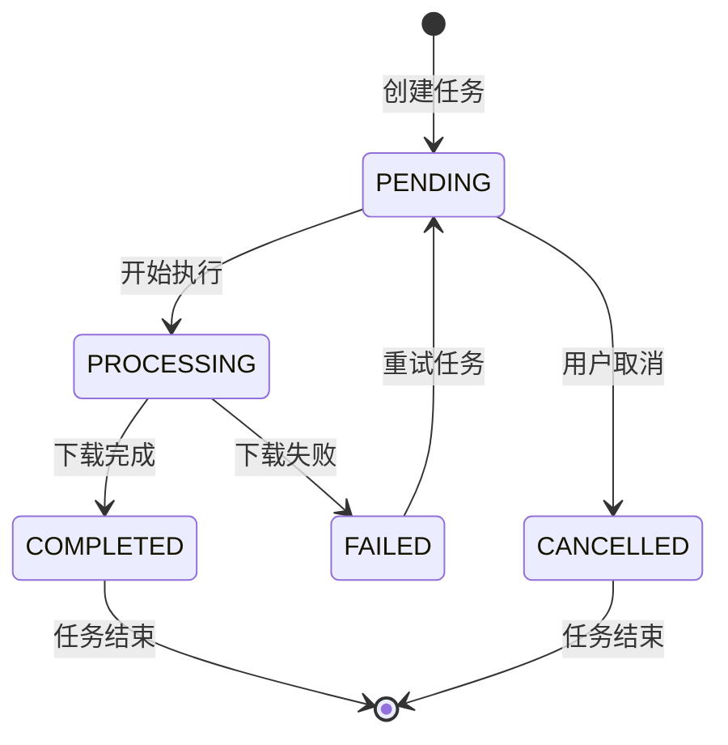
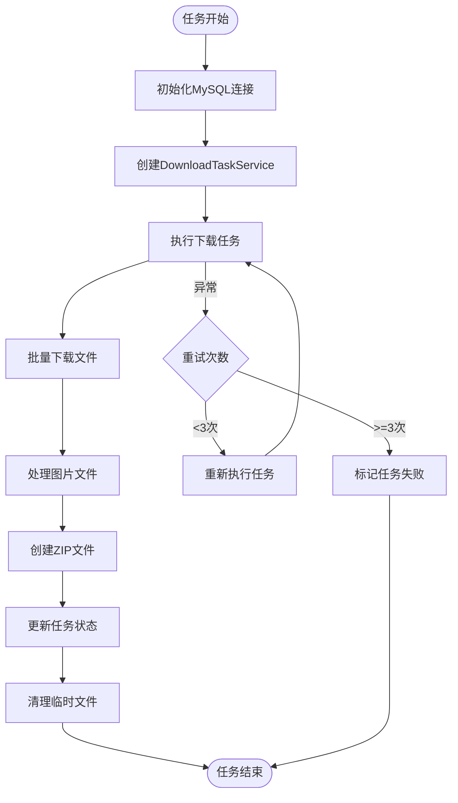
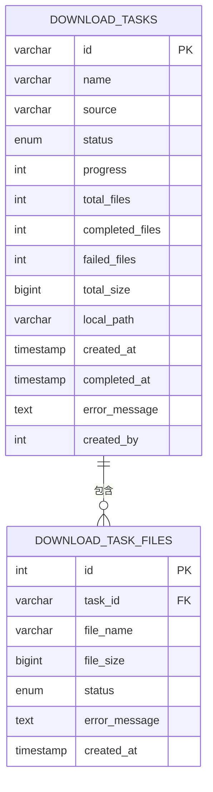

# 下载任务API

<cite>
**本文档引用的文件**
- [download_tasks.py](file://backend/app/api/v1/download_tasks.py)
- [download_task.py](file://backend/app/models/download_task.py)
- [download_task_service.py](file://backend/app/services/download_task_service.py)
- [download_tasks.py](file://backend/app/tasks/download_tasks.py)
- [download_utils.py](file://backend/app/utils/download_utils.py)
- [config.py](file://backend/app/config.py)
- [add_download_tasks_table.sql](file://backend/migrations/add_download_tasks_table.sql)
- [celery_app.py](file://backend/app/tasks/celery_app.py)
- [downloadTask.ts](file://frontend/src/api/downloadTask.ts)
- [error_handler.py](file://backend/app/middleware/error_handler.py)
</cite>

## 目录
1. [简介](#简介)
2. [项目结构](#项目结构)
3. [核心组件](#核心组件)
4. [架构概览](#架构概览)
5. [详细组件分析](#详细组件分析)
6. [依赖关系分析](#依赖关系分析)
7. [性能考虑](#性能考虑)
8. [故障排除指南](#故障排除指南)
9. [结论](#结论)

## 简介
下载任务管理系统是一个基于FastAPI和Celery的异步下载管理平台，专门用于处理大量文件的批量下载、压缩打包和传输。该系统提供了完整的下载任务生命周期管理，包括任务创建、状态查询、进度跟踪、暂停恢复、取消删除等功能，并支持断点续传和错误重试策略。

## 项目结构
系统采用分层架构设计，主要包含以下层次：

**图表来源**
- [download_tasks.py:1-389](file://backend/app/api/v1/download_tasks.py#L1-389)
- [download_task_service.py:1-682](file://backend/app/services/download_task_service.py#L1-682)
- [download_tasks.py:1-77](file://backend/app/tasks/download_tasks.py#L1-77)

**章节来源**
- [download_tasks.py:1-389](file://backend/app/api/v1/download_tasks.py#L1-389)
- [download_task_service.py:1-682](file://backend/app/services/download_task_service.py#L1-682)

## 核心组件
系统包含以下核心组件：

### 数据模型层
- **DownloadTask**: 下载任务主模型，包含任务基本信息、状态、进度等
- **DownloadTaskFile**: 下载任务文件明细模型
- **DownloadTaskStatus**: 任务状态枚举
- **DownloadTaskSource**: 任务来源枚举

### 服务层
- **DownloadTaskService**: 核心业务逻辑处理，负责任务生命周期管理
- **DownloadUtils**: 下载工具函数，处理文件下载、压缩等操作

### 任务层
- **Celery任务**: 异步执行下载任务，支持重试和并发控制
- **配置管理**: Celery和MySQL连接池配置

**章节来源**
- [download_task.py:1-149](file://backend/app/models/download_task.py#L1-149)
- [download_task_service.py:48-682](file://backend/app/services/download_task_service.py#L48-682)
- [download_utils.py:1-499](file://backend/app/utils/download_utils.py#L1-499)

## 架构概览
系统采用异步架构设计，通过Celery实现任务的异步处理：

**图表来源**
- [download_tasks.py:77-123](file://backend/app/api/v1/download_tasks.py#L77-123)
- [download_task_service.py:78-124](file://backend/app/services/download_task_service.py#L78-124)
- [download_tasks.py:24-77](file://backend/app/tasks/download_tasks.py#L24-77)

## 详细组件分析

### API接口层
提供RESTful API接口，支持以下操作：

#### 任务管理接口
- **POST /api/v1/download-tasks/final-draft**: 创建定稿批量下载任务
- **GET /api/v1/download-tasks**: 获取下载任务列表
- **GET /api/v1/download-tasks/{task_id}**: 获取任务详情
- **GET /api/v1/download-tasks/{task_id}/download**: 下载任务文件
- **DELETE /api/v1/download-tasks/{task_id}**: 删除下载任务
- **POST /api/v1/download-tasks/{task_id}/retry**: 重试下载任务
- **POST /api/v1/download-tasks/cleanup**: 清理过期任务

#### 接口特性
- **权限控制**: 基于JWT的认证授权
- **数据验证**: Pydantic模型验证请求参数
- **错误处理**: 统一的异常处理机制
- **响应格式**: 标准化的JSON响应

**章节来源**
- [download_tasks.py:77-389](file://backend/app/api/v1/download_tasks.py#L77-389)

### 服务层实现
DownloadTaskService是核心业务逻辑处理类：

#### 任务生命周期管理

#### 并发控制策略
- **数据库连接池**: MySQL连接池配置，支持高并发
- **任务去重**: 同一用户同源任务只允许一个pending/processing
- **文件下载并发**: 批量下载支持最大并发数控制
- **内存管理**: 自动清理临时文件和缓存

**图表来源**
- [download_task_service.py:404-462](file://backend/app/services/download_task_service.py#L404-462)

**章节来源**
- [download_task_service.py:48-682](file://backend/app/services/download_task_service.py#L48-682)

### 下载工具层
download_utils模块提供核心下载功能：

#### 下载策略
- **多源支持**: 支持HTTP、COS SDK等多种下载方式
- **智能重试**: 指数退避重试策略，最多3次重试
- **超时控制**: 25秒超时限制，防止长时间阻塞
- **文件验证**: 自动检测和转换图片格式

#### 断点续传机制
- **临时文件**: 下载过程中的临时文件存储
- **进度跟踪**: 实时更新下载进度和状态
- **错误恢复**: 部分下载失败时的恢复机制

**章节来源**
- [download_utils.py:91-391](file://backend/app/utils/download_utils.py#L91-391)

### Celery任务系统
异步任务处理框架：

#### 任务配置
- **重试机制**: 最多重试3次，每次间隔60秒
- **并发控制**: Worker并发数配置
- **队列管理**: 专用的下载任务队列
- **结果存储**: Redis结果后端

#### 任务执行流程

**图表来源**
- [download_tasks.py:39-77](file://backend/app/tasks/download_tasks.py#L39-77)

**章节来源**
- [download_tasks.py:1-77](file://backend/app/tasks/download_tasks.py#L1-77)
- [celery_app.py:1-54](file://backend/app/tasks/celery_app.py#L1-54)

## 依赖关系分析

### 数据库设计
系统使用MySQL存储下载任务信息：

**图表来源**
- [add_download_tasks_table.sql:1-36](file://backend/migrations/add_download_tasks_table.sql#L1-36)

### 外部依赖
- **aiohttp**: 异步HTTP客户端，支持高并发下载
- **Pillow**: 图片处理库，支持格式转换
- **Celery**: 分布式任务队列
- **Redis**: 任务队列和结果存储
- **MySQL**: 任务状态持久化

**章节来源**
- [config.py:74-84](file://backend/app/config.py#L74-84)
- [download_utils.py:25-31](file://backend/app/utils/download_utils.py#L25-31)

## 性能考虑

### 并发优化
- **连接池管理**: MySQL连接池配置，支持高并发访问
- **批量处理**: 文件下载支持批量处理，减少数据库连接开销
- **内存优化**: 及时清理临时文件，避免内存泄漏
- **缓存策略**: 图片信息缓存，减少重复查询

### 网络优化
- **超时控制**: 25秒超时限制，防止长时间阻塞
- **重试策略**: 指数退避重试，提高成功率
- **并发限制**: 控制最大并发数，避免资源耗尽
- **流式传输**: 使用StreamingResponse处理大文件下载

### 存储优化
- **本地缓存**: 下载文件存储在本地缓存目录
- **ZIP压缩**: 自动压缩下载的图片文件
- **清理机制**: 定期清理过期任务文件
- **磁盘空间监控**: 避免磁盘空间不足

## 故障排除指南

### 常见问题及解决方案

#### 任务状态异常
- **问题**: 任务状态卡在pending或processing
- **原因**: Celery worker未启动或连接异常
- **解决**: 检查Celery服务状态，重启worker进程

#### 下载失败
- **问题**: 文件下载失败
- **原因**: 网络超时、URL无效、权限问题
- **解决**: 查看错误日志，检查网络连接，验证URL有效性

#### 存储空间不足
- **问题**: 本地缓存目录空间不足
- **原因**: 临时文件未及时清理
- **解决**: 手动清理缓存目录，检查清理任务配置

#### 并发问题
- **问题**: 高并发下性能下降
- **原因**: 连接池配置不当
- **解决**: 调整MySQL连接池参数，优化并发设置

**章节来源**
- [error_handler.py:19-100](file://backend/app/middleware/error_handler.py#L19-100)
- [download_task_service.py:585-632](file://backend/app/services/download_task_service.py#L585-632)

### 调试技巧
- **日志分析**: 查看应用日志和Celery worker日志
- **状态监控**: 监控任务队列长度和处理速度
- **性能分析**: 使用性能监控工具分析瓶颈
- **错误追踪**: 使用调试工具定位具体错误

## 结论
下载任务管理系统是一个功能完整、性能可靠的异步下载管理平台。系统采用分层架构设计，通过Celery实现任务的异步处理，支持高并发下载和批量处理。完善的错误处理机制和重试策略确保了系统的稳定性，而灵活的配置选项使得系统能够适应不同的部署环境和业务需求。

系统的主要优势包括：
- **异步处理**: 高效的任务执行和资源利用
- **并发控制**: 智能的并发管理和资源限制
- **错误恢复**: 完善的错误处理和重试机制
- **扩展性**: 模块化设计便于功能扩展
- **监控性**: 完善的日志和状态监控

通过合理配置和使用，该系统能够满足大规模文件下载管理的各种需求，为用户提供稳定可靠的服务体验。