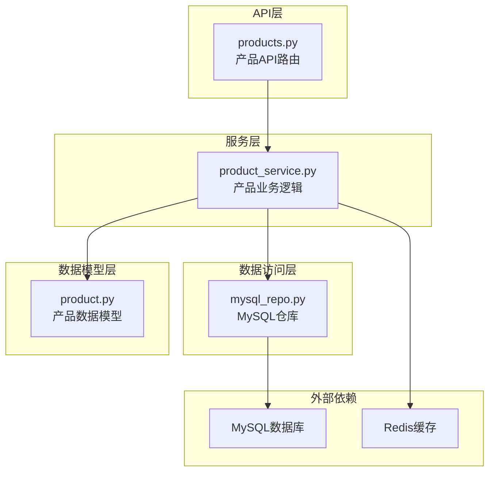
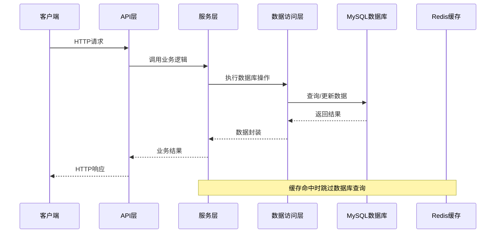
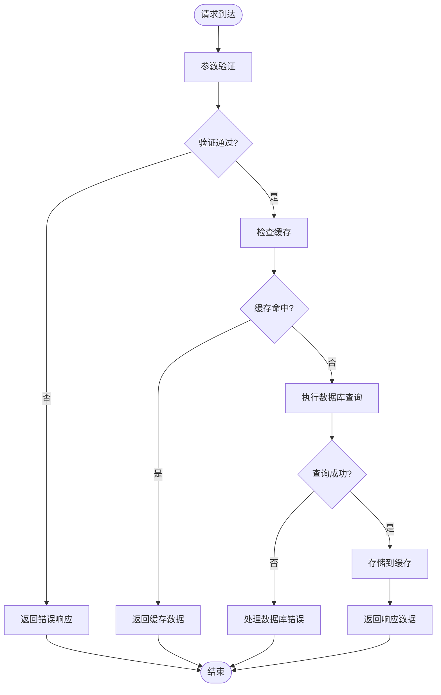
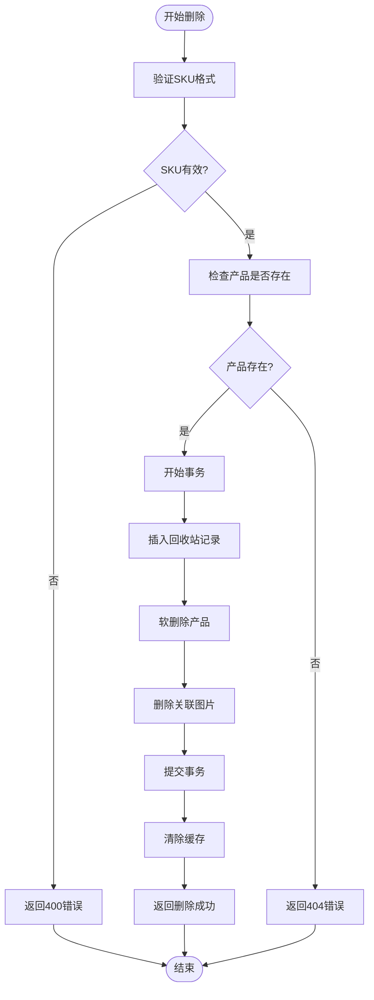
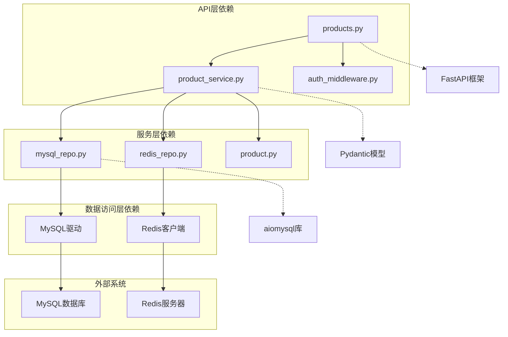
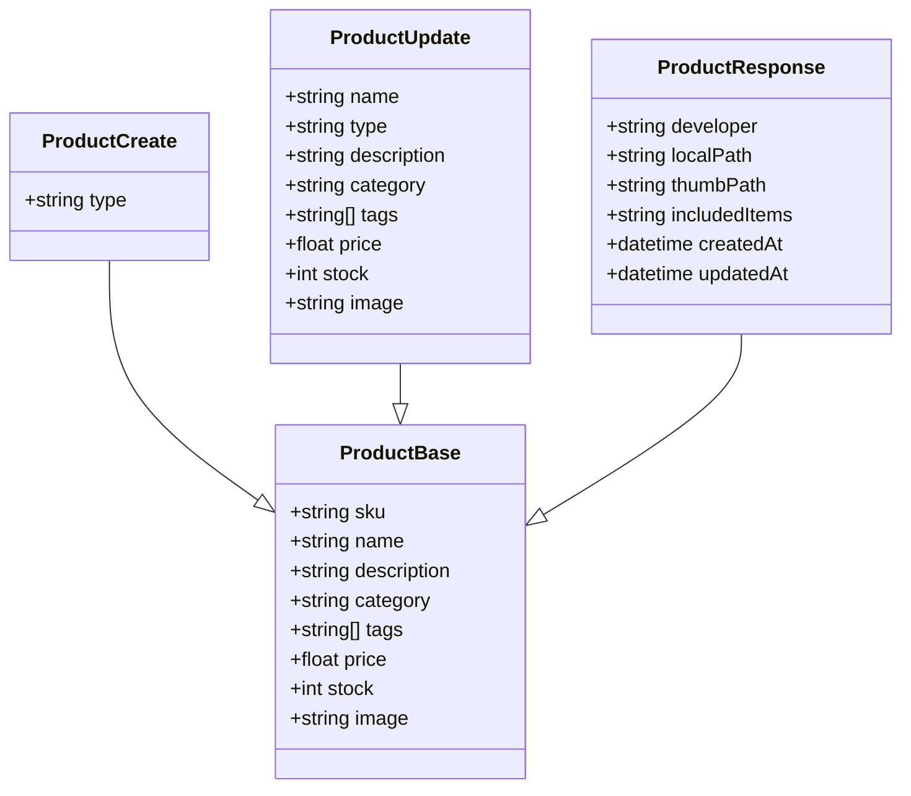

# 产品基础CRUD操作

<cite>
**本文档引用的文件**
- [backend/app/api/v1/products.py](file://backend/app/api/v1/products.py)
- [backend/app/models/product.py](file://backend/app/models/product.py)
- [backend/app/services/product_service.py](file://backend/app/services/product_service.py)
- [backend/app/repositories/mysql_repo.py](file://backend/app/repositories/mysql_repo.py)
</cite>

## 目录
1. [简介](#简介)
2. [项目结构](#项目结构)
3. [核心组件](#核心组件)
4. [架构概览](#架构概览)
5. [详细组件分析](#详细组件分析)
6. [依赖关系分析](#依赖关系分析)
7. [性能考虑](#性能考虑)
8. [故障排除指南](#故障排除指南)
9. [结论](#结论)

## 简介
本文件为产品基础CRUD操作的详细API文档，涵盖产品创建、查询、更新、删除以及批量操作的完整实现。文档详细说明了每个接口的请求参数、响应格式、错误处理机制，并解释了产品数据模型的字段定义。同时提供了批量删除和批量更新接口的使用方法和最佳实践。

## 项目结构
基于FastAPI框架构建的Python后端服务，采用分层架构设计：



**图表来源**
- [backend/app/api/v1/products.py:33](file://backend/app/api/v1/products.py#L33)
- [backend/app/services/product_service.py:21](file://backend/app/services/product_service.py#L21)
- [backend/app/repositories/mysql_repo.py:11](file://backend/app/repositories/mysql_repo.py#L11)

**章节来源**
- [backend/app/api/v1/products.py:1-795](file://backend/app/api/v1/products.py#L1-L795)
- [backend/app/models/product.py:1-143](file://backend/app/models/product.py#L1-L143)

## 核心组件

### 产品数据模型
产品系统的核心数据模型包含以下关键组件：

#### 基础模型（ProductBase）
- **sku**: 产品SKU，必填，长度1-100字符
- **name**: 产品名称，必填，长度1-255字符  
- **description**: 产品描述，可选
- **category**: 产品分类，可选，长度不超过100字符
- **tags**: 产品标签列表，可选
- **price**: 产品价格，可选，必须≥0
- **stock**: 库存数量，可选，必须≥0
- **image**: 产品图片URL，可选

#### 创建模型（ProductCreate）
继承基础模型，添加：
- **type**: 产品类型，必填，默认"普通产品"，枚举值：普通产品/组合产品/定制产品

#### 更新模型（ProductUpdate）
所有字段均为可选，支持部分字段更新

#### 响应模型（ProductResponse）
扩展基础模型，包含：
- **developer**: 开发负责人，可选
- **local_path**: 本地图片路径，可选
- **thumb_path**: 缩略图路径，可选
- **included_items**: 包含单品，可选
- **created_at**: 创建时间，必填
- **updated_at**: 更新时间，必填
- **delete_time**: 删除时间，可选

**章节来源**
- [backend/app/models/product.py:6](file://backend/app/models/product.py#L6-L70)

### API路由结构
系统提供以下核心API路由：

```mermaid
graph LR
subgraph "产品CRUD接口"
A[POST /products<br/>创建产品]
B[GET /products/{sku}<br/>获取产品详情]
C[PUT /products/{sku}<br/>更新产品]
D[DELETE /products/{sku}<br/>删除产品]
end
subgraph "批量操作接口"
E[POST /products/batch-delete<br/>批量删除]
F[PUT /products/batch<br/>批量更新]
end
subgraph "辅助接口"
G[GET /products/list<br/>产品列表]
H[GET /products/stats/summary<br/>统计信息]
I[GET /products/categories<br/>分类统计]
end
A --> B
B --> C
C --> D
E --> F
```

**图表来源**
- [backend/app/api/v1/products.py:53](file://backend/app/api/v1/products.py#L53-L476)

**章节来源**
- [backend/app/api/v1/products.py:33](file://backend/app/api/v1/products.py#L33-L476)

## 架构概览

### 整体架构设计



**图表来源**
- [backend/app/api/v1/products.py:36](file://backend/app/api/v1/products.py#L36-L50)
- [backend/app/services/product_service.py:29](file://backend/app/services/product_service.py#L29-L36)

### 数据流处理



**图表来源**
- [backend/app/services/product_service.py:85](file://backend/app/services/product_service.py#L85-L124)
- [backend/app/services/product_service.py:125](file://backend/app/services/product_service.py#L125-L242)

**章节来源**
- [backend/app/services/product_service.py:21](file://backend/app/services/product_service.py#L21-L745)

## 详细组件分析

### 产品创建接口（POST /products）

#### 接口定义
- **方法**: POST
- **路径**: `/products`
- **认证**: 需要用户认证
- **功能**: 创建新产品记录

#### 请求参数
```json
{
  "sku": "string",
  "name": "string", 
  "type": "普通产品|组合产品|定制产品",
  "description": "string",
  "category": "string",
  "tags": ["string"],
  "price": number,
  "stock": integer,
  "image": "string"
}
```

#### 响应格式
```json
{
  "code": 200,
  "message": "创建成功",
  "data": {
    "sku": "string",
    "name": "string",
    "type": "string",
    "description": "string",
    "category": "string",
    "tags": ["string"],
    "price": number,
    "stock": integer,
    "image": "string",
    "developer": "string",
    "localPath": "string",
    "thumbPath": "string",
    "includedItems": "string",
    "createdAt": "datetime",
    "updatedAt": "datetime"
  }
}
```

#### 错误处理
- **400错误**: 参数验证失败
- **500错误**: 服务器内部错误

#### 使用示例
```bash
curl -X POST "http://localhost:8000/products" \
  -H "Content-Type: application/json" \
  -H "Authorization: Bearer YOUR_TOKEN" \
  -d '{
    "sku": "PROD001",
    "name": "示例产品",
    "type": "普通产品",
    "price": 99.99,
    "stock": 100
  }'
```

**章节来源**
- [backend/app/api/v1/products.py:53](file://backend/app/api/v1/products.py#L53-L86)
- [backend/app/models/product.py:22](file://backend/app/models/product.py#L22-L28)

### 产品查询接口（GET /products/{sku}）

#### 接口定义
- **方法**: GET
- **路径**: `/products/{sku}`
- **认证**: 需要用户认证
- **功能**: 根据SKU获取产品详细信息

#### 路径参数
- **sku**: 产品SKU（必填）

#### 响应格式
```json
{
  "code": 200,
  "message": "获取成功",
  "data": {
    "sku": "string",
    "name": "string",
    "type": "string",
    "description": "string",
    "category": "string",
    "tags": ["string"],
    "price": number,
    "stock": integer,
    "image": "string",
    "developer": "string",
    "localPath": "string",
    "thumbPath": "string",
    "includedItems": "string",
    "createdAt": "datetime",
    "updatedAt": "datetime"
  }
}
```

#### 错误处理
- **404错误**: 产品不存在
- **500错误**: 服务器内部错误

#### 使用示例
```bash
curl -X GET "http://localhost:8000/products/PROD001" \
  -H "Authorization: Bearer YOUR_TOKEN"
```

**章节来源**
- [backend/app/api/v1/products.py:227](file://backend/app/api/v1/products.py#L227-L257)
- [backend/app/services/product_service.py:85](file://backend/app/services/product_service.py#L85-L124)

### 产品更新接口（PUT /products/{sku}）

#### 接口定义
- **方法**: PUT
- **路径**: `/products/{sku}`
- **认证**: 需要用户认证
- **功能**: 更新现有产品信息

#### 路径参数
- **sku**: 产品SKU（必填）

#### 请求参数
支持部分字段更新，可包含以下字段：
```json
{
  "name": "string",
  "type": "普通产品|组合产品|定制产品",
  "description": "string", 
  "category": "string",
  "tags": ["string"],
  "price": number,
  "stock": integer,
  "image": "string"
}
```

#### 响应格式
```json
{
  "code": 200,
  "message": "更新成功",
  "data": {
    "sku": "string",
    "name": "string",
    "type": "string",
    "description": "string",
    "category": "string",
    "tags": ["string"],
    "price": number,
    "stock": integer,
    "image": "string",
    "developer": "string",
    "localPath": "string",
    "thumbPath": "string",
    "includedItems": "string",
    "createdAt": "datetime",
    "updatedAt": "datetime"
  }
}
```

#### 错误处理
- **400错误**: 更新字段为空或验证失败
- **404错误**: 产品不存在
- **500错误**: 服务器内部错误

#### 使用示例
```bash
curl -X PUT "http://localhost:8000/products/PROD001" \
  -H "Content-Type: application/json" \
  -H "Authorization: Bearer YOUR_TOKEN" \
  -d '{
    "price": 89.99,
    "stock": 150
  }'
```

**章节来源**
- [backend/app/api/v1/products.py:259](file://backend/app/api/v1/products.py#L259-L297)
- [backend/app/services/product_service.py:243](file://backend/app/services/product_service.py#L243-L324)

### 产品删除接口（DELETE /products/{sku}）

#### 接口定义
- **方法**: DELETE
- **路径**: `/products/{sku}`
- **认证**: 需要用户认证
- **功能**: 软删除产品（移动到回收站）

#### 路径参数
- **sku**: 产品SKU（必填，1-50字符，仅允许字母数字下划线短横线）

#### 响应格式
```json
{
  "code": 200,
  "message": "删除成功",
  "data": null
}
```

#### 错误处理
- **400错误**: SKU格式无效或为空
- **404错误**: 产品不存在
- **500错误**: 删除操作失败

#### 删除流程


**图表来源**
- [backend/app/api/v1/products.py:299](file://backend/app/api/v1/products.py#L299-L348)
- [backend/app/services/product_service.py:325](file://backend/app/services/product_service.py#L325-L413)

**章节来源**
- [backend/app/api/v1/products.py:299](file://backend/app/api/v1/products.py#L299-L348)
- [backend/app/services/product_service.py:325](file://backend/app/services/product_service.py#L325-L413)

### 批量删除接口（POST /products/batch-delete）

#### 接口定义
- **方法**: POST
- **路径**: `/products/batch-delete`
- **认证**: 需要用户认证
- **功能**: 批量删除多个产品

#### 请求参数
```json
{
  "skus": ["SKU1", "SKU2", "SKU3"]
}
```

#### 响应格式
```json
{
  "code": 200,
  "message": "成功删除X个产品",
  "data": {
    "count": 5
  }
}
```

#### 限制条件
- 最多支持100个SKU
- 每个SKU长度不超过50字符
- 仅允许字母、数字、下划线、短横线

#### 错误处理
- **400错误**: SKU列表为空或格式无效
- **404错误**: 没有找到有效的产品SKU
- **500错误**: 批量删除操作失败

**章节来源**
- [backend/app/api/v1/products.py:350](file://backend/app/api/v1/products.py#L350-L415)
- [backend/app/services/product_service.py:414](file://backend/app/services/product_service.py#L414-L522)

### 批量更新接口（PUT /products/batch）

#### 接口定义
- **方法**: PUT
- **路径**: `/products/batch`
- **认证**: 需要用户认证
- **功能**: 批量更新多个产品

#### 请求参数
```json
{
  "updates": [
    {
      "sku": "SKU1",
      "price": 99.99,
      "stock": 100
    },
    {
      "sku": "SKU2", 
      "name": "新名称"
    }
  ]
}
```

#### 响应格式
```json
{
  "code": 200,
  "message": "批量更新完成：成功X条，失败Y条",
  "data": {
    "success": 5,
    "failed": 2,
    "errors": [
      {"sku": "SKU1", "error": "错误信息"}
    ]
  }
}
```

#### 错误处理
- **400错误**: 更新列表为空
- **500错误**: 批量更新操作失败

#### 使用示例
```bash
curl -X PUT "http://localhost:8000/products/batch" \
  -H "Content-Type: application/json" \
  -H "Authorization: Bearer YOUR_TOKEN" \
  -d '{
    "updates": [
      {
        "sku": "PROD001",
        "price": 89.99
      },
      {
        "sku": "PROD002", 
        "stock": 150
      }
    ]
  }'
```

**章节来源**
- [backend/app/api/v1/products.py:471](file://backend/app/api/v1/products.py#L471-L550)

## 依赖关系分析

### 组件依赖图



**图表来源**
- [backend/app/api/v1/products.py:18](file://backend/app/api/v1/products.py#L18-L29)
- [backend/app/services/product_service.py:6](file://backend/app/services/product_service.py#L6-L18)

### 数据模型关系



**图表来源**
- [backend/app/models/product.py:6](file://backend/app/models/product.py#L6-L62)

**章节来源**
- [backend/app/models/product.py:1-143](file://backend/app/models/product.py#L1-L143)

## 性能考虑

### 缓存策略
系统实现了多层次的缓存机制：

1. **产品详情缓存**: 缓存时间为1小时
2. **产品列表缓存**: 缓存时间为5分钟  
3. **权限缓存**: 缓存时间为5分钟

### 数据库优化
- **连接池管理**: 默认30个连接，支持20个溢出连接
- **查询超时控制**: 默认30秒超时
- **索引优化**: 自动创建必要索引
- **事务管理**: 支持批量操作的原子性

### 性能监控
系统内置性能指标收集：
- 总查询次数
- 平均执行时间
- 慢查询率（>500ms）
- 中等查询率（>100ms）

**章节来源**
- [backend/app/services/product_service.py:96](file://backend/app/services/product_service.py#L96-L117)
- [backend/app/repositories/mysql_repo.py:301](file://backend/app/repositories/mysql_repo.py#L301-L367)

## 故障排除指南

### 常见错误及解决方案

#### 400错误（参数验证失败）
- **SKU格式错误**: 确保SKU只包含字母、数字、下划线、短横线，长度不超过50字符
- **价格/库存负数**: 确保价格和库存值≥0
- **产品类型非法**: 仅支持"普通产品"、"组合产品"、"定制产品"

#### 404错误（资源不存在）
- **产品SKU不存在**: 检查SKU是否正确，确认产品是否已被删除
- **批量操作SKU无效**: 验证每个SKU的有效性

#### 500错误（服务器内部错误）
- **数据库连接失败**: 检查数据库连接配置
- **缓存服务不可用**: 验证Redis连接状态
- **事务执行失败**: 检查数据库约束和触发器

#### 性能问题排查
- **查询超时**: 优化查询条件，添加适当索引
- **缓存命中率低**: 检查缓存键生成逻辑
- **连接池耗尽**: 增加连接池大小或优化并发

**章节来源**
- [backend/app/api/v1/products.py:299](file://backend/app/api/v1/products.py#L299-L348)
- [backend/app/repositories/mysql_repo.py:461](file://backend/app/repositories/mysql_repo.py#L461-L469)

## 结论
本产品基础CRUD操作API提供了完整的电商产品管理功能，具有以下特点：

1. **完整的CRUD支持**: 支持产品创建、查询、更新、删除的全生命周期管理
2. **批量操作能力**: 提供高效的批量删除和批量更新功能
3. **性能优化**: 实现了多级缓存和数据库连接池优化
4. **错误处理**: 完善的错误处理和异常管理机制
5. **扩展性**: 基于分层架构设计，便于功能扩展和维护

建议在生产环境中：
- 配置适当的Redis缓存服务
- 监控数据库性能指标
- 定期清理过期缓存
- 实施适当的备份策略
- 部署负载均衡和高可用架构