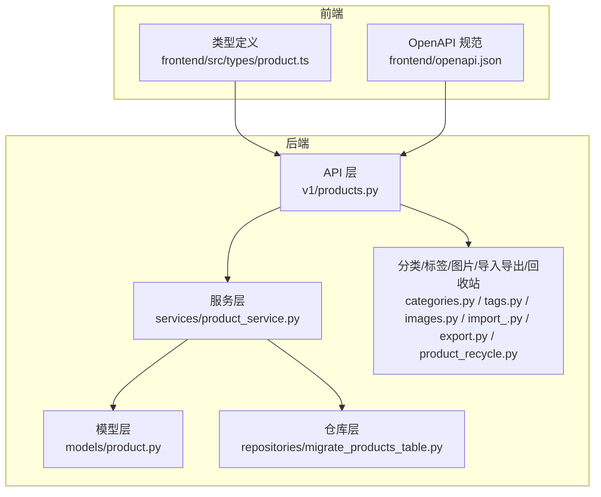
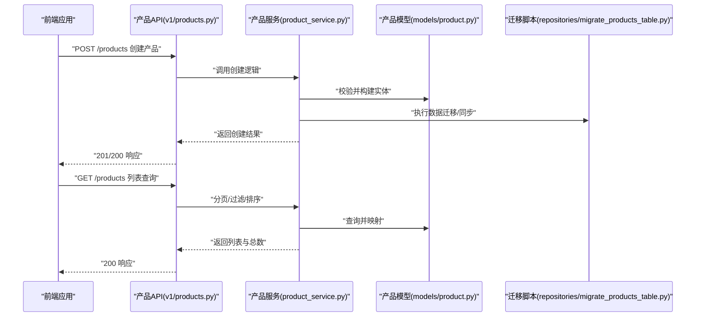
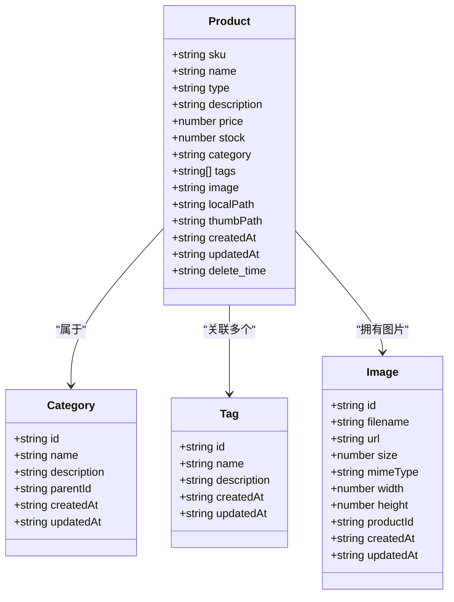
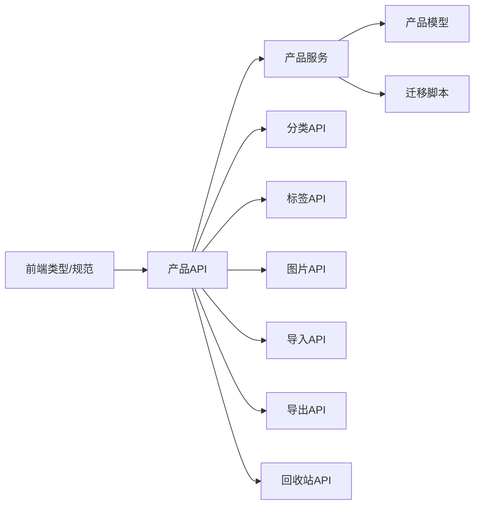
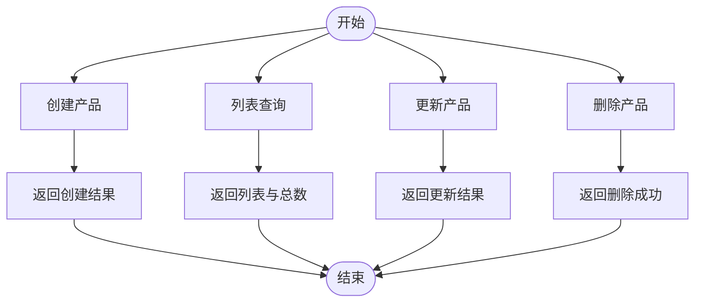

# 产品管理API

<cite>
**本文引用的文件**
- [backend/app/api/v1/products.py](file://backend/app/api/v1/products.py)
- [backend/app/models/product.py](file://backend/app/models/product.py)
- [backend/app/services/product_service.py](file://backend/app/services/product_service.py)
- [backend/app/api/v1/categories.py](file://backend/app/api/v1/categories.py)
- [backend/app/api/v1/tags.py](file://backend/app/api/v1/tags.py)
- [backend/app/api/v1/images.py](file://backend/app/api/v1/images.py)
- [backend/app/api/v1/export.py](file://backend/app/api/v1/export.py)
- [backend/app/api/v1/import_.py](file://backend/app/api/v1/import_.py)
- [backend/app/api/v1/product_recycle.py](file://backend/app/api/v1/product_recycle.py)
- [backend/app/schemas/product_data.py](file://backend/app/schemas/product_data.py)
- [backend/app/services/product_data_service.py](file://backend/app/services/product_data_service.py)
- [backend/app/repositories/migrate_products_table.py](file://backend/app/repositories/migrate_products_table.py)
- [frontend/src/types/product.ts](file://frontend/src/types/product.ts)
- [frontend/openapi.json](file://frontend/openapi.json)
</cite>

## 目录
1. [简介](#简介)
2. [项目结构](#项目结构)
3. [核心组件](#核心组件)
4. [架构总览](#架构总览)
5. [详细组件分析](#详细组件分析)
6. [依赖关系分析](#依赖关系分析)
7. [性能考量](#性能考量)
8. [故障排查指南](#故障排查指南)
9. [结论](#结论)
10. [附录](#附录)

## 简介
本文件为产品管理系统的API文档，覆盖产品数据的完整CRUD操作、分类与标签管理、批量操作、搜索过滤排序参数、状态与版本控制机制、图片上传与管理、以及导入导出功能与格式要求。文档以后端API实现与前端类型定义为依据，确保接口描述与实际代码保持一致。

## 项目结构
后端采用分层架构：API层负责路由与请求响应；服务层封装业务逻辑；模型层定义数据结构；仓库层处理迁移与数据访问；脚本与工具支持数据治理与导入导出。

图表来源
- [backend/app/api/v1/products.py](file://backend/app/api/v1/products.py)
- [backend/app/services/product_service.py](file://backend/app/services/product_service.py)
- [backend/app/models/product.py](file://backend/app/models/product.py)
- [backend/app/repositories/migrate_products_table.py](file://backend/app/repositories/migrate_products_table.py)
- [backend/app/api/v1/categories.py](file://backend/app/api/v1/categories.py)
- [backend/app/api/v1/tags.py](file://backend/app/api/v1/tags.py)
- [backend/app/api/v1/images.py](file://backend/app/api/v1/images.py)
- [backend/app/api/v1/import_.py](file://backend/app/api/v1/import_.py)
- [backend/app/api/v1/export.py](file://backend/app/api/v1/export.py)
- [backend/app/api/v1/product_recycle.py](file://backend/app/api/v1/product_recycle.py)
- [frontend/src/types/product.ts](file://frontend/src/types/product.ts)
- [frontend/openapi.json](file://frontend/openapi.json)

章节来源
- [backend/app/api/v1/products.py](file://backend/app/api/v1/products.py)
- [backend/app/models/product.py](file://backend/app/models/product.py)
- [backend/app/services/product_service.py](file://backend/app/services/product_service.py)
- [backend/app/repositories/migrate_products_table.py](file://backend/app/repositories/migrate_products_table.py)
- [frontend/src/types/product.ts](file://frontend/src/types/product.ts)
- [frontend/openapi.json](file://frontend/openapi.json)

## 核心组件
- 产品API：提供产品创建、查询、更新、删除与列表分页等接口。
- 分类API：提供分类的增删改查与层级管理。
- 标签API：提供标签的增删改查与关联管理。
- 图片API：提供图片上传、预览、管理与缩略图生成。
- 批量操作：支持批量导入、导出与回收站管理。
- 数据治理：通过迁移脚本与服务层保证数据一致性与版本演进。

章节来源
- [backend/app/api/v1/products.py](file://backend/app/api/v1/products.py)
- [backend/app/api/v1/categories.py](file://backend/app/api/v1/categories.py)
- [backend/app/api/v1/tags.py](file://backend/app/api/v1/tags.py)
- [backend/app/api/v1/images.py](file://backend/app/api/v1/images.py)
- [backend/app/api/v1/export.py](file://backend/app/api/v1/export.py)
- [backend/app/api/v1/import_.py](file://backend/app/api/v1/import_.py)
- [backend/app/api/v1/product_recycle.py](file://backend/app/api/v1/product_recycle.py)

## 架构总览
产品管理API遵循“API → 服务 → 模型/仓库”的分层设计，前端通过类型定义与OpenAPI规范对接后端接口。

图表来源
- [backend/app/api/v1/products.py](file://backend/app/api/v1/products.py)
- [backend/app/services/product_service.py](file://backend/app/services/product_service.py)
- [backend/app/models/product.py](file://backend/app/models/product.py)
- [backend/app/repositories/migrate_products_table.py](file://backend/app/repositories/migrate_products_table.py)

## 详细组件分析

### 产品数据模型与字段定义
- 字段概览（基于前端类型与API规范）：
  - 标识与基础信息：sku、name、type（普通产品/组合产品/定制产品）
  - 描述与属性：description、price、stock、category、tags
  - 媒体与元信息：image、localPath、thumbPath
  - 时间戳：createdAt、updatedAt、delete_time
- 类型约束与默认值：
  - 字符串字段允许为空或缺失
  - 数值字段如price、stock若未提供则为空
  - 类型枚举由前端定义，后端按字符串处理
- 版本与状态：
  - 未在模型中发现显式版本号字段
  - 软删除通过delete_time字段体现

章节来源
- [frontend/src/types/product.ts](file://frontend/src/types/product.ts)
- [frontend/openapi.json](file://frontend/openapi.json)

### 产品CRUD接口
- 创建产品
  - 方法与路径：POST /products
  - 请求体：包含必需字段（如sku、name、type）与可选字段（如description、price、stock、category、tags、image等）
  - 响应：201 Created 或 200 OK，返回创建后的完整产品对象
- 查询单个产品
  - 方法与路径：GET /products/{id}
  - 参数：路径参数id
  - 响应：200 OK，返回产品详情
- 更新产品
  - 方法与路径：PUT /products/{id}
  - 参数：路径参数id；请求体为部分字段更新
  - 响应：200 OK，返回更新后的对象
- 删除产品
  - 方法与路径：DELETE /products/{id}
  - 参数：路径参数id
  - 响应：204 No Content 或 200 OK（视软删除策略而定）
- 列表与分页
  - 方法与路径：GET /products
  - 查询参数：page、size、sku、name、type、category
  - 响应：200 OK，返回list、total、page、size

章节来源
- [backend/app/api/v1/products.py](file://backend/app/api/v1/products.py)
- [frontend/openapi.json](file://frontend/openapi.json)

### 产品搜索、过滤与排序
- 搜索与过滤
  - 支持按sku、name、type、category进行过滤
  - 支持分页参数page、size
- 排序
  - 在API规范中未发现显式的sort参数定义
  - 若需排序，请在服务层扩展查询条件（例如按createdAt降序）

章节来源
- [frontend/openapi.json](file://frontend/openapi.json)
- [backend/app/api/v1/products.py](file://backend/app/api/v1/products.py)

### 产品状态管理与版本控制
- 状态管理
  - 未在模型中发现专门的状态字段
  - 软删除通过delete_time字段实现
- 版本控制
  - 未发现显式的版本号字段
  - 可通过createdAt/updatedAt进行变更追踪

章节来源
- [backend/app/models/product.py](file://backend/app/models/product.py)
- [frontend/src/types/product.ts](file://frontend/src/types/product.ts)

### 产品分类管理
- 接口
  - GET /categories：分页列出分类
  - POST /categories：创建分类
  - PUT /categories/{id}：更新分类
  - DELETE /categories/{id}：删除分类
- 字段
  - id、name、description、parentId、createdAt、updatedAt
- 过滤与分页
  - 支持按name、parentId过滤，page、size分页

章节来源
- [backend/app/api/v1/categories.py](file://backend/app/api/v1/categories.py)
- [frontend/openapi.json](file://frontend/openapi.json)

### 产品标签管理
- 接口
  - GET /tags：分页列出标签
  - POST /tags：创建标签
  - PUT /tags/{id}：更新标签
  - DELETE /tags/{id}：删除标签
- 字段
  - id、name、description、createdAt、updatedAt
- 过滤与分页
  - 支持按name过滤，page、size分页

章节来源
- [backend/app/api/v1/tags.py](file://backend/app/api/v1/tags.py)
- [frontend/openapi.json](file://frontend/openapi.json)

### 产品图片上传、预览与管理
- 接口
  - POST /images/upload：上传图片
  - GET /images：分页列出图片
  - GET /images/{id}：获取图片详情
  - DELETE /images/{id}：删除图片
- 字段
  - id、filename、url、size、mimeType、width、height、productId、createdAt、updatedAt
- 过滤与分页
  - 支持按filename、productId过滤，page、size分页

章节来源
- [backend/app/api/v1/images.py](file://backend/app/api/v1/images.py)
- [frontend/openapi.json](file://frontend/openapi.json)

### 批量操作与数据治理
- 批量导入
  - 接口：POST /import/products
  - 功能：从Excel/CSV批量导入产品数据
  - 返回：批处理结果与统计
- 批量导出
  - 接口：POST /export/products
  - 功能：按筛选条件导出产品数据为Excel/CSV
  - 返回：下载任务ID或直接下载文件
- 回收站
  - 接口：GET /product-recycle/bin 列出回收站产品
  - 接口：POST /product-recycle/restore/{id} 还原
  - 接口：DELETE /product-recycle/delete/{id} 彻底删除
- 数据迁移
  - 脚本：repositories/migrate_products_table.py
  - 功能：初始化/迁移产品表结构，确保字段一致性

章节来源
- [backend/app/api/v1/import_.py](file://backend/app/api/v1/import_.py)
- [backend/app/api/v1/export.py](file://backend/app/api/v1/export.py)
- [backend/app/api/v1/product_recycle.py](file://backend/app/api/v1/product_recycle.py)
- [backend/app/repositories/migrate_products_table.py](file://backend/app/repositories/migrate_products_table.py)

### 产品数据模型类图

图表来源
- [frontend/src/types/product.ts](file://frontend/src/types/product.ts)
- [frontend/openapi.json](file://frontend/openapi.json)

## 依赖关系分析
- API层依赖服务层；服务层依赖模型与仓库层；前端类型与OpenAPI规范作为契约约束。
- 分类、标签、图片API与产品API相互独立但共享通用的分页与过滤模式。
- 批量导入导出与回收站API依赖产品服务与仓库迁移脚本。

图表来源
- [backend/app/api/v1/products.py](file://backend/app/api/v1/products.py)
- [backend/app/services/product_service.py](file://backend/app/services/product_service.py)
- [backend/app/models/product.py](file://backend/app/models/product.py)
- [backend/app/repositories/migrate_products_table.py](file://backend/app/repositories/migrate_products_table.py)
- [backend/app/api/v1/categories.py](file://backend/app/api/v1/categories.py)
- [backend/app/api/v1/tags.py](file://backend/app/api/v1/tags.py)
- [backend/app/api/v1/images.py](file://backend/app/api/v1/images.py)
- [backend/app/api/v1/import_.py](file://backend/app/api/v1/import_.py)
- [backend/app/api/v1/export.py](file://backend/app/api/v1/export.py)
- [backend/app/api/v1/product_recycle.py](file://backend/app/api/v1/product_recycle.py)
- [frontend/src/types/product.ts](file://frontend/src/types/product.ts)
- [frontend/openapi.json](file://frontend/openapi.json)

## 性能考量
- 分页与过滤：优先使用page/size与精确过滤字段（如sku、category），避免全表扫描。
- 排序：若无内置sort参数，建议在服务层增加索引与排序条件，减少内存排序开销。
- 图片：使用缩略图与懒加载，控制并发上传数量，避免阻塞主流程。
- 批量操作：导入导出建议异步执行并返回任务ID，前端轮询进度。

## 故障排查指南
- 422 校验错误：检查请求体字段类型与必填项是否符合模型定义。
- 404 未找到：确认资源ID是否存在，尤其是软删除后的产品。
- 500 服务器错误：查看服务层日志与仓库迁移脚本执行情况。
- 图片上传失败：检查文件大小、MIME类型与存储配置。

章节来源
- [frontend/openapi.json](file://frontend/openapi.json)
- [backend/app/api/v1/products.py](file://backend/app/api/v1/products.py)
- [backend/app/services/product_service.py](file://backend/app/services/product_service.py)

## 结论
本API文档基于现有后端实现与前端类型定义，提供了产品管理的核心能力说明。对于未在当前代码中体现的功能（如显式版本号、排序参数），可在服务层扩展实现，并通过OpenAPI规范对外发布。

## 附录

### 产品CRUD流程图

图表来源
- [backend/app/api/v1/products.py](file://backend/app/api/v1/products.py)