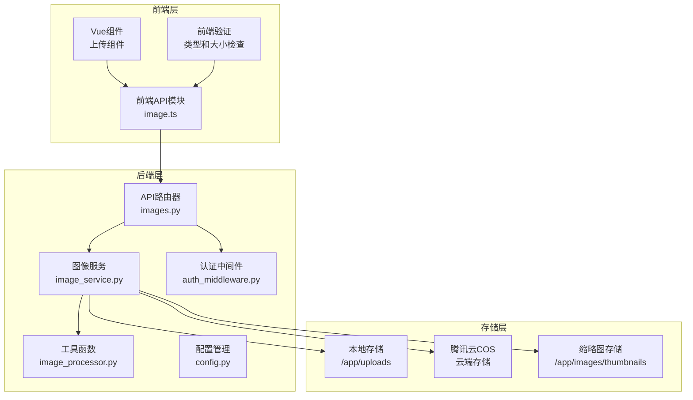
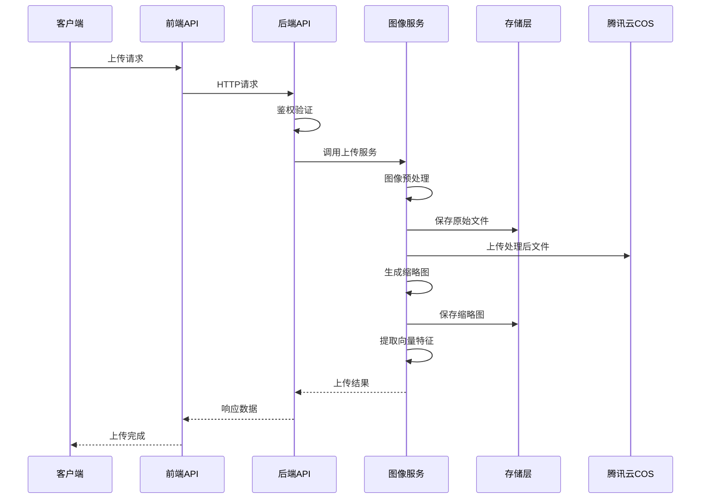
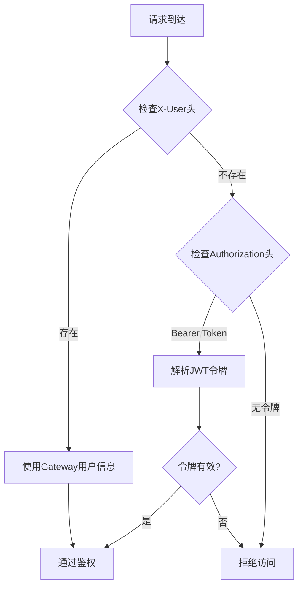
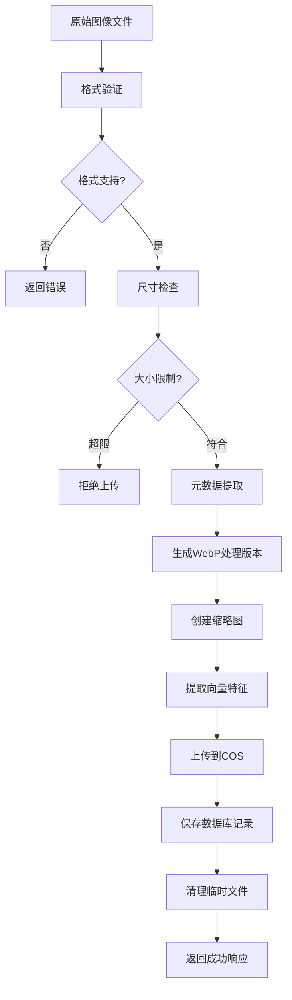
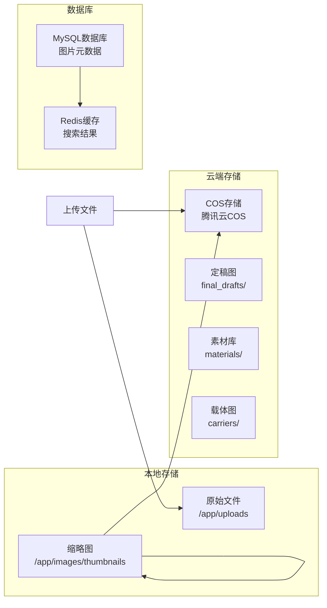
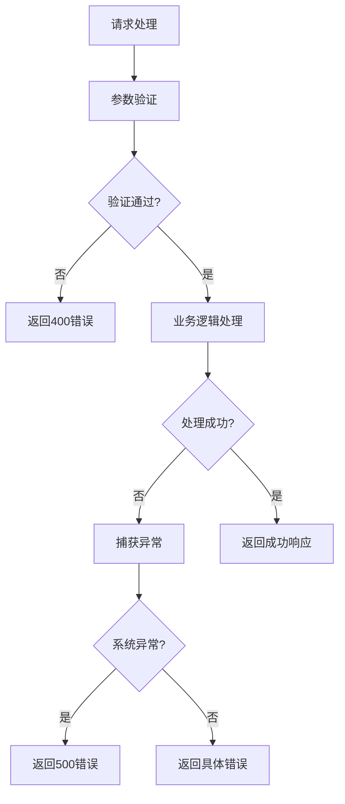
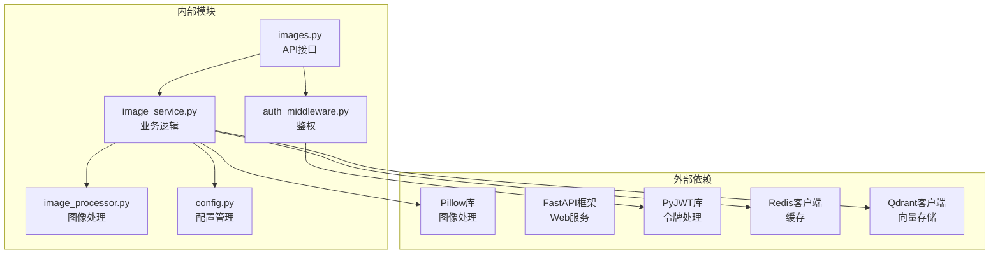

# 图像上传API

<cite>
**本文档引用的文件**
- [backend/app/api/v1/images.py](file://backend/app/api/v1/images.py)
- [backend/app/services/image_service.py](file://backend/app/services/image_service.py)
- [backend/app/utils/image_processor.py](file://backend/app/utils/image_processor.py)
- [backend/app/middleware/auth_middleware.py](file://backend/app/middleware/auth_middleware.py)
- [backend/app/config.py](file://backend/app/config.py)
- [backend/app/api/v1/system_config.py](file://backend/app/api/v1/system_config.py)
- [frontend/src/api/image.ts](file://frontend/src/api/image.ts)
- [frontend/openapi.json](file://frontend/openapi.json)
- [frontend/src/views/FinalDraft/components/BatchImportDialog.vue](file://frontend/src/views/FinalDraft/components/BatchImportDialog.vue)
- [frontend/src/views/CarrierLibrary/components/CarrierDialog.vue](file://frontend/src/views/CarrierLibrary/components/CarrierDialog.vue)
</cite>

## 目录
1. [简介](#简介)
2. [项目结构](#项目结构)
3. [核心组件](#核心组件)
4. [架构概览](#架构概览)
5. [详细组件分析](#详细组件分析)
6. [依赖关系分析](#依赖关系分析)
7. [性能考虑](#性能考虑)
8. [故障排除指南](#故障排除指南)
9. [结论](#结论)
10. [附录](#附录)

## 简介

图像上传API是思觉智贸系统的核心功能模块，负责处理图片的上传、存储、预处理和管理。该API支持单文件和批量上传，提供完整的图像处理流水线，包括格式转换、尺寸调整、质量压缩和向量特征提取。

本API采用FastAPI框架构建，具备以下特性：
- 支持多种图像格式（JPG、PNG、WEBP等）
- 完整的鉴权机制和安全验证
- 智能图像预处理和优化
- 批量上传和单文件上传两种模式
- 进度跟踪和错误处理
- 缓存优化和性能监控

## 项目结构

图像上传功能分布在前后端两个主要部分：



**图表来源**
- [backend/app/api/v1/images.py:1-25](file://backend/app/api/v1/images.py#L1-L25)
- [backend/app/services/image_service.py:16-51](file://backend/app/services/image_service.py#L16-L51)
- [backend/app/config.py:95-136](file://backend/app/config.py#L95-L136)

**章节来源**
- [backend/app/api/v1/images.py:1-25](file://backend/app/api/v1/images.py#L1-L25)
- [backend/app/services/image_service.py:16-51](file://backend/app/services/image_service.py#L16-L51)
- [backend/app/config.py:95-136](file://backend/app/config.py#L95-L136)

## 核心组件

### API接口定义

图像上传API提供以下核心接口：

| 接口 | 方法 | URL模式 | 描述 |
|------|------|---------|------|
| 单文件上传 | POST | `/api/v1/images/upload` | 上传单个图片文件 |
| 批量上传 | POST | `/api/v1/images/batch-upload` | 批量上传图片文件 |
| 获取图片信息 | GET | `/api/v1/images/{image_id}` | 获取图片详细信息 |
| 获取图片文件 | GET | `/api/v1/images/{image_id}/file` | 获取图片文件 |
| 获取缩略图 | GET | `/api/v1/images/{image_id}/thumbnail` | 获取缩略图 |
| 以图搜图 | POST | `/api/v1/images/search-similar` | 基于图片内容搜索相似图片 |

### 请求参数规范

#### 单文件上传参数
- `file`: 必需，图片文件对象
- `category`: 必需，图片分类（final/material/carrier）
- `tags`: 可选，逗号分隔的标签列表
- `description`: 可选，图片描述
- `sku`: 可选，产品SKU标识

#### 批量上传参数
- `files`: 必需，文件数组（最多100个）
- `category`: 必需，图片分类
- `tags`: 可选，标签列表
- `description`: 可选，图片描述
- `sku`: 可选，产品SKU

### 响应格式

所有API响应遵循统一格式：
```json
{
  "code": 200,
  "message": "操作成功",
  "data": {}
}
```

**章节来源**
- [backend/app/api/v1/images.py:46-200](file://backend/app/api/v1/images.py#L46-L200)
- [frontend/openapi.json:145-188](file://frontend/openapi.json#L145-L188)

## 架构概览

图像上传系统采用分层架构设计，确保功能模块的清晰分离和可维护性：



**图表来源**
- [backend/app/api/v1/images.py:46-200](file://backend/app/api/v1/images.py#L46-L200)
- [backend/app/services/image_service.py:52-267](file://backend/app/services/image_service.py#L52-L267)

## 详细组件分析

### 鉴权机制

系统采用双重鉴权机制，确保安全性：



**图表来源**
- [backend/app/middleware/auth_middleware.py:12-34](file://backend/app/middleware/auth_middleware.py#L12-L34)

#### 鉴权流程细节
- **Gateway集成**：优先从X-User-*头获取用户信息
- **JWT回退**：无Gateway头时解析Authorization头中的JWT
- **用户信息结构**：包含用户ID、用户名、角色信息
- **异常处理**：未登录状态返回401错误

**章节来源**
- [backend/app/middleware/auth_middleware.py:12-34](file://backend/app/middleware/auth_middleware.py#L12-L34)

### 图像预处理流程

图像上传后会经过完整的预处理流水线：



**图表来源**
- [backend/app/services/image_service.py:52-267](file://backend/app/services/image_service.py#L52-L267)

#### 预处理步骤详解

1. **格式验证**：支持JPG、PNG、WEBP、GIF、BMP格式
2. **尺寸调整**：最大1920x1920像素，保持宽高比
3. **格式转换**：统一转换为WebP格式进行存储
4. **质量压缩**：WebP质量80%，优化压缩率
5. **缩略图生成**：生成512x512像素WebP缩略图
6. **向量提取**：提取768维向量特征用于相似搜索

**章节来源**
- [backend/app/services/image_service.py:124-156](file://backend/app/services/image_service.py#L124-L156)
- [backend/app/utils/image_processor.py:15-62](file://backend/app/utils/image_processor.py#L15-L62)

### 存储策略

系统采用混合存储架构：



**图表来源**
- [backend/app/config.py:95-136](file://backend/app/config.py#L95-L136)
- [backend/app/services/image_service.py:205-255](file://backend/app/services/image_service.py#L205-L255)

#### 存储配置
- **本地目录**：`/app/uploads`（原始文件）、`/app/images/thumbnails`（缩略图）
- **云端前缀**：`images/`、`thumbnails/`、`final_drafts/`、`materials/`、`carriers/`
- **缓存策略**：Redis缓存图片信息和搜索结果

**章节来源**
- [backend/app/config.py:95-136](file://backend/app/config.py#L95-L136)
- [backend/app/services/image_service.py:205-255](file://backend/app/services/image_service.py#L205-L255)

### 错误处理机制

系统实现了多层次的错误处理：



**图表来源**
- [backend/app/api/v1/images.py:66-110](file://backend/app/api/v1/images.py#L66-L110)

#### 错误类型
- **400错误**：参数验证失败、文件格式不支持、大小超限
- **401错误**：未登录或鉴权失败
- **404错误**：图片不存在
- **500错误**：服务器内部错误

**章节来源**
- [backend/app/api/v1/images.py:66-110](file://backend/app/api/v1/images.py#L66-L110)

## 依赖关系分析

图像上传模块的依赖关系如下：



**图表来源**
- [backend/app/api/v1/images.py:9-21](file://backend/app/api/v1/images.py#L9-L21)
- [backend/app/services/image_service.py:1-13](file://backend/app/services/image_service.py#L1-L13)

### 关键依赖说明

- **Pillow (PIL)**：图像格式转换、尺寸调整、质量压缩
- **FastAPI**：异步Web框架，支持自动OpenAPI文档
- **PyJWT**：JWT令牌解析和验证
- **Redis**：缓存图片信息和搜索结果
- **Qdrant**：向量数据库，支持相似图片搜索

**章节来源**
- [backend/app/api/v1/images.py:9-21](file://backend/app/api/v1/images.py#L9-L21)
- [backend/app/services/image_service.py:1-13](file://backend/app/services/image_service.py#L1-L13)

## 性能考虑

### 缓存策略

系统采用多级缓存优化性能：

| 缓存层级 | 缓存内容 | TTL | 用途 |
|----------|----------|-----|------|
| Redis | 图片详情 | 3600秒 | 减少数据库查询 |
| Redis | 搜索结果 | 300秒 | 提升搜索性能 |
| Redis | 产品图片列表 | 600秒 | 优化列表加载 |
| 本地 | 缩略图 | 31536000秒 | CDN加速 |
| 云端 | 处理后图片 | 31536000秒 | CDN加速 |

### 并发处理

- **最大并发**：200个请求
- **异步任务**：最长600秒超时
- **工作进程**：最多15个异步工作者
- **速率限制**：每分钟120次，每小时2000次

### 存储优化

- **压缩算法**：WebP格式，压缩率更高
- **尺寸限制**：1920x1920像素，平衡质量和性能
- **CDN加速**：云端存储支持CDN分发
- **渐进式加载**：缩略图优先加载

## 故障排除指南

### 常见问题及解决方案

#### 1. 上传失败
**症状**：返回500错误
**原因**：
- 文件格式不支持
- 文件大小超限
- 磁盘空间不足
- 网络连接中断

**解决方法**：
- 检查文件格式是否为JPG、PNG、WEBP之一
- 确认文件大小不超过200MB
- 验证磁盘空间充足
- 重试网络连接

#### 2. 鉴权失败
**症状**：返回401错误
**原因**：
- 未提供有效的Authorization头
- JWT令牌无效或过期
- Gateway头信息缺失

**解决方法**：
- 确保请求包含有效的Bearer令牌
- 检查令牌格式和有效期
- 验证Gateway集成正常

#### 3. 图像处理异常
**症状**：图片无法正常显示
**原因**：
- 图像损坏
- 格式转换失败
- 缩略图生成失败

**解决方法**：
- 重新上传原始图像文件
- 检查图像完整性
- 清理缓存后重试

**章节来源**
- [backend/app/api/v1/images.py:195-200](file://backend/app/api/v1/images.py#L195-L200)
- [backend/app/services/image_service.py:264-267](file://backend/app/services/image_service.py#L264-L267)

### 调试工具

#### 前端调试
```typescript
// 前端上传示例
const uploadProgress = (progress: number) => {
  console.log(`上传进度: ${progress}%`);
};

const handleUpload = async (file: File) => {
  try {
    const response = await imageApi.upload(file, 'final', undefined, uploadProgress);
    console.log('上传结果:', response);
  } catch (error) {
    console.error('上传失败:', error);
  }
};
```

#### 后端日志
系统会在关键节点记录详细日志：
- 图像处理开始和结束
- 存储操作成功和失败
- 缓存命中和未命中
- 异常情况和错误信息

**章节来源**
- [frontend/src/api/image.ts:25-46](file://frontend/src/api/image.ts#L25-L46)
- [backend/app/services/image_service.py:124-156](file://backend/app/services/image_service.py#L124-L156)

## 结论

图像上传API提供了完整、高效、安全的图片处理解决方案。通过合理的架构设计和优化策略，系统能够满足大规模图片上传和管理的需求。

### 主要优势
- **多格式支持**：全面支持主流图像格式
- **智能预处理**：自动优化图像质量和性能
- **安全可靠**：双重鉴权机制确保系统安全
- **高性能**：多级缓存和CDN加速提升用户体验
- **易于扩展**：模块化设计便于功能扩展

### 技术特点
- 基于FastAPI的现代化Web框架
- 异步处理和并发优化
- 混合存储架构支持本地和云端
- 完整的错误处理和日志记录
- 自动化的图像处理流水线

## 附录

### 客户端调用示例

#### 单文件上传
```javascript
// 前端JavaScript示例
const uploadImage = async (file, category) => {
  const formData = new FormData();
  formData.append('file', file);
  formData.append('category', category);
  
  try {
    const response = await fetch('/api/v1/images/upload', {
      method: 'POST',
      body: formData,
      headers: {
        'Authorization': 'Bearer ' + token
      }
    });
    
    const result = await response.json();
    return result;
  } catch (error) {
    console.error('上传失败:', error);
  }
};
```

#### 批量上传
```javascript
// Vue组件示例
const handleBatchUpload = async (files) => {
  const formData = new FormData();
  files.forEach(file => {
    formData.append('files', file);
  });
  formData.append('category', 'final');
  
  try {
    const response = await imageApi.batchUpload(files, 'final');
    return response.data;
  } catch (error) {
    console.error('批量上传失败:', error);
  }
};
```

### 最佳实践建议

1. **文件验证**：在客户端进行格式和大小验证
2. **进度反馈**：提供实时上传进度显示
3. **错误处理**：优雅处理各种异常情况
4. **缓存策略**：合理利用缓存提升性能
5. **监控告警**：建立完善的监控和告警机制
6. **安全防护**：定期更新依赖和安全补丁

### 配置参数说明

| 参数名 | 默认值 | 说明 |
|--------|--------|------|
| MAX_UPLOAD_SIZE | 200MB | 最大文件大小限制 |
| BATCH_UPLOAD_MAX | 100 | 批量上传最大文件数 |
| THUMBNAIL_SIZE | 512x512 | 缩略图尺寸 |
| QDRANT_VECTOR_SIZE | 768 | 向量维度大小 |
| CACHE_TTL | 3600秒 | 缓存过期时间 |

**章节来源**
- [backend/app/config.py:109](file://backend/app/config.py#L109)
- [backend/app/config.py:210](file://backend/app/config.py#L210)
- [backend/app/config.py:91](file://backend/app/config.py#L91)
- [backend/app/config.py:160](file://backend/app/config.py#L160)