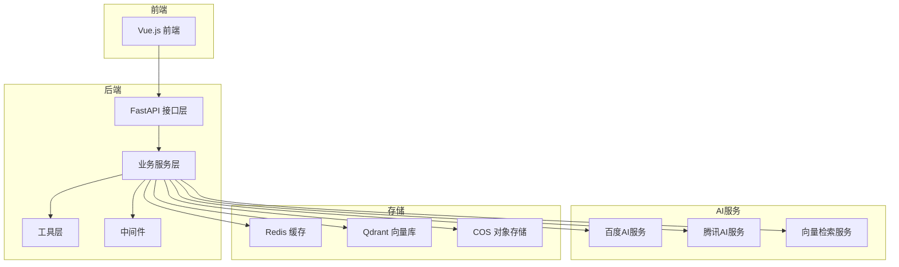
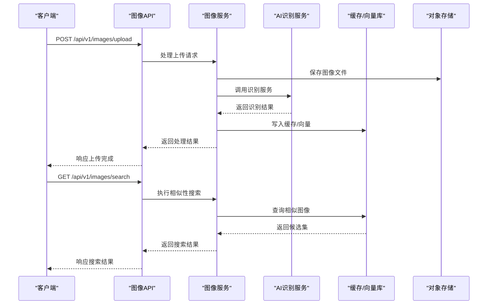
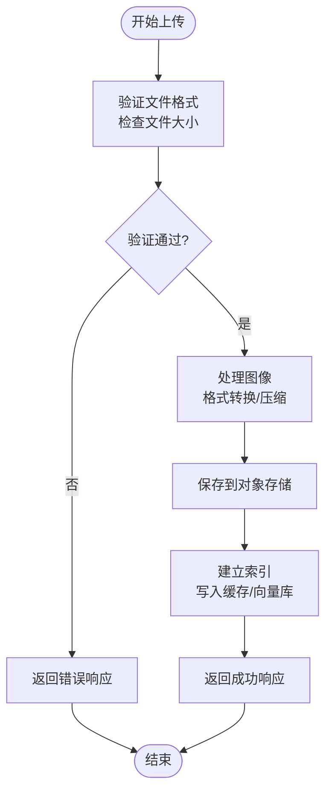
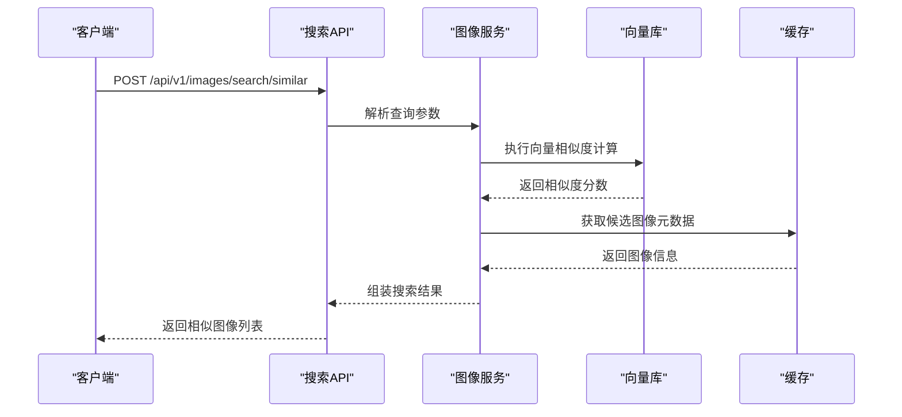
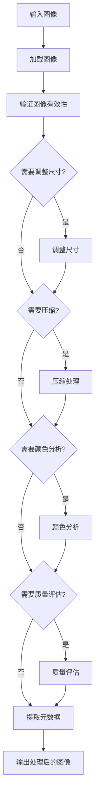
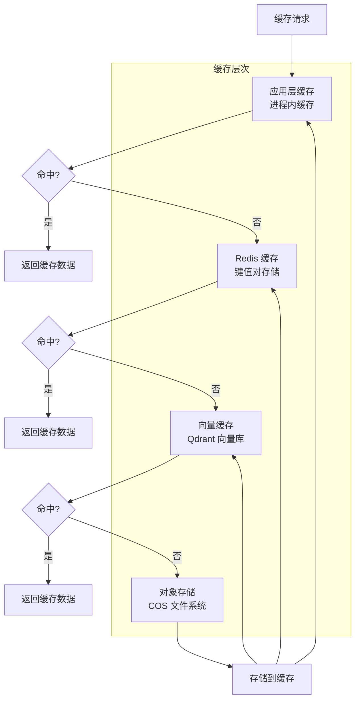
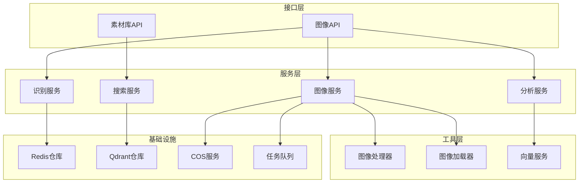

# 图像处理API

<cite>
**本文档引用的文件**
- [backend/app/api/v1/images.py](file://backend/app/api/v1/images.py)
- [backend/app/services/image_service.py](file://backend/app/services/image_service.py)
- [backend/app/services/baidu_image_recognition_service.py](file://backend/app/services/baidu_image_recognition_service.py)
- [backend/app/services/tencent_image_recognition_service.py](file://backend/app/services/tencent_image_recognition_service.py)
- [backend/app/services/tencent_image_search_service.py](file://backend/app/services/tencent_image_search_service.py)
- [backend/app/services/image_analysis_service.py](file://backend/app/services/image_analysis_service.py)
- [backend/app/services/library_image_service.py](file://backend/app/services/library_image_service.py)
- [backend/app/utils/image_processor.py](file://backend/app/utils/image_processor.py)
- [backend/app/utils/image_loader.py](file://backend/app/utils/image_loader.py)
- [backend/app/middleware/auth_middleware.py](file://backend/app/middleware/auth_middleware.py)
- [backend/app/middleware/error_handler.py](file://backend/app/middleware/error_handler.py)
- [backend/app/repositories/redis_repo.py](file://backend/app/repositories/redis_repo.py)
- [backend/app/repositories/qdrant_repo.py](file://backend/app/repositories/qdrant_repo.py)
- [backend/app/tasks/celery_app.py](file://backend/app/tasks/celery_app.py)
- [backend/app/tasks/image_tasks.py](file://backend/app/tasks/image_tasks.py)
- [backend/app/config.py](file://backend/app/config.py)
- [backend/app/main.py](file://backend/app/main.py)
- [backend/scripts/cleanup.py](file://backend/scripts/cleanup.py)
- [backend/scripts/data_migration.py](file://backend/scripts/data_migration.py)
- [python-ai/app/main.py](file://python-ai/app/main.py)
- [python-ai/app/config.py](file://python-ai/app/config.py)
- [python-ai/app/services/vector_service.py](file://python-ai/app/services/vector_service.py)
- [python-ai/app/repositories/qdrant_repo.py](file://python-ai/app/repositories/qdrant_repo.py)
</cite>

## 目录
1. [简介](#简介)
2. [项目结构](#项目结构)
3. [核心组件](#核心组件)
4. [架构概览](#架构概览)
5. [详细组件分析](#详细组件分析)
6. [依赖关系分析](#依赖关系分析)
7. [性能考虑](#性能考虑)
8. [故障排除指南](#故障排除指南)
9. [结论](#结论)
10. [附录](#附录)

## 简介
本文件为图像处理系统的完整API文档，涵盖图像上传、识别、相似性分析、质量评估、颜色分析等功能接口。文档详细说明了图像代理服务的配置与使用方法，包含百度AI和腾讯AI服务的集成接口及参数配置，并解释了图像缓存策略、性能优化机制、格式转换与压缩处理流程，以及图像存储与访问的安全控制措施。

## 项目结构
后端采用Python FastAPI框架构建，前端使用Vue.js，AI服务独立运行在Python环境中。图像处理API主要位于后端的v1版本接口中，核心服务包括图像服务、AI识别服务、图像分析服务等。

**图表来源**
- [backend/app/api/v1/images.py](file://backend/app/api/v1/images.py)
- [backend/app/services/image_service.py](file://backend/app/services/image_service.py)
- [backend/app/services/baidu_image_recognition_service.py](file://backend/app/services/baidu_image_recognition_service.py)
- [backend/app/services/tencent_image_recognition_service.py](file://backend/app/services/tencent_image_recognition_service.py)
- [backend/app/services/tencent_image_search_service.py](file://backend/app/services/tencent_image_search_service.py)
- [backend/app/services/image_analysis_service.py](file://backend/app/services/image_analysis_service.py)
- [backend/app/repositories/redis_repo.py](file://backend/app/repositories/redis_repo.py)
- [backend/app/repositories/qdrant_repo.py](file://backend/app/repositories/qdrant_repo.py)

**章节来源**
- [backend/app/main.py](file://backend/app/main.py)
- [backend/app/config.py](file://backend/app/config.py)

## 核心组件
- 图像API接口：提供图像上传、查询、相似性搜索、批量操作等REST接口
- 图像服务：封装图像处理的核心业务逻辑，包括格式转换、压缩、元数据提取
- AI识别服务：集成百度AI和腾讯AI的图像识别能力
- 图像分析服务：提供图像质量评估和颜色分析功能
- 缓存与向量检索：基于Redis和Qdrant的高性能缓存与相似性检索
- 中间件：认证、错误处理、超时控制等基础设施

**章节来源**
- [backend/app/api/v1/images.py](file://backend/app/api/v1/images.py)
- [backend/app/services/image_service.py](file://backend/app/services/image_service.py)
- [backend/app/services/image_analysis_service.py](file://backend/app/services/image_analysis_service.py)

## 架构概览
系统采用分层架构，前端通过HTTP协议调用后端API，后端根据请求类型路由到相应的服务层。AI识别和相似性检索通过独立的服务实现，缓存和向量存储提供高性能的数据访问能力。

**图表来源**
- [backend/app/api/v1/images.py](file://backend/app/api/v1/images.py)
- [backend/app/services/image_service.py](file://backend/app/services/image_service.py)
- [backend/app/services/baidu_image_recognition_service.py](file://backend/app/services/baidu_image_recognition_service.py)
- [backend/app/services/tencent_image_recognition_service.py](file://backend/app/services/tencent_image_recognition_service.py)
- [backend/app/repositories/redis_repo.py](file://backend/app/repositories/redis_repo.py)
- [backend/app/repositories/qdrant_repo.py](file://backend/app/repositories/qdrant_repo.py)

## 详细组件分析

### 图像API接口
图像API提供了完整的图像生命周期管理功能，包括上传、查询、删除、相似性搜索等操作。

#### 图像上传接口
支持单文件和多文件上传，自动进行格式验证和大小限制检查。

**图表来源**
- [backend/app/api/v1/images.py](file://backend/app/api/v1/images.py)
- [backend/app/utils/image_processor.py](file://backend/app/utils/image_processor.py)
- [backend/app/utils/image_loader.py](file://backend/app/utils/image_loader.py)

#### 相似性搜索接口
基于向量检索的智能相似性搜索，支持按图搜图功能。

**图表来源**
- [backend/app/api/v1/images.py](file://backend/app/api/v1/images.py)
- [backend/app/services/image_service.py](file://backend/app/services/image_service.py)
- [backend/app/repositories/qdrant_repo.py](file://backend/app/repositories/qdrant_repo.py)

**章节来源**
- [backend/app/api/v1/images.py](file://backend/app/api/v1/images.py)

### 图像服务
图像服务是核心业务逻辑层，负责处理图像的各种操作，包括格式转换、压缩、元数据提取等。

#### 图像处理流程

**图表来源**
- [backend/app/services/image_service.py](file://backend/app/services/image_service.py)
- [backend/app/utils/image_processor.py](file://backend/app/utils/image_processor.py)
- [backend/app/utils/image_loader.py](file://backend/app/utils/image_loader.py)

**章节来源**
- [backend/app/services/image_service.py](file://backend/app/services/image_service.py)

### 百度AI集成
百度AI服务提供图像识别能力，支持多种识别场景。

#### 百度AI配置
- 服务地址：通过配置文件指定API端点
- 认证方式：使用API Key和Secret Key进行签名验证
- 请求参数：包含图像数据、识别类型、可选参数等
- 响应处理：解析识别结果，提取置信度和标签信息

**章节来源**
- [backend/app/services/baidu_image_recognition_service.py](file://backend/app/services/baidu_image_recognition_service.py)

### 腾讯AI集成
腾讯AI服务提供图像识别和搜索能力。

#### 腾讯AI识别服务
- 支持通用物体识别、场景识别、品牌识别等
- 参数配置：包括识别类型、置信度阈值、返回数量等
- 错误处理：统一的异常捕获和重试机制

#### 腾讯AI搜索服务
- 基于特征向量的图像搜索
- 支持批量查询和单张查询
- 结果排序：按相似度分数降序排列

**章节来源**
- [backend/app/services/tencent_image_recognition_service.py](file://backend/app/services/tencent_image_recognition_service.py)
- [backend/app/services/tencent_image_search_service.py](file://backend/app/services/tencent_image_search_service.py)

### 图像分析服务
图像分析服务提供专业的图像质量评估和颜色分析功能。

#### 质量评估算法
- 清晰度检测：基于拉普拉斯算子的锐度评估
- 曝光评估：检测过曝、欠曝、正常曝光状态
- 色彩饱和度分析：评估色彩丰富程度
- 噪点检测：识别图像中的噪声水平

#### 颜色分析功能
- 主色调提取：识别图像的主要颜色分布
- 颜色直方图：统计各颜色通道的分布情况
- 配色方案建议：基于色彩理论提供配色建议

**章节来源**
- [backend/app/services/image_analysis_service.py](file://backend/app/services/image_analysis_service.py)

### 缓存策略与性能优化
系统采用多层缓存策略确保高性能访问。

#### 缓存架构

**图表来源**
- [backend/app/repositories/redis_repo.py](file://backend/app/repositories/redis_repo.py)
- [backend/app/repositories/qdrant_repo.py](file://backend/app/repositories/qdrant_repo.py)

#### 性能优化措施
- 异步处理：使用Celery进行后台任务处理
- 连接池管理：数据库和缓存连接池优化
- 批量操作：支持批量上传和批量查询
- CDN加速：静态资源通过CDN分发

**章节来源**
- [backend/app/tasks/celery_app.py](file://backend/app/tasks/celery_app.py)
- [backend/app/tasks/image_tasks.py](file://backend/app/tasks/image_tasks.py)

### 安全控制措施
系统实施多层次的安全控制，确保图像数据的安全访问。

#### 认证授权
- JWT令牌验证：所有API请求必须携带有效的访问令牌
- 权限控制：基于用户角色的细粒度权限管理
- 会话管理：自动过期和刷新机制

#### 数据保护
- 加密传输：HTTPS协议确保数据传输安全
- 存储加密：敏感数据在存储时进行加密
- 访问日志：记录所有图像访问行为

#### 输入验证
- 文件类型检查：严格验证上传文件的MIME类型
- 大小限制：防止大文件攻击和资源耗尽
- 内容扫描：检测恶意文件和违规内容

**章节来源**
- [backend/app/middleware/auth_middleware.py](file://backend/app/middleware/auth_middleware.py)
- [backend/app/middleware/error_handler.py](file://backend/app/middleware/error_handler.py)

## 依赖关系分析
系统各组件之间存在清晰的依赖关系，遵循单一职责原则和依赖倒置原则。

**图表来源**
- [backend/app/api/v1/images.py](file://backend/app/api/v1/images.py)
- [backend/app/services/image_service.py](file://backend/app/services/image_service.py)
- [backend/app/utils/image_processor.py](file://backend/app/utils/image_processor.py)
- [backend/app/utils/image_loader.py](file://backend/app/utils/image_loader.py)
- [backend/app/repositories/redis_repo.py](file://backend/app/repositories/redis_repo.py)
- [backend/app/repositories/qdrant_repo.py](file://backend/app/repositories/qdrant_repo.py)

**章节来源**
- [backend/app/api/v1/images.py](file://backend/app/api/v1/images.py)
- [backend/app/services/library_image_service.py](file://backend/app/services/library_image_service.py)

## 性能考虑
系统在设计时充分考虑了性能优化，采用多种技术手段提升响应速度和吞吐量。

### 并发处理
- 异步IO：使用async/await模式处理高并发请求
- 连接池：数据库和缓存连接池复用
- 无状态设计：服务实例可以水平扩展

### 缓存策略
- 多级缓存：从进程内缓存到分布式缓存的完整链路
- 智能预热：热点数据提前加载到缓存
- 自适应淘汰：基于访问频率的LRU淘汰策略

### 压缩与传输优化
- 多格式支持：JPEG、PNG、WebP等多种格式
- 动态质量调节：根据网络状况调整图像质量
- 分片传输：大文件分片下载和断点续传

## 故障排除指南
常见问题及解决方案：

### 图像上传失败
- 检查文件格式是否在允许范围内
- 确认文件大小未超过限制
- 验证存储空间是否充足

### 相似性搜索结果异常
- 检查向量模型是否正确加载
- 验证相似度阈值设置是否合理
- 确认缓存数据是否最新

### AI识别服务不可用
- 检查第三方API的可用性和配额
- 验证认证信息是否正确
- 查看网络连接状态

**章节来源**
- [backend/app/middleware/error_handler.py](file://backend/app/middleware/error_handler.py)
- [backend/app/services/baidu_image_recognition_service.py](file://backend/app/services/baidu_image_recognition_service.py)
- [backend/app/services/tencent_image_recognition_service.py](file://backend/app/services/tencent_image_recognition_service.py)

## 结论
本图像处理API系统通过模块化的架构设计和完善的缓存策略，实现了高性能的图像处理能力。系统集成了多家AI服务商的识别能力，提供了丰富的图像分析功能，并通过多层次的安全控制确保数据安全。未来可以在以下方面进一步优化：增加更多AI识别场景、优化缓存算法、增强监控告警能力。

## 附录

### API接口定义
- 图像上传：POST /api/v1/images/upload
- 图像查询：GET /api/v1/images/{id}
- 相似性搜索：POST /api/v1/images/search/similar
- 批量操作：POST /api/v1/images/batch

### 配置参数
- 存储配置：COS_BUCKET、COS_REGION
- 缓存配置：REDIS_HOST、REDIS_PORT
- AI服务配置：BAIDU_API_KEY、TENCENT_SECRET_ID

### 错误码说明
- 400：请求参数错误
- 401：认证失败
- 403：权限不足
- 404：资源不存在
- 500：服务器内部错误