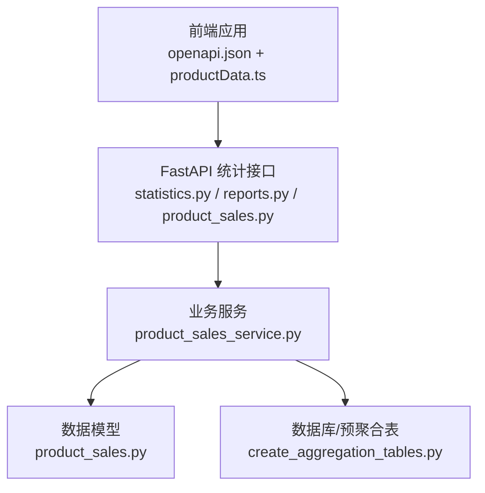
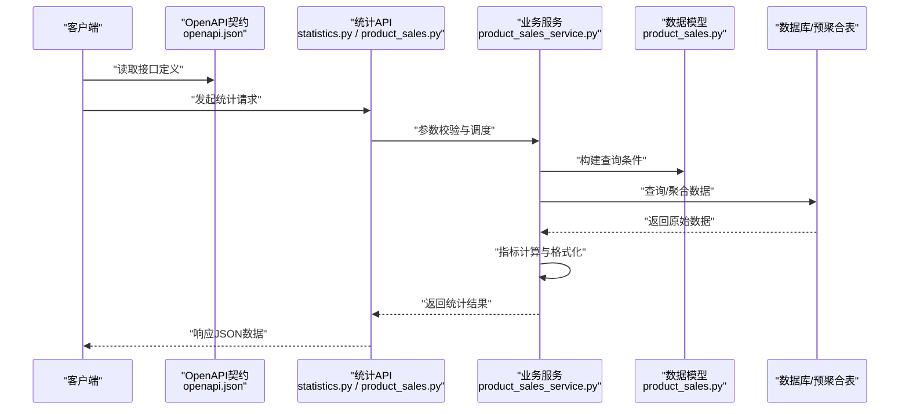
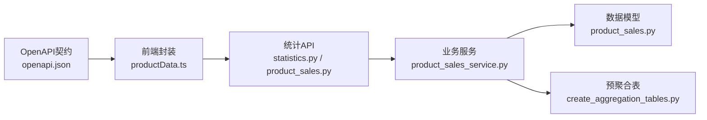

# 报表统计API

<cite>
**本文引用的文件**
- [statistics.py](file://backend/app/api/v1/statistics.py)
- [reports.py](file://backend/app/api/v1/reports.py)
- [product_sales.py](file://backend/app/api/product_sales.py)
- [product_sales_service.py](file://backend/app/services/product_sales_service.py)
- [product_sales.py](file://backend/app/models/product_sales.py)
- [create_aggregation_tables.py](file://scripts/database/create_aggregation_tables.py)
- [openapi.json](file://frontend/openapi.json)
- [productData.ts](file://frontend/src/api/productData.ts)
</cite>

## 目录
1. [简介](#简介)
2. [项目结构](#项目结构)
3. [核心组件](#核心组件)
4. [架构总览](#架构总览)
5. [详细组件分析](#详细组件分析)
6. [依赖关系分析](#依赖关系分析)
7. [性能考量](#性能考量)
8. [故障排查指南](#故障排查指南)
9. [结论](#结论)
10. [附录](#附录)

## 简介
本文件面向报表统计系统的API，覆盖销售数据统计、产品分析与报表生成的接口定义与实现要点。重点说明：
- 统计数据的聚合计算与时间范围查询
- 销售趋势分析、产品排名与对比分析
- 自定义报表的创建与导出（基于现有接口的扩展建议）
- 数据缓存策略与性能优化机制
- 实时数据更新与历史数据查询的接口说明
- 报表格式与数据精度的配置选项

## 项目结构
后端采用Python FastAPI框架，统计相关API集中在以下模块：
- 统计接口：statistics.py
- 报表接口：reports.py
- 产品销售接口：product_sales.py
- 业务服务：product_sales_service.py
- 数据模型：product_sales.py
- 脚本：create_aggregation_tables.py（用于预聚合表）

前端通过OpenAPI描述文件与TypeScript API封装对接后端统计接口。

图表来源
- [statistics.py](file://backend/app/api/v1/statistics.py)
- [reports.py](file://backend/app/api/v1/reports.py)
- [product_sales.py](file://backend/app/api/product_sales.py)
- [product_sales_service.py](file://backend/app/services/product_sales_service.py)
- [product_sales.py](file://backend/app/models/product_sales.py)
- [create_aggregation_tables.py](file://scripts/database/create_aggregation_tables.py)
- [openapi.json](file://frontend/openapi.json)
- [productData.ts](file://frontend/src/api/productData.ts)

章节来源
- [statistics.py](file://backend/app/api/v1/statistics.py)
- [reports.py](file://backend/app/api/v1/reports.py)
- [product_sales.py](file://backend/app/api/product_sales.py)
- [product_sales_service.py](file://backend/app/services/product_sales_service.py)
- [product_sales.py](file://backend/app/models/product_sales.py)
- [create_aggregation_tables.py](file://scripts/database/create_aggregation_tables.py)
- [openapi.json](file://frontend/openapi.json)
- [productData.ts](file://frontend/src/api/productData.ts)

## 核心组件
- 统计接口模块：提供销售趋势、产品TOP榜、周期对比等分析接口
- 报表接口模块：提供报表生成与导出能力（基于现有接口的扩展建议）
- 产品销售接口模块：提供产品维度的销售明细与聚合查询
- 业务服务模块：负责统计聚合、指标计算与数据访问
- 数据模型模块：定义销售数据结构与字段
- 预聚合脚本：创建日/月级汇总表以提升查询性能

章节来源
- [statistics.py](file://backend/app/api/v1/statistics.py)
- [reports.py](file://backend/app/api/v1/reports.py)
- [product_sales.py](file://backend/app/api/product_sales.py)
- [product_sales_service.py](file://backend/app/services/product_sales_service.py)
- [product_sales.py](file://backend/app/models/product_sales.py)
- [create_aggregation_tables.py](file://scripts/database/create_aggregation_tables.py)

## 架构总览
后端采用分层架构：API层接收请求并校验参数；服务层执行统计聚合与指标计算；模型层映射数据库结构；脚本负责预聚合表的创建与维护。前端通过OpenAPI契约调用后端接口。

图表来源
- [openapi.json](file://frontend/openapi.json)
- [statistics.py](file://backend/app/api/v1/statistics.py)
- [product_sales.py](file://backend/app/api/product_sales.py)
- [product_sales_service.py](file://backend/app/services/product_sales_service.py)
- [product_sales.py](file://backend/app/models/product_sales.py)

## 详细组件分析

### 统计接口模块（statistics.py）
- 功能定位：提供销售趋势、产品TOP榜、周期对比等分析接口
- 关键能力：
  - 时间维度聚合（日/周/月等）
  - 多维筛选（类目、国家、站点、开发者）
  - 指标计算（销售额、订单量、广告花费、退款等）
- 参数与返回：
  - 支持起止日期、时间粒度、筛选条件
  - 返回标准化指标与格式化数据

章节来源
- [statistics.py](file://backend/app/api/v1/statistics.py)

### 报表接口模块（reports.py）
- 功能定位：提供报表生成与导出能力
- 建议能力：
  - 自定义报表模板与字段组合
  - 导出Excel/PDF等格式
  - 批处理任务与异步导出队列
- 当前状态：该模块在仓库中存在，具体实现需进一步确认

章节来源
- [reports.py](file://backend/app/api/v1/reports.py)

### 产品销售接口模块（product_sales.py）
- 功能定位：提供产品维度的销售明细与聚合查询
- 关键能力：
  - 日期范围查询
  - 双周期对比
  - 健康检查
- 参数与返回：
  - 支持日期范围、时间维度、筛选条件
  - 返回销售、利润、广告、退款等指标

章节来源
- [product_sales.py](file://backend/app/api/product_sales.py)

### 业务服务模块（product_sales_service.py）
- 功能定位：统计聚合与指标计算的核心实现
- 关键能力：
  - 指标计算（毛利率、结算利润、ACOS、退款率等）
  - 数据精度控制（保留小数位）
  - 结果格式化与标签化
- 性能特性：
  - 利用预聚合表减少复杂查询
  - 对关键指标进行批量计算与四舍五入

章节来源
- [product_sales_service.py](file://backend/app/services/product_sales_service.py)

### 数据模型模块（product_sales.py）
- 功能定位：定义销售数据结构与字段映射
- 关键字段：
  - 订单数、销量、收入、毛利、结算利润
  - 广告花费、广告订单、退款金额、退款数量
- 用途：服务层与数据库交互的基础

章节来源
- [product_sales.py](file://backend/app/models/product_sales.py)

### 预聚合脚本（create_aggregation_tables.py）
- 功能定位：创建日/月级汇总表，支撑快速统计查询
- 关键点：
  - 唯一键与多维索引设计
  - 字段类型与精度（如DECIMAL(15,2)）
  - 唯一键约束避免重复写入

章节来源
- [create_aggregation_tables.py](file://scripts/database/create_aggregation_tables.py)

### 前端对接（openapi.json 与 productData.ts）
- 功能定位：前端通过OpenAPI契约与TypeScript封装调用后端统计接口
- 关键能力：
  - 销售趋势、TOP产品、周期对比等接口封装
  - 参数透传与响应结构转换

章节来源
- [openapi.json](file://frontend/openapi.json)
- [productData.ts](file://frontend/src/api/productData.ts)

## 依赖关系分析
- API层依赖服务层进行业务处理
- 服务层依赖模型层与数据库/预聚合表
- 前端依赖OpenAPI契约与TypeScript封装
- 预聚合表为服务层提供高性能查询基础

图表来源
- [openapi.json](file://frontend/openapi.json)
- [productData.ts](file://frontend/src/api/productData.ts)
- [statistics.py](file://backend/app/api/v1/statistics.py)
- [product_sales.py](file://backend/app/api/product_sales.py)
- [product_sales_service.py](file://backend/app/services/product_sales_service.py)
- [product_sales.py](file://backend/app/models/product_sales.py)
- [create_aggregation_tables.py](file://scripts/database/create_aggregation_tables.py)

章节来源
- [openapi.json](file://frontend/openapi.json)
- [productData.ts](file://frontend/src/api/productData.ts)
- [statistics.py](file://backend/app/api/v1/statistics.py)
- [product_sales.py](file://backend/app/api/product_sales.py)
- [product_sales_service.py](file://backend/app/services/product_sales_service.py)
- [product_sales.py](file://backend/app/models/product_sales.py)
- [create_aggregation_tables.py](file://scripts/database/create_aggregation_tables.py)

## 性能考量
- 预聚合表设计
  - 日/月级汇总表降低复杂查询成本
  - 多维索引加速过滤与排序
- 指标计算优化
  - 批量计算与一次性四舍五入，减少重复计算
  - DECIMAL类型保证精度与性能平衡
- 缓存策略建议
  - 对热点时间段与热门类目的查询结果进行短期缓存
  - 结合Redis或本地内存缓存，设置合理过期时间
- 分页与限流
  - 对TOP榜与趋势接口增加分页与查询限制
  - 防止大范围扫描导致的性能抖动

章节来源
- [create_aggregation_tables.py](file://scripts/database/create_aggregation_tables.py)
- [product_sales_service.py](file://backend/app/services/product_sales_service.py)

## 故障排查指南
- 健康检查
  - 通过健康检查接口确认服务可用性
- 参数校验
  - 确认时间范围、筛选条件与时间粒度参数合法
- 数据缺失
  - 检查预聚合表是否按日/月同步
  - 核对唯一键冲突与索引命中情况
- 响应异常
  - 关注指标计算中的除零保护与精度处理
  - 检查前端参数透传与响应结构转换

章节来源
- [product_sales.py](file://backend/app/api/product_sales.py)
- [product_sales_service.py](file://backend/app/services/product_sales_service.py)

## 结论
本统计API体系通过预聚合表与服务层指标计算，实现了高效的时间范围查询与多维分析能力。建议在现有基础上完善报表导出与缓存策略，并持续优化预聚合表的同步与一致性保障，以满足更复杂的业务场景需求。

## 附录

### 接口一览与说明（基于OpenAPI与源码）
- 销售趋势分析
  - 接口路径：/api/sales-trend
  - 请求参数：类目、起止日期、时间粒度、月份、站点、国家、开发者
  - 返回：按时间粒度聚合的趋势数据
- 产品TOP榜
  - 接口路径：/api/top-products
  - 请求参数：类目、起止日期、限制条数、站点、国家、开发者
  - 返回：按指标排序的产品列表
- 周期对比
  - 接口路径：/api/compare-data
  - 请求参数：当前周期起止、对比周期起止、类目、站点、国家、开发者
  - 返回：双周期对比的完整指标
- 日期范围查询
  - 接口路径：/api/products/date-range
  - 返回：数据的最小/最大日期范围
- 双周期趋势对比
  - 接口路径：/api/products/period-comparison
  - 请求：两个周期的起止日期
  - 返回：两周期的销售、利润、广告、退款等对比数据
- 健康检查
  - 接口路径：/api/products/health
  - 返回：服务健康状态

章节来源
- [openapi.json](file://frontend/openapi.json)
- [productData.ts](file://frontend/src/api/productData.ts)
- [statistics.py](file://backend/app/api/v1/statistics.py)
- [product_sales.py](file://backend/app/api/product_sales.py)