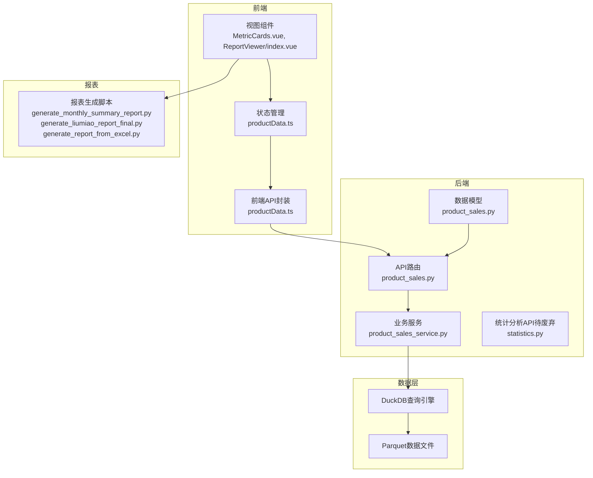
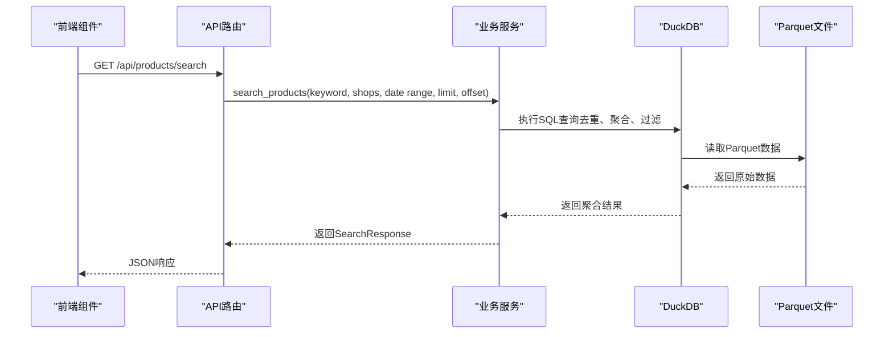
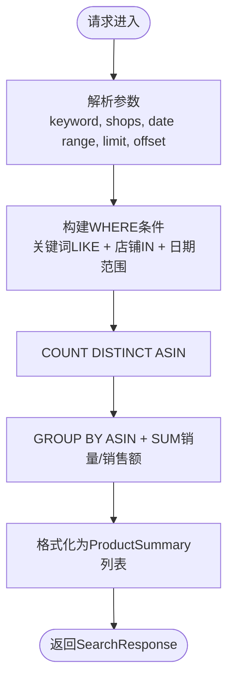
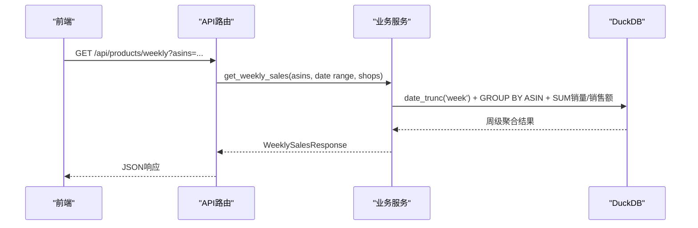
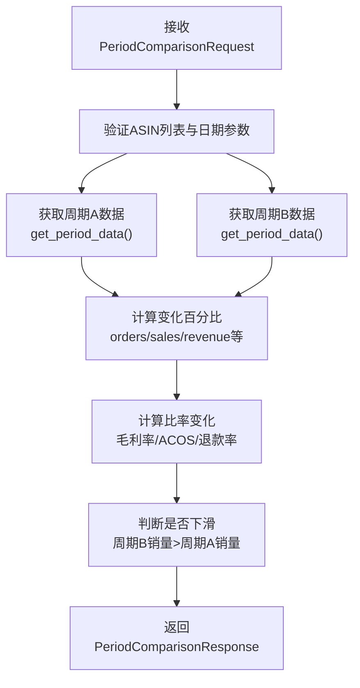
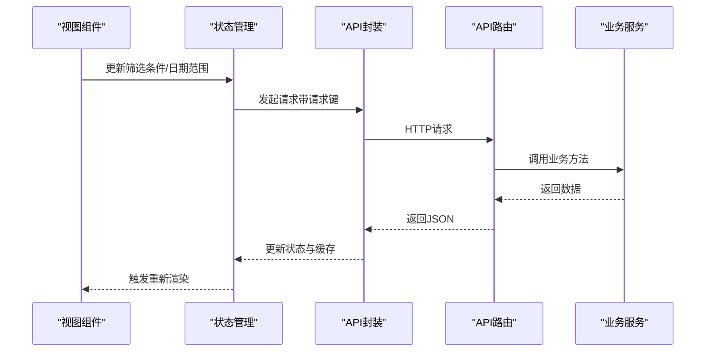

# 销售统计API

<cite>
**本文档引用的文件**
- [backend/app/api/product_sales.py](file://backend/app/api/product_sales.py)
- [backend/app/models/product_sales.py](file://backend/app/models/product_sales.py)
- [backend/app/services/product_sales_service.py](file://backend/app/services/product_sales_service.py)
- [backend/app/api/v1/statistics.py](file://backend/app/api/v1/statistics.py)
- [frontend/src/api/productData.ts](file://frontend/src/api/productData.ts)
- [frontend/src/stores/productData.ts](file://frontend/src/stores/productData.ts)
- [frontend/src/views/ProductDataDashboard/components/MetricCards.vue](file://frontend/src/views/ProductDataDashboard/components/MetricCards.vue)
- [frontend/src/views/ReportViewer/index.vue](file://frontend/src/views/ReportViewer/index.vue)
- [scripts/analysis/generate_monthly_summary_report.py](file://scripts/analysis/generate_monthly_summary_report.py)
- [scripts/analysis/generate_liumiao_report_final.py](file://scripts/analysis/generate_liumiao_report_final.py)
- [scripts/analysis/generate_report_from_excel.py](file://scripts/analysis/generate_report_from_excel.py)
</cite>

## 目录
1. [简介](#简介)
2. [项目结构](#项目结构)
3. [核心组件](#核心组件)
4. [架构概览](#架构概览)
5. [详细组件分析](#详细组件分析)
6. [依赖关系分析](#依赖关系分析)
7. [性能考虑](#性能考虑)
8. [故障排除指南](#故障排除指南)
9. [结论](#结论)
10. [附录](#附录)

## 简介
本文件为销售统计API的详细技术文档，涵盖产品销售数据查询接口、销售额统计、销量排行、时间趋势分析、按维度统计查询、销售预测与趋势分析、数据缓存策略与实时更新机制、销售报表生成与导出、以及销售KPI指标计算与展示接口。该系统基于Python FastAPI后端与前端Vue.js实现，采用Parquet数据文件与DuckDB引擎进行高性能数据分析。

## 项目结构
销售统计API主要分布在以下模块中：
- 后端API路由：定义REST接口与参数校验
- 数据模型：定义请求/响应数据结构
- 业务服务：实现数据聚合、时间范围过滤、KPI计算等逻辑
- 前端接口封装：提供HTTP请求方法与参数传递
- 报表脚本：生成月度汇总报告与导出Excel

**图表来源**
- [backend/app/api/product_sales.py:1-353](file://backend/app/api/product_sales.py#L1-L353)
- [backend/app/models/product_sales.py:1-160](file://backend/app/models/product_sales.py#L1-L160)
- [backend/app/services/product_sales_service.py:1-564](file://backend/app/services/product_sales_service.py#L1-L564)
- [frontend/src/api/productData.ts:48-140](file://frontend/src/api/productData.ts#L48-L140)
- [frontend/src/stores/productData.ts:433-730](file://frontend/src/stores/productData.ts#L433-L730)
- [scripts/analysis/generate_monthly_summary_report.py](file://scripts/analysis/generate_monthly_summary_report.py)
- [scripts/analysis/generate_liumiao_report_final.py](file://scripts/analysis/generate_liumiao_report_final.py)
- [scripts/analysis/generate_report_from_excel.py](file://scripts/analysis/generate_report_from_excel.py)

**章节来源**
- [backend/app/api/product_sales.py:1-353](file://backend/app/api/product_sales.py#L1-L353)
- [backend/app/models/product_sales.py:1-160](file://backend/app/models/product_sales.py#L1-L160)
- [backend/app/services/product_sales_service.py:1-564](file://backend/app/services/product_sales_service.py#L1-L564)
- [frontend/src/api/productData.ts:48-140](file://frontend/src/api/productData.ts#L48-L140)
- [frontend/src/stores/productData.ts:433-730](file://frontend/src/stores/productData.ts#L433-L730)

## 核心组件
- API路由层：提供产品搜索、周销量、日期范围、双周期对比、趋势对比、下滑分析等接口
- 数据模型层：定义请求参数与响应结构，确保前后端数据契约一致
- 业务服务层：基于DuckDB对Parquet文件进行去重、聚合、时间范围过滤与KPI计算
- 前端封装层：提供HTTP请求方法，支持参数传递与结果解析
- 报表脚本层：生成月度汇总报告与Excel导出

**章节来源**
- [backend/app/api/product_sales.py:26-353](file://backend/app/api/product_sales.py#L26-L353)
- [backend/app/models/product_sales.py:9-160](file://backend/app/models/product_sales.py#L9-L160)
- [backend/app/services/product_sales_service.py:26-564](file://backend/app/services/product_sales_service.py#L26-L564)

## 架构概览
销售统计API采用分层架构：
- 表现层：前端Vue组件通过API封装调用后端接口
- 控制器层：FastAPI路由接收请求并进行参数校验
- 服务层：业务服务使用DuckDB查询Parquet数据，执行去重与聚合
- 数据层：Parquet文件存储销售数据，DuckDB提供SQL查询能力

**图表来源**
- [backend/app/api/product_sales.py:26-64](file://backend/app/api/product_sales.py#L26-L64)
- [backend/app/services/product_sales_service.py:124-188](file://backend/app/services/product_sales_service.py#L124-L188)

**章节来源**
- [backend/app/api/product_sales.py:26-64](file://backend/app/api/product_sales.py#L26-L64)
- [backend/app/services/product_sales_service.py:124-188](file://backend/app/services/product_sales_service.py#L124-L188)

## 详细组件分析

### 产品搜索接口
- 接口路径：GET /api/products/search
- 功能：支持按关键词（ASIN/标题/SKU/MSKU）、店铺筛选、时间范围过滤进行产品搜索，按销量排序返回最多N个产品
- 参数：
  - q：搜索关键词
  - shops：逗号分隔的店铺列表
  - start_date/end_date：日期范围
  - limit：返回数量限制（默认50）
  - offset：分页偏移
- 响应：SearchResponse，包含总数、产品列表、是否有更多

**图表来源**
- [backend/app/api/product_sales.py:26-64](file://backend/app/api/product_sales.py#L26-L64)
- [backend/app/services/product_sales_service.py:124-188](file://backend/app/services/product_sales_service.py#L124-L188)

**章节来源**
- [backend/app/api/product_sales.py:26-64](file://backend/app/api/product_sales.py#L26-L64)
- [backend/app/models/product_sales.py:30-45](file://backend/app/models/product_sales.py#L30-L45)
- [backend/app/services/product_sales_service.py:124-188](file://backend/app/services/product_sales_service.py#L124-L188)

### 周销量接口
- 接口路径：GET /api/products/weekly
- 功能：获取指定ASIN列表的周销量与销售额，支持多产品对比
- 参数：
  - asins：逗号分隔的ASIN列表（最多100个）
  - start_date/end_date：日期范围
  - shops：逗号分隔的店铺列表
- 响应：WeeklySalesResponse，包含周起始日期、周标签、各ASIN的销量与销售额数组

**图表来源**
- [backend/app/api/product_sales.py:66-111](file://backend/app/api/product_sales.py#L66-L111)
- [backend/app/services/product_sales_service.py:194-265](file://backend/app/services/product_sales_service.py#L194-L265)

**章节来源**
- [backend/app/api/product_sales.py:66-111](file://backend/app/api/product_sales.py#L66-L111)
- [backend/app/models/product_sales.py:47-61](file://backend/app/models/product_sales.py#L47-L61)
- [backend/app/services/product_sales_service.py:194-265](file://backend/app/services/product_sales_service.py#L194-L265)

### 日期范围接口
- 接口路径：GET /api/products/date-range
- 功能：获取数据的最小/最大日期，并计算总周数
- 响应：DateRangeResponse，包含最小日期、最大日期、总周数

**章节来源**
- [backend/app/api/product_sales.py:128-157](file://backend/app/api/product_sales.py#L128-L157)
- [backend/app/models/product_sales.py:69-74](file://backend/app/models/product_sales.py#L69-L74)
- [backend/app/services/product_sales_service.py:98-110](file://backend/app/services/product_sales_service.py#L98-L110)

### 双周期对比接口
- 接口路径：POST /api/products/period-comparison
- 功能：对比两个时间周期的销售、利润、广告、退款等指标，计算变化百分比与下滑判断
- 请求体：PeriodComparisonRequest，包含ASIN列表、两个周期的开始/结束日期、可选店铺筛选
- 响应：PeriodComparisonResponse，包含周期A/B数据、各项指标变化百分比、是否下滑、下滑百分比

**图表来源**
- [backend/app/api/product_sales.py:159-247](file://backend/app/api/product_sales.py#L159-L247)
- [backend/app/models/product_sales.py:105-120](file://backend/app/models/product_sales.py#L105-L120)
- [backend/app/services/product_sales_service.py:271-344](file://backend/app/services/product_sales_service.py#L271-L344)

**章节来源**
- [backend/app/api/product_sales.py:159-247](file://backend/app/api/product_sales.py#L159-L247)
- [backend/app/models/product_sales.py:76-120](file://backend/app/models/product_sales.py#L76-L120)
- [backend/app/services/product_sales_service.py:271-344](file://backend/app/services/product_sales_service.py#L271-L344)

### 每日趋势对比接口
- 接口路径：POST /api/products/period-trend
- 功能：获取两个周期的每日销量与销售额趋势，用于折线图展示
- 请求体：PeriodComparisonRequest
- 响应：PeriodTrendComparisonResponse，包含两个周期的DailyTrendResponse

**章节来源**
- [backend/app/api/product_sales.py:249-297](file://backend/app/api/product_sales.py#L249-L297)
- [backend/app/models/product_sales.py:122-133](file://backend/app/models/product_sales.py#L122-L133)
- [backend/app/services/product_sales_service.py:361-416](file://backend/app/services/product_sales_service.py#L361-L416)

### 下滑分析接口
- 接口路径：GET /api/products/decline-analysis
- 功能：对比两个周期（周或月）的销量，按下滑率排序返回产品列表
- 参数：
  - period_type：周期类型（week 或 month）
  - prev_period/curr_period：前期与当期标识（周格式：YYYY-WNN；月格式：YYYY-MM）
  - shops：可选的店铺筛选
- 响应：DeclineAnalysisResponse，包含下滑产品列表

**章节来源**
- [backend/app/api/product_sales.py:299-331](file://backend/app/api/product_sales.py#L299-L331)
- [backend/app/models/product_sales.py:135-160](file://backend/app/models/product_sales.py#L135-L160)
- [backend/app/services/product_sales_service.py:449-552](file://backend/app/services/product_sales_service.py#L449-L552)

### 健康检查接口
- 接口路径：GET /api/products/health
- 功能：检查数据文件状态，返回总行数、列数与数据文件路径

**章节来源**
- [backend/app/api/product_sales.py:333-353](file://backend/app/api/product_sales.py#L333-L353)
- [backend/app/services/product_sales_service.py:326-355](file://backend/app/services/product_sales_service.py#L326-L355)

### 前端集成与缓存策略
- 前端API封装：提供搜索、趋势、TOP产品等请求方法，统一参数传递
- 状态管理：使用Vuex Store管理筛选条件、日期范围、加载状态与数据缓存
- 缓存策略：通过请求去重与本地状态缓存减少重复请求，提升用户体验

**图表来源**
- [frontend/src/stores/productData.ts:473-502](file://frontend/src/stores/productData.ts#L473-L502)
- [frontend/src/api/productData.ts:84-140](file://frontend/src/api/productData.ts#L84-L140)
- [backend/app/api/product_sales.py:26-64](file://backend/app/api/product_sales.py#L26-L64)

**章节来源**
- [frontend/src/api/productData.ts:48-140](file://frontend/src/api/productData.ts#L48-L140)
- [frontend/src/stores/productData.ts:433-730](file://frontend/src/stores/productData.ts#L433-L730)

### 报表生成与导出
- 月度汇总报告：生成月度销售汇总报告，包含核心指标与趋势分析
- 导出Excel：将报表数据导出为Excel格式，便于离线分析
- 报表视图：前端提供报表查看界面，展示核心指标卡片与图表

**章节来源**
- [scripts/analysis/generate_monthly_summary_report.py](file://scripts/analysis/generate_monthly_summary_report.py)
- [scripts/analysis/generate_liumiao_report_final.py](file://scripts/analysis/generate_liumiao_report_final.py)
- [scripts/analysis/generate_report_from_excel.py](file://scripts/analysis/generate_report_from_excel.py)
- [frontend/src/views/ReportViewer/index.vue:175-477](file://frontend/src/views/ReportViewer/index.vue#L175-L477)

## 依赖关系分析
- API路由依赖业务服务进行数据处理
- 业务服务依赖DuckDB查询Parquet文件
- 前端通过API封装调用后端接口，使用状态管理进行数据缓存
- 报表脚本与前端报表视图共同完成报表生成与展示

**图表来源**
- [backend/app/api/product_sales.py:1-353](file://backend/app/api/product_sales.py#L1-L353)
- [backend/app/services/product_sales_service.py:1-564](file://backend/app/services/product_sales_service.py#L1-L564)
- [frontend/src/api/productData.ts:48-140](file://frontend/src/api/productData.ts#L48-L140)
- [frontend/src/stores/productData.ts:433-730](file://frontend/src/stores/productData.ts#L433-L730)
- [frontend/src/views/ReportViewer/index.vue:175-477](file://frontend/src/views/ReportViewer/index.vue#L175-L477)
- [scripts/analysis/generate_monthly_summary_report.py](file://scripts/analysis/generate_monthly_summary_report.py)

**章节来源**
- [backend/app/api/product_sales.py:1-353](file://backend/app/api/product_sales.py#L1-L353)
- [backend/app/services/product_sales_service.py:1-564](file://backend/app/services/product_sales_service.py#L1-L564)
- [frontend/src/api/productData.ts:48-140](file://frontend/src/api/productData.ts#L48-L140)
- [frontend/src/stores/productData.ts:433-730](file://frontend/src/stores/productData.ts#L433-L730)

## 性能考虑
- Parquet文件格式：支持列式存储与压缩，适合大规模数据分析
- DuckDB查询：在Parquet上执行SQL，具备良好的查询性能与内存效率
- 去重策略：按(ASIN, 日期, 店铺)分组取MAX，避免重复行影响聚合准确性
- 前端缓存：通过请求键去重与状态缓存减少重复请求，提升交互响应速度
- 时间范围过滤：在SQL层面进行日期过滤，避免全量数据扫描

## 故障排除指南
- Parquet文件不存在：业务服务会抛出文件未找到异常，需确认数据文件路径与存在性
- 参数校验失败：API路由对ASIN数量、日期参数进行校验，需确保输入符合要求
- 查询异常：业务服务捕获异常并返回HTTP 500，需检查DuckDB连接与SQL语法
- 前端请求失败：检查API封装与状态管理中的错误处理逻辑

**章节来源**
- [backend/app/services/product_sales_service.py:42-44](file://backend/app/services/product_sales_service.py#L42-L44)
- [backend/app/api/product_sales.py:80-110](file://backend/app/api/product_sales.py#L80-L110)
- [frontend/src/stores/productData.ts:473-502](file://frontend/src/stores/productData.ts#L473-L502)

## 结论
销售统计API通过清晰的分层架构与高效的数据处理机制，提供了全面的产品销售数据分析能力。系统支持多维度统计、时间趋势分析、双周期对比与下滑分析，并具备完善的报表生成与导出功能。前端采用缓存策略与状态管理优化用户体验，整体具备良好的可维护性与扩展性。

## 附录
- KPI指标说明：
  - 销售额：SUM(销售额)
  - 销量：SUM(销量)
  - 订单量：SUM(订单量)
  - 毛利润：SUM(订单毛利润)
  - 结算利润：SUM(结算毛利润)
  - 广告花费：SUM(广告花费)
  - 广告订单量：SUM(广告订单量)
  - 退款金额：SUM(退款金额)
  - 退款数量：SUM(退款量)
  - 毛利率：毛利润/销售额 × 100%
  - 结算利润率：结算利润/销售额 × 100%
  - ACOS：广告花费/销售额 × 100%
  - 退款率：退款数量/销量 × 100%