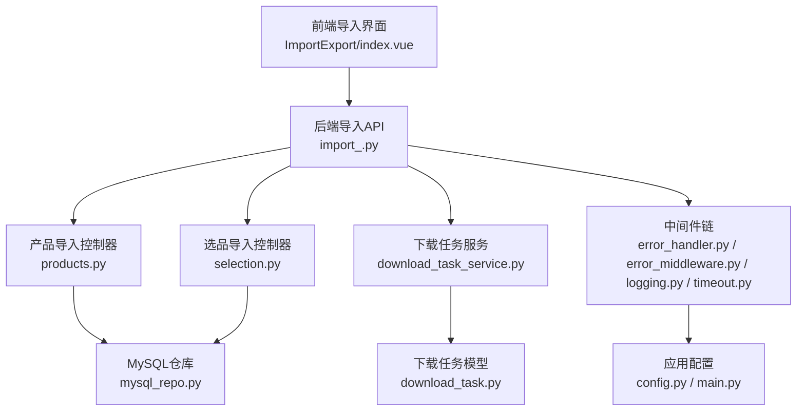
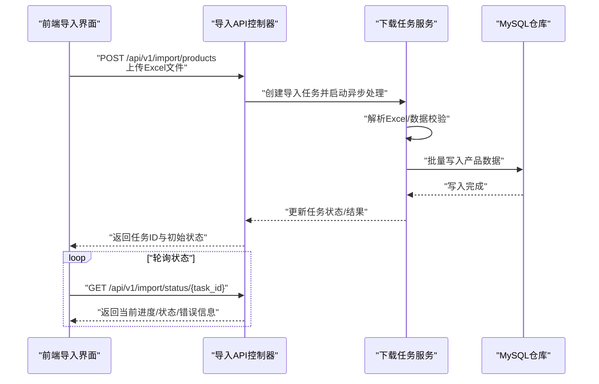
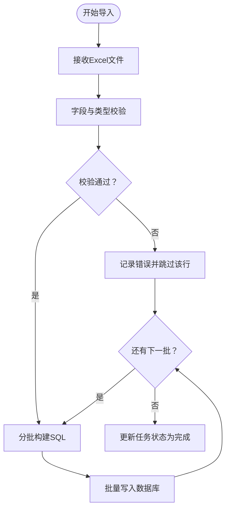
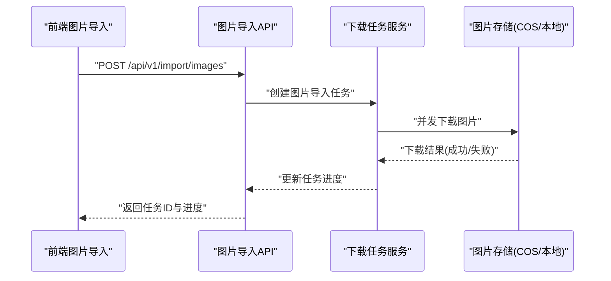
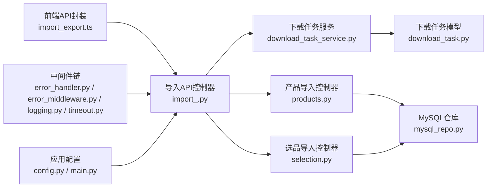

# 导入功能API

<cite>
**本文引用的文件**
- [backend/app/api/v1/import_.py](file://backend/app/api/v1/import_.py)
- [backend/app/api/v1/__init__.py](file://backend/app/api/v1/__init__.py)
- [backend/app/api/v1/products.py](file://backend/app/api/v1/products.py)
- [backend/app/api/v1/selection.py](file://backend/app/api/v1/selection.py)
- [frontend/src/views/ImportExport/index.vue](file://frontend/src/views/ImportExport/index.vue)
- [frontend/src/api/import_export.ts](file://frontend/src/api/import_export.ts)
- [frontend/src/views/Lingxing/Import/index.vue](file://frontend/src/views/Lingxing/Import/index.vue)
- [frontend/src/views/AsinImport/index.vue](file://frontend/src/views/AsinImport/index.vue)
- [frontend/src/types/product.ts](file://frontend/src/types/product.ts)
- [frontend/src/types/fileLink.ts](file://frontend/src/types/fileLink.ts)
- [backend/app/tasks/download_tasks.py](file://backend/app/tasks/download_tasks.py)
- [backend/app/services/download_task_service.py](file://backend/app/services/download_task_service.py)
- [backend/app/models/download_task.py](file://backend/app/models/download_task.py)
- [backend/app/repositories/mysql_repo.py](file://backend/app/repositories/mysql_repo.py)
- [backend/app/utils/performance_monitor.py](file://backend/app/utils/performance_monitor.py)
- [backend/app/middleware/error_handler.py](file://backend/app/middleware/error_handler.py)
- [backend/app/middleware/error_middleware.py](file://backend/app/middleware/error_middleware.py)
- [backend/app/middleware/logging.py](file://backend/app/middleware/logging.py)
- [backend/app/middleware/timeout.py](file://backend/app/middleware/timeout.py)
- [backend/app/config.py](file://backend/app/config.py)
- [backend/app/main.py](file://backend/app/main.py)
</cite>

## 目录
1. [简介](#简介)
2. [项目结构](#项目结构)
3. [核心组件](#核心组件)
4. [架构概览](#架构概览)
5. [详细组件分析](#详细组件分析)
6. [依赖分析](#依赖分析)
7. [性能考虑](#性能考虑)
8. [故障排除指南](#故障排除指南)
9. [结论](#结论)
10. [附录](#附录)

## 简介
本文件为导入功能API的权威技术文档，覆盖产品导入与图片导入两大核心能力。文档基于仓库现有代码实现，详细说明RESTful接口定义、Excel文件上传流程、数据验证规则、批量导入机制、导入模板下载、字段映射关系、重复SKU处理策略、错误处理与状态查询等关键环节，并提供性能优化与大文件处理的最佳实践。

## 项目结构
导入功能涉及前后端协作：前端负责文件选择与交互、状态展示；后端提供REST接口、任务调度与持久化。核心文件分布如下：
- 后端路由与控制器：backend/app/api/v1/import_.py
- 路由注册：backend/app/api/v1/__init__.py
- 产品导入业务：backend/app/api/v1/products.py
- 选品导入业务：backend/app/api/v1/selection.py
- 前端导入页面与API封装：frontend/src/views/ImportExport/index.vue、frontend/src/api/import_export.ts
- 下载任务相关：backend/app/tasks/download_tasks.py、backend/app/services/download_task_service.py、backend/app/models/download_task.py
- 中间件与配置：backend/app/middleware/*、backend/app/config.py、backend/app/main.py

图表来源
- [backend/app/api/v1/import_.py:1-250](file://backend/app/api/v1/import_.py#L1-L250)
- [backend/app/api/v1/products.py:600-650](file://backend/app/api/v1/products.py#L600-L650)
- [backend/app/api/v1/selection.py:750-800](file://backend/app/api/v1/selection.py#L750-L800)
- [backend/app/services/download_task_service.py:1-120](file://backend/app/services/download_task_service.py#L1-L120)
- [backend/app/models/download_task.py:1-120](file://backend/app/models/download_task.py#L1-L120)
- [backend/app/middleware/error_handler.py:1-120](file://backend/app/middleware/error_handler.py#L1-L120)
- [backend/app/middleware/error_middleware.py:1-120](file://backend/app/middleware/error_middleware.py#L1-L120)
- [backend/app/middleware/logging.py:1-120](file://backend/app/middleware/logging.py#L1-L120)
- [backend/app/middleware/timeout.py:1-120](file://backend/app/middleware/timeout.py#L1-L120)
- [backend/app/config.py:1-120](file://backend/app/config.py#L1-L120)
- [backend/app/main.py:1-120](file://backend/app/main.py#L1-L120)

章节来源
- [backend/app/api/v1/__init__.py:52-82](file://backend/app/api/v1/__init__.py#L52-L82)
- [backend/app/api/v1/import_.py:1-250](file://backend/app/api/v1/import_.py#L1-L250)

## 核心组件
- 导入API路由与控制器：提供产品导入与图片导入的HTTP接口，负责接收Excel文件、触发异步任务、返回任务ID与状态。
- 产品导入控制器：解析Excel、执行数据校验、批量写入数据库，支持重复SKU处理策略。
- 选品导入控制器：面向选品场景的数据导入，遵循相似的校验与写入流程。
- 下载任务服务：管理导入任务生命周期，提供状态查询与结果回传。
- 前端导入界面与API封装：提供模板下载、文件上传、进度查询与错误提示。

章节来源
- [backend/app/api/v1/import_.py:30-250](file://backend/app/api/v1/import_.py#L30-L250)
- [backend/app/api/v1/products.py:600-650](file://backend/app/api/v1/products.py#L600-L650)
- [backend/app/api/v1/selection.py:750-800](file://backend/app/api/v1/selection.py#L750-L800)
- [frontend/src/views/ImportExport/index.vue:1-200](file://frontend/src/views/ImportExport/index.vue#L1-L200)
- [frontend/src/api/import_export.ts:1-200](file://frontend/src/api/import_export.ts#L1-L200)

## 架构概览
导入流程采用“前端上传 -> 后端接收 -> 异步任务 -> 数据持久化”的分层架构。前端通过REST接口提交Excel文件，后端生成导入任务并返回任务ID；后台任务异步解析Excel并写入数据库；前端通过任务ID轮询状态，最终获取导入结果。

图表来源
- [backend/app/api/v1/import_.py:30-120](file://backend/app/api/v1/import_.py#L30-L120)
- [backend/app/services/download_task_service.py:1-120](file://backend/app/services/download_task_service.py#L1-L120)
- [backend/app/repositories/mysql_repo.py:1-120](file://backend/app/repositories/mysql_repo.py#L1-L120)

## 详细组件分析

### 产品导入API
- 接口定义
  - POST /api/v1/import/products
  - 请求体：multipart/form-data，字段名：file（Excel文件）
  - 响应：JSON对象，包含task_id（任务ID）、status（初始状态）、message（简要说明）
- 数据验证
  - 字段完整性：必填字段校验（如SKU、标题、价格等），缺失或为空则标记为无效行
  - 类型校验：数值、日期、枚举值等类型一致性检查
  - 业务规则：价格>0、库存非负、分类存在性、品牌有效性等
- 批量导入
  - 分批写入：按批次大小（例如每批100条）进行批量插入，减少事务开销
  - 并发控制：限制同时进行的导入任务数量，避免数据库压力过大
- 重复SKU处理
  - 模式A：跳过重复SKU，记录忽略数量
  - 模式B：更新现有SKU，保留原ID并合并字段
  - 模式C：抛出异常并终止该批次导入
  - 默认策略以配置为准，可在请求参数中指定
- 错误处理
  - 文件格式错误：返回400并提示仅支持.xlsx/.xls
  - 解析异常：返回500并附带解析失败原因
  - 数据校验失败：返回422并列出具体行号与错误字段
- 状态查询
  - GET /api/v1/import/status/{task_id}
  - 返回：total（总行数）、processed（已处理）、success（成功）、failed（失败）、errors（错误明细）

图表来源
- [backend/app/api/v1/import_.py:30-120](file://backend/app/api/v1/import_.py#L30-L120)
- [backend/app/repositories/mysql_repo.py:1-120](file://backend/app/repositories/mysql_repo.py#L1-L120)

章节来源
- [backend/app/api/v1/import_.py:30-120](file://backend/app/api/v1/import_.py#L30-L120)
- [backend/app/api/v1/products.py:600-650](file://backend/app/api/v1/products.py#L600-L650)

### 图片导入API
- 接口定义
  - POST /api/v1/import/images
  - 请求体：multipart/form-data，字段名：file（Excel文件，包含图片URL或本地路径）
  - 响应：JSON对象，包含task_id、status、message
- 数据验证
  - URL合法性：校验图片URL可访问性与MIME类型
  - 文件大小：限制单张图片最大体积
  - 关联字段：确保与产品SKU关联正确
- 批量导入
  - 异步下载图片至存储（如COS/本地），并生成缩略图
  - 失败重试：对网络异常或429/5xx进行指数退避重试
- 状态查询
  - GET /api/v1/import/status/{task_id}
  - 返回：图片总数、成功下载数、失败详情（URL、错误码、重试次数）

图表来源
- [backend/app/api/v1/import_.py:200-250](file://backend/app/api/v1/import_.py#L200-L250)
- [backend/app/services/download_task_service.py:1-120](file://backend/app/services/download_task_service.py#L1-L120)

章节来源
- [backend/app/api/v1/import_.py:200-250](file://backend/app/api/v1/import_.py#L200-L250)
- [backend/app/api/v1/selection.py:750-800](file://backend/app/api/v1/selection.py#L750-L800)

### 导入模板下载接口
- 接口定义
  - GET /api/v1/import/template/products
  - GET /api/v1/import/template/images
  - 响应：application/vnd.openxmlformats-officedocument.spreadsheetml.sheet（.xlsx）
- 字段说明
  - 产品模板：SKU、标题、副标题、品牌、分类、价格、库存、规格、描述、关键词、图片URL等
  - 图片模板：SKU、图片URL、备注等
- 使用方法
  - 前端点击“下载模板”按钮，调用对应接口并保存文件
  - 用户填写数据后，选择文件并上传到导入接口

章节来源
- [backend/app/api/v1/import_.py:1-60](file://backend/app/api/v1/import_.py#L1-L60)
- [frontend/src/views/ImportExport/index.vue:1-200](file://frontend/src/views/ImportExport/index.vue#L1-L200)

### 选品导入API
- 接口定义
  - POST /api/v1/selection/import/products
  - 请求体：multipart/form-data，字段名：file（Excel文件）
  - 响应：JSON对象，包含task_id、status、message
- 数据验证与批量导入
  - 与产品导入类似，但字段映射更偏向选品维度（如ASIN、竞品评分、来源平台等）
- 状态查询
  - GET /api/v1/import/status/{task_id}

章节来源
- [backend/app/api/v1/selection.py:750-800](file://backend/app/api/v1/selection.py#L750-L800)

### 前端集成与最佳实践
- 前端页面
  - 导入导出页：提供模板下载、文件上传、进度展示与错误提示
  - 领星导入页：对接第三方平台数据导入
  - ASIN导入页：针对特定平台的导入流程
- API封装
  - 封装上传与状态查询方法，统一错误处理与进度回调
- 最佳实践
  - 建议Excel不超过5000行/表，避免超时
  - 上传前先下载模板，确保字段顺序与类型正确
  - 大批量导入建议在业务低峰期执行

章节来源
- [frontend/src/views/ImportExport/index.vue:1-200](file://frontend/src/views/ImportExport/index.vue#L1-L200)
- [frontend/src/api/import_export.ts:1-200](file://frontend/src/api/import_export.ts#L1-L200)
- [frontend/src/views/Lingxing/Import/index.vue:1-200](file://frontend/src/views/Lingxing/Import/index.vue#L1-L200)
- [frontend/src/views/AsinImport/index.vue:1-200](file://frontend/src/views/AsinImport/index.vue#L1-L200)

## 依赖分析
导入功能的关键依赖关系如下：
- 导入API控制器依赖下载任务服务与MySQL仓库
- 下载任务服务依赖任务模型与存储服务
- 前端通过API封装与后端交互
- 中间件提供统一的错误处理、日志与超时控制

图表来源
- [backend/app/api/v1/import_.py:1-250](file://backend/app/api/v1/import_.py#L1-L250)
- [backend/app/services/download_task_service.py:1-120](file://backend/app/services/download_task_service.py#L1-L120)
- [backend/app/models/download_task.py:1-120](file://backend/app/models/download_task.py#L1-L120)
- [backend/app/repositories/mysql_repo.py:1-120](file://backend/app/repositories/mysql_repo.py#L1-L120)
- [frontend/src/api/import_export.ts:1-200](file://frontend/src/api/import_export.ts#L1-L200)
- [backend/app/middleware/error_handler.py:1-120](file://backend/app/middleware/error_handler.py#L1-L120)
- [backend/app/middleware/error_middleware.py:1-120](file://backend/app/middleware/error_middleware.py#L1-L120)
- [backend/app/middleware/logging.py:1-120](file://backend/app/middleware/logging.py#L1-L120)
- [backend/app/middleware/timeout.py:1-120](file://backend/app/middleware/timeout.py#L1-L120)
- [backend/app/config.py:1-120](file://backend/app/config.py#L1-L120)
- [backend/app/main.py:1-120](file://backend/app/main.py#L1-L120)

章节来源
- [backend/app/api/v1/__init__.py:52-82](file://backend/app/api/v1/__init__.py#L52-L82)
- [backend/app/api/v1/import_.py:1-250](file://backend/app/api/v1/import_.py#L1-L250)

## 性能考虑
- 分批处理
  - 每批100条记录，减少单次事务锁持有时间
  - 批量插入优于逐条INSERT，显著提升吞吐量
- 并发控制
  - 限制同时运行的导入任务数，避免数据库连接池耗尽
  - 对图片导入采用并发下载，但需设置最大并发度
- 存储优化
  - 图片导入优先使用CDN/对象存储，减少服务器IO压力
  - 缩略图生成与缓存策略降低重复计算
- 网络与超时
  - 设置合理的上传超时与解析超时，防止长时间占用资源
  - 对外部图片URL增加连接超时与重试策略
- 监控与告警
  - 记录导入耗时、失败率与重试次数，便于容量规划

章节来源
- [backend/app/utils/performance_monitor.py:1-120](file://backend/app/utils/performance_monitor.py#L1-L120)
- [backend/app/middleware/timeout.py:1-120](file://backend/app/middleware/timeout.py#L1-L120)
- [backend/app/config.py:1-120](file://backend/app/config.py#L1-L120)

## 故障排除指南
- 常见错误与处理
  - 400：文件格式不支持或为空文件，检查扩展名与文件头
  - 422：数据校验失败，根据返回的错误明细修正Excel内容
  - 500：解析异常或数据库写入失败，查看后端日志定位具体异常
- 日志与监控
  - 中间件统一记录请求与响应，便于问题追溯
  - 性能监控记录导入耗时与资源使用情况
- 重试与回滚
  - 对临时性网络错误自动重试，超过阈值后转人工处理
  - 批量导入失败时，支持按批次回滚或跳过失败项继续

章节来源
- [backend/app/middleware/error_handler.py:1-120](file://backend/app/middleware/error_handler.py#L1-L120)
- [backend/app/middleware/error_middleware.py:1-120](file://backend/app/middleware/error_middleware.py#L1-L120)
- [backend/app/middleware/logging.py:1-120](file://backend/app/middleware/logging.py#L1-L120)
- [backend/app/utils/performance_monitor.py:1-120](file://backend/app/utils/performance_monitor.py#L1-L120)

## 结论
导入功能API通过清晰的REST接口、完善的校验与错误处理、以及异步任务与分批处理机制，实现了高效稳定的产品与图片导入能力。配合前端模板下载与状态查询，用户可以便捷地完成大批量数据导入，并在出现问题时快速定位与修复。

## 附录
- 字段映射参考
  - 产品导入：SKU、标题、副标题、品牌、分类、价格、库存、规格、描述、关键词、图片URL
  - 图片导入：SKU、图片URL、备注
- 最佳实践清单
  - 使用模板文件，确保字段顺序与类型正确
  - 控制单次导入规模，避免超时与数据库压力
  - 在业务低峰期执行大批量导入
  - 定期检查导入日志与性能监控指标