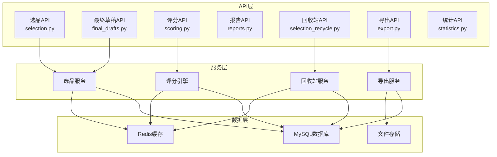
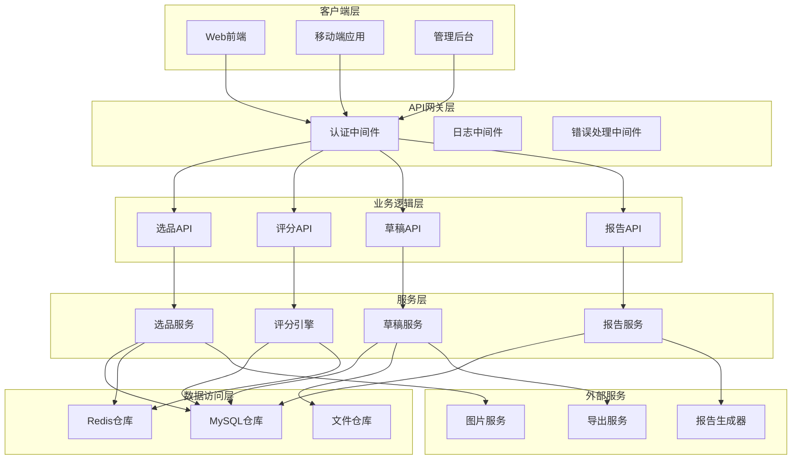
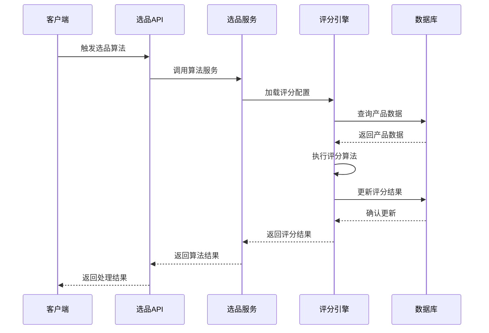
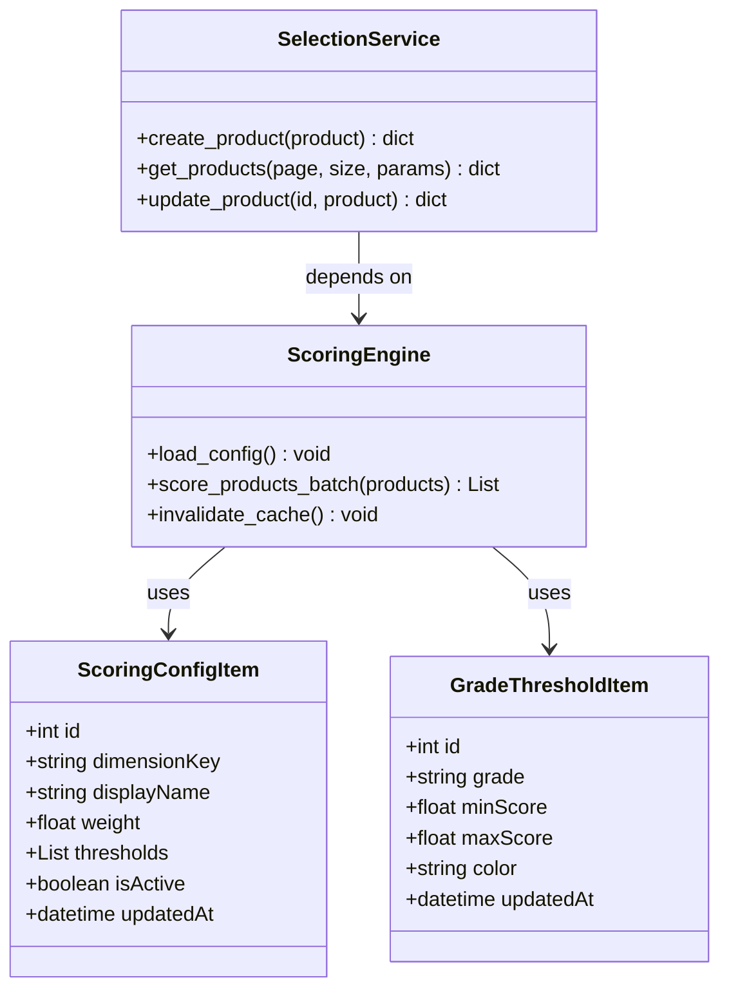
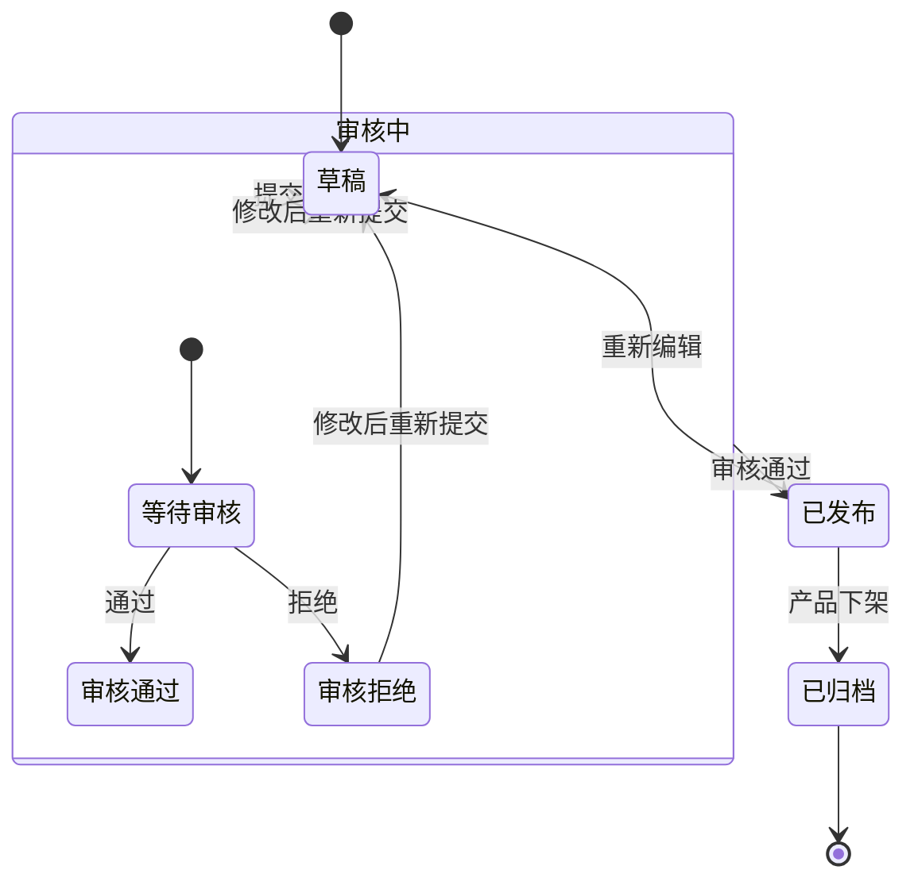
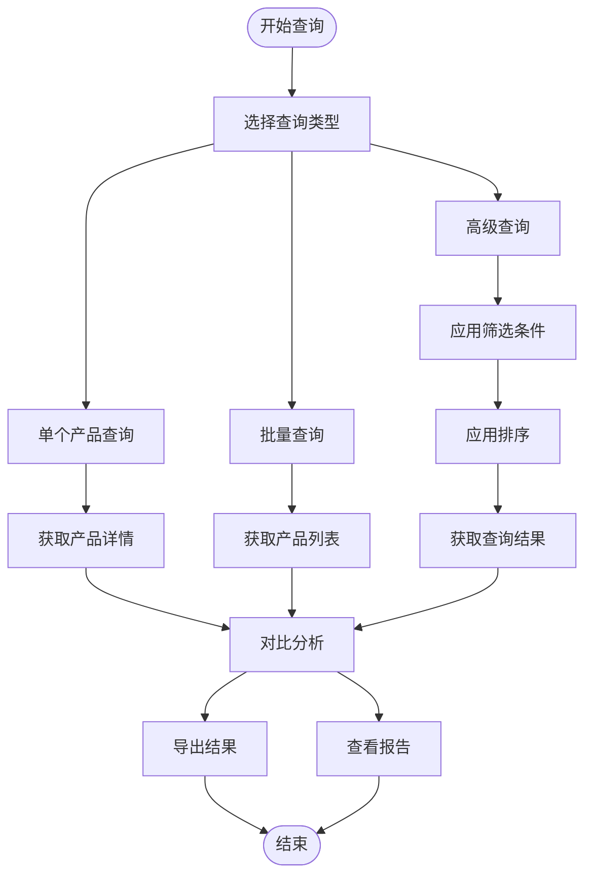
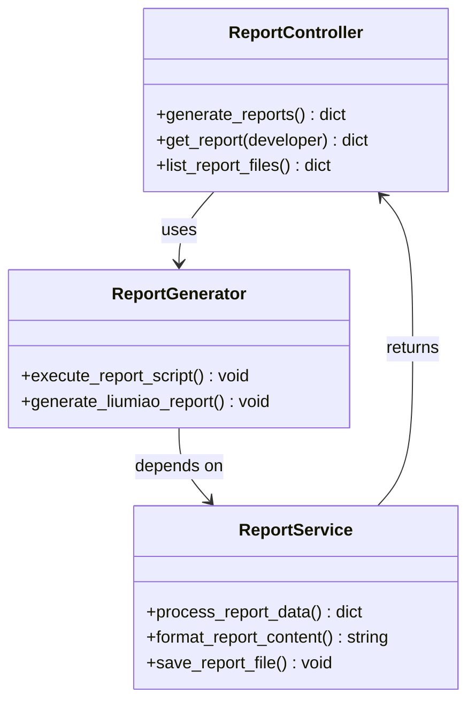
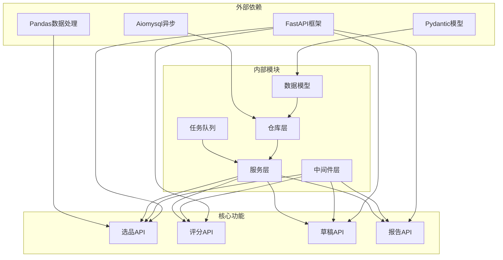

# 智能选品API

<cite>
**本文档引用的文件**
- [selection.py](file://backend/app/api/v1/selection.py)
- [final_drafts.py](file://backend/app/api/v1/final_drafts.py)
- [scoring.py](file://backend/app/api/v1/scoring.py)
- [reports.py](file://backend/app/api/v1/reports.py)
- [selection_recycle.py](file://backend/app/api/v1/selection_recycle.py)
- [export.py](file://backend/app/api/v1/export.py)
- [statistics.py](file://backend/app/api/v1/statistics.py)
</cite>

## 目录
1. [简介](#简介)
2. [项目结构](#项目结构)
3. [核心组件](#核心组件)
4. [架构概览](#架构概览)
5. [详细组件分析](#详细组件分析)
6. [依赖分析](#依赖分析)
7. [性能考虑](#性能考虑)
8. [故障排除指南](#故障排除指南)
9. [结论](#结论)

## 简介

智能选品系统API是一个基于FastAPI构建的现代化选品管理系统，专为电商产品选品和竞品分析而设计。该系统提供了完整的选品生命周期管理，包括产品数据导入、选品算法触发、评分系统、最终草稿管理和报告生成等功能。

系统采用模块化设计，主要包含以下核心功能模块：
- 选品产品管理：支持产品数据的增删改查、批量操作和导入导出
- 评分引擎：基于多维度权重的智能评分系统
- 最终草稿管理：定稿产品的创建、编辑和发布流程
- 竞品分析：竞品数据获取和分析结果查询
- 报告系统：自动生成和导出各类业务报告

## 项目结构

智能选品API采用清晰的分层架构设计，主要文件组织如下：

**图表来源**
- [selection.py:1-50](file://backend/app/api/v1/selection.py#L1-L50)
- [final_drafts.py:1-50](file://backend/app/api/v1/final_drafts.py#L1-L50)
- [scoring.py:1-35](file://backend/app/api/v1/scoring.py#L1-L35)

**章节来源**
- [selection.py:1-100](file://backend/app/api/v1/selection.py#L1-L100)
- [final_drafts.py:1-50](file://backend/app/api/v1/final_drafts.py#L1-L50)
- [scoring.py:1-35](file://backend/app/api/v1/scoring.py#L1-L35)

## 核心组件

### 选品产品管理模块

选品产品管理模块提供了完整的CRUD操作和高级查询功能：

**主要功能特性：**
- 产品创建：支持单个和批量产品创建
- 产品查询：支持多维度筛选和排序
- 产品更新：灵活的产品信息更新
- 产品删除：支持单个、批量和条件删除
- 数据导入：Excel文件批量导入
- 数据导出：ASIN列表导出功能

**关键接口：**
- `POST /selection/products` - 创建选品产品
- `GET /selection/products/list` - 获取选品产品列表
- `GET /selection/products/asins` - 获取所有ASIN列表
- `POST /selection/import` - 导入选品产品
- `GET /selection/template` - 下载导入模板

### 评分系统模块

评分系统模块实现了智能化的产品评分机制：

**评分维度：**
- 销售表现（权重：40%）
- 市场竞争度（权重：30%）
- 产品热度（权重：20%）
- 价格竞争力（权重：10%）

**等级划分：**
- S级：90-100分
- A级：80-89分
- B级：70-79分
- C级：60-69分
- D级：0-59分

**关键接口：**
- `GET /scoring/config` - 获取评分配置
- `PUT /scoring/config` - 更新评分配置
- `POST /scoring/recalculate` - 重新评分
- `GET /scoring/grade-stats` - 获取等级统计

### 最终草稿管理模块

最终草稿管理模块提供了完整的定稿产品生命周期管理：

**功能特性：**
- 草稿创建和编辑
- 多状态管理（草稿、审核中、已发布）
- 批量操作支持
- 图片资源管理
- 下载任务集成

**关键接口：**
- `GET /final-drafts/` - 获取定稿列表
- `POST /final-drafts/` - 创建定稿
- `PUT /final-drafts/{id}` - 更新定稿
- `DELETE /final-drafts/{id}` - 删除定稿

### 竞品分析模块

竞品分析模块专注于竞品数据的获取和分析：

**分析维度：**
- 竞品识别和跟踪
- 市场份额分析
- 价格策略分析
- 销售趋势预测

**关键接口：**
- `GET /selection/reference/list` - 获取竞品店铺列表
- `GET /selection/new/list` - 获取新品榜列表
- `GET /selection/all/list` - 获取总选品列表

## 架构概览

智能选品系统采用分层架构设计，确保了系统的可维护性和扩展性：

**图表来源**
- [selection.py:34-51](file://backend/app/api/v1/selection.py#L34-L51)
- [scoring.py:31-38](file://backend/app/api/v1/scoring.py#L31-L38)
- [final_drafts.py:53-53](file://backend/app/api/v1/final_drafts.py#L53-L53)

## 详细组件分析

### 选品算法触发机制

选品算法的触发机制采用事件驱动架构，支持多种触发方式：

**图表来源**
- [scoring.py:141-193](file://backend/app/api/v1/scoring.py#L141-L193)
- [selection.py:1150-1196](file://backend/app/api/v1/selection.py#L1150-L1196)

### 评分系统配置管理

评分系统提供了灵活的配置管理功能：

**图表来源**
- [scoring.py:16-27](file://backend/app/api/v1/scoring.py#L16-L27)
- [scoring.py:34-38](file://backend/app/api/v1/scoring.py#L34-L38)

**章节来源**
- [scoring.py:41-139](file://backend/app/api/v1/scoring.py#L41-L139)
- [scoring.py:141-321](file://backend/app/api/v1/scoring.py#L141-L321)

### 最终草稿创建、编辑和发布流程

最终草稿管理提供了完整的生命周期管理：

**图表来源**
- [final_drafts.py:562-800](file://backend/app/api/v1/final_drafts.py#L562-L800)

**章节来源**
- [final_drafts.py:562-800](file://backend/app/api/v1/final_drafts.py#L562-L800)

### 选品历史查询和结果对比

系统提供了完善的历史查询和对比功能：

**图表来源**
- [selection.py:94-145](file://backend/app/api/v1/selection.py#L94-L145)
- [selection.py:590-673](file://backend/app/api/v1/selection.py#L590-L673)

**章节来源**
- [selection.py:94-145](file://backend/app/api/v1/selection.py#L94-L145)
- [selection.py:590-673](file://backend/app/api/v1/selection.py#L590-L673)

### 竞品分析数据获取和分析结果查询

竞品分析模块提供了全面的数据分析功能：

**数据分析维度：**
- 市场份额变化
- 价格波动分析
- 销售趋势预测
- 竞争对手策略分析

**关键接口：**
- `GET /selection/reference/list` - 获取竞品数据
- `GET /selection/categories` - 获取分类统计
- `GET /selection/stores` - 获取店铺统计

**章节来源**
- [selection.py:520-588](file://backend/app/api/v1/selection.py#L520-L588)
- [selection.py:704-754](file://backend/app/api/v1/selection.py#L704-L754)

### 选品报告生成和导出

报告生成功能提供了多样化的报告类型：

**图表来源**
- [reports.py:27-178](file://backend/app/api/v1/reports.py#L27-L178)

**章节来源**
- [reports.py:27-178](file://backend/app/api/v1/reports.py#L27-L178)

## 依赖分析

智能选品API的依赖关系体现了清晰的分层架构：

**图表来源**
- [selection.py:10-31](file://backend/app/api/v1/selection.py#L10-L31)
- [scoring.py:9-27](file://backend/app/api/v1/scoring.py#L9-L27)

**章节来源**
- [selection.py:10-31](file://backend/app/api/v1/selection.py#L10-L31)
- [scoring.py:9-27](file://backend/app/api/v1/scoring.py#L9-L27)

## 性能考虑

智能选品API在设计时充分考虑了性能优化：

**数据库优化：**
- 使用索引优化查询性能
- 实现分页查询避免大数据集加载
- 采用连接池管理数据库连接
- 实现缓存策略减少重复查询

**异步处理：**
- 批量导入操作使用异步处理
- 报告生成采用后台任务
- 图片处理异步执行
- 大数据导出异步处理

**内存管理：**
- Excel文件处理分块读取
- 图片资源及时释放
- 缓存大小限制
- 过期数据自动清理

## 故障排除指南

### 常见问题及解决方案

**1. 数据导入失败**
- 检查Excel文件格式是否正确
- 确认必填字段是否完整
- 验证ASIN格式是否符合要求
- 查看错误日志获取具体原因

**2. 评分计算异常**
- 检查评分配置是否正确
- 确认产品数据完整性
- 验证权重设置合理性
- 查看评分引擎日志

**3. API响应超时**
- 检查数据库连接状态
- 优化查询语句和索引
- 调整分页参数
- 监控服务器资源使用

**4. 文件上传失败**
- 检查文件大小限制
- 验证文件格式支持
- 确认存储权限配置
- 查看文件系统空间

**章节来源**
- [selection.py:756-800](file://backend/app/api/v1/selection.py#L756-L800)
- [scoring.py:141-193](file://backend/app/api/v1/scoring.py#L141-L193)

## 结论

智能选品系统API提供了一个完整、高效、可扩展的选品管理解决方案。系统采用现代化的技术栈和架构设计，具备以下优势：

**技术优势：**
- 基于FastAPI的高性能异步框架
- 清晰的分层架构设计
- 完善的错误处理和日志系统
- 灵活的配置管理机制

**功能优势：**
- 全面的选品生命周期管理
- 智能化的评分系统
- 丰富的数据分析功能
- 灵活的报告生成功能

**扩展性：**
- 模块化设计便于功能扩展
- 插件化架构支持第三方集成
- 微服务架构支持水平扩展
- 云端部署支持弹性伸缩

该系统为电商选品工作提供了强有力的技术支撑，能够显著提升选品效率和决策质量。