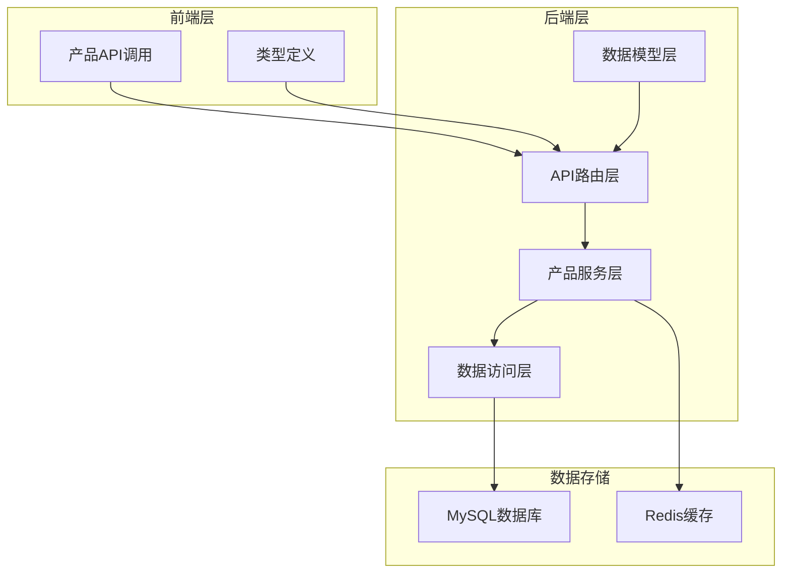
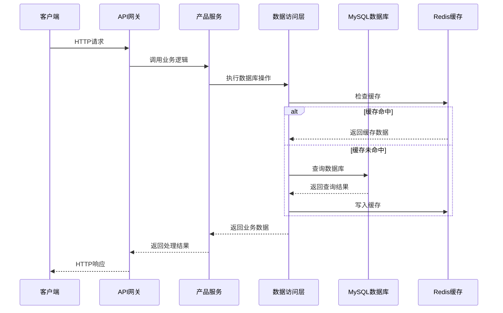
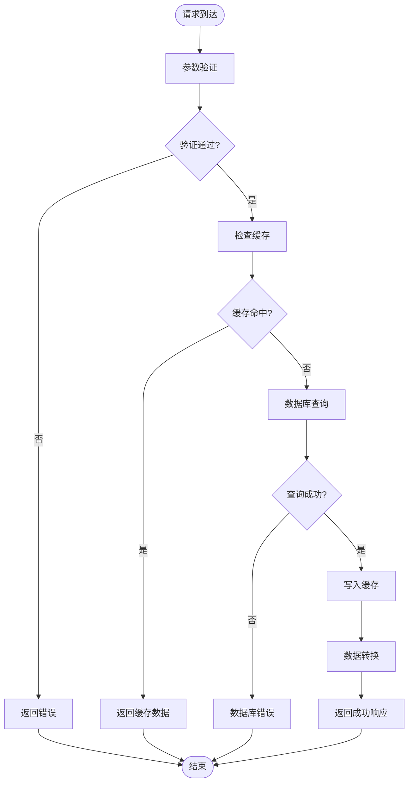
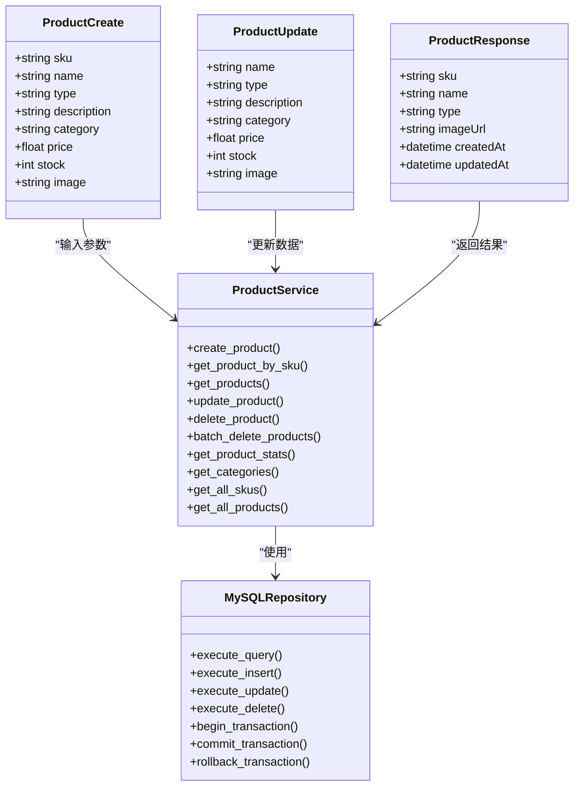

# 选品产品管理

<cite>
**本文引用的文件**
- [backend/app/api/v1/products.py](file://backend/app/api/v1/products.py)
- [backend/app/models/product.py](file://backend/app/models/product.py)
- [backend/app/services/product_service.py](file://backend/app/services/product_service.py)
- [backend/app/repositories/mysql_repo.py](file://backend/app/repositories/mysql_repo.py)
- [frontend/src/api/product.ts](file://frontend/src/api/product.ts)
- [frontend/src/types/product.ts](file://frontend/src/types/product.ts)
- [frontend/openapi.json](file://frontend/openapi.json)
- [backend/migrations/init_database_dev.sql](file://backend/migrations/init_database_dev.sql)
</cite>

## 目录
1. [简介](#简介)
2. [项目结构](#项目结构)
3. [核心组件](#核心组件)
4. [架构概览](#架构概览)
5. [详细组件分析](#详细组件分析)
6. [依赖关系分析](#依赖关系分析)
7. [性能考虑](#性能考虑)
8. [故障排除指南](#故障排除指南)
9. [结论](#结论)
10. [附录](#附录)

## 简介
本文件为选品产品管理API的详细技术文档。该系统提供完整的CRUD操作接口，支持产品创建、查询、更新、删除，并包含批量操作、数据导入导出、统计分析等功能。文档重点说明产品数据模型、验证规则、产品类型差异、ASIN去重机制以及完整的请求响应示例。

## 项目结构
后端采用FastAPI框架，遵循分层架构设计：
- API层：处理HTTP请求和响应，定义RESTful接口
- 服务层：实现业务逻辑，协调数据访问
- 数据访问层：封装数据库操作，提供事务管理
- 模型层：定义数据结构和验证规则
- 前端：提供产品管理界面和API调用



**图表来源**
- [backend/app/api/v1/products.py:1-795](file://backend/app/api/v1/products.py#L1-L795)
- [backend/app/services/product_service.py:1-745](file://backend/app/services/product_service.py#L1-L745)
- [backend/app/repositories/mysql_repo.py:1-800](file://backend/app/repositories/mysql_repo.py#L1-L800)

**章节来源**
- [backend/app/api/v1/products.py:1-795](file://backend/app/api/v1/products.py#L1-L795)
- [backend/app/models/product.py:1-143](file://backend/app/models/product.py#L1-L143)

## 核心组件

### 数据模型定义
系统定义了完整的产品数据模型，包含基础字段、验证规则和别名映射：

**产品基础模型（ProductBase）**
- SKU：字符串，长度1-100字符，必填
- 名称：字符串，长度1-255字符，必填  
- 描述：字符串，可选
- 分类：字符串，长度不超过100字符，可选
- 标签：字符串数组，可选
- 价格：数值，≥0，可选
- 库存：整数，≥0，可选
- 图片：字符串，URL格式，可选

**产品类型定义**
- 普通产品：标准商品
- 组合产品：包含多个子产品的套装
- 定制产品：根据需求定制的商品

**查询参数模型（ProductQueryParams）**
- 支持SKU、名称、类型、分类的精确和模糊查询
- 支持价格区间查询
- 支持多字段排序（默认按创建时间倒序）

**章节来源**
- [backend/app/models/product.py:6-98](file://backend/app/models/product.py#L6-L98)

### API接口规范
系统提供完整的RESTful API接口：

**CRUD操作**
- POST `/api/v1/products`：创建产品
- GET `/api/v1/products/list`：获取产品列表
- GET `/api/v1/products/search`：搜索产品
- GET `/api/v1/products/{sku}`：获取产品详情
- PUT `/api/v1/products/{sku}`：更新产品
- DELETE `/api/v1/products/{sku}`：删除产品

**批量操作**
- POST `/api/v1/products/batch-delete`：批量删除
- PUT `/api/v1/products/batch`：批量更新

**数据管理**
- GET `/api/v1/products/skus`：获取SKU列表
- GET `/api/v1/products/stats/summary`：获取统计信息
- GET `/api/v1/products/categories`：获取分类统计
- GET `/api/v1/products/export`：导出产品数据
- POST `/api/v1/products/import`：导入产品数据

**章节来源**
- [backend/app/api/v1/products.py:53-795](file://backend/app/api/v1/products.py#L53-L795)
- [frontend/openapi.json:844-1260](file://frontend/openapi.json#L844-L1260)

## 架构概览

### 系统架构图


**图表来源**
- [backend/app/api/v1/products.py:36-50](file://backend/app/api/v1/products.py#L36-L50)
- [backend/app/services/product_service.py:85-124](file://backend/app/services/product_service.py#L85-L124)
- [backend/app/repositories/mysql_repo.py:385-470](file://backend/app/repositories/mysql_repo.py#L385-L470)

### 数据流图


**图表来源**
- [backend/app/services/product_service.py:85-124](file://backend/app/services/product_service.py#L85-L124)
- [backend/app/repositories/mysql_repo.py:385-470](file://backend/app/repositories/mysql_repo.py#L385-L470)

## 详细组件分析

### 产品服务层（ProductService）
产品服务层是业务逻辑的核心，负责处理所有产品相关的业务操作：

**核心功能**
- 产品CRUD操作：创建、查询、更新、删除
- 批量操作：批量删除、批量更新
- 数据统计：产品数量、分类统计、状态统计
- 缓存管理：Redis缓存的读写和失效

**缓存策略**
- 产品详情缓存：TTL 3600秒
- 产品列表缓存：TTL 300秒
- 异步缓存清理：更新操作后异步清除相关缓存

**事务管理**
- 删除操作：使用MySQL事务保证数据一致性
- 批量操作：支持批量插入和更新的事务处理

**章节来源**
- [backend/app/services/product_service.py:21-745](file://backend/app/services/product_service.py#L21-L745)

### 数据访问层（MySQLRepository）
数据访问层提供统一的数据库操作接口：

**连接池管理**
- 支持最大连接数配置
- 自动连接回收机制
- 连接超时和健康检查

**查询优化**
- SQL执行时间监控
- 查询类型统计
- 慢查询告警

**事务支持**
- 事务开始、提交、回滚
- 连接池级别的事务管理

**章节来源**
- [backend/app/repositories/mysql_repo.py:11-800](file://backend/app/repositories/mysql_repo.py#L11-L800)

### ASIN去重机制
系统实现了多层次的去重保护机制：

**文件级去重**
- 导入前检查Excel文件中的重复SKU
- 记录重复项并跳过导入

**数据库级去重**
- 导入前查询数据库中已存在的SKU
- 自动过滤已存在的产品记录

**事务保证**
- 使用数据库事务确保导入操作的原子性
- 失败时自动回滚，保证数据一致性

**章节来源**
- [backend/app/api/v1/products.py:699-778](file://backend/app/api/v1/products.py#L699-L778)

### 产品类型详解

| 产品类型 | 适用场景 | 特征描述 | 管理方式 |
|---------|----------|----------|----------|
| 普通产品 | 标准商品销售 | 单一SKU，独立库存 | 基础CRUD操作 |
| 组合产品 | 套装商品 | 包含多个子产品，SKU组合 | 支持包含单品配置 |
| 定制产品 | 个性化定制 | 根据客户需求定制 | 支持定制属性配置 |

**使用建议**
- 普通产品：适用于标准化程度高的商品
- 组合产品：适用于促销套餐或配套商品
- 定制产品：适用于B2B定制或特殊规格商品

**章节来源**
- [backend/app/models/product.py:22-46](file://backend/app/models/product.py#L22-L46)

### 批量操作接口

**批量删除**
- 支持最多100个SKU的批量删除
- 自动验证SKU格式和有效性
- 使用事务保证操作原子性

**批量更新**
- 支持多条记录的批量更新
- 每条记录可选择性更新字段
- 提供详细的错误反馈

**章节来源**
- [backend/app/api/v1/products.py:350-550](file://backend/app/api/v1/products.py#L350-L550)

## 依赖关系分析

### 组件依赖图


**图表来源**
- [backend/app/models/product.py:22-61](file://backend/app/models/product.py#L22-L61)
- [backend/app/services/product_service.py:21-36](file://backend/app/services/product_service.py#L21-L36)
- [backend/app/repositories/mysql_repo.py:11-800](file://backend/app/repositories/mysql_repo.py#L11-L800)

### 外部依赖
- **FastAPI**：Web框架，提供异步HTTP服务
- **Pydantic**：数据验证和序列化
- **aiomysql**：异步MySQL驱动
- **pandas**：数据处理和导入导出
- **Redis**：缓存存储

**章节来源**
- [backend/app/api/v1/products.py:10-29](file://backend/app/api/v1/products.py#L10-L29)
- [backend/app/services/product_service.py:1-18](file://backend/app/services/product_service.py#L1-L18)

## 性能考虑

### 缓存策略
系统采用多级缓存策略提升性能：
- **产品详情缓存**：热点数据缓存1小时
- **产品列表缓存**：分页数据缓存5分钟
- **异步缓存清理**：更新操作后异步清除缓存

### 查询优化
- **索引优化**：为常用查询字段建立索引
- **分页查询**：限制每页最大记录数（500条）
- **条件查询**：支持多条件组合查询

### 数据库连接池
- **连接池大小**：支持动态配置
- **连接回收**：防止连接泄漏
- **超时控制**：SQL执行超时保护

## 故障排除指南

### 常见错误及解决方案

**认证失败**
- 确保请求头包含有效的Authorization Bearer Token
- 检查用户权限是否包含相应的产品管理权限

**参数验证错误**
- SKU必须为1-100字符的字符串
- 价格和库存必须为非负数
- 产品类型必须为指定的枚举值

**数据库连接错误**
- 检查MySQL服务状态
- 验证连接参数配置
- 查看连接池使用情况

**导入失败**
- 确认Excel文件格式正确
- 检查必需列是否存在
- 验证SKU的唯一性

**章节来源**
- [backend/app/api/v1/products.py:299-347](file://backend/app/api/v1/products.py#L299-L347)
- [backend/app/api/v1/products.py:609-795](file://backend/app/api/v1/products.py#L609-L795)

### 日志监控
系统提供详细的日志记录：
- **操作日志**：记录所有产品操作
- **性能日志**：SQL执行时间和慢查询
- **错误日志**：异常堆栈和错误信息

## 结论
选品产品管理系统提供了完整的产品生命周期管理功能，具有以下特点：

1. **完整的CRUD支持**：提供标准的增删改查接口
2. **强大的批量操作**：支持批量导入导出和批量更新
3. **完善的缓存机制**：提升系统性能和响应速度
4. **严格的数据验证**：确保数据质量和系统稳定性
5. **灵活的查询功能**：支持多维度的产品查询和筛选

系统采用现代化的技术栈和架构设计，能够满足选品业务的复杂需求，为后续的功能扩展奠定了良好的基础。

## 附录

### API使用示例

**创建产品**
```
POST /api/v1/products
{
  "sku": "ABC123",
  "name": "测试产品",
  "type": "普通产品",
  "description": "产品描述",
  "category": "电子产品",
  "tags": ["标签1", "标签2"],
  "price": 99.99,
  "stock": 100,
  "image": "https://example.com/image.jpg"
}
```

**批量删除**
```
POST /api/v1/products/batch-delete
{
  "skus": ["SKU001", "SKU002", "SKU003"]
}
```

**导出产品**
```
GET /api/v1/products/export?format=excel
```

### 数据模型字段说明

| 字段名 | 类型 | 必填 | 说明 | 验证规则 |
|--------|------|------|------|----------|
| sku | string | 是 | 产品SKU | 1-100字符，字母数字下划线短横线 |
| name | string | 是 | 产品名称 | 1-255字符 |
| type | string | 是 | 产品类型 | 普通产品/组合产品/定制产品 |
| description | string | 否 | 产品描述 | 无限制 |
| category | string | 否 | 产品分类 | ≤100字符 |
| tags | array | 否 | 产品标签 | 字符串数组 |
| price | number | 否 | 产品价格 | ≥0 |
| stock | integer | 否 | 库存数量 | ≥0 |
| image | string | 否 | 产品图片URL | URL格式 |

**章节来源**
- [backend/app/models/product.py:12-18](file://backend/app/models/product.py#L12-L18)
- [backend/app/api/v1/products.py:53-86](file://backend/app/api/v1/products.py#L53-L86)