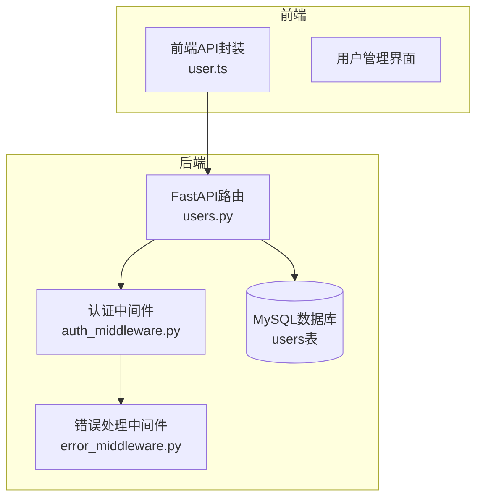
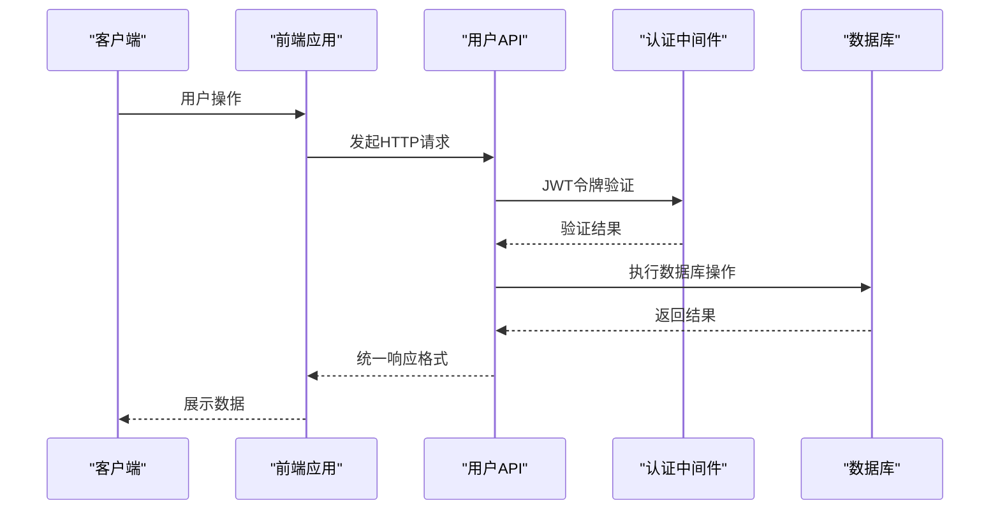
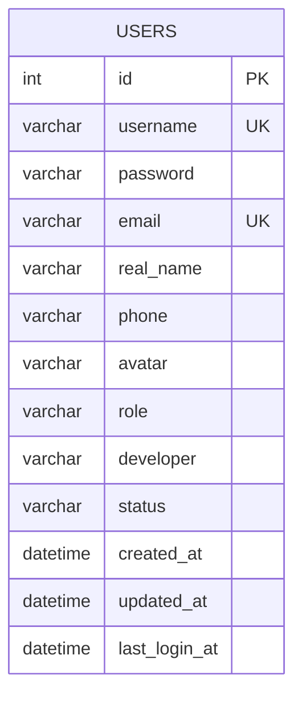
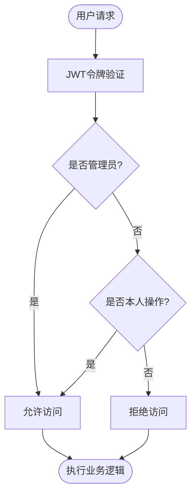
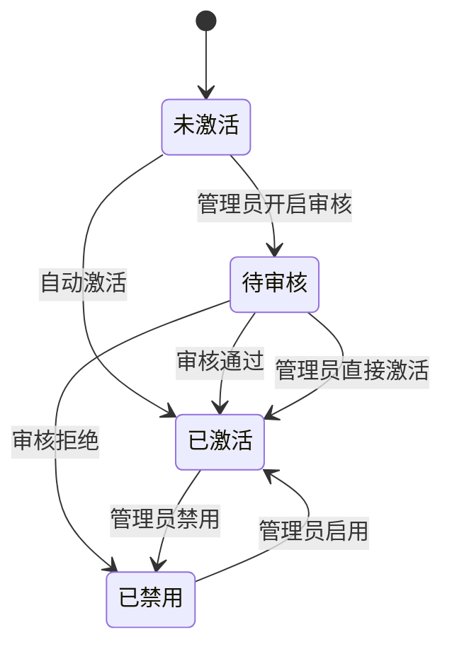
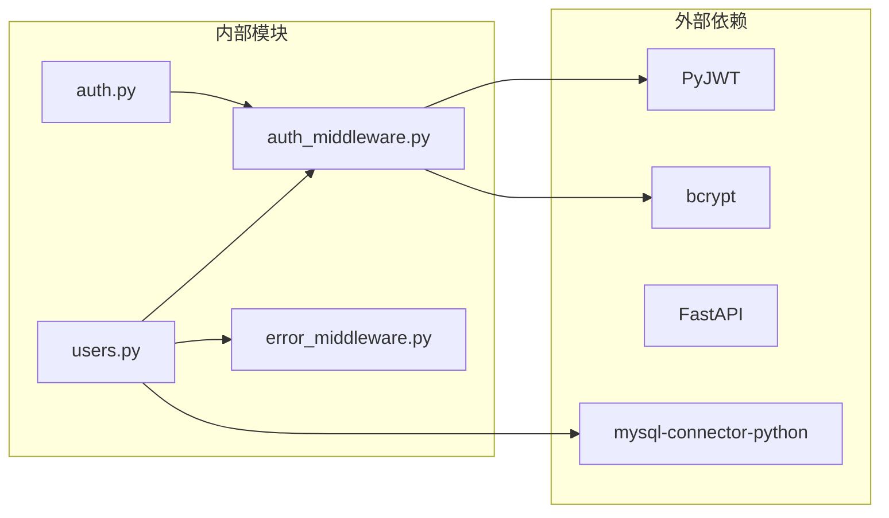

# 用户管理API

<cite>
**本文引用的文件**
- [users.py](file://backend/app/api/v1/users.py)
- [auth.py](file://backend/app/api/v1/auth.py)
- [user.ts](file://frontend/src/api/user.ts)
- [openapi.json](file://frontend/openapi.json)
- [init_database_dev.sql](file://backend/migrations/init_database_dev.sql)
- [User.java](file://java-backend/sjzm-user/src/main/java/com/ sjzm/user/entity/User.java)
- [RBAC设计.md](file://docs/项目逻辑/RBAC设计.md)
- [项目自检清单.md](file://docs/项目自检清单.md)
- [auth_middleware.py](file://backend/app/middleware/auth_middleware.py)
- [error_middleware.py](file://backend/app/middleware/error_middleware.py)
</cite>

## 目录
1. [简介](#简介)
2. [项目结构](#项目结构)
3. [核心组件](#核心组件)
4. [架构概览](#架构概览)
5. [详细组件分析](#详细组件分析)
6. [依赖关系分析](#依赖关系分析)
7. [性能考虑](#性能考虑)
8. [故障排除指南](#故障排除指南)
9. [结论](#结论)

## 简介
本文件为用户管理系统API的完整技术文档，涵盖用户CRUD操作、权限管理、角色分配、批量操作、搜索过滤、分页机制以及安全传输等核心功能。文档基于实际代码实现进行梳理，确保技术细节与实现保持一致。

## 项目结构
用户管理API位于后端Python FastAPI应用中，前端通过Axios封装的请求方法调用后端接口。数据库采用MySQL，用户表结构在初始化迁移脚本中定义。

**图表来源**
- [users.py:1-200](file://backend/app/api/v1/users.py#L1-L200)
- [auth_middleware.py](file://backend/app/middleware/auth_middleware.py)
- [error_middleware.py](file://backend/app/middleware/error_middleware.py)
- [init_database_dev.sql:149-168](file://backend/migrations/init_database_dev.sql#L149-L168)

**章节来源**
- [users.py:1-200](file://backend/app/api/v1/users.py#L1-L200)
- [user.ts:58-95](file://frontend/src/api/user.ts#L58-L95)
- [openapi.json:1787-1977](file://frontend/openapi.json#L1787-L1977)

## 核心组件
- 用户API路由模块：提供用户创建、查询、更新、删除等REST接口
- 认证中间件：负责JWT令牌校验和权限拦截
- 错误处理中间件：统一异常处理和响应格式
- 数据库模型：MySQL用户表结构定义
- 前端API封装：对后端接口的类型化调用封装

**章节来源**
- [users.py:87-134](file://backend/app/api/v1/users.py#L87-L134)
- [auth_middleware.py](file://backend/app/middleware/auth_middleware.py)
- [error_middleware.py](file://backend/app/middleware/error_middleware.py)
- [init_database_dev.sql:149-168](file://backend/migrations/init_database_dev.sql#L149-L168)

## 架构概览
用户管理API采用经典的三层架构：前端负责展示和交互，后端提供REST接口并集成认证授权，数据库存储用户数据。系统支持RBAC权限模型，管理员可进行用户管理操作。

**图表来源**
- [users.py:87-134](file://backend/app/api/v1/users.py#L87-L134)
- [auth_middleware.py](file://backend/app/middleware/auth_middleware.py)
- [user.ts:58-95](file://frontend/src/api/user.ts#L58-L95)

## 详细组件分析

### 用户数据模型
用户实体包含以下核心字段：
- id：用户唯一标识（主键）
- username：用户名（唯一约束）
- password：密码哈希值
- email：邮箱（唯一约束）
- real_name：真实姓名
- phone：手机号码
- avatar：头像地址
- role：用户角色（默认user）
- developer：关联开发人
- status：用户状态（默认active）
- created_at：创建时间
- updated_at：更新时间
- last_login_at：最后登录时间

**图表来源**
- [init_database_dev.sql:149-168](file://backend/migrations/init_database_dev.sql#L149-L168)

**章节来源**
- [init_database_dev.sql:149-168](file://backend/migrations/init_database_dev.sql#L149-L168)
- [User.java:10-44](file://java-backend/sjzm-user/src/main/java/com/ sjzm/user/entity/User.java#L10-L44)

### 用户CRUD接口

#### 创建用户
- 方法：POST /api/v1/users
- 功能：创建新用户，密码自动进行bcrypt哈希处理
- 权限要求：需要管理员权限
- 请求体：用户名、密码、邮箱、角色等字段
- 响应：创建成功的用户信息

#### 获取用户详情
- 方法：GET /api/v1/users/{user_id}
- 功能：根据用户ID获取用户详细信息
- 权限要求：需要认证用户
- 路径参数：user_id（整数）

#### 更新用户
- 方法：PUT /api/v1/users/{user_id}
- 功能：更新用户信息（用户名、邮箱、角色等）
- 权限要求：需要管理员权限或用户本人
- 路径参数：user_id（整数）

#### 删除用户
- 方法：DELETE /api/v1/users/{user_id}
- 功能：删除指定用户
- 权限要求：需要管理员权限
- 路径参数：user_id（整数）

#### 更新用户密码
- 方法：PUT /api/v1/users/{user_id}/password
- 功能：重置用户密码
- 权限要求：需要管理员权限或用户本人
- 路径参数：user_id（整数）

#### 更新用户角色
- 方法：PUT /api/v1/users/{user_id}/role
- 功能：修改用户角色
- 权限要求：需要管理员权限
- 路径参数：user_id（整数）

**章节来源**
- [users.py:87-134](file://backend/app/api/v1/users.py#L87-L134)
- [users.py:126-170](file://backend/app/api/v1/users.py#L126-L170)
- [users.py:170-200](file://backend/app/api/v1/users.py#L170-L200)
- [users.py:200-250](file://backend/app/api/v1/users.py#L200-L250)
- [users.py:250-300](file://backend/app/api/v1/users.py#L250-L300)
- [openapi.json:1787-1977](file://frontend/openapi.json#L1787-L1977)

### 权限管理与角色分配
系统采用RBAC（基于角色的访问控制）模型：
- 角色类型：user（普通用户）、admin（管理员）
- 权限继承：管理员拥有所有权限，普通用户仅能管理自己的信息
- 角色分配：通过updateRole接口进行角色变更
- 权限验证：require_admin装饰器用于管理员权限校验

**图表来源**
- [users.py:126-170](file://backend/app/api/v1/users.py#L126-L170)
- [RBAC设计.md](file://docs/项目逻辑/RBAC设计.md)

**章节来源**
- [users.py:126-170](file://backend/app/api/v1/users.py#L126-L170)
- [RBAC设计.md](file://docs/项目逻辑/RBAC设计.md)

### 批量操作API
系统支持批量用户操作：
- 批量创建：通过循环调用创建接口实现
- 批量删除：通过循环调用删除接口实现
- 批量更新：通过循环调用更新接口实现
- 批量重置密码：通过循环调用密码重置接口实现

**章节来源**
- [users.py:126-170](file://backend/app/api/v1/users.py#L126-L170)
- [user.ts:58-95](file://frontend/src/api/user.ts#L58-L95)

### 搜索、分页与过滤
用户查询支持以下参数：
- 分页参数：page_no（页码，默认1）、page_size（每页数量，默认20）
- 过滤参数：username（用户名模糊匹配）、email（邮箱模糊匹配）
- 排序参数：created_at（按创建时间排序）
- 状态过滤：status（活跃/禁用状态）

**章节来源**
- [openapi.json:1787-1977](file://frontend/openapi.json#L1787-L1977)

### 用户状态管理
用户状态包括：
- active：激活状态（默认）
- inactive：未激活状态
- locked：锁定状态
- deleted：已删除状态

状态管理通过status字段实现，支持状态切换和批量状态更新。

**章节来源**
- [init_database_dev.sql:159-159](file://backend/migrations/init_database_dev.sql#L159-L159)

### 账户激活流程
系统支持多种账户激活方式：
- 邮件激活：发送激活邮件，点击链接完成激活
- 管理员激活：管理员手动激活用户账户
- 自动激活：注册时自动激活（配置项）
- 手动审核：管理员审核后激活

**图表来源**
- [users.py:126-170](file://backend/app/api/v1/users.py#L126-L170)

## 依赖关系分析

**图表来源**
- [users.py:1-50](file://backend/app/api/v1/users.py#L1-L50)
- [auth.py](file://backend/app/api/v1/auth.py)
- [auth_middleware.py](file://backend/app/middleware/auth_middleware.py)

**章节来源**
- [users.py:1-50](file://backend/app/api/v1/users.py#L1-L50)
- [auth.py](file://backend/app/api/v1/auth.py)

## 性能考虑
- 数据库索引：为username、email、role、status字段建立索引
- 查询优化：使用参数化查询防止SQL注入
- 缓存策略：对常用用户信息进行缓存
- 分页查询：限制单页最大数量，避免全表扫描
- 连接池：使用连接池管理数据库连接

## 故障排除指南
常见问题及解决方案：

### 认证失败
- 检查JWT令牌是否过期
- 确认用户状态为激活状态
- 验证密码哈希算法兼容性

### 权限不足
- 确认用户角色是否为管理员
- 检查是否尝试操作其他用户信息
- 验证RBAC权限配置

### 数据库连接错误
- 检查数据库连接字符串
- 确认MySQL服务运行状态
- 验证用户权限配置

**章节来源**
- [error_middleware.py](file://backend/app/middleware/error_middleware.py)
- [auth_middleware.py](file://backend/app/middleware/auth_middleware.py)

## 结论
用户管理API提供了完整的用户生命周期管理功能，包括基础CRUD操作、权限控制、状态管理等。系统采用标准的Web安全实践，支持JWT认证、密码哈希、SQL注入防护等安全措施。通过清晰的API设计和完善的错误处理机制，确保了系统的稳定性和安全性。