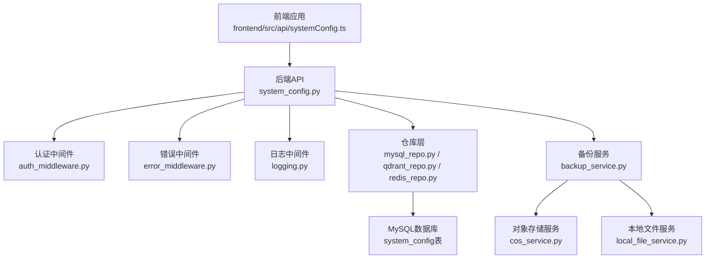
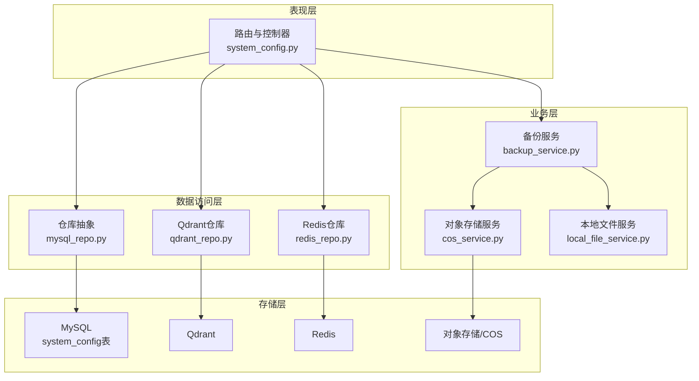
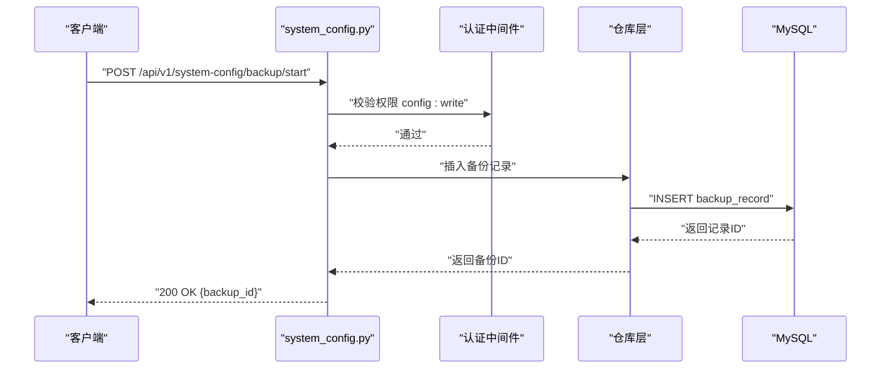
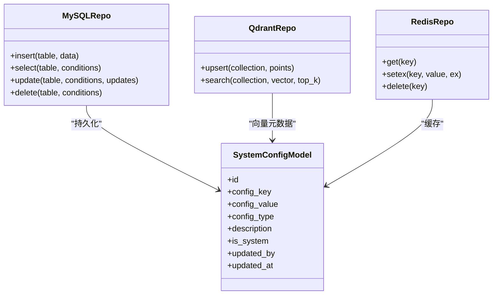
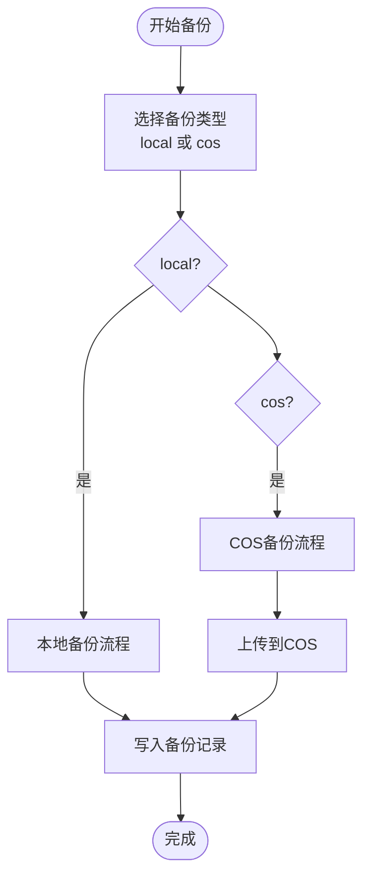
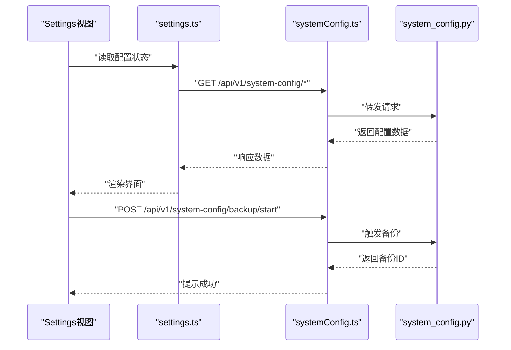
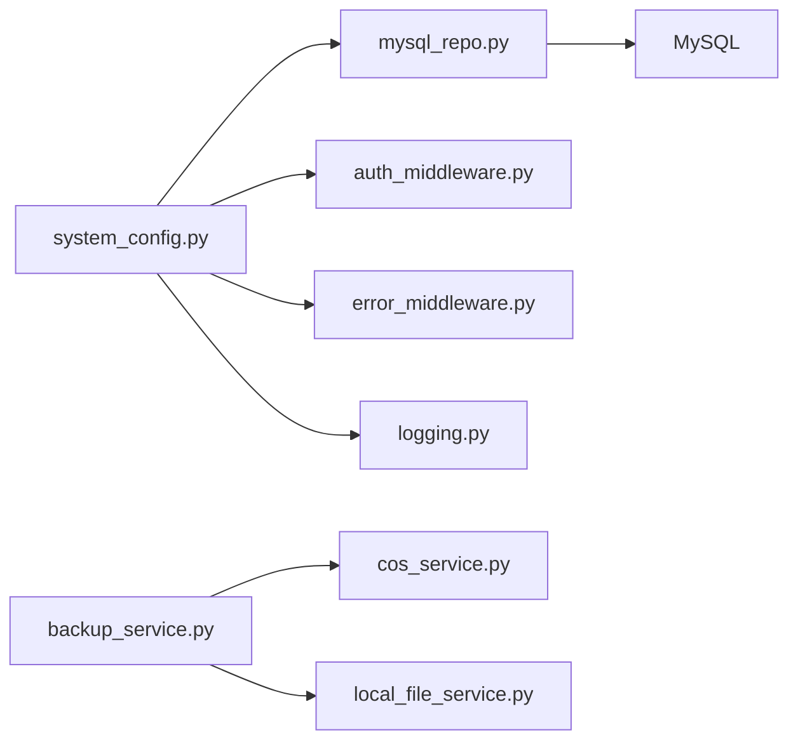

# 系统参数管理

<cite>
**本文引用的文件**
- [backend/app/api/v1/system_config.py](file://backend/app/api/v1/system_config.py)
- [backend/app/api/v1/__init__.py](file://backend/app/api/v1/__init__.py)
- [backend/migrations/001_create_backup_records_table.sql](file://backend/migrations/001_create_backup_records_table.sql)
- [backend/migrations/add_cos_fields.sql](file://backend/migrations/add_cos_fields.sql)
- [backend/app/services/backup_service.py](file://backend/app/services/backup_service.py)
- [backend/app/services/cos_service.py](file://backend/app/services/cos_service.py)
- [backend/app/services/local_file_service.py](file://backend/app/services/local_file_service.py)
- [backend/app/utils/system/system_check.py](file://backend/app/utils/system/system_check.py)
- [backend/app/utils/system/performance_monitor.py](file://backend/app/utils/system/performance_monitor.py)
- [backend/app/utils/system/hot_reload.py](file://backend/app/utils/system/hot_reload.py)
- [backend/app/utils/system/file_watcher.py](file://backend/app/utils/system/file_watcher.py)
- [backend/app/utils/system/config_reloader.py](file://backend/app/utils/system/config_reloader.py)
- [backend/app/utils/middleware/timeout_middleware.py](file://backend/app/utils/middleware/timeout_middleware.py)
- [backend/app/middleware/auth_middleware.py](file://backend/app/middleware/auth_middleware.py)
- [backend/app/middleware/error_middleware.py](file://backend/app/middleware/error_middleware.py)
- [backend/app/middleware/logging.py](file://backend/app/middleware/logging.py)
- [backend/app/models/carrier_library.py](file://backend/app/models/carrier_library.py)
- [backend/app/repositories/mysql_repo.py](file://backend/app/repositories/mysql_repo.py)
- [backend/app/repositories/qdrant_repo.py](file://backend/app/repositories/qdrant_repo.py)
- [backend/app/repositories/redis_repo.py](file://backend/app/repositories/redis_repo.py)
- [backend/app/schemas/system_log.py](file://backend/app/schemas/system_log.py)
- [backend/app/services/system_log_service.py](file://backend/app/services/system_log_service.py)
- [backend/app/api/v1/announcement.py](file://backend/app/api/v1/announcement.py)
- [backend/app/services/image_service.py](file://backend/app/services/image_service.py)
- [frontend/src/api/systemConfig.ts](file://frontend/src/api/systemConfig.ts)
- [frontend/src/views/Settings/index.vue](file://frontend/src/views/Settings/index.vue)
- [frontend/src/stores/settings.ts](file://frontend/src/stores/settings.ts)
- [frontend/src/types/common.ts](file://frontend/src/types/common.ts)
- [frontend/openapi.json](file://frontend/openapi.json)
</cite>

## 目录
1. [简介](#简介)
2. [项目结构](#项目结构)
3. [核心组件](#核心组件)
4. [架构概览](#架构概览)
5. [详细组件分析](#详细组件分析)
6. [依赖分析](#依赖分析)
7. [性能考虑](#性能考虑)
8. [故障排除指南](#故障排除指南)
9. [结论](#结论)
10. [附录](#附录)

## 简介
本文件面向系统参数管理API，聚焦于系统配置参数的获取与更新接口，涵盖以下主题：
- 配置项的数据结构、验证规则与默认值
- 增删改查（CRUD）操作与权限控制
- 存储格式与解析方法
- 配置变更示例与最佳实践
- 版本管理与兼容性策略

系统参数管理API当前在Python后端提供基础能力，并通过OpenAPI文档暴露接口；同时，Java后端也实现了SystemConfigController以承接系统配置相关业务。

## 项目结构
系统参数管理涉及后端API、迁移脚本、服务层、中间件与前端调用等模块。关键路径如下：
- 后端API：/api/v1/system_config.py 提供系统配置相关接口
- 数据库迁移：001_create_backup_records_table.sql、add_cos_fields.sql 等定义系统配置与备份相关表结构
- 服务层：backup_service.py、cos_service.py、local_file_service.py 等处理备份与存储
- 中间件：auth_middleware.py、error_middleware.py、logging.py 等保障安全与可观测性
- 前端：frontend/src/api/systemConfig.ts 调用后端接口，Settings页面展示与编辑

图表来源
- [backend/app/api/v1/system_config.py](file://backend/app/api/v1/system_config.py)
- [backend/app/middleware/auth_middleware.py](file://backend/app/middleware/auth_middleware.py)
- [backend/app/middleware/error_middleware.py](file://backend/app/middleware/error_middleware.py)
- [backend/app/middleware/logging.py](file://backend/app/middleware/logging.py)
- [backend/app/repositories/mysql_repo.py](file://backend/app/repositories/mysql_repo.py)
- [backend/app/repositories/qdrant_repo.py](file://backend/app/repositories/qdrant_repo.py)
- [backend/app/repositories/redis_repo.py](file://backend/app/repositories/redis_repo.py)
- [backend/migrations/001_create_backup_records_table.sql](file://backend/migrations/001_create_backup_records_table.sql)
- [backend/app/services/backup_service.py](file://backend/app/services/backup_service.py)
- [backend/app/services/cos_service.py](file://backend/app/services/cos_service.py)
- [backend/app/services/local_file_service.py](file://backend/app/services/local_file_service.py)

章节来源
- [backend/app/api/v1/system_config.py](file://backend/app/api/v1/system_config.py)
- [backend/app/api/v1/__init__.py](file://backend/app/api/v1/__init__.py)
- [backend/migrations/001_create_backup_records_table.sql](file://backend/migrations/001_create_backup_records_table.sql)
- [backend/migrations/add_cos_fields.sql](file://backend/migrations/add_cos_fields.sql)

## 核心组件
- 系统配置API：提供配置项的查询、新增、修改、删除与备份相关接口
- 仓库层：封装对system_config表的访问，支持MySQL、Qdrant、Redis等存储
- 服务层：备份服务、对象存储服务、本地文件服务等
- 中间件：认证、错误处理、日志记录
- 前端调用：通过systemConfig.ts发起请求，Settings页面进行展示与交互

章节来源
- [backend/app/api/v1/system_config.py](file://backend/app/api/v1/system_config.py)
- [backend/app/repositories/mysql_repo.py](file://backend/app/repositories/mysql_repo.py)
- [backend/app/repositories/qdrant_repo.py](file://backend/app/repositories/qdrant_repo.py)
- [backend/app/repositories/redis_repo.py](file://backend/app/repositories/redis_repo.py)
- [frontend/src/api/systemConfig.ts](file://frontend/src/api/systemConfig.ts)

## 架构概览
系统参数管理采用分层架构：
- 表现层：API路由与控制器
- 业务层：服务编排与规则校验
- 数据访问层：仓库抽象与具体实现
- 存储层：关系型数据库、向量数据库、缓存与对象存储

图表来源
- [backend/app/api/v1/system_config.py](file://backend/app/api/v1/system_config.py)
- [backend/app/services/backup_service.py](file://backend/app/services/backup_service.py)
- [backend/app/services/cos_service.py](file://backend/app/services/cos_service.py)
- [backend/app/services/local_file_service.py](file://backend/app/services/local_file_service.py)
- [backend/app/repositories/mysql_repo.py](file://backend/app/repositories/mysql_repo.py)
- [backend/app/repositories/qdrant_repo.py](file://backend/app/repositories/qdrant_repo.py)
- [backend/app/repositories/redis_repo.py](file://backend/app/repositories/redis_repo.py)

## 详细组件分析

### 系统配置API（system_config.py）
- 接口职责
  - 获取系统配置项列表与详情
  - 新增、更新、删除配置项
  - 备份管理：开始备份、下载备份、删除备份、获取过期备份
- 权限控制
  - 开始备份、删除备份需要权限标识 config:write
  - 下载备份、获取过期备份需要权限标识 config:read
- 数据模型
  - system_config表包含字段：id、config_key、config_value、config_type、description、is_system、updated_by、updated_at
  - 备份记录表包含字段：id、backup_name、backup_type、backup_path、created_by、created_at、status、expired_at
- 验证规则
  - config_key唯一且非空
  - config_type用于区分配置值的语义（如JSON、布尔、整数等），需与实际值匹配
  - backup_type仅允许 local 或 cos
- 默认值
  - 新增配置时，is_system默认为false；若为系统级配置，应显式设置
  - 备份状态默认为pending或processing，由服务层更新

图表来源
- [backend/app/api/v1/system_config.py](file://backend/app/api/v1/system_config.py)
- [backend/app/middleware/auth_middleware.py](file://backend/app/middleware/auth_middleware.py)
- [backend/app/repositories/mysql_repo.py](file://backend/app/repositories/mysql_repo.py)

章节来源
- [backend/app/api/v1/system_config.py](file://backend/app/api/v1/system_config.py)
- [backend/migrations/001_create_backup_records_table.sql](file://backend/migrations/001_create_backup_records_table.sql)
- [backend/migrations/add_cos_fields.sql](file://backend/migrations/add_cos_fields.sql)

### 仓库层（mysql_repo.py、qdrant_repo.py、redis_repo.py）
- MySQL仓库
  - 封装system_config表的CRUD操作，支持条件查询、分页与事务
- Qdrant仓库
  - 用于向量配置或索引元数据的存储与检索
- Redis仓库
  - 用于高频读取的配置缓存与会话管理

图表来源
- [backend/app/repositories/mysql_repo.py](file://backend/app/repositories/mysql_repo.py)
- [backend/app/repositories/qdrant_repo.py](file://backend/app/repositories/qdrant_repo.py)
- [backend/app/repositories/redis_repo.py](file://backend/app/repositories/redis_repo.py)
- [backend/app/models/carrier_library.py](file://backend/app/models/carrier_library.py)

章节来源
- [backend/app/repositories/mysql_repo.py](file://backend/app/repositories/mysql_repo.py)
- [backend/app/repositories/qdrant_repo.py](file://backend/app/repositories/qdrant_repo.py)
- [backend/app/repositories/redis_repo.py](file://backend/app/repositories/redis_repo.py)

### 服务层（backup_service.py、cos_service.py、local_file_service.py）
- 备份服务
  - 触发备份流程，生成备份ID，写入备份记录表
  - 支持本地备份与COS备份两种模式
- 对象存储服务
  - 封装COS上传、下载、删除等操作
- 本地文件服务
  - 文件系统操作，如创建目录、移动文件、清理临时文件

图表来源
- [backend/app/services/backup_service.py](file://backend/app/services/backup_service.py)
- [backend/app/services/cos_service.py](file://backend/app/services/cos_service.py)
- [backend/app/services/local_file_service.py](file://backend/app/services/local_file_service.py)

章节来源
- [backend/app/services/backup_service.py](file://backend/app/services/backup_service.py)
- [backend/app/services/cos_service.py](file://backend/app/services/cos_service.py)
- [backend/app/services/local_file_service.py](file://backend/app/services/local_file_service.py)

### 前端集成（systemConfig.ts、Settings视图、Store）
- 前端API封装
  - systemConfig.ts提供统一的HTTP调用，对接后端接口
- 设置页面
  - Settings/index.vue负责展示配置项与触发备份操作
- 状态管理
  - settings.ts维护配置状态与用户偏好

图表来源
- [frontend/src/api/systemConfig.ts](file://frontend/src/api/systemConfig.ts)
- [frontend/src/views/Settings/index.vue](file://frontend/src/views/Settings/index.vue)
- [frontend/src/stores/settings.ts](file://frontend/src/stores/settings.ts)
- [backend/app/api/v1/system_config.py](file://backend/app/api/v1/system_config.py)

章节来源
- [frontend/src/api/systemConfig.ts](file://frontend/src/api/systemConfig.ts)
- [frontend/src/views/Settings/index.vue](file://frontend/src/views/Settings/index.vue)
- [frontend/src/stores/settings.ts](file://frontend/src/stores/settings.ts)

## 依赖分析
- 组件耦合
  - API层依赖仓库层；仓库层依赖数据库与外部存储
  - 服务层依赖仓库层与外部SDK（如COS SDK）
- 权限与中间件
  - 认证中间件确保请求携带有效令牌
  - 错误中间件统一捕获异常并返回标准格式
  - 日志中间件记录请求与响应信息
- 外部依赖
  - 对象存储（COS）、文件系统、数据库连接池

图表来源
- [backend/app/api/v1/system_config.py](file://backend/app/api/v1/system_config.py)
- [backend/app/middleware/auth_middleware.py](file://backend/app/middleware/auth_middleware.py)
- [backend/app/middleware/error_middleware.py](file://backend/app/middleware/error_middleware.py)
- [backend/app/middleware/logging.py](file://backend/app/middleware/logging.py)
- [backend/app/repositories/mysql_repo.py](file://backend/app/repositories/mysql_repo.py)
- [backend/app/services/backup_service.py](file://backend/app/services/backup_service.py)
- [backend/app/services/cos_service.py](file://backend/app/services/cos_service.py)
- [backend/app/services/local_file_service.py](file://backend/app/services/local_file_service.py)

章节来源
- [backend/app/api/v1/system_config.py](file://backend/app/api/v1/system_config.py)
- [backend/app/middleware/auth_middleware.py](file://backend/app/middleware/auth_middleware.py)
- [backend/app/middleware/error_middleware.py](file://backend/app/middleware/error_middleware.py)
- [backend/app/middleware/logging.py](file://backend/app/middleware/logging.py)
- [backend/app/repositories/mysql_repo.py](file://backend/app/repositories/mysql_repo.py)
- [backend/app/services/backup_service.py](file://backend/app/services/backup_service.py)
- [backend/app/services/cos_service.py](file://backend/app/services/cos_service.py)
- [backend/app/services/local_file_service.py](file://backend/app/services/local_file_service.py)

## 性能考虑
- 缓存策略
  - 使用Redis缓存热点配置，降低数据库压力
- 批量操作
  - 备份与导出建议异步执行，避免阻塞主线程
- 连接池
  - 数据库连接池与超时配置需合理设置，防止资源耗尽
- 监控与告警
  - 通过性能监控工具观察慢查询与高延迟接口

## 故障排除指南
- 权限不足
  - 确认请求头携带有效令牌，并具备 config:write 或 config:read 权限
- 数据库异常
  - 检查system_config表是否存在，字段是否完整
- 备份失败
  - 核对备份类型与目标路径，确认COS凭证或本地磁盘空间
- 前端无响应
  - 检查API网关路由与CORS配置，确认网络连通性

章节来源
- [backend/app/middleware/auth_middleware.py](file://backend/app/middleware/auth_middleware.py)
- [backend/app/middleware/error_middleware.py](file://backend/app/middleware/error_middleware.py)
- [backend/app/middleware/logging.py](file://backend/app/middleware/logging.py)
- [backend/app/utils/middleware/timeout_middleware.py](file://backend/app/utils/middleware/timeout_middleware.py)

## 结论
系统参数管理API提供了完整的配置项生命周期管理能力，结合仓库层与服务层实现高内聚、低耦合的架构设计。通过中间件保障安全性与可观测性，前端提供直观的操作界面。建议在生产环境中强化权限控制、完善监控告警，并持续优化备份与恢复流程。

## 附录

### 配置项数据结构与默认值
- system_config表字段
  - id：主键
  - config_key：配置键（唯一）
  - config_value：配置值（JSON/字符串/数字）
  - config_type：配置类型（如json、boolean、integer）
  - description：描述
  - is_system：是否系统级配置
  - updated_by：最后更新者
  - updated_at：最后更新时间
- 默认值
  - is_system：false
  - 备份状态：pending/processing（由服务层设置）

章节来源
- [backend/migrations/001_create_backup_records_table.sql](file://backend/migrations/001_create_backup_records_table.sql)
- [backend/migrations/add_cos_fields.sql](file://backend/migrations/add_cos_fields.sql)

### 验证规则与约束
- config_key唯一且非空
- config_type与config_value语义一致
- backup_type仅允许 local 或 cos
- 备份记录状态机：pending → processing → completed/failed

章节来源
- [backend/app/api/v1/system_config.py](file://backend/app/api/v1/system_config.py)

### 权限控制机制
- config:read：读取配置与备份下载
- config:write：新增/修改/删除配置与备份管理
- 认证中间件强制校验JWT令牌

章节来源
- [frontend/openapi.json](file://frontend/openapi.json)
- [backend/app/middleware/auth_middleware.py](file://backend/app/middleware/auth_middleware.py)

### 存储格式与解析方法
- JSON格式配置值：使用标准JSON解析器
- 文本/数值配置值：按类型转换
- 向量配置：通过Qdrant仓库进行向量索引与检索

章节来源
- [backend/app/repositories/qdrant_repo.py](file://backend/app/repositories/qdrant_repo.py)
- [backend/app/repositories/redis_repo.py](file://backend/app/repositories/redis_repo.py)

### 配置变更示例与最佳实践
- 示例
  - 新增配置：POST /api/v1/system-config/backup/start（需要config:write）
  - 删除备份：DELETE /api/v1/system-config/backup/{backup_id}（需要config:write）
  - 下载备份：GET /api/v1/system-config/backup/download/{backup_id}（需要config:read）
- 最佳实践
  - 变更前先备份
  - 使用异步任务处理大文件
  - 严格区分系统级与用户级配置
  - 记录变更日志并审计

章节来源
- [frontend/openapi.json](file://frontend/openapi.json)
- [backend/app/api/v1/system_config.py](file://backend/app/api/v1/system_config.py)

### 版本管理与兼容性
- 迁移脚本
  - 通过migrations目录维护数据库结构演进
- 兼容性
  - 新增字段时保持默认值与向后兼容
  - 旧接口逐步废弃，提供迁移指引

章节来源
- [backend/migrations/001_create_backup_records_table.sql](file://backend/migrations/001_create_backup_records_table.sql)
- [backend/migrations/add_cos_fields.sql](file://backend/migrations/add_cos_fields.sql)