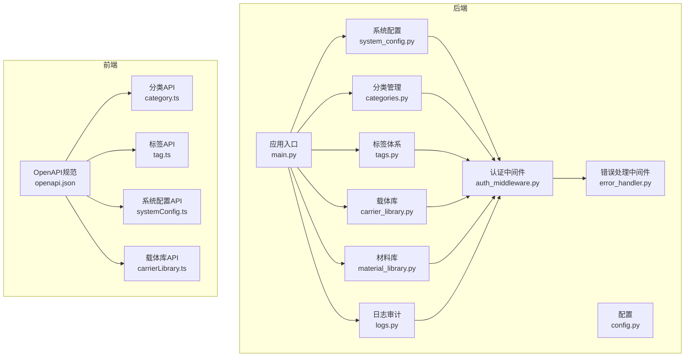
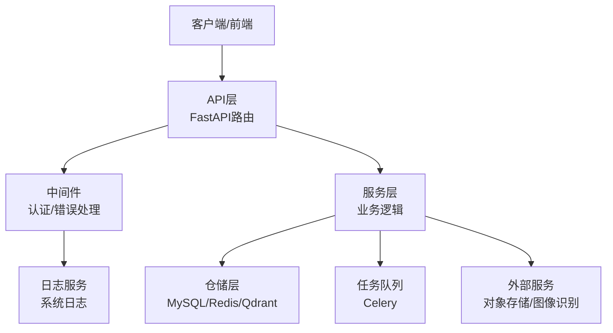
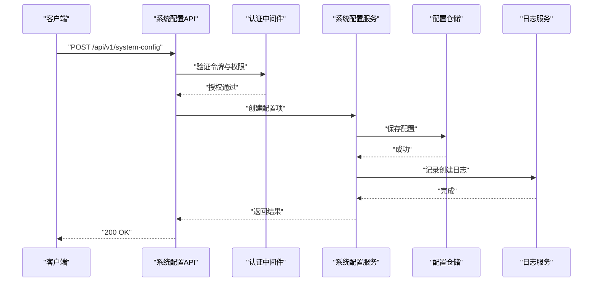
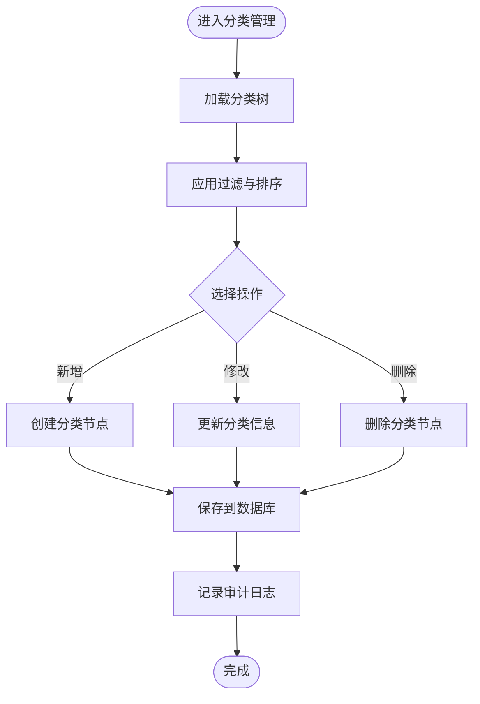
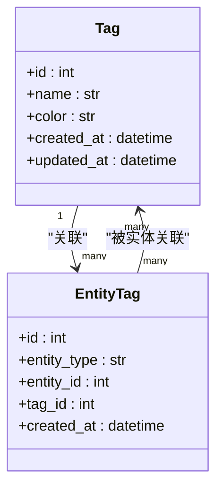
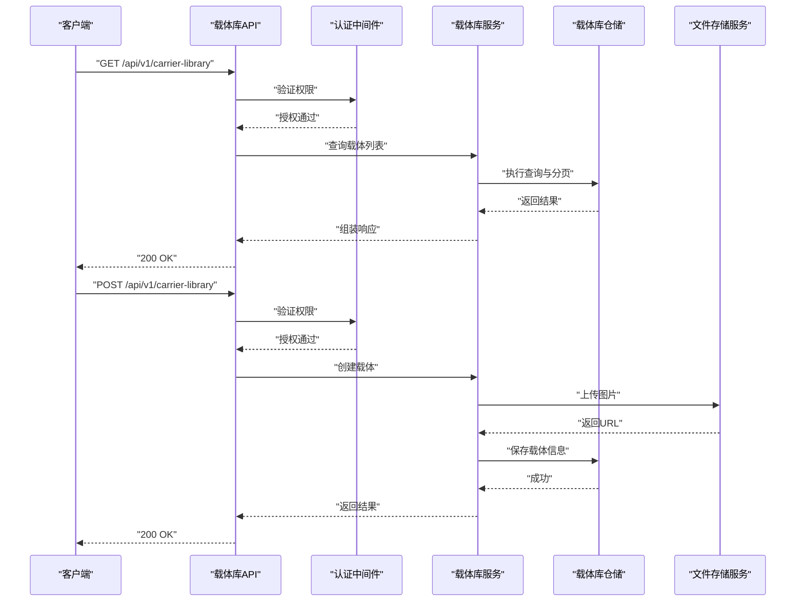
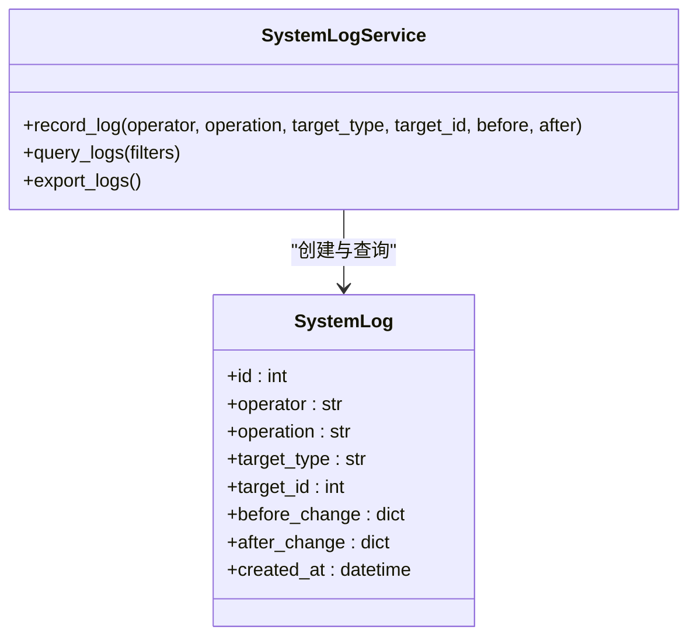
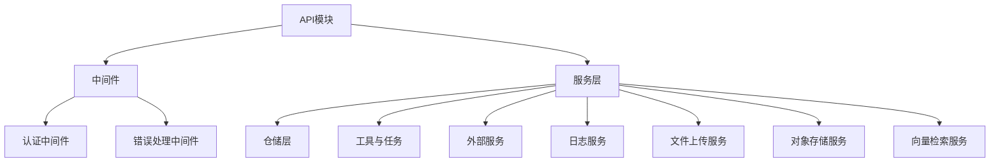

# 系统配置API

<cite>
**本文档引用的文件**
- [system_config.py](file://backend/app/api/v1/system_config.py)
- [categories.py](file://backend/app/api/v1/categories.py)
- [tags.py](file://backend/app/api/v1/tags.py)
- [carrier_library.py](file://backend/app/api/v1/carrier_library.py)
- [material_library.py](file://backend/app/api/v1/material_library.py)
- [logs.py](file://backend/app/api/v1/logs.py)
- [system_log.py](file://backend/app/models/system_log.py)
- [system_log_service.py](file://backend/app/services/system_log_service.py)
- [auth_middleware.py](file://backend/app/middleware/auth_middleware.py)
- [error_handler.py](file://backend/app/middleware/error_handler.py)
- [config.py](file://backend/app/config.py)
- [main.py](file://backend/app/main.py)
- [carrier_library.py](file://backend/app/models/carrier_library.py)
- [material_library.py](file://backend/app/models/material_library.py)
- [category.py](file://backend/app/models/category.py)
- [tag.py](file://backend/app/models/tag.py)
- [mysql_repo.py](file://backend/app/repositories/mysql_repo.py)
- [redis_repo.py](file://backend/app/repositories/redis_repo.py)
- [qdrant_repo.py](file://backend/app/repositories/qdrant_repo.py)
- [file_link.py](file://backend/app/models/file_link.py)
- [file_link_service.py](file://backend/app/services/file_link_service.py)
- [file_link_repository.py](file://backend/app/repositories/file_link_repository.py)
- [selection.py](file://backend/app/models/selection.py)
- [selection_service.py](file://backend/app/services/selection_service.py)
- [products.py](file://backend/app/api/v1/products.py)
- [product.py](file://backend/app/models/product.py)
- [product_service.py](file://backend/app/services/product_service.py)
- [download_tasks.py](file://backend/app/api/v1/download_tasks.py)
- [download_task.py](file://backend/app/models/download_task.py)
- [download_task_service.py](file://backend/app/services/download_task_service.py)
- [backup_service.py](file://backend/app/services/backup_service.py)
- [cleanup_service.py](file://backend/app/services/cleanup_service.py)
- [monitoring_service.py](file://backend/app/services/monitoring_service.py)
- [scoring_engine.py](file://backend/app/services/scoring_engine.py)
- [selection_recycle_service.py](file://backend/app/services/selection_recycle_service.py)
- [product_recycle_service.py](file://backend/app/services/product_recycle_service.py)
- [recycle_bin.py](file://backend/app/api/v1/recycle_bin.py)
- [product_sales.py](file://backend/app/api/v1/product_sales.py)
- [product_sales_service.py](file://backend/app/services/product_sales_service.py)
- [statistics.py](file://backend/app/api/v1/statistics.py)
- [health.py](file://backend/app/api/v1/health.py)
- [users.py](file://backend/app/api/v1/users.py)
- [auth.py](file://backend/app/api/v1/auth.py)
- [image_service.py](file://backend/app/services/image_service.py)
- [cos_service.py](file://backend/app/services/cos_service.py)
- [local_file_service.py](file://backend/app/services/local_file_service.py)
- [file_upload_service.py](file://backend/app/services/file_upload_service.py)
- [image_analysis_service.py](file://backend/app/services/image_analysis_service.py)
- [tencent_image_recognition_service.py](file://backend/app/services/tencent_image_recognition_service.py)
- [baidu_image_recognition_service.py](file://backend/app/services/baidu_image_recognition_service.py)
- [tencent_image_search_service.py](file://backend/app/services/tencent_image_search_service.py)
- [tencent_llm_vision_service.py](file://backend/app/services/tencent_llm_vision_service.py)
- [library_image_service.py](file://backend/app/services/library_image_service.py)
- [image_proxy.py](file://backend/app/api/v1/image_proxy.py)
- [images.py](file://backend/app/api/v1/images.py)
- [file_links.py](file://backend/app/api/v1/file_links.py)
- [import_.py](file://backend/app/api/v1/import_.py)
- [export.py](file://backend/app/api/v1/export.py)
- [reports.py](file://backend/app/api/v1/reports.py)
- [scoring.py](file://backend/app/api/v1/scoring.py)
- [selection.py](file://backend/app/api/v1/selection.py)
- [selection_recycle.py](file://backend/app/api/v1/selection_recycle.py)
- [final_drafts.py](file://backend/app/api/v1/final_drafts.py)
- [final_draft.py](file://backend/app/models/final_draft.py)
- [final_drafts_service.py](file://backend/app/services/final_drafts_service.py)
- [announcement.py](file://backend/app/api/v1/announcement.py)
- [lingxing.py](file://backend/app/api/v1/lingxing.py)
- [product_data.py](file://backend/app/api/v1/product_data.py)
- [product_data_service.py](file://backend/app/services/product_data_service.py)
- [product_sales.py](file://backend/app/api/v1/product_sales.py)
- [product_sales_service.py](file://backend/app/services/product_sales_service.py)
- [product_recycle.py](file://backend/app/api/v1/product_recycle.py)
- [selection_recycle.py](file://backend/app/api/v1/selection_recycle.py)
- [recycle_bin.py](file://backend/app/api/v1/recycle_bin.py)
- [download_tasks.py](file://backend/app/api/v1/download_tasks.py)
- [download_task.py](file://backend/app/models/download_task.py)
- [download_task_service.py](file://backend/app/services/download_task_service.py)
- [file_link.py](file://backend/app/models/file_link.py)
- [file_link_service.py](file://backend/app/services/file_link_service.py)
- [file_link_repository.py](file://backend/app/repositories/file_link_repository.py)
- [file_link_repository.py](file://backend/app/repositories/create_file_link_tables.py)
- [migrate_selection_tables.py](file://backend/app/repositories/migrate_selection_tables.py)
- [migrate_products_table.py](file://backend/app/repositories/migrate_products_table.py)
- [create_selection_tables.py](file://backend/app/repositories/create_selection_tables.py)
- [create_file_link_tables.py](file://backend/app/repositories/create_file_link_tables.py)
- [mysql_repo.py](file://backend/app/repositories/mysql_repo.py)
- [redis_repo.py](file://backend/app/repositories/redis_repo.py)
- [qdrant_repo.py](file://backend/app/repositories/qdrant_repo.py)
- [jwt_utils.py](file://backend/app/utils/jwt_utils.py)
- [performance_monitor.py](file://backend/app/utils/performance_monitor.py)
- [celery_app.py](file://backend/app/tasks/celery_app.py)
- [download_tasks.py](file://backend/app/tasks/download_tasks.py)
- [image_tasks.py](file://backend/app/tasks/image_tasks.py)
- [openapi.json](file://frontend/openapi.json)
- [carrierLibrary.ts](file://frontend/src/api/carrierLibrary.ts)
- [category.ts](file://frontend/src/api/category.ts)
- [tag.ts](file://frontend/src/api/tag.ts)
- [systemConfig.ts](file://frontend/src/api/systemConfig.ts)
</cite>

## 目录
1. [简介](#简介)
2. [项目结构](#项目结构)
3. [核心组件](#核心组件)
4. [架构概览](#架构概览)
5. [详细组件分析](#详细组件分析)
6. [依赖分析](#依赖分析)
7. [性能考虑](#性能考虑)
8. [故障排除指南](#故障排除指南)
9. [结论](#结论)
10. [附录](#附录)

## 简介
本文件为系统配置管理API的详细技术文档，涵盖系统参数配置、分类管理、标签体系、载体库维护与管理、系统设置的增删改查操作及权限控制、配置项验证规则与默认值设置、分类层级结构与标签关联关系管理接口、配置变更日志记录与审计功能，以及系统初始化与重置管理接口。文档面向开发者与运维人员，提供从架构到实现细节的全面说明，并通过图示帮助理解各组件间的交互关系。

## 项目结构
后端采用FastAPI框架，按功能模块组织API路由，核心配置管理相关模块包括：
- 系统配置：system_config.py
- 分类管理：categories.py
- 标签体系：tags.py
- 载体库：carrier_library.py
- 材料库：material_library.py
- 日志审计：logs.py 及相关模型与服务

前端通过openapi.json生成类型安全的API调用，对应模块位于frontend/src/api目录下。

**图表来源**
- [system_config.py](file://backend/app/api/v1/system_config.py)
- [categories.py](file://backend/app/api/v1/categories.py)
- [tags.py](file://backend/app/api/v1/tags.py)
- [carrier_library.py](file://backend/app/api/v1/carrier_library.py)
- [material_library.py](file://backend/app/api/v1/material_library.py)
- [logs.py](file://backend/app/api/v1/logs.py)
- [auth_middleware.py](file://backend/app/middleware/auth_middleware.py)
- [error_handler.py](file://backend/app/middleware/error_handler.py)
- [config.py](file://backend/app/config.py)
- [main.py](file://backend/app/main.py)
- [openapi.json](file://frontend/openapi.json)
- [category.ts](file://frontend/src/api/category.ts)
- [tag.ts](file://frontend/src/api/tag.ts)
- [systemConfig.ts](file://frontend/src/api/systemConfig.ts)
- [carrierLibrary.ts](file://frontend/src/api/carrierLibrary.ts)

**章节来源**
- [system_config.py](file://backend/app/api/v1/system_config.py)
- [categories.py](file://backend/app/api/v1/categories.py)
- [tags.py](file://backend/app/api/v1/tags.py)
- [carrier_library.py](file://backend/app/api/v1/carrier_library.py)
- [material_library.py](file://backend/app/api/v1/material_library.py)
- [logs.py](file://backend/app/api/v1/logs.py)
- [auth_middleware.py](file://backend/app/middleware/auth_middleware.py)
- [error_handler.py](file://backend/app/middleware/error_handler.py)
- [config.py](file://backend/app/config.py)
- [main.py](file://backend/app/main.py)
- [openapi.json](file://frontend/openapi.json)
- [category.ts](file://frontend/src/api/category.ts)
- [tag.ts](file://frontend/src/api/tag.ts)
- [systemConfig.ts](file://frontend/src/api/systemConfig.ts)
- [carrierLibrary.ts](file://frontend/src/api/carrierLibrary.ts)

## 核心组件
本节概述系统配置管理API的核心模块及其职责：
- 系统配置模块：提供系统参数的增删改查、验证规则与默认值管理、权限控制与审计日志。
- 分类管理模块：维护分类层级结构，支持查询、新增、修改、删除与排序。
- 标签体系模块：管理标签与实体的关联关系，支持批量操作与过滤。
- 载体库模块：维护载体信息，支持搜索、筛选、分页、批量操作与状态管理。
- 材料库模块：与载体库协同，提供材料维度的数据管理。
- 日志审计模块：记录配置变更、用户操作与系统事件，支持查询与导出。

**章节来源**
- [system_config.py](file://backend/app/api/v1/system_config.py)
- [categories.py](file://backend/app/api/v1/categories.py)
- [tags.py](file://backend/app/api/v1/tags.py)
- [carrier_library.py](file://backend/app/api/v1/carrier_library.py)
- [material_library.py](file://backend/app/api/v1/material_library.py)
- [logs.py](file://backend/app/api/v1/logs.py)

## 架构概览
系统采用分层架构，API层负责请求处理与响应封装，服务层承载业务逻辑，仓储层负责数据持久化，中间件提供认证与错误处理，任务队列用于异步处理。

**图表来源**
- [main.py](file://backend/app/main.py)
- [auth_middleware.py](file://backend/app/middleware/auth_middleware.py)
- [error_handler.py](file://backend/app/middleware/error_handler.py)
- [mysql_repo.py](file://backend/app/repositories/mysql_repo.py)
- [redis_repo.py](file://backend/app/repositories/redis_repo.py)
- [qdrant_repo.py](file://backend/app/repositories/qdrant_repo.py)
- [celery_app.py](file://backend/app/tasks/celery_app.py)
- [system_log_service.py](file://backend/app/services/system_log_service.py)

## 详细组件分析

### 系统配置管理模块
系统配置模块提供对系统参数的集中管理，支持以下能力：
- 参数增删改查：提供标准REST接口进行配置项的创建、读取、更新与删除。
- 验证规则：对输入参数进行类型、范围与格式校验，确保配置数据的完整性。
- 默认值设置：为未显式配置的参数提供合理的默认值，保证系统在缺省情况下的可用性。
- 权限控制：基于角色的访问控制（RBAC），限制敏感配置的修改权限。
- 审计日志：记录配置变更历史，包括变更人、时间、参数名与变更前后值。

**图表来源**
- [system_config.py](file://backend/app/api/v1/system_config.py)
- [auth_middleware.py](file://backend/app/middleware/auth_middleware.py)
- [system_log_service.py](file://backend/app/services/system_log_service.py)

**章节来源**
- [system_config.py](file://backend/app/api/v1/system_config.py)
- [auth_middleware.py](file://backend/app/middleware/auth_middleware.py)
- [system_log_service.py](file://backend/app/services/system_log_service.py)

### 分类管理模块
分类管理模块负责维护分类层级结构，支持：
- 层级查询：支持树形结构的查询与展示，便于前端渲染。
- 新增/修改/删除：提供分类的创建、更新与逻辑删除，保持层级关系的完整性。
- 排序与过滤：支持按名称、创建时间等条件进行排序与过滤。
- 关联管理：与产品、载体等实体建立关联，影响搜索与筛选结果。

**图表来源**
- [categories.py](file://backend/app/api/v1/categories.py)
- [category.py](file://backend/app/models/category.py)
- [system_log_service.py](file://backend/app/services/system_log_service.py)

**章节来源**
- [categories.py](file://backend/app/api/v1/categories.py)
- [category.py](file://backend/app/models/category.py)
- [system_log_service.py](file://backend/app/services/system_log_service.py)

### 标签体系模块
标签体系模块提供标签的统一管理与实体关联：
- 标签增删改查：支持标签的全量生命周期管理。
- 批量操作：支持批量关联/取消关联标签与实体，提升批量处理效率。
- 过滤与搜索：支持按标签名、关联实体数等条件进行过滤与搜索。
- 关联关系：维护标签与产品、载体等实体的多对多关系，支持快速检索。

**图表来源**
- [tags.py](file://backend/app/api/v1/tags.py)
- [tag.py](file://backend/app/models/tag.py)

**章节来源**
- [tags.py](file://backend/app/api/v1/tags.py)
- [tag.py](file://backend/app/models/tag.py)

### 载体库维护与管理
载体库模块提供载体的全生命周期管理：
- 基础信息：SKU、批次、开发者、载体名称、状态等。
- 图像管理：支持主图与参考图的上传与关联。
- 状态管理：支持最终确定、优化中、概念等状态流转。
- 批量操作：支持按ID或SKU进行批量删除、状态更新等操作。
- 搜索与筛选：支持按开发者、状态、载体、批次等条件进行组合查询。
- 与材料库协同：材料维度的数据与载体信息联动，支撑后续的材料分析与推荐。

**图表来源**
- [carrier_library.py](file://backend/app/api/v1/carrier_library.py)
- [carrier_library.py](file://backend/app/models/carrier_library.py)
- [auth_middleware.py](file://backend/app/middleware/auth_middleware.py)
- [file_upload_service.py](file://backend/app/services/file_upload_service.py)
- [cos_service.py](file://backend/app/services/cos_service.py)

**章节来源**
- [carrier_library.py](file://backend/app/api/v1/carrier_library.py)
- [carrier_library.py](file://backend/app/models/carrier_library.py)
- [auth_middleware.py](file://backend/app/middleware/auth_middleware.py)
- [file_upload_service.py](file://backend/app/services/file_upload_service.py)
- [cos_service.py](file://backend/app/services/cos_service.py)

### 材料库协同管理
材料库模块与载体库协同工作，提供材料维度的数据管理：
- 材料属性：与载体关联的材料特性、供应商、成本等信息。
- 数据同步：与载体库的状态与图片信息保持同步。
- 检索优化：通过Qdrant向量库加速材料相似度检索与推荐。

**章节来源**
- [material_library.py](file://backend/app/api/v1/material_library.py)
- [material_library.py](file://backend/app/models/material_library.py)
- [qdrant_repo.py](file://backend/app/repositories/qdrant_repo.py)

### 日志记录与审计
日志审计模块提供配置变更与系统事件的完整记录：
- 记录内容：操作人、时间、操作类型、目标对象、变更前/后值等。
- 查询接口：支持按时间范围、操作类型、用户等条件进行过滤查询。
- 导出功能：支持将审计日志导出为报表，便于合规审查。

**图表来源**
- [logs.py](file://backend/app/api/v1/logs.py)
- [system_log.py](file://backend/app/models/system_log.py)
- [system_log_service.py](file://backend/app/services/system_log_service.py)

**章节来源**
- [logs.py](file://backend/app/api/v1/logs.py)
- [system_log.py](file://backend/app/models/system_log.py)
- [system_log_service.py](file://backend/app/services/system_log_service.py)

### 权限控制与中间件
系统通过认证中间件与错误处理中间件保障API的安全性与稳定性：
- 认证中间件：验证JWT令牌，解析用户角色与权限，拒绝无权访问。
- 错误处理中间件：捕获异常并返回标准化错误响应，避免敏感信息泄露。
- 配合RBAC：根据用户角色限制对敏感配置的访问与修改。

**章节来源**
- [auth_middleware.py](file://backend/app/middleware/auth_middleware.py)
- [error_handler.py](file://backend/app/middleware/error_handler.py)

### 配置验证规则与默认值
系统配置模块内置严格的验证规则与默认值策略：
- 输入验证：对必填字段、数据类型、长度范围、枚举值进行校验。
- 默认值：为未提供的配置项设置合理默认值，确保系统稳定运行。
- 变更审计：所有配置变更均记录在案，便于追溯与回滚。

**章节来源**
- [system_config.py](file://backend/app/api/v1/system_config.py)

### 系统初始化与重置
系统提供初始化与重置接口，用于：
- 初始化：在首次部署时创建必要的基础配置、分类与标签。
- 重置：在测试或故障恢复场景下，重置系统至初始状态，清理配置与部分数据。

**章节来源**
- [system_config.py](file://backend/app/api/v1/system_config.py)

## 依赖分析
系统配置管理API的依赖关系如下：

**图表来源**
- [system_config.py](file://backend/app/api/v1/system_config.py)
- [auth_middleware.py](file://backend/app/middleware/auth_middleware.py)
- [error_handler.py](file://backend/app/middleware/error_handler.py)
- [system_log_service.py](file://backend/app/services/system_log_service.py)
- [file_upload_service.py](file://backend/app/services/file_upload_service.py)
- [cos_service.py](file://backend/app/services/cos_service.py)
- [qdrant_repo.py](file://backend/app/repositories/qdrant_repo.py)

**章节来源**
- [system_config.py](file://backend/app/api/v1/system_config.py)
- [auth_middleware.py](file://backend/app/middleware/auth_middleware.py)
- [error_handler.py](file://backend/app/middleware/error_handler.py)
- [system_log_service.py](file://backend/app/services/system_log_service.py)
- [file_upload_service.py](file://backend/app/services/file_upload_service.py)
- [cos_service.py](file://backend/app/services/cos_service.py)
- [qdrant_repo.py](file://backend/app/repositories/qdrant_repo.py)

## 性能考虑
- 缓存策略：使用Redis缓存热点配置与分类标签，减少数据库压力。
- 分页与索引：对载体库与日志查询使用分页与合适索引，避免全表扫描。
- 异步处理：文件上传与日志记录采用Celery异步执行，提升响应速度。
- 向量化检索：材料库与载体库的相似度检索通过Qdrant加速，降低计算开销。

## 故障排除指南
- 认证失败：检查JWT令牌是否过期或签名无效，确认用户角色是否具备相应权限。
- 参数校验错误：根据API返回的验证错误信息修正请求参数，确保字段类型与范围符合要求。
- 文件上传失败：检查对象存储配置与网络连通性，确认文件大小与格式限制。
- 查询性能问题：为常用查询字段添加索引，优化分页参数，避免一次性返回过多数据。
- 审计日志缺失：确认日志服务正常运行，检查日志表结构与权限配置。

**章节来源**
- [auth_middleware.py](file://backend/app/middleware/auth_middleware.py)
- [error_handler.py](file://backend/app/middleware/error_handler.py)
- [file_upload_service.py](file://backend/app/services/file_upload_service.py)
- [cos_service.py](file://backend/app/services/cos_service.py)
- [system_log_service.py](file://backend/app/services/system_log_service.py)

## 结论
系统配置管理API通过清晰的模块划分与完善的中间件、仓储与服务层设计，实现了对系统参数、分类、标签与载体库的全生命周期管理。配合严格的验证规则、默认值策略与审计日志，系统在保证安全性的同时提供了良好的可维护性与扩展性。建议在生产环境中启用缓存、索引与异步处理机制，以进一步提升性能与用户体验。

## 附录
- 前端API调用示例可通过openapi.json生成的类型定义进行对接，确保请求参数与响应结构的一致性。
- 建议定期备份配置与日志数据，制定灾难恢复预案，确保系统在异常情况下能够快速恢复。

**章节来源**
- [openapi.json](file://frontend/openapi.json)
- [carrierLibrary.ts](file://frontend/src/api/carrierLibrary.ts)
- [category.ts](file://frontend/src/api/category.ts)
- [tag.ts](file://frontend/src/api/tag.ts)
- [systemConfig.ts](file://frontend/src/api/systemConfig.ts)