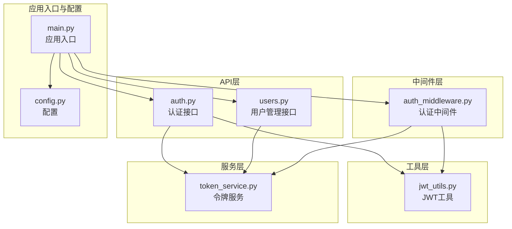
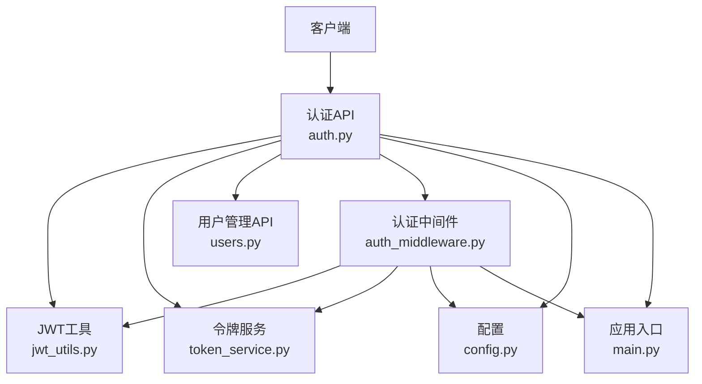
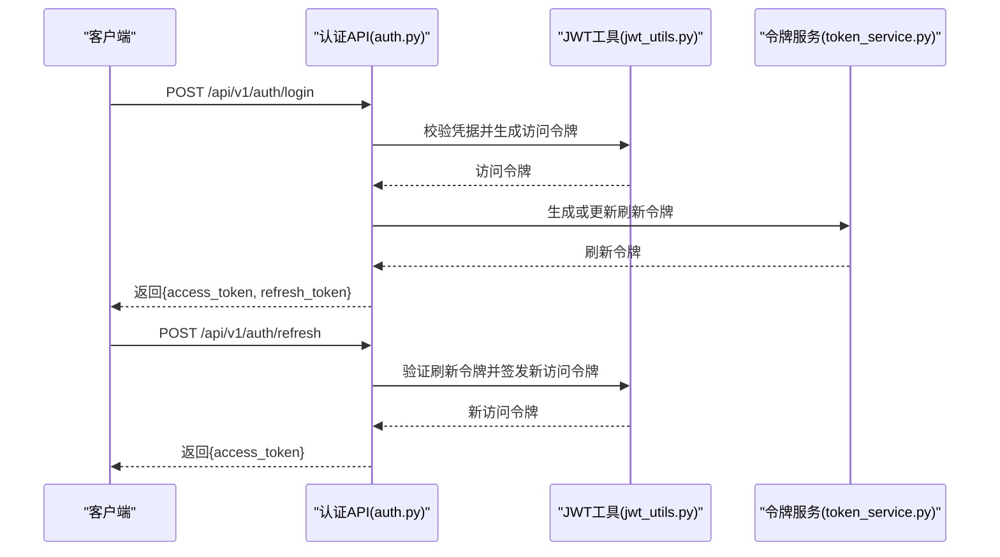
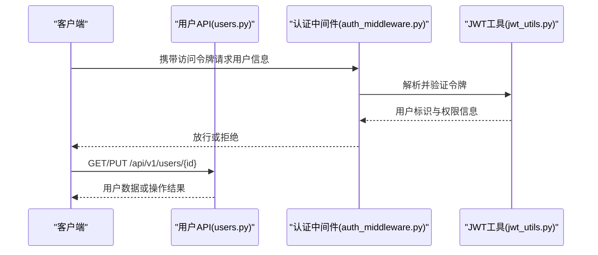
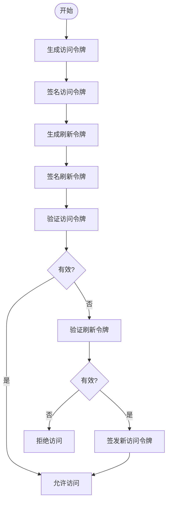
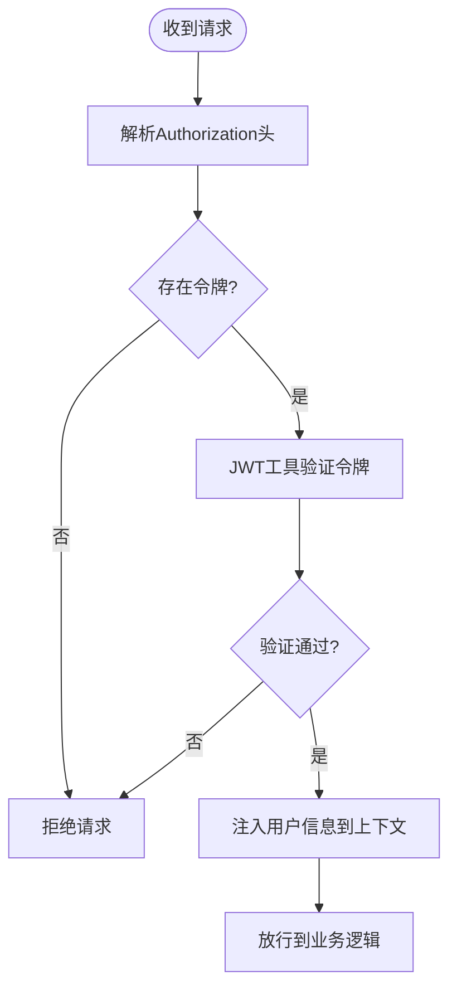
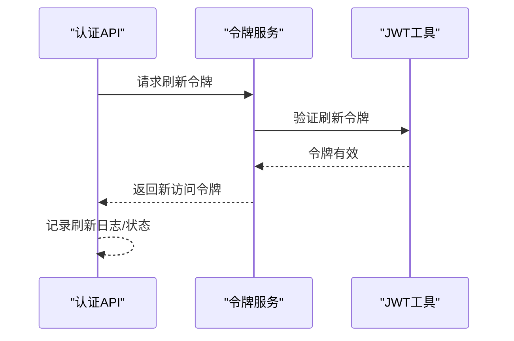
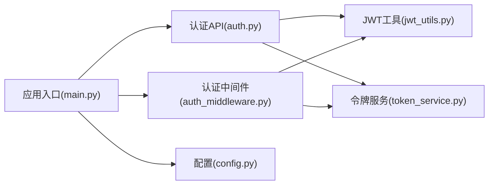

# 认证授权API

<cite>
**本文引用的文件**
- [auth.py](file://backend/app/api/v1/auth.py)
- [users.py](file://backend/app/api/v1/users.py)
- [jwt_utils.py](file://backend/app/utils/jwt_utils.py)
- [auth_middleware.py](file://backend/app/middleware/auth_middleware.py)
- [token_service.py](file://backend/app/services/token_service.py)
- [main.py](file://backend/app/main.py)
- [config.py](file://backend/app/config.py)
- [RBAC设计.md](file://docs/项目逻辑/RBAC设计.md)
- [生产环境登录失败-数据库密码hash不一致.md](file://docs/问题记录/生产环境登录失败-数据库密码hash不一致.md)
</cite>

## 目录
1. [简介](#简介)
2. [项目结构](#项目结构)
3. [核心组件](#核心组件)
4. [架构概览](#架构概览)
5. [详细组件分析](#详细组件分析)
6. [依赖关系分析](#依赖关系分析)
7. [性能考虑](#性能考虑)
8. [故障排除指南](#故障排除指南)
9. [结论](#结论)
10. [附录](#附录)

## 简介
本文件为思觉智贸系统的认证授权API提供全面的技术文档，覆盖用户登录、注册、令牌刷新与权限验证的完整流程。文档详细说明JWT令牌的生成、验证与刷新机制，阐述认证中间件的使用方法与权限控制策略，并给出具体API调用示例（含成功与失败响应格式）、不同角色的权限级别与访问控制规则、安全最佳实践以及常见认证问题的解决方案。

## 项目结构
后端采用Python FastAPI框架构建，认证相关的核心文件分布如下：
- API层：用户认证与用户管理接口
- 工具层：JWT工具函数
- 中间件层：认证中间件
- 服务层：令牌服务
- 应用入口与配置：应用主程序与配置

**图表来源**
- [auth.py](file://backend/app/api/v1/auth.py)
- [users.py](file://backend/app/api/v1/users.py)
- [jwt_utils.py](file://backend/app/utils/jwt_utils.py)
- [auth_middleware.py](file://backend/app/middleware/auth_middleware.py)
- [token_service.py](file://backend/app/services/token_service.py)
- [main.py](file://backend/app/main.py)
- [config.py](file://backend/app/config.py)

**章节来源**
- [auth.py](file://backend/app/api/v1/auth.py)
- [users.py](file://backend/app/api/v1/users.py)
- [jwt_utils.py](file://backend/app/utils/jwt_utils.py)
- [auth_middleware.py](file://backend/app/middleware/auth_middleware.py)
- [token_service.py](file://backend/app/services/token_service.py)
- [main.py](file://backend/app/main.py)
- [config.py](file://backend/app/config.py)

## 核心组件
- 认证接口（登录、注册、刷新）
- 用户管理接口（查询、更新等）
- JWT工具（生成、解析、校验）
- 认证中间件（统一鉴权拦截）
- 令牌服务（刷新令牌、黑名单处理）

这些组件协同实现完整的认证授权闭环，确保系统安全性与可用性。

**章节来源**
- [auth.py](file://backend/app/api/v1/auth.py)
- [users.py](file://backend/app/api/v1/users.py)
- [jwt_utils.py](file://backend/app/utils/jwt_utils.py)
- [auth_middleware.py](file://backend/app/middleware/auth_middleware.py)
- [token_service.py](file://backend/app/services/token_service.py)

## 架构概览
认证授权的整体架构围绕JWT令牌展开，通过API接口完成用户身份确认，中间件对请求进行统一鉴权，服务层负责令牌生命周期管理。

**图表来源**
- [auth.py](file://backend/app/api/v1/auth.py)
- [users.py](file://backend/app/api/v1/users.py)
- [jwt_utils.py](file://backend/app/utils/jwt_utils.py)
- [auth_middleware.py](file://backend/app/middleware/auth_middleware.py)
- [token_service.py](file://backend/app/services/token_service.py)
- [main.py](file://backend/app/main.py)
- [config.py](file://backend/app/config.py)

## 详细组件分析

### 认证接口（登录、注册、刷新）
- 登录：接收用户名/邮箱与密码，验证通过后签发JWT访问令牌与刷新令牌
- 注册：创建新用户并返回基础信息（不包含敏感字段）
- 刷新：使用刷新令牌换取新的访问令牌

**图表来源**
- [auth.py](file://backend/app/api/v1/auth.py)
- [jwt_utils.py](file://backend/app/utils/jwt_utils.py)
- [token_service.py](file://backend/app/services/token_service.py)

**章节来源**
- [auth.py](file://backend/app/api/v1/auth.py)

### 用户管理接口
- 用户信息查询与更新
- 权限控制基于认证中间件与角色权限模型

**图表来源**
- [users.py](file://backend/app/api/v1/users.py)
- [auth_middleware.py](file://backend/app/middleware/auth_middleware.py)
- [jwt_utils.py](file://backend/app/utils/jwt_utils.py)

**章节来源**
- [users.py](file://backend/app/api/v1/users.py)

### JWT工具（生成、解析、校验）
- 生成访问令牌：包含用户标识、角色、过期时间等声明
- 生成刷新令牌：用于换取新的访问令牌
- 校验访问令牌：验证签名与有效期
- 校验刷新令牌：验证有效性并执行刷新流程

**图表来源**
- [jwt_utils.py](file://backend/app/utils/jwt_utils.py)

**章节来源**
- [jwt_utils.py](file://backend/app/utils/jwt_utils.py)

### 认证中间件（统一鉴权拦截）
- 在请求进入业务逻辑前，解析Authorization头
- 使用JWT工具验证令牌有效性
- 将用户标识注入到请求上下文
- 对需要权限的路由进行角色校验

**图表来源**
- [auth_middleware.py](file://backend/app/middleware/auth_middleware.py)
- [jwt_utils.py](file://backend/app/utils/jwt_utils.py)

**章节来源**
- [auth_middleware.py](file://backend/app/middleware/auth_middleware.py)

### 令牌服务（刷新令牌、黑名单处理）
- 生成刷新令牌并持久化
- 刷新令牌到期或被撤销时，阻止签发新访问令牌
- 可扩展支持令牌黑名单（如登出场景）

**图表来源**
- [token_service.py](file://backend/app/services/token_service.py)
- [jwt_utils.py](file://backend/app/utils/jwt_utils.py)

**章节来源**
- [token_service.py](file://backend/app/services/token_service.py)

## 依赖关系分析
认证授权模块内部依赖清晰，职责边界明确：
- API层依赖JWT工具与令牌服务
- 中间件依赖JWT工具与令牌服务
- 应用入口统一注册中间件与API路由
- 配置提供密钥与过期时间等参数

**图表来源**
- [auth.py](file://backend/app/api/v1/auth.py)
- [jwt_utils.py](file://backend/app/utils/jwt_utils.py)
- [auth_middleware.py](file://backend/app/middleware/auth_middleware.py)
- [token_service.py](file://backend/app/services/token_service.py)
- [main.py](file://backend/app/main.py)
- [config.py](file://backend/app/config.py)

**章节来源**
- [auth.py](file://backend/app/api/v1/auth.py)
- [auth_middleware.py](file://backend/app/middleware/auth_middleware.py)
- [main.py](file://backend/app/main.py)
- [config.py](file://backend/app/config.py)

## 性能考虑
- 令牌过期时间应平衡安全性与用户体验，建议短期访问令牌+长期刷新令牌的组合
- JWT解析与签名操作在高并发下需注意CPU开销，可结合缓存与异步处理
- 中间件应尽量减少重复解析与验证，避免阻塞请求链路
- 刷新令牌存储建议使用高性能缓存（如Redis），并设置合理TTL

## 故障排除指南
- 登录失败（数据库密码hash不一致）：检查用户密码哈希算法与存储一致性，确保前后端一致
- 令牌无效或过期：确认JWT过期时间配置与客户端刷新策略
- 中间件拦截异常：检查Authorization头格式与令牌签名验证流程
- 刷新令牌失效：确认令牌服务中刷新令牌的状态与黑名单策略

**章节来源**
- [生产环境登录失败-数据库密码hash不一致.md](file://docs/问题记录/生产环境登录失败-数据库密码hash不一致.md)

## 结论
本认证授权体系以JWT为核心，配合中间件与令牌服务，实现了从登录、注册到权限验证与令牌刷新的完整闭环。通过明确的角色权限模型与中间件拦截机制，系统在保证安全性的同时具备良好的可维护性与扩展性。

## 附录

### 角色权限与访问控制规则
- 角色定义与权限映射参见RBAC设计文档
- 不同角色对资源的访问范围与操作权限由中间件与路由装饰器共同约束

**章节来源**
- [RBAC设计.md](file://docs/项目逻辑/RBAC设计.md)

### API调用示例（格式说明）
- 登录成功响应：包含access_token与refresh_token
- 登录失败响应：包含错误码与错误信息
- 刷新成功响应：包含新的access_token
- 刷新失败响应：包含错误码与错误信息
- 无权限访问响应：包含错误码与错误信息

注：具体字段与状态码请参考各API实现文件的响应定义。

**章节来源**
- [auth.py](file://backend/app/api/v1/auth.py)
- [users.py](file://backend/app/api/v1/users.py)