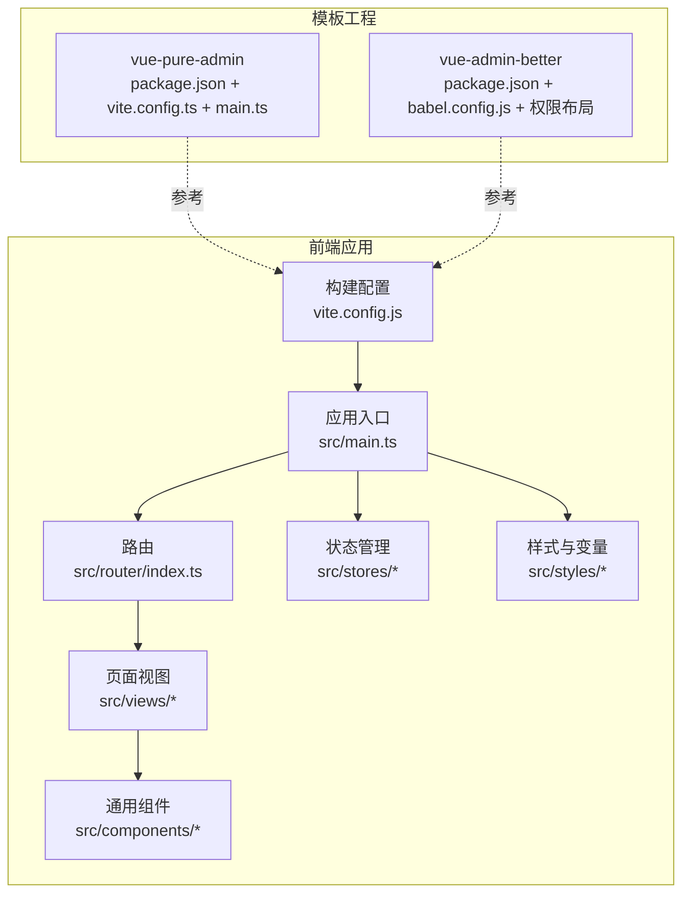
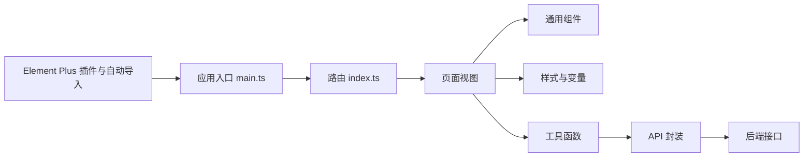
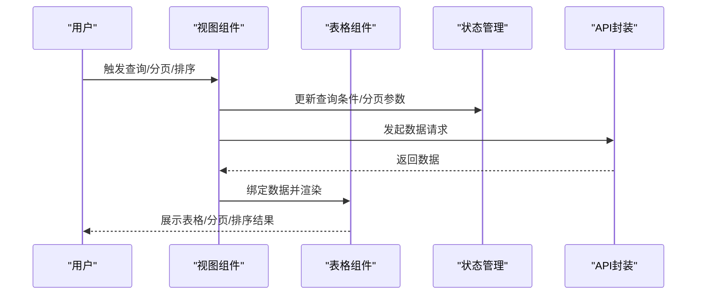
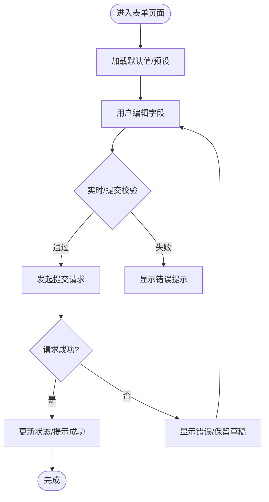
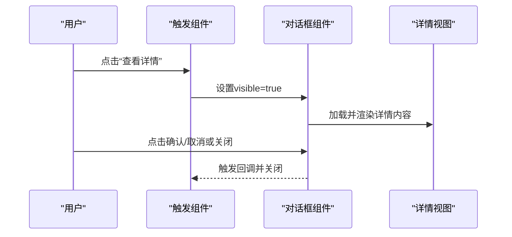
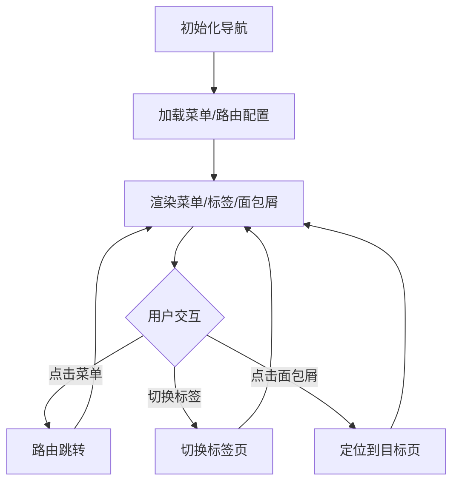
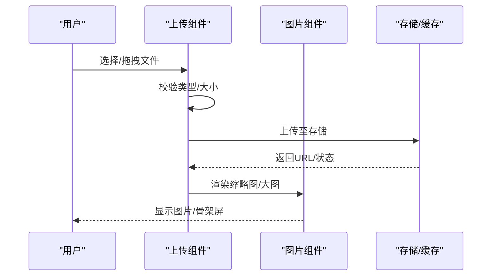
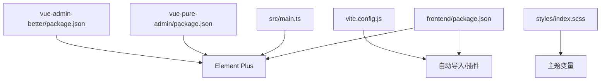

# UI组件库集成

<cite>
**本文引用的文件**
- [frontend/package.json](file://frontend/package.json)
- [frontend/vite.config.js](file://frontend/vite.config.js)
- [frontend/src/main.ts](file://frontend/src/main.ts)
- [frontend/src/types/element-plus.ts](file://frontend/src/types/element-plus.ts)
- [frontend/src/styles/index.scss](file://frontend/src/styles/index.scss)
- [frontend/src/styles/variables.scss](file://frontend/src/styles/variables.scss)
- [frontend/src/components/ProductDetailDialog/index.vue](file://frontend/src/components/ProductDetailDialog/index.vue)
- [frontend/src/views/ProductManagement/index.vue](file://frontend/src/views/ProductManagement/index.vue)
- [frontend/src/views/ProductDataDashboard/index.vue](file://frontend/src/views/ProductDataDashboard/index.vue)
- [frontend/src/views/SelectionDetail/index.vue](file://frontend/src/views/SelectionDetail/index.vue)
- [frontend/src/views/CarrierLibrary/index.vue](file://frontend/src/views/CarrierLibrary/index.vue)
- [frontend/src/views/MaterialLibrary/index.vue](file://frontend/src/views/MaterialLibrary/index.vue)
- [frontend/src/views/FileLinkManagement/index.vue](file://frontend/src/views/FileLinkManagement/index.vue)
- [frontend/src/views/DownloadManager/index.vue](file://frontend/src/views/DownloadManager/index.vue)
- [frontend/src/views/ReportViewer/index.vue](file://frontend/src/views/ReportViewer/index.vue)
- [frontend/src/views/Statistics/index.vue](file://frontend/src/views/Statistics/index.vue)
- [frontend/src/views/UserManagement/index.vue](file://frontend/src/views/UserManagement/index.vue)
- [frontend/src/views/Settings/index.vue](file://frontend/src/views/Settings/index.vue)
- [frontend/src/layouts/Layout/index.vue](file://frontend/src/layouts/Layout/index.vue)
- [frontend/src/components/SelectionQueryForm/index.vue](file://frontend/src/components/SelectionQueryForm/index.vue)
- [frontend/src/components/SelectionQueryForm/examples/AllSelectionExample.vue](file://frontend/src/components/SelectionQueryForm/examples/AllSelectionExample.vue)
- [frontend/src/components/UniversalList/index.vue](file://frontend/src/components/UniversalList/index.vue)
- [frontend/src/components/UniversalCard/index.vue](file://frontend/src/components/UniversalCard/index.vue)
- [frontend/src/components/VirtualList/index.vue](file://frontend/src/components/VirtualList/index.vue)
- [frontend/src/components/LazyImage/index.vue](file://frontend/src/components/LazyImage/index.vue)
- [frontend/src/components/ImageUpload/index.vue](file://frontend/src/components/ImageUpload/index.vue)
- [frontend/src/components/ThumbnailViewer/index.vue](file://frontend/src/components/ThumbnailViewer/index.vue)
- [frontend/src/components/FilterConfigPanel/index.vue](file://frontend/src/components/FilterConfigPanel/index.vue)
- [frontend/src/components/FilterPresetSelector/index.vue](file://frontend/src/components/FilterPresetSelector/index.vue)
- [frontend/src/components/RecycleBinPage/index.vue](file://frontend/src/components/RecycleBinPage/index.vue)
- [frontend/src/router/index.ts](file://frontend/src/router/index.ts)
- [frontend/src/stores/app.ts](file://frontend/src/stores/app.ts)
- [frontend/src/stores/settings.ts](file://frontend/src/stores/settings.ts)
- [frontend/src/utils/request.ts](file://frontend/src/utils/request.ts)
- [frontend/src/utils/debounce.ts](file://frontend/src/utils/debounce.ts)
- [frontend/src/utils/emitter.ts](file://frontend/src/utils/emitter.ts)
- [frontend/src/utils/imageUrlUtil.ts](file://frontend/src/utils/imageUrlUtil.ts)
- [frontend/src/utils/cacheManager.ts](file://frontend/src/utils/cacheManager.ts)
- [frontend/src/utils/storage.ts](file://frontend/src/utils/storage.ts)
- [frontend/src/utils/environment.js](file://frontend/src/utils/environment.js)
- [frontend/vue-pure-admin/package.json](file://frontend/vue-pure-admin/package.json)
- [frontend/vue-pure-admin/vite.config.ts](file://frontend/vue-pure-admin/vite.config.ts)
- [frontend/vue-pure-admin/src/main.ts](file://frontend/vue-pure-admin/src/main.ts)
- [frontend/vue-admin-better/package.json](file://frontend/vue-admin-better/package.json)
- [frontend/vue-admin-better/babel.config.js](file://frontend/vue-admin-better/babel.config.js)
- [frontend/vue-admin-better/layouts/Permissions/index.js](file://frontend/vue-admin-better/layouts/Permissions/index.js)
- [frontend/vue-admin-better/layouts/Permissions/permissions.js](file://frontend/vue-admin-better/layouts/Permissions/permissions.js)
</cite>

## 目录
1. [简介](#简介)
2. [项目结构](#项目结构)
3. [核心组件](#核心组件)
4. [架构总览](#架构总览)
5. [详细组件分析](#详细组件分析)
6. [依赖分析](#依赖分析)
7. [性能考虑](#性能考虑)
8. [故障排查指南](#故障排查指南)
9. [结论](#结论)
10. [附录](#附录)

## 简介
本指南面向Element Plus UI组件库在本项目的集成与使用，涵盖安装配置、主题定制、按需引入策略、常用组件（表格、表单、对话框、导航）的使用方法与最佳实践，并结合产品管理、数据展示与表单输入等典型场景，给出属性配置、事件处理、插槽使用、性能优化、无障碍访问与浏览器兼容性建议。同时提供自定义主题配置、样式覆盖与响应式设计的实操路径。

## 项目结构
前端采用Vite + Vue 3 + TypeScript技术栈，Element Plus作为主要UI组件库。项目包含多套Admin模板工程（vue-pure-admin、vue-admin-better），以及业务视图与通用组件目录。主题与样式通过SCSS变量统一管理；路由与状态管理分别位于router与stores目录；工具函数与API封装在utils与api目录中。

**图表来源**
- [frontend/vite.config.js](file://frontend/vite.config.js)
- [frontend/src/main.ts](file://frontend/src/main.ts)
- [frontend/src/router/index.ts](file://frontend/src/router/index.ts)
- [frontend/src/stores/app.ts](file://frontend/src/stores/app.ts)
- [frontend/src/styles/index.scss](file://frontend/src/styles/index.scss)
- [frontend/vue-pure-admin/vite.config.ts](file://frontend/vue-pure-admin/vite.config.ts)
- [frontend/vue-admin-better/babel.config.js](file://frontend/vue-admin-better/babel.config.js)

**章节来源**
- [frontend/package.json](file://frontend/package.json)
- [frontend/vite.config.js](file://frontend/vite.config.js)
- [frontend/src/main.ts](file://frontend/src/main.ts)
- [frontend/src/router/index.ts](file://frontend/src/router/index.ts)
- [frontend/src/stores/app.ts](file://frontend/src/stores/app.ts)
- [frontend/src/styles/index.scss](file://frontend/src/styles/index.scss)
- [frontend/vue-pure-admin/package.json](file://frontend/vue-pure-admin/package.json)
- [frontend/vue-pure-admin/vite.config.ts](file://frontend/vue-pure-admin/vite.config.ts)
- [frontend/vue-admin-better/package.json](file://frontend/vue-admin-better/package.json)
- [frontend/vue-admin-better/babel.config.js](file://frontend/vue-admin-better/babel.config.js)

## 核心组件
- Element Plus：提供表格、表单、对话框、导航、分页、上传、树形控件等丰富组件。
- 按需引入：通过自动导入与插件配置减少打包体积，提升加载性能。
- 主题定制：基于SCSS变量与CSS自定义属性，实现品牌色、尺寸、圆角等统一风格。
- 响应式布局：结合栅格与断点，适配桌面与移动端。
- 无障碍与兼容：遵循ARIA规范，兼容主流浏览器。

**章节来源**
- [frontend/src/types/element-plus.ts](file://frontend/src/types/element-plus.ts)
- [frontend/src/styles/variables.scss](file://frontend/src/styles/variables.scss)
- [frontend/src/styles/index.scss](file://frontend/src/styles/index.scss)

## 架构总览
下图展示了Element Plus在应用中的集成位置与交互关系：入口文件注册插件与自动导入；路由驱动视图；视图中使用Element Plus组件；样式系统提供主题与变量；工具函数负责请求与缓存。

**图表来源**
- [frontend/src/main.ts](file://frontend/src/main.ts)
- [frontend/src/router/index.ts](file://frontend/src/router/index.ts)
- [frontend/src/views/ProductManagement/index.vue](file://frontend/src/views/ProductManagement/index.vue)
- [frontend/src/utils/request.ts](file://frontend/src/utils/request.ts)

## 详细组件分析

### 表格组件（ElTable）
- 使用场景：产品列表、数据仪表盘、下载任务、报表查看、统计分析。
- 关键属性：数据源绑定、列定义、分页参数、加载状态、选择模式。
- 事件处理：行点击、排序、筛选、分页变更。
- 插槽使用：列内容自定义、表尾汇总、空状态提示。
- 性能优化：虚拟滚动、懒加载、分页查询、防抖搜索。
- 无障碍：行高亮、键盘导航、屏幕阅读器友好标签。
- 兼容性：IE/Edge/Firefox/Chrome均支持，注意旧版浏览器对某些CSS特性的降级。

**图表来源**
- [frontend/src/views/ProductDataDashboard/index.vue](file://frontend/src/views/ProductDataDashboard/index.vue)
- [frontend/src/views/ReportViewer/index.vue](file://frontend/src/views/ReportViewer/index.vue)
- [frontend/src/views/Statistics/index.vue](file://frontend/src/views/Statistics/index.vue)
- [frontend/src/utils/request.ts](file://frontend/src/utils/request.ts)
- [frontend/src/stores/app.ts](file://frontend/src/stores/app.ts)

**章节来源**
- [frontend/src/views/ProductDataDashboard/index.vue](file://frontend/src/views/ProductDataDashboard/index.vue)
- [frontend/src/views/ReportViewer/index.vue](file://frontend/src/views/ReportViewer/index.vue)
- [frontend/src/views/Statistics/index.vue](file://frontend/src/views/Statistics/index.vue)
- [frontend/src/utils/request.ts](file://frontend/src/utils/request.ts)
- [frontend/src/stores/app.ts](file://frontend/src/stores/app.ts)

### 表单组件（ElForm/ElFormItem）
- 使用场景：产品管理、筛选配置、用户设置、导入导出。
- 关键属性：模型绑定、校验规则、标签宽度、布局模式。
- 事件处理：表单提交、字段变更、校验触发。
- 插槽使用：标签自定义、右侧操作区、校验提示。
- 最佳实践：异步校验、批量提交、重置与回退、防重复提交。

**图表来源**
- [frontend/src/views/ProductManagement/index.vue](file://frontend/src/views/ProductManagement/index.vue)
- [frontend/src/views/Settings/index.vue](file://frontend/src/views/Settings/index.vue)
- [frontend/src/components/SelectionQueryForm/index.vue](file://frontend/src/components/SelectionQueryForm/index.vue)

**章节来源**
- [frontend/src/views/ProductManagement/index.vue](file://frontend/src/views/ProductManagement/index.vue)
- [frontend/src/views/Settings/index.vue](file://frontend/src/views/Settings/index.vue)
- [frontend/src/components/SelectionQueryForm/index.vue](file://frontend/src/components/SelectionQueryForm/index.vue)

### 对话框组件（ElDialog）
- 使用场景：产品详情弹窗、回收站确认、权限提示。
- 关键属性：可见性控制、标题、尺寸、遮罩、关闭按钮。
- 事件处理：打开/关闭、点击遮罩/按下Esc、确认/取消。
- 插槽使用：头部、底部操作区、内容区域。
- 最佳实践：延迟加载内容、避免阻塞主流程、合理设置z-index。

**图表来源**
- [frontend/src/components/ProductDetailDialog/index.vue](file://frontend/src/components/ProductDetailDialog/index.vue)
- [frontend/src/views/ProductDetail/index.vue](file://frontend/src/views/ProductDetail/index.vue)

**章节来源**
- [frontend/src/components/ProductDetailDialog/index.vue](file://frontend/src/components/ProductDetailDialog/index.vue)
- [frontend/src/views/ProductDetail/index.vue](file://frontend/src/views/ProductDetail/index.vue)

### 导航组件（ElMenu/ElTabs/ElBreadcrumb）
- 使用场景：侧边栏菜单、标签页切换、面包屑导航。
- 关键属性：激活项、折叠状态、路由模式、图标、禁用项。
- 事件处理：菜单点击、标签关闭、面包屑跳转。
- 最佳实践：权限控制、动态菜单、响应式布局、键盘导航。

**图表来源**
- [frontend/src/layouts/Layout/index.vue](file://frontend/src/layouts/Layout/index.vue)
- [frontend/src/router/index.ts](file://frontend/src/router/index.ts)

**章节来源**
- [frontend/src/layouts/Layout/index.vue](file://frontend/src/layouts/Layout/index.vue)
- [frontend/src/router/index.ts](file://frontend/src/router/index.ts)

### 上传与图片组件（ElUpload/ElImage/ElSkeleton）
- 使用场景：素材上传、缩略图展示、懒加载图片。
- 关键属性：accept、limit、drag、list-type、fit、lazy。
- 事件处理：上传前/后钩子、进度、删除、预览。
- 最佳实践：文件类型限制、大小校验、断点续传、占位骨架。

**图表来源**
- [frontend/src/components/ImageUpload/index.vue](file://frontend/src/components/ImageUpload/index.vue)
- [frontend/src/components/LazyImage/index.vue](file://frontend/src/components/LazyImage/index.vue)
- [frontend/src/utils/imageUrlUtil.ts](file://frontend/src/utils/imageUrlUtil.ts)

**章节来源**
- [frontend/src/components/ImageUpload/index.vue](file://frontend/src/components/ImageUpload/index.vue)
- [frontend/src/components/LazyImage/index.vue](file://frontend/src/components/LazyImage/index.vue)
- [frontend/src/utils/imageUrlUtil.ts](file://frontend/src/utils/imageUrlUtil.ts)

### 列表与卡片组件（ElVirtualList/ElPagination/ElCard）
- 使用场景：海量数据浏览、卡片式展示、分页加载。
- 关键属性：高度/行高、虚拟化阈值、分页参数、卡片阴影。
- 最佳实践：虚拟滚动、分页策略、骨架屏、无数据占位。

**章节来源**
- [frontend/src/components/VirtualList/index.vue](file://frontend/src/components/VirtualList/index.vue)
- [frontend/src/components/UniversalList/index.vue](file://frontend/src/components/UniversalList/index.vue)
- [frontend/src/components/UniversalCard/index.vue](file://frontend/src/components/UniversalCard/index.vue)

## 依赖分析
- Element Plus版本与自动导入：通过包管理文件与Vite插件配置确定版本与按需引入策略。
- 样式依赖：全局样式与变量文件集中管理，确保主题一致性。
- 模板工程：vue-pure-admin与vue-admin-better提供额外的构建与权限示例，可作为参考。

**图表来源**
- [frontend/package.json](file://frontend/package.json)
- [frontend/vite.config.js](file://frontend/vite.config.js)
- [frontend/src/main.ts](file://frontend/src/main.ts)
- [frontend/src/styles/index.scss](file://frontend/src/styles/index.scss)
- [frontend/vue-pure-admin/package.json](file://frontend/vue-pure-admin/package.json)
- [frontend/vue-admin-better/package.json](file://frontend/vue-admin-better/package.json)

**章节来源**
- [frontend/package.json](file://frontend/package.json)
- [frontend/vite.config.js](file://frontend/vite.config.js)
- [frontend/src/main.ts](file://frontend/src/main.ts)
- [frontend/src/styles/index.scss](file://frontend/src/styles/index.scss)
- [frontend/vue-pure-admin/package.json](file://frontend/vue-pure-admin/package.json)
- [frontend/vue-admin-better/package.json](file://frontend/vue-admin-better/package.json)

## 性能考虑
- 按需引入：仅引入使用到的组件与图标，减少初始包体。
- 虚拟滚动：对长列表启用虚拟化，降低DOM节点数量。
- 图片懒加载：结合懒加载组件与缓存策略，提升首屏速度。
- 请求合并与防抖：对高频查询进行去抖与合并，减少网络请求。
- 缓存策略：本地缓存与服务端缓存配合，避免重复请求。
- 主题与样式：集中管理SCSS变量，避免重复计算与冗余样式。

**章节来源**
- [frontend/src/components/VirtualList/index.vue](file://frontend/src/components/VirtualList/index.vue)
- [frontend/src/components/LazyImage/index.vue](file://frontend/src/components/LazyImage/index.vue)
- [frontend/src/utils/debounce.ts](file://frontend/src/utils/debounce.ts)
- [frontend/src/utils/cacheManager.ts](file://frontend/src/utils/cacheManager.ts)
- [frontend/src/styles/variables.scss](file://frontend/src/styles/variables.scss)

## 故障排查指南
- 组件未生效：检查Element Plus是否正确注册与自动导入配置。
- 样式冲突：确认全局样式优先级与变量覆盖顺序，避免第三方样式污染。
- 动态路由菜单异常：核对路由配置与权限控制逻辑。
- 表单校验不触发：检查校验规则与触发时机配置。
- 图片加载失败：检查URL生成与缓存策略，确认CORS与鉴权头。
- 性能问题：使用开发者工具分析网络与内存，定位瓶颈。

**章节来源**
- [frontend/src/main.ts](file://frontend/src/main.ts)
- [frontend/src/router/index.ts](file://frontend/src/router/index.ts)
- [frontend/src/utils/request.ts](file://frontend/src/utils/request.ts)
- [frontend/src/utils/imageUrlUtil.ts](file://frontend/src/utils/imageUrlUtil.ts)
- [frontend/src/utils/cacheManager.ts](file://frontend/src/utils/cacheManager.ts)

## 结论
通过合理的安装配置、主题定制与按需引入策略，结合表格、表单、对话框与导航等组件的最佳实践，可以在本项目中高效构建一致、易用且高性能的UI界面。建议持续关注组件生态更新，完善自动化测试与性能监控，以保障长期可维护性与用户体验。

## 附录
- 设计规范与最佳实践
  - 统一使用Element Plus组件，保持视觉与交互一致。
  - 表单与表格尽量使用受控组件与明确的校验规则。
  - 对话框用于重要确认与详情展示，避免阻塞主流程。
  - 导航清晰分层，支持键盘与触控操作。
- 常用场景示例路径
  - 产品管理：[ProductManagement/index.vue](file://frontend/src/views/ProductManagement/index.vue)
  - 数据仪表盘：[ProductDataDashboard/index.vue](file://frontend/src/views/ProductDataDashboard/index.vue)
  - 选择详情：[SelectionDetail/index.vue](file://frontend/src/views/SelectionDetail/index.vue)
  - 承运商库：[CarrierLibrary/index.vue](file://frontend/src/views/CarrierLibrary/index.vue)
  - 素材库：[MaterialLibrary/index.vue](file://frontend/src/views/MaterialLibrary/index.vue)
  - 文件链接管理：[FileLinkManagement/index.vue](file://frontend/src/views/FileLinkManagement/index.vue)
  - 下载管理：[DownloadManager/index.vue](file://frontend/src/views/DownloadManager/index.vue)
  - 报表查看：[ReportViewer/index.vue](file://frontend/src/views/ReportViewer/index.vue)
  - 统计分析：[Statistics/index.vue](file://frontend/src/views/Statistics/index.vue)
  - 用户管理：[UserManagement/index.vue](file://frontend/src/views/UserManagement/index.vue)
  - 设置：[Settings/index.vue](file://frontend/src/views/Settings/index.vue)
- 自定义主题与样式覆盖
  - 变量定义：[variables.scss](file://frontend/src/styles/variables.scss)
  - 全局样式：[index.scss](file://frontend/src/styles/index.scss)
  - 类型声明：[element-plus.ts](file://frontend/src/types/element-plus.ts)
- 响应式与无障碍
  - 响应式断点与布局：结合组件的响应式属性与容器布局。
  - 无障碍：为交互元素提供语义化标签与键盘可达性。
- 浏览器兼容性
  - 使用Babel与PostCSS处理兼容性，确保现代语法在旧版浏览器中可用。
  - 参考模板工程的兼容配置：[vue-admin-better/babel.config.js](file://frontend/vue-admin-better/babel.config.js)