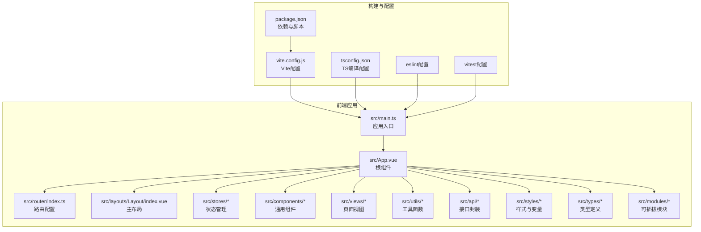
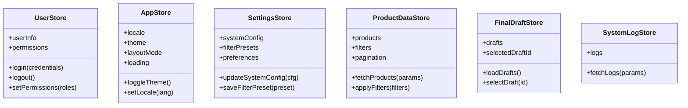
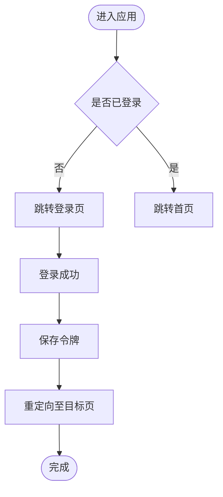
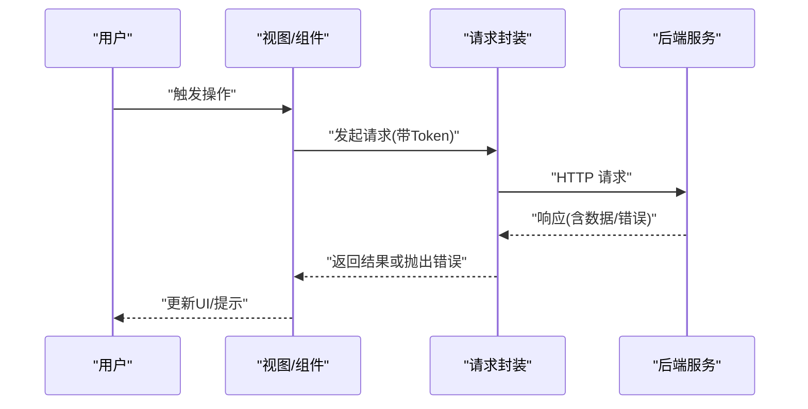
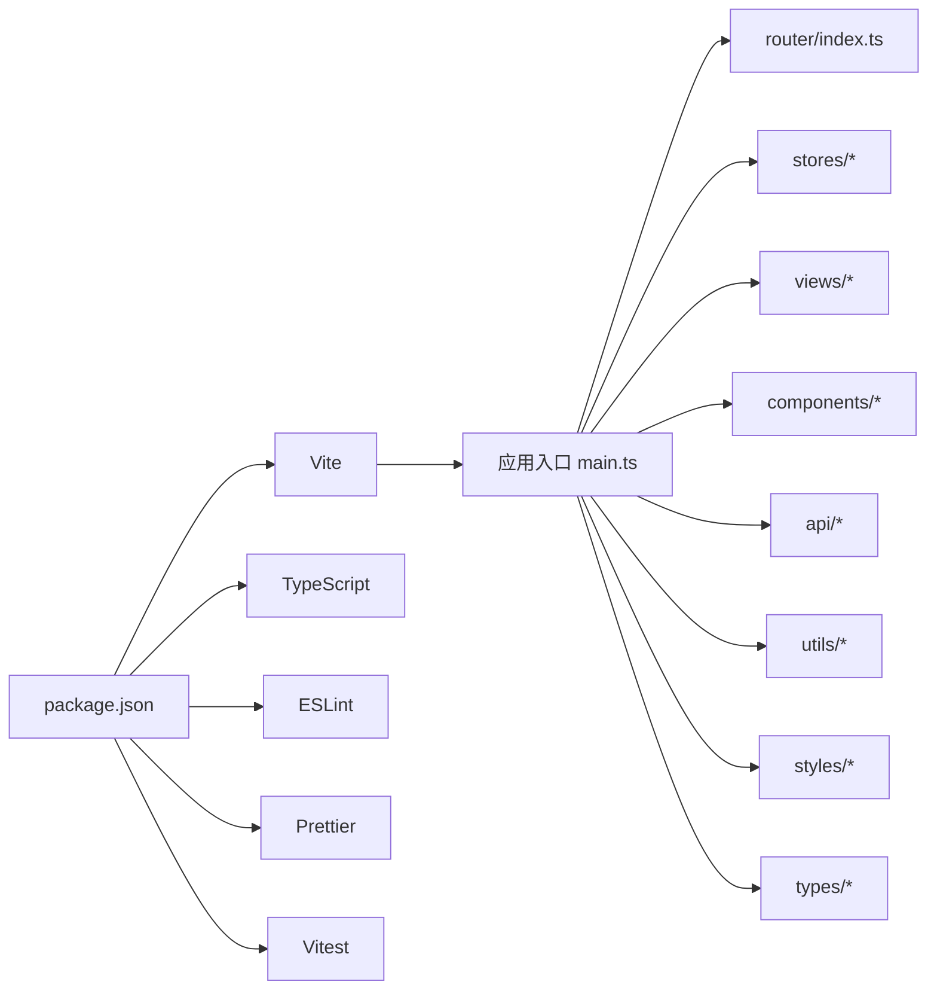

# 前端开发指南

<cite>
**本文引用的文件**
- [frontend/package.json](file://frontend/package.json)
- [frontend/vite.config.js](file://frontend/vite.config.js)
- [frontend/src/main.ts](file://frontend/src/main.ts)
- [frontend/src/App.vue](file://frontend/src/App.vue)
- [frontend/src/router/index.ts](file://frontend/src/router/index.ts)
- [frontend/src/stores/user.ts](file://frontend/src/stores/user.ts)
- [frontend/src/stores/app.ts](file://frontend/src/stores/app.ts)
- [frontend/src/stores/settings.ts](file://frontend/src/stores/settings.ts)
- [frontend/src/stores/productData.ts](file://frontend/src/stores/productData.ts)
- [frontend/src/stores/finalDraft.ts](file://frontend/src/stores/finalDraft.ts)
- [frontend/src/stores/systemLog.ts](file://frontend/src/stores/systemLog.ts)
- [frontend/src/layouts/Layout/index.vue](file://frontend/src/layouts/Layout/index.vue)
- [frontend/src/views/Home/index.vue](file://frontend/src/views/Home/index.vue)
- [frontend/src/views/Login/index.vue](file://frontend/src/views/Login/index.vue)
- [frontend/src/views/ProductManagement/index.vue](file://frontend/src/views/ProductManagement/index.vue)
- [frontend/src/views/AllSelection/index.vue](file://frontend/src/views/AllSelection/index.vue)
- [frontend/src/views/AsinImport/index.vue](file://frontend/src/views/AsinImport/index.vue)
- [frontend/src/views/FileLinkManagement/index.vue](file://frontend/src/views/FileLinkManagement/index.vue)
- [frontend/src/components/FilterConfigPanel/index.vue](file://frontend/src/components/FilterConfigPanel/index.vue)
- [frontend/src/components/FilterPresetSelector/index.vue](file://frontend/src/components/FilterPresetSelector/index.vue)
- [frontend/src/components/ImageUpload/index.vue](file://frontend/src/components/ImageUpload/index.vue)
- [frontend/src/components/LazyImage/index.vue](file://frontend/src/components/LazyImage/index.vue)
- [frontend/src/components/ProductDetailDialog/index.vue](file://frontend/src/components/ProductDetailDialog/index.vue)
- [frontend/src/components/RecycleBinPage/index.vue](file://frontend/src/components/RecycleBinPage/index.vue)
- [frontend/src/components/SelectionQueryForm/index.vue](file://frontend/src/components/SelectionQueryForm/index.vue)
- [frontend/src/components/ThumbnailViewer/index.vue](file://frontend/src/components/ThumbnailViewer/index.vue)
- [frontend/src/components/UniversalCard/index.vue](file://frontend/src/components/UniversalCard/index.vue)
- [frontend/src/components/UniversalList/index.vue](file://frontend/src/components/UniversalList/index.vue)
- [frontend/src/components/VirtualList/index.vue](file://frontend/src/components/VirtualList/index.vue)
- [frontend/src/utils/request.ts](file://frontend/src/utils/request.ts)
- [frontend/src/utils/download.ts](file://frontend/src/utils/download.ts)
- [frontend/src/utils/cacheManager.ts](file://frontend/src/utils/cacheManager.ts)
- [frontend/src/utils/debounce.ts](file://frontend/src/utils/debounce.ts)
- [frontend/src/utils/emitter.ts](file://frontend/src/utils/emitter.ts)
- [frontend/src/utils/imageCache.ts](file://frontend/src/utils/imageCache.ts)
- [frontend/src/utils/imageCacheOptimizer.ts](file://frontend/src/utils/imageCacheOptimizer.ts)
- [frontend/src/utils/imageOfflineCache.ts](file://frontend/src/utils/imageOfflineCache.ts)
- [frontend/src/utils/imageUrlUtil.ts](file://frontend/src/utils/imageUrlUtil.ts)
- [frontend/src/utils/storage.ts](file://frontend/src/utils/storage.ts)
- [frontend/src/types/common.ts](file://frontend/src/types/common.ts)
- [frontend/src/types/product.ts](file://frontend/src/types/product.ts)
- [frontend/src/types/productData.ts](file://frontend/src/types/productData.ts)
- [frontend/src/types/fileLink.ts](file://frontend/src/types/fileLink.ts)
- [frontend/src/types/resourceCollection.ts](file://frontend/src/types/resourceCollection.ts)
- [frontend/src/styles/index.scss](file://frontend/src/styles/index.scss)
- [frontend/src/styles/mixins.scss](file://frontend/src/styles/mixins.scss)
- [frontend/src/styles/variables.scss](file://frontend/src/styles/variables.scss)
- [frontend/src/modules/index.ts](file://frontend/src/modules/index.ts)
- [frontend/src/modules/zheng-shop-analysis/index.vue](file://frontend/src/modules/zheng-shop-analysis/index.vue)
- [frontend/src/modules/zheng-shop-analysis/manifest.ts](file://frontend/src/modules/zheng-shop-analysis/manifest.ts)
- [frontend/src/api/product.ts](file://frontend/src/api/product.ts)
- [frontend/src/api/selection.ts](file://frontend/src/api/selection.ts)
- [frontend/src/api/asinImport.ts](file://frontend/src/api/asinImport.ts)
- [frontend/src/api/fileLink.ts](file://frontend/src/api/fileLink.ts)
- [frontend/src/api/user.ts](file://frontend/src/api/user.ts)
- [frontend/src/api/systemConfig.ts](file://frontend/src/api/systemConfig.ts)
- [frontend/src/api/tag.ts](file://frontend/src/api/tag.ts)
- [frontend/src/api/category.ts](file://frontend/src/api/category.ts)
- [frontend/src/api/materialLibrary.ts](file://frontend/src/api/materialLibrary.ts)
- [frontend/src/api/carrierLibrary.ts](file://frontend/src/api/carrierLibrary.ts)
- [frontend/src/api/statistics.ts](file://frontend/src/api/statistics.ts)
- [frontend/src/api/report.ts](file://frontend/src/api/report.ts)
- [frontend/src/api/log.ts](file://frontend/src/api/log.ts)
- [frontend/src/api/finalDraft.ts](file://frontend/src/api/finalDraft.ts)
- [frontend/src/api/finalDrafts.ts](file://frontend/src/api/finalDrafts.ts)
- [frontend/src/api/import_export.ts](file://frontend/src/api/import_export.ts)
- [frontend/src/api/lingxing.ts](file://frontend/src/api/lingxing.ts)
- [frontend/src/api/clickLog.ts](file://frontend/src/api/clickLog.ts)
- [frontend/src/api/competitor.ts](file://frontend/src/api/competitor.ts)
- [frontend/src/api/downloadTask.ts](file://frontend/src/api/downloadTask.ts)
- [frontend/src/api/filterPreset.ts](file://frontend/src/api/filterPreset.ts)
- [frontend/src/api/productData.ts](file://frontend/src/api/productData.ts)
- [frontend/src/api/resourceCollection.ts](file://frontend/src/api/resourceCollection.ts)
- [frontend/src/env.d.ts](file://frontend/src/env.d.ts)
- [frontend/src/vite-env.d.ts](file://frontend/src/vite-env.d.ts)
- [frontend/tsconfig.json](file://frontend/tsconfig.json)
- [frontend/tsconfig.node.json](file://frontend/tsconfig.node.json)
- [frontend/.eslintrc.cjs](file://frontend/.eslintrc.cjs)
- [frontend/.eslintrc-auto-import.json](file://frontend/.eslintrc-auto-import.json)
- [frontend/vitest.config.js](file://frontend/vitest.config.js)
- [frontend/vitest.config.ts](file://frontend/vitest.config.ts)
- [frontend/frontend_consistency_report.json](file://frontend/frontend_consistency_report.json)
- [backend/app/main.py](file://backend/app/main.py)
- [backend/app/config.py](file://backend/app/config.py)
- [backend/app/api/v1/auth.py](file://backend/app/api/v1/auth.py)
- [backend/app/middleware/auth_middleware.py](file://backend/app/middleware/auth_middleware.py)
- [backend/app/middleware/error_handler.py](file://backend/app/middleware/error_handler.py)
- [backend/start_vite_dev.py](file://backend/start_vite_dev.py)
- [docs/development/standards.md](file://docs/development/standards.md)
- [docs/开发流程.md](file://docs/开发流程.md)
- [docs/production deployment checklist.md](file://docs/production deployment checklist.md)
</cite>

## 目录
1. [简介](#简介)
2. [项目结构](#项目结构)
3. [核心组件](#核心组件)
4. [架构总览](#架构总览)
5. [详细组件分析](#详细组件分析)
6. [依赖关系分析](#依赖关系分析)
7. [性能考虑](#性能考虑)
8. [故障排查指南](#故障排查指南)
9. [结论](#结论)
10. [附录](#附录)

## 简介
本指南面向思觉智贸前端团队，系统阐述基于 Vue.js 3 + TypeScript + Vite 的前端架构与开发规范，涵盖组件设计模式、状态管理、路由配置、Element Plus 使用与主题定制、响应式与性能优化、浏览器兼容性、与后端 API 的集成与认证、错误处理、开发工具与代码规范、以及构建与部署流程。同时提供从入门到进阶的学习路径与实践示例，帮助新老开发者快速上手并持续优化。

## 项目结构
前端采用模块化组织，核心目录包括：
- src：源码根目录
  - api：按领域划分的接口封装（如产品、选品、文件链接等）
  - components：通用组件（过滤器面板、图片懒加载、卡片列表、虚拟列表等）
  - layouts：布局组件（主布局、权限相关）
  - modules：可插拔模块（如“正店分析”模块）
  - router：路由配置
  - stores：状态管理（用户、应用、设置、产品数据、终稿、系统日志）
  - styles：样式入口与变量、混入
  - types：全局类型定义
  - utils：工具函数（请求、下载、缓存、防抖、事件总线、图片缓存等）
  - views：页面视图（登录、首页、产品管理、选品、文件链接管理等）
  - App.vue、main.ts：应用入口
- vite.config.js：Vite 构建与开发服务器配置
- package.json：依赖与脚本
- tsconfig.json/tsconfig.node.json：TypeScript 编译配置
- .eslintrc.cjs、vitest.config.*：开发工具与测试配置
- docs：开发规范、流程与部署清单

图表来源
- [frontend/src/main.ts:1-50](file://frontend/src/main.ts#L1-L50)
- [frontend/src/App.vue:1-50](file://frontend/src/App.vue#L1-L50)
- [frontend/vite.config.js:1-120](file://frontend/vite.config.js#L1-L120)
- [frontend/package.json:1-120](file://frontend/package.json#L1-L120)

章节来源
- [frontend/package.json:1-120](file://frontend/package.json#L1-L120)
- [frontend/vite.config.js:1-120](file://frontend/vite.config.js#L1-L120)
- [frontend/src/main.ts:1-50](file://frontend/src/main.ts#L1-L50)
- [frontend/src/App.vue:1-50](file://frontend/src/App.vue#L1-L50)

## 核心组件
- 应用入口与根组件：负责初始化应用、挂载根组件、注册插件与全局状态。
- 路由系统：集中管理页面级路由，支持权限校验与动态路由。
- 布局系统：统一头部、侧边栏、面包屑与内容区域，支持权限控制与主题切换。
- 通用组件：如过滤器面板、预设选择器、图片上传、懒加载图片、详情弹窗、回收站页、查询表单、缩略图查看器、通用卡片/列表、虚拟列表等。
- 页面视图：覆盖登录、首页、产品管理、智能选品、ASIN 导入、文件链接管理、仪表盘、统计、报告、系统设置等。
- 工具函数：封装请求、下载、缓存、防抖、事件总线、图片缓存与离线缓存、URL 工具等。
- 接口封装：按领域拆分 API 文件，统一处理参数、响应与错误。
- 状态管理：使用 Pinia 管理用户会话、应用设置、产品数据、终稿、系统日志等。
- 样式体系：SCSS 变量与混入，支持主题定制与响应式设计。

章节来源
- [frontend/src/main.ts:1-50](file://frontend/src/main.ts#L1-L50)
- [frontend/src/App.vue:1-50](file://frontend/src/App.vue#L1-L50)
- [frontend/src/router/index.ts:1-120](file://frontend/src/router/index.ts#L1-L120)
- [frontend/src/layouts/Layout/index.vue:1-120](file://frontend/src/layouts/Layout/index.vue#L1-L120)
- [frontend/src/stores/user.ts:1-120](file://frontend/src/stores/user.ts#L1-L120)
- [frontend/src/stores/app.ts:1-120](file://frontend/src/stores/app.ts#L1-L120)
- [frontend/src/stores/settings.ts:1-120](file://frontend/src/stores/settings.ts#L1-L120)
- [frontend/src/stores/productData.ts:1-120](file://frontend/src/stores/productData.ts#L1-L120)
- [frontend/src/stores/finalDraft.ts:1-120](file://frontend/src/stores/finalDraft.ts#L1-L120)
- [frontend/src/stores/systemLog.ts:1-120](file://frontend/src/stores/systemLog.ts#L1-L120)
- [frontend/src/utils/request.ts:1-120](file://frontend/src/utils/request.ts#L1-L120)
- [frontend/src/utils/download.ts:1-120](file://frontend/src/utils/download.ts#L1-L120)
- [frontend/src/utils/cacheManager.ts:1-120](file://frontend/src/utils/cacheManager.ts#L1-L120)
- [frontend/src/utils/debounce.ts:1-120](file://frontend/src/utils/debounce.ts#L1-L120)
- [frontend/src/utils/emitter.ts:1-120](file://frontend/src/utils/emitter.ts#L1-L120)
- [frontend/src/utils/imageCache.ts:1-120](file://frontend/src/utils/imageCache.ts#L1-L120)
- [frontend/src/utils/imageCacheOptimizer.ts:1-120](file://frontend/src/utils/imageCacheOptimizer.ts#L1-L120)
- [frontend/src/utils/imageOfflineCache.ts:1-120](file://frontend/src/utils/imageOfflineCache.ts#L1-L120)
- [frontend/src/utils/imageUrlUtil.ts:1-120](file://frontend/src/utils/imageUrlUtil.ts#L1-L120)
- [frontend/src/utils/storage.ts:1-120](file://frontend/src/utils/storage.ts#L1-L120)
- [frontend/src/api/product.ts:1-120](file://frontend/src/api/product.ts#L1-L120)
- [frontend/src/api/selection.ts:1-120](file://frontend/src/api/selection.ts#L1-L120)
- [frontend/src/api/asinImport.ts:1-120](file://frontend/src/api/asinImport.ts#L1-L120)
- [frontend/src/api/fileLink.ts:1-120](file://frontend/src/api/fileLink.ts#L1-L120)
- [frontend/src/api/user.ts:1-120](file://frontend/src/api/user.ts#L1-L120)
- [frontend/src/api/systemConfig.ts:1-120](file://frontend/src/api/systemConfig.ts#L1-L120)
- [frontend/src/api/tag.ts:1-120](file://frontend/src/api/tag.ts#L1-L120)
- [frontend/src/api/category.ts:1-120](file://frontend/src/api/category.ts#L1-L120)
- [frontend/src/api/materialLibrary.ts:1-120](file://frontend/src/api/materialLibrary.ts#L1-L120)
- [frontend/src/api/carrierLibrary.ts:1-120](file://frontend/src/api/carrierLibrary.ts#L1-L120)
- [frontend/src/api/statistics.ts:1-120](file://frontend/src/api/statistics.ts#L1-L120)
- [frontend/src/api/report.ts:1-120](file://frontend/src/api/report.ts#L1-L120)
- [frontend/src/api/log.ts:1-120](file://frontend/src/api/log.ts#L1-L120)
- [frontend/src/api/finalDraft.ts:1-120](file://frontend/src/api/finalDraft.ts#L1-L120)
- [frontend/src/api/finalDrafts.ts:1-120](file://frontend/src/api/finalDrafts.ts#L1-L120)
- [frontend/src/api/import_export.ts:1-120](file://frontend/src/api/import_export.ts#L1-L120)
- [frontend/src/api/lingxing.ts:1-120](file://frontend/src/api/lingxing.ts#L1-L120)
- [frontend/src/api/clickLog.ts:1-120](file://frontend/src/api/clickLog.ts#L1-L120)
- [frontend/src/api/competitor.ts:1-120](file://frontend/src/api/competitor.ts#L1-L120)
- [frontend/src/api/downloadTask.ts:1-120](file://frontend/src/api/downloadTask.ts#L1-L120)
- [frontend/src/api/filterPreset.ts:1-120](file://frontend/src/api/filterPreset.ts#L1-L120)
- [frontend/src/api/productData.ts:1-120](file://frontend/src/api/productData.ts#L1-L120)
- [frontend/src/api/resourceCollection.ts:1-120](file://frontend/src/api/resourceCollection.ts#L1-L120)

## 架构总览
前端采用“页面视图 + 通用组件 + 状态管理 + 接口封装”的分层架构，结合模块化与可插拔设计，便于扩展与维护。Element Plus 作为 UI 基础库，配合 SCSS 变量与混入实现主题定制；Pinia 管理全局状态；Axios 封装统一请求与拦截器；Vite 提供开发与构建能力。

```mermaid
graph TB
subgraph "视图层"
V1["Login"]
V2["Home"]
V3["ProductManagement"]
V4["AllSelection"]
V5["AsinImport"]
V6["FileLinkManagement"]
end
subgraph "组件层"
C1["FilterConfigPanel"]
C2["FilterPresetSelector"]
C3["ImageUpload"]
C4["LazyImage"]
C5["ProductDetailDialog"]
C6["RecycleBinPage"]
C7["SelectionQueryForm"]
C8["ThumbnailViewer"]
C9["UniversalCard / List / VirtualList"]
end
subgraph "状态层"
S1["user store"]
S2["app store"]
S3["settings store"]
S4["productData store"]
S5["finalDraft store"]
S6["systemLog store"]
end
subgraph "接口层"
A1["product.ts"]
A2["selection.ts"]
A3["asinImport.ts"]
A4["fileLink.ts"]
A5["user.ts"]
A6["systemConfig.ts"]
A7["tag.ts"]
A8["category.ts"]
A9["materialLibrary.ts"]
A10["carrierLibrary.ts"]
A11["statistics.ts"]
A12["report.ts"]
A13["log.ts"]
A14["finalDraft.ts"]
A15["finalDrafts.ts"]
A16["import_export.ts"]
A17["lingxing.ts"]
A18["clickLog.ts"]
A19["competitor.ts"]
A20["downloadTask.ts"]
A21["filterPreset.ts"]
A22["productData.ts"]
A23["resourceCollection.ts"]
end
V1 --> C1
V2 --> C2
V3 --> C3
V4 --> C4
V5 --> C5
V6 --> C6
V1 --> S1
V2 --> S2
V3 --> S3
V4 --> S4
V5 --> S5
V6 --> S6
V1 --> A5
V2 --> A1
V3 --> A1
V4 --> A2
V5 --> A3
V6 --> A4
C1 --> A6
C2 --> A7
C3 --> A8
C4 --> A9
C5 --> A10
C6 --> A11
C7 --> A12
C8 --> A13
C9 --> A14
```

图表来源
- [frontend/src/views/Login/index.vue:1-120](file://frontend/src/views/Login/index.vue#L1-L120)
- [frontend/src/views/Home/index.vue:1-120](file://frontend/src/views/Home/index.vue#L1-L120)
- [frontend/src/views/ProductManagement/index.vue:1-120](file://frontend/src/views/ProductManagement/index.vue#L1-L120)
- [frontend/src/views/AllSelection/index.vue:1-120](file://frontend/src/views/AllSelection/index.vue#L1-L120)
- [frontend/src/views/AsinImport/index.vue:1-120](file://frontend/src/views/AsinImport/index.vue#L1-L120)
- [frontend/src/views/FileLinkManagement/index.vue:1-120](file://frontend/src/views/FileLinkManagement/index.vue#L1-L120)
- [frontend/src/components/FilterConfigPanel/index.vue:1-120](file://frontend/src/components/FilterConfigPanel/index.vue#L1-L120)
- [frontend/src/components/FilterPresetSelector/index.vue:1-120](file://frontend/src/components/FilterPresetSelector/index.vue#L1-L120)
- [frontend/src/components/ImageUpload/index.vue:1-120](file://frontend/src/components/ImageUpload/index.vue#L1-L120)
- [frontend/src/components/LazyImage/index.vue:1-120](file://frontend/src/components/LazyImage/index.vue#L1-L120)
- [frontend/src/components/ProductDetailDialog/index.vue:1-120](file://frontend/src/components/ProductDetailDialog/index.vue#L1-L120)
- [frontend/src/components/RecycleBinPage/index.vue:1-120](file://frontend/src/components/RecycleBinPage/index.vue#L1-L120)
- [frontend/src/components/SelectionQueryForm/index.vue:1-120](file://frontend/src/components/SelectionQueryForm/index.vue#L1-L120)
- [frontend/src/components/ThumbnailViewer/index.vue:1-120](file://frontend/src/components/ThumbnailViewer/index.vue#L1-L120)
- [frontend/src/components/UniversalCard/index.vue:1-120](file://frontend/src/components/UniversalCard/index.vue#L1-L120)
- [frontend/src/components/UniversalList/index.vue:1-120](file://frontend/src/components/UniversalList/index.vue#L1-L120)
- [frontend/src/components/VirtualList/index.vue:1-120](file://frontend/src/components/VirtualList/index.vue#L1-L120)
- [frontend/src/stores/user.ts:1-120](file://frontend/src/stores/user.ts#L1-L120)
- [frontend/src/stores/app.ts:1-120](file://frontend/src/stores/app.ts#L1-L120)
- [frontend/src/stores/settings.ts:1-120](file://frontend/src/stores/settings.ts#L1-L120)
- [frontend/src/stores/productData.ts:1-120](file://frontend/src/stores/productData.ts#L1-L120)
- [frontend/src/stores/finalDraft.ts:1-120](file://frontend/src/stores/finalDraft.ts#L1-L120)
- [frontend/src/stores/systemLog.ts:1-120](file://frontend/src/stores/systemLog.ts#L1-L120)
- [frontend/src/api/product.ts:1-120](file://frontend/src/api/product.ts#L1-L120)
- [frontend/src/api/selection.ts:1-120](file://frontend/src/api/selection.ts#L1-L120)
- [frontend/src/api/asinImport.ts:1-120](file://frontend/src/api/asinImport.ts#L1-L120)
- [frontend/src/api/fileLink.ts:1-120](file://frontend/src/api/fileLink.ts#L1-L120)
- [frontend/src/api/user.ts:1-120](file://frontend/src/api/user.ts#L1-L120)
- [frontend/src/api/systemConfig.ts:1-120](file://frontend/src/api/systemConfig.ts#L1-L120)
- [frontend/src/api/tag.ts:1-120](file://frontend/src/api/tag.ts#L1-L120)
- [frontend/src/api/category.ts:1-120](file://frontend/src/api/category.ts#L1-L120)
- [frontend/src/api/materialLibrary.ts:1-120](file://frontend/src/api/materialLibrary.ts#L1-L120)
- [frontend/src/api/carrierLibrary.ts:1-120](file://frontend/src/api/carrierLibrary.ts#L1-L120)
- [frontend/src/api/statistics.ts:1-120](file://frontend/src/api/statistics.ts#L1-L120)
- [frontend/src/api/report.ts:1-120](file://frontend/src/api/report.ts#L1-L120)
- [frontend/src/api/log.ts:1-120](file://frontend/src/api/log.ts#L1-L120)
- [frontend/src/api/finalDraft.ts:1-120](file://frontend/src/api/finalDraft.ts#L1-L120)
- [frontend/src/api/finalDrafts.ts:1-120](file://frontend/src/api/finalDrafts.ts#L1-L120)
- [frontend/src/api/import_export.ts:1-120](file://frontend/src/api/import_export.ts#L1-L120)
- [frontend/src/api/lingxing.ts:1-120](file://frontend/src/api/lingxing.ts#L1-L120)
- [frontend/src/api/clickLog.ts:1-120](file://frontend/src/api/clickLog.ts#L1-L120)
- [frontend/src/api/competitor.ts:1-120](file://frontend/src/api/competitor.ts#L1-L120)
- [frontend/src/api/downloadTask.ts:1-120](file://frontend/src/api/downloadTask.ts#L1-L120)
- [frontend/src/api/filterPreset.ts:1-120](file://frontend/src/api/filterPreset.ts#L1-L120)
- [frontend/src/api/productData.ts:1-120](file://frontend/src/api/productData.ts#L1-L120)
- [frontend/src/api/resourceCollection.ts:1-120](file://frontend/src/api/resourceCollection.ts#L1-L120)

## 详细组件分析

### 组件设计模式
- 组合式 API：广泛使用组合式 API 进行逻辑复用与状态管理。
- 低耦合高内聚：通用组件通过 props、events、slots 与页面解耦，便于复用。
- 渐进增强：懒加载、虚拟列表、图片缓存等提升性能与体验。
- 可插拔模块：模块化设计支持按需启用与扩展。

章节来源
- [frontend/src/components/FilterConfigPanel/index.vue:1-120](file://frontend/src/components/FilterConfigPanel/index.vue#L1-L120)
- [frontend/src/components/FilterPresetSelector/index.vue:1-120](file://frontend/src/components/FilterPresetSelector/index.vue#L1-L120)
- [frontend/src/components/ImageUpload/index.vue:1-120](file://frontend/src/components/ImageUpload/index.vue#L1-L120)
- [frontend/src/components/LazyImage/index.vue:1-120](file://frontend/src/components/LazyImage/index.vue#L1-L120)
- [frontend/src/components/ProductDetailDialog/index.vue:1-120](file://frontend/src/components/ProductDetailDialog/index.vue#L1-L120)
- [frontend/src/components/RecycleBinPage/index.vue:1-120](file://frontend/src/components/RecycleBinPage/index.vue#L1-L120)
- [frontend/src/components/SelectionQueryForm/index.vue:1-120](file://frontend/src/components/SelectionQueryForm/index.vue#L1-L120)
- [frontend/src/components/ThumbnailViewer/index.vue:1-120](file://frontend/src/components/ThumbnailViewer/index.vue#L1-L120)
- [frontend/src/components/UniversalCard/index.vue:1-120](file://frontend/src/components/UniversalCard/index.vue#L1-L120)
- [frontend/src/components/UniversalList/index.vue:1-120](file://frontend/src/components/UniversalList/index.vue#L1-L120)
- [frontend/src/components/VirtualList/index.vue:1-120](file://frontend/src/components/VirtualList/index.vue#L1-L120)
- [frontend/src/modules/zheng-shop-analysis/index.vue:1-120](file://frontend/src/modules/zheng-shop-analysis/index.vue#L1-L120)
- [frontend/src/modules/zheng-shop-analysis/manifest.ts:1-120](file://frontend/src/modules/zheng-shop-analysis/manifest.ts#L1-L120)

### 状态管理
- 用户状态：登录态、权限、个人信息等。
- 应用状态：语言、主题、布局模式、加载状态等。
- 设置状态：系统配置、筛选预设、偏好设置等。
- 数据状态：产品数据、终稿、系统日志等。

图表来源
- [frontend/src/stores/user.ts:1-120](file://frontend/src/stores/user.ts#L1-L120)
- [frontend/src/stores/app.ts:1-120](file://frontend/src/stores/app.ts#L1-L120)
- [frontend/src/stores/settings.ts:1-120](file://frontend/src/stores/settings.ts#L1-L120)
- [frontend/src/stores/productData.ts:1-120](file://frontend/src/stores/productData.ts#L1-L120)
- [frontend/src/stores/finalDraft.ts:1-120](file://frontend/src/stores/finalDraft.ts#L1-L120)
- [frontend/src/stores/systemLog.ts:1-120](file://frontend/src/stores/systemLog.ts#L1-L120)

章节来源
- [frontend/src/stores/user.ts:1-120](file://frontend/src/stores/user.ts#L1-L120)
- [frontend/src/stores/app.ts:1-120](file://frontend/src/stores/app.ts#L1-L120)
- [frontend/src/stores/settings.ts:1-120](file://frontend/src/stores/settings.ts#L1-L120)
- [frontend/src/stores/productData.ts:1-120](file://frontend/src/stores/productData.ts#L1-L120)
- [frontend/src/stores/finalDraft.ts:1-120](file://frontend/src/stores/finalDraft.ts#L1-L120)
- [frontend/src/stores/systemLog.ts:1-120](file://frontend/src/stores/systemLog.ts#L1-L120)

### 路由配置
- 集中式路由配置，支持嵌套路由、动态路由与权限守卫。
- 登录页、首页、产品管理、智能选品、ASIN 导入、文件链接管理等页面路由清晰。

图表来源
- [frontend/src/router/index.ts:1-120](file://frontend/src/router/index.ts#L1-L120)
- [frontend/src/views/Login/index.vue:1-120](file://frontend/src/views/Login/index.vue#L1-L120)
- [frontend/src/views/Home/index.vue:1-120](file://frontend/src/views/Home/index.vue#L1-L120)

章节来源
- [frontend/src/router/index.ts:1-120](file://frontend/src/router/index.ts#L1-L120)
- [frontend/src/views/Login/index.vue:1-120](file://frontend/src/views/Login/index.vue#L1-L120)
- [frontend/src/views/Home/index.vue:1-120](file://frontend/src/views/Home/index.vue#L1-L120)

### Element Plus 使用与主题定制
- 组件库：Form、Table、Dialog、Upload、Pagination、Tag、Button、Select、Input、Tree、Cascader 等。
- 主题定制：通过 SCSS 变量与混入覆盖默认样式，支持明暗主题切换与品牌色系。
- 国际化：结合应用状态进行语言切换。

章节来源
- [frontend/src/styles/index.scss:1-120](file://frontend/src/styles/index.scss#L1-L120)
- [frontend/src/styles/mixins.scss:1-120](file://frontend/src/styles/mixins.scss#L1-L120)
- [frontend/src/styles/variables.scss:1-120](file://frontend/src/styles/variables.scss#L1-L120)
- [frontend/src/stores/app.ts:1-120](file://frontend/src/stores/app.ts#L1-L120)

### 响应式设计与性能优化
- 响应式断点：基于 SCSS 混入与媒体查询适配多端。
- 性能优化：图片懒加载、虚拟滚动、请求合并、缓存策略、内存监控与防抖。
- 图片优化：离线缓存、URL 规范化、缓存优化器。

章节来源
- [frontend/src/styles/mixins.scss:1-120](file://frontend/src/styles/mixins.scss#L1-L120)
- [frontend/src/components/LazyImage/index.vue:1-120](file://frontend/src/components/LazyImage/index.vue#L1-L120)
- [frontend/src/components/VirtualList/index.vue:1-120](file://frontend/src/components/VirtualList/index.vue#L1-L120)
- [frontend/src/utils/imageCache.ts:1-120](file://frontend/src/utils/imageCache.ts#L1-L120)
- [frontend/src/utils/imageCacheOptimizer.ts:1-120](file://frontend/src/utils/imageCacheOptimizer.ts#L1-L120)
- [frontend/src/utils/imageOfflineCache.ts:1-120](file://frontend/src/utils/imageOfflineCache.ts#L1-L120)
- [frontend/src/utils/imageUrlUtil.ts:1-120](file://frontend/src/utils/imageUrlUtil.ts#L1-L120)
- [frontend/src/utils/cacheManager.ts:1-120](file://frontend/src/utils/cacheManager.ts#L1-L120)
- [frontend/src/utils/debounce.ts:1-120](file://frontend/src/utils/debounce.ts#L1-L120)
- [frontend/src/utils/memoryMonitor.ts:1-120](file://frontend/src/utils/memoryMonitor.ts#L1-L120)

### 浏览器兼容性
- Browserslist 配置与构建产物兼容策略，确保在主流现代浏览器中稳定运行。
- 对旧版浏览器的降级处理与 polyfill 策略（如需要）。

章节来源
- [frontend/package.json:1-120](file://frontend/package.json#L1-L120)

### 与后端 API 集成与认证
- 请求封装：统一拦截器、超时、重试、错误处理与 Token 注入。
- 认证机制：登录、登出、刷新 Token、权限守卫。
- 错误处理：统一异常捕获、提示与日志上报。

图表来源
- [frontend/src/utils/request.ts:1-120](file://frontend/src/utils/request.ts#L1-L120)
- [frontend/src/api/user.ts:1-120](file://frontend/src/api/user.ts#L1-L120)
- [backend/app/api/v1/auth.py:1-120](file://backend/app/api/v1/auth.py#L1-L120)
- [backend/app/middleware/auth_middleware.py:1-120](file://backend/app/middleware/auth_middleware.py#L1-L120)
- [backend/app/middleware/error_handler.py:1-120](file://backend/app/middleware/error_handler.py#L1-L120)

章节来源
- [frontend/src/utils/request.ts:1-120](file://frontend/src/utils/request.ts#L1-L120)
- [frontend/src/api/user.ts:1-120](file://frontend/src/api/user.ts#L1-L120)
- [backend/app/api/v1/auth.py:1-120](file://backend/app/api/v1/auth.py#L1-L120)
- [backend/app/middleware/auth_middleware.py:1-120](file://backend/app/middleware/auth_middleware.py#L1-L120)
- [backend/app/middleware/error_handler.py:1-120](file://backend/app/middleware/error_handler.py#L1-L120)

### 开发示例：产品管理、智能选品、文件处理
- 产品管理：分页查询、筛选、批量操作、详情查看、回收站。
- 智能选品：查询表单、结果列表、评分配置、历史记录。
- 文件处理：文件上传、链接生成、下载任务、离线缓存。

章节来源
- [frontend/src/views/ProductManagement/index.vue:1-120](file://frontend/src/views/ProductManagement/index.vue#L1-L120)
- [frontend/src/views/AllSelection/index.vue:1-120](file://frontend/src/views/AllSelection/index.vue#L1-L120)
- [frontend/src/views/AsinImport/index.vue:1-120](file://frontend/src/views/AsinImport/index.vue#L1-L120)
- [frontend/src/views/FileLinkManagement/index.vue:1-120](file://frontend/src/views/FileLinkManagement/index.vue#L1-L120)
- [frontend/src/components/SelectionQueryForm/index.vue:1-120](file://frontend/src/components/SelectionQueryForm/index.vue#L1-L120)
- [frontend/src/components/ImageUpload/index.vue:1-120](file://frontend/src/components/ImageUpload/index.vue#L1-L120)
- [frontend/src/utils/download.ts:1-120](file://frontend/src/utils/download.ts#L1-L120)

## 依赖关系分析
- 构建与打包：Vite、TypeScript、ESLint、Prettier、Vitest。
- 运行时依赖：Vue 3、Element Plus、Axios、Pinia、Vue Router、Day.js、CryptoJS 等。
- 开发依赖：@vitejs/plugin-react、typescript、@types/node、eslint、prettier 等。

图表来源
- [frontend/package.json:1-120](file://frontend/package.json#L1-L120)
- [frontend/vite.config.js:1-120](file://frontend/vite.config.js#L1-L120)
- [frontend/src/main.ts:1-50](file://frontend/src/main.ts#L1-L50)

章节来源
- [frontend/package.json:1-120](file://frontend/package.json#L1-L120)
- [frontend/vite.config.js:1-120](file://frontend/vite.config.js#L1-L120)

## 性能考虑
- 渲染优化：虚拟列表、懒加载、图片缓存与离线缓存。
- 网络优化：请求合并、去抖、超时与重试、缓存策略。
- 内存管理：内存监控、组件卸载清理、事件总线解绑。
- 构建优化：Tree-shaking、按需引入、代码分割、压缩与资源内联。

章节来源
- [frontend/src/components/VirtualList/index.vue:1-120](file://frontend/src/components/VirtualList/index.vue#L1-L120)
- [frontend/src/components/LazyImage/index.vue:1-120](file://frontend/src/components/LazyImage/index.vue#L1-L120)
- [frontend/src/utils/cacheManager.ts:1-120](file://frontend/src/utils/cacheManager.ts#L1-L120)
- [frontend/src/utils/debounce.ts:1-120](file://frontend/src/utils/debounce.ts#L1-L120)
- [frontend/src/utils/memoryMonitor.ts:1-120](file://frontend/src/utils/memoryMonitor.ts#L1-L120)

## 故障排查指南
- 登录失败：检查 Token 生成与存储、后端认证中间件、网络请求拦截器。
- 图片加载失败：检查图片 URL 规范化、缓存策略、CORS 与代理配置。
- 列表渲染卡顿：检查虚拟列表配置、数据分页与懒加载策略。
- 构建报错：核对 TypeScript 配置、ESLint 规则、Vite 插件版本与兼容性。

章节来源
- [frontend/src/utils/request.ts:1-120](file://frontend/src/utils/request.ts#L1-L120)
- [frontend/src/utils/imageUrlUtil.ts:1-120](file://frontend/src/utils/imageUrlUtil.ts#L1-L120)
- [frontend/src/utils/imageOfflineCache.ts:1-120](file://frontend/src/utils/imageOfflineCache.ts#L1-L120)
- [frontend/tsconfig.json:1-120](file://frontend/tsconfig.json#L1-L120)
- [frontend/.eslintrc.cjs:1-120](file://frontend/.eslintrc.cjs#L1-L120)

## 结论
本指南提供了从架构到实现的完整前端开发路径，涵盖组件设计、状态管理、路由与 API 集成、主题与响应式、性能与兼容性、开发工具与规范，并给出具体页面与组件的实践示例。建议团队在日常开发中遵循统一规范，持续优化性能与可维护性。

## 附录
- 学习路径
  - 新手：HTML/CSS/JavaScript → Vue 3 基础 → TypeScript → Vite + Element Plus → 状态管理 → 组件与路由 → API 集成 → 性能与测试
  - 进阶：架构设计 → 模块化与可插拔 → 主题与样式体系 → 图片与缓存优化 → CI/CD 与部署
- 开发规范与流程
  - 代码规范：ESLint、Prettier、TypeScript 规则
  - 提交流程：分支命名、提交信息、PR 规范、代码审查
  - 测试：单元测试、集成测试、端到端测试
  - 部署：构建产物、Nginx 配置、蓝绿/灰度发布

章节来源
- [docs/development/standards.md:1-200](file://docs/development/standards.md#L1-L200)
- [docs/开发流程.md:1-200](file://docs/开发流程.md#L1-L200)
- [docs/production deployment checklist.md:1-200](file://docs/production deployment checklist.md#L1-L200)
- [frontend/.eslintrc.cjs:1-120](file://frontend/.eslintrc.cjs#L1-L120)
- [frontend/vitest.config.js:1-120](file://frontend/vitest.config.js#L1-L120)
- [frontend/vitest.config.ts:1-120](file://frontend/vitest.config.ts#L1-L120)