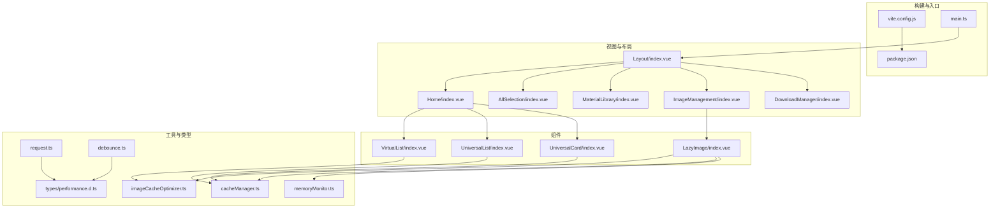
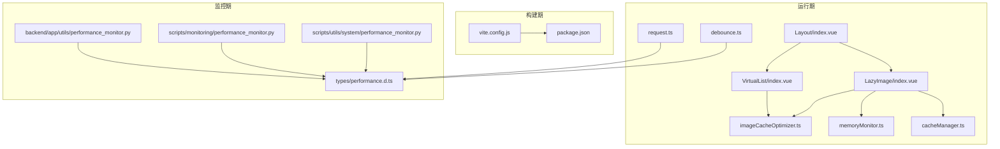
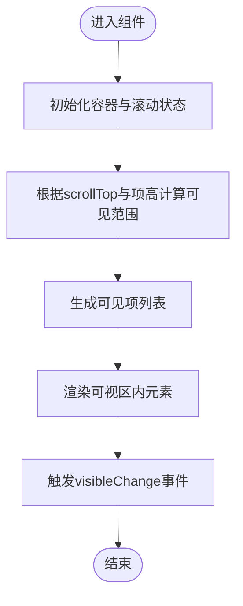
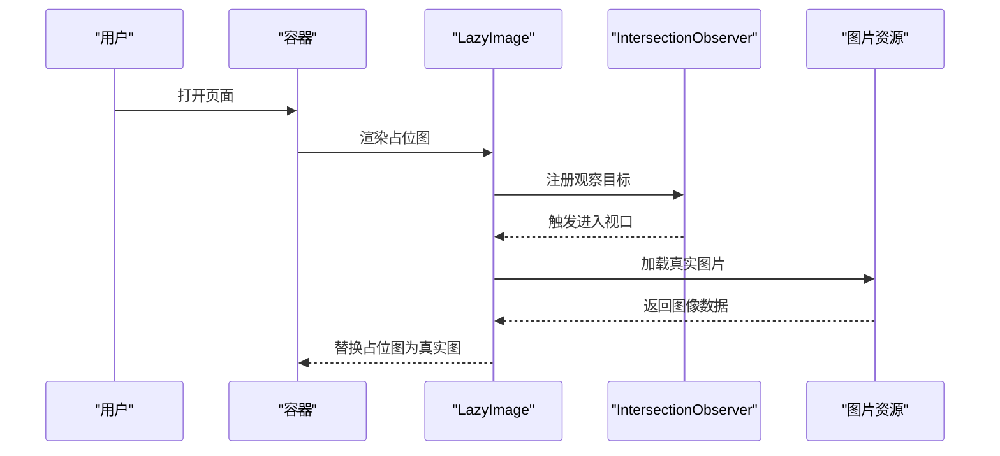
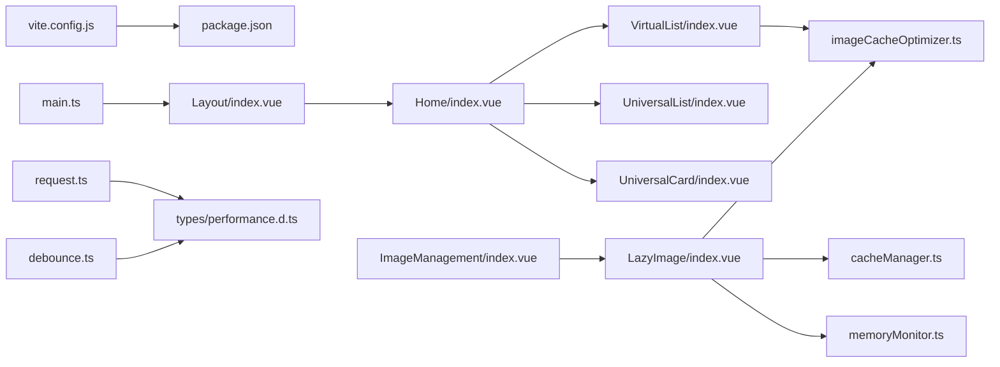

# 性能优化

<cite>
**本文引用的文件**
- [frontend/src/components/VirtualList/index.vue](file://frontend/src/components/VirtualList/index.vue)
- [frontend/src/components/LazyImage/index.vue](file://frontend/src/components/LazyImage/index.vue)
- [frontend/src/utils/imageCacheOptimizer.ts](file://frontend/src/utils/imageCacheOptimizer.ts)
- [frontend/src/utils/memoryMonitor.ts](file://frontend/src/utils/memoryMonitor.ts)
- [frontend/vite.config.js](file://frontend/vite.config.js)
- [frontend/package.json](file://frontend/package.json)
- [backend/app/utils/performance_monitor.py](file://backend/app/utils/performance_monitor.py)
- [scripts/monitoring/performance_monitor.py](file://scripts/monitoring/performance_monitor.py)
- [scripts/utils/system/performance_monitor.py](file://scripts/utils/system/performance_monitor.py)
- [frontend/src/views/ProductDataDashboard/composables/useProductData.ts](file://frontend/src/views/ProductDataDashboard/composables/useProductData.ts)
- [frontend/src/views/ImageManagement/index.vue](file://frontend/src/views/ImageManagement/index.vue)
- [frontend/src/stores/productData.ts](file://frontend/src/stores/productData.ts)
- [frontend/src/router/index.ts](file://frontend/src/router/index.ts)
- [frontend/src/main.ts](file://frontend/src/main.ts)
- [frontend/vue-pure-admin/src/views/components/virtual-list/index.vue](file://frontend/vue-pure-admin/src/views/components/virtual-list/index.vue)
- [frontend/vue-pure-admin/src/views/components/virtual-list/vertical.vue](file://frontend/vue-pure-admin/src/views/components/virtual-list/vertical.vue)
- [frontend/vue-pure-admin/src/views/components/virtual-list/horizontal.vue](file://frontend/vue-pure-admin/src/views/components/virtual-list/horizontal.vue)
- [frontend/src/views/AllSelection/index.vue](file://frontend/src/views/AllSelection/index.vue)
- [frontend/src/views/MaterialLibrary/index.vue](file://frontend/src/views/MaterialLibrary/index.vue)
- [frontend/src/views/DownloadManager/index.vue](file://frontend/src/views/DownloadManager/index.vue)
- [frontend/src/views/Home/index.vue](file://frontend/src/views/Home/index.vue)
- [frontend/src/layouts/Layout/index.vue](file://frontend/src/layouts/Layout/index.vue)
- [frontend/src/components/UniversalList/index.vue](file://frontend/src/components/UniversalList/index.vue)
- [frontend/src/components/UniversalCard/index.vue](file://frontend/src/components/UniversalCard/index.vue)
- [frontend/src/components/FilterPresetSelector/index.vue](file://frontend/src/components/FilterPresetSelector/index.vue)
- [frontend/src/components/FilterConfigPanel/index.vue](file://frontend/src/components/FilterConfigPanel/index.vue)
- [frontend/src/types/performance.d.ts](file://frontend/src/types/performance.d.ts)
- [frontend/src/types/common.ts](file://frontend/src/types/common.ts)
- [frontend/src/types/productData.ts](file://frontend/src/types/productData.ts)
- [frontend/src/types/product.ts](file://frontend/src/types/product.ts)
- [frontend/src/types/api.ts](file://frontend/src/types/api.ts)
- [frontend/src/types/utils.ts](file://frontend/src/types/utils.ts)
- [frontend/src/utils/cacheManager.ts](file://frontend/src/utils/cacheManager.ts)
- [frontend/src/utils/storage.ts](file://frontend/src/utils/storage.ts)
- [frontend/src/utils/debounce.ts](file://frontend/src/utils/debounce.ts)
- [frontend/src/utils/request.ts](file://frontend/src/utils/request.ts)
- [frontend/src/utils/requestMerge.ts](file://frontend/src/utils/requestMerge.ts)
- [frontend/src/utils/download.ts](file://frontend/src/utils/download.ts)
- [frontend/src/utils/imageUrlUtil.ts](file://frontend/src/utils/imageUrlUtil.ts)
- [frontend/src/utils/imageOfflineCache.ts](file://frontend/src/utils/imageOfflineCache.ts)
- [frontend/src/utils/emitter.ts](file://frontend/src/utils/emitter.ts)
- [frontend/src/utils/environment.js](file://frontend/src/utils/environment.js)
- [frontend/src/api/product.ts](file://frontend/src/api/product.ts)
- [frontend/src/api/image.ts](file://frontend/src/api/image.ts)
- [frontend/src/api/productData.ts](file://frontend/src/api/productData.ts)
- [frontend/src/api/fileLink.ts](file://frontend/src/api/fileLink.ts)
- [frontend/src/api/selection.ts](file://frontend/src/api/selection.ts)
- [frontend/src/api/statistics.ts](file://frontend/src/api/statistics.ts)
- [frontend/src/api/report.ts](file://frontend/src/api/report.ts)
- [frontend/src/api/user.ts](file://frontend/src/api/user.ts)
- [frontend/src/api/tag.ts](file://frontend/src/api/tag.ts)
- [frontend/src/api/category.ts](file://frontend/src/api/category.ts)
- [frontend/src/api/materialLibrary.ts](file://frontend/src/api/materialLibrary.ts)
- [frontend/src/api/systemConfig.ts](file://frontend/src/api/systemConfig.ts)
- [frontend/src/api/logs.ts](file://frontend/src/api/logs.ts)
- [frontend/src/api/selection_recycle.ts](file://frontend/src/api/selection_recycle.ts)
- [frontend/src/api/recycle_bin.ts](file://frontend/src/api/recycle_bin.ts)
- [frontend/src/api/finalDrafts.ts](file://frontend/src/api/finalDrafts.ts)
- [frontend/src/api/finalDraft.ts](file://frontend/src/api/finalDraft.ts)
- [frontend/src/api/import_export.ts](file://frontend/src/api/import_export.ts)
- [frontend/src/api/asinImport.ts](file://frontend/src/api/asinImport.ts)
- [frontend/src/api/carrierLibrary.ts](file://frontend/src/api/carrierLibrary.ts)
- [frontend/src/api/competitor.ts](file://frontend/src/api/competitor.ts)
- [frontend/src/api/downloadTask.ts](file://frontend/src/api/downloadTask.ts)
- [frontend/src/api/fileLink.ts](file://frontend/src/api/fileLink.ts)
- [frontend/src/api/filterPreset.ts](file://frontend/src/api/filterPreset.ts)
- [frontend/src/api/lingxing.ts](file://frontend/src/api/lingxing.ts)
- [frontend/src/api/resourceCollection.ts](file://frontend/src/api/resourceCollection.ts)
- [frontend/src/api/scoring.ts](file://frontend/src/api/scoring.ts)
- [frontend/src/api/tags.ts](file://frontend/src/api/tags.ts)
- [frontend/src/api/users.ts](file://frontend/src/api/users.ts)
- [frontend/src/api/announcement.ts](file://frontend/src/api/announcement.ts)
- [frontend/src/api/auth.ts](file://frontend/src/api/auth.ts)
- [frontend/src/api/categories.ts](file://frontend/src/api/categories.ts)
- [frontend/src/api/download_tasks.ts](file://frontend/src/api/download_tasks.ts)
- [frontend/src/api/export.ts](file://frontend/src/api/export.ts)
- [frontend/src/api/file_links.ts](file://frontend/src/api/file_links.ts)
- [frontend/src/api/final_drafts.ts](file://frontend/src/api/final_drafts.ts)
- [frontend/src/api/health.ts](file://frontend/src/api/health.ts)
- [frontend/src/api/image_proxy.ts](file://frontend/src/api/image_proxy.ts)
- [frontend/src/api/images.ts](file://frontend/src/api/images.ts)
- [frontend/src/api/import_.py](file://frontend/src/api/import_.py)
- [frontend/src/api/lingxing.py](file://frontend/src/api/lingxing.py)
- [frontend/src/api/logs.py](file://frontend/src/api/logs.py)
- [frontend/src/api/material_library.py](file://frontend/src/api/material_library.py)
- [frontend/src/api/product_data.py](file://frontend/src/api/product_data.py)
- [frontend/src/api/product_recycle.py](file://frontend/src/api/product_recycle.py)
- [frontend/src/api/products.py](file://frontend/src/api/products.py)
- [frontend/src/api/recycle_bin.py](file://frontend/src/api/recycle_bin.py)
- [frontend/src/api/reports.py](file://frontend/src/api/reports.py)
- [frontend/src/api/scoring.py](file://frontend/src/api/scoring.py)
- [frontend/src/api/selection.py](file://frontend/src/api/selection.py)
- [frontend/src/api/selection_recycle.py](file://frontend/src/api/selection_recycle.py)
- [frontend/src/api/statistics.py](file://frontend/src/api/statistics.py)
- [frontend/src/api/system_config.py](file://frontend/src/api/system_config.py)
- [frontend/src/api/tags.py](file://frontend/src/api/tags.py)
- [frontend/src/api/users.py](file://frontend/src/api/users.py)
</cite>

## 目录
1. [简介](#简介)
2. [项目结构](#项目结构)
3. [核心组件](#核心组件)
4. [架构概览](#架构概览)
5. [详细组件分析](#详细组件分析)
6. [依赖分析](#依赖分析)
7. [性能考虑](#性能考虑)
8. [故障排查指南](#故障排查指南)
9. [结论](#结论)
10. [附录](#附录)

## 简介
本指南面向前端性能优化，围绕代码分割、懒加载与资源压缩策略展开；同时覆盖组件渲染优化、虚拟滚动、图片懒加载与离线缓存；并提供内存管理、DOM 操作优化、动画性能、移动端与 PWA 等实践建议。文档以仓库中现有实现为基础，结合类型定义与工具函数，给出可落地的优化路径与持续改进方法。

## 项目结构
前端采用 Vue 3 + Vite 技术栈，核心目录包括：
- 组件层：通用组件与业务页面组件，如虚拟列表、懒加载图片等
- 工具层：缓存、请求、防抖、内存监控、图片优化与离线缓存
- 类型层：统一的 TS 类型定义，确保性能相关接口的一致性
- 视图层：各业务页面，配合组合式函数与状态管理进行性能控制
- 构建层：Vite 配置用于打包、压缩与产物分析

**图表来源**
- [frontend/vite.config.js](file://frontend/vite.config.js)
- [frontend/package.json](file://frontend/package.json)
- [frontend/src/main.ts](file://frontend/src/main.ts)
- [frontend/src/layouts/Layout/index.vue](file://frontend/src/layouts/Layout/index.vue)
- [frontend/src/views/Home/index.vue](file://frontend/src/views/Home/index.vue)
- [frontend/src/views/AllSelection/index.vue](file://frontend/src/views/AllSelection/index.vue)
- [frontend/src/views/MaterialLibrary/index.vue](file://frontend/src/views/MaterialLibrary/index.vue)
- [frontend/src/views/ImageManagement/index.vue](file://frontend/src/views/ImageManagement/index.vue)
- [frontend/src/views/DownloadManager/index.vue](file://frontend/src/views/DownloadManager/index.vue)
- [frontend/src/components/VirtualList/index.vue](file://frontend/src/components/VirtualList/index.vue)
- [frontend/src/components/LazyImage/index.vue](file://frontend/src/components/LazyImage/index.vue)
- [frontend/src/components/UniversalList/index.vue](file://frontend/src/components/UniversalList/index.vue)
- [frontend/src/components/UniversalCard/index.vue](file://frontend/src/components/UniversalCard/index.vue)
- [frontend/src/utils/imageCacheOptimizer.ts](file://frontend/src/utils/imageCacheOptimizer.ts)
- [frontend/src/utils/memoryMonitor.ts](file://frontend/src/utils/memoryMonitor.ts)
- [frontend/src/utils/cacheManager.ts](file://frontend/src/utils/cacheManager.ts)
- [frontend/src/utils/request.ts](file://frontend/src/utils/request.ts)
- [frontend/src/utils/debounce.ts](file://frontend/src/utils/debounce.ts)
- [frontend/src/types/performance.d.ts](file://frontend/src/types/performance.d.ts)

**章节来源**
- [frontend/vite.config.js](file://frontend/vite.config.js)
- [frontend/package.json](file://frontend/package.json)
- [frontend/src/main.ts](file://frontend/src/main.ts)
- [frontend/src/layouts/Layout/index.vue](file://frontend/src/layouts/Layout/index.vue)

## 核心组件
- 虚拟列表组件：通过固定容器高度与绝对定位仅渲染可视区域，显著降低 DOM 数量与重排开销
- 懒加载图片组件：基于 IntersectionObserver 或占位骨架，减少首屏与滚动过程中的资源占用
- 图片缓存优化器：对图片尺寸、格式与缓存策略进行统一优化
- 内存监控：在开发或生产环境下采集内存使用趋势，辅助定位泄漏点
- 请求与防抖：合并重复请求、节流高频交互，降低网络与渲染压力

**章节来源**
- [frontend/src/components/VirtualList/index.vue](file://frontend/src/components/VirtualList/index.vue)
- [frontend/src/components/LazyImage/index.vue](file://frontend/src/components/LazyImage/index.vue)
- [frontend/src/utils/imageCacheOptimizer.ts](file://frontend/src/utils/imageCacheOptimizer.ts)
- [frontend/src/utils/memoryMonitor.ts](file://frontend/src/utils/memoryMonitor.ts)
- [frontend/src/utils/debounce.ts](file://frontend/src/utils/debounce.ts)
- [frontend/src/utils/request.ts](file://frontend/src/utils/request.ts)

## 架构概览
前端性能优化贯穿“构建期”“运行期”“监控期”三个阶段：
- 构建期：Vite 优化打包、Tree Shaking、按需引入与资源压缩
- 运行期：组件级虚拟滚动、图片懒加载、缓存与内存管理
- 监控期：性能指标采集、内存趋势与页面响应时间分析

**图表来源**
- [frontend/vite.config.js](file://frontend/vite.config.js)
- [frontend/package.json](file://frontend/package.json)
- [frontend/src/layouts/Layout/index.vue](file://frontend/src/layouts/Layout/index.vue)
- [frontend/src/components/VirtualList/index.vue](file://frontend/src/components/VirtualList/index.vue)
- [frontend/src/components/LazyImage/index.vue](file://frontend/src/components/LazyImage/index.vue)
- [frontend/src/utils/imageCacheOptimizer.ts](file://frontend/src/utils/imageCacheOptimizer.ts)
- [frontend/src/utils/memoryMonitor.ts](file://frontend/src/utils/memoryMonitor.ts)
- [frontend/src/utils/cacheManager.ts](file://frontend/src/utils/cacheManager.ts)
- [frontend/src/utils/request.ts](file://frontend/src/utils/request.ts)
- [frontend/src/utils/debounce.ts](file://frontend/src/utils/debounce.ts)
- [frontend/src/types/performance.d.ts](file://frontend/src/types/performance.d.ts)
- [backend/app/utils/performance_monitor.py](file://backend/app/utils/performance_monitor.py)
- [scripts/monitoring/performance_monitor.py](file://scripts/monitoring/performance_monitor.py)
- [scripts/utils/system/performance_monitor.py](file://scripts/utils/system/performance_monitor.py)

## 详细组件分析

### 虚拟列表组件（VirtualList）
- 设计要点
  - 固定容器高度与绝对定位，仅渲染可视区上下缓冲项
  - 通过滚动事件计算起止索引，避免全量渲染
  - 对数据源与容器高度变更进行响应式监听，保证可见项及时更新
- 性能收益
  - 将 O(n) 的 DOM 渲染降为 O(visible) + buffer
  - 显著降低重排与重绘成本，提升长列表滚动流畅度
- 使用建议
  - 为每项设置稳定 key（如 props.keyField），避免重复渲染
  - 合理设置 buffer 数量，兼顾首屏与滚动体验
  - 在大数据场景下优先使用该组件替代完整列表

**图表来源**
- [frontend/src/components/VirtualList/index.vue](file://frontend/src/components/VirtualList/index.vue)

**章节来源**
- [frontend/src/components/VirtualList/index.vue](file://frontend/src/components/VirtualList/index.vue)

### 懒加载图片组件（LazyImage）
- 设计要点
  - 基于占位骨架或低质量占位图，延迟加载真实图片
  - 结合 IntersectionObserver 或滚动容器判断进入视口时机
  - 支持图片格式与尺寸优化，减少带宽与解码开销
- 性能收益
  - 降低首屏资源请求总量，缩短 TTFB 与 FCP
  - 减少主线程阻塞，改善交互响应
- 使用建议
  - 为不同 DPR 设置合适尺寸，避免过度放大导致内存峰值
  - 与图片缓存策略结合，避免重复下载同一资源

**图表来源**
- [frontend/src/components/LazyImage/index.vue](file://frontend/src/components/LazyImage/index.vue)

**章节来源**
- [frontend/src/components/LazyImage/index.vue](file://frontend/src/components/LazyImage/index.vue)

### 图片缓存优化器（imageCacheOptimizer）
- 功能概述
  - 统一处理图片尺寸、格式与缓存头策略
  - 与离线缓存模块协同，减少网络往返与重复解码
- 性能影响
  - 降低带宽占用与 CPU 解码压力
  - 提升重复访问的命中率与加载速度

**章节来源**
- [frontend/src/utils/imageCacheOptimizer.ts](file://frontend/src/utils/imageCacheOptimizer.ts)

### 内存监控（memoryMonitor）
- 功能概述
  - 采集堆快照与内存使用趋势，识别异常增长
  - 提供阈值告警与泄漏定位线索
- 应用建议
  - 在关键页面与高频交互处开启采样
  - 结合组件生命周期钩子进行清理与释放

**章节来源**
- [frontend/src/utils/memoryMonitor.ts](file://frontend/src/utils/memoryMonitor.ts)

### 请求与防抖（request、debounce、requestMerge）
- 设计要点
  - 防抖与去抖策略降低高频交互带来的请求风暴
  - 请求合并减少重复查询，提升缓存命中
- 性能收益
  - 减少网络请求次数与服务器负载
  - 降低主线程阻塞，改善 UI 响应

**章节来源**
- [frontend/src/utils/debounce.ts](file://frontend/src/utils/debounce.ts)
- [frontend/src/utils/request.ts](file://frontend/src/utils/request.ts)
- [frontend/src/utils/requestMerge.ts](file://frontend/src/utils/requestMerge.ts)

### 缓存管理（cacheManager、storage、imageOfflineCache）
- 设计要点
  - 多级缓存：内存缓存、本地存储与离线缓存
  - 针对图片与列表数据设置 TTL 与失效策略
- 性能收益
  - 降低重复请求与网络等待
  - 提升弱网与离线场景下的可用性

**章节来源**
- [frontend/src/utils/cacheManager.ts](file://frontend/src/utils/cacheManager.ts)
- [frontend/src/utils/storage.ts](file://frontend/src/utils/storage.ts)
- [frontend/src/utils/imageOfflineCache.ts](file://frontend/src/utils/imageOfflineCache.ts)

### 类型与规范（performance.d.ts）
- 作用
  - 统一性能相关接口与指标定义，便于监控与上报
- 建议
  - 新增性能工具时遵循现有类型约束，确保可观测性一致

**章节来源**
- [frontend/src/types/performance.d.ts](file://frontend/src/types/performance.d.ts)

## 依赖分析
- 组件耦合
  - 虚拟列表与图片组件依赖缓存与监控工具
  - 页面视图通过组合式函数与状态管理间接依赖工具层
- 外部依赖
  - Vite 与构建链路决定打包体积与加载性能
  - 第三方 UI 库与虚拟滚动库在组件中被直接使用

**图表来源**
- [frontend/vite.config.js](file://frontend/vite.config.js)
- [frontend/package.json](file://frontend/package.json)
- [frontend/src/main.ts](file://frontend/src/main.ts)
- [frontend/src/layouts/Layout/index.vue](file://frontend/src/layouts/Layout/index.vue)
- [frontend/src/views/Home/index.vue](file://frontend/src/views/Home/index.vue)
- [frontend/src/views/ImageManagement/index.vue](file://frontend/src/views/ImageManagement/index.vue)
- [frontend/src/components/VirtualList/index.vue](file://frontend/src/components/VirtualList/index.vue)
- [frontend/src/components/UniversalList/index.vue](file://frontend/src/components/UniversalList/index.vue)
- [frontend/src/components/UniversalCard/index.vue](file://frontend/src/components/UniversalCard/index.vue)
- [frontend/src/components/LazyImage/index.vue](file://frontend/src/components/LazyImage/index.vue)
- [frontend/src/utils/imageCacheOptimizer.ts](file://frontend/src/utils/imageCacheOptimizer.ts)
- [frontend/src/utils/cacheManager.ts](file://frontend/src/utils/cacheManager.ts)
- [frontend/src/utils/memoryMonitor.ts](file://frontend/src/utils/memoryMonitor.ts)
- [frontend/src/utils/request.ts](file://frontend/src/utils/request.ts)
- [frontend/src/utils/debounce.ts](file://frontend/src/utils/debounce.ts)
- [frontend/src/types/performance.d.ts](file://frontend/src/types/performance.d.ts)

**章节来源**
- [frontend/vite.config.js](file://frontend/vite.config.js)
- [frontend/package.json](file://frontend/package.json)
- [frontend/src/main.ts](file://frontend/src/main.ts)

## 性能考虑
- 代码分割与懒加载
  - 路由级懒加载：在路由配置中使用动态导入，拆分初始包体
  - 组件级懒加载：对非首屏组件使用动态 import，按需加载
  - 构建配置：启用 Tree Shaking 与最小化，确保副作用最小化
- 资源压缩
  - 图片：优先 WebP，按 DPR 与屏幕宽度裁剪，设置合适的缓存头
  - 字体与 CSS：按需加载与内联关键 CSS，减少 FOUC
  - JS：启用压缩与分包，避免单文件过大
- 组件渲染优化
  - 使用虚拟滚动处理超长列表
  - 合理使用 v-memo 与 keep-alive 缓存页面
  - 避免不必要的响应式依赖与深层 watch
- DOM 操作优化
  - 批量更新：使用 nextTick 或帧调度合并 DOM 变更
  - 减少重排重绘：优先使用 transform 与 opacity 动画
- 内存管理
  - 及时清理事件监听、定时器与订阅
  - 使用 WeakMap/WeakSet 存储 DOM 引用，避免循环引用
  - 定期进行内存快照，定位泄漏点
- 动画性能
  - 使用 CSS 动画或 GPU 加速属性（transform、opacity）
  - 控制动画帧率与时长，避免卡顿
- 移动端与 PWA
  - 使用 viewport 与 touch-action 优化移动端交互
  - 注册 Service Worker，实现离线缓存与后台同步
  - 配置 manifest 与图标，支持添加到主屏幕
- 性能监控
  - 埋点指标：FCP、LCP、FID、CLS、INP
  - 采集方式：PerformanceObserver、Navigation Timing、Resource Timing
  - 上报策略：采样与聚合，避免对性能造成额外负担

[本节为通用指导，无需列出具体文件来源]

## 故障排查指南
- 图片加载慢或闪烁
  - 检查 LazyImage 是否正确注册观察者
  - 确认图片缓存策略与离线缓存是否生效
  - 排查网络请求合并与防抖是否过度抑制
- 列表滚动卡顿
  - 核查虚拟列表的项高与缓冲区设置
  - 检查是否存在大图或复杂子组件导致重绘
- 内存上涨
  - 使用内存监控工具定位泄漏来源
  - 检查组件卸载时的清理逻辑
- 首屏慢
  - 分析构建产物与路由懒加载是否生效
  - 检查关键 CSS 与字体加载策略

**章节来源**
- [frontend/src/components/LazyImage/index.vue](file://frontend/src/components/LazyImage/index.vue)
- [frontend/src/components/VirtualList/index.vue](file://frontend/src/components/VirtualList/index.vue)
- [frontend/src/utils/memoryMonitor.ts](file://frontend/src/utils/memoryMonitor.ts)
- [frontend/src/utils/cacheManager.ts](file://frontend/src/utils/cacheManager.ts)
- [frontend/src/utils/request.ts](file://frontend/src/utils/request.ts)
- [frontend/src/utils/debounce.ts](file://frontend/src/utils/debounce.ts)

## 结论
通过在构建期、运行期与监控期三阶段协同实施性能优化策略，结合虚拟滚动、图片懒加载与缓存体系，可显著提升前端应用的加载速度、交互流畅度与稳定性。建议持续引入性能监控与基准测试，形成闭环优化机制。

[本节为总结性内容，无需列出具体文件来源]

## 附录
- 基准测试建议
  - 使用 Lighthouse、WebPageTest 或自研脚本进行回归测试
  - 关键指标：首次内容绘制（FCP）、最大内容绘制（LCP）、交互时间（FID/INP）、累积布局偏移（CLS）
- 持续优化建议
  - 建立性能预算与阈值告警
  - 定期复盘热点页面与慢请求
  - 逐步引入模块联邦与增量构建，缩短二次构建时间

[本节为通用指导，无需列出具体文件来源]