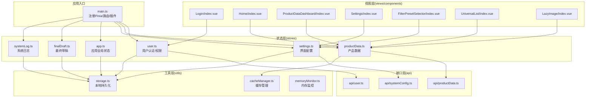
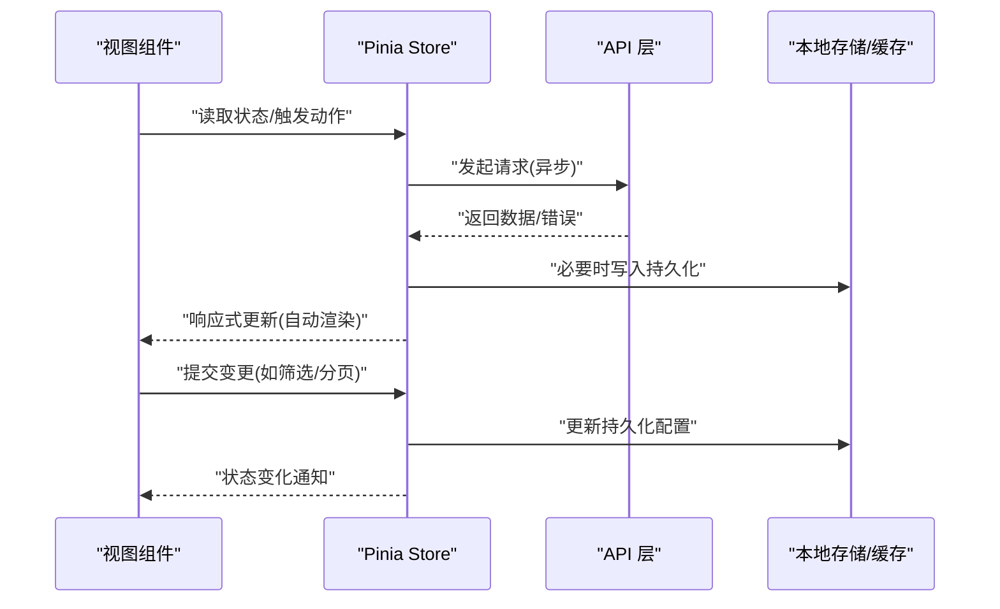
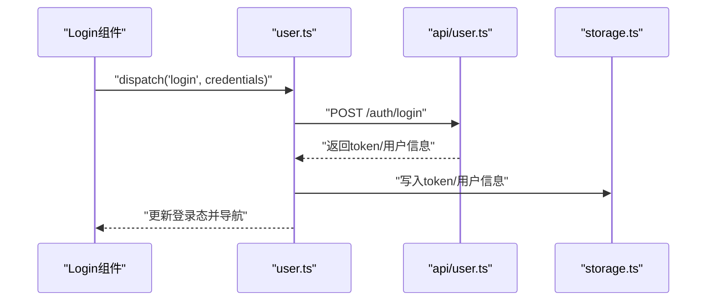
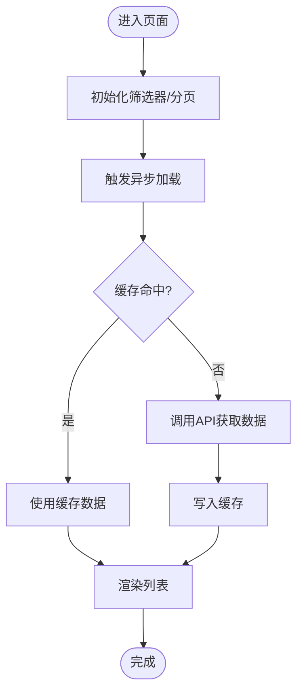
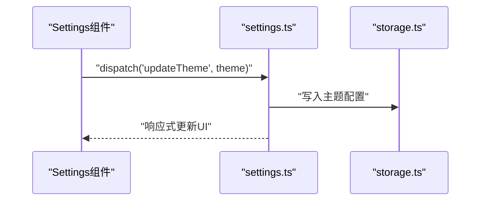
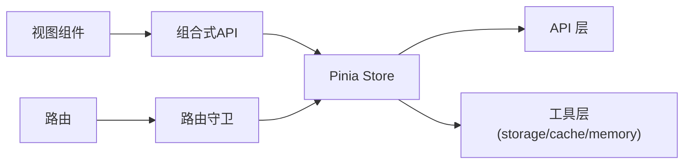

# 状态管理

<cite>
**本文引用的文件**
- [frontend/src/main.ts](file://frontend/src/main.ts)
- [frontend/src/stores/app.ts](file://frontend/src/stores/app.ts)
- [frontend/src/stores/user.ts](file://frontend/src/stores/user.ts)
- [frontend/src/stores/productData.ts](file://frontend/src/stores/productData.ts)
- [frontend/src/stores/settings.ts](file://frontend/src/stores/settings.ts)
- [frontend/src/stores/finalDraft.ts](file://frontend/src/stores/finalDraft.ts)
- [frontend/src/stores/systemLog.ts](file://frontend/src/stores/systemLog.ts)
- [frontend/src/utils/storage.ts](file://frontend/src/utils/storage.ts)
- [frontend/src/utils/cacheManager.ts](file://frontend/src/utils/cacheManager.ts)
- [frontend/src/utils/memoryMonitor.ts](file://frontend/src/utils/memoryMonitor.ts)
- [frontend/src/api/user.ts](file://frontend/src/api/user.ts)
- [frontend/src/api/productData.ts](file://frontend/src/api/productData.ts)
- [frontend/src/api/systemConfig.ts](file://frontend/src/api/systemConfig.ts)
- [frontend/src/router/index.ts](file://frontend/src/router/index.ts)
- [frontend/src/views/Login/index.vue](file://frontend/src/views/Login/index.vue)
- [frontend/src/views/Home/index.vue](file://frontend/src/views/Home/index.vue)
- [frontend/src/views/ProductDataDashboard/index.vue](file://frontend/src/views/ProductDataDashboard/index.vue)
- [frontend/src/views/Settings/index.vue](file://frontend/src/views/Settings/index.vue)
- [frontend/src/components/FilterPresetSelector/index.vue](file://frontend/src/components/FilterPresetSelector/index.vue)
- [frontend/src/components/UniversalList/index.vue](file://frontend/src/components/UniversalList/index.vue)
- [frontend/src/components/LazyImage/index.vue](file://frontend/src/components/LazyImage/index.vue)
</cite>

## 目录
1. [引言](#引言)
2. [项目结构](#项目结构)
3. [核心组件](#核心组件)
4. [架构总览](#架构总览)
5. [详细组件分析](#详细组件分析)
6. [依赖分析](#依赖分析)
7. [性能考虑](#性能考虑)
8. [故障排查指南](#故障排查指南)
9. [结论](#结论)
10. [附录](#附录)

## 引言
本指南围绕前端基于 Pinia 的状态管理进行系统性梳理，覆盖状态管理模式、Store 设计与数据持久化策略，详解应用状态、用户状态与系统配置的状态管理；阐述状态同步、异步状态处理与状态订阅机制；给出用户认证、产品数据与界面配置等 Store 的实现要点与最佳实践，并说明状态与组件的绑定方式、状态更新触发与副作用处理，以及调试工具、性能优化与内存管理建议。

## 项目结构
前端采用模块化组织，状态管理集中在 stores 目录，通过 main.ts 注册并挂载到应用实例。各 Store 职责清晰：用户状态、产品数据、系统日志、最终草稿、应用全局状态与设置等。API 层负责与后端交互，组件层通过组合式 API 或模板语法与 Store 绑定。

图表来源
- [frontend/src/main.ts](file://frontend/src/main.ts)
- [frontend/src/stores/user.ts](file://frontend/src/stores/user.ts)
- [frontend/src/stores/productData.ts](file://frontend/src/stores/productData.ts)
- [frontend/src/stores/settings.ts](file://frontend/src/stores/settings.ts)
- [frontend/src/stores/app.ts](file://frontend/src/stores/app.ts)
- [frontend/src/stores/finalDraft.ts](file://frontend/src/stores/finalDraft.ts)
- [frontend/src/stores/systemLog.ts](file://frontend/src/stores/systemLog.ts)
- [frontend/src/utils/storage.ts](file://frontend/src/utils/storage.ts)
- [frontend/src/utils/cacheManager.ts](file://frontend/src/utils/cacheManager.ts)
- [frontend/src/utils/memoryMonitor.ts](file://frontend/src/utils/memoryMonitor.ts)
- [frontend/src/api/user.ts](file://frontend/src/api/user.ts)
- [frontend/src/api/productData.ts](file://frontend/src/api/productData.ts)
- [frontend/src/api/systemConfig.ts](file://frontend/src/api/systemConfig.ts)
- [frontend/src/views/Login/index.vue](file://frontend/src/views/Login/index.vue)
- [frontend/src/views/Home/index.vue](file://frontend/src/views/Home/index.vue)
- [frontend/src/views/ProductDataDashboard/index.vue](file://frontend/src/views/ProductDataDashboard/index.vue)
- [frontend/src/views/Settings/index.vue](file://frontend/src/views/Settings/index.vue)
- [frontend/src/components/FilterPresetSelector/index.vue](file://frontend/src/components/FilterPresetSelector/index.vue)
- [frontend/src/components/UniversalList/index.vue](file://frontend/src/components/UniversalList/index.vue)
- [frontend/src/components/LazyImage/index.vue](file://frontend/src/components/LazyImage/index.vue)

章节来源
- [frontend/src/main.ts](file://frontend/src/main.ts)
- [frontend/src/stores/user.ts](file://frontend/src/stores/user.ts)
- [frontend/src/stores/productData.ts](file://frontend/src/stores/productData.ts)
- [frontend/src/stores/settings.ts](file://frontend/src/stores/settings.ts)
- [frontend/src/stores/app.ts](file://frontend/src/stores/app.ts)
- [frontend/src/stores/finalDraft.ts](file://frontend/src/stores/finalDraft.ts)
- [frontend/src/stores/systemLog.ts](file://frontend/src/stores/systemLog.ts)

## 核心组件
- 应用入口与状态注册：在入口文件中完成 Pinia 安装、路由与插件初始化，确保 Store 在整个应用生命周期内可用。
- 用户状态（user.ts）：集中管理登录态、用户信息、权限与会话持久化。
- 产品数据（productData.ts）：封装产品列表、筛选条件、分页与搜索状态，支持异步加载与缓存。
- 界面配置（settings.ts）：保存主题、语言、布局偏好等用户界面相关配置。
- 应用全局状态（app.ts）：应用级开关、加载状态、错误提示等。
- 最终草稿（finalDraft.ts）：与最终草稿相关的临时状态与进度。
- 系统日志（systemLog.ts）：系统运行日志的采集与展示状态。

章节来源
- [frontend/src/main.ts](file://frontend/src/main.ts)
- [frontend/src/stores/user.ts](file://frontend/src/stores/user.ts)
- [frontend/src/stores/productData.ts](file://frontend/src/stores/productData.ts)
- [frontend/src/stores/settings.ts](file://frontend/src/stores/settings.ts)
- [frontend/src/stores/app.ts](file://frontend/src/stores/app.ts)
- [frontend/src/stores/finalDraft.ts](file://frontend/src/stores/finalDraft.ts)
- [frontend/src/stores/systemLog.ts](file://frontend/src/stores/systemLog.ts)

## 架构总览
Pinia Store 作为单一事实来源，通过 API 层与后端交互，组件通过组合式 API 订阅 Store 状态并在变更时自动重渲染。持久化策略采用本地存储与缓存管理相结合的方式，确保状态在刷新后仍可恢复且具备良好的性能表现。

图表来源
- [frontend/src/stores/user.ts](file://frontend/src/stores/user.ts)
- [frontend/src/stores/productData.ts](file://frontend/src/stores/productData.ts)
- [frontend/src/stores/settings.ts](file://frontend/src/stores/settings.ts)
- [frontend/src/api/user.ts](file://frontend/src/api/user.ts)
- [frontend/src/api/productData.ts](file://frontend/src/api/productData.ts)
- [frontend/src/api/systemConfig.ts](file://frontend/src/api/systemConfig.ts)
- [frontend/src/utils/storage.ts](file://frontend/src/utils/storage.ts)
- [frontend/src/utils/cacheManager.ts](file://frontend/src/utils/cacheManager.ts)

## 详细组件分析

### 用户认证状态（user.ts）
- 职责边界：维护登录态、用户信息、权限集合与会话过期处理。
- 数据结构：包含用户标识、角色/权限、登录时间戳、令牌等关键字段。
- 异步处理：登录/登出调用后端接口，成功后写入本地持久化；失败时统一错误处理。
- 订阅机制：组件通过组合式 API 订阅用户状态，自动响应登录/登出事件。
- 副作用：登出时清理本地存储、重置路由与菜单权限；登录成功后拉取权限并跳转首页。

图表来源
- [frontend/src/stores/user.ts](file://frontend/src/stores/user.ts)
- [frontend/src/api/user.ts](file://frontend/src/api/user.ts)
- [frontend/src/utils/storage.ts](file://frontend/src/utils/storage.ts)
- [frontend/src/views/Login/index.vue](file://frontend/src/views/Login/index.vue)

章节来源
- [frontend/src/stores/user.ts](file://frontend/src/stores/user.ts)
- [frontend/src/api/user.ts](file://frontend/src/api/user.ts)
- [frontend/src/utils/storage.ts](file://frontend/src/utils/storage.ts)
- [frontend/src/views/Login/index.vue](file://frontend/src/views/Login/index.vue)

### 产品数据状态（productData.ts）
- 职责边界：管理产品列表、筛选条件、分页、搜索关键词与加载状态。
- 数据结构：包含列表数组、总数、当前页、每页大小、筛选器快照与缓存键。
- 异步处理：分页/筛选/搜索均通过异步动作触发，避免阻塞 UI；成功后合并/替换列表并更新缓存。
- 订阅机制：列表组件订阅状态，自动根据筛选器变化重新渲染。
- 副作用：根据筛选器生成缓存键，命中则优先返回缓存；未命中再请求接口并写入缓存。

图表来源
- [frontend/src/stores/productData.ts](file://frontend/src/stores/productData.ts)
- [frontend/src/api/productData.ts](file://frontend/src/api/productData.ts)
- [frontend/src/utils/cacheManager.ts](file://frontend/src/utils/cacheManager.ts)
- [frontend/src/views/ProductDataDashboard/index.vue](file://frontend/src/views/ProductDataDashboard/index.vue)
- [frontend/src/components/FilterPresetSelector/index.vue](file://frontend/src/components/FilterPresetSelector/index.vue)
- [frontend/src/components/UniversalList/index.vue](file://frontend/src/components/UniversalList/index.vue)

章节来源
- [frontend/src/stores/productData.ts](file://frontend/src/stores/productData.ts)
- [frontend/src/api/productData.ts](file://frontend/src/api/productData.ts)
- [frontend/src/utils/cacheManager.ts](file://frontend/src/utils/cacheManager.ts)
- [frontend/src/views/ProductDataDashboard/index.vue](file://frontend/src/views/ProductDataDashboard/index.vue)
- [frontend/src/components/FilterPresetSelector/index.vue](file://frontend/src/components/FilterPresetSelector/index.vue)
- [frontend/src/components/UniversalList/index.vue](file://frontend/src/components/UniversalList/index.vue)

### 界面配置状态（settings.ts）
- 职责边界：保存主题、语言、布局、列宽、是否启用暗色模式等界面偏好。
- 数据结构：键值对形式的配置对象，支持默认值与校验。
- 异步处理：配置变更通常为本地操作，无需网络请求；必要时可同步至后端以实现多端一致性。
- 订阅机制：UI 组件直接订阅配置项，实时响应主题/布局切换。
- 副作用：变更主题时动态注入样式或切换类名；变更语言时触发 i18n 切换。

图表来源
- [frontend/src/stores/settings.ts](file://frontend/src/stores/settings.ts)
- [frontend/src/utils/storage.ts](file://frontend/src/utils/storage.ts)
- [frontend/src/views/Settings/index.vue](file://frontend/src/views/Settings/index.vue)

章节来源
- [frontend/src/stores/settings.ts](file://frontend/src/stores/settings.ts)
- [frontend/src/utils/storage.ts](file://frontend/src/utils/storage.ts)
- [frontend/src/views/Settings/index.vue](file://frontend/src/views/Settings/index.vue)

### 应用全局状态（app.ts）
- 职责边界：应用级开关、加载指示、错误提示、侧边栏折叠状态等。
- 数据结构：布尔开关、字符串消息、枚举状态等。
- 异步处理：用于协调异步流程的可视化反馈，如加载动画、错误弹窗。
- 订阅机制：全局布局组件订阅该状态，统一控制布局与提示。
- 副作用：在路由切换或异常时自动更新提示信息与加载状态。

章节来源
- [frontend/src/stores/app.ts](file://frontend/src/stores/app.ts)
- [frontend/src/views/Home/index.vue](file://frontend/src/views/Home/index.vue)

### 最终草稿状态（finalDraft.ts）
- 职责边界：与最终草稿相关的临时状态、进度条、草稿内容预览等。
- 数据结构：草稿 ID、标题、内容片段、进度百分比等。
- 异步处理：草稿保存/提交可能涉及多次请求，需保持 UI 反馈一致。
- 订阅机制：草稿详情页订阅该状态，保证编辑过程中的状态同步。
- 副作用：保存成功后清理临时状态，提交完成后跳转列表页。

章节来源
- [frontend/src/stores/finalDraft.ts](file://frontend/src/stores/finalDraft.ts)
- [frontend/src/views/FinalDraft/index.vue](file://frontend/src/views/FinalDraft/index.vue)

### 系统日志状态（systemLog.ts）
- 职责边界：系统运行日志的采集、过滤与展示状态。
- 数据结构：日志数组、过滤器、滚动位置、是否自动滚动等。
- 异步处理：日志流式推送或定时拉取，避免阻塞主线程。
- 订阅机制：日志面板组件订阅状态，自动滚动到最新日志。
- 副作用：超过阈值时清理旧日志，释放内存。

章节来源
- [frontend/src/stores/systemLog.ts](file://frontend/src/stores/systemLog.ts)
- [frontend/src/views/SystemLog/index.vue](file://frontend/src/views/SystemLog/index.vue)

## 依赖分析
- 组件与 Store 的耦合：组件通过组合式 API 订阅 Store，降低耦合度；仅在需要时引入对应 Store。
- Store 与 API 的依赖：Store 通过 API 层访问后端，避免直接依赖具体实现。
- 工具层支撑：storage.ts 与 cacheManager.ts 为 Store 提供持久化与缓存能力，memoryMonitor.ts 用于监控内存占用。
- 路由与守卫：路由在进入受保护页面前检查用户状态，确保安全与一致性。

图表来源
- [frontend/src/router/index.ts](file://frontend/src/router/index.ts)
- [frontend/src/stores/user.ts](file://frontend/src/stores/user.ts)
- [frontend/src/utils/storage.ts](file://frontend/src/utils/storage.ts)
- [frontend/src/utils/cacheManager.ts](file://frontend/src/utils/cacheManager.ts)
- [frontend/src/utils/memoryMonitor.ts](file://frontend/src/utils/memoryMonitor.ts)

章节来源
- [frontend/src/router/index.ts](file://frontend/src/router/index.ts)
- [frontend/src/stores/user.ts](file://frontend/src/stores/user.ts)
- [frontend/src/utils/storage.ts](file://frontend/src/utils/storage.ts)
- [frontend/src/utils/cacheManager.ts](file://frontend/src/utils/cacheManager.ts)
- [frontend/src/utils/memoryMonitor.ts](file://frontend/src/utils/memoryMonitor.ts)

## 性能考虑
- 响应式粒度：按需订阅状态，避免大对象全量监听；拆分细粒度 Store 以减少重渲染范围。
- 缓存策略：利用缓存管理器对高频查询结果进行缓存，命中则直接返回，未命中再请求接口。
- 内存管理：定期清理过期日志与临时数据；对大数据列表采用虚拟滚动与懒加载。
- 并发控制：对频繁触发的动作进行去抖/节流，避免重复请求。
- 持久化优化：本地存储采用结构化写入，避免冗余字段；对敏感信息加密存储。

## 故障排查指南
- 登录失败：检查用户 Store 的登录动作是否正确调用 API，确认错误分支是否捕获并提示。
- 列表不更新：确认筛选器变化是否触发了正确的异步动作；检查缓存键是否正确生成。
- 主题切换无效：检查设置 Store 是否写入本地存储，组件是否订阅了对应配置项。
- 内存增长：使用内存监控工具定位泄漏点，检查是否保留了不必要的引用或未清理的定时器。
- 路由守卫失效：确认路由守卫是否正确读取用户状态，登录态过期时是否重定向到登录页。

章节来源
- [frontend/src/stores/user.ts](file://frontend/src/stores/user.ts)
- [frontend/src/stores/productData.ts](file://frontend/src/stores/productData.ts)
- [frontend/src/stores/settings.ts](file://frontend/src/stores/settings.ts)
- [frontend/src/utils/memoryMonitor.ts](file://frontend/src/utils/memoryMonitor.ts)
- [frontend/src/router/index.ts](file://frontend/src/router/index.ts)

## 结论
本项目采用 Pinia 进行状态管理，通过职责清晰的 Store、严格的异步处理与持久化策略，实现了用户认证、产品数据与界面配置等核心领域的稳定状态管理。配合缓存与内存监控工具，能够在复杂业务场景下保持良好的性能与可维护性。建议持续遵循“按需订阅、细粒度拆分、强约束持久化”的设计原则，逐步完善调试与可观测性能力。

## 附录
- 状态调试：在开发环境下开启 Pinia Devtools，观察 actions/mutations 与状态树变化，定位异步流程与副作用。
- 最佳实践清单：
  - 将副作用收敛到 Store 动作内部，避免分散在组件中。
  - 对外暴露只读派生状态，内部维护可变状态。
  - 使用类型定义明确状态结构，便于协作与重构。
  - 对高频动作进行去抖/节流，提升交互流畅度。
  - 对大列表采用虚拟滚动与懒加载，降低渲染压力。
  - 对敏感数据进行本地加密存储，防止泄露。