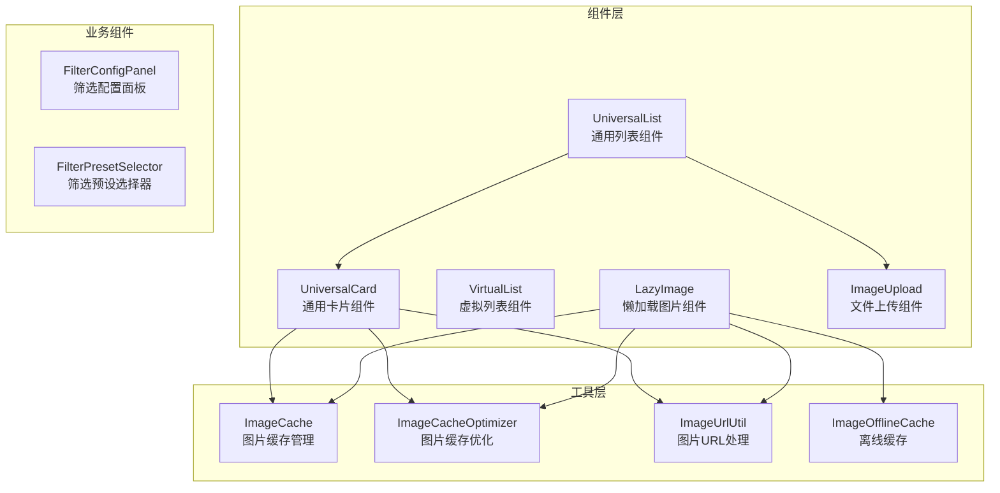
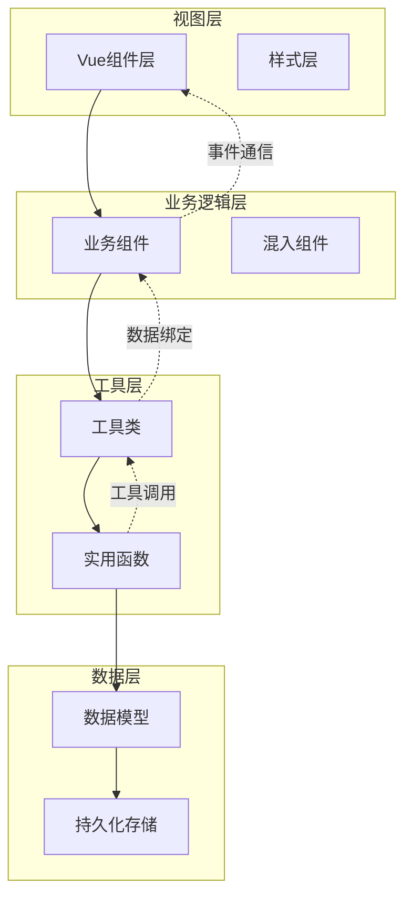
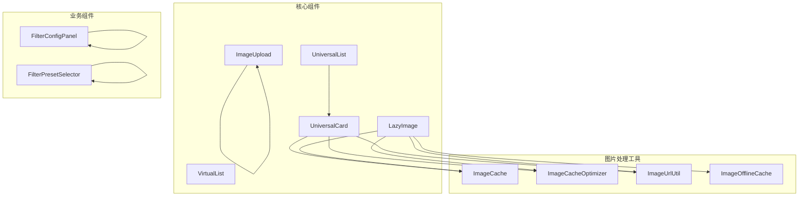

# UI组件开发

<cite>
**本文档引用的文件**
- [UniversalCard/index.vue](file://frontend/src/components/UniversalCard/index.vue)
- [UniversalList/index.vue](file://frontend/src/components/UniversalList/index.vue)
- [VirtualList/index.vue](file://frontend/src/components/VirtualList/index.vue)
- [LazyImage/index.vue](file://frontend/src/components/LazyImage/index.vue)
- [ImageUpload/index.vue](file://frontend/src/components/ImageUpload/index.vue)
- [UniversalCard/index.test.ts](file://frontend/src/components/UniversalCard/index.test.ts)
- [UniversalList/index.test.ts](file://frontend/src/components/UniversalList/index.test.ts)
- [imageCache.ts](file://frontend/src/utils/imageCache.ts)
- [imageCacheOptimizer.ts](file://frontend/src/utils/imageCacheOptimizer.ts)
- [imageUrlUtil.ts](file://frontend/src/utils/imageUrlUtil.ts)
- [imageOfflineCache.ts](file://frontend/src/utils/imageOfflineCache.ts)
- [FilterConfigPanel/index.vue](file://frontend/src/components/FilterConfigPanel/index.vue)
- [FilterPresetSelector/index.vue](file://frontend/src/components/FilterPresetSelector/index.vue)
</cite>

## 目录
1. [简介](#简介)
2. [项目结构](#项目结构)
3. [核心组件](#核心组件)
4. [架构概览](#架构概览)
5. [详细组件分析](#详细组件分析)
6. [依赖关系分析](#依赖关系分析)
7. [性能考虑](#性能考虑)
8. [故障排除指南](#故障排除指南)
9. [结论](#结论)
10. [附录](#附录)

## 简介

本指南专注于UI组件开发的最佳实践，深入解释通用UI组件的设计原则和实现模式。项目包含多个核心组件：UniversalCard（通用卡片）、UniversalList（通用列表）、VirtualList（虚拟列表），以及专门的LazyImage（懒加载图片）和ImageUpload（文件上传）组件。

这些组件采用Vue 3 Composition API和TypeScript实现，具备高度的可复用性和可维护性。通过统一的组件设计模式，开发者可以快速构建复杂的用户界面，同时确保良好的性能表现和用户体验。

## 项目结构

项目采用模块化的组件组织方式，每个组件都是独立的功能单元，具有清晰的职责边界和接口定义。



**图表来源**
- [UniversalCard/index.vue:1-821](file://frontend/src/components/UniversalCard/index.vue#L1-L821)
- [UniversalList/index.vue:1-379](file://frontend/src/components/UniversalList/index.vue#L1-L379)
- [VirtualList/index.vue:1-168](file://frontend/src/components/VirtualList/index.vue#L1-L168)
- [LazyImage/index.vue:1-375](file://frontend/src/components/LazyImage/index.vue#L1-L375)
- [ImageUpload/index.vue:1-167](file://frontend/src/components/ImageUpload/index.vue#L1-L167)

**章节来源**
- [UniversalCard/index.vue:1-821](file://frontend/src/components/UniversalCard/index.vue#L1-L821)
- [UniversalList/index.vue:1-379](file://frontend/src/components/UniversalList/index.vue#L1-L379)
- [VirtualList/index.vue:1-168](file://frontend/src/components/VirtualList/index.vue#L1-L168)
- [LazyImage/index.vue:1-375](file://frontend/src/components/LazyImage/index.vue#L1-L375)
- [ImageUpload/index.vue:1-167](file://frontend/src/components/ImageUpload/index.vue#L1-L167)

## 核心组件

### UniversalCard - 通用卡片组件

UniversalCard是整个UI系统的核心组件，提供了丰富的展示和交互功能。它支持两种模式：产品模式和选品模式，能够根据不同的业务场景动态调整显示内容。

**主要特性：**
- 支持产品详情和选品详情两种展示模式
- 动态徽章系统（新品、竞品、等级、时效）
- 图片懒加载和错误处理
- 交互式操作按钮（查看、删除、选中）
- 自适应布局和响应式设计

**关键实现要点：**
- 使用模式配置系统实现灵活的内容展示
- 集成多种图片处理策略（缩略图、原图、本地路径）
- 实现完整的事件冒泡控制和用户交互反馈

**章节来源**
- [UniversalCard/index.vue:142-462](file://frontend/src/components/UniversalCard/index.vue#L142-L462)

### UniversalList - 通用列表组件

UniversalList作为列表容器组件，负责管理大量数据的展示和交互。它集成了完整的CRUD操作、分页管理和导入导出功能。

**主要特性：**
- 完整的增删改查操作支持
- 分页导航和页面大小控制
- Excel导入和模板下载
- 批量操作和选择管理
- 搜索表单插槽支持

**关键实现要点：**
- 事件冒泡机制确保父子组件通信
- 统一的加载状态管理和错误处理
- 灵活的插槽系统支持自定义内容

**章节来源**
- [UniversalList/index.vue:146-331](file://frontend/src/components/UniversalList/index.vue#L146-L331)

### VirtualList - 虚拟列表组件

VirtualList实现了高性能的虚拟滚动，能够处理大量数据的流畅展示。通过计算可见区域和动态渲染，显著提升大数据量场景下的性能表现。

**主要特性：**
- 基于绝对定位的虚拟滚动实现
- 可配置的缓冲区大小
- 滚动事件监听和可见项通知
- 灵活的插槽系统支持自定义项渲染

**关键实现要点：**
- 精确的可见范围计算算法
- 高效的DOM节点复用机制
- 平滑的滚动体验和性能优化

**章节来源**
- [VirtualList/index.vue:29-139](file://frontend/src/components/VirtualList/index.vue#L29-L139)

### LazyImage - 懒加载图片组件

LazyImage提供了完整的图片加载解决方案，包括懒加载、错误处理、缓存管理和预加载功能。

**主要特性：**
- 多级缓存策略（内存、localStorage、IndexedDB）
- 智能URL处理和代理机制
- 错误重试和降级处理
- 支持背景图和内联图片两种渲染模式

**关键实现要点：**
- 复杂的缓存层级管理和失效处理
- 高效的图片URL生成和优化
- 完善的错误处理和用户体验保障

**章节来源**
- [LazyImage/index.vue:53-280](file://frontend/src/components/LazyImage/index.vue#L53-L280)

### ImageUpload - 文件上传组件

ImageUpload基于Element Plus的Upload组件封装，提供了完整的文件上传功能，包括验证、进度显示和预览功能。

**主要特性：**
- 多文件上传支持和数量限制
- 文件类型和大小验证
- 拖拽上传和预览功能
- 自动认证和错误处理

**关键实现要点：**
- 统一的上传接口和认证机制
- 完善的文件验证和错误提示
- 用户友好的上传状态反馈

**章节来源**
- [ImageUpload/index.vue:37-111](file://frontend/src/components/ImageUpload/index.vue#L37-L111)

## 架构概览

项目采用分层架构设计，各组件之间通过清晰的接口进行通信，实现了高内聚低耦合的设计目标。



**图表来源**
- [UniversalCard/index.vue:142-170](file://frontend/src/components/UniversalCard/index.vue#L142-L170)
- [UniversalList/index.vue:146-201](file://frontend/src/components/UniversalList/index.vue#L146-L201)
- [LazyImage/index.vue:53-124](file://frontend/src/components/LazyImage/index.vue#L53-L124)

## 详细组件分析

### UniversalCard 组件深度分析

UniversalCard组件展现了现代Vue组件开发的最佳实践，通过精心设计的接口和事件系统实现了高度的可复用性。

#### 组件接口设计

组件通过TypeScript接口定义了清晰的props和emits规范：

```typescript
interface Props {
  product: Record<string, any>
  selected?: boolean
  mode?: 'product' | 'selection'
  isSelectedByMe?: boolean
  selectedByUsers?: { userId: number; userName: string }[]
}

interface Emits {
  (e: 'click', product: Record<string, any>): void
  (e: 'select', id: string | number, selected: boolean): void
  (e: 'toggle-select', asin: string, selected: boolean): void
  (e: 'delete', product: Record<string, any>): void
  (e: 'view', product: Record<string, any>): void
}
```

#### 动态模式系统

组件的核心创新在于模式系统，能够根据不同的业务场景动态调整显示内容：

```javascript
const modeConfig = computed(() => {
  if (props.mode === 'selection') {
    return {
      showId: true,
      idField: 'asin',
      showTitle: true,
      titleField: 'productTitle',
      showMeta: true,
      showTags: true,
      showTypeBadge: true,
      typeField: 'productType',
      showTypeTag: false,
      showCreateTime: true,
      showViewButton: true,
      showSalesVolume: true
    }
  }
  return {
    showId: true,
    idField: 'sku',
    showTitle: true,
    titleField: 'name',
    showMeta: false,
    showTags: false,
    showTypeBadge: false,
    typeField: null,
    showTypeTag: true,
    showCreateTime: false,
    showViewButton: false,
    showSalesVolume: false
  }
})
```

#### 性能优化策略

组件实现了多项性能优化措施：
- 计算属性缓存避免重复计算
- 条件渲染减少DOM节点
- 事件防抖和节流处理
- 懒加载图片提升首屏性能

**章节来源**
- [UniversalCard/index.vue:147-462](file://frontend/src/components/UniversalCard/index.vue#L147-L462)

### UniversalList 组件深度分析

UniversalList作为列表容器，展现了复杂业务场景下的组件设计模式。

#### 事件系统设计

组件通过事件冒泡实现了父子组件间的松耦合通信：

```javascript
const handleCardClick = (item: any): void => {
  emit('card-click', item)
}

const handleSelect = (id: string | number, selected: boolean): void => {
  emit('select', id, selected)
}

const handleView = (item: any): void => {
  emit('view', item)
}

const handleDelete = async (item: any): Promise<void> => {
  try {
    await ElMessageBox.confirm(
      `确定要删除该项目吗？`,
      '确认删除',
      {
        confirmButtonText: '确定',
        cancelButtonText: '取消',
        type: 'warning'
      }
    )
    emit('delete', item)
  } catch (error: any) {
    if (error !== 'cancel') {
      ElMessage.error('删除失败')
    }
  }
}
```

#### 分页和搜索功能

组件集成了完整的数据管理功能：

```javascript
const handleSizeChange = (size: number): void => {
  emit('size-change', size)
}

const handlePageChange = (page: number): void => {
  emit('page-change', page)
}

const handleSearch = (): void => {
  emit('search')
}
```

**章节来源**
- [UniversalList/index.vue:217-294](file://frontend/src/components/UniversalList/index.vue#L217-L294)

### VirtualList 组件深度分析

VirtualList展示了高性能列表渲染的技术实现。

#### 虚拟滚动算法

组件的核心是高效的虚拟滚动算法：

```javascript
const calculateVisibleRange = () => {
  if (!containerRef.value) return

  const containerHeight = containerRef.value.clientHeight
  const bufferSize = props.bufferSize || 20
  
  // 计算可见起始索引
  const start = Math.floor(scrollTop.value / props.itemHeight) - bufferSize
  // 计算可见结束索引
  const end = Math.ceil((scrollTop.value + containerHeight) / props.itemHeight) + bufferSize
  
  startIndex.value = Math.max(0, start)
  endIndex.value = Math.min(props.items.length - 1, end)
  
  // 触发可见项变化事件
  emit('visibleChange', visibleItems.value)
}
```

#### 性能监控

组件实现了完整的性能监控机制：

```javascript
// 监听数据源变化
watch(
  () => props.items,
  () => {
    calculateVisibleRange()
  },
  { deep: true }
)

// 监听容器高度变化
watch(
  () => props.containerHeight,
  () => {
    calculateVisibleRange()
  }
)
```

**章节来源**
- [VirtualList/index.vue:86-138](file://frontend/src/components/VirtualList/index.vue#L86-L138)

### LazyImage 组件深度分析

LazyImage组件展现了复杂图片处理系统的实现细节。

#### 多级缓存架构

组件实现了三层缓存架构：

```typescript
// 1. 内存缓存（ImageCacheOptimizer）
const memoryCached = imageCacheOptimizer.getImage(cacheKey)

// 2. IndexedDB离线缓存（ImageOfflineCache）
const offlineCached = await imageOfflineCache.getImage(cacheKey)

// 3. localStorage缓存（ImageCache）
const cachedUrl = imageCache.getImageUrl(cacheKey)
```

#### 图片URL处理策略

组件提供了智能的图片URL处理：

```javascript
static async getThumbnailUrl(
  originalUrl: string, 
  size: ImageSize = 'large',
  options: { useOfflineCache?: boolean } = {}
): Promise<string> {
  // 优先级1: 内存缓存
  // 优先级2: IndexedDB离线缓存
  // 优先级3: localStorage缓存
  // 优先级4: 本地服务器路径
  // 优先级5: 代理URL
}
```

**章节来源**
- [LazyImage/index.vue:134-279](file://frontend/src/components/LazyImage/index.vue#L134-L279)

### ImageUpload 组件深度分析

ImageUpload组件提供了完整的文件上传解决方案。

#### 文件验证机制

组件实现了多层次的文件验证：

```javascript
const beforeUpload = (file) => {
  const isValidType = props.acceptTypes.includes(file.type)
  const isValidSize = file.size / 1024 / 1024 < props.maxSize

  if (!isValidType) {
    ElMessage.error('只能上传JPG、PNG、GIF、WebP格式的图片！')
    return false
  }
  if (!isValidSize) {
    ElMessage.error(`图片大小不能超过${props.maxSize}MB！`)
    return false
  }
  return true
}
```

#### 上传状态管理

组件提供了完整的上传状态反馈：

```javascript
const handleSuccess = (response, file, fileList) => {
  ElMessage.success('上传成功')
  emit('update:modelValue', fileList)
  emit('upload-success', fileList)
}

const handleError = (error, _file, _fileList) => {
  ElMessage.error('上传失败')
  console.error('上传错误:', error)
}
```

**章节来源**
- [ImageUpload/index.vue:73-110](file://frontend/src/components/ImageUpload/index.vue#L73-L110)

## 依赖关系分析

项目组件间形成了清晰的依赖关系网络，体现了良好的模块化设计。



**图表来源**
- [UniversalCard/index.vue:143-145](file://frontend/src/components/UniversalCard/index.vue#L143-L145)
- [LazyImage/index.vue:56-58](file://frontend/src/components/LazyImage/index.vue#L56-L58)
- [imageUrlUtil.ts:1-5](file://frontend/src/utils/imageUrlUtil.ts#L1-L5)

### 组件耦合度分析

- **低耦合设计**：各组件通过props和events进行通信，避免直接依赖
- **单一职责**：每个组件专注于特定功能，职责明确
- **可替换性**：组件接口设计允许在不影响其他组件的情况下替换实现

### 外部依赖集成

组件集成了多个外部库和工具：
- Element Plus UI框架
- Vue 3 Composition API
- TypeScript类型系统
- IndexedDB离线存储

**章节来源**
- [UniversalCard/index.vue:143-145](file://frontend/src/components/UniversalCard/index.vue#L143-L145)
- [LazyImage/index.vue:56-58](file://frontend/src/components/LazyImage/index.vue#L56-L58)

## 性能考虑

项目在多个层面实现了性能优化，确保在大数据量和复杂交互场景下的流畅体验。

### 图片加载优化

#### 懒加载策略
- 基于Intersection Observer API的智能懒加载
- 预加载机制提升用户体验
- 缓存策略减少重复请求

#### 缓存层次优化
- 内存缓存：快速访问，生命周期短
- IndexedDB缓存：持久存储，适合离线访问
- localStorage缓存：轻量存储，浏览器兼容性好

### 列表渲染优化

#### 虚拟滚动
- 仅渲染可视区域内的项目
- 动态计算可见范围，避免过度渲染
- 支持缓冲区优化滚动体验

#### 数据绑定优化
- 计算属性缓存避免重复计算
- 条件渲染减少DOM节点
- 事件委托降低事件处理器数量

### 内存管理

#### 缓存清理策略
- 定期清理过期缓存
- 内存使用监控和自动清理
- 组件卸载时的资源清理

#### 性能监控
- 内存使用率监控
- 渲染性能指标跟踪
- 用户交互响应时间测量

## 故障排除指南

### 常见问题诊断

#### 图片加载失败

**症状**：图片显示加载失败状态
**原因分析**：
- 网络连接问题
- 图片URL格式错误
- 缓存失效或损坏
- 权限不足

**解决方法**：
1. 检查网络连接状态
2. 验证图片URL格式
3. 清理缓存后重试
4. 检查用户权限

#### 组件渲染异常

**症状**：组件显示异常或功能失效
**原因分析**：
- props类型不匹配
- 事件处理函数错误
- 依赖注入问题
- 生命周期钩子执行顺序错误

**解决方法**：
1. 检查props类型定义
2. 验证事件处理函数签名
3. 确认依赖注入配置
4. 调整生命周期钩子顺序

### 性能问题排查

#### 内存泄漏检测

**症状**：页面内存使用持续增长
**排查步骤**：
1. 使用浏览器开发者工具监控内存
2. 检查组件实例是否正确销毁
3. 验证事件监听器是否正确移除
4. 确认定时器和订阅是否正确清理

#### 渲染性能问题

**症状**：页面滚动卡顿或响应缓慢
**优化建议**：
1. 实施虚拟滚动
2. 减少不必要的计算属性
3. 优化CSS动画和过渡效果
4. 使用requestAnimationFrame优化动画

**章节来源**
- [LazyImage/index.vue:173-209](file://frontend/src/components/LazyImage/index.vue#L173-L209)
- [VirtualList/index.vue:136-138](file://frontend/src/components/VirtualList/index.vue#L136-L138)

## 结论

本UI组件开发指南展示了现代前端开发的最佳实践，通过精心设计的组件架构和完善的性能优化策略，为复杂应用场景提供了可靠的解决方案。

### 设计优势

1. **高度可复用性**：组件接口设计清晰，易于在不同场景下使用
2. **强健的错误处理**：完善的异常处理和降级机制
3. **优秀的性能表现**：多层缓存和虚拟渲染技术
4. **良好的可维护性**：模块化设计和清晰的依赖关系

### 技术亮点

- 智能的图片处理和缓存系统
- 高效的虚拟滚动实现
- 完善的事件通信机制
- 灵活的插槽系统设计

这些组件为后续的功能扩展和维护奠定了坚实的基础，是构建高质量前端应用的重要基石。

## 附录

### 组件测试最佳实践

#### 测试策略
- 单元测试：验证组件核心逻辑
- 集成测试：验证组件间协作
- 端到端测试：验证完整用户流程

#### 测试覆盖率要求
- 关键业务逻辑：100%覆盖率
- 组件渲染：95%以上覆盖率
- 边界条件：完整覆盖

### 版本管理建议

#### Git工作流
- 功能分支开发
- Pull Request审查
- 自动化测试集成
- 版本标签管理

#### 发布流程
- 语义化版本控制
- 变更日志维护
- 向后兼容性检查
- 文档同步更新