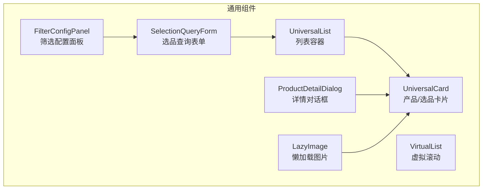
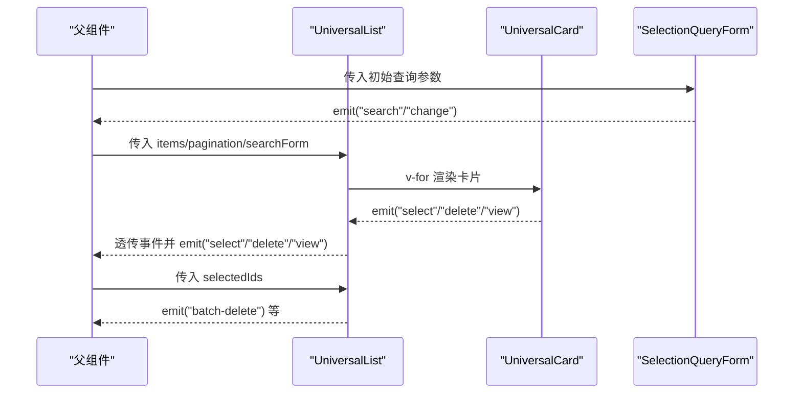
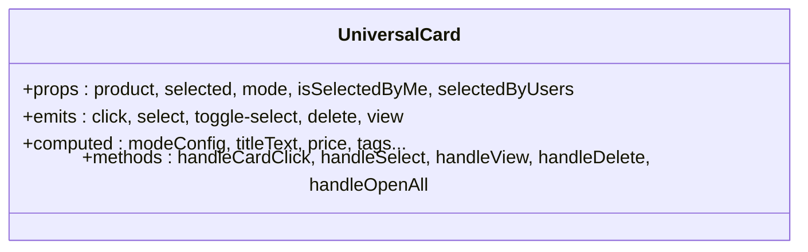
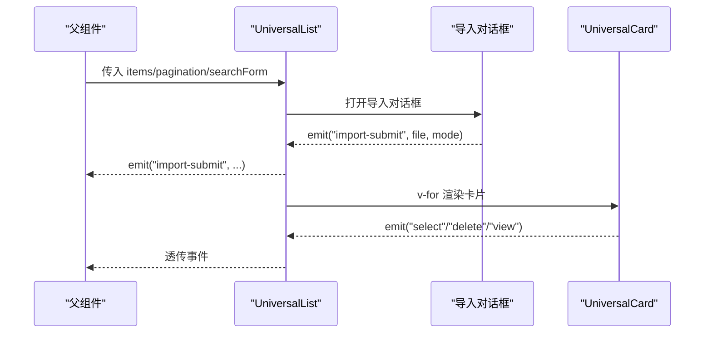
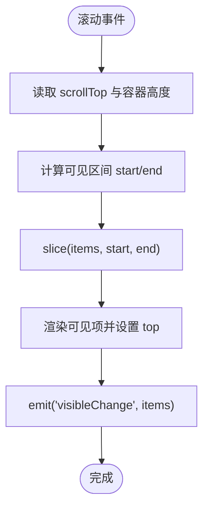
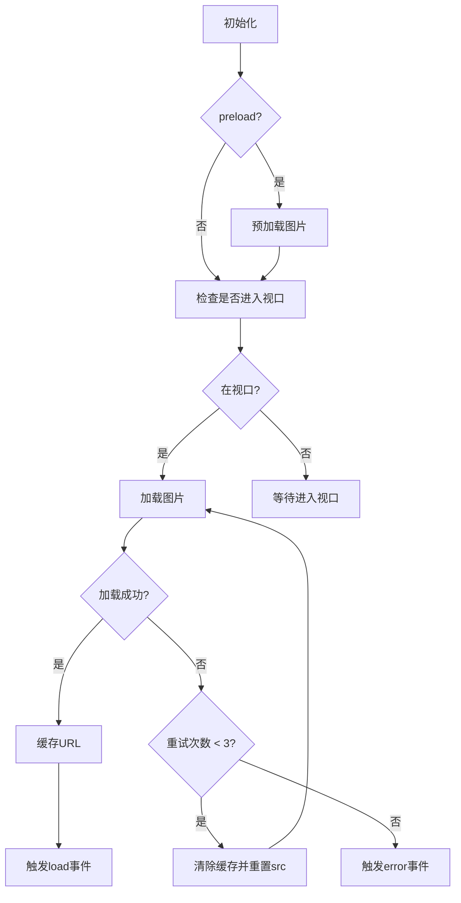
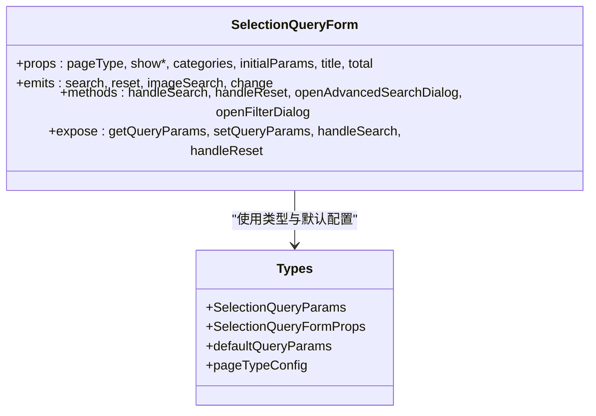
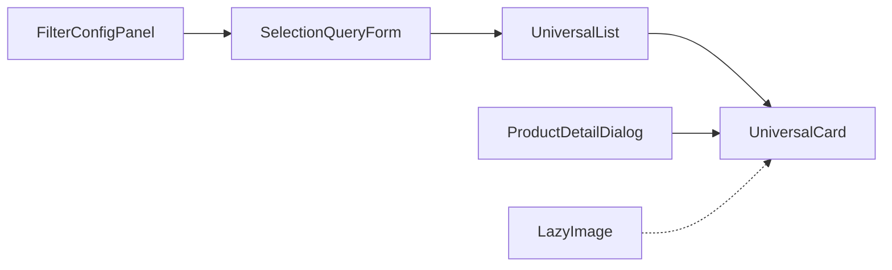

# 组件开发

<cite>
**本文引用的文件**
- [UniversalCard/index.vue](file://frontend/src/components/UniversalCard/index.vue)
- [UniversalList/index.vue](file://frontend/src/components/UniversalList/index.vue)
- [VirtualList/index.vue](file://frontend/src/components/VirtualList/index.vue)
- [LazyImage/index.vue](file://frontend/src/components/LazyImage/index.vue)
- [ProductDetailDialog/index.vue](file://frontend/src/components/ProductDetailDialog/index.vue)
- [FilterConfigPanel/index.vue](file://frontend/src/components/FilterConfigPanel/index.vue)
- [SelectionQueryForm/index.vue](file://frontend/src/components/SelectionQueryForm/index.vue)
- [SelectionQueryForm/types.ts](file://frontend/src/components/SelectionQueryForm/types.ts)
- [UniversalCard/index.test.ts](file://frontend/src/components/UniversalCard/index.test.ts)
- [UniversalList/index.test.ts](file://frontend/src/components/UniversalList/index.test.ts)
</cite>

## 目录
1. [简介](#简介)
2. [项目结构](#项目结构)
3. [核心组件](#核心组件)
4. [架构总览](#架构总览)
5. [组件详解](#组件详解)
6. [依赖关系分析](#依赖关系分析)
7. [性能考量](#性能考量)
8. [故障排查指南](#故障排查指南)
9. [结论](#结论)
10. [附录](#附录)

## 简介
本指南面向Vue.js组件开发者，围绕仓库中的通用组件库，系统讲解组件设计模式、生命周期管理、组合式API使用、通用组件库设计原则与复用策略，并结合实际组件给出属性定义、事件处理、插槽使用、父子通信、兄弟通信、测试策略、性能优化与可访问性建议。重点覆盖产品卡片、列表组件与虚拟滚动组件的实现与扩展思路。

## 项目结构
前端组件集中在 frontend/src/components 目录，按功能域划分如下：
- 通用卡片：UniversalCard
- 通用列表：UniversalList
- 虚拟列表：VirtualList
- 懒加载图片：LazyImage
- 产品详情对话框：ProductDetailDialog
- 筛选配置面板：FilterConfigPanel
- 选品查询表单：SelectionQueryForm（含类型定义）

图表来源
- [UniversalCard/index.vue:1-140](file://frontend/src/components/UniversalCard/index.vue#L1-L140)
- [UniversalList/index.vue:1-144](file://frontend/src/components/UniversalList/index.vue#L1-L144)
- [VirtualList/index.vue:1-27](file://frontend/src/components/VirtualList/index.vue#L1-L27)
- [LazyImage/index.vue:1-51](file://frontend/src/components/LazyImage/index.vue#L1-L51)
- [ProductDetailDialog/index.vue:1-464](file://frontend/src/components/ProductDetailDialog/index.vue#L1-L464)
- [FilterConfigPanel/index.vue:1-65](file://frontend/src/components/FilterConfigPanel/index.vue#L1-L65)
- [SelectionQueryForm/index.vue:1-120](file://frontend/src/components/SelectionQueryForm/index.vue#L1-L120)

章节来源
- [UniversalCard/index.vue:1-140](file://frontend/src/components/UniversalCard/index.vue#L1-L140)
- [UniversalList/index.vue:1-144](file://frontend/src/components/UniversalList/index.vue#L1-L144)
- [VirtualList/index.vue:1-27](file://frontend/src/components/VirtualList/index.vue#L1-L27)
- [LazyImage/index.vue:1-51](file://frontend/src/components/LazyImage/index.vue#L1-L51)
- [ProductDetailDialog/index.vue:1-464](file://frontend/src/components/ProductDetailDialog/index.vue#L1-L464)
- [FilterConfigPanel/index.vue:1-65](file://frontend/src/components/FilterConfigPanel/index.vue#L1-L65)
- [SelectionQueryForm/index.vue:1-120](file://frontend/src/components/SelectionQueryForm/index.vue#L1-L120)

## 核心组件
- UniversalCard：统一的产品/选品卡片，支持模式切换、徽标、标签、动作区、一键打开等，具备丰富的展示与交互能力。
- UniversalList：列表容器，聚合搜索表单插槽、卡片渲染、分页、导入对话框、批量操作等。
- VirtualList：纯虚拟滚动，基于绝对定位与可见窗口计算，仅渲染可视项，适合大数据集。
- LazyImage：图片懒加载与占位/错误处理，支持预加载、背景图模式、缓存与重试。
- ProductDetailDialog：详情弹窗，按模式展示不同字段，支持变体与子产品加载。
- FilterConfigPanel：筛选配置面板，支持初筛/精筛配置的加载、保存与联动。
- SelectionQueryForm：选品查询表单，支持紧凑/传统双模式、多选分类、日期范围、筛选对话框、以图搜图等。

章节来源
- [UniversalCard/index.vue:142-462](file://frontend/src/components/UniversalCard/index.vue#L142-L462)
- [UniversalList/index.vue:146-331](file://frontend/src/components/UniversalList/index.vue#L146-L331)
- [VirtualList/index.vue:29-139](file://frontend/src/components/VirtualList/index.vue#L29-L139)
- [LazyImage/index.vue:53-280](file://frontend/src/components/LazyImage/index.vue#L53-L280)
- [ProductDetailDialog/index.vue:466-666](file://frontend/src/components/ProductDetailDialog/index.vue#L466-L666)
- [FilterConfigPanel/index.vue:239-347](file://frontend/src/components/FilterConfigPanel/index.vue#L239-L347)
- [SelectionQueryForm/index.vue:1-411](file://frontend/src/components/SelectionQueryForm/index.vue#L1-L411)

## 架构总览
组件间通信与数据流：
- 父组件通过 props 传入数据与配置；子组件通过 emits 向上传递事件。
- UniversalList 作为容器，内部渲染 UniversalCard 并透传事件；SelectionQueryForm 作为查询入口，向外发出搜索/重置/变更事件。
- LazyImage 与 ProductDetailDialog 作为独立能力组件被其他组件复用。

图表来源
- [UniversalList/index.vue:146-331](file://frontend/src/components/UniversalList/index.vue#L146-L331)
- [UniversalCard/index.vue:142-462](file://frontend/src/components/UniversalCard/index.vue#L142-L462)
- [SelectionQueryForm/index.vue:1-411](file://frontend/src/components/SelectionQueryForm/index.vue#L1-L411)

## 组件详解

### UniversalCard：产品/选品卡片
- 设计要点
  - 模式驱动：通过 mode='product'/'selection' 切换展示字段与行为。
  - 动态徽标：新品/竞品/等级/时效标签等基于数据动态生成。
  - 事件分发：click/select/view/delete/toggle-select 等事件向上抛出。
  - 插槽与图标：Element Plus 图标与组件配合，提升可读性与一致性。
- 属性与事件
  - 属性：product、selected、mode、isSelectedByMe、selectedByUsers
  - 事件：click、select、toggle-select、delete、view
- 生命周期与组合式API
  - 使用 ref/watch/computed 管理本地状态与响应式计算，避免副作用外泄。
- 可访问性
  - 为按钮添加 title 或 aria-label；确保键盘可达；避免仅靠颜色传达语义。

图表来源
- [UniversalCard/index.vue:142-462](file://frontend/src/components/UniversalCard/index.vue#L142-L462)

章节来源
- [UniversalCard/index.vue:142-462](file://frontend/src/components/UniversalCard/index.vue#L142-L462)

### UniversalList：列表容器
- 设计要点
  - 容器化：聚合搜索表单插槽、卡片网格、分页、导入对话框、批量操作。
  - 事件透传：将卡片事件向上转发，统一由父组件处理。
  - 可配置：通过 props 控制按钮显示与文案，支持空态与加载态。
- 属性与事件
  - 属性：title/items/loading/pagination/searchForm/selectedIds/cardMode/idField/importColumns/emptyText/各按钮开关
  - 事件：add/import/download-template/recycle-bin/batch-delete/search/reset/card-click/select/view/delete/size-change/page-change/import-submit
- 交互流程
  - 导入对话框：选择模式（跳过/更新/覆盖），上传文件，提交后关闭对话框。
  - 批量删除：二次确认后触发删除事件。

图表来源
- [UniversalList/index.vue:146-331](file://frontend/src/components/UniversalList/index.vue#L146-L331)

章节来源
- [UniversalList/index.vue:146-331](file://frontend/src/components/UniversalList/index.vue#L146-L331)

### VirtualList：虚拟滚动
- 设计要点
  - 绝对定位：通过容器高度与 itemHeight 计算总高度，仅渲染可见区间。
  - 缓冲区：bufferSize 控制前后额外渲染，减少滚动抖动。
  - 可见项变化：滚动时 emit(visibleChange) 便于外部做懒加载/曝光统计。
- 属性与事件
  - 属性：items/itemHeight/keyField/containerHeight/bufferSize
  - 事件：scroll、visibleChange
- 性能
  - 仅渲染可视项，复杂渲染场景下显著降低 DOM 数量。

图表来源
- [VirtualList/index.vue:86-111](file://frontend/src/components/VirtualList/index.vue#L86-L111)

章节来源
- [VirtualList/index.vue:29-139](file://frontend/src/components/VirtualList/index.vue#L29-L139)

### LazyImage：懒加载图片
- 设计要点
  - 占位/错误/加载三态：Skeleton/错误提示/正常图片。
  - 预加载与重试：支持 preload 与最多3次重试，失败清除缓存后强制刷新。
  - 视口检测：提前100px进入视口即开始加载。
  - 背景图模式：useSpan=true 时使用背景图，适配特殊布局。
- 属性与事件
  - 属性：imageId/src/width/height/fit/preload/placeholder/errorText/previewSrcList/useSpan/size
  - 事件：load、error、click
- 与缓存集成
  - 加载成功后写入缓存；错误重试时移除缓存键。

图表来源
- [LazyImage/index.vue:153-225](file://frontend/src/components/LazyImage/index.vue#L153-L225)

章节来源
- [LazyImage/index.vue:53-280](file://frontend/src/components/LazyImage/index.vue#L53-L280)

### ProductDetailDialog：产品详情对话框
- 设计要点
  - 模式区分：product/selection 模式下字段差异较大。
  - 变体与子产品：按需加载变体与子产品，支持切换与查看。
  - 加载与空态：v-loading 控制加载态，无数据时显示空状态。
- 属性与事件
  - 属性：visible/product/mode/showEditButton/showDeleteButton
  - 事件：update:visible、edit、delete、select-product
- 交互细节
  - 打开时根据模式加载变体/子产品；关闭时清理状态。

章节来源
- [ProductDetailDialog/index.vue:466-666](file://frontend/src/components/ProductDetailDialog/index.vue#L466-L666)

### FilterConfigPanel：筛选配置面板
- 设计要点
  - 两阶段筛选：初筛（价格+评论数）与精筛（MODE1/MODE2/FAIL）。
  - 实时保存：保存后自动重新筛选，提升体验。
- 属性与事件
  - 通过 API 读取/更新配置；内部维护两个配置对象与加载状态。
- 适用场景
  - 导入流程中的自动筛选与人工调整。

章节来源
- [FilterConfigPanel/index.vue:239-347](file://frontend/src/components/FilterConfigPanel/index.vue#L239-L347)

### SelectionQueryForm：选品查询表单
- 设计要点
  - 双模式：紧凑模式（单行）与传统模式（多行）。
  - 多功能：组合搜索、多项精确搜索、筛选对话框、日期范围、以图搜图。
  - 配置化：pageType + props 合并配置，灵活控制显示项。
- 类型与配置
  - SelectionQueryParams、SelectionQueryFormProps、默认参数与页面类型配置。
- 事件
  - search/reset/imageSearch/change

图表来源
- [SelectionQueryForm/index.vue:1-411](file://frontend/src/components/SelectionQueryForm/index.vue#L1-L411)
- [SelectionQueryForm/types.ts:1-185](file://frontend/src/components/SelectionQueryForm/types.ts#L1-L185)

章节来源
- [SelectionQueryForm/index.vue:1-411](file://frontend/src/components/SelectionQueryForm/index.vue#L1-L411)
- [SelectionQueryForm/types.ts:1-185](file://frontend/src/components/SelectionQueryForm/types.ts#L1-L185)

## 依赖关系分析
- 组件内聚与耦合
  - UniversalList 与 UniversalCard 强耦合（强依赖渲染与事件透传）。
  - SelectionQueryForm 与 UniversalList 通过事件解耦（查询参数与事件向外传播）。
  - LazyImage 与 ProductDetailDialog 为独立能力组件，低耦合高复用。
- 外部依赖
  - Element Plus 组件与图标；Element Plus 消息/确认框用于交互反馈。
  - API 模块用于数据加载（如变体、子产品、筛选配置）。

图表来源
- [UniversalList/index.vue:146-331](file://frontend/src/components/UniversalList/index.vue#L146-L331)
- [UniversalCard/index.vue:142-462](file://frontend/src/components/UniversalCard/index.vue#L142-L462)
- [ProductDetailDialog/index.vue:466-666](file://frontend/src/components/ProductDetailDialog/index.vue#L466-L666)
- [LazyImage/index.vue:53-280](file://frontend/src/components/LazyImage/index.vue#L53-L280)
- [FilterConfigPanel/index.vue:239-347](file://frontend/src/components/FilterConfigPanel/index.vue#L239-L347)
- [SelectionQueryForm/index.vue:1-411](file://frontend/src/components/SelectionQueryForm/index.vue#L1-L411)

## 性能考量
- 虚拟滚动
  - VirtualList 通过缓冲区与可见区间计算，仅渲染可视项，适合大数据集。
- 图片懒加载
  - LazyImage 在进入视口前不加载，支持预加载与重试，减少首屏压力。
- 列表渲染
  - UniversalList 使用网格布局与 Element Plus 分页，避免一次性渲染过多节点。
- 计算属性与响应式
  - 将派生数据放入 computed，减少重复计算；watch 仅监听必要字段。
- 事件冒泡与防抖
  - 在高频事件中（如滚动）注意节流/防抖，避免频繁重渲染。

## 故障排查指南
- UniversalCard
  - 事件未触发：检查事件名拼写与参数顺序；确认 @click.stop 的使用是否阻断了预期冒泡。
  - 图片不显示：检查 imageId/src/size 与缩略图工具函数；确认默认图路径。
- UniversalList
  - 导入失败：检查文件类型限制与上传组件配置；确认 import-submit 事件参数。
  - 分页异常：核对 pagination.page/size/total 与 ElPagination 的绑定。
- VirtualList
  - 闪烁/空白：检查 itemHeight 与容器高度；确认 visibleChange 事件是否正确消费。
- LazyImage
  - 一直加载中：检查视口检测阈值与容器尺寸；确认预加载与重试逻辑。
- ProductDetailDialog
  - 变体/子产品不显示：确认模式与相关字段（parentAsin/marketplace/sku）；检查 API 返回。
- SelectionQueryForm
  - 日期范围不同步：watch 日期范围后需同步回 formData；确认 value-format。

章节来源
- [UniversalCard/index.vue:142-462](file://frontend/src/components/UniversalCard/index.vue#L142-L462)
- [UniversalList/index.vue:146-331](file://frontend/src/components/UniversalList/index.vue#L146-L331)
- [VirtualList/index.vue:29-139](file://frontend/src/components/VirtualList/index.vue#L29-L139)
- [LazyImage/index.vue:53-280](file://frontend/src/components/LazyImage/index.vue#L53-L280)
- [ProductDetailDialog/index.vue:466-666](file://frontend/src/components/ProductDetailDialog/index.vue#L466-L666)
- [SelectionQueryForm/index.vue:1-411](file://frontend/src/components/SelectionQueryForm/index.vue#L1-L411)

## 结论
本组件库以“容器-卡片”范式为核心，通过 props/emit 解耦组件职责，结合虚拟滚动与懒加载优化性能，辅以完善的测试用例保障质量。推荐在新业务中遵循相同的模式：容器负责组织与事件透传，卡片负责具体展示与交互；复杂能力拆分为独立组件（如 LazyImage、VirtualList）以便复用与测试。

## 附录

### 组件开发规范与最佳实践
- 属性命名与默认值
  - 使用 withDefaults 定义默认值；布尔开关尽量显式传入。
- 事件命名
  - 使用动词短语，保持与业务一致；事件参数尽量携带必要上下文。
- 插槽使用
  - 仅在必要处暴露插槽，避免过度开放导致维护成本上升。
- 组合式API
  - 将可复用逻辑抽取为 Composables；避免在模板中写复杂表达式。
- 可访问性
  - 为交互元素提供明确的标题/标签；避免仅靠颜色传达信息。
- 测试策略
  - 单元测试覆盖关键分支与边界；快照测试用于视觉回归（如需）。
- 性能优化
  - 大列表使用虚拟滚动；图片使用懒加载；合理拆分组件，避免不必要的重渲染。

### 组件测试策略（示例）
- UniversalCard
  - 断言渲染字段（ID/标题/标签/徽章）、事件发射（click/select/view/delete）、图片回退与格式化时间。
- UniversalList
  - 断言按钮显示/隐藏、分页事件、导入对话框、搜索表单插槽、卡片事件透传。

章节来源
- [UniversalCard/index.test.ts:1-409](file://frontend/src/components/UniversalCard/index.test.ts#L1-L409)
- [UniversalList/index.test.ts:1-437](file://frontend/src/components/UniversalList/index.test.ts#L1-L437)