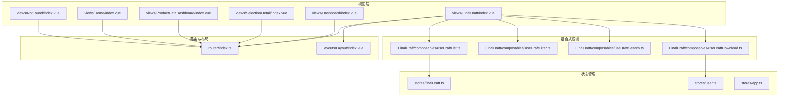
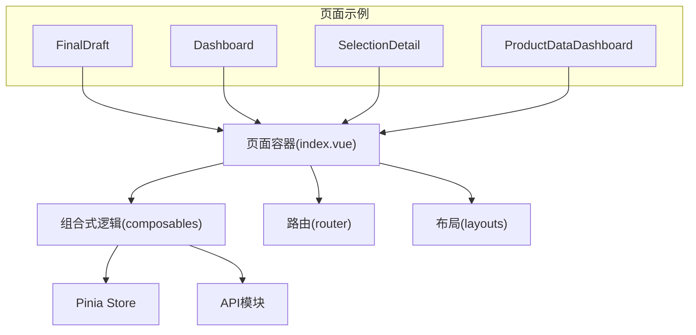
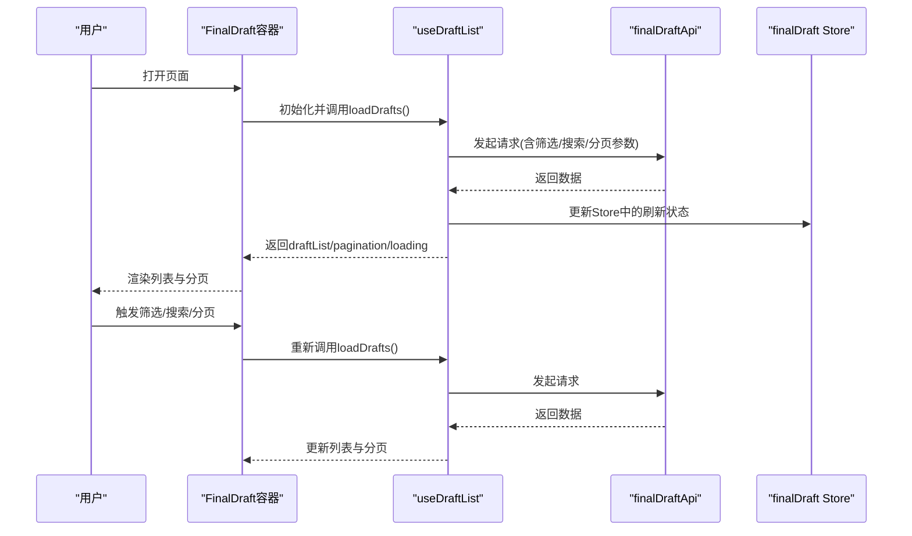
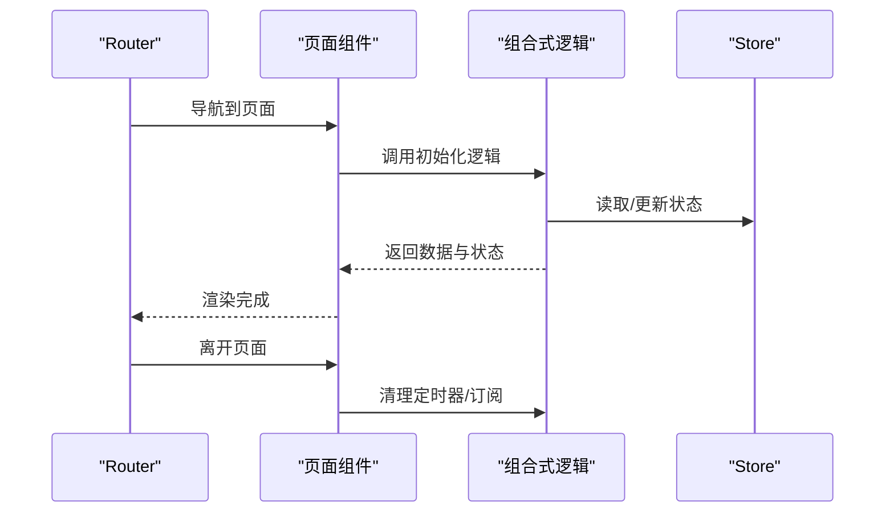
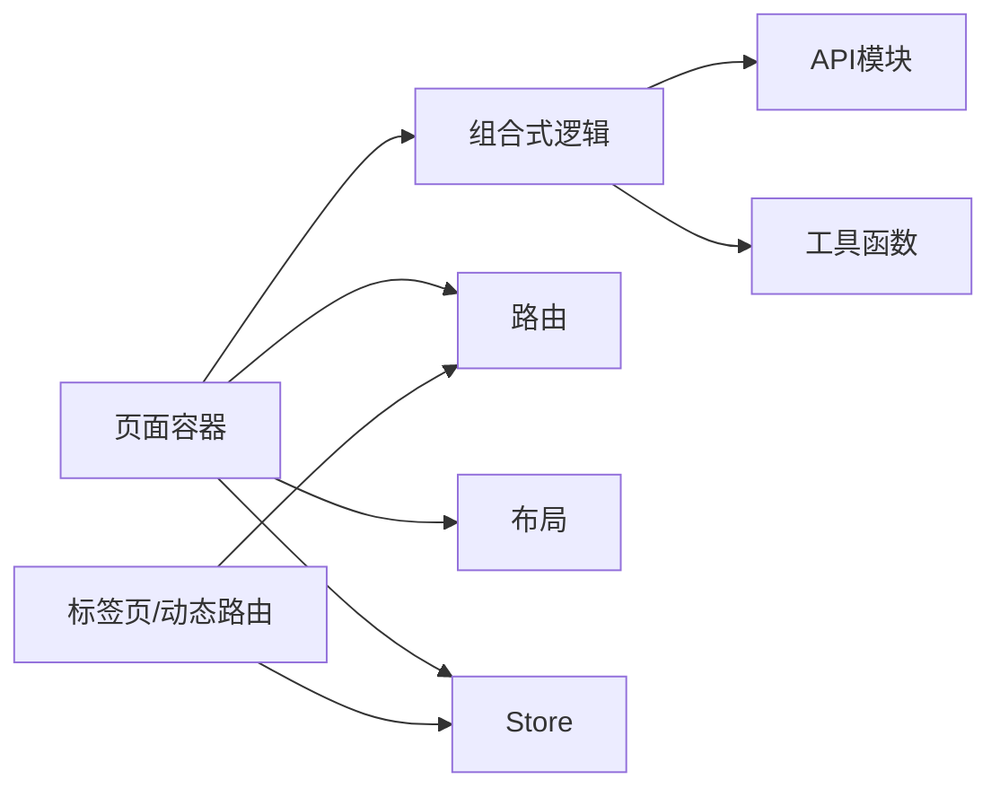

# 页面组件开发

<cite>
**本文引用的文件**
- [frontend/src/views/FinalDraft/index.vue](file://frontend/src/views/FinalDraft/index.vue)
- [frontend/src/views/FinalDraft/composables/useDraftList.ts](file://frontend/src/views/FinalDraft/composables/useDraftList.ts)
- [frontend/src/views/FinalDraft/composables/useDraftDownload.ts](file://frontend/src/views/FinalDraft/composables/useDraftDownload.ts)
- [frontend/src/views/FinalDraft/composables/useDraftFilter.ts](file://frontend/src/views/FinalDraft/composables/useDraftFilter.ts)
- [frontend/src/views/FinalDraft/composables/useDraftSearch.ts](file://frontend/src/views/FinalDraft/composables/useDraftSearch.ts)
- [frontend/src/stores/finalDraft.ts](file://frontend/src/stores/finalDraft.ts)
- [frontend/src/api/finalDraft.ts](file://frontend/src/api/finalDraft.ts)
- [frontend/src/utils/download.ts](file://frontend/src/utils/download.ts)
- [frontend/src/router/index.ts](file://frontend/src/router/index.ts)
- [frontend/src/layouts/Layout/index.vue](file://frontend/src/layouts/Layout/index.vue)
- [frontend/src/views/Dashboard/index.vue](file://frontend/src/views/Dashboard/index.vue)
- [frontend/src/views/SelectionDetail/index.vue](file://frontend/src/views/SelectionDetail/index.vue)
- [frontend/src/views/ProductDataDashboard/index.vue](file://frontend/src/views/ProductDataDashboard/index.vue)
- [frontend/src/views/Home/index.vue](file://frontend/src/views/Home/index.vue)
- [frontend/src/views/NotFound/index.vue](file://frontend/src/views/NotFound/index.vue)
- [frontend/src/main.ts](file://frontend/src/main.ts)
- [frontend/vue-admin-better/src/store/modules/tabsBar.js](file://frontend/vue-admin-better/src/store/modules/tabsBar.js)
- [frontend/vue-admin-better/src/store/modules/routes.js](file://frontend/vue-admin-better/src/store/modules/routes.js)
- [frontend/vue-pure-admin/src/layout/redirect.vue](file://frontend/vue-pure-admin/src/layout/redirect.vue)
</cite>

## 目录
1. [引言](#引言)
2. [项目结构](#项目结构)
3. [核心组件](#核心组件)
4. [架构总览](#架构总览)
5. [详细组件分析](#详细组件分析)
6. [依赖关系分析](#依赖关系分析)
7. [性能考虑](#性能考虑)
8. [故障排查指南](#故障排查指南)
9. [结论](#结论)
10. [附录](#附录)

## 引言
本指南面向页面级组件开发，聚焦于页面组件的架构设计、路由集成、状态管理、数据获取策略、加载与错误处理、布局与响应式适配、用户体验优化、与API集成、数据缓存与性能监控，以及SEO、可访问性与国际化支持。文档以Dashboard、Selection、FinalDraft等复杂页面组件为范例，给出可复用的开发模式与最佳实践。

## 项目结构
前端采用Vue 3 + TypeScript单页应用，页面组件集中于views目录，按业务域划分；页面级逻辑通过composables拆分；全局状态通过Pinia Store管理；路由由router统一配置；布局由layouts提供。

图表来源
- [frontend/src/views/FinalDraft/index.vue:429-482](file://frontend/src/views/FinalDraft/index.vue#L429-L482)
- [frontend/src/views/FinalDraft/composables/useDraftList.ts:31-183](file://frontend/src/views/FinalDraft/composables/useDraftList.ts#L31-L183)
- [frontend/src/stores/finalDraft.ts](file://frontend/src/stores/finalDraft.ts)
- [frontend/src/router/index.ts](file://frontend/src/router/index.ts)
- [frontend/src/layouts/Layout/index.vue](file://frontend/src/layouts/Layout/index.vue)

章节来源
- [frontend/src/views/FinalDraft/index.vue:429-482](file://frontend/src/views/FinalDraft/index.vue#L429-L482)
- [frontend/src/router/index.ts](file://frontend/src/router/index.ts)
- [frontend/src/layouts/Layout/index.vue](file://frontend/src/layouts/Layout/index.vue)

## 核心组件
- 页面容器：每个页面以index.vue作为容器，负责组织布局、引入组合式逻辑、调用API、绑定状态与事件。
- 组合式逻辑：将页面内可复用的逻辑抽取为composables，如useDraftList、useDraftFilter、useDraftSearch、useDraftDownload，实现关注点分离与高复用。
- 状态管理：页面级状态通过Pinia Store管理，如finalDraft、user、app等，避免跨组件重复请求与状态漂移。
- 路由集成：页面通过router/index.ts注册，支持动态路由、重定向、权限控制等。
- 布局与导航：主布局由layouts/Layout/index.vue提供，支持侧边栏、面包屑、标签页等。

章节来源
- [frontend/src/views/FinalDraft/index.vue:429-482](file://frontend/src/views/FinalDraft/index.vue#L429-L482)
- [frontend/src/views/FinalDraft/composables/useDraftList.ts:31-183](file://frontend/src/views/FinalDraft/composables/useDraftList.ts#L31-L183)
- [frontend/src/stores/finalDraft.ts](file://frontend/src/stores/finalDraft.ts)
- [frontend/src/router/index.ts](file://frontend/src/router/index.ts)
- [frontend/src/layouts/Layout/index.vue](file://frontend/src/layouts/Layout/index.vue)

## 架构总览
页面组件遵循“容器组件 + 组合式逻辑 + Store + API”分层架构。容器组件负责渲染与交互，composables封装数据流与业务逻辑，Store集中管理页面状态，API模块封装网络请求。

图表来源
- [frontend/src/views/FinalDraft/index.vue:429-482](file://frontend/src/views/FinalDraft/index.vue#L429-L482)
- [frontend/src/views/FinalDraft/composables/useDraftList.ts:31-183](file://frontend/src/views/FinalDraft/composables/useDraftList.ts#L31-L183)
- [frontend/src/stores/finalDraft.ts](file://frontend/src/stores/finalDraft.ts)
- [frontend/src/router/index.ts](file://frontend/src/router/index.ts)
- [frontend/src/layouts/Layout/index.vue](file://frontend/src/layouts/Layout/index.vue)

## 详细组件分析

### FinalDraft 页面组件开发模式
FinalDraft是典型的复杂页面组件，包含列表、筛选、搜索、批量下载等功能。其开发模式如下：

- 数据获取策略
  - 使用useDraftList聚合筛选、搜索、分页参数，统一发起请求，避免重复请求与状态分散。
  - 列表加载状态loading与分页pagination在容器中统一管理，确保UI一致性。
- 加载状态管理
  - 在请求前开启loading，在finally中关闭，保证用户反馈及时。
  - 分页切换与筛选确认均触发loadDrafts，确保数据一致性。
- 错误处理
  - 请求异常通过消息提示与日志输出，必要时回退到默认值或空状态。
- 用户体验
  - 支持批量下载、单个下载、进度展示与命名对话框，提升操作效率。
  - 下载进度与状态通过composable集中管理，便于复用。
- 与API集成
  - 通过finalDraftApi封装请求，容器组件仅负责调用与状态绑定。
- 数据缓存与性能
  - 利用分页与筛选参数缓存减少无效请求；下载时对图片进行去重与扩展名识别，降低带宽消耗。
- SEO与可访问性
  - 列表项具备语义化结构，按钮具备aria-label；页面标题与描述通过路由元信息维护。
- 国际化
  - 文案与提示通过i18n资源管理，容器组件与composables中统一使用$tm或对应语言键。

图表来源
- [frontend/src/views/FinalDraft/index.vue:429-482](file://frontend/src/views/FinalDraft/index.vue#L429-L482)
- [frontend/src/views/FinalDraft/composables/useDraftList.ts:48-166](file://frontend/src/views/FinalDraft/composables/useDraftList.ts#L48-L166)
- [frontend/src/stores/finalDraft.ts](file://frontend/src/stores/finalDraft.ts)
- [frontend/src/api/finalDraft.ts](file://frontend/src/api/finalDraft.ts)

章节来源
- [frontend/src/views/FinalDraft/index.vue:429-482](file://frontend/src/views/FinalDraft/index.vue#L429-L482)
- [frontend/src/views/FinalDraft/composables/useDraftList.ts:31-183](file://frontend/src/views/FinalDraft/composables/useDraftList.ts#L31-L183)
- [frontend/src/views/FinalDraft/composables/useDraftDownload.ts](file://frontend/src/views/FinalDraft/composables/useDraftDownload.ts)
- [frontend/src/views/FinalDraft/composables/useDraftFilter.ts](file://frontend/src/views/FinalDraft/composables/useDraftFilter.ts)
- [frontend/src/views/FinalDraft/composables/useDraftSearch.ts](file://frontend/src/views/FinalDraft/composables/useDraftSearch.ts)
- [frontend/src/stores/finalDraft.ts](file://frontend/src/stores/finalDraft.ts)
- [frontend/src/api/finalDraft.ts](file://frontend/src/api/finalDraft.ts)
- [frontend/src/utils/download.ts](file://frontend/src/utils/download.ts)

### Dashboard 页面组件开发模式
- 架构要点
  - 以卡片/仪表盘组件为主，数据通过API拉取并缓存，支持定时刷新与手动刷新。
  - 使用布局组件承载侧边栏与主内容区，保持一致的导航与面包屑。
- 状态管理
  - 将关键指标与配置放入Store，避免每次进入页面重复请求。
- 性能优化
  - 对图表数据进行节流与防抖，使用懒加载与虚拟滚动优化长列表。
- 可访问性
  - 图表具备可替代文本与键盘导航支持；颜色对比满足WCAG标准。
- 国际化
  - 数字、日期、单位等本地化处理，支持多语言切换。

章节来源
- [frontend/src/views/Dashboard/index.vue](file://frontend/src/views/Dashboard/index.vue)
- [frontend/src/layouts/Layout/index.vue](file://frontend/src/layouts/Layout/index.vue)
- [frontend/src/router/index.ts](file://frontend/src/router/index.ts)

### SelectionDetail 页面组件开发模式
- 架构要点
  - 详情页通常包含基本信息、关联数据、操作按钮与历史记录。
  - 使用路由参数传递id，进入页面后立即发起请求并加载数据。
- 状态管理
  - 将当前选品详情与关联数据放入Store，支持跨组件共享与缓存。
- 错误处理
  - id无效或数据不存在时跳转404或显示占位符。
- SEO
  - 动态设置页面标题与meta描述，增强搜索引擎友好度。

章节来源
- [frontend/src/views/SelectionDetail/index.vue](file://frontend/src/views/SelectionDetail/index.vue)
- [frontend/src/router/index.ts](file://frontend/src/router/index.ts)

### ProductDataDashboard 页面组件开发模式
- 架构要点
  - 以数据可视化为核心，结合筛选器与导出功能。
  - 使用组合式逻辑封装筛选、搜索与分页，统一数据源。
- 性能
  - 大数据量场景下启用虚拟滚动与分页加载，避免一次性渲染。
- 可访问性
  - 图表具备键盘可达性与屏幕阅读器支持。

章节来源
- [frontend/src/views/ProductDataDashboard/index.vue](file://frontend/src/views/ProductDataDashboard/index.vue)
- [frontend/src/views/ProductDataDashboard/composables/...](file://frontend/src/views/ProductDataDashboard/composables/...)

### 路由集成与页面生命周期
- 路由注册
  - 在router/index.ts中定义页面路由，支持嵌套路由与动态路由。
- 重定向
  - 通过redirect组件处理路径拼接与查询参数保留。
- 生命周期
  - 页面进入时初始化数据，离开时清理订阅与定时器，避免内存泄漏。

图表来源
- [frontend/src/router/index.ts](file://frontend/src/router/index.ts)
- [frontend/vue-pure-admin/src/layout/redirect.vue:1-24](file://frontend/vue-pure-admin/src/layout/redirect.vue#L1-L24)

章节来源
- [frontend/src/router/index.ts](file://frontend/src/router/index.ts)
- [frontend/vue-pure-admin/src/layout/redirect.vue:1-24](file://frontend/vue-pure-admin/src/layout/redirect.vue#L1-L24)

## 依赖关系分析
- 页面容器依赖组合式逻辑与Store，组合式逻辑依赖API与工具函数。
- 路由与布局为横切关注点，所有页面共享。
- 标签页与动态路由由状态管理模块提供支持，便于多页面协作。

图表来源
- [frontend/src/views/FinalDraft/index.vue:429-482](file://frontend/src/views/FinalDraft/index.vue#L429-L482)
- [frontend/vue-admin-better/src/store/modules/tabsBar.js:33-110](file://frontend/vue-admin-better/src/store/modules/tabsBar.js#L33-L110)
- [frontend/vue-admin-better/src/store/modules/routes.js:41-63](file://frontend/vue-admin-better/src/store/modules/routes.js#L41-L63)

章节来源
- [frontend/vue-admin-better/src/store/modules/tabsBar.js:33-110](file://frontend/vue-admin-better/src/store/modules/tabsBar.js#L33-L110)
- [frontend/vue-admin-better/src/store/modules/routes.js:41-63](file://frontend/vue-admin-better/src/store/modules/routes.js#L41-L63)

## 性能考虑
- 数据获取
  - 使用分页与筛选参数缓存，避免重复请求；对高频操作进行防抖/节流。
- 渲染优化
  - 列表使用虚拟滚动；图片懒加载与占位符；大图延迟加载。
- 缓存策略
  - Store缓存关键数据；图片离线缓存与压缩；请求合并与去重。
- 监控
  - 记录首屏时间、接口耗时、错误率；对慢查询与异常进行告警。
- 下载优化
  - 批量下载时进行去重与并发控制，支持断点续传与进度回调。

章节来源
- [frontend/src/views/FinalDraft/composables/useDraftList.ts:48-166](file://frontend/src/views/FinalDraft/composables/useDraftList.ts#L48-L166)
- [frontend/src/utils/download.ts](file://frontend/src/utils/download.ts)

## 故障排查指南
- 页面空白或白屏
  - 检查路由是否正确注册，组件是否正确导出；查看控制台错误。
- 数据不更新
  - 确认Store刷新状态是否被消费；检查useDraftList中监听与重置逻辑。
- 下载失败
  - 检查下载工具函数与权限；确认文件存在与URL有效性。
- 路由跳转异常
  - 检查redirect组件与路由参数拼接；确认query参数传递。

章节来源
- [frontend/src/views/FinalDraft/index.vue:429-482](file://frontend/src/views/FinalDraft/index.vue#L429-L482)
- [frontend/src/views/FinalDraft/composables/useDraftList.ts:157-162](file://frontend/src/views/FinalDraft/composables/useDraftList.ts#L157-L162)
- [frontend/vue-pure-admin/src/layout/redirect.vue:1-24](file://frontend/vue-pure-admin/src/layout/redirect.vue#L1-L24)

## 结论
页面级组件开发应坚持“容器+组合式逻辑+Store+API”的分层设计，通过模块化与可复用的composables提升开发效率与可维护性。配合完善的路由与布局体系、状态管理与错误处理机制，以及性能优化与可访问性保障，能够构建高质量的复杂页面组件。

## 附录
- 页面组件开发清单
  - 明确数据来源与缓存策略
  - 设计加载与错误状态
  - 抽象可复用的组合式逻辑
  - 统一状态管理与路由集成
  - 关注性能与可访问性
  - 准备SEO与国际化支持