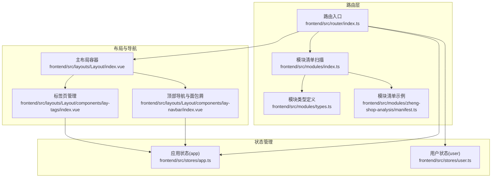
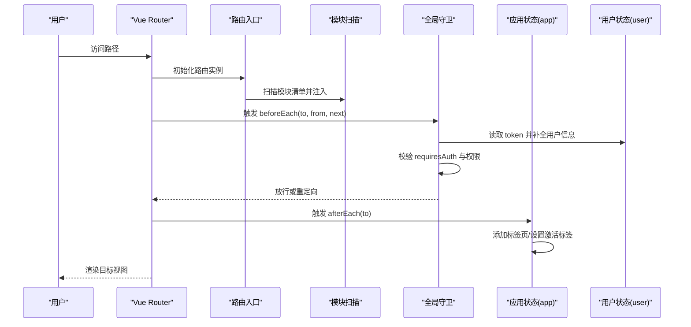
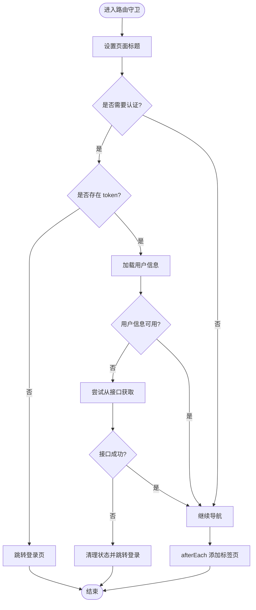
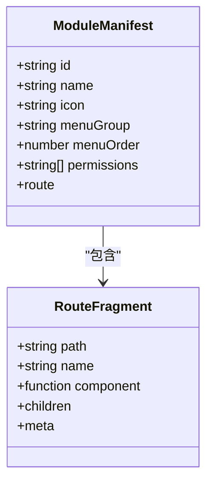
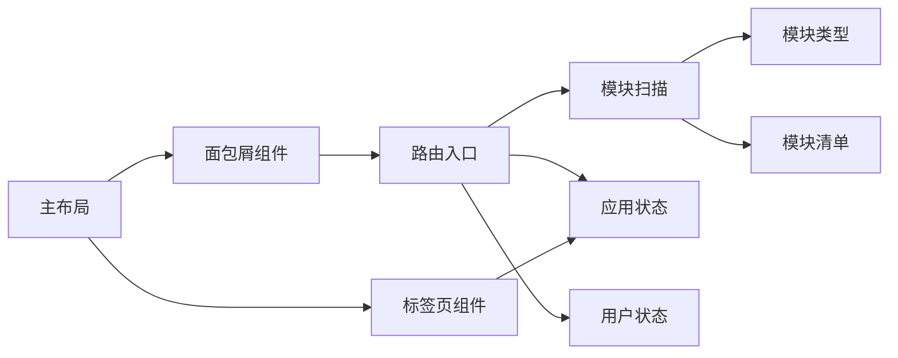

# 路由与导航

<cite>
**本文引用的文件**
- [frontend/src/router/index.ts](file://frontend/src/router/index.ts)
- [frontend/src/modules/index.ts](file://frontend/src/modules/index.ts)
- [frontend/src/modules/types.ts](file://frontend/src/modules/types.ts)
- [frontend/src/modules/zheng-shop-analysis/manifest.ts](file://frontend/src/modules/zheng-shop-analysis/manifest.ts)
- [frontend/src/layouts/Layout/index.vue](file://frontend/src/layouts/Layout/index.vue)
- [frontend/src/layouts/Layout/components/lay-navbar/index.vue](file://frontend/src/layouts/Layout/components/lay-navbar/index.vue)
- [frontend/src/layouts/Layout/components/lay-tags/index.vue](file://frontend/src/layouts/Layout/components/lay-tags/index.vue)
- [frontend/src/stores/app.ts](file://frontend/src/stores/app.ts)
- [frontend/src/stores/user.ts](file://frontend/src/stores/user.ts)
</cite>

## 目录
1. [简介](#简介)
2. [项目结构](#项目结构)
3. [核心组件](#核心组件)
4. [架构总览](#架构总览)
5. [详细组件分析](#详细组件分析)
6. [依赖关系分析](#依赖关系分析)
7. [性能考虑](#性能考虑)
8. [故障排查指南](#故障排查指南)
9. [结论](#结论)
10. [附录](#附录)

## 简介
本指南围绕 Vue Router 路由系统进行深入解析，覆盖路由设计原则、嵌套路由与动态路由、权限路由、懒加载与预加载策略、路由守卫机制、布局系统、面包屑导航与标签页管理，并提供模块化路由、权限控制路由与动态菜单路由的实践范式。同时给出路由参数传递、查询字符串处理、路由元信息使用方法，以及性能优化、导航错误处理、安全与用户体验优化建议。

## 项目结构
前端路由位于前端工程的路由入口文件中，采用“主路由 + 模块化路由”的组合方式：
- 主路由集中定义在路由入口文件中，包含登录页、根布局与重定向、通用业务路由、404 路由等。
- 模块化路由通过扫描模块清单自动注入，每个模块以清单形式声明自身路由片段，支持图标、标题、权限与子路由。
- 布局系统由主布局容器承载，内含侧边栏、顶部导航、标签页与内容区；面包屑导航由顶部导航组件根据 matched 路由项生成。
- 应用状态与用户状态分别由 Pinia Store 管理，前者负责标签页与侧边栏状态，后者负责登录态与用户信息。

图表来源
- [frontend/src/router/index.ts:1-284](file://frontend/src/router/index.ts#L1-L284)
- [frontend/src/modules/index.ts:1-24](file://frontend/src/modules/index.ts#L1-L24)
- [frontend/src/modules/types.ts:1-24](file://frontend/src/modules/types.ts#L1-L24)
- [frontend/src/modules/zheng-shop-analysis/manifest.ts:1-15](file://frontend/src/modules/zheng-shop-analysis/manifest.ts#L1-L15)
- [frontend/src/layouts/Layout/index.vue:1-115](file://frontend/src/layouts/Layout/index.vue#L1-L115)
- [frontend/src/layouts/Layout/components/lay-navbar/index.vue:1-247](file://frontend/src/layouts/Layout/components/lay-navbar/index.vue#L1-L247)
- [frontend/src/layouts/Layout/components/lay-tags/index.vue:1-223](file://frontend/src/layouts/Layout/components/lay-tags/index.vue#L1-L223)
- [frontend/src/stores/app.ts:1-76](file://frontend/src/stores/app.ts#L1-L76)
- [frontend/src/stores/user.ts:1-170](file://frontend/src/stores/user.ts#L1-L170)

章节来源
- [frontend/src/router/index.ts:1-284](file://frontend/src/router/index.ts#L1-L284)
- [frontend/src/modules/index.ts:1-24](file://frontend/src/modules/index.ts#L1-L24)
- [frontend/src/modules/types.ts:1-24](file://frontend/src/modules/types.ts#L1-L24)
- [frontend/src/modules/zheng-shop-analysis/manifest.ts:1-15](file://frontend/src/modules/zheng-shop-analysis/manifest.ts#L1-L15)
- [frontend/src/layouts/Layout/index.vue:1-115](file://frontend/src/layouts/Layout/index.vue#L1-L115)
- [frontend/src/layouts/Layout/components/lay-navbar/index.vue:1-247](file://frontend/src/layouts/Layout/components/lay-navbar/index.vue#L1-L247)
- [frontend/src/layouts/Layout/components/lay-tags/index.vue:1-223](file://frontend/src/layouts/Layout/components/lay-tags/index.vue#L1-L223)
- [frontend/src/stores/app.ts:1-76](file://frontend/src/stores/app.ts#L1-L76)
- [frontend/src/stores/user.ts:1-170](file://frontend/src/stores/user.ts#L1-L170)

## 核心组件
- 路由入口与守卫
  - 创建路由实例，定义主路由与模块化路由集合，注册全局前置守卫与后置钩子。
  - 前置守卫负责标题设置、登录态校验、用户信息补全与异常处理；后置钩子负责标签页添加。
- 模块化路由
  - 通过扫描模块清单自动收集路由，统一注入到主路由树，支持图标、标题、权限与子路由。
- 布局系统
  - 主布局容器组织侧边栏、头部、标签栏与内容区；顶部导航集成面包屑与用户操作。
- 标签页管理
  - 基于应用状态维护标签列表与当前激活标签，支持点击切换、关闭、关闭其他与关闭全部。
- 面包屑导航
  - 基于 matched 路由项过滤并渲染，仅展示具有标题的路由节点。
- 用户与权限
  - 用户状态管理登录态、刷新令牌与用户信息；路由守卫基于本地 token 与用户信息决定放行或重定向。

章节来源
- [frontend/src/router/index.ts:1-284](file://frontend/src/router/index.ts#L1-L284)
- [frontend/src/modules/index.ts:1-24](file://frontend/src/modules/index.ts#L1-L24)
- [frontend/src/modules/types.ts:1-24](file://frontend/src/modules/types.ts#L1-L24)
- [frontend/src/layouts/Layout/index.vue:1-115](file://frontend/src/layouts/Layout/index.vue#L1-L115)
- [frontend/src/layouts/Layout/components/lay-navbar/index.vue:1-247](file://frontend/src/layouts/Layout/components/lay-navbar/index.vue#L1-L247)
- [frontend/src/layouts/Layout/components/lay-tags/index.vue:1-223](file://frontend/src/layouts/Layout/components/lay-tags/index.vue#L1-L223)
- [frontend/src/stores/app.ts:1-76](file://frontend/src/stores/app.ts#L1-L76)
- [frontend/src/stores/user.ts:1-170](file://frontend/src/stores/user.ts#L1-L170)

## 架构总览
下图展示了路由初始化、模块化注入、守卫执行与导航联动的整体流程。

图表来源
- [frontend/src/router/index.ts:1-284](file://frontend/src/router/index.ts#L1-L284)
- [frontend/src/modules/index.ts:1-24](file://frontend/src/modules/index.ts#L1-L24)
- [frontend/src/stores/app.ts:1-76](file://frontend/src/stores/app.ts#L1-L76)
- [frontend/src/stores/user.ts:1-170](file://frontend/src/stores/user.ts#L1-L170)

## 详细组件分析

### 路由入口与守卫
- 路由创建
  - 使用历史模式创建路由器，将主路由与模块化路由合并。
- 全局前置守卫
  - 设置页面标题；校验 requiresAuth；处理已登录访问登录页；缺失用户信息时尝试从本地或接口补全；异常时清理状态并重定向登录。
- 全局后置守卫
  - 在非登录且需要认证的路由中，将当前路由加入标签页列表并设为激活。

图表来源
- [frontend/src/router/index.ts:210-281](file://frontend/src/router/index.ts#L210-L281)

章节来源
- [frontend/src/router/index.ts:1-284](file://frontend/src/router/index.ts#L1-L284)

### 模块化路由与动态菜单
- 模块扫描
  - 使用 Vite 的 glob 功能扫描一级模块目录下的清单文件，缓存结果并按菜单顺序排序。
- 清单结构
  - 每个模块以清单形式导出路由片段，包含唯一 id、名称、图标、菜单分组、排序权重与权限数组，以及路由 path、name、组件与子路由。
- 注入策略
  - 将模块清单映射为主路由的子项，保留原 meta 字段并叠加模块级元信息（如标题、图标、权限）。

图表来源
- [frontend/src/modules/types.ts:3-23](file://frontend/src/modules/types.ts#L3-L23)
- [frontend/src/modules/zheng-shop-analysis/manifest.ts:3-14](file://frontend/src/modules/zheng-shop-analysis/manifest.ts#L3-L14)

章节来源
- [frontend/src/modules/index.ts:1-24](file://frontend/src/modules/index.ts#L1-L24)
- [frontend/src/modules/types.ts:1-24](file://frontend/src/modules/types.ts#L1-L24)
- [frontend/src/modules/zheng-shop-analysis/manifest.ts:1-15](file://frontend/src/modules/zheng-shop-analysis/manifest.ts#L1-L15)
- [frontend/src/router/index.ts:7-14](file://frontend/src/router/index.ts#L7-L14)

### 嵌套路由与动态路由
- 嵌套路由
  - 根布局下定义子路由，形成父子关系；面包屑与标签页均基于 matched 结果生成。
- 动态路由
  - 通过清单中的 children 字段支持动态子路由；模块化注入时直接复用模块路由结构。

章节来源
- [frontend/src/router/index.ts:24-196](file://frontend/src/router/index.ts#L24-L196)
- [frontend/src/modules/types.ts:16-22](file://frontend/src/modules/types.ts#L16-L22)

### 权限路由与用户态
- 登录态与用户信息
  - 守卫中读取本地 token，若缺失则跳转登录；若存在但缺少用户信息，则尝试从本地或接口补全；接口失败则清理状态并重定向登录。
- 角色与权限
  - 用户状态提供角色判断计算属性，可用于后续权限控制扩展（如菜单过滤、按钮级权限）。

章节来源
- [frontend/src/router/index.ts:210-269](file://frontend/src/router/index.ts#L210-L269)
- [frontend/src/stores/user.ts:150-152](file://frontend/src/stores/user.ts#L150-L152)

### 懒加载与预加载策略
- 懒加载
  - 路由组件采用函数式懒加载，减少首屏体积。
- 预加载
  - 可在路由元信息中定义预加载策略（如预取关键资源），并在导航前触发；当前仓库未见显式预加载实现，可在守卫中扩展。

章节来源
- [frontend/src/router/index.ts:18-203](file://frontend/src/router/index.ts#L18-L203)

### 布局系统设计
- 主布局容器
  - 组织侧边栏、头部、标签栏与内容区，支持侧边栏折叠与宽度动画。
- 顶部导航与面包屑
  - 面包屑根据 matched 过滤并渲染，仅展示带标题的路由节点。
- 标签页
  - 支持点击切换、关闭、关闭其他与关闭全部；默认首页标签常驻。

章节来源
- [frontend/src/layouts/Layout/index.vue:1-115](file://frontend/src/layouts/Layout/index.vue#L1-L115)
- [frontend/src/layouts/Layout/components/lay-navbar/index.vue:27-36](file://frontend/src/layouts/Layout/components/lay-navbar/index.vue#L27-L36)
- [frontend/src/layouts/Layout/components/lay-tags/index.vue:14-40](file://frontend/src/layouts/Layout/components/lay-tags/index.vue#L14-L40)
- [frontend/src/stores/app.ts:27-56](file://frontend/src/stores/app.ts#L27-L56)

### 面包屑导航
- 数据来源
  - 通过匹配到的路由项过滤出具有路径与标题的节点，逐级渲染。
- 交互
  - 点击面包屑项可直接跳转对应路径。

章节来源
- [frontend/src/layouts/Layout/components/lay-navbar/index.vue:27-36](file://frontend/src/layouts/Layout/components/lay-navbar/index.vue#L27-L36)
- [frontend/src/layouts/Layout/components/lay-navbar/index.vue:88-96](file://frontend/src/layouts/Layout/components/lay-navbar/index.vue#L88-L96)

### 标签页管理
- 生命周期
  - afterAll 时添加标签；点击切换激活；关闭标签时回退到相邻标签；关闭其他/全部时保留首页。
- 状态持久化
  - 标签列表与激活项由应用状态维护，支持主题切换与深色模式适配。

章节来源
- [frontend/src/router/index.ts:271-281](file://frontend/src/router/index.ts#L271-L281)
- [frontend/src/layouts/Layout/components/lay-tags/index.vue:14-40](file://frontend/src/layouts/Layout/components/lay-tags/index.vue#L14-L40)
- [frontend/src/stores/app.ts:27-56](file://frontend/src/stores/app.ts#L27-L56)

### 路由参数传递、查询字符串与元信息
- 路由参数
  - 使用动态段（如商品详情、选品详情）传递标识符，组件内通过路由参数读取。
- 查询字符串
  - 可通过路由查询参数携带筛选条件；在组件内使用路由查询对象读取。
- 元信息
  - 路由 meta 中包含标题、图标、权限等字段，用于面包屑、菜单与权限控制。

章节来源
- [frontend/src/router/index.ts:43-53](file://frontend/src/router/index.ts#L43-L53)
- [frontend/src/layouts/Layout/components/lay-navbar/index.vue:27-36](file://frontend/src/layouts/Layout/components/lay-navbar/index.vue#L27-L36)

## 依赖关系分析
- 路由入口依赖模块扫描器与状态管理，模块扫描器依赖模块类型定义与各模块清单。
- 布局组件依赖应用状态与用户状态，标签页组件依赖应用状态，面包屑组件依赖路由匹配结果。
- 全局守卫依赖用户状态与 Element Plus 消息提示。

图表来源
- [frontend/src/router/index.ts:1-284](file://frontend/src/router/index.ts#L1-L284)
- [frontend/src/modules/index.ts:1-24](file://frontend/src/modules/index.ts#L1-L24)
- [frontend/src/modules/types.ts:1-24](file://frontend/src/modules/types.ts#L1-L24)
- [frontend/src/modules/zheng-shop-analysis/manifest.ts:1-15](file://frontend/src/modules/zheng-shop-analysis/manifest.ts#L1-L15)
- [frontend/src/layouts/Layout/index.vue:1-115](file://frontend/src/layouts/Layout/index.vue#L1-L115)
- [frontend/src/layouts/Layout/components/lay-navbar/index.vue:1-247](file://frontend/src/layouts/Layout/components/lay-navbar/index.vue#L1-L247)
- [frontend/src/layouts/Layout/components/lay-tags/index.vue:1-223](file://frontend/src/layouts/Layout/components/lay-tags/index.vue#L1-L223)
- [frontend/src/stores/app.ts:1-76](file://frontend/src/stores/app.ts#L1-L76)
- [frontend/src/stores/user.ts:1-170](file://frontend/src/stores/user.ts#L1-L170)

章节来源
- [frontend/src/router/index.ts:1-284](file://frontend/src/router/index.ts#L1-L284)
- [frontend/src/modules/index.ts:1-24](file://frontend/src/modules/index.ts#L1-L24)
- [frontend/src/layouts/Layout/index.vue:1-115](file://frontend/src/layouts/Layout/index.vue#L1-L115)
- [frontend/src/layouts/Layout/components/lay-navbar/index.vue:1-247](file://frontend/src/layouts/Layout/components/lay-navbar/index.vue#L1-L247)
- [frontend/src/layouts/Layout/components/lay-tags/index.vue:1-223](file://frontend/src/layouts/Layout/components/lay-tags/index.vue#L1-L223)
- [frontend/src/stores/app.ts:1-76](file://frontend/src/stores/app.ts#L1-L76)
- [frontend/src/stores/user.ts:1-170](file://frontend/src/stores/user.ts#L1-L170)

## 性能考虑
- 代码分割与懒加载
  - 路由组件采用异步加载，降低首屏体积；建议对大组件进一步拆分与按需加载。
- 预取与缓存
  - 在守卫中对关键数据进行预取；利用浏览器缓存与本地存储减少重复请求。
- 导航性能
  - 避免在守卫中执行耗时任务；必要时使用后台线程或节流策略。
- 标签页与滚动
  - 标签页过多时可限制数量或启用虚拟滚动；保持滚动位置与状态恢复。

## 故障排查指南
- 登录态异常
  - 现象：访问受保护路由被重定向至登录页。
  - 排查：检查本地 token 是否存在；若缺失，确认登录流程是否正确写入；若存在但用户信息为空，确认接口调用是否成功。
- 用户信息不完整
  - 现象：用户信息存在但缺少角色或权限。
  - 排查：在守卫中尝试再次拉取用户信息；若接口失败，清理状态并重定向登录。
- 标签页异常
  - 现象：关闭标签后无法正确回退或标签列表错乱。
  - 排查：检查标签页状态更新逻辑与激活项回退策略；确保首页标签常驻。
- 面包屑缺失
  - 现象：面包屑不显示或不完整。
  - 排查：确认路由 meta 中标题字段是否设置；检查 matched 过滤逻辑。

章节来源
- [frontend/src/router/index.ts:210-269](file://frontend/src/router/index.ts#L210-L269)
- [frontend/src/stores/user.ts:112-140](file://frontend/src/stores/user.ts#L112-L140)
- [frontend/src/layouts/Layout/components/lay-tags/index.vue:19-40](file://frontend/src/layouts/Layout/components/lay-tags/index.vue#L19-L40)
- [frontend/src/layouts/Layout/components/lay-navbar/index.vue:27-36](file://frontend/src/layouts/Layout/components/lay-navbar/index.vue#L27-L36)

## 结论
该路由系统以模块化为核心，结合懒加载与守卫机制，实现了清晰的路由结构与良好的用户体验。通过应用状态与用户状态的协同，标签页与面包屑导航得以自动化维护。建议后续在权限控制、预加载策略与导航性能方面持续优化，以满足更高复杂度场景的需求。

## 附录
- 路由配置示例路径
  - 主路由与守卫：[frontend/src/router/index.ts:16-203](file://frontend/src/router/index.ts#L16-L203)
  - 模块化路由注入：[frontend/src/router/index.ts:7-14](file://frontend/src/router/index.ts#L7-L14)
  - 模块清单扫描：[frontend/src/modules/index.ts:8-21](file://frontend/src/modules/index.ts#L8-L21)
  - 模块类型定义：[frontend/src/modules/types.ts:3-23](file://frontend/src/modules/types.ts#L3-L23)
  - 模块清单示例：[frontend/src/modules/zheng-shop-analysis/manifest.ts:3-14](file://frontend/src/modules/zheng-shop-analysis/manifest.ts#L3-L14)
  - 布局容器：[frontend/src/layouts/Layout/index.vue:21-44](file://frontend/src/layouts/Layout/index.vue#L21-L44)
  - 面包屑组件：[frontend/src/layouts/Layout/components/lay-navbar/index.vue:27-36](file://frontend/src/layouts/Layout/components/lay-navbar/index.vue#L27-L36)
  - 标签页组件：[frontend/src/layouts/Layout/components/lay-tags/index.vue:14-40](file://frontend/src/layouts/Layout/components/lay-tags/index.vue#L14-L40)
  - 应用状态（标签页）：[frontend/src/stores/app.ts:27-56](file://frontend/src/stores/app.ts#L27-L56)
  - 用户状态（登录与信息）：[frontend/src/stores/user.ts:51-140](file://frontend/src/stores/user.ts#L51-L140)