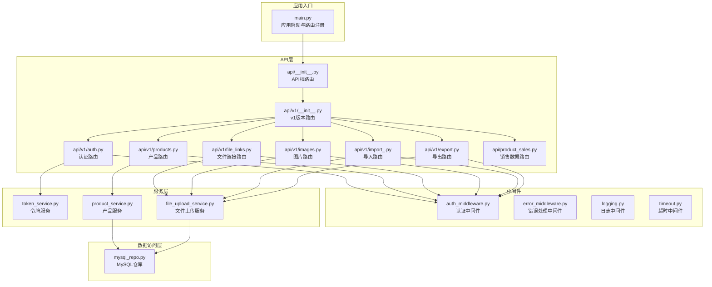
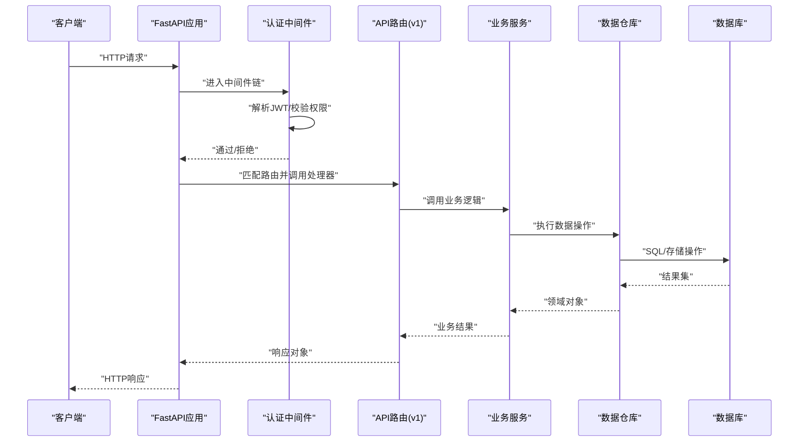
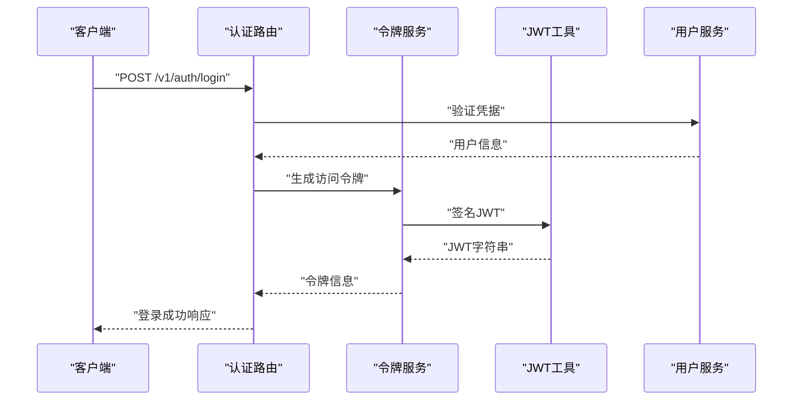
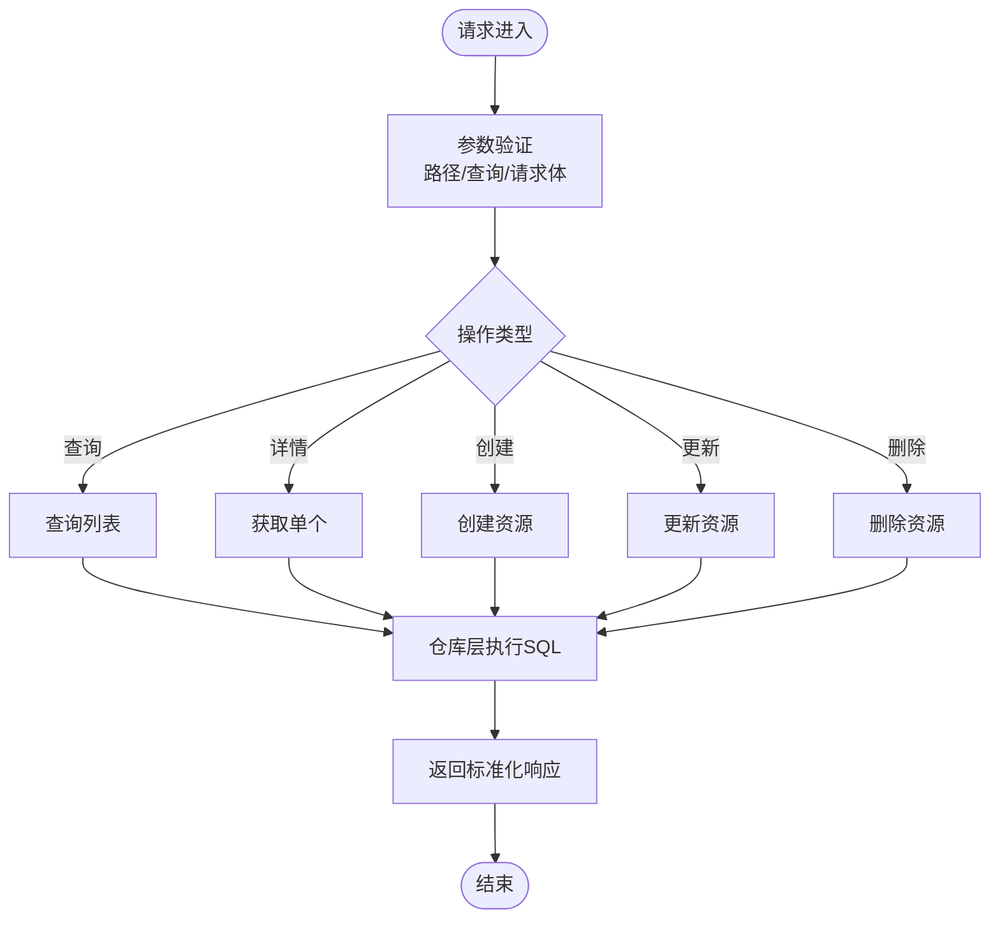
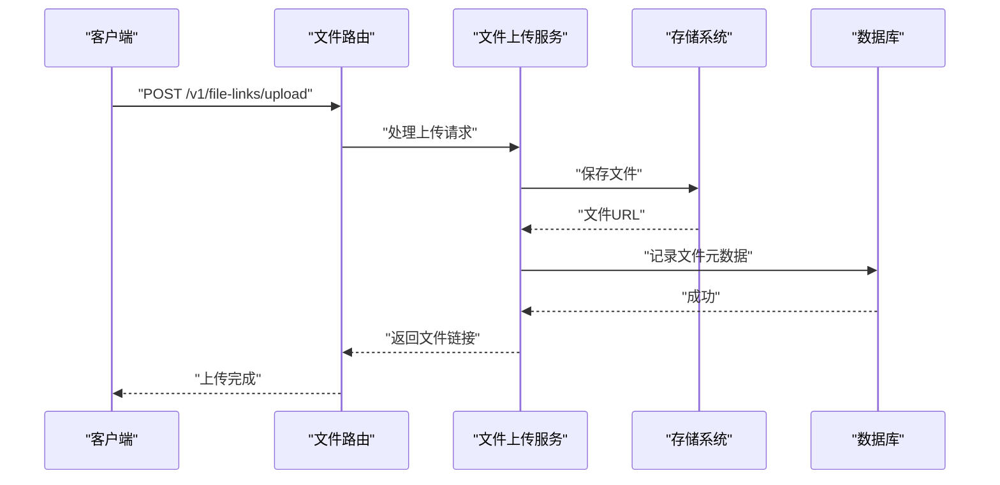
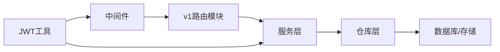

# API路由系统

<cite>
**本文引用的文件**
- [backend/app/main.py](file://backend/app/main.py)
- [backend/app/api/__init__.py](file://backend/app/api/__init__.py)
- [backend/app/api/product_sales.py](file://backend/app/api/product_sales.py)
- [backend/app/api/v1/__init__.py](file://backend/app/api/v1/__init__.py)
- [backend/app/api/v1/auth.py](file://backend/app/api/v1/auth.py)
- [backend/app/api/v1/products.py](file://backend/app/api/v1/products.py)
- [backend/app/api/v1/file_links.py](file://backend/app/api/v1/file_links.py)
- [backend/app/api/v1/images.py](file://backend/app/api/v1/images.py)
- [backend/app/api/v1/import_.py](file://backend/app/api/v1/import_.py)
- [backend/app/api/v1/export.py](file://backend/app/api/v1/export.py)
- [backend/app/middleware/auth_middleware.py](file://backend/app/middleware/auth_middleware.py)
- [backend/app/utils/jwt_utils.py](file://backend/app/utils/jwt_utils.py)
- [backend/app/services/token_service.py](file://backend/app/services/token_service.py)
- [backend/app/services/file_upload_service.py](file://backend/app/services/file_upload_service.py)
- [backend/app/services/product_service.py](file://backend/app/services/product_service.py)
- [backend/app/repositories/mysql_repo.py](file://backend/app/repositories/mysql_repo.py)
- [backend/app/models/product.py](file://backend/app/models/product.py)
- [backend/app/schemas/product_data.py](file://backend/app/schemas/product_data.py)
- [backend/docs/development/standards.md](file://backend/docs/development/standards.md)
- [backend/docs/RBAC设计.md](file://backend/docs/RBAC设计.md)
</cite>

## 目录
1. [简介](#简介)
2. [项目结构](#项目结构)
3. [核心组件](#核心组件)
4. [架构概览](#架构概览)
5. [详细组件分析](#详细组件分析)
6. [依赖关系分析](#依赖关系分析)
7. [性能考虑](#性能考虑)
8. [故障排除指南](#故障排除指南)
9. [结论](#结论)
10. [附录](#附录)

## 简介
本指南面向FastAPI API路由系统的开发者，系统性阐述v1版本API的设计理念、路由组织结构与最佳实践。文档涵盖RESTful设计原则（HTTP方法、URL命名、状态码）、CRUD端点、文件上传与批量操作接口的实现模式、参数验证规范、API版本控制策略与向后兼容性保障、认证授权装饰器的使用（JWT令牌验证与权限检查），以及API文档自动生成与OpenAPI规范说明。

## 项目结构
后端采用分层架构与按功能域划分的路由组织方式：
- 应用入口：通过主程序注册路由并启动服务
- API层：按版本划分（v1），每个模块对应一个资源域
- 中间件：统一处理认证、错误、日志与超时
- 服务层：封装业务逻辑与外部集成
- 数据访问层：MySQL、Redis、Qdrant等仓库实现
- 工具与配置：JWT工具、配置管理

**图表来源**
- [backend/app/main.py](file://backend/app/main.py)
- [backend/app/api/__init__.py](file://backend/app/api/__init__.py)
- [backend/app/api/v1/__init__.py](file://backend/app/api/v1/__init__.py)
- [backend/app/middleware/auth_middleware.py](file://backend/app/middleware/auth_middleware.py)
- [backend/app/services/token_service.py](file://backend/app/services/token_service.py)
- [backend/app/services/file_upload_service.py](file://backend/app/services/file_upload_service.py)
- [backend/app/services/product_service.py](file://backend/app/services/product_service.py)
- [backend/app/repositories/mysql_repo.py](file://backend/app/repositories/mysql_repo.py)

**章节来源**
- [backend/app/main.py](file://backend/app/main.py)
- [backend/app/api/__init__.py](file://backend/app/api/__init__.py)
- [backend/app/api/v1/__init__.py](file://backend/app/api/v1/__init__.py)

## 核心组件
- 应用入口与路由注册：在应用启动时挂载API根路由，确保所有v1路由被正确注册。
- 版本化路由：v1作为当前稳定版本，后续版本以新目录扩展，保持向后兼容。
- 认证中间件：全局拦截请求，执行JWT解析与权限校验。
- 服务层抽象：将业务逻辑与数据访问解耦，便于测试与维护。
- 参数验证：基于Pydantic模型进行请求体、路径参数与查询参数的严格验证。
- 错误处理：统一异常转换为标准HTTP响应，包含错误码与消息。

**章节来源**
- [backend/app/main.py](file://backend/app/main.py)
- [backend/app/middleware/auth_middleware.py](file://backend/app/middleware/auth_middleware.py)
- [backend/app/services/token_service.py](file://backend/app/services/token_service.py)

## 架构概览
系统遵循RESTful设计原则，采用FastAPI的类型安全与自动文档生成功能。请求流经中间件链（认证、日志、超时），到达API路由层，路由调用服务层，服务层通过仓库层访问数据库或外部系统，最终返回响应。

**图表来源**
- [backend/app/middleware/auth_middleware.py](file://backend/app/middleware/auth_middleware.py)
- [backend/app/api/v1/auth.py](file://backend/app/api/v1/auth.py)
- [backend/app/services/token_service.py](file://backend/app/services/token_service.py)
- [backend/app/services/product_service.py](file://backend/app/services/product_service.py)
- [backend/app/repositories/mysql_repo.py](file://backend/app/repositories/mysql_repo.py)

## 详细组件分析

### 认证与授权模块（v1/auth.py）
- 路由职责：用户登录、登出、刷新令牌、获取当前用户信息等。
- JWT流程：生成访问令牌与刷新令牌，支持令牌校验与过期处理。
- 权限检查：结合RBAC模型，对不同角色开放相应端点。
- 最佳实践：使用中间件统一拦截，避免在每个路由重复校验；对敏感操作增加细粒度权限判断。

**图表来源**
- [backend/app/api/v1/auth.py](file://backend/app/api/v1/auth.py)
- [backend/app/services/token_service.py](file://backend/app/services/token_service.py)
- [backend/app/utils/jwt_utils.py](file://backend/app/utils/jwt_utils.py)

**章节来源**
- [backend/app/api/v1/auth.py](file://backend/app/api/v1/auth.py)
- [backend/app/services/token_service.py](file://backend/app/services/token_service.py)
- [backend/app/utils/jwt_utils.py](file://backend/app/utils/jwt_utils.py)
- [backend/docs/RBAC设计.md](file://backend/docs/RBAC设计.md)

### 产品管理模块（v1/products.py）
- CRUD端点：列表查询、详情获取、创建、更新、删除。
- 查询参数：支持分页、过滤、排序、搜索等。
- 请求体验证：使用Pydantic模型定义输入输出结构，确保类型安全。
- 批量操作：提供批量删除、批量更新等接口，注意事务与幂等性。
- 状态码：遵循REST约定，如200/201/204/400/404/422/500。

**图表来源**
- [backend/app/api/v1/products.py](file://backend/app/api/v1/products.py)
- [backend/app/services/product_service.py](file://backend/app/services/product_service.py)
- [backend/app/repositories/mysql_repo.py](file://backend/app/repositories/mysql_repo.py)

**章节来源**
- [backend/app/api/v1/products.py](file://backend/app/api/v1/products.py)
- [backend/app/services/product_service.py](file://backend/app/services/product_service.py)
- [backend/app/repositories/mysql_repo.py](file://backend/app/repositories/mysql_repo.py)
- [backend/app/models/product.py](file://backend/app/models/product.py)
- [backend/app/schemas/product_data.py](file://backend/app/schemas/product_data.py)

### 文件链接与图片管理（v1/file_links.py, v1/images.py）
- 文件上传：支持多文件上传、断点续传、进度跟踪。
- 图片处理：缩略图生成、格式转换、元数据提取。
- 安全策略：白名单校验、大小限制、病毒扫描集成。
- 批量操作：批量删除、批量下载、批量状态变更。

**图表来源**
- [backend/app/api/v1/file_links.py](file://backend/app/api/v1/file_links.py)
- [backend/app/api/v1/images.py](file://backend/app/api/v1/images.py)
- [backend/app/services/file_upload_service.py](file://backend/app/services/file_upload_service.py)

**章节来源**
- [backend/app/api/v1/file_links.py](file://backend/app/api/v1/file_links.py)
- [backend/app/api/v1/images.py](file://backend/app/api/v1/images.py)
- [backend/app/services/file_upload_service.py](file://backend/app/services/file_upload_service.py)

### 导入导出模块（v1/import_.py, v1/export.py）
- 导入：支持Excel/CSV等格式解析，批量入库，错误行记录与重试机制。
- 导出：动态生成报表，支持分页与筛选条件。
- 幂等性：避免重复导入导致的数据重复。
- 异步处理：大文件导入通过任务队列异步执行，前端轮询结果。

**章节来源**
- [backend/app/api/v1/import_.py](file://backend/app/api/v1/import_.py)
- [backend/app/api/v1/export.py](file://backend/app/api/v1/export.py)

### 中间件体系
- 认证中间件：解析Authorization头，验证JWT有效性与权限范围。
- 错误处理中间件：捕获业务异常与系统异常，统一格式化响应。
- 日志中间件：记录请求/响应上下文，支持链路追踪。
- 超时中间件：防止慢查询阻塞线程池。

**章节来源**
- [backend/app/middleware/auth_middleware.py](file://backend/app/middleware/auth_middleware.py)
- [backend/app/middleware/error_middleware.py](file://backend/app/middleware/error_middleware.py)
- [backend/app/middleware/logging.py](file://backend/app/middleware/logging.py)
- [backend/app/middleware/timeout.py](file://backend/app/middleware/timeout.py)

## 依赖关系分析
- 路由到服务：API路由仅负责参数解析与响应包装，具体业务委托给服务层。
- 服务到仓库：服务层聚合多个仓库或外部API，保证业务一致性。
- 中间件到路由：中间件在路由之前执行，形成横切关注点。
- 工具到服务：JWT工具为认证提供基础能力。

**图表来源**
- [backend/app/api/v1/auth.py](file://backend/app/api/v1/auth.py)
- [backend/app/services/token_service.py](file://backend/app/services/token_service.py)
- [backend/app/repositories/mysql_repo.py](file://backend/app/repositories/mysql_repo.py)
- [backend/app/middleware/auth_middleware.py](file://backend/app/middleware/auth_middleware.py)
- [backend/app/utils/jwt_utils.py](file://backend/app/utils/jwt_utils.py)

**章节来源**
- [backend/app/api/v1/auth.py](file://backend/app/api/v1/auth.py)
- [backend/app/services/token_service.py](file://backend/app/services/token_service.py)
- [backend/app/repositories/mysql_repo.py](file://backend/app/repositories/mysql_repo.py)
- [backend/app/middleware/auth_middleware.py](file://backend/app/middleware/auth_middleware.py)
- [backend/app/utils/jwt_utils.py](file://backend/app/utils/jwt_utils.py)

## 性能考虑
- 连接池与事务：合理配置数据库连接池，批量插入使用事务减少往返。
- 缓存策略：热点数据使用Redis缓存，设置合理的TTL与失效策略。
- 分页与索引：大数据量查询必须分页，并确保查询字段有合适索引。
- 异步任务：耗时操作（如文件处理、报表生成）放入任务队列。
- 压测与监控：定期进行压力测试，结合指标监控定位瓶颈。

## 故障排除指南
- 认证失败：检查JWT是否过期、签名是否正确、权限是否足够。
- 参数验证错误：确认请求体结构与类型是否符合Pydantic模型定义。
- 数据库连接异常：查看连接池配置与慢查询日志。
- 文件上传失败：检查存储权限、磁盘空间、文件大小限制。
- 中间件异常：启用详细日志，定位具体中间件环节。

**章节来源**
- [backend/app/middleware/error_middleware.py](file://backend/app/middleware/error_middleware.py)
- [backend/app/middleware/logging.py](file://backend/app/middleware/logging.py)

## 结论
本指南提供了基于FastAPI的v1版本API路由系统开发蓝图，强调了RESTful设计、参数验证、中间件治理、服务与仓库分层、以及认证授权与版本控制策略。遵循本文档的实践，可以构建出高可用、易维护、可扩展的API体系。

## 附录

### RESTful设计原则与最佳实践
- HTTP方法语义：GET/POST/PUT/DELETE分别用于获取、创建、更新、删除。
- URL命名：使用名词复数形式，层级清晰，避免动词。
- 状态码标准：2xx成功、4xx客户端错误、5xx服务器错误，配合详细错误信息。
- 版本控制：通过URL前缀（如/v1）隔离不同版本，保持向后兼容。

**章节来源**
- [backend/docs/development/standards.md](file://backend/docs/development/standards.md)

### 参数验证最佳实践
- 路径参数：使用类型注解与约束（如长度、范围）。
- 查询参数：提供默认值与枚举校验，支持分页与排序。
- 请求体：使用Pydantic模型定义，区分创建/更新场景的字段集合。

**章节来源**
- [backend/app/api/v1/products.py](file://backend/app/api/v1/products.py)
- [backend/app/schemas/product_data.py](file://backend/app/schemas/product_data.py)

### API文档自动生成与OpenAPI
- 自动文档：FastAPI内置Swagger UI与ReDoc，无需额外配置即可生成交互式文档。
- OpenAPI规范：遵循OpenAPI 3.0，确保路径、参数、响应体与错误码描述完整。

**章节来源**
- [backend/app/main.py](file://backend/app/main.py)