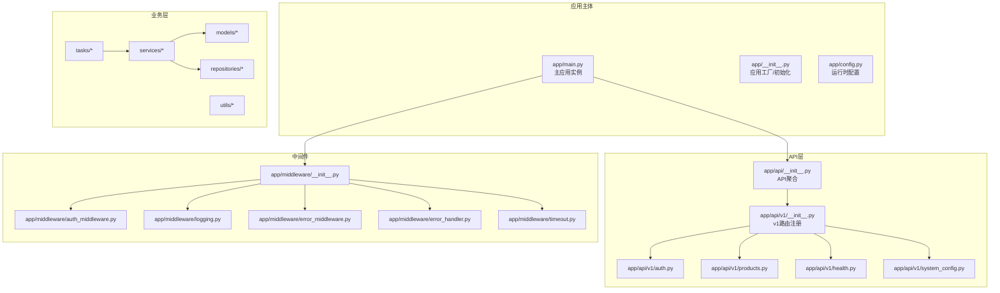
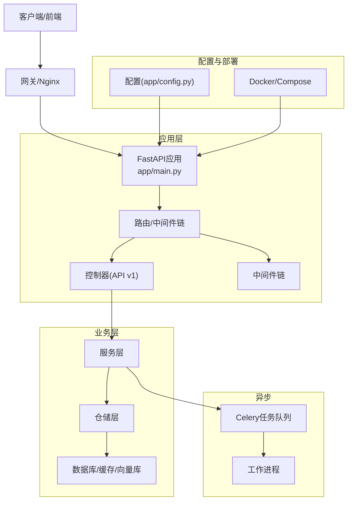
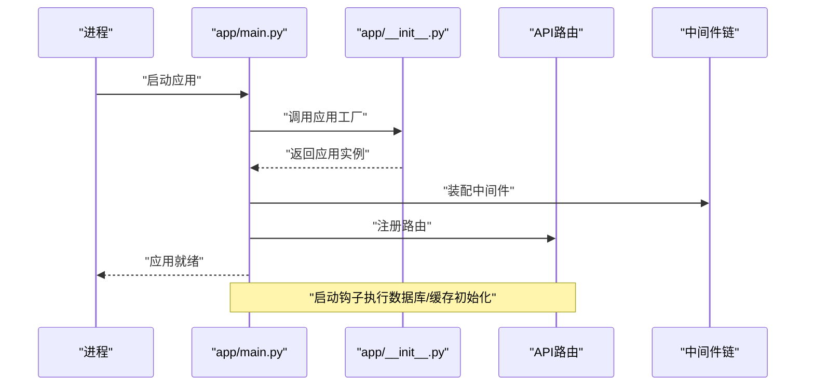
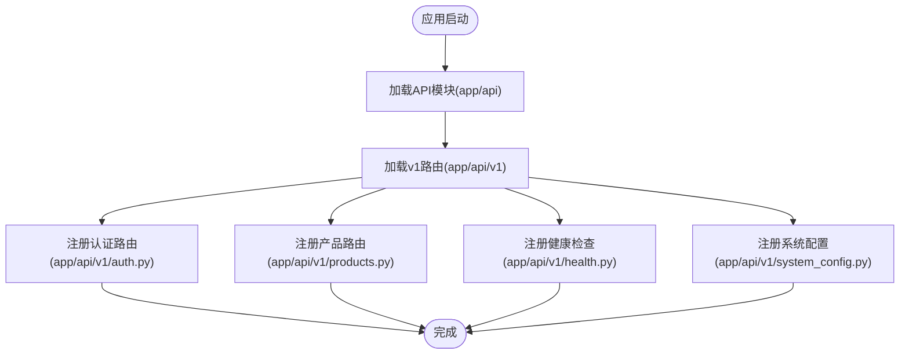
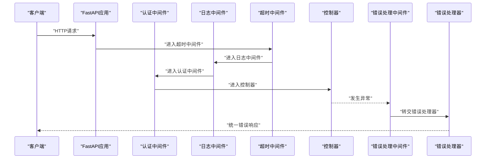
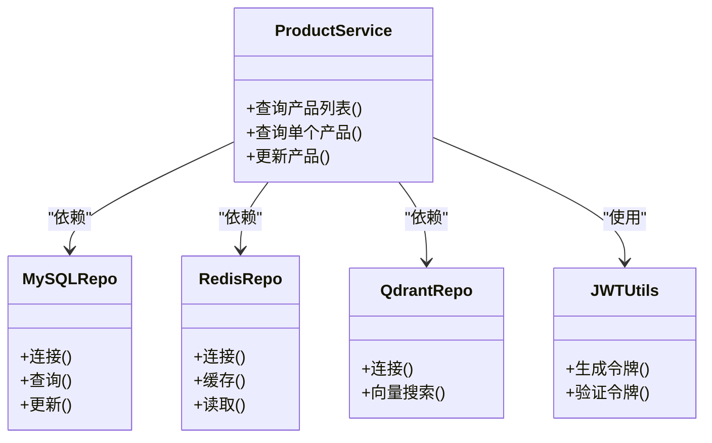
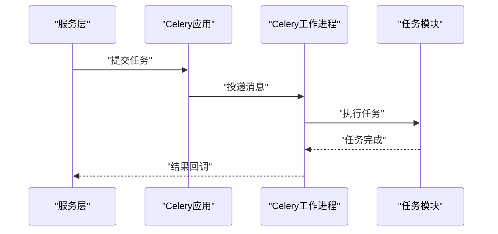
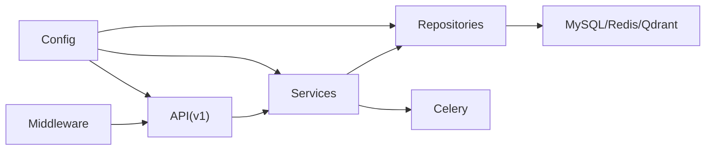

# FastAPI架构设计

<cite>
**本文引用的文件**
- [backend/app/main.py](file://backend/app/main.py)
- [backend/app/__init__.py](file://backend/app/__init__.py)
- [backend/app/config.py](file://backend/app/config.py)
- [backend/app/api/__init__.py](file://backend/app/api/__init__.py)
- [backend/app/middleware/__init__.py](file://backend/app/middleware/__init__.py)
- [backend/app/middleware/auth_middleware.py](file://backend/app/middleware/auth_middleware.py)
- [backend/app/middleware/error_handler.py](file://backend/app/middleware/error_handler.py)
- [backend/app/middleware/error_middleware.py](file://backend/app/middleware/error_middleware.py)
- [backend/app/middleware/logging.py](file://backend/app/middleware/logging.py)
- [backend/app/middleware/timeout.py](file://backend/app/middleware/timeout.py)
- [backend/app/api/v1/__init__.py](file://backend/app/api/v1/__init__.py)
- [backend/app/api/v1/auth.py](file://backend/app/api/v1/auth.py)
- [backend/app/api/v1/products.py](file://backend/app/api/v1/products.py)
- [backend/app/api/v1/system_config.py](file://backend/app/api/v1/system_config.py)
- [backend/app/api/v1/health.py](file://backend/app/api/v1/health.py)
- [backend/app/repositories/mysql_repo.py](file://backend/app/repositories/mysql_repo.py)
- [backend/app/repositories/qdrant_repo.py](file://backend/app/repositories/qdrant_repo.py)
- [backend/app/repositories/redis_repo.py](file://backend/app/repositories/redis_repo.py)
- [backend/app/services/product_service.py](file://backend/app/services/product_service.py)
- [backend/app/services/scoring_engine.py](file://backend/app/services/scoring_engine.py)
- [backend/app/utils/jwt_utils.py](file://backend/app/utils/jwt_utils.py)
- [backend/app/tasks/celery_app.py](file://backend/app/tasks/celery_app.py)
- [backend/app/tasks/download_tasks.py](file://backend/app/tasks/download_tasks.py)
- [backend/app/tasks/image_tasks.py](file://backend/app/tasks/image_tasks.py)
- [backend/Dockerfile.dev](file://backend/Dockerfile.dev)
- [backend/start_celery.py](file://backend/start_celery.py)
- [backend/start_vite_dev.py](file://backend/start_vite_dev.py)
- [backend/start_java_dev.py](file://backend/start_java_dev.py)
- [backend/scripts/startup/start_with_hot_reload.py](file://backend/scripts/startup/start_with_hot_reload.py)
- [backend/scripts/utils/system/hot_reload.py](file://backend/scripts/utils/system/hot_reload.py)
- [backend/scripts/utils/system/performance_monitor.py](file://backend/scripts/utils/system/performance_monitor.py)
- [backend/docker-compose.dev.yml](file://backend/docker-compose.dev.yml)
- [backend/docker-compose.prod.yml](file://backend/docker-compose.prod.yml)
- [backend/docker-compose.prod-simple.yml](file://backend/docker-compose.prod-simple.yml)
- [backend/.dockerignore](file://backend/.dockerignore)
- [backend/requirements.txt](file://backend/requirements.txt)
- [backend/config.py](file://backend/config.py)
</cite>

## 目录
1. [引言](#引言)
2. [项目结构](#项目结构)
3. [核心组件](#核心组件)
4. [架构总览](#架构总览)
5. [详细组件分析](#详细组件分析)
6. [依赖关系分析](#依赖关系分析)
7. [性能考虑](#性能考虑)
8. [故障排查指南](#故障排查指南)
9. [结论](#结论)
10. [附录](#附录)

## 引言
本文件面向FastAPI后端架构设计，系统性阐述该仓库的MVC分层设计、依赖注入机制与模块化组织方式；详解应用初始化流程、配置管理策略与启动参数设置；覆盖路由注册机制、中间件链配置与异常处理体系；并提供主应用实例创建、子应用挂载与生命周期管理的最佳实践。同时给出开发与生产环境配置差异、热重载与调试配置建议，并总结常见陷阱与最佳实践。

## 项目结构
后端采用“应用主体 + 多层业务域”的模块化组织方式：
- 应用主体：在app目录下定义主应用实例、配置、中间件与API版本化路由
- 业务域划分：models（数据模型）、repositories（数据访问）、services（业务逻辑）、tasks（异步任务）
- 工具与基础设施：utils（通用工具）、middleware（中间件）、schemas（数据模式）

图表来源
- [backend/app/main.py](file://backend/app/main.py)
- [backend/app/__init__.py](file://backend/app/__init__.py)
- [backend/app/config.py](file://backend/app/config.py)
- [backend/app/api/__init__.py](file://backend/app/api/__init__.py)
- [backend/app/api/v1/__init__.py](file://backend/app/api/v1/__init__.py)
- [backend/app/middleware/__init__.py](file://backend/app/middleware/__init__.py)

章节来源
- [backend/app/main.py](file://backend/app/main.py)
- [backend/app/__init__.py](file://backend/app/__init__.py)
- [backend/app/config.py](file://backend/app/config.py)
- [backend/app/api/__init__.py](file://backend/app/api/__init__.py)
- [backend/app/api/v1/__init__.py](file://backend/app/api/v1/__init__.py)
- [backend/app/middleware/__init__.py](file://backend/app/middleware/__init__.py)

## 核心组件
- 应用实例与工厂：通过主入口创建ASGI应用实例，支持开发/生产环境差异化配置与中间件装配
- 路由与版本化：API按v1版本组织，统一在版本模块中注册，便于扩展与维护
- 中间件链：认证、日志、超时、异常处理等中间件按顺序装配，形成完整的请求处理管线
- 业务层解耦：services依赖repositories，repositories封装具体数据源（MySQL、Redis、Qdrant），实现关注点分离
- 异步任务：Celery任务与后台作业分离，降低主线程压力
- 配置管理：集中式配置对象，区分开发/生产环境变量与默认值

章节来源
- [backend/app/main.py](file://backend/app/main.py)
- [backend/app/api/v1/__init__.py](file://backend/app/api/v1/__init__.py)
- [backend/app/middleware/__init__.py](file://backend/app/middleware/__init__.py)
- [backend/app/repositories/mysql_repo.py](file://backend/app/repositories/mysql_repo.py)
- [backend/app/repositories/qdrant_repo.py](file://backend/app/repositories/qdrant_repo.py)
- [backend/app/repositories/redis_repo.py](file://backend/app/repositories/redis_repo.py)
- [backend/app/services/product_service.py](file://backend/app/services/product_service.py)
- [backend/app/tasks/celery_app.py](file://backend/app/tasks/celery_app.py)

## 架构总览
该系统遵循FastAPI典型分层架构：控制器（API）负责HTTP接口与请求响应；服务层封装业务规则；仓储层抽象数据访问；中间件贯穿请求生命周期；异步任务处理耗时操作。配置驱动应用行为，Docker与Compose支撑多环境部署。

图表来源
- [backend/app/main.py](file://backend/app/main.py)
- [backend/app/config.py](file://backend/app/config.py)
- [backend/app/api/v1/__init__.py](file://backend/app/api/v1/__init__.py)
- [backend/app/middleware/__init__.py](file://backend/app/middleware/__init__.py)
- [backend/app/repositories/mysql_repo.py](file://backend/app/repositories/mysql_repo.py)
- [backend/app/repositories/qdrant_repo.py](file://backend/app/repositories/qdrant_repo.py)
- [backend/app/repositories/redis_repo.py](file://backend/app/repositories/redis_repo.py)
- [backend/app/tasks/celery_app.py](file://backend/app/tasks/celery_app.py)

## 详细组件分析

### 应用初始化与生命周期
- 主应用实例创建：在主入口中构建ASGI应用，注册中间件链与路由，设置生命周期事件（如启动/关闭钩子）
- 应用工厂：通过工厂函数按需创建不同配置的应用实例，便于测试与多环境复用
- 生命周期钩子：在启动阶段进行数据库连接、缓存预热、向量索引准备；在关闭阶段释放资源、断开连接
- 子应用挂载：支持将多个子应用或命名空间路由挂载到主应用，实现模块化扩展

图表来源
- [backend/app/main.py](file://backend/app/main.py)
- [backend/app/__init__.py](file://backend/app/__init__.py)

章节来源
- [backend/app/main.py](file://backend/app/main.py)
- [backend/app/__init__.py](file://backend/app/__init__.py)

### 路由注册机制
- 版本化路由：v1版本路由集中于版本模块，新增API只需在对应模块中定义并注册
- 路由装饰器：使用FastAPI标准装饰器定义路径、方法、参数与响应模型
- 子模块聚合：版本模块聚合各业务模块路由，保持主入口简洁
- 前缀与标签：通过前缀与tags组织API文档，提升可读性

图表来源
- [backend/app/api/__init__.py](file://backend/app/api/__init__.py)
- [backend/app/api/v1/__init__.py](file://backend/app/api/v1/__init__.py)
- [backend/app/api/v1/auth.py](file://backend/app/api/v1/auth.py)
- [backend/app/api/v1/products.py](file://backend/app/api/v1/products.py)
- [backend/app/api/v1/health.py](file://backend/app/api/v1/health.py)
- [backend/app/api/v1/system_config.py](file://backend/app/api/v1/system_config.py)

章节来源
- [backend/app/api/__init__.py](file://backend/app/api/__init__.py)
- [backend/app/api/v1/__init__.py](file://backend/app/api/v1/__init__.py)
- [backend/app/api/v1/auth.py](file://backend/app/api/v1/auth.py)
- [backend/app/api/v1/products.py](file://backend/app/api/v1/products.py)
- [backend/app/api/v1/health.py](file://backend/app/api/v1/health.py)
- [backend/app/api/v1/system_config.py](file://backend/app/api/v1/system_config.py)

### 中间件链配置与异常处理
- 认证中间件：校验请求头中的令牌，解析用户身份，注入到请求上下文
- 日志中间件：记录请求/响应元数据、耗时与状态码，支持结构化输出
- 超时中间件：限制请求处理时间，防止慢请求阻塞线程池
- 错误处理中间件：捕获未处理异常，转换为统一错误响应
- 错误处理器：根据异常类型映射到HTTP状态码与错误消息

图表来源
- [backend/app/middleware/auth_middleware.py](file://backend/app/middleware/auth_middleware.py)
- [backend/app/middleware/logging.py](file://backend/app/middleware/logging.py)
- [backend/app/middleware/timeout.py](file://backend/app/middleware/timeout.py)
- [backend/app/middleware/error_middleware.py](file://backend/app/middleware/error_middleware.py)
- [backend/app/middleware/error_handler.py](file://backend/app/middleware/error_handler.py)

章节来源
- [backend/app/middleware/__init__.py](file://backend/app/middleware/__init__.py)
- [backend/app/middleware/auth_middleware.py](file://backend/app/middleware/auth_middleware.py)
- [backend/app/middleware/logging.py](file://backend/app/middleware/logging.py)
- [backend/app/middleware/timeout.py](file://backend/app/middleware/timeout.py)
- [backend/app/middleware/error_middleware.py](file://backend/app/middleware/error_middleware.py)
- [backend/app/middleware/error_handler.py](file://backend/app/middleware/error_handler.py)

### 依赖注入与服务编排
- 服务依赖：服务层通过构造函数注入仓储依赖，实现松耦合
- 仓储抽象：MySQL、Redis、Qdrant分别由独立仓储实现，统一接口供服务调用
- 工具类：JWT工具用于令牌生成与验证，贯穿认证流程
- 任务编排：Celery应用与任务模块分离，服务触发任务，工作进程执行

图表来源
- [backend/app/services/product_service.py](file://backend/app/services/product_service.py)
- [backend/app/repositories/mysql_repo.py](file://backend/app/repositories/mysql_repo.py)
- [backend/app/repositories/redis_repo.py](file://backend/app/repositories/redis_repo.py)
- [backend/app/repositories/qdrant_repo.py](file://backend/app/repositories/qdrant_repo.py)
- [backend/app/utils/jwt_utils.py](file://backend/app/utils/jwt_utils.py)

章节来源
- [backend/app/services/product_service.py](file://backend/app/services/product_service.py)
- [backend/app/repositories/mysql_repo.py](file://backend/app/repositories/mysql_repo.py)
- [backend/app/repositories/redis_repo.py](file://backend/app/repositories/redis_repo.py)
- [backend/app/repositories/qdrant_repo.py](file://backend/app/repositories/qdrant_repo.py)
- [backend/app/utils/jwt_utils.py](file://backend/app/utils/jwt_utils.py)

### 异步任务与后台处理
- Celery应用：集中配置broker、backend与任务注册
- 任务模块：下载任务、图像处理任务等按功能拆分
- 任务触发：服务层在合适时机提交任务，避免阻塞请求

图表来源
- [backend/app/tasks/celery_app.py](file://backend/app/tasks/celery_app.py)
- [backend/app/tasks/download_tasks.py](file://backend/app/tasks/download_tasks.py)
- [backend/app/tasks/image_tasks.py](file://backend/app/tasks/image_tasks.py)

章节来源
- [backend/app/tasks/celery_app.py](file://backend/app/tasks/celery_app.py)
- [backend/app/tasks/download_tasks.py](file://backend/app/tasks/download_tasks.py)
- [backend/app/tasks/image_tasks.py](file://backend/app/tasks/image_tasks.py)

### 配置管理与启动参数
- 集中式配置：运行时配置对象统一管理数据库、缓存、向量库、外部服务等参数
- 环境区分：开发/生产环境通过环境变量与默认值组合，确保安全与可用性
- 启动参数：支持通过命令行或环境变量传参，配合Docker Compose实现多环境部署

章节来源
- [backend/app/config.py](file://backend/app/config.py)
- [backend/config.py](file://backend/config.py)

### 开发与生产环境差异
- 开发环境：启用热重载、详细日志、调试工具；容器内运行前端与后端服务
- 生产环境：精简依赖、禁用调试、启用性能监控与健康检查；使用Nginx作为反向代理
- 部署配置：提供多套Compose配置，支持简单部署与完整生产部署

章节来源
- [backend/docker-compose.dev.yml](file://backend/docker-compose.dev.yml)
- [backend/docker-compose.prod.yml](file://backend/docker-compose.prod.yml)
- [backend/docker-compose.prod-simple.yml](file://backend/docker-compose.prod-simple.yml)
- [backend/Dockerfile.dev](file://backend/Dockerfile.dev)

## 依赖关系分析
- 组件内聚：API、中间件、服务、仓储各自职责清晰，内聚度高
- 组件耦合：服务对仓储低耦合，通过抽象接口解耦具体实现
- 外部依赖：数据库、缓存、向量库、Celery、外部图像识别服务等
- 可能的循环依赖：当前结构通过模块化与接口抽象避免循环依赖

图表来源
- [backend/app/api/v1/__init__.py](file://backend/app/api/v1/__init__.py)
- [backend/app/services/product_service.py](file://backend/app/services/product_service.py)
- [backend/app/repositories/mysql_repo.py](file://backend/app/repositories/mysql_repo.py)
- [backend/app/repositories/redis_repo.py](file://backend/app/repositories/redis_repo.py)
- [backend/app/repositories/qdrant_repo.py](file://backend/app/repositories/qdrant_repo.py)
- [backend/app/tasks/celery_app.py](file://backend/app/tasks/celery_app.py)
- [backend/app/middleware/__init__.py](file://backend/app/middleware/__init__.py)
- [backend/app/config.py](file://backend/app/config.py)

章节来源
- [backend/app/api/v1/__init__.py](file://backend/app/api/v1/__init__.py)
- [backend/app/services/product_service.py](file://backend/app/services/product_service.py)
- [backend/app/repositories/mysql_repo.py](file://backend/app/repositories/mysql_repo.py)
- [backend/app/repositories/redis_repo.py](file://backend/app/repositories/redis_repo.py)
- [backend/app/repositories/qdrant_repo.py](file://backend/app/repositories/qdrant_repo.py)
- [backend/app/tasks/celery_app.py](file://backend/app/tasks/celery_app.py)
- [backend/app/middleware/__init__.py](file://backend/app/middleware/__init__.py)
- [backend/app/config.py](file://backend/app/config.py)

## 性能考虑
- 中间件顺序：将轻量中间件前置（如日志、超时），减少对后续中间件的影响
- 缓存策略：利用Redis缓存热点数据，降低数据库压力
- 异步任务：耗时操作放入Celery，避免阻塞请求线程
- 数据库连接池：合理配置连接数与超时，避免连接泄漏
- 向量检索：Qdrant查询加索引与分页，避免全量扫描
- 监控与告警：集成性能监控脚本，定期检查系统健康状况

## 故障排查指南
- 认证失败：检查令牌生成与验证流程，确认中间件是否正确注入用户信息
- 数据库连接异常：核对配置项与连接池参数，查看连接数上限与超时设置
- 向量检索无结果：确认索引是否存在、维度是否匹配、查询向量是否归一化
- Celery任务堆积：检查Broker连接、工作进程数量与任务执行耗时
- 热重载无效：确认开发容器内文件挂载与端口映射，查看热重载脚本是否生效
- Nginx路由问题：核对反向代理配置与静态资源路径

章节来源
- [backend/app/middleware/auth_middleware.py](file://backend/app/middleware/auth_middleware.py)
- [backend/app/utils/jwt_utils.py](file://backend/app/utils/jwt_utils.py)
- [backend/app/repositories/mysql_repo.py](file://backend/app/repositories/mysql_repo.py)
- [backend/app/repositories/qdrant_repo.py](file://backend/app/repositories/qdrant_repo.py)
- [backend/app/tasks/celery_app.py](file://backend/app/tasks/celery_app.py)
- [backend/scripts/startup/start_with_hot_reload.py](file://backend/scripts/startup/start_with_hot_reload.py)
- [backend/scripts/utils/system/hot_reload.py](file://backend/scripts/utils/system/hot_reload.py)
- [backend/scripts/utils/system/performance_monitor.py](file://backend/scripts/utils/system/performance_monitor.py)

## 结论
该FastAPI后端以清晰的分层与模块化组织实现了高内聚、低耦合的架构设计。通过版本化路由、中间件链与集中式配置，系统具备良好的可维护性与可扩展性。结合Celery异步任务与多环境部署方案，能够满足从开发到生产的多样化需求。建议在实践中持续完善监控与告警、强化异常处理与日志规范，并保持中间件与路由的最小化原则。

## 附录
- 开发环境启动：使用开发Compose文件与热重载脚本，快速迭代
- 生产环境部署：使用生产Compose配置，结合Nginx与健康检查
- 配置文件位置：应用配置位于app/config.py，全局配置位于根目录config.py
- 依赖安装：通过requirements.txt安装运行时依赖

章节来源
- [backend/docker-compose.dev.yml](file://backend/docker-compose.dev.yml)
- [backend/docker-compose.prod.yml](file://backend/docker-compose.prod.yml)
- [backend/docker-compose.prod-simple.yml](file://backend/docker-compose.prod-simple.yml)
- [backend/app/config.py](file://backend/app/config.py)
- [backend/config.py](file://backend/config.py)
- [backend/requirements.txt](file://backend/requirements.txt)