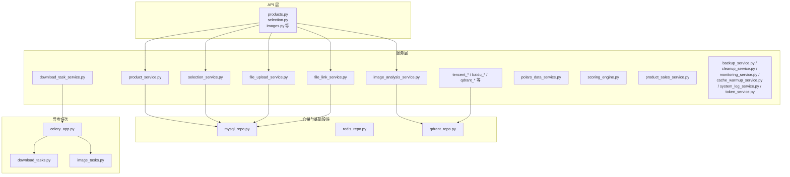
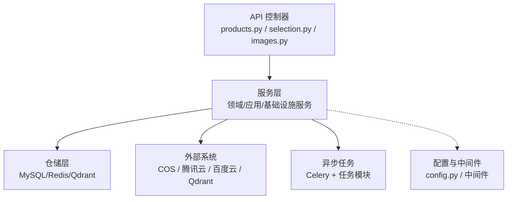
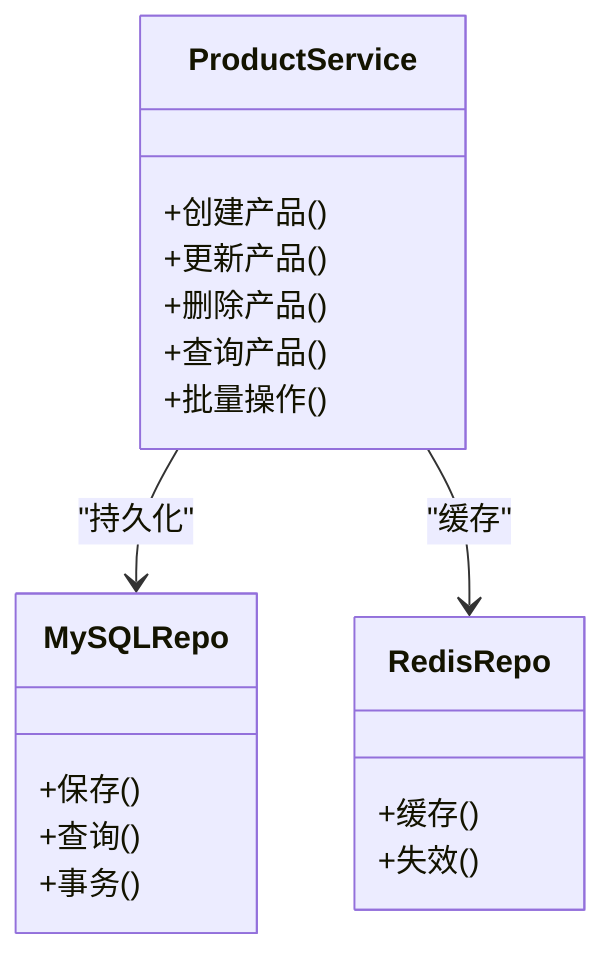
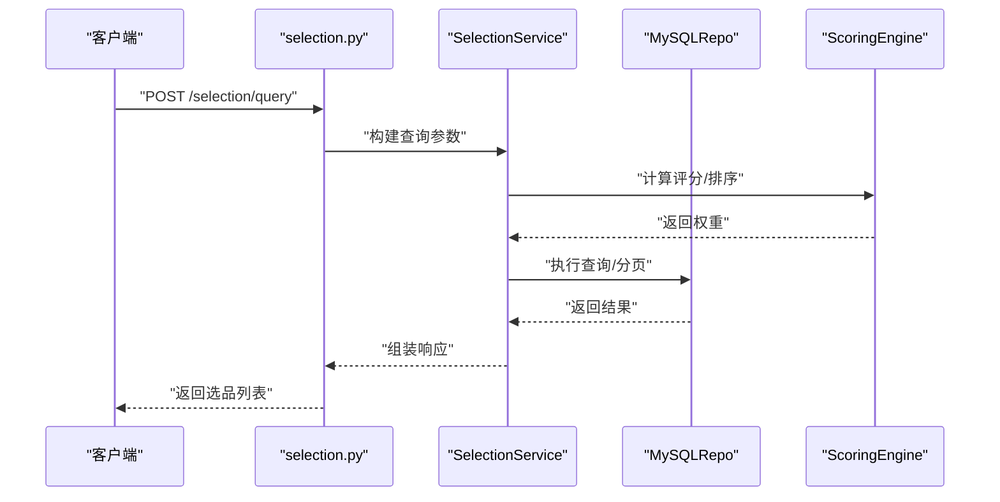
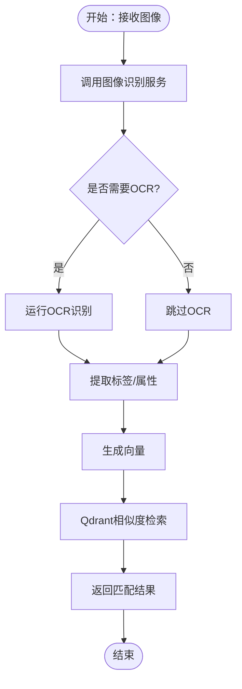
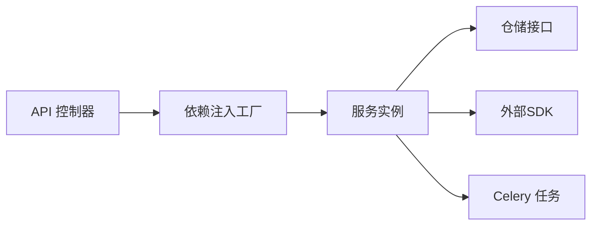

# 业务逻辑层

<cite>
**本文引用的文件**
- [main.py](file://backend/app/main.py)
- [products.py](file://backend/app/api/v1/products.py)
- [product_data.py](file://backend/app/api/v1/product_data.py)
- [selection.py](file://backend/app/api/v1/selection.py)
- [selection_recycle.py](file://backend/app/api/v1/selection_recycle.py)
- [images.py](file://backend/app/api/v1/images.py)
- [file_links.py](file://backend/app/api/v1/file_links.py)
- [product_service.py](file://backend/app/services/product_service.py)
- [product_data_service.py](file://backend/app/services/product_data_service.py)
- [selection_service.py](file://backend/app/services/selection_service.py)
- [selection_recycle_service.py](file://backend/app/services/selection_recycle_service.py)
- [image_analysis_service.py](file://backend/app/services/image_analysis_service.py)
- [file_upload_service.py](file://backend/app/services/file_upload_service.py)
- [file_link_service.py](file://backend/app/services/file_link_service.py)
- [tencent_image_recognition_service.py](file://backend/app/services/tencent_image_recognition_service.py)
- [baidu_image_recognition_service.py](file://backend/app/services/baidu_image_recognition_service.py)
- [tencent_image_search_service.py](file://backend/app/services/tencent_image_search_service.py)
- [tencent_llm_vision_service.py](file://backend/app/services/tencent_llm_vision_service.py)
- [cos_service.py](file://backend/app/services/cos_service.py)
- [local_file_service.py](file://backend/app/services/local_file_service.py)
- [library_image_service.py](file://backend/app/services/library_image_service.py)
- [download_task_service.py](file://backend/app/services/download_task_service.py)
- [polars_data_service.py](file://backend/app/services/polars_data_service.py)
- [scoring_engine.py](file://backend/app/services/scoring_engine.py)
- [product_sales_service.py](file://backend/app/services/product_sales_service.py)
- [backup_service.py](file://backend/app/services/backup_service.py)
- [cleanup_service.py](file://backend/app/services/cleanup_service.py)
- [monitoring_service.py](file://backend/app/services/monitoring_service.py)
- [cache_warmup_service.py](file://backend/app/services/cache_warmup_service.py)
- [system_log_service.py](file://backend/app/services/system_log_service.py)
- [token_service.py](file://backend/app/services/token_service.py)
- [celery_app.py](file://backend/app/tasks/celery_app.py)
- [download_tasks.py](file://backend/app/tasks/download_tasks.py)
- [image_tasks.py](file://backend/app/tasks/image_tasks.py)
- [jwt_utils.py](file://backend/app/utils/jwt_utils.py)
- [error_handler.py](file://backend/app/middleware/error_handler.py)
- [error_middleware.py](file://backend/app/middleware/error_middleware.py)
- [timeout.py](file://backend/app/middleware/timeout.py)
- [logging.py](file://backend/app/middleware/logging.py)
- [product.py](file://backend/app/models/product.py)
- [selection.py](file://backend/app/models/selection.py)
- [final_draft.py](file://backend/app/models/final_draft.py)
- [file_link.py](file://backend/app/models/file_link.py)
- [mysql_repo.py](file://backend/app/repositories/mysql_repo.py)
- [redis_repo.py](file://backend/app/repositories/redis_repo.py)
- [qdrant_repo.py](file://backend/app/repositories/qdrant_repo.py)
- [config.py](file://backend/app/config.py)
- [config.py](file://config/ports.json)
</cite>

## 目录
1. [引言](#引言)
2. [项目结构](#项目结构)
3. [核心组件](#核心组件)
4. [架构总览](#架构总览)
5. [详细组件分析](#详细组件分析)
6. [依赖分析](#依赖分析)
7. [性能考虑](#性能考虑)
8. [故障排查指南](#故障排查指南)
9. [结论](#结论)
10. [附录](#附录)

## 引言
本指南面向业务逻辑层（服务层）的开发者，系统性阐述服务层的设计模式与职责划分：领域服务、应用服务与基础设施服务的边界；并围绕产品服务、选品服务、图像分析服务等核心业务服务，给出实现要点、复杂业务规则处理、事务与并发控制、服务间依赖与调用模式、依赖注入与服务组合、异常处理、数据校验与输入输出转换、异步任务与后台作业调度、以及单元测试与Mock策略。目标是帮助开发者在不深入源码细节的前提下，快速理解并正确扩展业务逻辑层。

## 项目结构
后端采用Python FastAPI应用与Celery异步任务相结合的架构，服务层位于 backend/app/services，API层位于 backend/app/api/v1，模型与仓储位于 backend/app/models 与 backend/app/repositories，中间件与工具位于 backend/app/middleware 与 backend/app/utils。整体呈现“API层 → 服务层 → 仓储层”的分层结构，服务层负责编排业务规则与外部依赖。



图表来源
- [products.py](file://backend/app/api/v1/products.py)
- [selection.py](file://backend/app/api/v1/selection.py)
- [images.py](file://backend/app/api/v1/images.py)
- [product_service.py](file://backend/app/services/product_service.py)
- [selection_service.py](file://backend/app/services/selection_service.py)
- [image_analysis_service.py](file://backend/app/services/image_analysis_service.py)
- [file_upload_service.py](file://backend/app/services/file_upload_service.py)
- [file_link_service.py](file://backend/app/services/file_link_service.py)
- [mysql_repo.py](file://backend/app/repositories/mysql_repo.py)
- [redis_repo.py](file://backend/app/repositories/redis_repo.py)
- [qdrant_repo.py](file://backend/app/repositories/qdrant_repo.py)
- [celery_app.py](file://backend/app/tasks/celery_app.py)
- [download_tasks.py](file://backend/app/tasks/download_tasks.py)
- [image_tasks.py](file://backend/app/tasks/image_tasks.py)

章节来源
- [main.py](file://backend/app/main.py)
- [products.py](file://backend/app/api/v1/products.py)
- [selection.py](file://backend/app/api/v1/selection.py)
- [images.py](file://backend/app/api/v1/images.py)

## 核心组件
本节聚焦服务层的关键服务及其职责与协作关系，涵盖产品、选品、图像分析、文件与下载、数据处理与统计、监控与运维等。

- 产品相关
  - 产品服务：封装产品实体的业务规则、状态流转与聚合操作，协调仓储与外部接口。
  - 产品数据服务：处理产品数据的聚合、清洗、导出与报表生成。
  - 产品销售服务：处理销售维度的数据统计与指标计算。
- 选品相关
  - 选品服务：执行选品查询、过滤、打分与结果管理。
  - 选品回收站服务：对选品进行软删除、恢复与批量清理。
- 图像与文件
  - 图像分析服务：对接多家AI视觉服务，统一图像特征提取与相似度检索。
  - 文件上传服务：统一文件上传、命名、存储与归档。
  - 文件链接服务：生成与管理文件访问链接。
  - 腾讯/百度图像识别服务：提供OCR、标签识别等能力。
  - 腾讯图像搜索服务：基于向量检索的以图搜图。
  - 腾讯LLM视觉服务：多模态视觉问答与描述。
  - COS/本地文件服务：对象存储与本地文件的统一抽象。
  - 库存图片服务：图片资源的统一管理与访问。
- 数据与统计
  - Polars数据服务：高性能数据处理与批处理。
  - 评分引擎：对产品或选品进行多维评分与排序。
- 运维与监控
  - 备份服务、清理服务、监控服务、缓存预热服务、系统日志服务、令牌服务：保障系统稳定性与可观测性。

章节来源
- [product_service.py](file://backend/app/services/product_service.py)
- [product_data_service.py](file://backend/app/services/product_data_service.py)
- [product_sales_service.py](file://backend/app/services/product_sales_service.py)
- [selection_service.py](file://backend/app/services/selection_service.py)
- [selection_recycle_service.py](file://backend/app/services/selection_recycle_service.py)
- [image_analysis_service.py](file://backend/app/services/image_analysis_service.py)
- [file_upload_service.py](file://backend/app/services/file_upload_service.py)
- [file_link_service.py](file://backend/app/services/file_link_service.py)
- [tencent_image_recognition_service.py](file://backend/app/services/tencent_image_recognition_service.py)
- [baidu_image_recognition_service.py](file://backend/app/services/baidu_image_recognition_service.py)
- [tencent_image_search_service.py](file://backend/app/services/tencent_image_search_service.py)
- [tencent_llm_vision_service.py](file://backend/app/services/tencent_llm_vision_service.py)
- [cos_service.py](file://backend/app/services/cos_service.py)
- [local_file_service.py](file://backend/app/services/local_file_service.py)
- [library_image_service.py](file://backend/app/services/library_image_service.py)
- [polars_data_service.py](file://backend/app/services/polars_data_service.py)
- [scoring_engine.py](file://backend/app/services/scoring_engine.py)
- [backup_service.py](file://backend/app/services/backup_service.py)
- [cleanup_service.py](file://backend/app/services/cleanup_service.py)
- [monitoring_service.py](file://backend/app/services/monitoring_service.py)
- [cache_warmup_service.py](file://backend/app/services/cache_warmup_service.py)
- [system_log_service.py](file://backend/app/services/system_log_service.py)
- [token_service.py](file://backend/app/services/token_service.py)

## 架构总览
服务层遵循“领域服务”承载核心业务规则、“应用服务”编排流程与事务、“基础设施服务”对接外部系统与存储”的分层原则。API层通过依赖注入获取服务实例，服务层内部通过仓储与第三方SDK完成数据持久化与外部调用，Celery负责异步任务编排。



图表来源
- [products.py](file://backend/app/api/v1/products.py)
- [selection.py](file://backend/app/api/v1/selection.py)
- [images.py](file://backend/app/api/v1/images.py)
- [product_service.py](file://backend/app/services/product_service.py)
- [mysql_repo.py](file://backend/app/repositories/mysql_repo.py)
- [redis_repo.py](file://backend/app/repositories/redis_repo.py)
- [qdrant_repo.py](file://backend/app/repositories/qdrant_repo.py)
- [celery_app.py](file://backend/app/tasks/celery_app.py)

## 详细组件分析

### 产品服务（领域服务）
- 职责
  - 维护产品实体的业务规则与状态机（如草稿、待审、发布、下架等）。
  - 编排产品数据的聚合、校验与更新流程。
  - 与仓储交互，确保一致性与原子性。
- 关键点
  - 事务边界：在需要跨表/跨模型更新时，使用事务包裹。
  - 并发控制：对关键字段（如版本号、唯一索引）使用乐观锁或唯一约束。
  - 输入校验：对请求参数与数据字典进行严格校验。
  - 输出转换：将模型对象转换为API响应结构，避免泄露内部实现。
- 依赖关系
  - 依赖 MySQL 仓储与 Redis 缓存。
  - 可能依赖评分引擎与图像分析服务用于增强产品画像。



图表来源
- [product_service.py](file://backend/app/services/product_service.py)
- [mysql_repo.py](file://backend/app/repositories/mysql_repo.py)
- [redis_repo.py](file://backend/app/repositories/redis_repo.py)

章节来源
- [product_service.py](file://backend/app/services/product_service.py)
- [product.py](file://backend/app/models/product.py)

### 选品服务（应用服务）
- 职责
  - 执行选品查询、过滤、打分与结果集管理。
  - 维护选品历史与收藏状态。
  - 与评分引擎协作，支持多维排序与推荐。
- 关键点
  - 复杂查询：组合条件过滤、分页、排序与聚合。
  - 事务与幂等：保证收藏/取消收藏等操作的幂等性。
  - 回收站：软删除与恢复流程需保持数据一致性。
- 依赖关系
  - 依赖 MySQL 仓储。
  - 可能依赖 Qdrant 向量检索与 Polars 数据处理。



图表来源
- [selection.py](file://backend/app/api/v1/selection.py)
- [selection_service.py](file://backend/app/services/selection_service.py)
- [mysql_repo.py](file://backend/app/repositories/mysql_repo.py)
- [scoring_engine.py](file://backend/app/services/scoring_engine.py)

章节来源
- [selection_service.py](file://backend/app/services/selection_service.py)
- [selection_recycle_service.py](file://backend/app/services/selection_recycle_service.py)
- [selection.py](file://backend/app/api/v1/selection.py)
- [selection_recycle.py](file://backend/app/api/v1/selection_recycle.py)

### 图像分析服务（基础设施服务）
- 职责
  - 统一图像分析能力，屏蔽不同供应商差异。
  - 支持OCR、标签识别、相似度检索、视觉问答等。
- 关键点
  - 多供应商适配：腾讯云、百度云等，统一返回格式。
  - 向量检索：与Qdrant协作，实现以图搜图。
  - 错误重试与降级：网络波动与限流下的容错策略。
- 依赖关系
  - 依赖 Qdrant 仓储与第三方SDK。
  - 依赖 COS/本地文件服务提供图像访问。



图表来源
- [image_analysis_service.py](file://backend/app/services/image_analysis_service.py)
- [tencent_image_recognition_service.py](file://backend/app/services/tencent_image_recognition_service.py)
- [baidu_image_recognition_service.py](file://backend/app/services/baidu_image_recognition_service.py)
- [tencent_image_search_service.py](file://backend/app/services/tencent_image_search_service.py)
- [qdrant_repo.py](file://backend/app/repositories/qdrant_repo.py)

章节来源
- [image_analysis_service.py](file://backend/app/services/image_analysis_service.py)
- [tencent_image_recognition_service.py](file://backend/app/services/tencent_image_recognition_service.py)
- [baidu_image_recognition_service.py](file://backend/app/services/baidu_image_recognition_service.py)
- [tencent_image_search_service.py](file://backend/app/services/tencent_image_search_service.py)
- [tencent_llm_vision_service.py](file://backend/app/services/tencent_llm_vision_service.py)

### 文件与下载服务（基础设施服务）
- 职责
  - 文件上传、命名、存储与归档。
  - 文件链接生成与访问控制。
  - 下载任务的调度与状态跟踪。
- 关键点
  - 安全性：文件类型校验、路径规范化、访问鉴权。
  - 可靠性：断点续传、重试与失败回滚。
  - 性能：分片上传、并行下载、CDN加速。
- 依赖关系
  - 依赖 COS/本地文件服务与下载任务队列。

```mermaid
sequenceDiagram
participant Client as "客户端"
participant API as "images.py / file_links.py"
participant Upload as "FileUploadService"
participant Link as "FileLinkService"
participant Store as "COSService/LocalFileService"
participant Task as "DownloadTaskService"
Client->>API : "上传/下载请求"
API->>Upload : "处理上传"
Upload->>Store : "写入存储"
Store-->>Upload : "返回访问地址"
Upload->>Link : "生成文件链接"
Link-->>API : "返回链接"
API-->>Client : "返回结果"
Client->>API : "触发下载任务"
API->>Task : "创建下载任务"
Task-->>Client : "返回任务ID"
```

图表来源
- [images.py](file://backend/app/api/v1/images.py)
- [file_links.py](file://backend/app/api/v1/file_links.py)
- [file_upload_service.py](file://backend/app/services/file_upload_service.py)
- [file_link_service.py](file://backend/app/services/file_link_service.py)
- [cos_service.py](file://backend/app/services/cos_service.py)
- [local_file_service.py](file://backend/app/services/local_file_service.py)
- [download_task_service.py](file://backend/app/services/download_task_service.py)

章节来源
- [file_upload_service.py](file://backend/app/services/file_upload_service.py)
- [file_link_service.py](file://backend/app/services/file_link_service.py)
- [download_task_service.py](file://backend/app/services/download_task_service.py)
- [cos_service.py](file://backend/app/services/cos_service.py)
- [local_file_service.py](file://backend/app/services/local_file_service.py)

### 数据处理与统计（应用/基础设施服务）
- 职责
  - 使用Polars进行高性能数据处理与批处理。
  - 生成销售与产品数据报表。
- 关键点
  - 内存与IO优化：分块处理、列式存储、索引利用。
  - 事务与幂等：批处理任务的去重与重入保护。

章节来源
- [polars_data_service.py](file://backend/app/services/polars_data_service.py)
- [product_sales_service.py](file://backend/app/services/product_sales_service.py)

### 运维与监控（基础设施服务）
- 职责
  - 备份、清理、监控、缓存预热、系统日志、令牌管理。
- 关键点
  - 周期性任务：定时备份、缓存预热、日志清理。
  - 观测性：指标采集、告警阈值、日志分级。

章节来源
- [backup_service.py](file://backend/app/services/backup_service.py)
- [cleanup_service.py](file://backend/app/services/cleanup_service.py)
- [monitoring_service.py](file://backend/app/services/monitoring_service.py)
- [cache_warmup_service.py](file://backend/app/services/cache_warmup_service.py)
- [system_log_service.py](file://backend/app/services/system_log_service.py)
- [token_service.py](file://backend/app/services/token_service.py)

## 依赖分析
- 依赖注入与服务组合
  - API层通过工厂函数按需注入服务实例，便于替换与测试。
  - 服务层内部通过构造函数注入仓储与外部SDK，降低紧耦合。
- 外部依赖
  - 数据库：MySQL（仓储）、Redis（缓存）、Qdrant（向量检索）。
  - 对象存储：COS/本地文件。
  - 第三方AI服务：腾讯云、百度云。
- 异步依赖
  - Celery负责后台任务编排，任务模块与服务层解耦。



图表来源
- [products.py](file://backend/app/api/v1/products.py)
- [selection.py](file://backend/app/api/v1/selection.py)
- [images.py](file://backend/app/api/v1/images.py)
- [file_links.py](file://backend/app/api/v1/file_links.py)
- [celery_app.py](file://backend/app/tasks/celery_app.py)

章节来源
- [products.py](file://backend/app/api/v1/products.py)
- [selection.py](file://backend/app/api/v1/selection.py)
- [images.py](file://backend/app/api/v1/images.py)
- [file_links.py](file://backend/app/api/v1/file_links.py)
- [celery_app.py](file://backend/app/tasks/celery_app.py)

## 性能考虑
- 仓储层
  - 使用连接池与批量写入减少IO开销。
  - 为高频查询建立索引，避免全表扫描。
- 数据处理
  - 利用列式存储与向量化操作提升吞吐。
  - 分块处理与内存映射文件降低峰值内存。
- 缓存策略
  - LRU/LFU缓存热点数据，结合TTL与失效策略。
  - 缓存预热在低峰期执行，避免高峰抖动。
- 异步与并发
  - Celery任务拆分与并行执行，避免阻塞主线程。
  - 限流与熔断：对外部依赖设置超时与重试上限。

## 故障排查指南
- 异常处理
  - 统一异常包装与错误码定义，区分业务异常与系统异常。
  - 在中间件中捕获未处理异常，记录上下文并返回标准错误响应。
- 日志与追踪
  - 结合系统日志服务与中间件日志，定位慢查询与异常堆栈。
  - 为关键流程添加Span/Trace ID，便于链路追踪。
- 超时与重试
  - 对外部调用设置合理超时与指数退避重试。
  - 对重复请求进行幂等校验，避免重复处理。

章节来源
- [error_handler.py](file://backend/app/middleware/error_handler.py)
- [error_middleware.py](file://backend/app/middleware/error_middleware.py)
- [timeout.py](file://backend/app/middleware/timeout.py)
- [system_log_service.py](file://backend/app/services/system_log_service.py)

## 结论
业务逻辑层通过清晰的分层与职责划分，实现了从领域规则到应用编排再到基础设施对接的完整闭环。建议在新增服务时遵循“单一职责、高内聚、低耦合”的原则，并充分利用依赖注入、仓储抽象与异步任务，确保系统的可维护性与可扩展性。

## 附录

### 业务异常处理最佳实践
- 明确异常分类：参数校验异常、业务规则异常、系统异常。
- 统一响应格式：包含错误码、消息与可选上下文。
- 记录与上报：敏感信息脱敏，保留必要上下文。

章节来源
- [error_handler.py](file://backend/app/middleware/error_handler.py)
- [error_middleware.py](file://backend/app/middleware/error_middleware.py)

### 数据验证与输入输出转换
- 输入验证：在API层与服务层均进行参数校验，优先使用模型校验。
- 输出转换：使用数据传输对象（DTO）或Pydantic模型进行序列化。

章节来源
- [products.py](file://backend/app/api/v1/products.py)
- [selection.py](file://backend/app/api/v1/selection.py)
- [images.py](file://backend/app/api/v1/images.py)

### 事务管理与并发控制
- 事务：在跨表/跨模型更新时使用事务，确保原子性。
- 并发：对关键字段使用唯一约束与乐观锁，避免ABA问题。

章节来源
- [product_service.py](file://backend/app/services/product_service.py)
- [selection_service.py](file://backend/app/services/selection_service.py)

### 异步任务与后台作业调度
- 任务拆分：将耗时操作放入Celery任务，避免阻塞请求线程。
- 任务编排：使用任务链与广播，处理依赖与并行场景。
- 监控与重试：为任务设置最大重试次数与失败回调。

章节来源
- [celery_app.py](file://backend/app/tasks/celery_app.py)
- [download_tasks.py](file://backend/app/tasks/download_tasks.py)
- [image_tasks.py](file://backend/app/tasks/image_tasks.py)

### 单元测试编写指南与Mock策略
- Mock策略：对外部SDK与仓储使用Mock对象，隔离真实依赖。
- 测试覆盖：关注边界条件、异常分支与事务回滚场景。
- 集成测试：对关键流程进行端到端验证，确保服务间协作正确。

章节来源
- [product_service.py](file://backend/app/services/product_service.py)
- [selection_service.py](file://backend/app/services/selection_service.py)
- [image_analysis_service.py](file://backend/app/services/image_analysis_service.py)