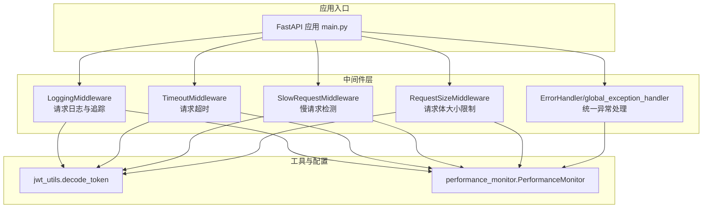
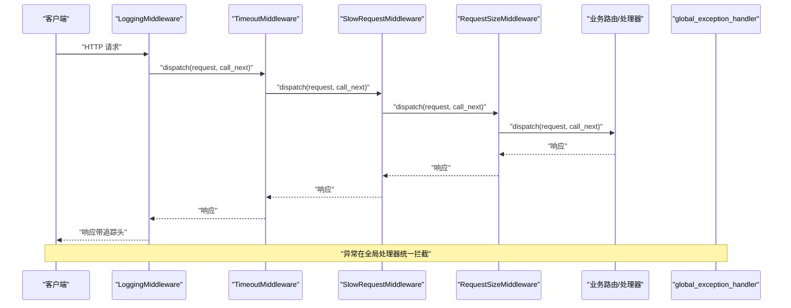
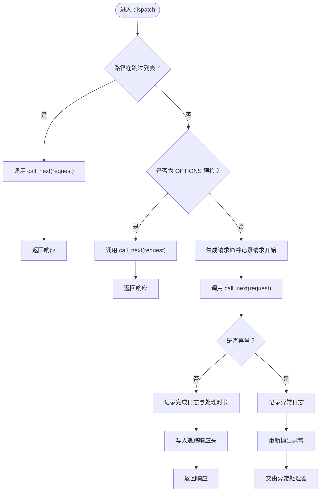
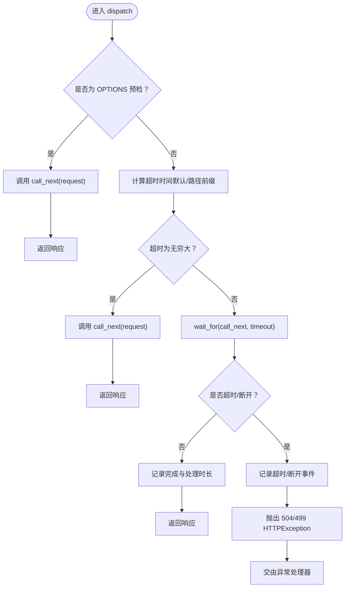
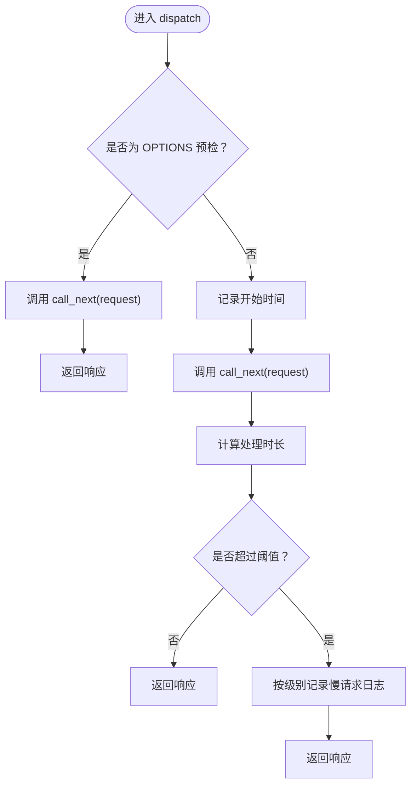
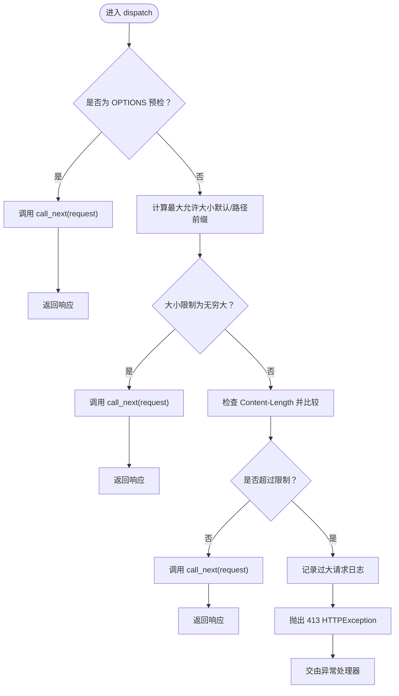
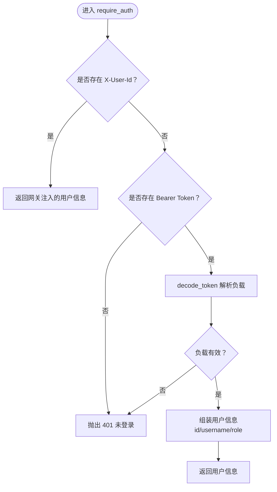
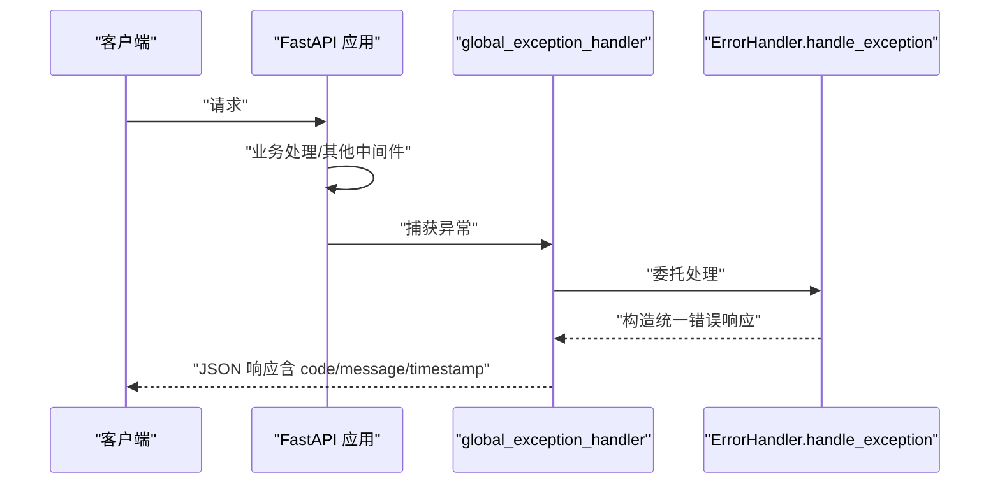
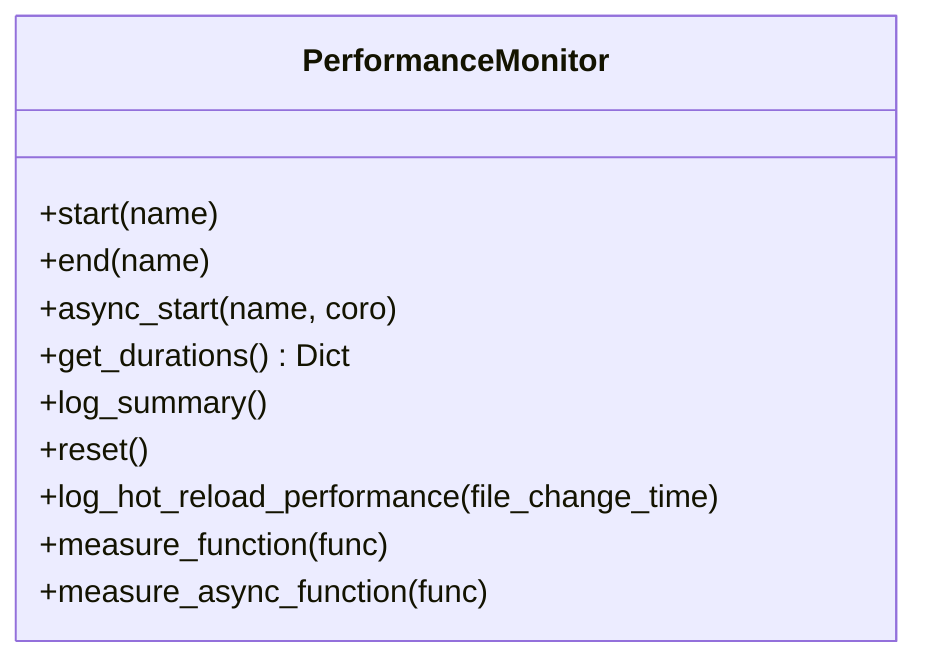
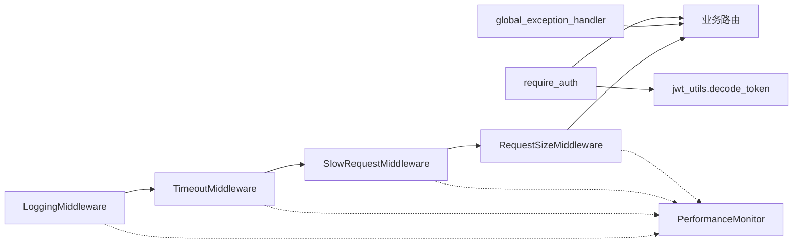

# 中间件与拦截器

<cite>
**本文引用的文件**
- [backend/app/middleware/__init__.py](file://backend/app/middleware/__init__.py)
- [backend/app/middleware/logging.py](file://backend/app/middleware/logging.py)
- [backend/app/middleware/timeout.py](file://backend/app/middleware/timeout.py)
- [backend/app/middleware/auth_middleware.py](file://backend/app/middleware/auth_middleware.py)
- [backend/app/middleware/error_handler.py](file://backend/app/middleware/error_handler.py)
- [backend/app/middleware/error_middleware.py](file://backend/app/middleware/error_middleware.py)
- [backend/app/utils/jwt_utils.py](file://backend/app/utils/jwt_utils.py)
- [backend/app/utils/performance_monitor.py](file://backend/app/utils/performance_monitor.py)
- [backend/app/main.py](file://backend/app/main.py)
</cite>

## 目录
1. [简介](#简介)
2. [项目结构](#项目结构)
3. [核心组件](#核心组件)
4. [架构总览](#架构总览)
5. [详细组件分析](#详细组件分析)
6. [依赖分析](#依赖分析)
7. [性能考量](#性能考量)
8. [故障排查指南](#故障排查指南)
9. [结论](#结论)
10. [附录](#附录)

## 简介
本文件面向中间件与拦截器系统的开发者与维护者，系统性阐述后端中间件链的执行顺序与作用机制，覆盖请求预处理、响应后处理与异常拦截；详解认证中间件（JWT解析、用户身份与角色校验）、错误处理中间件（统一业务/系统/网络异常）、性能监控中间件（请求计时、慢查询检测）、日志中间件（请求/响应/结构化日志）、超时与限流策略，并提供自定义中间件开发指南与最佳实践。

## 项目结构
后端中间件位于 backend/app/middleware 目录，配合 main.py 进行装配，日志与性能监控工具位于 backend/app/utils 目录，认证依赖 JWT 工具。

**图表来源**
- [backend/app/main.py:337-377](file://backend/app/main.py#L337-L377)
- [backend/app/middleware/logging.py:12-124](file://backend/app/middleware/logging.py#L12-L124)
- [backend/app/middleware/timeout.py:13-152](file://backend/app/middleware/timeout.py#L13-L152)
- [backend/app/middleware/error_handler.py:19-100](file://backend/app/middleware/error_handler.py#L19-L100)
- [backend/app/utils/jwt_utils.py:19-30](file://backend/app/utils/jwt_utils.py#L19-L30)
- [backend/app/utils/performance_monitor.py:9-158](file://backend/app/utils/performance_monitor.py#L9-L158)

**章节来源**
- [backend/app/middleware/__init__.py:1-11](file://backend/app/middleware/__init__.py#L1-L11)
- [backend/app/main.py:337-377](file://backend/app/main.py#L337-L377)

## 核心组件
- 日志中间件：记录请求/响应、生成请求ID、追踪处理时间，支持跳过健康检查与CORS预检。
- 超时中间件：为不同路径设置超时，超时返回504，客户端断开返回499。
- 慢请求中间件：检测超过阈值的请求，仅记录日志，不中断请求。
- 请求大小限制中间件：基于 Content-Length 限制请求体大小，防止大体积上传。
- 认证中间件：优先读取网关注入的用户头，否则解析 Authorization 头中的 JWT。
- 错误处理中间件：统一异常捕获与响应格式，区分 HTTP/验证/通用异常。
- 性能监控工具：提供计时、摘要与装饰器式测量能力。

**章节来源**
- [backend/app/middleware/logging.py:12-124](file://backend/app/middleware/logging.py#L12-L124)
- [backend/app/middleware/timeout.py:13-152](file://backend/app/middleware/timeout.py#L13-L152)
- [backend/app/middleware/timeout.py:154-238](file://backend/app/middleware/timeout.py#L154-L238)
- [backend/app/middleware/timeout.py:241-356](file://backend/app/middleware/timeout.py#L241-L356)
- [backend/app/middleware/auth_middleware.py:12-39](file://backend/app/middleware/auth_middleware.py#L12-L39)
- [backend/app/middleware/error_handler.py:19-100](file://backend/app/middleware/error_handler.py#L19-L100)
- [backend/app/middleware/error_middleware.py:18-171](file://backend/app/middleware/error_middleware.py#L18-L171)
- [backend/app/utils/performance_monitor.py:9-158](file://backend/app/utils/performance_monitor.py#L9-L158)

## 架构总览
中间件链在 FastAPI 应用启动时按注册顺序装配，形成“请求进入 → 日志 → 超时 → 慢请求 → 请求大小 → 业务路由 → 响应返回”的处理流水线。异常在全局异常处理器处统一拦截并格式化输出。

**图表来源**
- [backend/app/main.py:337-377](file://backend/app/main.py#L337-L377)
- [backend/app/middleware/logging.py:40-124](file://backend/app/middleware/logging.py#L40-L124)
- [backend/app/middleware/timeout.py:72-152](file://backend/app/middleware/timeout.py#L72-L152)
- [backend/app/middleware/error_handler.py:98-100](file://backend/app/middleware/error_handler.py#L98-L100)

**章节来源**
- [backend/app/main.py:337-377](file://backend/app/main.py#L337-L377)

## 详细组件分析

### 日志中间件（LoggingMiddleware）
- 功能要点
  - 生成唯一请求ID并写入响应头，便于跨服务追踪。
  - 记录请求开始/完成/异常的结构化日志，包含客户端IP、方法、路径、查询参数、User-Agent、处理时长等。
  - 跳过健康检查与CORS预检请求，降低噪音。
- 设计模式
  - 基于 BaseHTTPMiddleware 的 dispatch 模式，串联 call_next。
- 性能影响
  - 仅记录必要字段，避免对高频接口造成显著开销。
- 配置项
  - skip_paths：默认跳过 /health 与 /metrics。

**图表来源**
- [backend/app/middleware/logging.py:40-124](file://backend/app/middleware/logging.py#L40-L124)

**章节来源**
- [backend/app/middleware/logging.py:12-124](file://backend/app/middleware/logging.py#L12-L124)

### 超时中间件（TimeoutMiddleware）
- 功能要点
  - 为不同路径设置差异化超时，支持默认超时与路径前缀匹配。
  - 超时返回 504，客户端断开返回 499。
  - 跳过健康检查与CORS预检。
- 设计模式
  - 使用 asyncio.wait_for 实现超时控制。
- 配置项
  - default_timeout、path_timeouts、skip_paths。

**图表来源**
- [backend/app/middleware/timeout.py:72-152](file://backend/app/middleware/timeout.py#L72-L152)

**章节来源**
- [backend/app/middleware/timeout.py:13-152](file://backend/app/middleware/timeout.py#L13-L152)

### 慢请求中间件（SlowRequestMiddleware）
- 功能要点
  - 在请求完成后检测处理时长是否超过阈值，按配置的日志级别记录慢请求。
  - 不中断请求，仅做观测。
- 设计模式
  - 在 call_next 之后计算处理时长并判定阈值。
- 配置项
  - slow_threshold、log_level。

**图表来源**
- [backend/app/middleware/timeout.py:188-238](file://backend/app/middleware/timeout.py#L188-L238)

**章节来源**
- [backend/app/middleware/timeout.py:154-238](file://backend/app/middleware/timeout.py#L154-L238)

### 请求大小限制中间件（RequestSizeMiddleware）
- 功能要点
  - 基于 Content-Length 判断请求体大小，超过阈值返回 413。
  - 支持路径前缀差异化限制。
  - 跳过健康检查与CORS预检。
- 设计模式
  - 在 call_next 之前检查请求体大小。
- 配置项
  - max_size、path_sizes、skip_paths。

**图表来源**
- [backend/app/middleware/timeout.py:300-356](file://backend/app/middleware/timeout.py#L300-L356)

**章节来源**
- [backend/app/middleware/timeout.py:241-356](file://backend/app/middleware/timeout.py#L241-L356)

### 认证中间件（require_auth 与 is_admin）
- 功能要点
  - 优先从网关注入的 X-User-* 头提取用户信息；若不存在则解析 Authorization 头中的 JWT。
  - 提供 is_admin 辅助判断用户角色是否为管理员。
- 依赖
  - JWT 解析依赖 jwt_utils.decode_token。
- 异常
  - 未登录时抛出 401。

**图表来源**
- [backend/app/middleware/auth_middleware.py:12-39](file://backend/app/middleware/auth_middleware.py#L12-L39)
- [backend/app/utils/jwt_utils.py:19-30](file://backend/app/utils/jwt_utils.py#L19-L30)

**章节来源**
- [backend/app/middleware/auth_middleware.py:12-39](file://backend/app/middleware/auth_middleware.py#L12-L39)
- [backend/app/utils/jwt_utils.py:19-30](file://backend/app/utils/jwt_utils.py#L19-L30)

### 错误处理中间件（统一异常处理）
- ErrorHandler（函数式）
  - 统一记录异常日志，区分 HTTP/Starlette/验证/网络/通用异常，返回结构化 JSON 响应。
  - 开启 DEBUG 时附加调试信息。
- ErrorMiddleware（类式）
  - 通过 app.exception_handler 注册多种异常处理器，分别处理 HTTP/验证/通用异常，输出统一格式。
- 全局异常处理器
  - 在 main.py 中注册，覆盖 StarletteHTTPException、RequestValidationError、Exception。

**图表来源**
- [backend/app/middleware/error_handler.py:25-85](file://backend/app/middleware/error_handler.py#L25-L85)
- [backend/app/middleware/error_middleware.py:35-53](file://backend/app/middleware/error_middleware.py#L35-L53)
- [backend/app/main.py:374-377](file://backend/app/main.py#L374-L377)

**章节来源**
- [backend/app/middleware/error_handler.py:19-100](file://backend/app/middleware/error_handler.py#L19-L100)
- [backend/app/middleware/error_middleware.py:18-171](file://backend/app/middleware/error_middleware.py#L18-L171)
- [backend/app/main.py:374-377](file://backend/app/main.py#L374-L377)

### 性能监控工具（PerformanceMonitor）
- 功能要点
  - 提供 start/end、async_start、measure_function/measure_async_function 等能力，用于记录阶段耗时与摘要。
  - 支持热重载性能记录与日志摘要输出。
- 使用建议
  - 在关键路径（如数据库连接、向量检索、批量处理）使用 start/end 包裹。
  - 在异步任务中使用 async_start 记录耗时与异常。

**图表来源**
- [backend/app/utils/performance_monitor.py:9-158](file://backend/app/utils/performance_monitor.py#L9-L158)

**章节来源**
- [backend/app/utils/performance_monitor.py:9-158](file://backend/app/utils/performance_monitor.py#L9-L158)

## 依赖分析
- 中间件装配顺序
  - LoggingMiddleware → TimeoutMiddleware → SlowRequestMiddleware → RequestSizeMiddleware → 业务路由。
  - 全局异常处理器在 main.py 中注册，覆盖所有异常类型。
- 关键依赖
  - LoggingMiddleware 依赖 request.state.request_id 与响应头写入。
  - Timeout/Slow/Size 依赖请求方法与 Content-Length。
  - 认证中间件依赖 jwt_utils.decode_token。
  - 性能监控工具被日志/超时/慢请求/大小中间件间接使用。

**图表来源**
- [backend/app/main.py:337-377](file://backend/app/main.py#L337-L377)
- [backend/app/middleware/logging.py:40-124](file://backend/app/middleware/logging.py#L40-L124)
- [backend/app/middleware/timeout.py:72-152](file://backend/app/middleware/timeout.py#L72-L152)
- [backend/app/middleware/auth_middleware.py:12-39](file://backend/app/middleware/auth_middleware.py#L12-L39)
- [backend/app/utils/jwt_utils.py:19-30](file://backend/app/utils/jwt_utils.py#L19-L30)
- [backend/app/utils/performance_monitor.py:9-158](file://backend/app/utils/performance_monitor.py#L9-L158)

**章节来源**
- [backend/app/main.py:337-377](file://backend/app/main.py#L337-L377)

## 性能考量
- 中间件顺序与开销
  - LoggingMiddleware 与 TimeoutMiddleware 为轻量日志与计时，通常开销极低。
  - SlowRequestMiddleware 仅在完成后计算时长，开销与日志级别相关。
  - RequestSizeMiddleware 仅读取 Content-Length，开销很小。
- 超时与慢请求
  - 合理设置 path_timeouts 与 slow_threshold，避免误伤正常业务。
- 日志与追踪
  - 响应头携带 X-Request-ID 与 X-Process-Time，便于前端与网关侧关联。
- 性能监控
  - 使用 PerformanceMonitor 对关键路径进行度量，结合日志摘要定位瓶颈。

[本节为通用指导，无需具体文件引用]

## 故障排查指南
- 401 未登录
  - 检查网关是否注入 X-User-* 头，或 Authorization 头是否为 Bearer Token。
  - 确认 JWT_SECRET_KEY/ALGORITHM 配置正确。
- 405 方法不允许
  - 统一异常处理器会将 405 映射为更友好的提示，检查 URL 是否多斜杠或路径不匹配。
- 413 请求体过大
  - 检查 RequestSizeMiddleware 的 path_sizes 配置，确认目标接口是否允许更大体积。
- 504 超时
  - 检查 TimeoutMiddleware 的 path_timeouts，确认目标接口是否需要更长超时。
  - 若为客户端断开，会返回 499，需关注网络稳定性。
- 500 服务器内部错误
  - 统一异常处理器会记录完整堆栈，结合 DEBUG 环境查看详细信息。
- 日志与追踪
  - 通过 X-Request-ID 关联请求链路，结合 slow_threshold 观测慢请求。

**章节来源**
- [backend/app/middleware/error_handler.py:43-63](file://backend/app/middleware/error_handler.py#L43-L63)
- [backend/app/middleware/timeout.py:121-151](file://backend/app/middleware/timeout.py#L121-L151)
- [backend/app/middleware/timeout.py:337-348](file://backend/app/middleware/timeout.py#L337-L348)
- [backend/app/middleware/auth_middleware.py:34-34](file://backend/app/middleware/auth_middleware.py#L34-L34)
- [backend/app/utils/jwt_utils.py:15-16](file://backend/app/utils/jwt_utils.py#L15-L16)

## 结论
该中间件体系以“轻量、可观测、可配置”为核心设计原则：日志中间件提供请求追踪与结构化日志；超时与慢请求中间件保障系统稳定性与性能可见性；请求大小限制中间件防范资源滥用；认证中间件兼容网关注入与 JWT 解析；统一错误处理中间件确保异常响应一致性。通过合理的配置与监控，可在保证用户体验的同时提升系统可靠性与可维护性。

[本节为总结，无需具体文件引用]

## 附录

### 自定义中间件开发指南与最佳实践
- 设计原则
  - 保持无状态与幂等，避免在中间件内持久化状态。
  - 尽量在 dispatch 内部完成逻辑，减少对上游的耦合。
  - 明确跳过条件（如健康检查、CORS 预检），降低噪音。
- 性能建议
  - 避免在中间件中进行昂贵的 I/O 或 CPU 密集操作；必要时使用异步与缓存。
  - 仅在需要时记录请求体/响应体，避免生产环境泄露敏感信息。
- 安全建议
  - 严格校验输入参数与请求头，避免信任不可信来源的数据。
  - 对敏感日志进行脱敏处理。
- 配置与扩展
  - 通过 path_* 配置实现差异化策略，便于灰度与演进。
  - 与 PerformanceMonitor 结合，对关键路径进行度量与回归。

[本节为通用指导，无需具体文件引用]