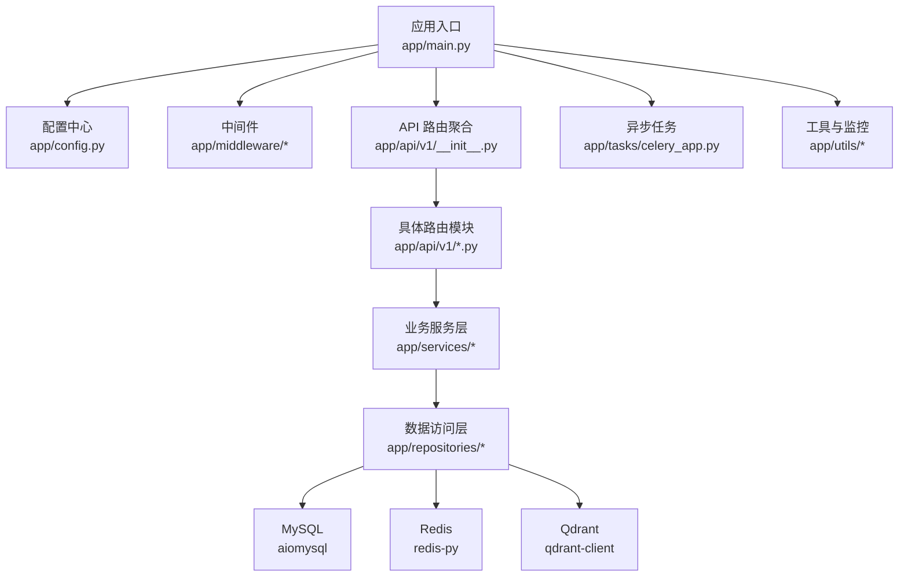
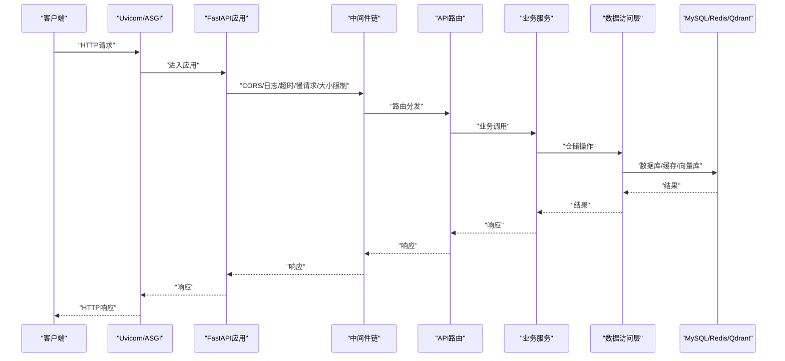
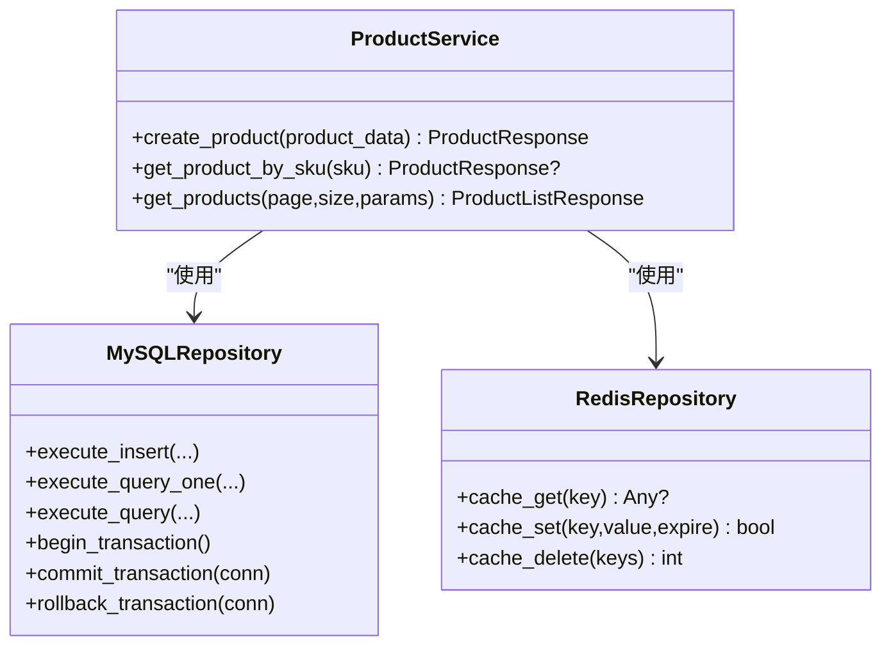
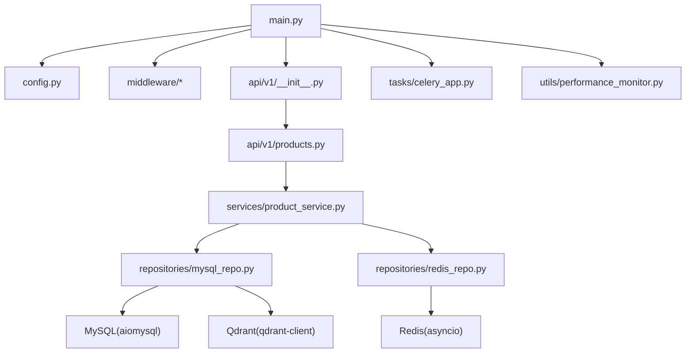

# 后端开发指南

<cite>
**本文引用的文件**
- [backend/app/main.py](file://backend/app/main.py)
- [backend/app/config.py](file://backend/app/config.py)
- [backend/app/__init__.py](file://backend/app/__init__.py)
- [backend/app/api/v1/__init__.py](file://backend/app/api/v1/__init__.py)
- [backend/app/middleware/__init__.py](file://backend/app/middleware/__init__.py)
- [backend/app/middleware/error_handler.py](file://backend/app/middleware/error_handler.py)
- [backend/app/repositories/mysql_repo.py](file://backend/app/repositories/mysql_repo.py)
- [backend/app/repositories/redis_repo.py](file://backend/app/repositories/redis_repo.py)
- [backend/app/repositories/qdrant_repo.py](file://backend/app/repositories/qdrant_repo.py)
- [backend/app/models/product.py](file://backend/app/models/product.py)
- [backend/app/api/v1/products.py](file://backend/app/api/v1/products.py)
- [backend/app/services/product_service.py](file://backend/app/services/product_service.py)
- [backend/app/tasks/celery_app.py](file://backend/app/tasks/celery_app.py)
- [backend/app/utils/performance_monitor.py](file://backend/app/utils/performance_monitor.py)
- [backend/requirements.txt](file://backend/requirements.txt)
</cite>

## 目录
1. [简介](#简介)
2. [项目结构](#项目结构)
3. [核心组件](#核心组件)
4. [架构总览](#架构总览)
5. [详细组件分析](#详细组件分析)
6. [依赖关系分析](#依赖关系分析)
7. [性能考量](#性能考量)
8. [故障排查指南](#故障排查指南)
9. [结论](#结论)
10. [附录](#附录)

## 简介
本指南面向思觉智贸后端开发团队，系统阐述基于 FastAPI 的 Python 后端架构设计与开发规范，涵盖 API 路由设计、业务逻辑层实现、数据模型定义、中间件配置、异常处理、性能优化策略，并给出 CRUD、文件上传、异步任务处理的实践路径。同时说明与 MySQL、Redis、Qdrant 的集成方式，以及单元测试、API 文档生成与代码审查流程建议。

## 项目结构
后端采用 FastAPI + 异步 ORM/缓存/向量库的分层架构：
- 应用入口与生命周期：app/main.py
- 配置中心：app/config.py
- 中间件：app/middleware/*
- 数据访问层：app/repositories/*
- 业务服务层：app/services/*
- API 路由：app/api/v1/*
- 工具与监控：app/utils/*
- 异步任务：app/tasks/*
- 依赖声明：backend/requirements.txt

图表来源
- [backend/app/main.py:314-475](file://backend/app/main.py#L314-L475)
- [backend/app/api/v1/__init__.py:13-83](file://backend/app/api/v1/__init__.py#L13-L83)

章节来源
- [backend/app/main.py:1-475](file://backend/app/main.py#L1-L475)
- [backend/app/config.py:1-296](file://backend/app/config.py#L1-L296)
- [backend/app/api/v1/__init__.py:1-83](file://backend/app/api/v1/__init__.py#L1-L83)

## 核心组件
- 应用入口与生命周期管理：负责数据库、缓存、向量库的并行初始化、健康检查、静态文件挂载、路由注册与优雅关停。
- 配置中心：集中管理环境变量、数据库、缓存、队列、COS、AI、性能与安全等配置。
- 中间件体系：CORS、日志、超时、慢请求、请求体大小限制、统一异常处理。
- 数据访问层：MySQL（aiomysql）、Redis（asyncio）、Qdrant（向量检索）。
- 业务服务层：封装领域逻辑，协调仓储与缓存。
- API 路由层：按模块组织，统一返回结构与鉴权依赖注入。
- 异步任务：Celery + Redis，支持队列路由与并发控制。
- 性能监控：启动阶段与关键路径的耗时统计与日志摘要。

章节来源
- [backend/app/main.py:44-312](file://backend/app/main.py#L44-L312)
- [backend/app/config.py:23-258](file://backend/app/config.py#L23-L258)
- [backend/app/middleware/error_handler.py:19-100](file://backend/app/middleware/error_handler.py#L19-L100)
- [backend/app/repositories/mysql_repo.py:11-800](file://backend/app/repositories/mysql_repo.py#L11-L800)
- [backend/app/repositories/redis_repo.py:23-547](file://backend/app/repositories/redis_repo.py#L23-L547)
- [backend/app/repositories/qdrant_repo.py:14-503](file://backend/app/repositories/qdrant_repo.py#L14-L503)
- [backend/app/tasks/celery_app.py:1-55](file://backend/app/tasks/celery_app.py#L1-L55)
- [backend/app/utils/performance_monitor.py:9-158](file://backend/app/utils/performance_monitor.py#L9-L158)

## 架构总览
下图展示应用启动、中间件链路、路由到服务与仓储的调用关系，以及外部依赖的交互。

图表来源
- [backend/app/main.py:326-377](file://backend/app/main.py#L326-L377)
- [backend/app/api/v1/products.py:36-50](file://backend/app/api/v1/products.py#L36-L50)
- [backend/app/services/product_service.py:21-36](file://backend/app/services/product_service.py#L21-L36)
- [backend/app/repositories/mysql_repo.py:11-800](file://backend/app/repositories/mysql_repo.py#L11-L800)
- [backend/app/repositories/redis_repo.py:23-547](file://backend/app/repositories/redis_repo.py#L23-L547)
- [backend/app/repositories/qdrant_repo.py:14-503](file://backend/app/repositories/qdrant_repo.py#L14-L503)

## 详细组件分析

### 应用入口与生命周期管理
- 生命周期钩子：启动时并行初始化 MySQL、Redis、Qdrant；执行轻量级 URL 格式检查；启动下载任务清理与临时文件清理；创建必要目录并清理过期缩略图缓存；关停时并行释放资源。
- 静态文件挂载：本地静态目录、图片目录、缩略图目录、数据看板 HTML。
- 路由注册：v1 路由聚合与独立模块路由注册。
- 异常处理：全局统一异常处理器。

章节来源
- [backend/app/main.py:44-312](file://backend/app/main.py#L44-L312)
- [backend/app/main.py:380-475](file://backend/app/main.py#L380-L475)

### 配置中心
- 环境与应用信息：ENVIRONMENT、APP_NAME、APP_VERSION、DEBUG、HOST、PORT、WORKERS、TIMEOUT。
- 数据库：MySQL 主机、端口、账号、库名、连接池大小、回收时间、echo、超时等。
- 缓存：Redis 主机、端口、DB、密码、池大小、socket 超时等。
- 队列：Celery Broker/Backend、序列化、时区、并发、路由等。
- 向量库：Qdrant 主机、端口、集合名、向量维度、距离度量。
- 文件存储：上传目录、图片根目录、缩略图目录、静态目录、模型缓存目录、备份目录、日志文件、前端静态目录。
- 对象存储：COS 开关、SecretId/Key、Bucket、Region、Scheme、超时、重试、前缀等。
- AI 模型：模型名、输入尺寸。
- 缓存策略：开关、TTL、本地缓存上限与TTL、键前缀、默认超时。
- 日志：级别、轮转大小、保留天数。
- CORS：允许来源、凭证、方法、头部。
- 安全：密钥、算法、Token 过期。
- 性能：请求超时、慢请求阈值、并发限制、限流、异步任务超时、最大并发。
- 业务限制：默认/最大搜索条数、相似搜索条数、批量上传/删除上限。
- 热重载：开关、监听目录、冷却时间、忽略模式。

章节来源
- [backend/app/config.py:23-258](file://backend/app/config.py#L23-L258)

### 中间件体系
- CORS：允许跨域请求。
- 日志中间件：可跳过健康与指标端点。
- 超时中间件：全局默认超时与路径级超时（如搜索、上传、下载等）。
- 慢请求中间件：慢请求阈值告警。
- 请求体大小中间件：全局最大上传大小与路径级放宽（单张/批量上传）。
- 统一异常处理：全局异常处理器，区分 HTTP、Starlette、校验错误、客户端断开等，返回统一结构。

章节来源
- [backend/app/middleware/error_handler.py:19-100](file://backend/app/middleware/error_handler.py#L19-L100)
- [backend/app/main.py:326-377](file://backend/app/main.py#L326-L377)

### 数据访问层

#### MySQL 仓储（aiomysql）
- 连接池管理、事务、索引自动创建、系统日志表初始化。
- 查询执行：超时控制、慢查询日志、性能指标统计。
- 常用操作：单条/多条查询、插入、批量插入、更新、删除、事务提交/回滚。
- 图片相关：创建图片记录、按ID获取、按分类查询、关键词搜索。

章节来源
- [backend/app/repositories/mysql_repo.py:11-800](file://backend/app/repositories/mysql_repo.py#L11-L800)

#### Redis 仓储（asyncio）
- 连接池管理、PING 测试。
- 数据结构：字符串、哈希、列表、集合、有序集合。
- 缓存操作：get/set/delete/exists/expire/ttl，带 JSON 序列化/反序列化。
- 缓存清理：按模式扫描并删除。

章节来源
- [backend/app/repositories/redis_repo.py:23-547](file://backend/app/repositories/redis_repo.py#L23-L547)

#### Qdrant 仓储
- 客户端连接、集合存在性检查与创建。
- 向量操作：单点/批量插入、更新、删除、检索、过滤检索。
- 集合信息：统计点数、集合配置。
- 过滤构造：便捷方法创建过滤条件。

章节来源
- [backend/app/repositories/qdrant_repo.py:14-503](file://backend/app/repositories/qdrant_repo.py#L14-L503)

### 业务服务层

#### 产品服务（示例）
- 依赖注入：MySQL 与 Redis 仓储。
- 业务能力：创建产品、按 SKU 获取、产品列表查询（含条件过滤、排序、分页）、缓存命中与失效。
- 数据模型：Pydantic 模型定义创建、更新、响应、列表、查询参数、统计、分类信息、批量导入等。

图表来源
- [backend/app/services/product_service.py:21-200](file://backend/app/services/product_service.py#L21-L200)
- [backend/app/repositories/mysql_repo.py:11-800](file://backend/app/repositories/mysql_repo.py#L11-L800)
- [backend/app/repositories/redis_repo.py:23-547](file://backend/app/repositories/redis_repo.py#L23-L547)

章节来源
- [backend/app/services/product_service.py:21-200](file://backend/app/services/product_service.py#L21-L200)
- [backend/app/models/product.py:1-143](file://backend/app/models/product.py#L1-L143)

### API 路由层
- 路由聚合：v1 路由聚合模块将多个子路由整合。
- 产品路由示例：创建、列表、搜索、SKU 列表等，统一返回结构与鉴权依赖注入。
- 依赖注入：通过 get_product_service 提供服务实例，注入 MySQL 与 Redis。

章节来源
- [backend/app/api/v1/__init__.py:13-83](file://backend/app/api/v1/__init__.py#L13-L83)
- [backend/app/api/v1/products.py:36-50](file://backend/app/api/v1/products.py#L36-L50)
- [backend/app/api/v1/products.py:53-195](file://backend/app/api/v1/products.py#L53-L195)

### 异步任务与队列
- Celery 应用：Broker/Backend、时区、序列化、结果过期、并发、路由、速率限制。
- 任务模块：图像处理与下载任务队列。

章节来源
- [backend/app/tasks/celery_app.py:1-55](file://backend/app/tasks/celery_app.py#L1-L55)

### 性能监控与工具
- 性能监控器：阶段计时、异步任务计时、耗时摘要、装饰器辅助。
- 应用使用：启动阶段、URL 检查、目录创建、缓存清理等关键路径。

章节来源
- [backend/app/utils/performance_monitor.py:9-158](file://backend/app/utils/performance_monitor.py#L9-L158)
- [backend/app/main.py:118-259](file://backend/app/main.py#L118-L259)

## 依赖关系分析

图表来源
- [backend/app/main.py:16-23](file://backend/app/main.py#L16-L23)
- [backend/app/api/v1/products.py:27-28](file://backend/app/api/v1/products.py#L27-L28)
- [backend/app/services/product_service.py:15-16](file://backend/app/services/product_service.py#L15-L16)
- [backend/requirements.txt:1-35](file://backend/requirements.txt#L1-L35)

章节来源
- [backend/app/main.py:16-23](file://backend/app/main.py#L16-L23)
- [backend/app/api/v1/products.py:27-28](file://backend/app/api/v1/products.py#L27-L28)
- [backend/app/services/product_service.py:15-16](file://backend/app/services/product_service.py#L15-L16)
- [backend/requirements.txt:1-35](file://backend/requirements.txt#L1-L35)

## 性能考量
- 连接池与并发
  - MySQL：minsize 优化、maxsize 考虑溢出、pool_recycle、connect_timeout。
  - Redis：max_connections 与 decode_responses。
  - Celery：worker_concurrency、prefetch_multiplier、task_acks_late。
- 超时与限流
  - 请求超时、慢请求阈值、路径级超时（搜索/上传/下载）。
  - 限流与速率限制（任务注解）。
- 缓存策略
  - Redis 缓存键前缀、TTL、本地缓存上限与TTL。
  - 产品列表与详情缓存，降低数据库压力。
- 启动性能
  - 并行初始化数据库、缓存、向量库。
  - 启动阶段性能监控与日志摘要。
- I/O 与批处理
  - MySQL 批量插入、Redis 列表/集合操作。
  - Qdrant 批量向量 upsert。

章节来源
- [backend/app/repositories/mysql_repo.py:81-116](file://backend/app/repositories/mysql_repo.py#L81-L116)
- [backend/app/repositories/redis_repo.py:72-95](file://backend/app/repositories/redis_repo.py#L72-L95)
- [backend/app/tasks/celery_app.py:36-52](file://backend/app/tasks/celery_app.py#L36-L52)
- [backend/app/main.py:160-182](file://backend/app/main.py#L160-L182)
- [backend/app/utils/performance_monitor.py:22-45](file://backend/app/utils/performance_monitor.py#L22-L45)

## 故障排查指南
- 统一异常处理
  - 全局异常处理器区分 HTTP、Starlette、校验错误、客户端断开，返回统一结构与可选调试信息。
- 常见问题定位
  - 数据库连接失败：检查主机、端口、账号、密码、库名与网络连通性。
  - Redis 连接失败：确认主机、端口、密码、池大小与网络。
  - Qdrant 连接失败：确认主机、端口、超时与集合创建。
  - 超时与慢查询：查看慢请求阈值与 SQL 执行时间日志。
  - 客户端断开：anyio.EndOfStream 映射为 499。
- 启动阶段诊断
  - 并行初始化失败时，逐项检查日志；URL 格式检查发现异常时，按提示执行修复脚本。
- 缓存与索引
  - Redis 缓存清理失败：检查权限与键模式。
  - 索引创建失败：关注重复键名等警告，不影响启动。

章节来源
- [backend/app/middleware/error_handler.py:25-85](file://backend/app/middleware/error_handler.py#L25-L85)
- [backend/app/main.py:118-158](file://backend/app/main.py#L118-L158)
- [backend/app/repositories/mysql_repo.py:238-290](file://backend/app/repositories/mysql_repo.py#L238-L290)
- [backend/app/repositories/redis_repo.py:525-547](file://backend/app/repositories/redis_repo.py#L525-L547)

## 结论
该后端以 FastAPI 为核心，结合异步数据库、缓存与向量库，构建了高可用、可观测、可扩展的系统。通过统一的中间件与异常处理、完善的配置中心、清晰的分层架构与性能监控，能够支撑复杂的业务场景。建议在后续迭代中持续完善单元测试、API 文档与代码审查流程，确保质量与一致性。

## 附录

### 开发规范与最佳实践
- 路由设计
  - 使用模块化路由组织，统一返回结构与鉴权依赖注入。
  - 路径级超时与大小限制针对热点接口进行细化。
- 业务逻辑
  - 服务层封装领域逻辑，仓储层专注数据访问，避免在路由层直接操作数据库。
  - 使用 Pydantic 模型进行输入输出校验与序列化。
- 数据模型
  - 基于 BaseModel 定义创建、更新、响应、列表、查询参数、统计等模型，保持前后端契约一致。
- 中间件与异常
  - 统一异常处理，区分不同异常类型并返回标准结构。
  - 合理设置 CORS、日志、超时、慢请求与大小限制。
- 性能优化
  - 并行初始化外部依赖，启用连接池与缓存。
  - 使用性能监控器定位瓶颈，定期清理过期缓存与临时文件。
- 异步任务
  - 使用 Celery 管理后台任务，合理设置队列、并发与速率限制。
- 集成外部系统
  - MySQL：事务、索引、超时控制。
  - Redis：JSON 序列化、TTL 策略、批量操作。
  - Qdrant：集合管理、向量 upsert、过滤检索。

章节来源
- [backend/app/api/v1/products.py:36-50](file://backend/app/api/v1/products.py#L36-L50)
- [backend/app/models/product.py:1-143](file://backend/app/models/product.py#L1-L143)
- [backend/app/middleware/error_handler.py:25-85](file://backend/app/middleware/error_handler.py#L25-L85)
- [backend/app/utils/performance_monitor.py:22-45](file://backend/app/utils/performance_monitor.py#L22-L45)
- [backend/app/tasks/celery_app.py:36-52](file://backend/app/tasks/celery_app.py#L36-L52)

### CRUD、文件上传与异步任务实践路径
- CRUD 示例
  - 参考产品服务的创建、查询、列表与缓存策略，复用至其他实体。
- 文件上传
  - 使用 multipart/form-data，结合请求体大小中间件与路径级放宽策略，配合服务层进行存储与缩略图生成。
- 异步任务
  - 通过 Celery 路由到专用队列，结合任务注解进行速率限制与重试策略。

章节来源
- [backend/app/api/v1/products.py:53-195](file://backend/app/api/v1/products.py#L53-L195)
- [backend/app/services/product_service.py:37-124](file://backend/app/services/product_service.py#L37-L124)
- [backend/app/tasks/celery_app.py:41-52](file://backend/app/tasks/celery_app.py#L41-L52)

### 与数据库、Redis、Qdrant 的集成
- MySQL：aiomysql 连接池、事务、索引、系统日志表初始化、查询超时与性能统计。
- Redis：异步连接、JSON 序列化、缓存键管理、批量操作、缓存清理。
- Qdrant：集合存在性检查与创建、向量 upsert/检索/过滤、集合统计与删除。

章节来源
- [backend/app/repositories/mysql_repo.py:81-116](file://backend/app/repositories/mysql_repo.py#L81-L116)
- [backend/app/repositories/redis_repo.py:72-95](file://backend/app/repositories/redis_repo.py#L72-L95)
- [backend/app/repositories/qdrant_repo.py:58-83](file://backend/app/repositories/qdrant_repo.py#L58-L83)

### 单元测试、API 文档与代码审查
- 单元测试
  - 建议针对服务层与仓储层编写单元测试，使用模拟依赖注入与内存数据库/缓存。
- API 文档
  - FastAPI 自动生成 OpenAPI/Swagger/ReDoc 文档，建议补充描述与示例。
- 代码审查
  - 建议制定审查清单：架构一致性、异常处理、性能与安全、日志与监控、测试覆盖率。

[本节为通用指导，不直接分析具体文件]