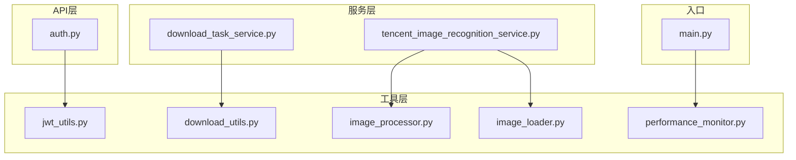
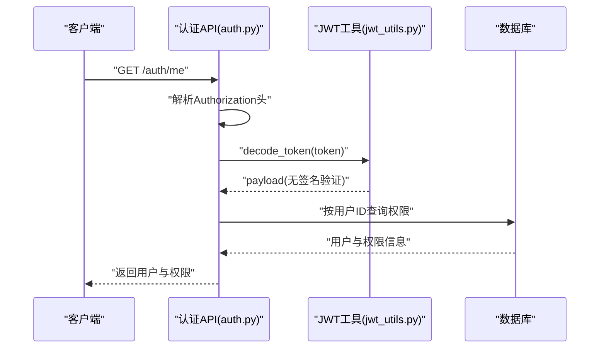
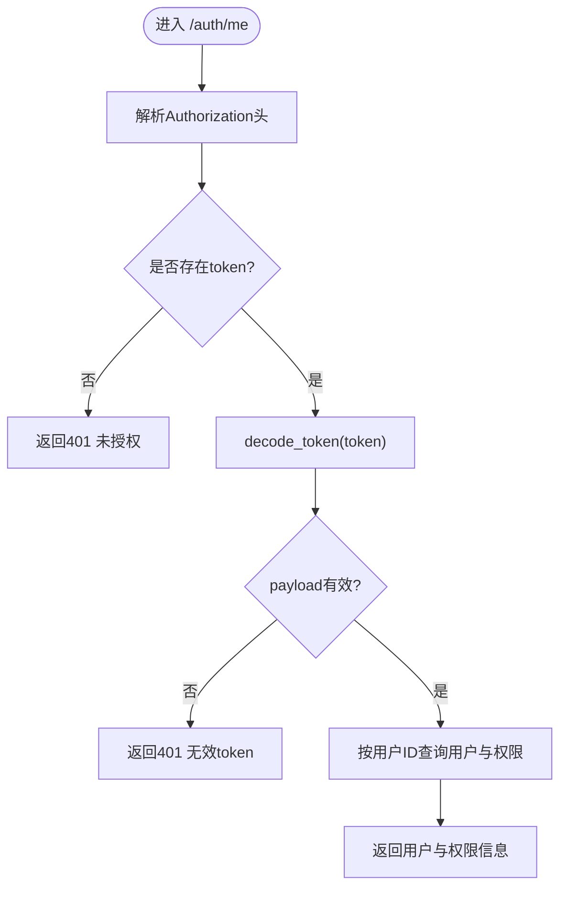
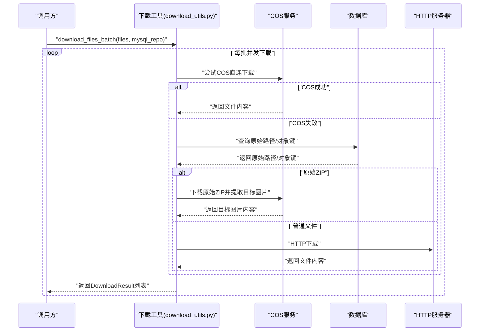
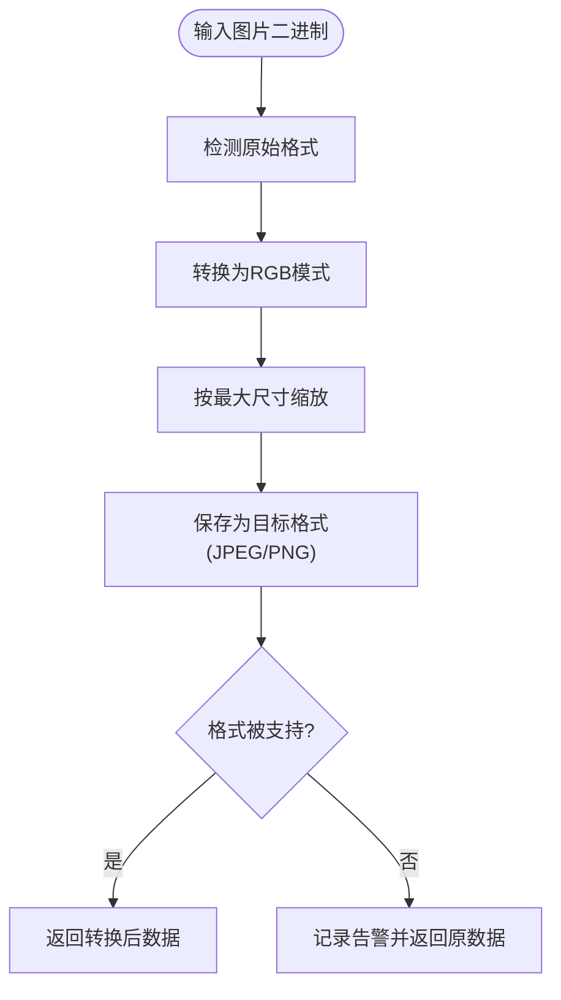
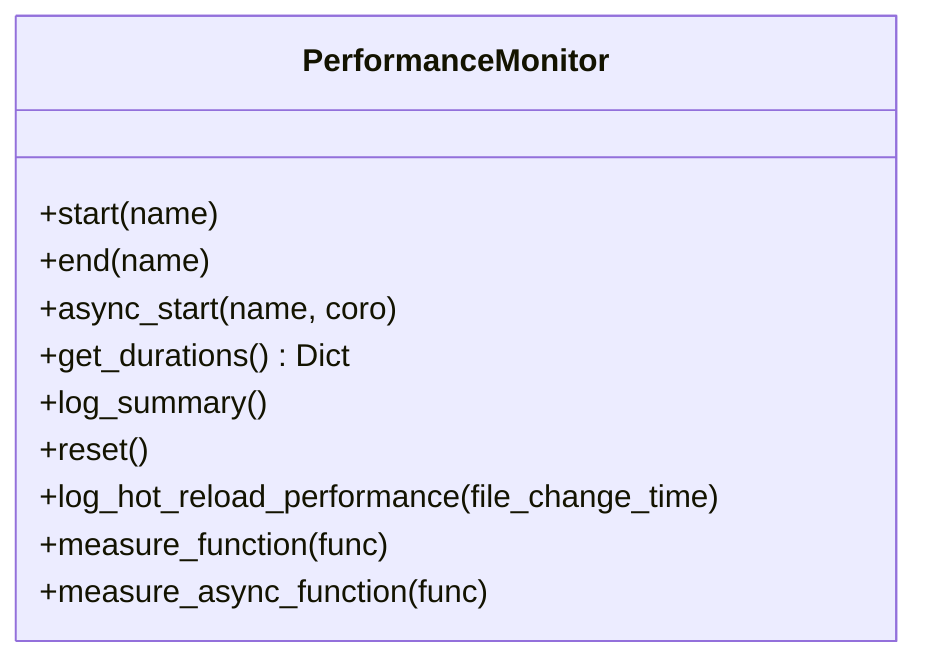
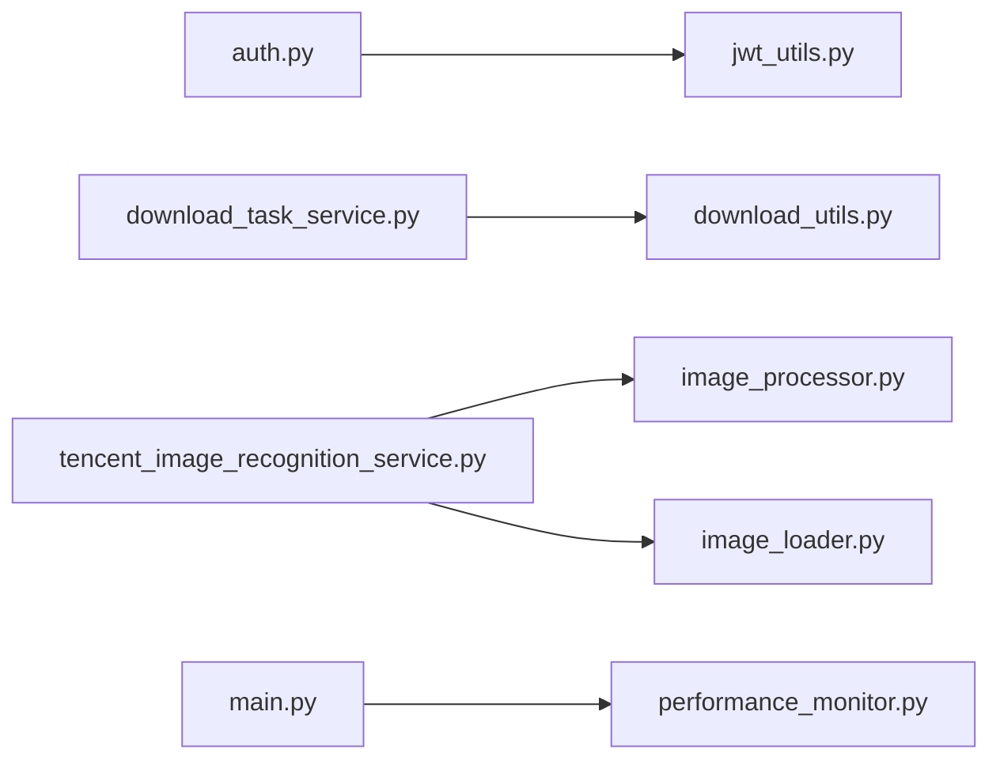

# 工具类与辅助函数

<cite>
**本文引用的文件**
- [jwt_utils.py](file://backend/app/utils/jwt_utils.py)
- [download_utils.py](file://backend/app/utils/download_utils.py)
- [image_processor.py](file://backend/app/utils/image_processor.py)
- [image_loader.py](file://backend/app/utils/image_loader.py)
- [performance_monitor.py](file://backend/app/utils/performance_monitor.py)
- [auth.py](file://backend/app/api/v1/auth.py)
- [download_task_service.py](file://backend/app/services/download_task_service.py)
- [tencent_image_recognition_service.py](file://backend/app/services/tencent_image_recognition_service.py)
- [main.py](file://backend/app/main.py)
</cite>

## 目录
1. [简介](#简介)
2. [项目结构](#项目结构)
3. [核心组件](#核心组件)
4. [架构总览](#架构总览)
5. [详细组件分析](#详细组件分析)
6. [依赖关系分析](#依赖关系分析)
7. [性能考量](#性能考量)
8. [故障排查指南](#故障排查指南)
9. [结论](#结论)
10. [附录](#附录)

## 简介
本指南聚焦于后端工具类与辅助函数，涵盖以下主题：
- JWT工具：简化版解码与解析，配合网关完成签发与验证。
- 下载工具：批量下载、COS直连、ZIP内图片提取、格式转换与打包。
- 图像处理工具：格式转换、尺寸调整、格式支持性校验。
- 性能监控工具：阶段计时、异步任务监控、摘要统计与热重载耗时记录。
- 文件上传下载工具：断点续传、进度跟踪与错误恢复（基于现有实现的扩展建议）。

本指南提供使用场景、调用方式、最佳实践与扩展建议，帮助开发者快速集成与安全使用。

## 项目结构
工具函数集中于 backend/app/utils 目录，并在多个服务与API中被复用：
- JWT工具：在认证相关API与中间件中使用。
- 下载工具：在下载任务服务与Celery任务中被调用。
- 图像处理工具：在图像识别与视觉服务中被调用。
- 性能监控工具：在应用生命周期与关键流程中使用。

**图示来源**
- [jwt_utils.py:1-30](file://backend/app/utils/jwt_utils.py#L1-L30)
- [download_utils.py:1-499](file://backend/app/utils/download_utils.py#L1-L499)
- [image_processor.py:1-95](file://backend/app/utils/image_processor.py#L1-L95)
- [image_loader.py:1-71](file://backend/app/utils/image_loader.py#L1-L71)
- [performance_monitor.py:1-158](file://backend/app/utils/performance_monitor.py#L1-L158)
- [auth.py:1-192](file://backend/app/api/v1/auth.py#L1-L192)
- [download_task_service.py:1-200](file://backend/app/services/download_task_service.py#L1-L200)
- [tencent_image_recognition_service.py:1-200](file://backend/app/services/tencent_image_recognition_service.py#L1-L200)
- [main.py:1-200](file://backend/app/main.py#L1-L200)

**章节来源**
- [jwt_utils.py:1-30](file://backend/app/utils/jwt_utils.py#L1-L30)
- [download_utils.py:1-499](file://backend/app/utils/download_utils.py#L1-L499)
- [image_processor.py:1-95](file://backend/app/utils/image_processor.py#L1-L95)
- [image_loader.py:1-71](file://backend/app/utils/image_loader.py#L1-L71)
- [performance_monitor.py:1-158](file://backend/app/utils/performance_monitor.py#L1-L158)
- [auth.py:1-192](file://backend/app/api/v1/auth.py#L1-L192)
- [download_task_service.py:1-200](file://backend/app/services/download_task_service.py#L1-L200)
- [tencent_image_recognition_service.py:1-200](file://backend/app/services/tencent_image_recognition_service.py#L1-L200)
- [main.py:1-200](file://backend/app/main.py#L1-L200)

## 核心组件
- JWT工具（简化版）
  - 作用：在Python后端仅执行token解码（不验证签名），用于“/me”和“/logout”等端点。
  - 关键点：从环境变量读取密钥与算法；解码时关闭签名与过期验证选项。
- 下载工具
  - 作用：统一的下载与打包逻辑，支持COS直连、数据库回退、ZIP内图片提取、批量并发与重试。
  - 关键点：URL清洗、并发批处理、超时控制、错误聚合与日志记录。
- 图像处理工具
  - 作用：将图片转换为腾讯云支持的格式（JPEG/PNG/BMP/GIF），调整尺寸并压缩。
  - 关键点：格式检测、尺寸缩放、质量控制与异常降级。
- 图像加载工具
  - 作用：异步加载图片数据，支持HTTP/HTTPS、相对路径与本地文件。
  - 关键点：超时控制、错误日志与多来源适配。
- 性能监控工具
  - 作用：阶段计时、异步任务监控、摘要统计与热重载耗时记录。
  - 关键点：装饰器与手动计时两种模式，支持重置与汇总输出。

**章节来源**
- [jwt_utils.py:19-30](file://backend/app/utils/jwt_utils.py#L19-L30)
- [download_utils.py:91-391](file://backend/app/utils/download_utils.py#L91-L391)
- [download_utils.py:393-453](file://backend/app/utils/download_utils.py#L393-L453)
- [download_utils.py:456-499](file://backend/app/utils/download_utils.py#L456-L499)
- [image_processor.py:15-63](file://backend/app/utils/image_processor.py#L15-L63)
- [image_processor.py:65-81](file://backend/app/utils/image_processor.py#L65-L81)
- [image_processor.py:83-95](file://backend/app/utils/image_processor.py#L83-L95)
- [image_loader.py:18-71](file://backend/app/utils/image_loader.py#L18-L71)
- [performance_monitor.py:9-158](file://backend/app/utils/performance_monitor.py#L9-L158)

## 架构总览
工具函数在不同层次之间协作，形成清晰的职责边界：
- API层负责请求接入与参数传递，调用JWT解码。
- 服务层负责业务编排，调用下载与图像处理工具。
- 工具层提供通用能力，保证可复用与可测试。

**图示来源**
- [auth.py:112-184](file://backend/app/api/v1/auth.py#L112-L184)
- [jwt_utils.py:19-30](file://backend/app/utils/jwt_utils.py#L19-L30)

**章节来源**
- [auth.py:112-184](file://backend/app/api/v1/auth.py#L112-L184)
- [jwt_utils.py:19-30](file://backend/app/utils/jwt_utils.py#L19-L30)

## 详细组件分析

### JWT工具（简化版）
- 设计原则
  - 与网关配合：由网关负责签发与严格验证，Python后端仅做轻量解码。
  - 环境驱动：密钥与算法通过环境变量注入，便于多环境切换。
  - 安全注意：解码时关闭签名与过期验证，仅用于解析payload，不应在Python侧进行鉴权。
- 使用场景
  - “/me”端点：从token中提取用户标识，再从数据库查询完整信息。
  - “/logout”端点：接收前端清除的token，Python侧不再维护黑名单。
- 令牌生成与刷新
  - 生成：由网关负责签发，Python后端不参与。
  - 刷新：当前Python侧未实现刷新逻辑，刷新流程迁移至Java后端。
- 最佳实践
  - 在API层严格校验Authorization头格式。
  - 对无效token返回明确的401错误。
  - 避免在Python侧对token进行二次验证。

**图示来源**
- [auth.py:125-184](file://backend/app/api/v1/auth.py#L125-L184)
- [jwt_utils.py:19-30](file://backend/app/utils/jwt_utils.py#L19-L30)

**章节来源**
- [auth.py:112-184](file://backend/app/api/v1/auth.py#L112-L184)
- [jwt_utils.py:19-30](file://backend/app/utils/jwt_utils.py#L19-L30)

### 下载工具（批量下载、COS直连、ZIP提取与打包）
- 设计原则
  - 统一入口：将复杂下载逻辑抽取为可复用模块，供API与Celery任务共享。
  - 容错与回退：优先COS直连，失败时回退到数据库查询原始路径，最后走HTTP下载。
  - 并发与限流：支持批量下载与最大并发控制，避免资源争用。
  - 日志与可观测：记录每个批次的成功/失败统计与详细消息。
- 关键流程
  - URL清洗与文件名规范化。
  - COS直连下载与错误降级。
  - 数据库查询原始路径与ZIP包提取。
  - HTTP下载与指数退避重试。
  - ZIP打包与格式转换（PNG）。
- 使用示例（路径）
  - 批量下载：[download_files_batch:393-453](file://backend/app/utils/download_utils.py#L393-L453)
  - 单文件下载：[download_single_file_optimized:91-391](file://backend/app/utils/download_utils.py#L91-L391)
  - ZIP打包：[build_zip_from_images:456-499](file://backend/app/utils/download_utils.py#L456-L499)
  - URL清洗：[clean_url:74-89](file://backend/app/utils/download_utils.py#L74-L89)
- 与服务集成
  - 下载任务服务使用上述工具进行任务编排与持久化：
    - [DownloadTaskService:48-200](file://backend/app/services/download_task_service.py#L48-L200)

**图示来源**
- [download_utils.py:91-391](file://backend/app/utils/download_utils.py#L91-L391)
- [download_utils.py:393-453](file://backend/app/utils/download_utils.py#L393-L453)
- [download_task_service.py:48-200](file://backend/app/services/download_task_service.py#L48-L200)

**章节来源**
- [download_utils.py:74-89](file://backend/app/utils/download_utils.py#L74-L89)
- [download_utils.py:91-391](file://backend/app/utils/download_utils.py#L91-L391)
- [download_utils.py:393-453](file://backend/app/utils/download_utils.py#L393-L453)
- [download_utils.py:456-499](file://backend/app/utils/download_utils.py#L456-L499)
- [download_task_service.py:48-200](file://backend/app/services/download_task_service.py#L48-L200)

### 图像处理工具（格式转换、尺寸调整与支持性校验）
- 设计原则
  - 与第三方服务兼容：针对腾讯云图像识别支持的格式进行转换。
  - 降级容错：当Pillow不可用时，直接写入原内容。
  - 质量与体积平衡：提供质量参数与优化开关。
- 关键流程
  - 格式检测：根据二进制数据推断原始格式。
  - 转换与压缩：转为RGB模式，按最大尺寸缩放，保存为目标格式。
  - 支持性校验：判断格式是否被腾讯云支持。
- 使用示例（路径）
  - 转换为支持格式：[convert_to_supported_format:15-63](file://backend/app/utils/image_processor.py#L15-L63)
  - 获取格式：[get_image_format:65-81](file://backend/app/utils/image_processor.py#L65-L81)
  - 校验支持性：[is_format_supported:83-95](file://backend/app/utils/image_processor.py#L83-L95)
- 与服务集成
  - 腾讯云图像识别服务在调用API前使用上述工具进行预处理：
    - [TencentImageRecognitionService:1-200](file://backend/app/services/tencent_image_recognition_service.py#L1-L200)

**图示来源**
- [image_processor.py:15-63](file://backend/app/utils/image_processor.py#L15-L63)
- [image_processor.py:65-95](file://backend/app/utils/image_processor.py#L65-L95)
- [tencent_image_recognition_service.py:22-23](file://backend/app/services/tencent_image_recognition_service.py#L22-L23)

**章节来源**
- [image_processor.py:15-63](file://backend/app/utils/image_processor.py#L15-L63)
- [image_processor.py:65-95](file://backend/app/utils/image_processor.py#L65-L95)
- [tencent_image_recognition_service.py:22-23](file://backend/app/services/tencent_image_recognition_service.py#L22-L23)

### 图像加载工具（异步加载）
- 设计原则
  - 多来源适配：HTTP/HTTPS、相对路径（自动拼接）、本地文件路径。
  - 超时控制：统一的请求超时配置，避免阻塞。
  - 错误日志：对失败场景进行详细记录。
- 使用示例（路径）
  - 加载图片数据：[load_image_data:18-71](file://backend/app/utils/image_loader.py#L18-L71)

**章节来源**
- [image_loader.py:18-71](file://backend/app/utils/image_loader.py#L18-L71)

### 性能监控工具（阶段计时与摘要）
- 设计原则
  - 易用性：提供装饰器与手动计时两种模式，覆盖同步与异步场景。
  - 可观测性：记录阶段耗时、失败信息与百分比占比，便于定位瓶颈。
  - 生命周期：支持重置与热重载耗时记录。
- 使用示例（路径）
  - 手动计时：[PerformanceMonitor.start/end:22-45](file://backend/app/utils/performance_monitor.py#L22-L45)
  - 异步计时：[PerformanceMonitor.async_start:46-71](file://backend/app/utils/performance_monitor.py#L46-L71)
  - 装饰器：[measure_function/measure_async_function:122-158](file://backend/app/utils/performance_monitor.py#L122-L158)
  - 摘要输出：[log_summary:81-98](file://backend/app/utils/performance_monitor.py#L81-L98)
- 与应用集成
  - 在应用生命周期中使用：
    - [main.py 启动阶段计时:57-200](file://backend/app/main.py#L57-L200)

**图示来源**
- [performance_monitor.py:9-158](file://backend/app/utils/performance_monitor.py#L9-L158)
- [main.py:57-200](file://backend/app/main.py#L57-L200)

**章节来源**
- [performance_monitor.py:9-158](file://backend/app/utils/performance_monitor.py#L9-L158)
- [main.py:57-200](file://backend/app/main.py#L57-L200)

## 依赖关系分析
- 组件耦合
  - 下载工具与服务层强耦合：服务层负责任务编排与持久化，工具层提供下载与打包能力。
  - 图像处理工具与识别服务弱耦合：识别服务仅在调用API前进行预处理。
  - JWT工具与API层弱耦合：API层负责请求接入与参数传递。
- 外部依赖
  - 下载工具依赖aiohttp、Pillow、COS SDK与数据库查询。
  - 图像处理工具依赖Pillow。
  - 性能监控工具为纯Python实现，无外部依赖。
- 潜在循环依赖
  - 未发现直接循环依赖；工具层为纯函数与类，被上层服务调用。

**图示来源**
- [auth.py:1-192](file://backend/app/api/v1/auth.py#L1-L192)
- [jwt_utils.py:1-30](file://backend/app/utils/jwt_utils.py#L1-L30)
- [download_task_service.py:1-200](file://backend/app/services/download_task_service.py#L1-L200)
- [download_utils.py:1-499](file://backend/app/utils/download_utils.py#L1-L499)
- [tencent_image_recognition_service.py:1-200](file://backend/app/services/tencent_image_recognition_service.py#L1-L200)
- [image_processor.py:1-95](file://backend/app/utils/image_processor.py#L1-L95)
- [image_loader.py:1-71](file://backend/app/utils/image_loader.py#L1-L71)
- [main.py:1-200](file://backend/app/main.py#L1-L200)
- [performance_monitor.py:1-158](file://backend/app/utils/performance_monitor.py#L1-L158)

**章节来源**
- [auth.py:1-192](file://backend/app/api/v1/auth.py#L1-L192)
- [jwt_utils.py:1-30](file://backend/app/utils/jwt_utils.py#L1-L30)
- [download_task_service.py:1-200](file://backend/app/services/download_task_service.py#L1-L200)
- [download_utils.py:1-499](file://backend/app/utils/download_utils.py#L1-L499)
- [tencent_image_recognition_service.py:1-200](file://backend/app/services/tencent_image_recognition_service.py#L1-L200)
- [image_processor.py:1-95](file://backend/app/utils/image_processor.py#L1-L95)
- [image_loader.py:1-71](file://backend/app/utils/image_loader.py#L1-L71)
- [main.py:1-200](file://backend/app/main.py#L1-L200)
- [performance_monitor.py:1-158](file://backend/app/utils/performance_monitor.py#L1-L158)

## 性能考量
- 并发与限流
  - 批量下载采用分批并发，最大并发数可调，避免资源争用与超时。
  - 建议根据网络带宽与目标服务器限制动态调整。
- 超时与重试
  - 单文件下载超时25秒，HTTP下载具备指数退避重试，提升稳定性。
- 图像处理
  - 转换与压缩可能带来CPU与内存压力，建议在异步任务中执行。
- 监控与告警
  - 使用性能监控工具记录关键阶段耗时，结合日志分析瓶颈。
  - 对长耗时请求（如超过1秒）进行告警提示。

[本节为通用指导，不直接分析具体文件]

## 故障排查指南
- JWT相关
  - 现象：/auth/me返回无效token。
  - 排查：确认Authorization头格式与token有效性；检查环境变量中的密钥与算法。
  - 参考：[auth.py:125-184](file://backend/app/api/v1/auth.py#L125-L184)、[jwt_utils.py:19-30](file://backend/app/utils/jwt_utils.py#L19-L30)
- 下载相关
  - 现象：批量下载部分失败或超时。
  - 排查：查看批次日志中的失败原因；检查COS可用性与数据库查询结果；确认URL清洗与文件名规范化。
  - 参考：[download_utils.py:393-453](file://backend/app/utils/download_utils.py#L393-L453)、[download_task_service.py:48-200](file://backend/app/services/download_task_service.py#L48-L200)
- 图像处理相关
  - 现象：识别服务报格式不支持或转换失败。
  - 排查：确认格式检测与支持性校验；检查Pillow可用性与异常降级逻辑。
  - 参考：[image_processor.py:15-95](file://backend/app/utils/image_processor.py#L15-L95)、[tencent_image_recognition_service.py:1-200](file://backend/app/services/tencent_image_recognition_service.py#L1-L200)
- 性能监控相关
  - 现象：性能监控无数据或摘要为空。
  - 排查：确认是否正确调用start/end或装饰器；检查日志级别与输出。
  - 参考：[performance_monitor.py:81-98](file://backend/app/utils/performance_monitor.py#L81-L98)、[main.py:57-200](file://backend/app/main.py#L57-L200)

**章节来源**
- [auth.py:125-184](file://backend/app/api/v1/auth.py#L125-L184)
- [jwt_utils.py:19-30](file://backend/app/utils/jwt_utils.py#L19-L30)
- [download_utils.py:393-453](file://backend/app/utils/download_utils.py#L393-L453)
- [download_task_service.py:48-200](file://backend/app/services/download_task_service.py#L48-L200)
- [image_processor.py:15-95](file://backend/app/utils/image_processor.py#L15-L95)
- [tencent_image_recognition_service.py:1-200](file://backend/app/services/tencent_image_recognition_service.py#L1-L200)
- [performance_monitor.py:81-98](file://backend/app/utils/performance_monitor.py#L81-L98)
- [main.py:57-200](file://backend/app/main.py#L57-L200)

## 结论
本指南梳理了项目中的工具类与辅助函数，明确了它们在认证、下载、图像处理与性能监控方面的职责与使用方式。通过统一的工具层设计，实现了跨模块的复用与可观测性增强。建议在后续迭代中继续完善文件上传下载的断点续传与进度跟踪能力，并持续利用性能监控工具进行优化。

[本节为总结性内容，不直接分析具体文件]

## 附录
- 扩展指南与最佳实践
  - JWT工具
    - 仅在Python侧进行轻量解码，不参与签发与严格验证。
    - 通过环境变量管理密钥与算法，确保多环境一致性。
  - 下载工具
    - 批量下载时合理设置最大并发，避免对目标服务器造成压力。
    - 对COS直连失败进行降级处理，优先回退到数据库查询与HTTP下载。
    - ZIP提取失败时记录详细错误，便于定位问题。
  - 图像处理工具
    - 在调用第三方识别服务前统一转换为支持格式。
    - 对Pillow不可用的情况进行降级，保证功能可用性。
  - 性能监控工具
    - 在关键流程中使用装饰器或手动计时，定期输出摘要。
    - 对长耗时请求进行告警，持续优化热点路径。
  - 文件上传下载（扩展建议）
    - 断点续传：基于文件大小与分片策略，结合服务端校验与去重。
    - 进度跟踪：在服务端维护任务状态与进度，前端轮询或WebSocket推送。
    - 错误恢复：对网络抖动与COS异常进行指数退避与重试，必要时回退到本地缓存。

[本节为通用指导，不直接分析具体文件]