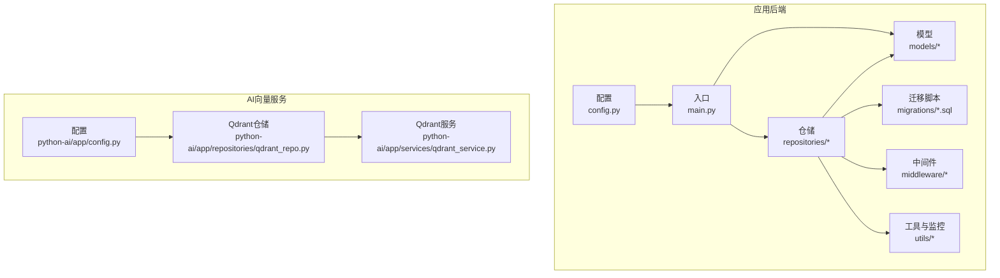
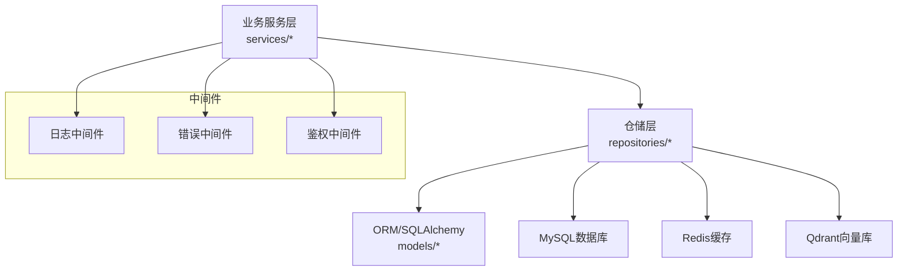
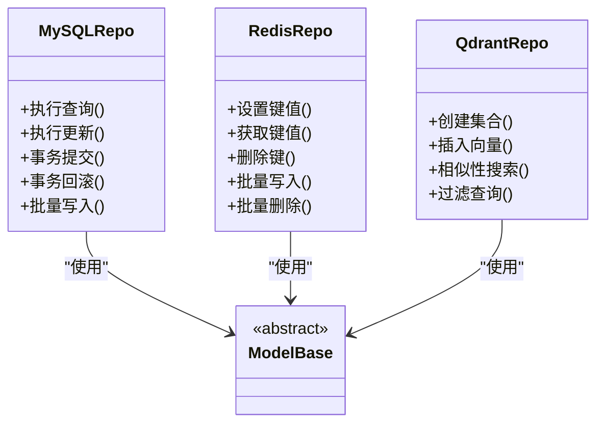
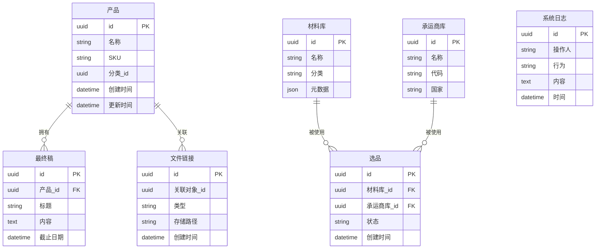
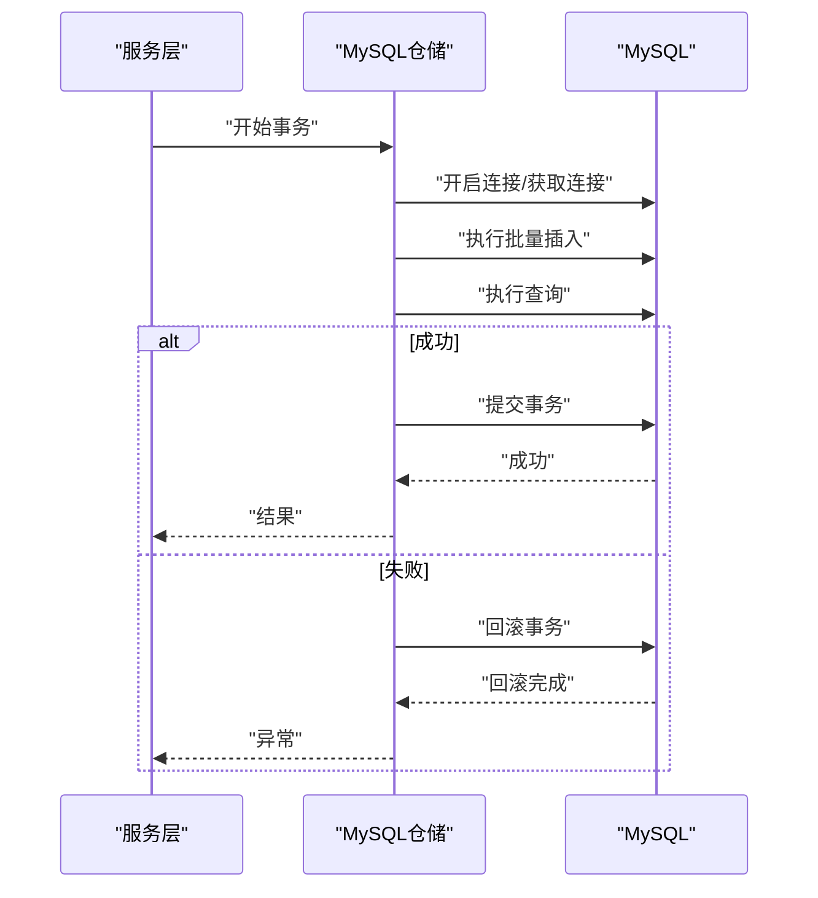
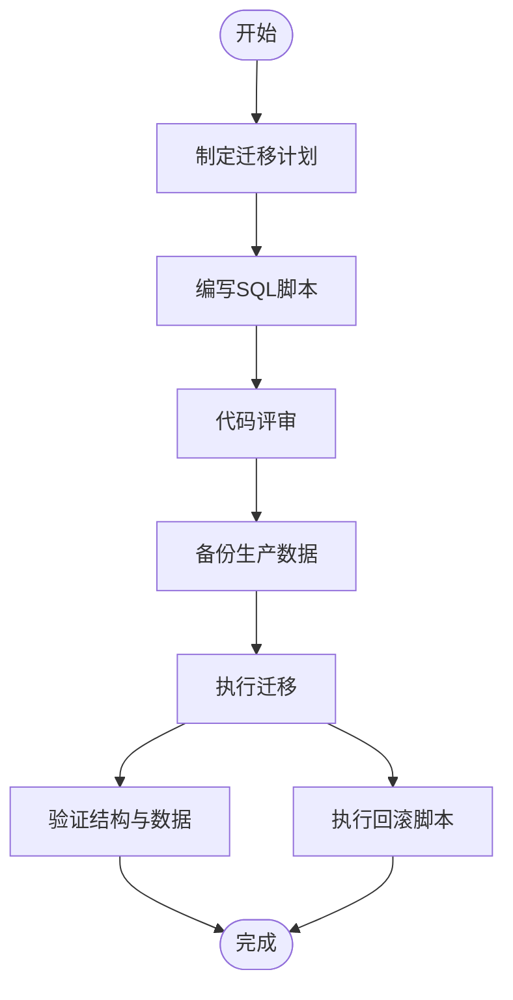
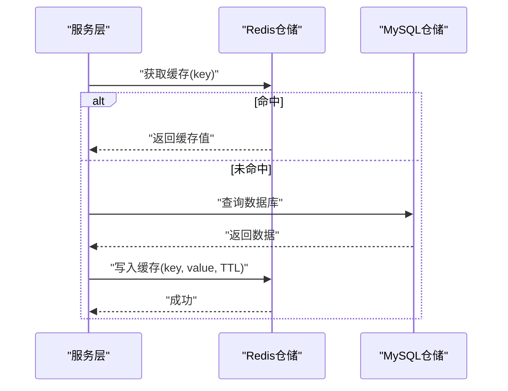
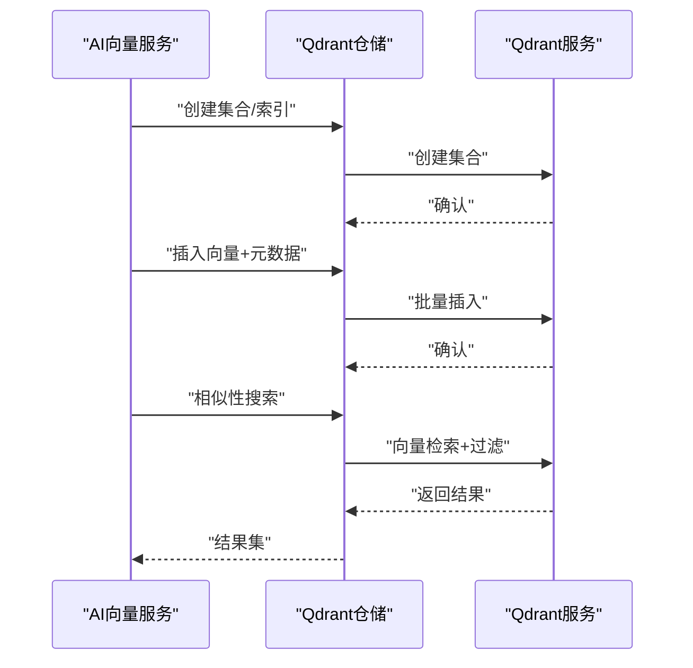
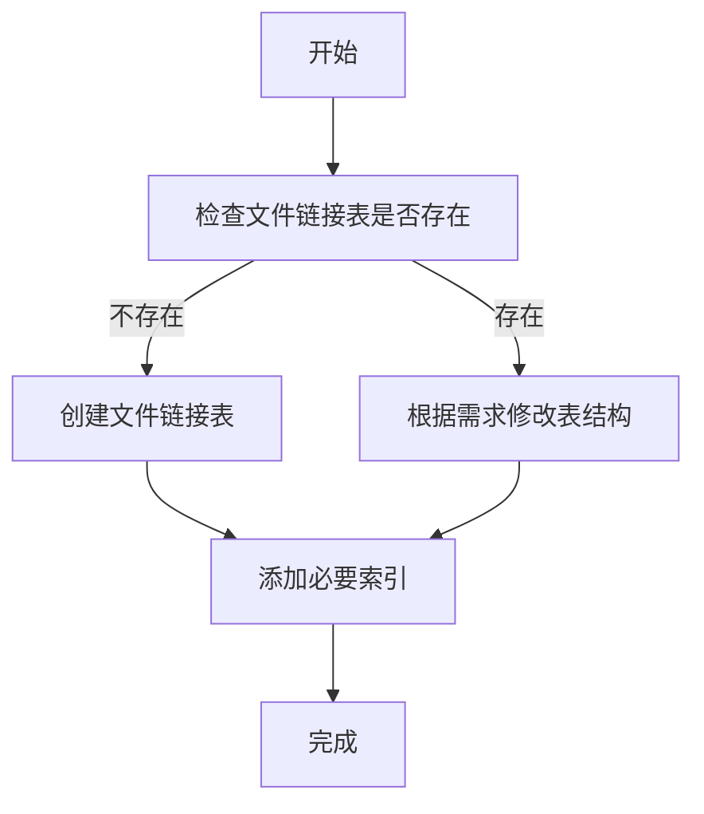
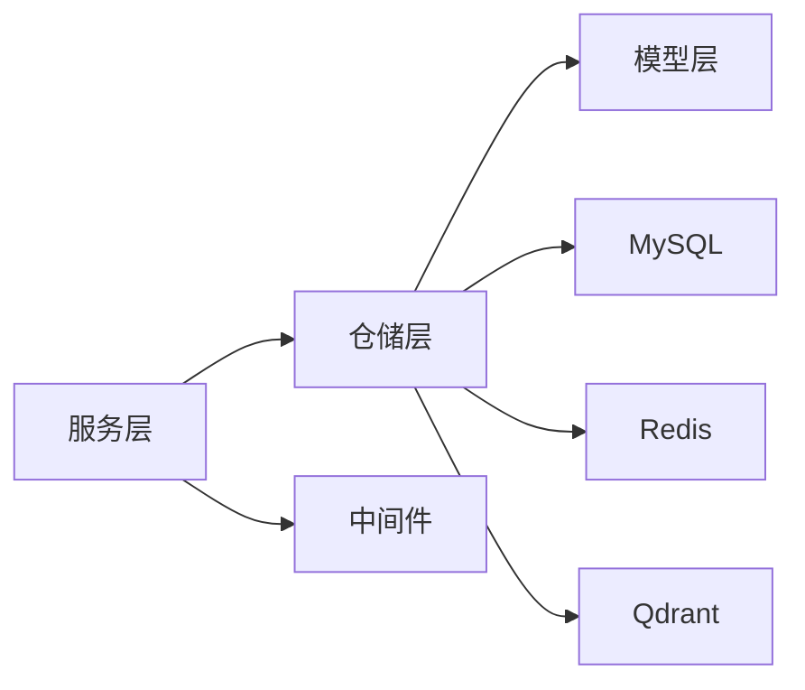

# 数据访问层

<cite>
**本文引用的文件**
- [backend/app/config.py](file://backend/app/config.py)
- [backend/app/main.py](file://backend/app/main.py)
- [backend/app/models/__init__.py](file://backend/app/models/__init__.py)
- [backend/app/models/product.py](file://backend/app/models/product.py)
- [backend/app/models/final_draft.py](file://backend/app/models/final_draft.py)
- [backend/app/models/file_link.py](file://backend/app/models/file_link.py)
- [backend/app/models/material_library.py](file://backend/app/models/material_library.py)
- [backend/app/models/carrier_library.py](file://backend/app/models/carrier_library.py)
- [backend/app/models/selection.py](file://backend/app/models/selection.py)
- [backend/app/models/system_log.py](file://backend/app/models/system_log.py)
- [backend/app/repositories/mysql_repo.py](file://backend/app/repositories/mysql_repo.py)
- [backend/app/repositories/redis_repo.py](file://backend/app/repositories/redis_repo.py)
- [backend/app/repositories/qdrant_repo.py](file://backend/app/repositories/qdrant_repo.py)
- [backend/app/repositories/file_link_repository.py](file://backend/app/repositories/file_link_repository.py)
- [backend/app/repositories/create_file_link_tables.py](file://backend/app/repositories/create_file_link_tables.py)
- [backend/app/repositories/migrate_products_table.py](file://backend/app/repositories/migrate_products_table.py)
- [backend/app/repositories/migrate_selection_tables.py](file://backend/app/repositories/migrate_selection_tables.py)
- [backend/app/repositories/create_selection_tables.py](file://backend/app/repositories/create_selection_tables.py)
- [backend/migrations/init_database.sql](file://backend/migrations/init_database.sql)
- [backend/migrations/create_final_drafts_table.sql](file://backend/migrations/create_final_drafts_table.sql)
- [backend/migrations/add_images_index.sql](file://backend/migrations/add_images_index.sql)
- [backend/migrations/add_role_indexes.sql](file://backend/migrations/add_role_indexes.sql)
- [backend/app/db/migrations/create_final_drafts_table.sql](file://backend/app/db/migrations/create_final_drafts_table.sql)
- [backend/app/services/ai_vector_processing/ai_vector_processor.py](file://backend/app/services/ai_vector_processing/ai_vector_processor.py)
- [backend/app/services/ai_vector_processing/check_model_cache.py](file://backend/app/services/ai_vector_processing/check_model_cache.py)
- [backend/app/services/ai_vector_processing/download_model.py](file://backend/app/services/ai_vector_processing/download_model.py)
- [backend/app/utils/performance_monitor.py](file://backend/app/utils/performance_monitor.py)
- [backend/app/middleware/logging.py](file://backend/app/middleware/logging.py)
- [backend/app/middleware/error_handler.py](file://backend/app/middleware/error_handler.py)
- [backend/app/middleware/auth_middleware.py](file://backend/app/middleware/auth_middleware.py)
- [python-ai/app/config.py](file://python-ai/app/config.py)
- [python-ai/app/repositories/qdrant_repo.py](file://python-ai/app/repositories/qdrant_repo.py)
- [python-ai/app/services/qdrant_service.py](file://python-ai/app/services/qdrant_service.py)
- [python-ai/app/services/vector_service.py](file://python-ai/app/services/vector_service.py)
</cite>

## 目录
1. [简介](#简介)
2. [项目结构](#项目结构)
3. [核心组件](#核心组件)
4. [架构总览](#架构总览)
5. [详细组件分析](#详细组件分析)
6. [依赖分析](#依赖分析)
7. [性能考虑](#性能考虑)
8. [故障排查指南](#故障排查指南)
9. [结论](#结论)
10. [附录](#附录)

## 简介
本文件面向数据访问层（Data Access Layer），围绕仓储（Repository）模式、ORM配置、数据库连接池与事务、模型与实体关系、数据迁移与版本控制、缓存策略（含Redis）、向量数据库（Qdrant）集成、性能优化、以及数据安全与审计等主题进行系统化技术说明。文档以仓库中现有实现为依据，提供可操作的设计原则与最佳实践。

## 项目结构
数据访问层主要分布在以下位置：
- 应用后端：backend/app
  - 配置与入口：config.py、main.py
  - 模型定义：models/
  - 仓储实现：repositories/
  - 迁移脚本：migrations/ 与 app/db/migrations/
  - 中间件：middleware/（日志、错误、鉴权）
  - 工具与监控：utils/
- AI向量服务：python-ai
  - Qdrant相关仓储与服务：repositories/、services/

图示来源
- [backend/app/config.py](file://backend/app/config.py)
- [backend/app/main.py](file://backend/app/main.py)
- [backend/app/models/__init__.py](file://backend/app/models/__init__.py)
- [backend/app/repositories/mysql_repo.py](file://backend/app/repositories/mysql_repo.py)
- [backend/migrations/init_database.sql](file://backend/migrations/init_database.sql)
- [python-ai/app/config.py](file://python-ai/app/config.py)
- [python-ai/app/repositories/qdrant_repo.py](file://python-ai/app/repositories/qdrant_repo.py)
- [python-ai/app/services/qdrant_service.py](file://python-ai/app/services/qdrant_service.py)

章节来源
- [backend/app/config.py](file://backend/app/config.py)
- [backend/app/main.py](file://backend/app/main.py)
- [backend/app/models/__init__.py](file://backend/app/models/__init__.py)
- [backend/app/repositories/mysql_repo.py](file://backend/app/repositories/mysql_repo.py)
- [backend/migrations/init_database.sql](file://backend/migrations/init_database.sql)

## 核心组件
- 仓储接口与实现
  - MySQL仓储：提供通用CRUD与事务封装，支持连接池与批量操作。
  - Redis仓储：提供键值缓存、过期策略与批量写入。
  - Qdrant仓储：提供向量索引、相似性搜索与元数据过滤。
- ORM与模型
  - 使用SQLAlchemy ORM映射模型，定义字段、约束与索引。
- 迁移与版本控制
  - 基于SQL脚本的迁移管理，支持初始化、增量更新与回滚。
- 缓存策略
  - Redis缓存配置、失效策略与一致性保障。
- 向量数据库集成
  - Qdrant配置、向量索引与相似性搜索。
- 性能与安全
  - 连接池、批量操作、查询优化、中间件日志与鉴权。

章节来源
- [backend/app/repositories/mysql_repo.py](file://backend/app/repositories/mysql_repo.py)
- [backend/app/repositories/redis_repo.py](file://backend/app/repositories/redis_repo.py)
- [backend/app/repositories/qdrant_repo.py](file://backend/app/repositories/qdrant_repo.py)
- [backend/app/models/product.py](file://backend/app/models/product.py)
- [backend/app/models/final_draft.py](file://backend/app/models/final_draft.py)
- [backend/app/models/file_link.py](file://backend/app/models/file_link.py)
- [backend/app/models/material_library.py](file://backend/app/models/material_library.py)
- [backend/app/models/carrier_library.py](file://backend/app/models/carrier_library.py)
- [backend/app/models/selection.py](file://backend/app/models/selection.py)
- [backend/app/models/system_log.py](file://backend/app/models/system_log.py)

## 架构总览
数据访问层采用分层与职责分离的设计：
- 应用入口负责装配配置、注册中间件与路由。
- 仓储层封装数据库与外部服务（Redis/Qdrant）访问。
- 模型层定义数据结构与约束。
- 迁移层管理数据库演进。
- 中间件提供统一的日志、错误与鉴权处理。

图示来源
- [backend/app/main.py](file://backend/app/main.py)
- [backend/app/repositories/mysql_repo.py](file://backend/app/repositories/mysql_repo.py)
- [backend/app/repositories/redis_repo.py](file://backend/app/repositories/redis_repo.py)
- [backend/app/repositories/qdrant_repo.py](file://backend/app/repositories/qdrant_repo.py)
- [backend/app/middleware/logging.py](file://backend/app/middleware/logging.py)
- [backend/app/middleware/error_handler.py](file://backend/app/middleware/error_handler.py)
- [backend/app/middleware/auth_middleware.py](file://backend/app/middleware/auth_middleware.py)

## 详细组件分析

### 仓储层设计与实现
- MySQL仓储
  - 负责数据库连接、事务管理、批量插入/更新、查询优化。
  - 支持连接池参数配置与超时控制。
- Redis仓储
  - 提供键值缓存、过期策略、批量写入与删除。
  - 支持热键预热与缓存穿透防护。
- Qdrant仓储
  - 封装向量索引创建、点向量插入、元数据过滤与相似性搜索。
  - 支持分页与过滤条件组合。

图示来源
- [backend/app/repositories/mysql_repo.py](file://backend/app/repositories/mysql_repo.py)
- [backend/app/repositories/redis_repo.py](file://backend/app/repositories/redis_repo.py)
- [backend/app/repositories/qdrant_repo.py](file://backend/app/repositories/qdrant_repo.py)
- [backend/app/models/__init__.py](file://backend/app/models/__init__.py)

章节来源
- [backend/app/repositories/mysql_repo.py](file://backend/app/repositories/mysql_repo.py)
- [backend/app/repositories/redis_repo.py](file://backend/app/repositories/redis_repo.py)
- [backend/app/repositories/qdrant_repo.py](file://backend/app/repositories/qdrant_repo.py)

### ORM配置与模型定义
- 配置
  - 在配置文件中集中管理数据库连接字符串、连接池大小、超时等参数。
- 模型
  - 使用SQLAlchemy定义实体关系、字段类型、非空约束、唯一索引与复合索引。
  - 示例模型：
    - 产品模型：字段、索引与关联关系。
    - 最终稿模型：多表结构与外键约束。
    - 文件链接模型：文件元数据与索引策略。
    - 材料库与承运商库：分类与检索优化。
    - 选品与系统日志：审计与统计字段。

图示来源
- [backend/app/models/product.py](file://backend/app/models/product.py)
- [backend/app/models/final_draft.py](file://backend/app/models/final_draft.py)
- [backend/app/models/file_link.py](file://backend/app/models/file_link.py)
- [backend/app/models/material_library.py](file://backend/app/models/material_library.py)
- [backend/app/models/carrier_library.py](file://backend/app/models/carrier_library.py)
- [backend/app/models/selection.py](file://backend/app/models/selection.py)
- [backend/app/models/system_log.py](file://backend/app/models/system_log.py)

章节来源
- [backend/app/config.py](file://backend/app/config.py)
- [backend/app/models/product.py](file://backend/app/models/product.py)
- [backend/app/models/final_draft.py](file://backend/app/models/final_draft.py)
- [backend/app/models/file_link.py](file://backend/app/models/file_link.py)
- [backend/app/models/material_library.py](file://backend/app/models/material_library.py)
- [backend/app/models/carrier_library.py](file://backend/app/models/carrier_library.py)
- [backend/app/models/selection.py](file://backend/app/models/selection.py)
- [backend/app/models/system_log.py](file://backend/app/models/system_log.py)

### 数据库连接池与事务处理
- 连接池
  - 在配置中设置最大连接数、空闲连接数、连接超时与生命周期。
  - 仓储层在会话创建时应用连接池参数。
- 事务
  - 通过仓储层的事务方法确保原子性与一致性。
  - 支持手动提交与回滚，异常时自动回滚。
- 批量操作
  - 提供批量插入与批量更新接口，减少往返次数与锁竞争。

图示来源
- [backend/app/repositories/mysql_repo.py](file://backend/app/repositories/mysql_repo.py)
- [backend/app/config.py](file://backend/app/config.py)

章节来源
- [backend/app/repositories/mysql_repo.py](file://backend/app/repositories/mysql_repo.py)
- [backend/app/config.py](file://backend/app/config.py)

### 数据迁移管理、版本控制与回滚
- 迁移脚本
  - 使用SQL脚本管理数据库结构变更，覆盖初始化、索引添加、字段增删改等。
- 版本控制
  - 通过脚本命名与顺序维护版本演进；建议引入迁移版本表或注释标识。
- 回滚策略
  - 提供逆向SQL脚本（如删除索引、回退字段）；对关键变更采用“先备份再变更”的策略。

图示来源
- [backend/migrations/init_database.sql](file://backend/migrations/init_database.sql)
- [backend/migrations/create_final_drafts_table.sql](file://backend/migrations/create_final_drafts_table.sql)
- [backend/migrations/add_images_index.sql](file://backend/migrations/add_images_index.sql)
- [backend/migrations/add_role_indexes.sql](file://backend/migrations/add_role_indexes.sql)
- [backend/app/db/migrations/create_final_drafts_table.sql](file://backend/app/db/migrations/create_final_drafts_table.sql)

章节来源
- [backend/migrations/init_database.sql](file://backend/migrations/init_database.sql)
- [backend/migrations/create_final_drafts_table.sql](file://backend/migrations/create_final_drafts_table.sql)
- [backend/migrations/add_images_index.sql](file://backend/migrations/add_images_index.sql)
- [backend/migrations/add_role_indexes.sql](file://backend/migrations/add_role_indexes.sql)
- [backend/app/db/migrations/create_final_drafts_table.sql](file://backend/app/db/migrations/create_final_drafts_table.sql)

### 缓存策略（Redis）
- 配置
  - 在配置中设置Redis连接参数、超时、重试与序列化方式。
- 失效策略
  - 为热点数据设置TTL；对列表/集合使用过期回调清理。
- 一致性
  - 写操作先更新数据库，再更新缓存；读操作命中优先，未命中回源并写回。
- 批量操作
  - 提供批量写入与删除，降低网络开销。

图示来源
- [backend/app/repositories/redis_repo.py](file://backend/app/repositories/redis_repo.py)
- [backend/app/config.py](file://backend/app/config.py)

章节来源
- [backend/app/repositories/redis_repo.py](file://backend/app/repositories/redis_repo.py)
- [backend/app/config.py](file://backend/app/config.py)

### 向量数据库集成（Qdrant）
- 配置
  - 在配置中设置Qdrant客户端参数（地址、端口、API密钥等）。
- 索引与向量
  - 为向量维度与距离度量选择合适配置；建立过滤字段索引提升查询效率。
- 相似性搜索
  - 支持向量相似度检索与元数据过滤组合查询。
- 与AI处理协作
  - AI向量处理服务负责模型下载、缓存与向量生成，仓储负责持久化与检索。

图示来源
- [python-ai/app/config.py](file://python-ai/app/config.py)
- [python-ai/app/repositories/qdrant_repo.py](file://python-ai/app/repositories/qdrant_repo.py)
- [python-ai/app/services/qdrant_service.py](file://python-ai/app/services/qdrant_service.py)
- [backend/app/services/ai_vector_processing/ai_vector_processor.py](file://backend/app/services/ai_vector_processing/ai_vector_processor.py)
- [backend/app/services/ai_vector_processing/check_model_cache.py](file://backend/app/services/ai_vector_processing/check_model_cache.py)
- [backend/app/services/ai_vector_processing/download_model.py](file://backend/app/services/ai_vector_processing/download_model.py)

章节来源
- [python-ai/app/config.py](file://python-ai/app/config.py)
- [python-ai/app/repositories/qdrant_repo.py](file://python-ai/app/repositories/qdrant_repo.py)
- [python-ai/app/services/qdrant_service.py](file://python-ai/app/services/qdrant_service.py)
- [backend/app/services/ai_vector_processing/ai_vector_processor.py](file://backend/app/services/ai_vector_processing/ai_vector_processor.py)
- [backend/app/services/ai_vector_processing/check_model_cache.py](file://backend/app/services/ai_vector_processing/check_model_cache.py)
- [backend/app/services/ai_vector_processing/download_model.py](file://backend/app/services/ai_vector_processing/download_model.py)

### 文件链接与表结构迁移
- 文件链接仓储
  - 提供文件元数据的CRUD与批量操作。
- 表结构迁移
  - 通过迁移脚本创建/修改文件链接相关表结构，确保索引与约束完善。

图示来源
- [backend/app/repositories/file_link_repository.py](file://backend/app/repositories/file_link_repository.py)
- [backend/app/repositories/create_file_link_tables.py](file://backend/app/repositories/create_file_link_tables.py)
- [backend/app/repositories/migrate_products_table.py](file://backend/app/repositories/migrate_products_table.py)
- [backend/app/repositories/migrate_selection_tables.py](file://backend/app/repositories/migrate_selection_tables.py)
- [backend/app/repositories/create_selection_tables.py](file://backend/app/repositories/create_selection_tables.py)

章节来源
- [backend/app/repositories/file_link_repository.py](file://backend/app/repositories/file_link_repository.py)
- [backend/app/repositories/create_file_link_tables.py](file://backend/app/repositories/create_file_link_tables.py)
- [backend/app/repositories/migrate_products_table.py](file://backend/app/repositories/migrate_products_table.py)
- [backend/app/repositories/migrate_selection_tables.py](file://backend/app/repositories/migrate_selection_tables.py)
- [backend/app/repositories/create_selection_tables.py](file://backend/app/repositories/create_selection_tables.py)

## 依赖分析
- 组件耦合
  - 仓储层对模型层有直接依赖；对数据库与外部服务（Redis/Qdrant）有间接依赖。
- 外部依赖
  - SQLAlchemy（ORM）、Pydantic（数据校验）、Celery（任务队列）、FastAPI（API框架）。
- 中间件
  - 日志、错误处理与鉴权中间件贯穿请求链路，保障可观测性与安全性。

图示来源
- [backend/app/main.py](file://backend/app/main.py)
- [backend/app/repositories/mysql_repo.py](file://backend/app/repositories/mysql_repo.py)
- [backend/app/repositories/redis_repo.py](file://backend/app/repositories/redis_repo.py)
- [backend/app/repositories/qdrant_repo.py](file://backend/app/repositories/qdrant_repo.py)
- [backend/app/middleware/logging.py](file://backend/app/middleware/logging.py)
- [backend/app/middleware/error_handler.py](file://backend/app/middleware/error_handler.py)
- [backend/app/middleware/auth_middleware.py](file://backend/app/middleware/auth_middleware.py)

章节来源
- [backend/app/main.py](file://backend/app/main.py)
- [backend/app/repositories/mysql_repo.py](file://backend/app/repositories/mysql_repo.py)
- [backend/app/repositories/redis_repo.py](file://backend/app/repositories/redis_repo.py)
- [backend/app/repositories/qdrant_repo.py](file://backend/app/repositories/qdrant_repo.py)
- [backend/app/middleware/logging.py](file://backend/app/middleware/logging.py)
- [backend/app/middleware/error_handler.py](file://backend/app/middleware/error_handler.py)
- [backend/app/middleware/auth_middleware.py](file://backend/app/middleware/auth_middleware.py)

## 性能考虑
- 查询优化
  - 为高频查询字段建立索引；避免SELECT *，按需投影。
  - 使用分页与LIMIT，避免一次性加载大量数据。
- 连接复用
  - 启用连接池，合理设置最大连接数与空闲连接数。
- 批量操作
  - 使用批量插入/更新减少往返；注意单批大小与超时。
- 缓存策略
  - 对热点数据设置短TTL；对冷数据使用LRU淘汰。
- 监控与告警
  - 通过性能监控中间件记录慢查询与异常；结合日志定位瓶颈。

章节来源
- [backend/app/utils/performance_monitor.py](file://backend/app/utils/performance_monitor.py)
- [backend/app/config.py](file://backend/app/config.py)
- [backend/migrations/add_images_index.sql](file://backend/migrations/add_images_index.sql)
- [backend/migrations/add_role_indexes.sql](file://backend/migrations/add_role_indexes.sql)

## 故障排查指南
- 数据库连接问题
  - 检查连接字符串、网络连通性与防火墙；核对连接池参数。
- 事务异常
  - 确认异常捕获与回滚逻辑；避免长事务导致锁等待。
- 缓存一致性
  - 核对缓存写入时机与失效策略；排查并发写入冲突。
- 向量检索异常
  - 检查集合是否存在、向量维度是否匹配、过滤条件是否正确。
- 日志与审计
  - 通过日志中间件与系统日志模型记录操作轨迹，便于追溯。

章节来源
- [backend/app/middleware/logging.py](file://backend/app/middleware/logging.py)
- [backend/app/middleware/error_handler.py](file://backend/app/middleware/error_handler.py)
- [backend/app/middleware/auth_middleware.py](file://backend/app/middleware/auth_middleware.py)
- [backend/app/models/system_log.py](file://backend/app/models/system_log.py)

## 结论
本数据访问层以仓储模式为核心，结合ORM、连接池与事务管理，实现了对MySQL、Redis与Qdrant的统一抽象。配合完善的迁移脚本、缓存策略与性能监控，能够支撑高并发与复杂查询场景。建议持续完善版本控制与回滚策略，并加强安全与审计能力。

## 附录
- 关键实现参考路径
  - [MySQL仓储实现](file://backend/app/repositories/mysql_repo.py)
  - [Redis仓储实现](file://backend/app/repositories/redis_repo.py)
  - [Qdrant仓储实现](file://backend/app/repositories/qdrant_repo.py)
  - [产品模型定义](file://backend/app/models/product.py)
  - [最终稿模型定义](file://backend/app/models/final_draft.py)
  - [文件链接模型定义](file://backend/app/models/file_link.py)
  - [材料库模型定义](file://backend/app/models/material_library.py)
  - [承运商库模型定义](file://backend/app/models/carrier_library.py)
  - [选品模型定义](file://backend/app/models/selection.py)
  - [系统日志模型定义](file://backend/app/models/system_log.py)
  - [初始化数据库脚本](file://backend/migrations/init_database.sql)
  - [创建最终稿表脚本](file://backend/migrations/create_final_drafts_table.sql)
  - [添加图片索引脚本](file://backend/migrations/add_images_index.sql)
  - [添加角色索引脚本](file://backend/migrations/add_role_indexes.sql)
  - [AI向量处理服务](file://backend/app/services/ai_vector_processing/ai_vector_processor.py)
  - [Qdrant配置](file://python-ai/app/config.py)
  - [Qdrant仓储](file://python-ai/app/repositories/qdrant_repo.py)
  - [Qdrant服务](file://python-ai/app/services/qdrant_service.py)