# AI服务环境配置

<cite>
**本文档引用的文件**
- [backend/app/config.py](file://backend/app/config.py)
- [backend/requirements.txt](file://backend/requirements.txt)
- [python-ai/requirements.txt](file://python-ai/requirements.txt)
- [backend/app/services/ai_vector_processing/download_model.py](file://backend/app/services/ai_vector_processing/download_model.py)
- [backend/app/services/ai_vector_processing/check_model_cache.py](file://backend/app/services/ai_vector_processing/check_model_cache.py)
- [backend/app/services/ai_vector_processing/ai_vector_processor.py](file://backend/app/services/ai_vector_processing/ai_vector_processor.py)
- [backend/app/repositories/qdrant_repo.py](file://backend/app/repositories/qdrant_repo.py)
- [python-ai/app/repositories/qdrant_repo.py](file://python-ai/app/repositories/qdrant_repo.py)
- [backend/app/services/baidu_image_recognition_service.py](file://backend/app/services/baidu_image_recognition_service.py)
- [backend/app/services/tencent_image_recognition_service.py](file://backend/app/services/tencent_image_recognition_service.py)
- [backend/app/services/tencent_llm_vision_service.py](file://backend/app/services/tencent_llm_vision_service.py)
- [backend/app/utils/performance_monitor.py](file://backend/app/utils/performance_monitor.py)
- [backend/app/middleware/logging.py](file://backend/app/middleware/logging.py)
- [docker-compose.yml](file://docker-compose.yml)
</cite>

## 目录
1. [简介](#简介)
2. [项目结构](#项目结构)
3. [核心组件](#核心组件)
4. [架构概览](#架构概览)
5. [详细组件分析](#详细组件分析)
6. [依赖关系分析](#依赖关系分析)
7. [性能考虑](#性能考虑)
8. [故障排除指南](#故障排除指南)
9. [结论](#结论)

## 简介

本指南详细说明了AI服务开发环境的配置方法，包括Python AI服务的环境搭建、向量数据库Qdrant的本地安装和配置、AI模型的下载和缓存机制、图像识别服务的依赖安装、腾讯AI和百度AI服务的API密钥配置和SDK集成，以及AI向量处理的本地开发环境设置。

## 项目结构

该项目采用多服务架构，包含后端Python服务、前端Vue应用、Java后端服务以及独立的Python AI服务。AI相关的核心组件分布在以下位置：

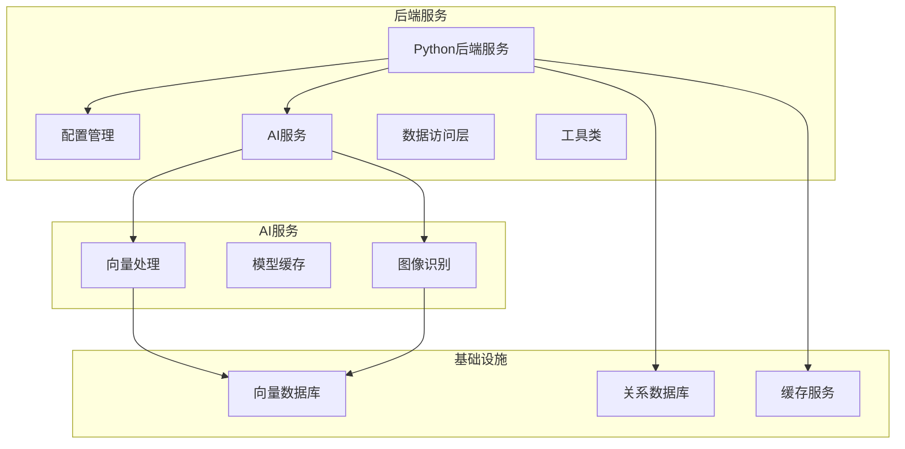

**图表来源**
- [backend/app/config.py:23-296](file://backend/app/config.py#L23-L296)
- [docker-compose.yml:7-36](file://docker-compose.yml#L7-L36)

**章节来源**
- [backend/app/config.py:1-296](file://backend/app/config.py#L1-L296)
- [docker-compose.yml:1-36](file://docker-compose.yml#L1-L36)

## 核心组件

### 环境配置管理

系统使用Pydantic设置进行集中配置管理，支持开发和生产环境的自动切换：

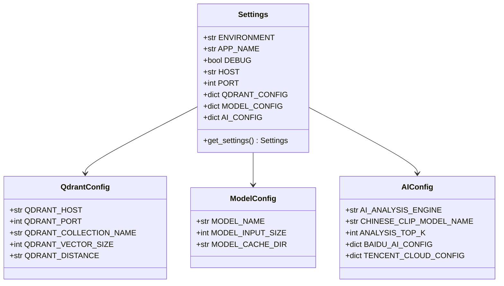

**图表来源**
- [backend/app/config.py:23-296](file://backend/app/config.py#L23-L296)

### 依赖管理

项目使用requirements.txt管理Python依赖，分为后端和AI服务两个独立的依赖配置：

**后端依赖特点：**
- FastAPI Web框架
- SQLAlchemy数据库ORM
- Redis异步支持
- Pydantic配置管理
- Pillow图像处理
- Polars数据分析

**AI服务依赖特点：**
- Transformers深度学习框架
- Torch GPU加速
- OpenCV计算机视觉
- Qdrant客户端
- OpenAI兼容接口

**章节来源**
- [backend/requirements.txt:1-35](file://backend/requirements.txt#L1-L35)
- [python-ai/requirements.txt:1-19](file://python-ai/requirements.txt#L1-L19)

## 架构概览

AI服务采用分层架构设计，实现了从模型加载到向量存储的完整处理链路：

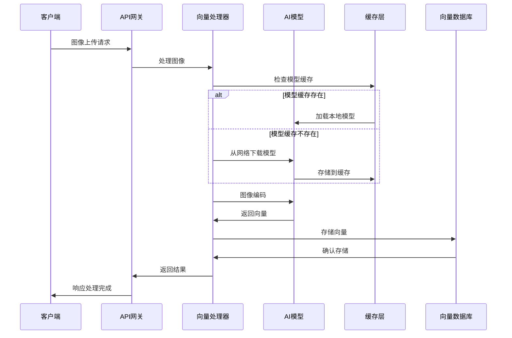

**图表来源**
- [backend/app/services/ai_vector_processing/ai_vector_processor.py:57-169](file://backend/app/services/ai_vector_processing/ai_vector_processor.py#L57-L169)
- [backend/app/services/ai_vector_processing/download_model.py:20-67](file://backend/app/services/ai_vector_processing/download_model.py#L20-L67)

## 详细组件分析

### 向量数据库Qdrant配置

Qdrant作为向量数据库，提供了高效的相似性搜索能力：

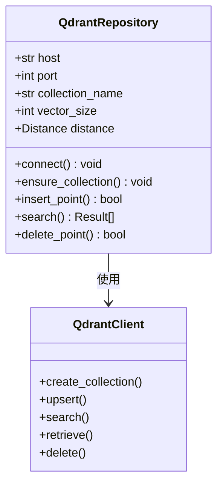

**配置参数说明：**
- **主机配置**: 默认localhost:6333
- **集合名称**: designs（可配置）
- **向量维度**: 768（可配置）
- **距离度量**: Cosine（可配置）

**章节来源**
- [backend/app/config.py:86-93](file://backend/app/config.py#L86-L93)
- [backend/app/repositories/qdrant_repo.py:14-503](file://backend/app/repositories/qdrant_repo.py#L14-L503)

### AI模型下载和缓存机制

模型管理系统提供了完整的离线部署解决方案：

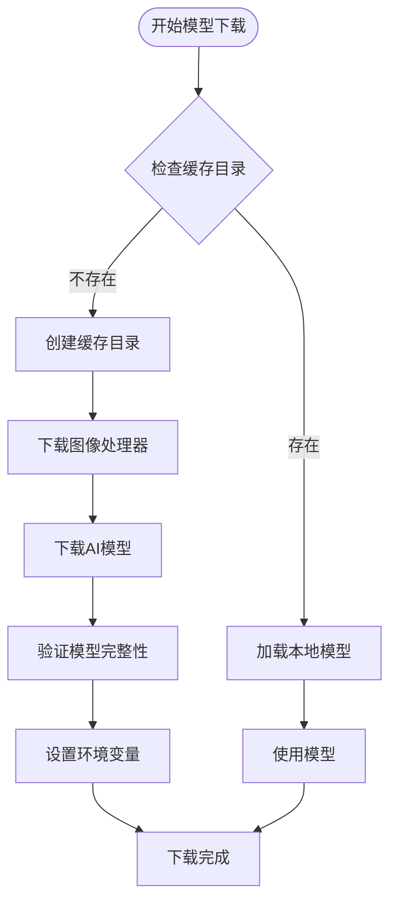

**图表来源**
- [backend/app/services/ai_vector_processing/download_model.py:20-117](file://backend/app/services/ai_vector_processing/download_model.py#L20-L117)

**缓存策略：**
- **缓存目录**: `/app/model_cache`（容器内绝对路径）
- **镜像源配置**: 支持TUNA等国内镜像源
- **本地文件优先**: 优先使用本地缓存，失败时自动下载
- **权限检查**: 自动处理目录权限问题

**章节来源**
- [backend/app/services/ai_vector_processing/download_model.py:1-117](file://backend/app/services/ai_vector_processing/download_model.py#L1-L117)
- [backend/app/services/ai_vector_processing/check_model_cache.py:1-18](file://backend/app/services/ai_vector_processing/check_model_cache.py#L1-L18)

### 图像识别服务集成

系统集成了多家AI服务提供商，提供多样化的图像识别能力：

#### 百度AI图像识别服务

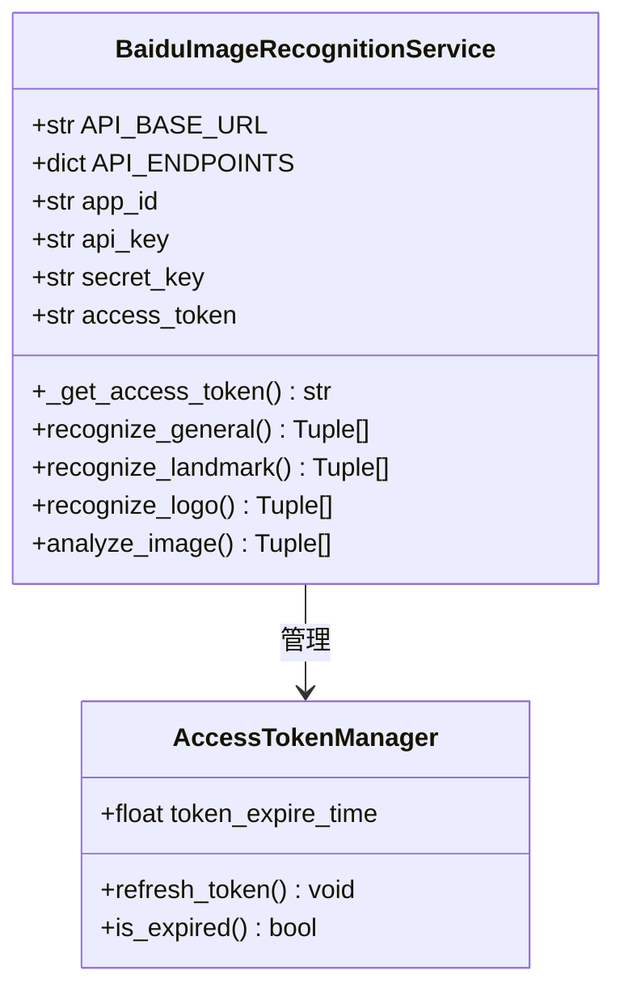

**支持的识别类型：**
- 通用物体识别（10万+物体和场景）
- Logo识别
- 植物识别
- 动物识别
- 菜品识别
- 地标识别
- 货币识别

#### 腾讯云图像识别服务

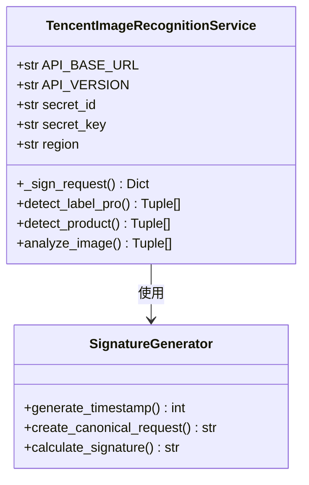

**核心功能：**
- 通用图像标签识别（DetectLabelPro）
- 商品识别（DetectProduct）
- 车辆识别（RecognizeCar）

**章节来源**
- [backend/app/services/baidu_image_recognition_service.py:33-450](file://backend/app/services/baidu_image_recognition_service.py#L33-L450)
- [backend/app/services/tencent_image_recognition_service.py:52-442](file://backend/app/services/tencent_image_recognition_service.py#L52-L442)

### 混元大模型视觉理解

腾讯云混元大模型提供了强大的图像理解和描述能力：

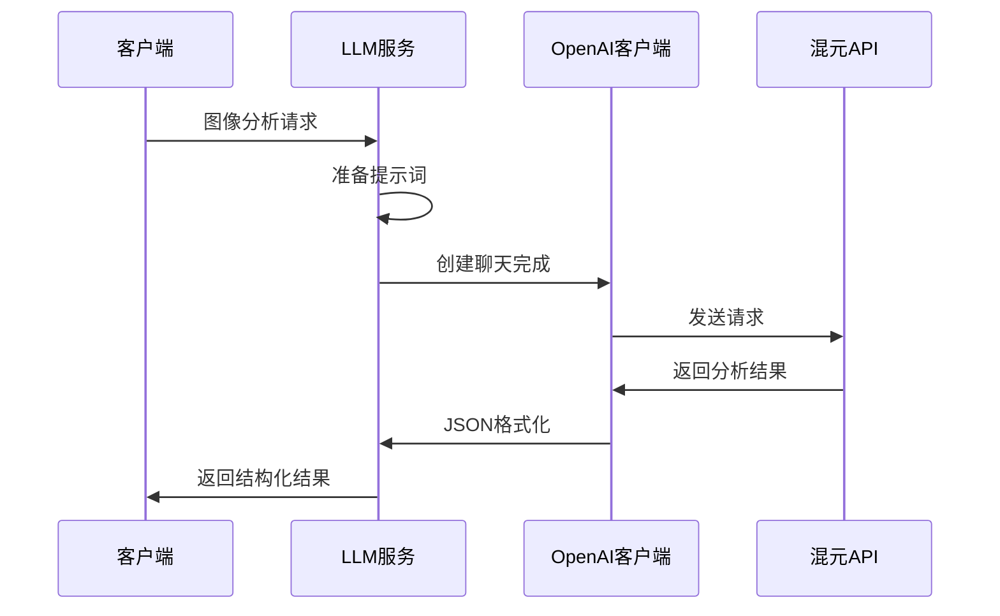

**图表来源**
- [backend/app/services/tencent_llm_vision_service.py:111-251](file://backend/app/services/tencent_llm_vision_service.py#L111-L251)

**输出格式：**
```json
{
    "product_type": "产品类型",
    "theme": "主题",
    "elements": [
        {"name": "元素名称", "english_name": "英文名称", "icon": "图标"}
    ],
    "text_content": ["文字内容1", "文字内容2"],
    "description": "整体描述"
}
```

**章节来源**
- [backend/app/services/tencent_llm_vision_service.py:1-286](file://backend/app/services/tencent_llm_vision_service.py#L1-L286)

## 依赖关系分析

### Docker服务编排

系统使用Docker Compose进行服务编排，定义了核心基础设施服务：

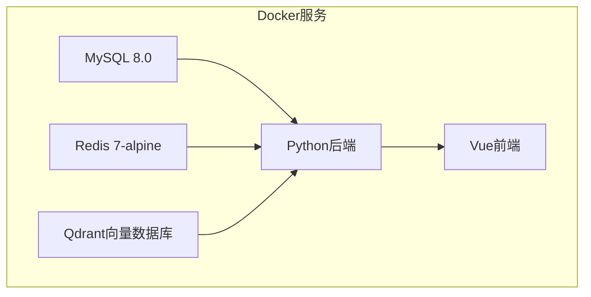

**图表来源**
- [docker-compose.yml:7-36](file://docker-compose.yml#L7-L36)

### 服务间依赖关系

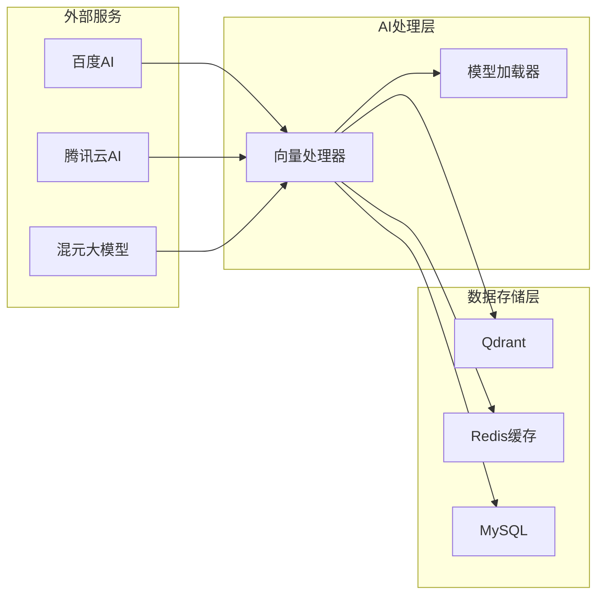

**章节来源**
- [docker-compose.yml:1-36](file://docker-compose.yml#L1-L36)

## 性能考虑

### 模型推理优化

系统实现了多层次的性能优化策略：

**GPU加速配置：**
- 自动检测CUDA可用性
- 启用TF32和混合精度训练
- GPU预热机制
- 内存管理和缓存清理

**缓存策略：**
- 本地内存缓存（LRU淘汰）
- Redis分布式缓存
- 智能缓存失效机制
- 批量处理优化

**并发处理：**
- 异步任务队列
- 连接池管理
- 超时控制和重试机制
- 资源限制和保护

### 监控和日志

系统提供了完善的监控和日志记录机制：

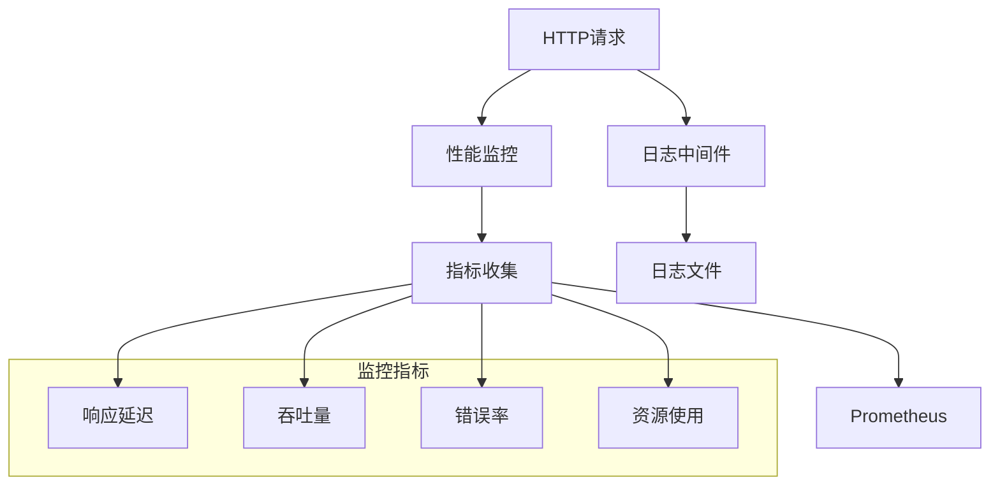

**图表来源**
- [backend/app/middleware/logging.py:12-203](file://backend/app/middleware/logging.py#L12-L203)
- [backend/app/utils/performance_monitor.py:9-158](file://backend/app/utils/performance_monitor.py#L9-L158)

**章节来源**
- [backend/app/utils/performance_monitor.py:1-158](file://backend/app/utils/performance_monitor.py#L1-L158)
- [backend/app/middleware/logging.py:1-203](file://backend/app/middleware/logging.py#L1-L203)

## 故障排除指南

### 常见问题诊断

**模型加载失败：**
1. 检查模型缓存目录权限
2. 验证网络连接和代理设置
3. 确认Hugging Face镜像源配置
4. 查看GPU驱动和CUDA版本兼容性

**Qdrant连接问题：**
1. 验证Qdrant服务状态
2. 检查防火墙和端口配置
3. 确认集合创建和权限设置
4. 监控磁盘空间和内存使用

**AI服务API错误：**
1. 验证API密钥配置
2. 检查请求频率限制
3. 确认服务可用性和区域设置
4. 查看错误响应和重试策略

**性能问题排查：**
1. 监控CPU和GPU使用率
2. 检查内存泄漏和缓存命中率
3. 分析慢查询和阻塞操作
4. 优化批处理大小和并发度

### 环境变量配置

**必需配置项：**
- `MYSQL_PASSWORD`: MySQL数据库密码
- `SECRET_KEY`: 应用加密密钥
- `HUNYUAN_API_KEY`: 腾讯云混元API密钥

**可选配置项：**
- `TRANSFORMERS_CACHE`: 模型缓存目录
- `HF_ENDPOINT`: Hugging Face镜像源
- `BACKEND_PORT`: 后端服务端口

**章节来源**
- [backend/app/config.py:12-296](file://backend/app/config.py#L12-L296)

## 结论

本AI服务环境配置指南提供了从基础设施搭建到应用部署的完整解决方案。通过合理的架构设计和优化策略，系统能够支持高效的图像识别和向量处理任务。建议在生产环境中重点关注以下方面：

1. **模型管理**: 建立完善的模型版本控制和缓存策略
2. **性能监控**: 持续监控系统性能指标和资源使用情况
3. **故障恢复**: 制定完善的备份和灾难恢复计划
4. **安全配置**: 加强API密钥管理和访问控制
5. **扩展规划**: 设计水平扩展和负载均衡方案

通过遵循本指南的配置建议，可以确保AI服务在开发和生产环境中稳定运行，并为未来的功能扩展奠定坚实基础。