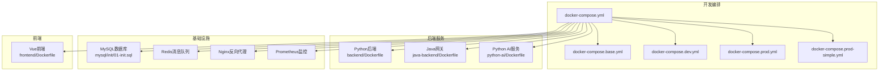
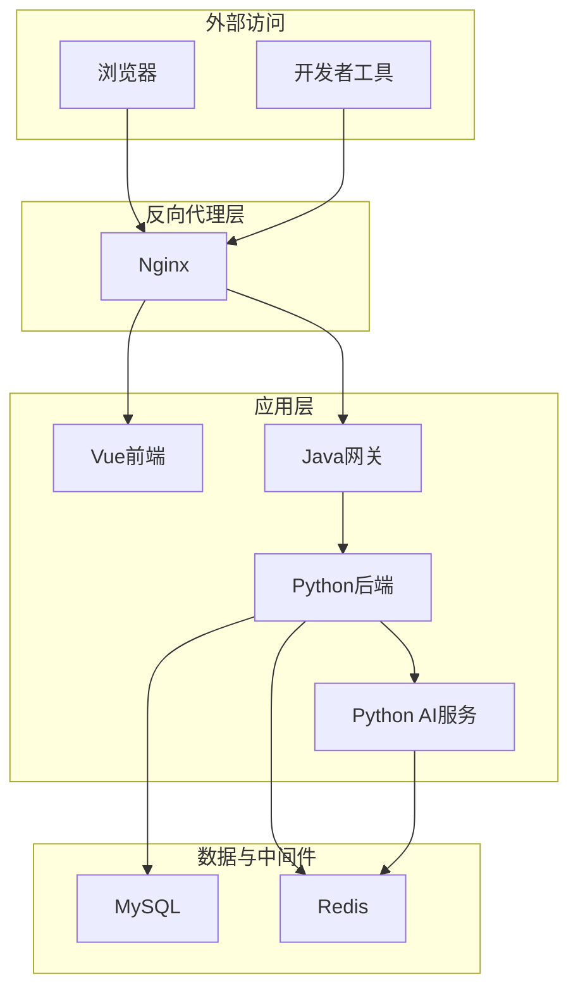
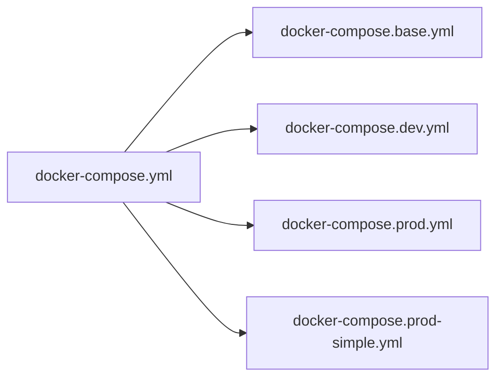
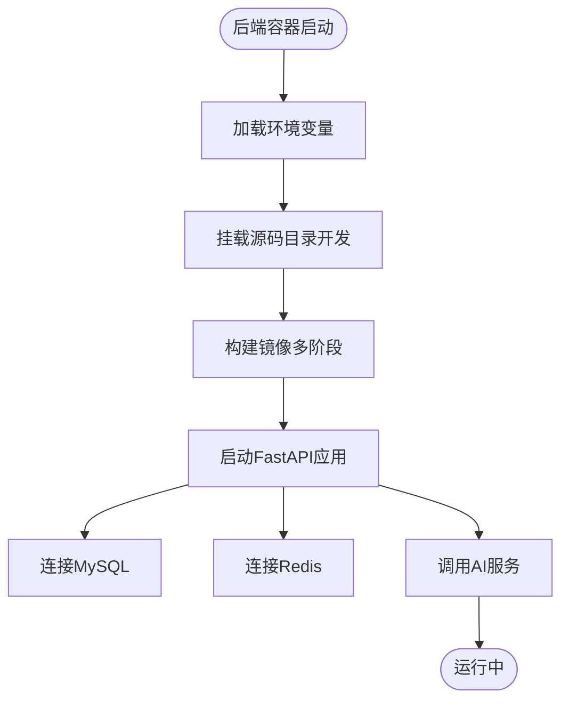
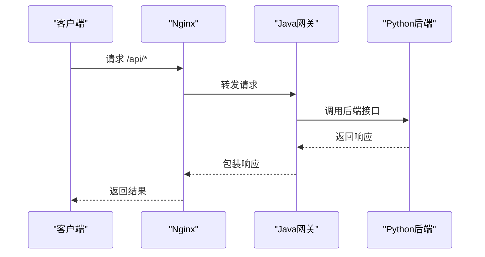
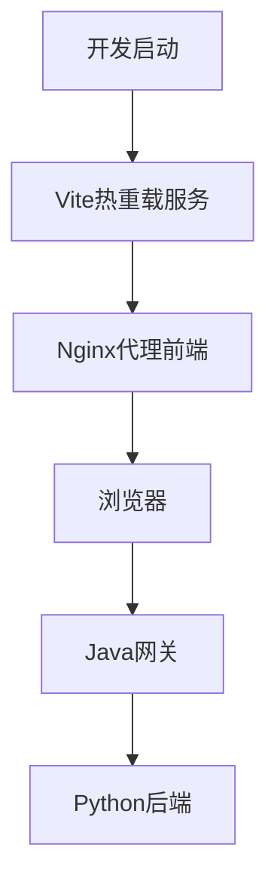
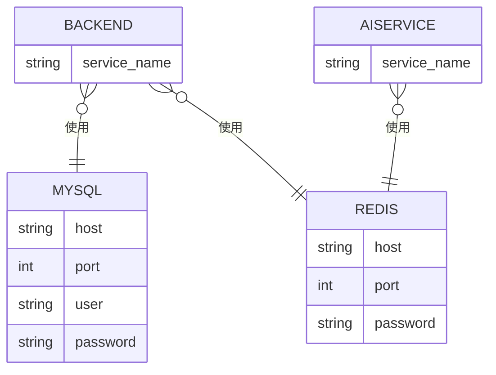
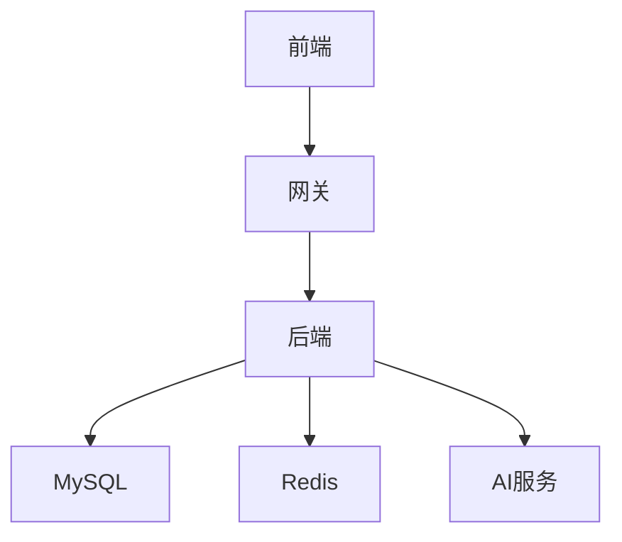

# Docker开发环境

<cite>
**本文引用的文件**
- [docker-compose.yml](file://docker-compose.yml)
- [docker-compose.base.yml](file://docker-compose.base.yml)
- [docker-compose.dev.yml](file://docker-compose.dev.yml)
- [docker-compose.prod.yml](file://docker-compose.prod.yml)
- [docker-compose.prod-simple.yml](file://docker-compose.prod-simple.yml)
- [backend/Dockerfile](file://backend/Dockerfile)
- [backend/Dockerfile.base](file://backend/Dockerfile.base)
- [backend/Dockerfile.dev](file://backend/Dockerfile.dev)
- [frontend/Dockerfile](file://frontend/Dockerfile)
- [java-backend/Dockerfile](file://java-backend/Dockerfile)
- [java-backend/Dockerfile.prod](file://java-backend/Dockerfile.prod)
- [backend/.dockerignore](file://backend/.dockerignore)
- [frontend/.dockerignore](file://frontend/.dockerignore)
- [mysql/init/01-init.sql](file://mysql/init/01-init.sql)
- [config/ports.json](file://config/ports.json)
- [docs/docker使用经验/README.md](file://docs/docker使用经验/README.md)
- [docs/docker使用经验/docker命令经验.md](file://docs/docker使用经验/docker命令经验.md)
- [docs/架构/Docker生产环境独立部署方案.md](file://docs/架构/Docker生产环境独立部署方案.md)
- [docs/项目逻辑/Docker部署踩坑总结.md](file://docs/项目逻辑/Docker部署踩坑总结.md)
- [docs/开发流程.md](file://docs/开发流程.md)
- [startup/start_with_hot_reload.py](file://scripts/startup/start_with_hot_reload.py)
- [utils/system/hot_reload.py](file://scripts/utils/system/hot_reload.py)
- [utils/system/performance_monitor.py](file://scripts/utils/system/performance_monitor.py)
- [backend/main.py](file://backend/main.py)
- [backend/config.py](file://backend/config.py)
- [frontend/vite.config.js](file://frontend/vite.config.js)
- [java-backend/src/main/resources/application.yml](file://java-backend/src/main/resources/application.yml)
- [java-backend/src/main/resources/application-prod.yml](file://java-backend/src/main/resources/application-prod.yml)
- [backend/tasks/celery_app.py](file://backend/tasks/celery_app.py)
- [backend/repositories/redis_repo.py](file://backend/repositories/redis_repo.py)
- [python-ai/Dockerfile](file://python-ai/Dockerfile)
- [python-ai/requirements.txt](file://python-ai/requirements.txt)
- [python-ai/app/main.py](file://python-ai/app/main.py)
- [prometheus/prometheus.yml](file://prometheus/prometheus.yml)
</cite>

## 目录
1. [简介](#简介)
2. [项目结构](#项目结构)
3. [核心组件](#核心组件)
4. [架构总览](#架构总览)
5. [详细组件分析](#详细组件分析)
6. [依赖关系分析](#依赖关系分析)
7. [性能考虑](#性能考虑)
8. [故障排除指南](#故障排除指南)
9. [结论](#结论)
10. [附录](#附录)

## 简介
本指南面向在Windows环境下使用Docker Desktop（WSL2后端）搭建本项目的容器化开发环境。文档涵盖：
- Docker Desktop安装与WSL2后端配置要点
- docker-compose.yml的结构与服务依赖关系
- 各服务容器的镜像构建配置（后端Python、Java网关、前端、数据库、消息队列、AI服务）
- 容器网络、卷挂载与环境变量传递策略
- 开发模式下的热重载与代码同步
- 日志查看、调试连接与性能监控
- 常用Compose命令与故障排除方法

## 项目结构
本仓库采用多语言混合架构，包含Python后端、Java网关、Vue前端、MySQL数据库、Redis消息队列以及独立的Python AI服务。Compose通过分层配置实现开发与生产的差异化管理。

**图表来源**
- [docker-compose.yml](file://docker-compose.yml)
- [docker-compose.base.yml](file://docker-compose.base.yml)
- [docker-compose.dev.yml](file://docker-compose.dev.yml)
- [docker-compose.prod.yml](file://docker-compose.prod.yml)
- [docker-compose.prod-simple.yml](file://docker-compose.prod-simple.yml)
- [backend/Dockerfile](file://backend/Dockerfile)
- [java-backend/Dockerfile](file://java-backend/Dockerfile)
- [python-ai/Dockerfile](file://python-ai/Dockerfile)
- [frontend/Dockerfile](file://frontend/Dockerfile)
- [mysql/init/01-init.sql](file://mysql/init/01-init.sql)

**章节来源**
- [docker-compose.yml](file://docker-compose.yml)
- [docker-compose.base.yml](file://docker-compose.base.yml)
- [docker-compose.dev.yml](file://docker-compose.dev.yml)
- [docker-compose.prod.yml](file://docker-compose.prod.yml)
- [docker-compose.prod-simple.yml](file://docker-compose.prod-simple.yml)

## 核心组件
- Python后端：提供REST API、任务处理（Celery）、向量检索等能力，使用FastAPI框架。
- Java网关：统一入口，负责路由与安全控制，支持多模块微服务。
- Vue前端：单页应用，开发时通过Vite热重载，生产时由Nginx提供静态资源。
- MySQL数据库：初始化脚本完成基础表结构与权限配置。
- Redis消息队列：用于异步任务与事件通知。
- Python AI服务：向量检索与嵌入服务，供后端调用。
- Prometheus：指标采集与可视化（可选）。

**章节来源**
- [backend/main.py](file://backend/main.py)
- [backend/config.py](file://backend/config.py)
- [java-backend/src/main/resources/application.yml](file://java-backend/src/main/resources/application.yml)
- [frontend/vite.config.js](file://frontend/vite.config.js)
- [python-ai/app/main.py](file://python-ai/app/main.py)
- [prometheus/prometheus.yml](file://prometheus/prometheus.yml)

## 架构总览
下图展示开发环境中的容器交互与数据流：

**图表来源**
- [docker-compose.yml](file://docker-compose.yml)
- [frontend/vite.config.js](file://frontend/vite.config.js)
- [java-backend/src/main/resources/application.yml](file://java-backend/src/main/resources/application.yml)
- [backend/main.py](file://backend/main.py)
- [python-ai/app/main.py](file://python-ai/app/main.py)

## 详细组件分析

### Docker Compose配置层次
- docker-compose.yml：主入口，聚合基础与开发配置。
- docker-compose.base.yml：通用服务定义（网络、卷、环境变量模板）。
- docker-compose.dev.yml：开发模式特有配置（热重载、挂载、调试端口映射）。
- docker-compose.prod.yml：生产模式配置（资源限制、健康检查、只读文件系统）。
- docker-compose.prod-simple.yml：简化版生产配置（适合演示或小规模部署）。

**图表来源**
- [docker-compose.yml](file://docker-compose.yml)
- [docker-compose.base.yml](file://docker-compose.base.yml)
- [docker-compose.dev.yml](file://docker-compose.dev.yml)
- [docker-compose.prod.yml](file://docker-compose.prod.yml)
- [docker-compose.prod-simple.yml](file://docker-compose.prod-simple.yml)

**章节来源**
- [docker-compose.yml](file://docker-compose.yml)
- [docker-compose.base.yml](file://docker-compose.base.yml)
- [docker-compose.dev.yml](file://docker-compose.dev.yml)
- [docker-compose.prod.yml](file://docker-compose.prod.yml)
- [docker-compose.prod-simple.yml](file://docker-compose.prod-simple.yml)

### 后端服务（Python）
- 构建镜像：基于多阶段构建，区分基础镜像、开发镜像与最终镜像，减少体积并提升安全性。
- 端口映射：开发模式暴露调试端口；生产模式按需映射。
- 卷挂载：开发模式挂载源码目录以实现热重载；生产模式使用只读文件系统。
- 环境变量：通过.env或Compose环境覆盖注入数据库、Redis、AI服务地址等。
- 依赖服务：MySQL、Redis、AI服务。

**图表来源**
- [backend/Dockerfile](file://backend/Dockerfile)
- [backend/Dockerfile.base](file://backend/Dockerfile.base)
- [backend/Dockerfile.dev](file://backend/Dockerfile.dev)
- [backend/config.py](file://backend/config.py)
- [backend/main.py](file://backend/main.py)

**章节来源**
- [backend/Dockerfile](file://backend/Dockerfile)
- [backend/Dockerfile.base](file://backend/Dockerfile.base)
- [backend/Dockerfile.dev](file://backend/Dockerfile.dev)
- [backend/.dockerignore](file://backend/.dockerignore)
- [backend/config.py](file://backend/config.py)
- [backend/main.py](file://backend/main.py)

### Java网关服务
- 构建镜像：多模块Maven工程，打包为可执行JAR，使用轻量级JRE运行。
- 配置文件：application.yml与application-prod.yml分别用于开发与生产。
- 端口映射：对外暴露API端口，内部服务间通过服务名通信。
- 依赖服务：后端Python服务、数据库、消息队列。

**图表来源**
- [java-backend/Dockerfile](file://java-backend/Dockerfile)
- [java-backend/src/main/resources/application.yml](file://java-backend/src/main/resources/application.yml)
- [java-backend/src/main/resources/application-prod.yml](file://java-backend/src/main/resources/application-prod.yml)
- [docker-compose.yml](file://docker-compose.yml)

**章节来源**
- [java-backend/Dockerfile](file://java-backend/Dockerfile)
- [java-backend/Dockerfile.prod](file://java-backend/Dockerfile.prod)
- [java-backend/src/main/resources/application.yml](file://java-backend/src/main/resources/application.yml)
- [java-backend/src/main/resources/application-prod.yml](file://java-backend/src/main/resources/application-prod.yml)

### 前端服务（Vue）
- 构建镜像：使用Nginx作为静态服务器，开发时通过Vite热重载。
- 端口映射：开发模式映射Vite端口；生产模式仅映射Nginx端口。
- 卷挂载：开发模式挂载源码目录，实现代码同步与热更新。
- 环境变量：通过构建参数或运行时注入API网关地址。

**图表来源**
- [frontend/Dockerfile](file://frontend/Dockerfile)
- [frontend/vite.config.js](file://frontend/vite.config.js)
- [docker-compose.yml](file://docker-compose.yml)

**章节来源**
- [frontend/Dockerfile](file://frontend/Dockerfile)
- [frontend/vite.config.js](file://frontend/vite.config.js)
- [frontend/.dockerignore](file://frontend/.dockerignore)

### 数据库与消息队列
- MySQL：初始化脚本完成基础表结构与权限配置，开发环境建议持久化卷。
- Redis：用于Celery任务队列与事件通知，建议开启持久化与内存限制。

**图表来源**
- [mysql/init/01-init.sql](file://mysql/init/01-init.sql)
- [backend/repositories/redis_repo.py](file://backend/repositories/redis_repo.py)
- [backend/tasks/celery_app.py](file://backend/tasks/celery_app.py)

**章节来源**
- [mysql/init/01-init.sql](file://mysql/init/01-init.sql)
- [backend/repositories/redis_repo.py](file://backend/repositories/redis_repo.py)
- [backend/tasks/celery_app.py](file://backend/tasks/celery_app.py)

### Python AI服务
- 构建镜像：独立容器，提供向量检索与嵌入服务。
- 端口映射：对外暴露服务端口，供后端调用。
- 依赖服务：Redis（向量存储）、后端服务。

**章节来源**
- [python-ai/Dockerfile](file://python-ai/Dockerfile)
- [python-ai/requirements.txt](file://python-ai/requirements.txt)
- [python-ai/app/main.py](file://python-ai/app/main.py)

## 依赖关系分析
- 服务依赖：前端依赖网关；网关依赖后端；后端依赖数据库与消息队列；后端依赖AI服务。
- 网络隔离：通过自定义桥接网络实现服务间通信，避免端口冲突。
- 数据持久化：数据库与Redis使用命名卷，确保数据不随容器重建丢失。
- 环境变量：集中于base配置，开发与生产通过env文件覆盖。

**图表来源**
- [docker-compose.yml](file://docker-compose.yml)
- [backend/config.py](file://backend/config.py)
- [java-backend/src/main/resources/application.yml](file://java-backend/src/main/resources/application.yml)

**章节来源**
- [docker-compose.yml](file://docker-compose.yml)
- [backend/config.py](file://backend/config.py)
- [java-backend/src/main/resources/application.yml](file://java-backend/src/main/resources/application.yml)

## 性能考虑
- 资源限制：生产配置中对CPU与内存进行限制，避免资源争抢。
- 只读文件系统：生产镜像使用只读根文件系统，提升安全性。
- 缓存与索引：数据库建立必要索引，AI服务使用向量索引加速检索。
- 监控：Prometheus采集指标，结合Grafana可视化（可选）。

**章节来源**
- [docker-compose.prod.yml](file://docker-compose.prod.yml)
- [prometheus/prometheus.yml](file://prometheus/prometheus.yml)

## 故障排除指南
- 容器无法启动
  - 检查端口占用：确认端口已在端口配置文件中声明且未被占用。
  - 查看日志：使用容器日志定位启动异常。
- 服务间无法通信
  - 确认服务名与网络一致，使用服务名而非localhost。
  - 检查防火墙与安全组设置。
- 热重载不生效
  - 确认开发模式挂载正确，且源码目录权限正常。
  - 检查Vite与后端CORS配置。
- 数据库初始化失败
  - 检查初始化SQL语法与权限，确认卷挂载路径正确。
- 性能问题
  - 使用性能监控工具定位瓶颈，调整资源限制与索引策略。

**章节来源**
- [config/ports.json](file://config/ports.json)
- [docs/docker使用经验/README.md](file://docs/docker使用经验/README.md)
- [docs/docker使用经验/docker命令经验.md](file://docs/docker使用经验/docker命令经验.md)
- [docs/项目逻辑/Docker部署踩坑总结.md](file://docs/项目逻辑/Docker部署踩坑总结.md)

## 结论
通过分层Compose配置与多阶段构建，本项目实现了开发与生产的清晰分离。配合热重载、卷挂载与环境变量管理，开发者可在WSL2后端的Docker Desktop上高效开展工作。建议在生产环境中启用资源限制、健康检查与只读文件系统，并持续完善监控与备份策略。

## 附录

### Docker Desktop安装与WSL2后端配置（Windows）
- 安装Docker Desktop并启用WSL2后端。
- 在WSL2发行版中安装Docker CLI以便在Linux子系统中操作。
- 配置Docker Desktop使用WSL2内核与文件系统，确保文件共享与权限正确。
- 在Windows中通过PowerShell或WSL2终端执行Compose命令。

### docker-compose.yml结构与服务依赖
- 主入口：聚合base与dev配置，定义网络、卷与环境变量模板。
- 服务依赖：前端依赖网关；网关依赖后端；后端依赖数据库、Redis与AI服务。
- 端口与网络：统一在base配置中定义，开发与生产通过env覆盖。

**章节来源**
- [docker-compose.yml](file://docker-compose.yml)
- [docker-compose.base.yml](file://docker-compose.base.yml)
- [docker-compose.dev.yml](file://docker-compose.dev.yml)

### 各服务容器构建配置
- Python后端：多阶段构建，区分基础镜像、开发镜像与最终镜像。
- Java网关：多模块Maven工程，打包为可执行JAR。
- Vue前端：Nginx静态服务器，开发时Vite热重载。
- Python AI服务：独立容器，提供向量检索能力。

**章节来源**
- [backend/Dockerfile](file://backend/Dockerfile)
- [backend/Dockerfile.base](file://backend/Dockerfile.base)
- [backend/Dockerfile.dev](file://backend/Dockerfile.dev)
- [java-backend/Dockerfile](file://java-backend/Dockerfile)
- [java-backend/Dockerfile.prod](file://java-backend/Dockerfile.prod)
- [frontend/Dockerfile](file://frontend/Dockerfile)
- [python-ai/Dockerfile](file://python-ai/Dockerfile)

### 容器网络、卷挂载与环境变量
- 网络：自定义桥接网络，服务间通过服务名通信。
- 卷：数据库与Redis使用命名卷；开发模式前端与后端挂载源码目录。
- 环境变量：集中于base配置，开发与生产通过env文件覆盖。

**章节来源**
- [docker-compose.base.yml](file://docker-compose.base.yml)
- [backend/.dockerignore](file://backend/.dockerignore)
- [frontend/.dockerignore](file://frontend/.dockerignore)

### 开发模式热重载与代码同步
- 前端：Vite热重载，Nginx代理前端静态资源。
- 后端：源码挂载至容器，结合调试器实现断点调试。
- 同步策略：开发模式挂载源码目录，避免重复构建。

**章节来源**
- [frontend/vite.config.js](file://frontend/vite.config.js)
- [startup/start_with_hot_reload.py](file://scripts/startup/start_with_hot_reload.py)
- [utils/system/hot_reload.py](file://scripts/utils/system/hot_reload.py)

### 日志查看、调试连接与性能监控
- 日志：使用容器日志查看后端、网关、AI服务的运行状态。
- 调试：后端支持远程调试端口映射；前端通过浏览器开发者工具调试。
- 监控：Prometheus采集指标，结合Grafana可视化（可选）。

**章节来源**
- [utils/system/performance_monitor.py](file://scripts/utils/system/performance_monitor.py)
- [prometheus/prometheus.yml](file://prometheus/prometheus.yml)

### 常用Compose命令
- 启动：docker compose up -d
- 停止：docker compose down
- 查看日志：docker compose logs -f 服务名
- 进入容器：docker compose exec 服务名 bash
- 重建镜像：docker compose build --no-cache
- 扩容：docker compose up -d --scale 服务名=副本数

**章节来源**
- [docs/docker使用经验/docker命令经验.md](file://docs/docker使用经验/docker命令经验.md)