# Java微服务环境配置

<cite>
**本文档引用的文件**
- [pom.xml](file://java-backend/pom.xml)
- [application.yml](file://java-backend/src/main/resources/application.yml)
- [application.yml](file://java-backend/sjzm-gateway/src/main/resources/application.yml)
- [application.yml](file://java-backend/sjzm-user/src/main/resources/application.yml)
- [application.yml](file://java-backend/sjzm-product/src/main/resources/application.yml)
- [docker-compose.yml](file://docker-compose.yml)
- [docker-compose.dev.yml](file://docker-compose.dev.yml)
- [docker-compose.nacos.yml](file://java-backend/docker-compose.nacos.yml)
- [start_dev_java.bat](file://start_dev_java.bat)
- [dev.sh](file://dev.sh)
- [SjzmBackendApplication.java](file://java-backend/src/main/java/com/sjzm/SjzmBackendApplication.java)
- [logback-spring.xml](file://java-backend/src/main/resources/logback-spring.xml)
- [log4j.properties](file://java-backend/src/main/resources/log4j.properties)
- [01-init.sql](file://mysql/init/01-init.sql)
- [create_final_drafts_table.sql](file://backend/app/db/migrations/create_final_drafts_table.sql)
- [docker-compose.base.yml](file://docker-compose.base.yml)
</cite>

## 目录
1. [简介](#简介)
2. [项目结构](#项目结构)
3. [核心组件](#核心组件)
4. [架构概览](#架构概览)
5. [详细组件分析](#详细组件分析)
6. [依赖分析](#依赖分析)
7. [性能考虑](#性能考虑)
8. [故障排除指南](#故障排除指南)
9. [结论](#结论)
10. [附录](#附录)

## 简介

这是一个基于Spring Boot的Java微服务项目，采用多模块架构设计。项目包含网关服务、用户服务、产品服务等核心微服务模块，支持本地开发环境配置和Docker容器化部署。

## 项目结构

该项目采用多模块Maven结构，主要包含以下核心目录：

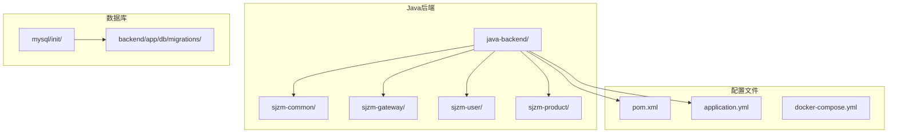

**图表来源**
- [pom.xml](file://java-backend/pom.xml)
- [application.yml](file://java-backend/src/main/resources/application.yml)

**章节来源**
- [pom.xml](file://java-backend/pom.xml)
- [docker-compose.yml](file://docker-compose.yml)

## 核心组件

### Maven项目构建配置

项目使用Maven进行依赖管理和构建，核心配置包含以下要点：

- **多模块结构**：包含公共模块、网关模块、用户模块、产品模块
- **依赖管理**：统一版本控制和依赖传递
- **插件配置**：包含编译插件、资源处理插件等

### Spring Boot应用配置

主应用配置文件包含以下关键配置项：

- **服务器端口**：定义应用监听端口
- **数据源配置**：MySQL连接参数
- **日志配置**：Logback和Log4j配置
- **服务注册**：Nacos注册中心配置

**章节来源**
- [pom.xml](file://java-backend/pom.xml)
- [application.yml](file://java-backend/src/main/resources/application.yml)

## 架构概览

系统采用微服务架构，通过网关统一入口访问各个业务服务：

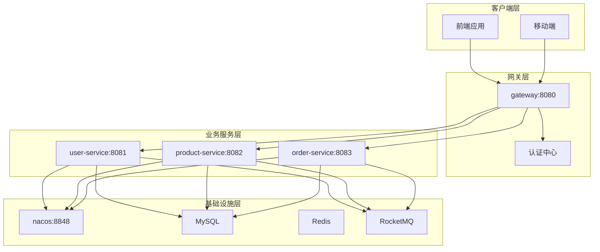

**图表来源**
- [docker-compose.yml](file://docker-compose.yml)
- [docker-compose.nacos.yml](file://java-backend/docker-compose.nacos.yml)

## 详细组件分析

### 网关服务配置

网关服务作为系统的统一入口，负责请求路由、认证授权等功能：

#### 网关配置文件结构

网关服务的配置文件包含以下关键配置：

- **路由配置**：定义到各微服务的路由规则
- **过滤器配置**：全局过滤器和特定过滤器
- **限流配置**：请求限流和熔断配置
- **跨域配置**：CORS跨域资源共享设置

#### 网关启动流程

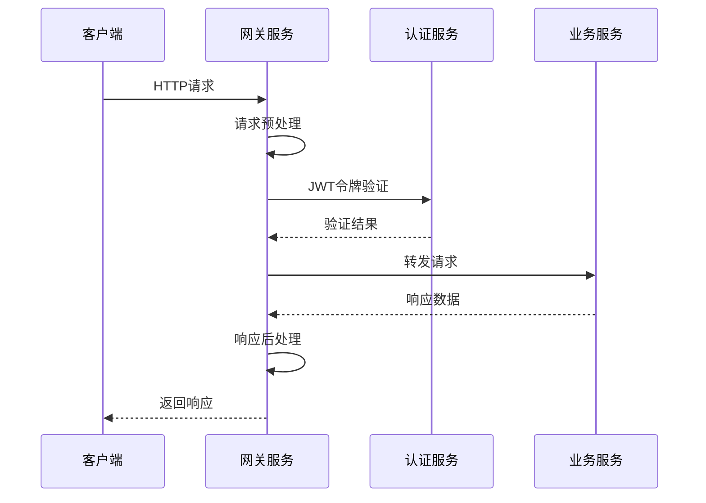

**图表来源**
- [application.yml](file://java-backend/sjzm-gateway/src/main/resources/application.yml)

**章节来源**
- [application.yml](file://java-backend/sjzm-gateway/src/main/resources/application.yml)

### 用户服务配置

用户服务负责用户管理、权限控制等核心功能：

#### 数据模型设计

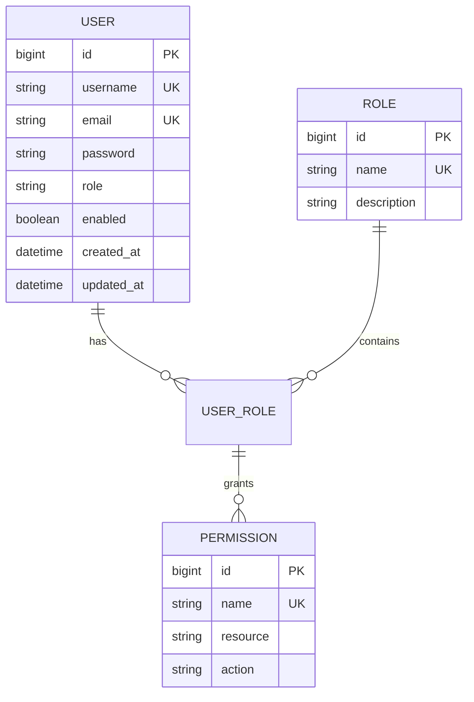

**图表来源**
- [01-init.sql](file://mysql/init/01-init.sql)

#### 用户服务启动配置

用户服务的启动配置包含：

- **数据库连接**：MySQL数据源配置
- **Redis缓存**：用户会话和权限缓存
- **JWT配置**：令牌生成和验证
- **安全配置**：权限控制和访问限制

**章节来源**
- [application.yml](file://java-backend/sjzm-user/src/main/resources/application.yml)

### 产品服务配置

产品服务负责产品数据管理、搜索、推荐等功能：

#### 产品数据模型

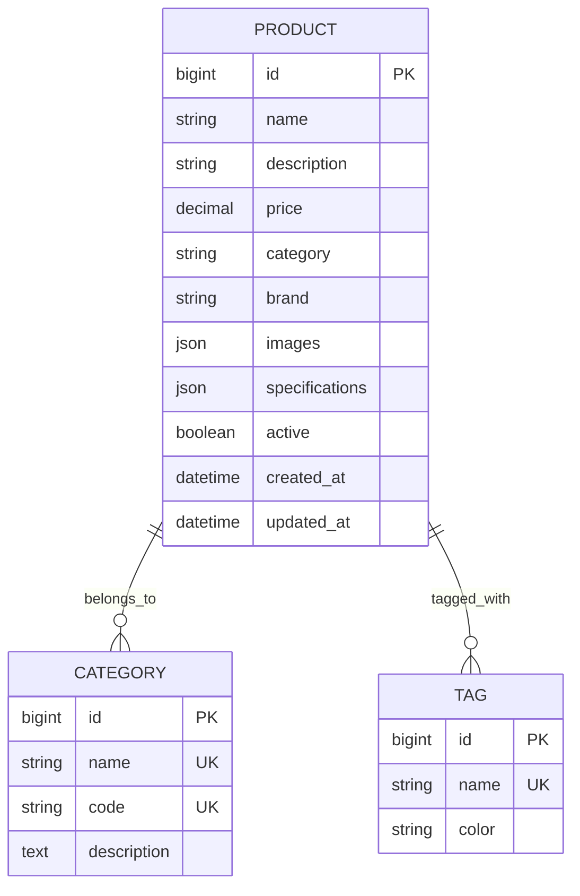

**图表来源**
- [create_final_drafts_table.sql](file://backend/app/db/migrations/create_final_drafts_table.sql)

#### 产品服务特性

- **搜索功能**：支持全文搜索和高级筛选
- **图片处理**：图片上传、压缩、缩略图生成
- **库存管理**：实时库存更新和预警
- **价格计算**：动态价格策略和促销活动

**章节来源**
- [application.yml](file://java-backend/sjzm-product/src/main/resources/application.yml)

### 数据库初始化配置

系统提供完整的数据库初始化脚本：

#### 初始化流程

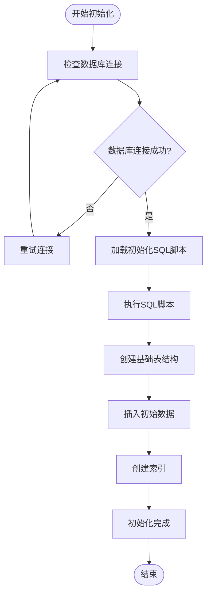

**图表来源**
- [01-init.sql](file://mysql/init/01-init.sql)

**章节来源**
- [01-init.sql](file://mysql/init/01-init.sql)

### Nacos服务注册与发现配置

系统使用Nacos作为服务注册中心：

#### Nacos配置结构

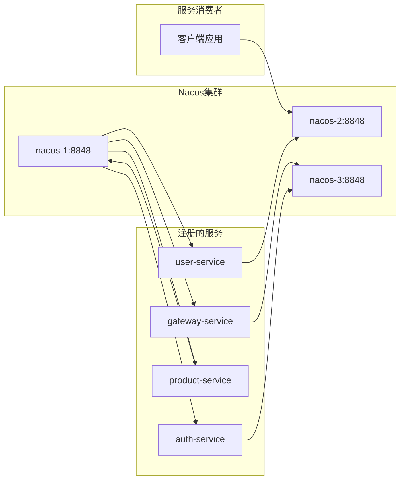

**图表来源**
- [docker-compose.nacos.yml](file://java-backend/docker-compose.nacos.yml)

#### 服务发现流程

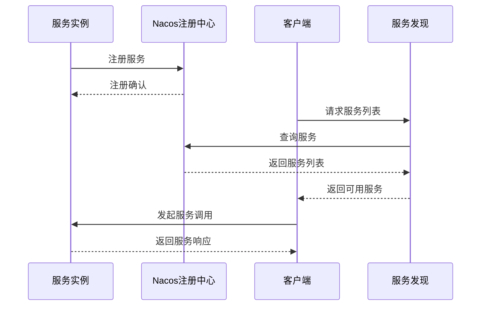

**图表来源**
- [docker-compose.nacos.yml](file://java-backend/docker-compose.nacos.yml)

**章节来源**
- [docker-compose.nacos.yml](file://java-backend/docker-compose.nacos.yml)

### RocketMQ消息队列集成

系统集成了RocketMQ用于异步消息处理：

#### 消息处理架构

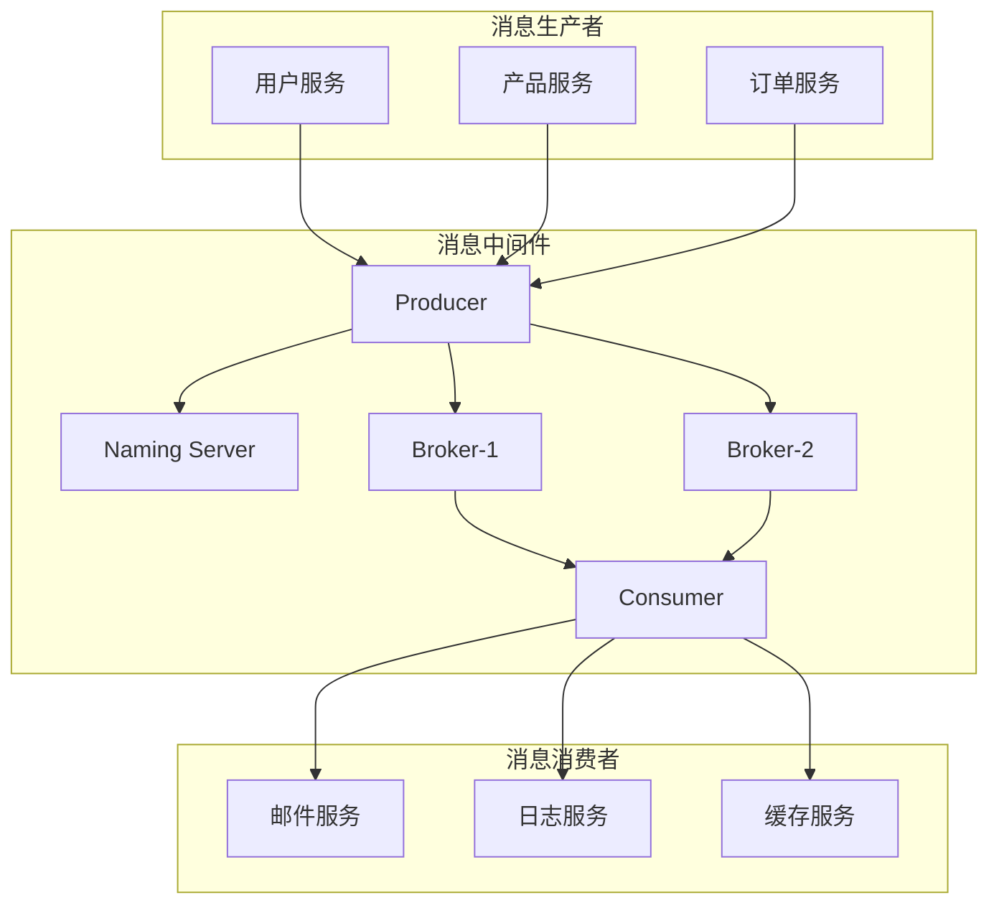

**图表来源**
- [docker-compose.yml](file://docker-compose.yml)

#### 异步处理场景

- **用户注册通知**：用户注册后发送欢迎邮件
- **产品更新同步**：产品信息变更同步到搜索引擎
- **订单状态通知**：订单状态变更通知相关服务
- **日志收集**：系统操作日志异步收集和分析

**章节来源**
- [docker-compose.yml](file://docker-compose.yml)

### 安全配置与JWT认证

系统实现了基于JWT的认证授权机制：

#### 认证流程

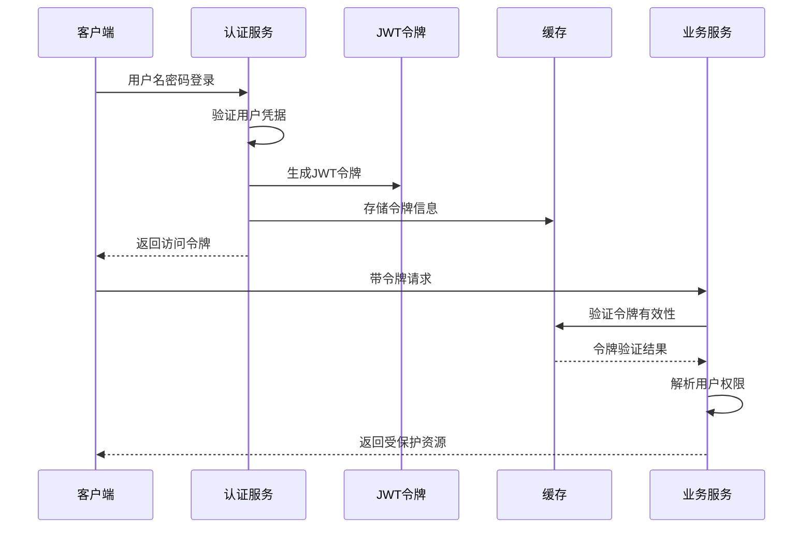

**图表来源**
- [application.yml](file://java-backend/sjzm-user/src/main/resources/application.yml)

#### 权限控制机制

- **角色权限**：基于角色的访问控制(RBAC)
- **资源权限**：细粒度资源访问控制
- **接口权限**：REST API权限验证
- **数据权限**：数据级权限隔离

**章节来源**
- [application.yml](file://java-backend/sjzm-user/src/main/resources/application.yml)

## 依赖分析

### Maven依赖关系

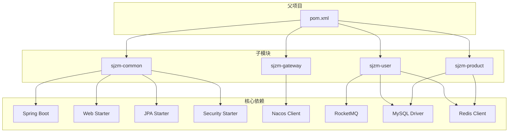

**图表来源**
- [pom.xml](file://java-backend/pom.xml)

### 运行时依赖

系统运行时需要以下外部服务：

- **数据库服务**：MySQL 8.0+
- **注册中心**：Nacos 2.0+
- **消息队列**：RocketMQ 5.0+
- **缓存服务**：Redis 6.0+
- **配置中心**：Nacos（可选）

**章节来源**
- [pom.xml](file://java-backend/pom.xml)
- [docker-compose.yml](file://docker-compose.yml)

## 性能考虑

### 数据库性能优化

- **连接池配置**：合理设置最大连接数和超时时间
- **索引优化**：为常用查询字段建立适当索引
- **查询优化**：避免N+1查询和复杂联表操作
- **分页查询**：大数据量场景使用游标分页

### 缓存策略

- **多级缓存**：本地缓存+分布式缓存
- **缓存失效**：设置合理的过期时间和更新策略
- **热点数据**：对高频访问数据进行预热
- **缓存穿透**：实现空值缓存和布隆过滤器

### 网关性能

- **路由优化**：静态路由优先于正则表达式路由
- **限流策略**：基于IP和用户维度的限流
- **熔断降级**：下游服务异常时的快速失败
- **负载均衡**：轮询、权重、最少连接等算法

## 故障排除指南

### 常见启动问题

#### 数据库连接失败

**症状**：应用启动时报数据库连接错误

**解决方案**：
1. 检查数据库服务是否正常运行
2. 验证连接字符串和凭据
3. 确认网络连通性
4. 检查防火墙设置

#### Nacos连接问题

**症状**：服务无法注册到注册中心

**解决方案**：
1. 验证Nacos服务地址配置
2. 检查网络连通性和端口开放
3. 确认Nacos用户名密码
4. 查看Nacos控制台状态

#### 端口冲突

**症状**：服务启动时端口被占用

**解决方案**：
1. 修改application.yml中的端口号
2. 使用netstat检查端口占用
3. 终止占用端口的进程
4. 重启服务

### 日志配置

系统提供了多种日志配置选项：

#### Logback配置

- **开发环境**：详细日志输出，控制台彩色显示
- **生产环境**：结构化日志，文件滚动备份
- **错误级别**：ERROR级别单独文件记录
- **性能监控**：慢查询和异常调用跟踪

#### 日志分析

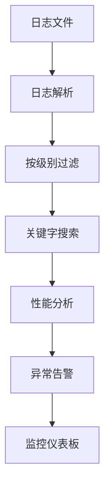

**图表来源**
- [logback-spring.xml](file://java-backend/src/main/resources/logback-spring.xml)

**章节来源**
- [logback-spring.xml](file://java-backend/src/main/resources/logback-spring.xml)
- [log4j.properties](file://java-backend/src/main/resources/log4j.properties)

## 结论

本Java微服务项目提供了完整的开发环境配置方案，包括：

- **多模块Maven结构**：清晰的模块划分和依赖管理
- **容器化部署**：Docker Compose简化部署流程
- **服务治理**：Nacos提供服务注册发现
- **消息通信**：RocketMQ实现异步解耦
- **安全保障**：JWT认证和RBAC权限控制
- **监控运维**：完善的日志和性能监控

建议在本地开发时按照本文档的配置步骤逐步搭建环境，确保各服务能够正常启动和通信。

## 附录

### 开发环境启动脚本

#### Windows环境

使用提供的批处理脚本启动开发环境：

```batch
@echo off
echo 正在启动Java微服务开发环境...
echo.

REM 启动数据库服务
echo 启动MySQL服务...
start_dev_java.bat

echo.
echo 等待服务启动...
timeout /t 10

echo.
echo 启动网关服务
echo 启动用户服务
echo 启动产品服务

echo.
echo 开发环境启动完成！
echo 访问地址：http://localhost:8080
```

#### Linux/Mac环境

使用shell脚本启动：

```bash
#!/bin/bash
echo "启动Java微服务开发环境..."

# 启动所有服务
./dev.sh start

echo "等待服务启动..."
sleep 10

echo "开发环境启动完成！"
echo "访问地址：http://localhost:8080"
```

### 环境变量配置

系统支持通过环境变量进行配置覆盖：

| 环境变量 | 默认值 | 用途 |
|---------|--------|------|
| SERVER_PORT | 8080 | 应用监听端口 |
| SPRING_PROFILES_ACTIVE | dev | 环境配置文件 |
| MYSQL_HOST | localhost | MySQL主机地址 |
| MYSQL_PORT | 3306 | MySQL端口号 |
| NACOS_SERVER_ADDR | localhost:8848 | Nacos服务器地址 |
| REDIS_HOST | localhost | Redis主机地址 |
| ROCKETMQ_NAMESRV_ADDR | localhost:9876 | RocketMQ命名服务器 |

### 健康检查

各服务提供健康检查端点：

- **网关服务**：`GET /actuator/health`
- **用户服务**：`GET /user/actuator/health`
- **产品服务**：`GET /product/actuator/health`

返回标准的JSON格式，包含服务状态、数据库连接、缓存连接等信息。