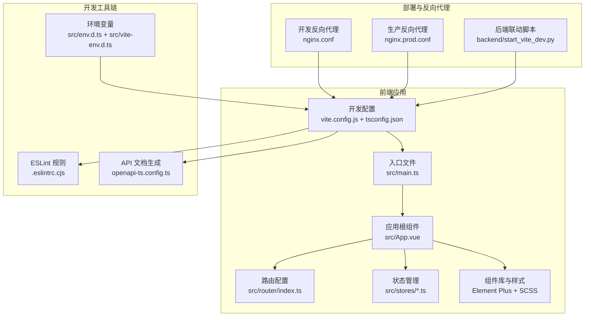
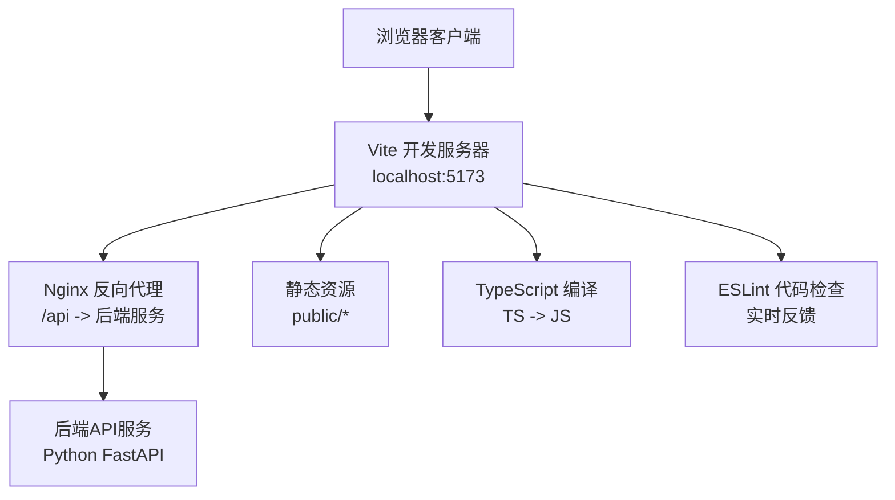
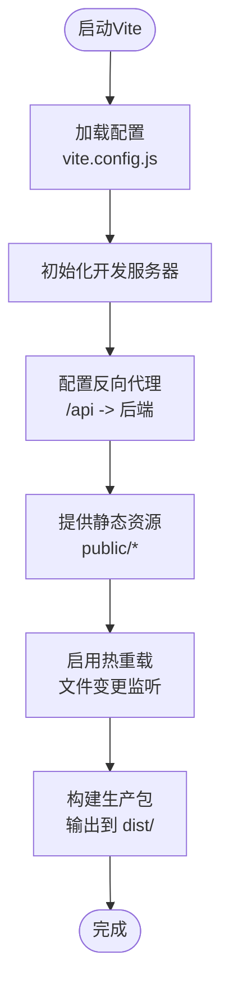
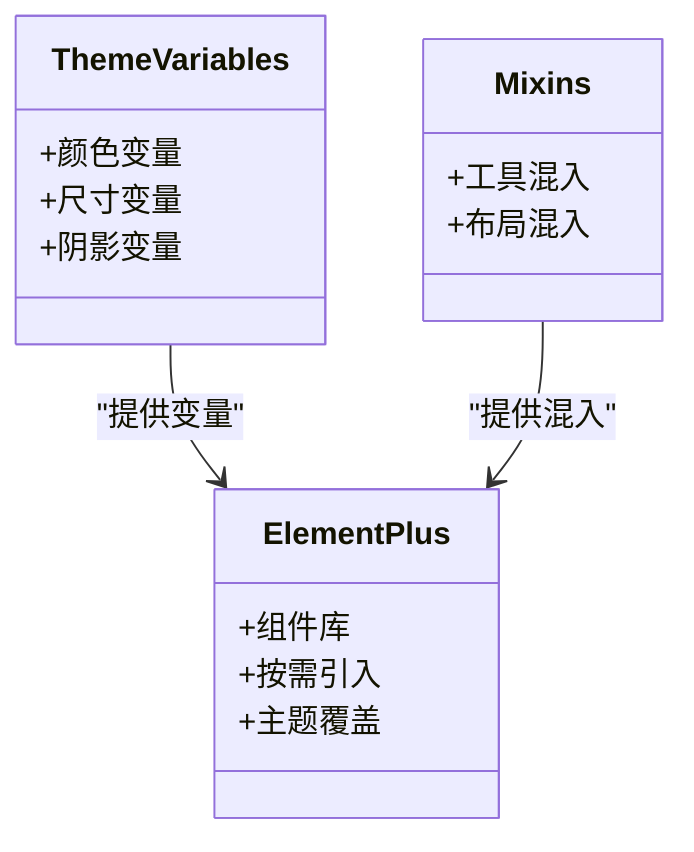
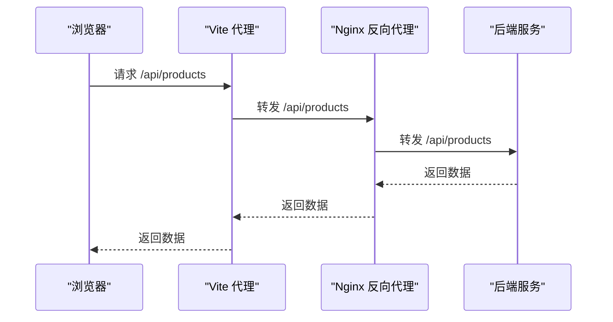
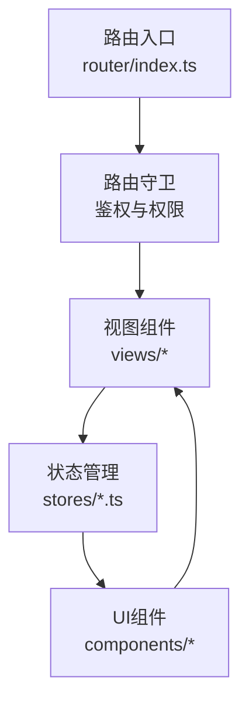
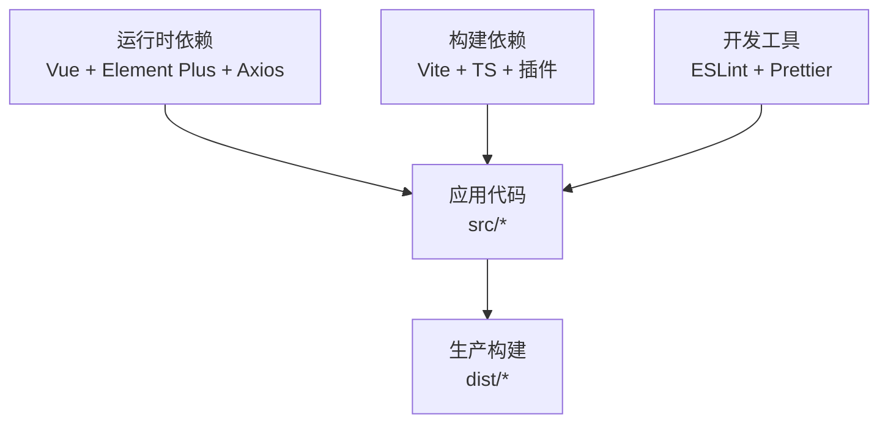

# 前端环境配置

<cite>
**本文引用的文件**
- [package.json](file://frontend/package.json)
- [vite.config.js](file://frontend/vite.config.js)
- [tsconfig.json](file://frontend/tsconfig.json)
- [tsconfig.node.json](file://frontend/tsconfig.node.json)
- [index.html](file://frontend/index.html)
- [main.ts](file://frontend/src/main.ts)
- [App.vue](file://frontend/src/App.vue)
- [router/index.ts](file://frontend/src/router/index.ts)
- [stores/app.ts](file://frontend/src/stores/app.ts)
- [stores/settings.ts](file://frontend/src/stores/settings.ts)
- [styles/variables.scss](file://frontend/src/styles/variables.scss)
- [styles/mixins.scss](file://frontend/src/styles/mixins.scss)
- [env.d.ts](file://frontend/src/env.d.ts)
- [vite-env.d.ts](file://frontend/src/vite-env.d.ts)
- [.eslintrc.cjs](file://frontend/.eslintrc.cjs)
- [openapi-ts.config.ts](file://frontend/openapi-ts.config.ts)
- [openapi.json](file://frontend/openapi.json)
- [nginx.conf](file://frontend/nginx.conf)
- [nginx.prod.conf](file://frontend/nginx.prod.conf)
- [backend/start_vite_dev.py](file://backend/start_vite_dev.py)
- [backend/config.py](file://backend/config.py)
- [config/ports.json](file://config/ports.json)
</cite>

## 目录
1. [简介](#简介)
2. [项目结构](#项目结构)
3. [核心组件](#核心组件)
4. [架构概览](#架构概览)
5. [详细组件分析](#详细组件分析)
6. [依赖分析](#依赖分析)
7. [性能考虑](#性能考虑)
8. [故障排除指南](#故障排除指南)
9. [结论](#结论)
10. [附录](#附录)

## 简介
本指南面向Vue.js前端开发团队，提供从零开始搭建开发环境的完整配置说明。内容涵盖Node.js版本要求、npm/pnpm包管理器配置、依赖安装步骤；Vite构建工具的配置选项与开发服务器设置；TypeScript配置、ESLint规则与代码格式化；Element Plus组件库的集成与主题定制；开发环境变量、代理设置与API接口配置；热重载、源码映射与调试工具；以及前端路由、状态管理与UI组件开发规范。

## 项目结构
前端工程位于仓库根目录的frontend文件夹中，采用Vite + Vue 3 + TypeScript技术栈。项目包含以下关键层次：
- 应用入口与配置：入口文件、HTML模板、Vite配置、TypeScript配置
- 路由与状态管理：基于Vue Router的路由定义与Pinia状态管理
- 组件体系：通用组件、布局组件、视图页面
- 样式系统：SCSS变量与混入、全局样式
- 工具与类型：环境变量声明、自动导入声明、API类型定义
- 开发与部署：ESLint配置、Nginx配置、后端脚本联动

**图表来源**
- [main.ts](file://frontend/src/main.ts)
- [App.vue](file://frontend/src/App.vue)
- [router/index.ts](file://frontend/src/router/index.ts)
- [stores/app.ts](file://frontend/src/stores/app.ts)
- [vite.config.js](file://frontend/vite.config.js)
- [.eslintrc.cjs](file://frontend/.eslintrc.cjs)
- [openapi-ts.config.ts](file://frontend/openapi-ts.config.ts)
- [nginx.conf](file://frontend/nginx.conf)
- [nginx.prod.conf](file://frontend/nginx.prod.conf)
- [backend/start_vite_dev.py](file://backend/start_vite_dev.py)

**章节来源**
- [package.json](file://frontend/package.json)
- [vite.config.js](file://frontend/vite.config.js)
- [tsconfig.json](file://frontend/tsconfig.json)
- [tsconfig.node.json](file://frontend/tsconfig.node.json)
- [index.html](file://frontend/index.html)

## 核心组件
本节概述前端开发环境的关键组成与职责：
- 包管理与依赖：通过package.json声明依赖与脚本，支持npm或pnpm
- 构建工具：Vite提供快速开发服务器、热重载与生产打包
- 类型系统：TypeScript配置确保类型安全与IDE智能提示
- 代码质量：ESLint规则与Prettier格式化统一代码风格
- 组件库：Element Plus提供UI基础组件与主题定制
- 开发代理：Nginx反向代理实现前后端联调
- 状态管理：Pinia集中管理应用状态
- 路由系统：Vue Router实现页面导航与权限控制

**章节来源**
- [package.json](file://frontend/package.json)
- [vite.config.js](file://frontend/vite.config.js)
- [tsconfig.json](file://frontend/tsconfig.json)
- [.eslintrc.cjs](file://frontend/.eslintrc.cjs)

## 架构概览
下图展示前端开发环境的整体架构，包括开发服务器、代理层、后端API与静态资源的关系。

**图表来源**
- [vite.config.js](file://frontend/vite.config.js)
- [nginx.conf](file://frontend/nginx.conf)
- [backend/start_vite_dev.py](file://backend/start_vite_dev.py)

## 详细组件分析

### Node.js与包管理器配置
- Node.js版本：建议使用LTS版本（如18.x或20.x），以获得最佳兼容性与性能
- 包管理器选择：
  - npm：默认包管理器，适合大多数场景
  - pnpm：更快的安装速度与磁盘占用，推荐用于大型项目
- 依赖安装：
  - 使用npm或pnpm执行安装命令，确保lock文件同步
  - 如需清理缓存，可使用相应清理命令
- 脚本命令：
  - 开发：启动Vite开发服务器
  - 构建：生成生产环境静态资源
  - 预览：本地预览生产构建
  - 清理：清理临时文件与缓存

**章节来源**
- [package.json](file://frontend/package.json)

### Vite构建工具配置
- 开发服务器：
  - 端口：默认5173，可通过配置文件修改
  - 主机：允许外部访问（开发联调）
  - 代理：配置/api前缀转发至后端服务
- 构建输出：
  - 目标：ES2020+，现代浏览器
  - 输出目录：dist
  - 资源路径：相对路径，适配CDN
- 插件生态：
  - Vue插件：自动导入、类型声明
  - SCSS支持：全局样式与变量
  - 自动导入：减少重复import
- 热重载：
  - 文件变更触发局部刷新
  - CSS热更新无刷新
- 源码映射：
  - 开发启用详细映射，便于调试
  - 生产可选择关闭以减小体积

**图表来源**
- [vite.config.js](file://frontend/vite.config.js)
- [nginx.conf](file://frontend/nginx.conf)

**章节来源**
- [vite.config.js](file://frontend/vite.config.js)
- [index.html](file://frontend/index.html)

### TypeScript配置
- 编译目标与模块：
  - 目标：ES2020+
  - 模块：ESNext
  - 实验特性：装饰器、提案语法等按需开启
- 路径别名：
  - 使用路径映射简化import路径
  - 与Vite alias保持一致
- 类型声明：
  - 环境变量类型：src/env.d.ts
  - Vite类型：src/vite-env.d.ts
  - 自动导入声明：src/auto-imports.d.ts、src/components.d.ts
- 严格模式：
  - 启用严格类型检查，提升代码质量
  - 为Vue组件提供更好的类型推断

**章节来源**
- [tsconfig.json](file://frontend/tsconfig.json)
- [tsconfig.node.json](file://frontend/tsconfig.node.json)
- [env.d.ts](file://frontend/src/env.d.ts)
- [vite-env.d.ts](file://frontend/src/vite-env.d.ts)

### ESLint规则与代码格式化
- 规则配置：
  - 使用CJS格式的ESLint配置文件
  - 集成Vue与TypeScript规则集
  - 自动导入规则：避免未使用导入
- 代码格式化：
  - Prettier统一缩进、引号、分号等风格
  - 与ESLint协同工作，保存时自动格式化
- IDE集成：
  - VSCode推荐扩展：ESLint、Prettier
  - 保存时自动修复
- 提交前检查：
  - 结合lint-staged与husky在提交前运行检查

**章节来源**
- [.eslintrc.cjs](file://frontend/.eslintrc.cjs)

### Element Plus组件库集成与主题定制
- 安装与按需引入：
  - 安装Element Plus及相关图标
  - 配置自动导入，减少重复import
- 主题定制：
  - 使用SCSS变量覆盖默认主题色
  - 在全局样式中引入主题变量与混入
- 图标系统：
  - 集成Element Plus图标库
  - 支持SVG与字体图标

**图表来源**
- [styles/variables.scss](file://frontend/src/styles/variables.scss)
- [styles/mixins.scss](file://frontend/src/styles/mixins.scss)

**章节来源**
- [styles/variables.scss](file://frontend/src/styles/variables.scss)
- [styles/mixins.scss](file://frontend/src/styles/mixins.scss)

### 开发环境变量、代理与API配置
- 环境变量：
  - 开发：.env.development，设置API_BASE_URL等
  - 生产：.env.production，设置CDN与域名
  - 类型声明：在env.d.ts中声明变量类型
- 反向代理：
  - Nginx配置将/api前缀转发至后端
  - 支持跨域请求处理
- API接口：
  - 使用Axios封装请求拦截器与响应拦截器
  - 自动生成API类型定义（openapi-ts）
  - 接口文档：openapi.json

**图表来源**
- [nginx.conf](file://frontend/nginx.conf)
- [backend/start_vite_dev.py](file://backend/start_vite_dev.py)

**章节来源**
- [env.d.ts](file://frontend/src/env.d.ts)
- [nginx.conf](file://frontend/nginx.conf)
- [nginx.prod.conf](file://frontend/nginx.prod.conf)
- [openapi.json](file://frontend/openapi.json)

### 热重载、源码映射与调试工具
- 热重载：
  - Vite内置HMR，文件变更自动刷新
  - CSS热更新无需刷新页面
- 源码映射：
  - 开发环境启用详细映射，便于断点调试
  - 生产环境可关闭以减小体积
- 调试工具：
  - Vue DevTools：检查组件树与状态
  - 浏览器开发者工具：网络、源码、性能分析
  - ESLint与TypeScript错误提示

**章节来源**
- [vite.config.js](file://frontend/vite.config.js)

### 前端路由与状态管理
- 路由配置：
  - 基于Vue Router定义页面路由
  - 支持动态路由与嵌套路由
  - 权限控制：结合用户角色限制访问
- 状态管理：
  - Pinia集中管理应用状态
  - 模块化store：app、settings、user等
  - 持久化：可选持久化策略

**图表来源**
- [router/index.ts](file://frontend/src/router/index.ts)
- [stores/app.ts](file://frontend/src/stores/app.ts)
- [stores/settings.ts](file://frontend/src/stores/settings.ts)

**章节来源**
- [router/index.ts](file://frontend/src/router/index.ts)
- [stores/app.ts](file://frontend/src/stores/app.ts)
- [stores/settings.ts](file://frontend/src/stores/settings.ts)

### UI组件开发规范
- 组件命名：采用PascalCase，语义化命名
- Props与Events：明确类型与默认值
- 插槽与作用域插槽：合理使用以增强复用性
- 样式：优先使用SCSS变量与混入
- 可访问性：为交互元素提供ARIA属性
- 文档：为复杂组件编写README与示例

## 依赖分析
前端依赖主要分为三类：
- 运行时依赖：Vue 3、Element Plus、Axios、Pinia等
- 构建依赖：Vite、@vitejs/plugin-vue、TypeScript等
- 开发工具：ESLint、Prettier、openapi-generator等

**图表来源**
- [package.json](file://frontend/package.json)

**章节来源**
- [package.json](file://frontend/package.json)

## 性能考虑
- 代码分割：按路由拆分chunk，提升首屏加载
- 资源压缩：生产环境启用Gzip/Brotli
- 图片优化：使用WebP与懒加载
- 缓存策略：HTTP缓存与Service Worker
- Tree Shaking：确保未使用代码被移除
- 源码映射：仅开发启用，生产关闭

## 故障排除指南
- 端口冲突：
  - 修改Vite配置中的端口或停止占用进程
  - 检查config/ports.json中的端口定义
- 代理失败：
  - 确认Nginx配置正确，后端服务已启动
  - 检查跨域头设置
- 依赖安装失败：
  - 清理node_modules与lock文件后重装
  - 切换包管理器或升级版本
- 类型错误：
  - 检查TS配置与类型声明文件
  - 更新自动导入声明文件
- ESLint错误：
  - 保存时自动修复或手动修正
  - 检查规则配置是否与团队规范一致

**章节来源**
- [config/ports.json](file://config/ports.json)
- [nginx.conf](file://frontend/nginx.conf)
- [backend/start_vite_dev.py](file://backend/start_vite_dev.py)

## 结论
本指南提供了Vue.js前端开发环境的完整配置说明，涵盖从Node.js版本、包管理器到Vite、TypeScript、ESLint、Element Plus、代理与API配置的全流程。遵循本文档可快速搭建稳定高效的开发环境，并为后续的路由、状态管理与UI组件开发奠定坚实基础。

## 附录
- 快速开始步骤：
  1) 安装Node.js（LTS版本）
  2) 选择包管理器并安装依赖
  3) 启动开发服务器
  4) 配置IDE扩展与保存规则
  5) 开始编写代码与调试
- 常用命令：
  - 开发：npm run dev 或 pnpm dev
  - 构建：npm run build 或 pnpm build
  - 预览：npm run preview 或 pnpm preview
  - 清理：npm run clean 或 pnpm clean