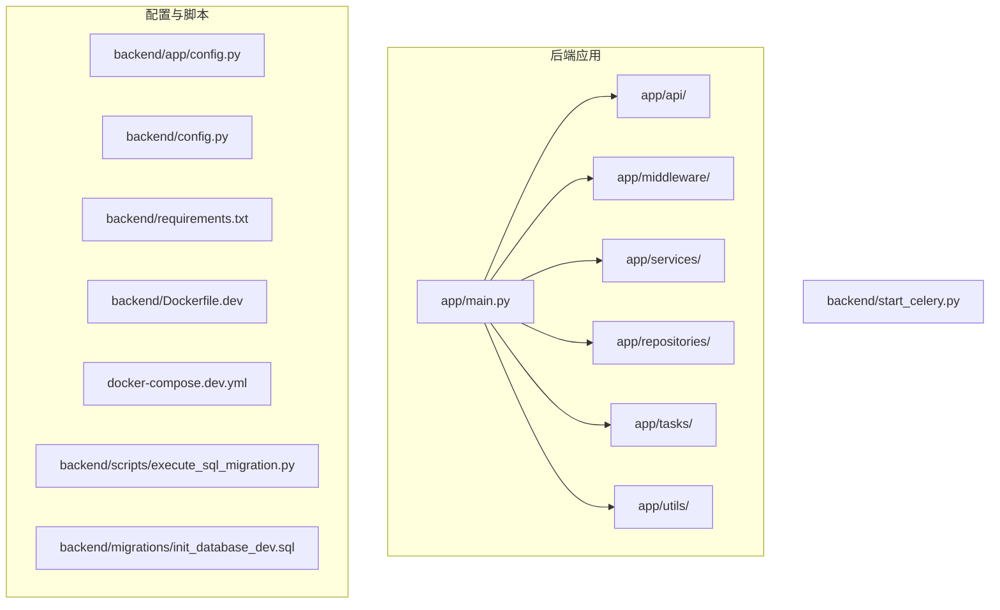
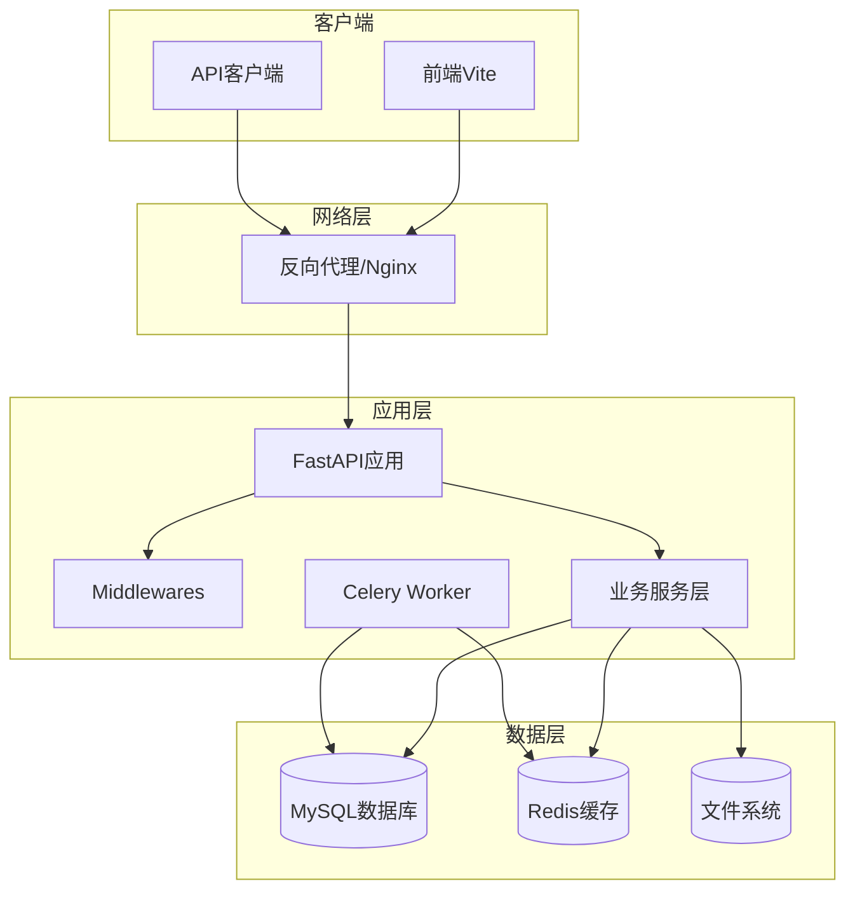
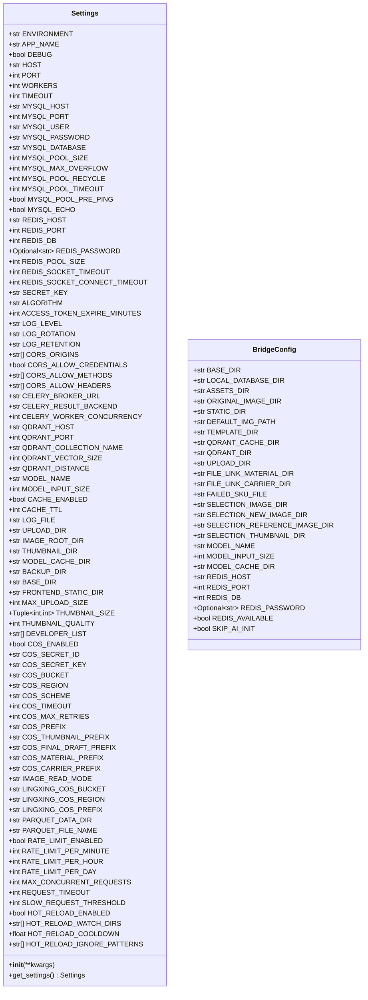
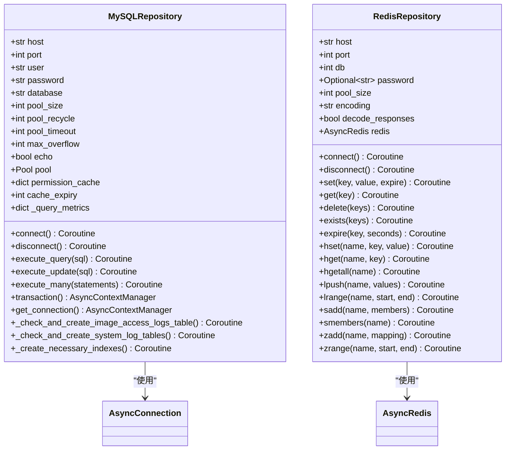
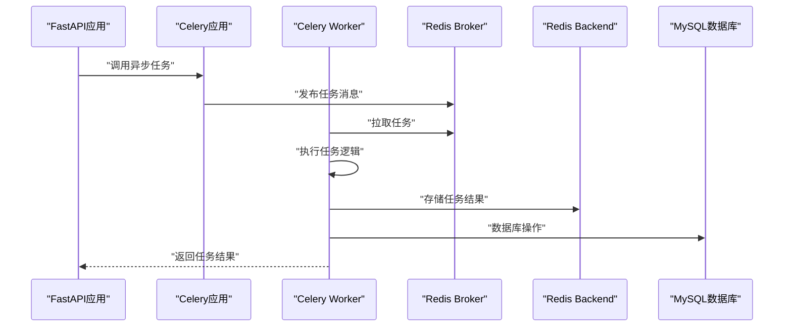
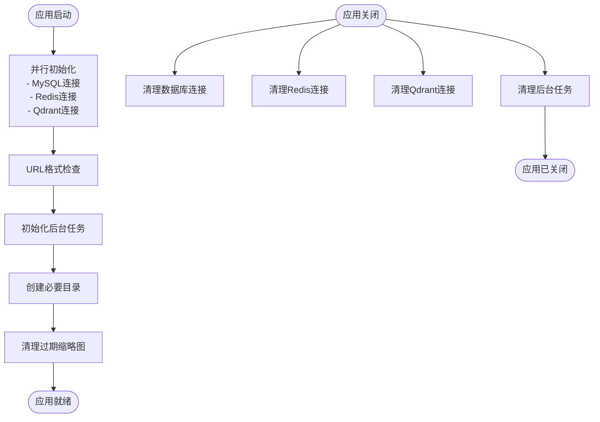

# 后端环境配置

<cite>
**本文档引用的文件**
- [backend/app/config.py](file://backend/app/config.py)
- [backend/config.py](file://backend/config.py)
- [backend/requirements.txt](file://backend/requirements.txt)
- [backend/Dockerfile.dev](file://backend/Dockerfile.dev)
- [backend/start_celery.py](file://backend/start_celery.py)
- [backend/app/main.py](file://backend/app/main.py)
- [backend/app/tasks/celery_app.py](file://backend/app/tasks/celery_app.py)
- [backend/migrations/init_database_dev.sql](file://backend/migrations/init_database_dev.sql)
- [backend/scripts/execute_sql_migration.py](file://backend/scripts/execute_sql_migration.py)
- [docker-compose.dev.yml](file://docker-compose.dev.yml)
- [backend/app/repositories/mysql_repo.py](file://backend/app/repositories/mysql_repo.py)
- [backend/app/repositories/redis_repo.py](file://backend/app/repositories/redis_repo.py)
</cite>

## 目录
1. [简介](#简介)
2. [项目结构](#项目结构)
3. [核心组件](#核心组件)
4. [架构概览](#架构概览)
5. [详细组件分析](#详细组件分析)
6. [依赖关系分析](#依赖关系分析)
7. [性能考虑](#性能考虑)
8. [故障排除指南](#故障排除指南)
9. [结论](#结论)
10. [附录](#附录)

## 简介
本指南面向Python后端开发者，提供基于FastAPI的完整环境配置方案。涵盖Python虚拟环境创建、依赖安装、环境变量配置、配置文件结构解析、本地开发服务器启动、数据库初始化与迁移、测试数据准备、Celery任务队列与Redis缓存配置，以及常见问题排查。

## 项目结构
后端采用模块化组织，核心目录包括：
- app：FastAPI应用主体，包含API路由、中间件、模型、服务、任务等
- migrations：数据库迁移脚本
- scripts：辅助脚本（迁移执行、数据处理等）
- 配置文件：requirements.txt、Dockerfile.dev、docker-compose.dev.yml



**图表来源**
- [backend/app/main.py:1-475](file://backend/app/main.py#L1-L475)
- [backend/app/config.py:1-296](file://backend/app/config.py#L1-L296)
- [backend/requirements.txt:1-35](file://backend/requirements.txt#L1-L35)
- [backend/Dockerfile.dev:1-11](file://backend/Dockerfile.dev#L1-L11)
- [docker-compose.dev.yml:1-224](file://docker-compose.dev.yml#L1-L224)

**章节来源**
- [backend/app/main.py:1-475](file://backend/app/main.py#L1-L475)
- [backend/app/config.py:1-296](file://backend/app/config.py#L1-L296)
- [backend/requirements.txt:1-35](file://backend/requirements.txt#L1-L35)
- [backend/Dockerfile.dev:1-11](file://backend/Dockerfile.dev#L1-L11)
- [docker-compose.dev.yml:1-224](file://docker-compose.dev.yml#L1-L224)

## 核心组件
- 配置系统：集中式Settings类，支持环境变量注入与开发/生产差异化配置
- 数据库连接：MySQLRepository异步连接池，支持事务与性能监控
- 缓存系统：RedisRepository异步连接池，支持多种数据结构与自动序列化
- 任务队列：Celery应用配置，支持任务路由与重试机制
- 中间件：CORS、超时、慢请求、请求大小限制等
- 启动流程：应用生命周期管理，包含并行初始化与资源清理

**章节来源**
- [backend/app/config.py:23-258](file://backend/app/config.py#L23-L258)
- [backend/app/repositories/mysql_repo.py:11-200](file://backend/app/repositories/mysql_repo.py#L11-L200)
- [backend/app/repositories/redis_repo.py:23-200](file://backend/app/repositories/redis_repo.py#L23-L200)
- [backend/app/tasks/celery_app.py:1-55](file://backend/app/tasks/celery_app.py#L1-L55)
- [backend/app/main.py:44-312](file://backend/app/main.py#L44-L312)

## 架构概览
后端采用FastAPI + 异步数据库 + 缓存 + 任务队列的现代架构，通过Docker Compose实现开发环境自包含部署。



**图表来源**
- [backend/app/main.py:314-475](file://backend/app/main.py#L314-L475)
- [docker-compose.dev.yml:40-80](file://docker-compose.dev.yml#L40-L80)

## 详细组件分析

### 配置系统分析
配置系统采用Pydantic Settings，支持环境变量注入与默认值设置。



**图表来源**
- [backend/app/config.py:23-258](file://backend/app/config.py#L23-L258)
- [backend/config.py:1-62](file://backend/config.py#L1-L62)

**章节来源**
- [backend/app/config.py:23-258](file://backend/app/config.py#L23-L258)
- [backend/config.py:1-62](file://backend/config.py#L1-L62)

### 数据库连接分析
MySQLRepository提供异步连接池管理，支持事务与性能监控。



**图表来源**
- [backend/app/repositories/mysql_repo.py:11-200](file://backend/app/repositories/mysql_repo.py#L11-L200)
- [backend/app/repositories/redis_repo.py:23-200](file://backend/app/repositories/redis_repo.py#L23-L200)

**章节来源**
- [backend/app/repositories/mysql_repo.py:11-200](file://backend/app/repositories/mysql_repo.py#L11-L200)
- [backend/app/repositories/redis_repo.py:23-200](file://backend/app/repositories/redis_repo.py#L23-L200)

### Celery任务队列分析
Celery应用配置支持任务路由、重试与并发控制。



**图表来源**
- [backend/app/tasks/celery_app.py:1-55](file://backend/app/tasks/celery_app.py#L1-L55)
- [backend/start_celery.py:1-55](file://backend/start_celery.py#L1-L55)

**章节来源**
- [backend/app/tasks/celery_app.py:1-55](file://backend/app/tasks/celery_app.py#L1-L55)
- [backend/start_celery.py:1-55](file://backend/start_celery.py#L1-L55)

### 中间件与启动流程分析
应用启动时进行并行初始化，包含数据库、缓存、向量数据库连接，并执行URL格式检查与清理任务。



**图表来源**
- [backend/app/main.py:44-312](file://backend/app/main.py#L44-L312)

**章节来源**
- [backend/app/main.py:44-312](file://backend/app/main.py#L44-L312)

## 依赖关系分析
后端依赖主要分为Web框架、数据库、缓存、任务队列、AI相关等类别。

```mermaid
graph TB
subgraph "Web框架"
FA[FastAPI 0.128.0]
UV[Uvicorn 0.40.0]
PYD[Pydantic 2.12.5]
PYS[Pydantic-Settings 2.12.0]
end
subgraph "数据库"
SA[SQLAlchemy]
AM[aiomysql 0.3.2]
DB[(MySQL数据库)]
end
subgraph "缓存"
RD[Redis(asyncio) 7.1.0]
RC[(Redis缓存)]
end
subgraph "任务队列"
CE[Celery 5.6.2]
CW[Celery Worker]
end
subgraph "AI与图像"
NP[Numpy 2.4.1]
PD[Pandas 2.3.3]
PL[Polars 1.7.0]
PP[Pillow 12.1.0]
end
subgraph "其他"
RE[Requests]
CO[COS SDK 1.9.25]
JO[python-dotenv 1.2.1]
OP[OpenPyXL 3.1.5]
end
FA --> UV
FA --> PYD
FA --> PYS
SA --> AM
SA --> DB
RD --> RC
CE --> CW
CE --> RC
CE --> DB
NP --> PD
PD --> PL
PP --> FA
RE --> FA
CO --> FA
```

**图表来源**
- [backend/requirements.txt:1-35](file://backend/requirements.txt#L1-L35)

**章节来源**
- [backend/requirements.txt:1-35](file://backend/requirements.txt#L1-L35)

## 性能考虑
- 连接池配置：MySQL连接池大小、回收时间、超时参数需根据负载调优
- 缓存策略：合理设置缓存TTL与键前缀，避免内存泄漏
- 任务并发：Celery工作进程数与任务路由需平衡系统资源
- 请求限制：速率限制、并发请求数、请求超时参数需按场景调整
- 监控与日志：启用性能监控器，定期检查慢查询与异常

## 故障排除指南

### 环境变量配置问题
- 确认.env文件存在且包含必需变量（如数据库密码、JWT密钥）
- 开发环境应设置ENVIRONMENT=development，生产环境设为production
- 关键变量包括：MYSQL_HOST、MYSQL_PORT、MYSQL_USER、MYSQL_PASSWORD、REDIS_HOST、REDIS_PORT、SECRET_KEY、ACCESS_TOKEN_EXPIRE_MINUTES

**章节来源**
- [backend/app/config.py:12-17](file://backend/app/config.py#L12-L17)
- [backend/app/config.py:30-238](file://backend/app/config.py#L30-L238)

### 数据库连接失败
- 检查MySQL服务状态与端口映射（开发环境默认3307:3306）
- 验证数据库凭据与网络连通性
- 查看应用日志中的连接失败信息

**章节来源**
- [docker-compose.dev.yml:7-25](file://docker-compose.dev.yml#L7-L25)
- [backend/app/repositories/mysql_repo.py:81-116](file://backend/app/repositories/mysql_repo.py#L81-L116)

### Redis连接问题
- 确认Redis容器健康状态
- 检查Redis密码配置（如需认证）
- 验证连接池大小与超时设置

**章节来源**
- [docker-compose.dev.yml:26-39](file://docker-compose.dev.yml#L26-L39)
- [backend/app/repositories/redis_repo.py:72-96](file://backend/app/repositories/redis_repo.py#L72-L96)

### Celery任务队列问题
- 启动Celery Worker：使用start_celery.py脚本
- 检查Broker与Backend连接字符串
- 验证任务路由与并发设置

**章节来源**
- [backend/start_celery.py:1-55](file://backend/start_celery.py#L1-L55)
- [backend/app/tasks/celery_app.py:1-55](file://backend/app/tasks/celery_app.py#L1-L55)

### 数据库初始化与迁移
- 使用提供的SQL脚本初始化开发数据库
- 通过execute_sql_migration.py执行单个迁移脚本
- 确保数据库字符集与排序规则正确

**章节来源**
- [backend/migrations/init_database_dev.sql:1-534](file://backend/migrations/init_database_dev.sql#L1-L534)
- [backend/scripts/execute_sql_migration.py:1-129](file://backend/scripts/execute_sql_migration.py#L1-L129)

### 文件上传与缓存问题
- 检查上传目录权限与磁盘空间
- 验证缩略图生成与缓存清理逻辑
- 确认静态文件挂载配置

**章节来源**
- [backend/app/main.py:213-259](file://backend/app/main.py#L213-L259)

## 结论
本指南提供了基于FastAPI的完整后端开发环境配置方案，涵盖从环境搭建到生产部署的关键环节。通过合理的配置管理、异步连接池、任务队列与缓存策略，能够构建高性能、可扩展的后端服务。建议在开发过程中持续关注性能监控与日志分析，及时发现并解决潜在问题。

## 附录

### 环境变量参考表
- 基础配置：ENVIRONMENT、APP_NAME、DEBUG、HOST、PORT、WORKERS、TIMEOUT
- 数据库：MYSQL_HOST、MYSQL_PORT、MYSQL_USER、MYSQL_PASSWORD、MYSQL_DATABASE、MYSQL_POOL_SIZE、MYSQL_MAX_OVERFLOW、MYSQL_POOL_RECYCLE、MYSQL_POOL_TIMEOUT、MYSQL_POOL_PRE_PING、MYSQL_ECHO
- 缓存：REDIS_HOST、REDIS_PORT、REDIS_DB、REDIS_PASSWORD、REDIS_POOL_SIZE、REDIS_SOCKET_TIMEOUT、REDIS_SOCKET_CONNECT_TIMEOUT
- 安全：SECRET_KEY、ALGORITHM、ACCESS_TOKEN_EXPIRE_MINUTES
- 日志：LOG_LEVEL、LOG_ROTATION、LOG_RETENTION、LOG_FILE
- CORS：CORS_ORIGINS、CORS_ALLOW_CREDENTIALS、CORS_ALLOW_METHODS、CORS_ALLOW_HEADERS
- Celery：CELERY_BROKER_URL、CELERY_RESULT_BACKEND、CELERY_WORKER_CONCURRENCY、CELERY_TASK_SERIALIZER、CELERY_RESULT_SERIALIZER、CELERY_ACCEPT_CONTENT、CELERY_TIMEZONE、CELERY_ENABLE_UTC
- 文件存储：UPLOAD_DIR、IMAGE_ROOT_DIR、THUMBNAIL_DIR、MODEL_CACHE_DIR、BACKUP_DIR、STATIC_DIR、BASE_DIR、FRONTEND_STATIC_DIR
- 业务配置：MAX_UPLOAD_SIZE、THUMBNAIL_SIZE、THUMBNAIL_QUALITY、CACHE_ENABLED、CACHE_TTL、SEARCH_CACHE_TTL、PRODUCT_IMAGES_CACHE_TTL、CACHE_LOCAL_MAXSIZE、CACHE_LOCAL_TTL、CACHE_KEY_PREFIX、CACHE_DEFAULT_TIMEOUT

### 本地开发环境启动步骤
1. 创建Python虚拟环境并激活
2. 安装依赖：pip install -r backend/requirements.txt
3. 创建.env文件并配置环境变量
4. 启动Docker Compose：docker compose -f docker-compose.dev.yml up -d
5. 访问应用：http://localhost:8090
6. 启动Celery Worker：python backend/start_celery.py

### 数据库初始化与迁移
1. 执行数据库初始化脚本
2. 使用execute_sql_migration.py执行特定迁移
3. 准备测试数据（如默认用户、分类、标签）

### 任务队列与缓存配置
1. 启动Redis服务
2. 配置Celery Broker与Backend
3. 设置任务路由与重试策略
4. 配置缓存TTL与键前缀