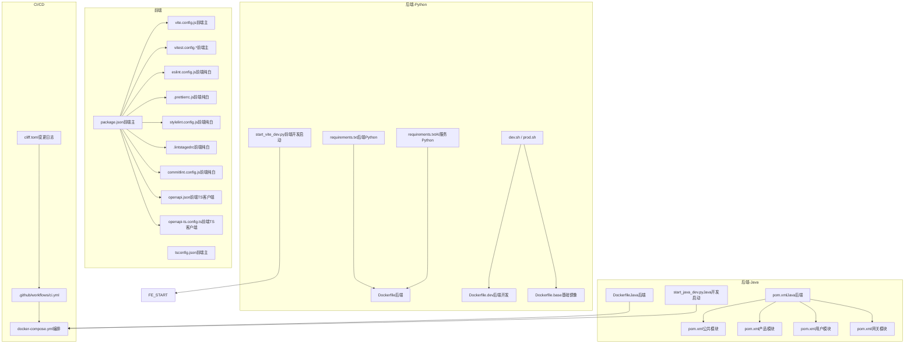
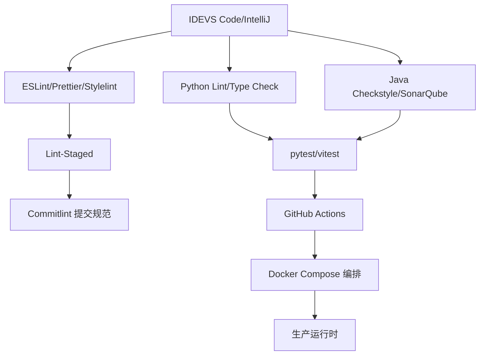
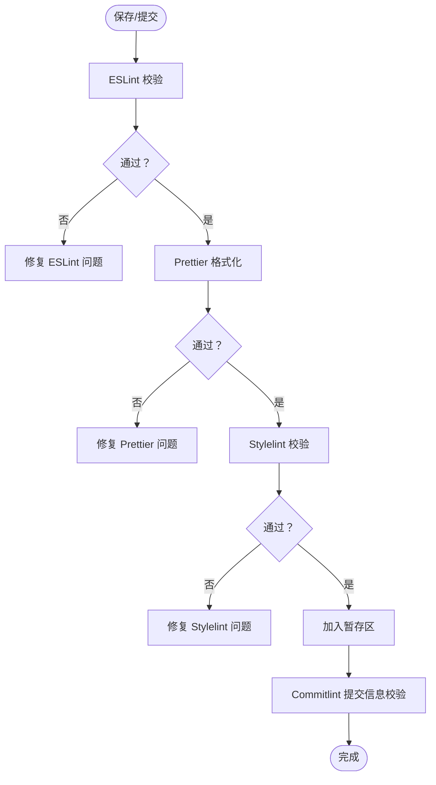
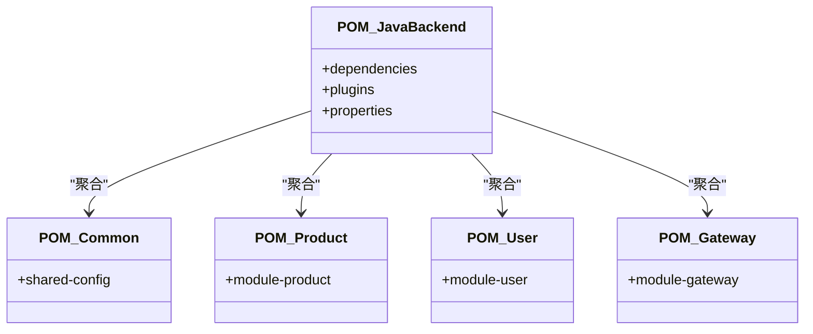
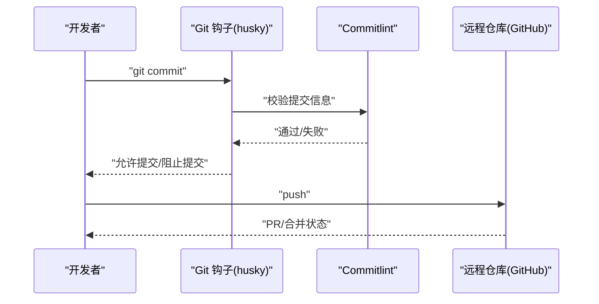
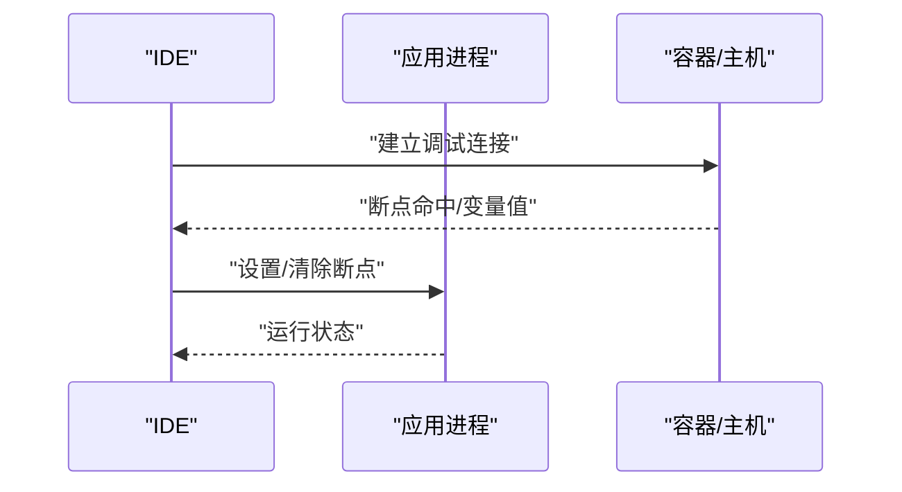
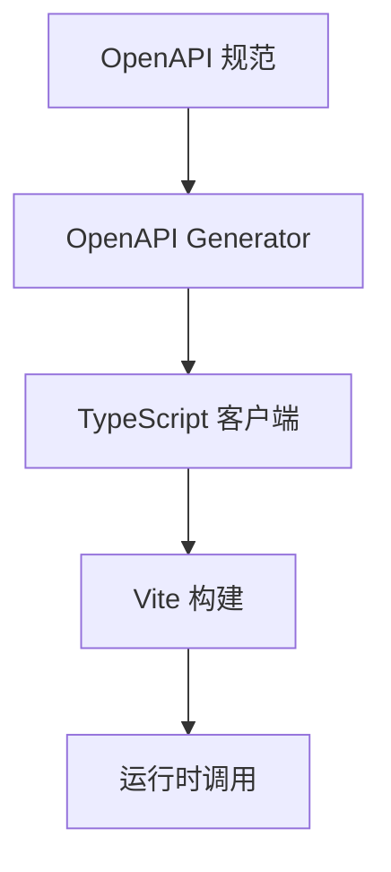
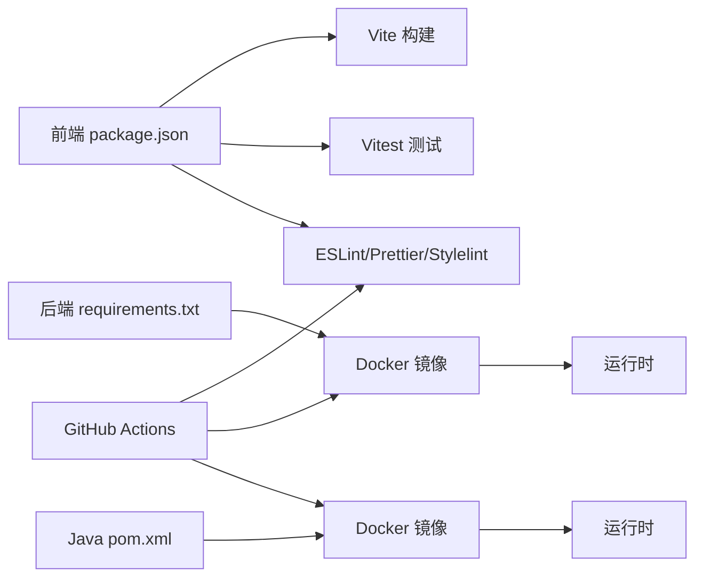

# 开发工具配置

<cite>
**本文引用的文件**
- [ci.yml](file://.github/workflows/ci.yml)
- [package.json（前端主）](file://frontend/package.json)
- [tsconfig.json（前端主）](file://frontend/tsconfig.json)
- [vite.config.js（前端主）](file://frontend/vite.config.js)
- [vitest.config.js（前端主）](file://frontend/vitest.config.js)
- [vitest.config.ts（前端主）](file://frontend/vitest.config.ts)
- [eslint.config.js（前端纯白）](file://frontend/vue-pure-admin/eslint.config.js)
- [prettierrc.js（前端纯白）](file://frontend/vue-pure-admin/.prettierrc.js)
- [stylelint.config.js（前端纯白）](file://frontend/vue-pure-admin/stylelint.config.js)
- [.lintstagedrc（前端纯白）](file://frontend/vue-pure-admin/.lintstagedrc)
- [commitlint.config.js（前端纯白）](file://frontend/vue-pure-admin/commitlint.config.js)
- [tsconfig.json（前端纯白）](file://frontend/vue-pure-admin/tsconfig.json)
- [tsconfig.json（Java后端）](file://java-backend/src/main/resources/application.yml)
- [pom.xml（Java后端）](file://java-backend/pom.xml)
- [pom.xml（公共模块）](file://java-backend/sjzm-common/pom.xml)
- [pom.xml（产品模块）](file://java-backend/sjzm-product/pom.xml)
- [pom.xml（用户模块）](file://java-backend/sjzm-user/pom.xml)
- [pom.xml（网关模块）](file://java-backend/sjzm-gateway/pom.xml)
- [requirements.txt（后端Python）](file://backend/requirements.txt)
- [requirements.txt（AI服务Python）](file://python-ai/requirements.txt)
- [openapi.json（前端TS客户端）](file://frontend/openapi.json)
- [openapi-ts.config.ts（前端TS客户端）](file://frontend/openapi-ts.config.ts)
- [cliff.toml（变更日志）](file://cliff.toml)
- [dev.sh（开发脚本）](file://dev.sh)
- [prod.sh（生产脚本）](file://prod.sh)
- [docker-compose.yml（编排）](file://docker-compose.yml)
- [Dockerfile（后端）](file://backend/Dockerfile)
- [Dockerfile（前端）](file://frontend/Dockerfile)
- [Dockerfile（Java后端）](file://java-backend/Dockerfile)
- [Dockerfile.base（基础镜像）](file://backend/Dockerfile.base)
- [Dockerfile.dev（后端开发）](file://backend/Dockerfile.dev)
- [start_vite_dev.py（前端开发启动）](file://backend/start_vite_dev.py)
- [start_java_dev.py（Java开发启动）](file://backend/start_java_dev.py)
- [misc.xml（IDE配置）](file://scripts/ide/misc.xml)
- [modules.xml（IDE配置）](file://scripts/ide/modules.xml)
- [Project_Default.xml（IDE配置）](file://scripts/ide/inspectionProfiles/Project_Default.xml)
- [profiles_settings.xml（IDE配置）](file://scripts/ide/inspectionProfiles/profiles_settings.xml)
</cite>

## 目录
1. [简介](#简介)
2. [项目结构](#项目结构)
3. [核心组件](#核心组件)
4. [架构总览](#架构总览)
5. [详细组件分析](#详细组件分析)
6. [依赖关系分析](#依赖关系分析)
7. [性能考虑](#性能考虑)
8. [故障排查指南](#故障排查指南)
9. [结论](#结论)
10. [附录](#附录)

## 简介
本指南面向多语言、多框架的复杂工程，覆盖以下主题：
- VS Code、IntelliJ IDEA 等主流IDE的插件推荐与配置要点
- Python 开发的 linting、formatting、type checking 工具配置
- Vue.js + TypeScript 的 ESLint 规则与 Prettier 格式化设置
- Java 开发的代码风格、静态分析与测试工具配置
- Git 钩子、提交规范与代码审查工具的配置
- 调试配置文件、断点设置与远程调试方法
- API 文档生成、代码覆盖率与性能分析工具的集成

本指南以仓库中已存在的配置文件为依据，避免臆造，确保可落地执行。

## 项目结构
该工程采用多模块分层组织：
- 前端：Vue3 + Vite + TypeScript，包含多个子项目（如 vue-pure-admin、vue-admin-better）
- 后端：Python FastAPI 应用，提供API与任务处理
- Java 后端：Spring Boot 微服务，按领域拆分模块
- AI 服务：独立的 Python 服务，与后端交互
- CI/CD：GitHub Actions 工作流与本地/容器化部署脚本

**图表来源**
- [package.json（前端主）](file://frontend/package.json)
- [tsconfig.json（前端主）](file://frontend/tsconfig.json)
- [vite.config.js（前端主）](file://frontend/vite.config.js)
- [vitest.config.js（前端主）](file://frontend/vitest.config.js)
- [vitest.config.ts（前端主）](file://frontend/vitest.config.ts)
- [eslint.config.js（前端纯白）](file://frontend/vue-pure-admin/eslint.config.js)
- [prettierrc.js（前端纯白）](file://frontend/vue-pure-admin/.prettierrc.js)
- [stylelint.config.js（前端纯白）](file://frontend/vue-pure-admin/stylelint.config.js)
- [.lintstagedrc（前端纯白）](file://frontend/vue-pure-admin/.lintstagedrc)
- [commitlint.config.js（前端纯白）](file://frontend/vue-pure-admin/commitlint.config.js)
- [openapi.json（前端TS客户端）](file://frontend/openapi.json)
- [openapi-ts.config.ts（前端TS客户端）](file://frontend/openapi-ts.config.ts)
- [requirements.txt（后端Python）](file://backend/requirements.txt)
- [requirements.txt（AI服务Python）](file://python-ai/requirements.txt)
- [Dockerfile（后端）](file://backend/Dockerfile)
- [Dockerfile.dev（后端开发）](file://backend/Dockerfile.dev)
- [Dockerfile.base（基础镜像）](file://backend/Dockerfile.base)
- [start_vite_dev.py（前端开发启动）](file://backend/start_vite_dev.py)
- [pom.xml（Java后端）](file://java-backend/pom.xml)
- [pom.xml（公共模块）](file://java-backend/sjzm-common/pom.xml)
- [pom.xml（产品模块）](file://java-backend/sjzm-product/pom.xml)
- [pom.xml（用户模块）](file://java-backend/sjzm-user/pom.xml)
- [pom.xml（网关模块）](file://java-backend/sjzm-gateway/pom.xml)
- [Dockerfile（Java后端）](file://java-backend/Dockerfile)
- [start_java_dev.py（Java开发启动）](file://backend/start_java_dev.py)
- [.github/workflows/ci.yml](file://.github/workflows/ci.yml)
- [docker-compose.yml（编排）](file://docker-compose.yml)
- [cliff.toml（变更日志）](file://cliff.toml)

**章节来源**
- [package.json（前端主）](file://frontend/package.json)
- [tsconfig.json（前端主）](file://frontend/tsconfig.json)
- [vite.config.js（前端主）](file://frontend/vite.config.js)
- [vitest.config.js（前端主）](file://frontend/vitest.config.js)
- [vitest.config.ts（前端主）](file://frontend/vitest.config.ts)
- [eslint.config.js（前端纯白）](file://frontend/vue-pure-admin/eslint.config.js)
- [prettierrc.js（前端纯白）](file://frontend/vue-pure-admin/.prettierrc.js)
- [stylelint.config.js（前端纯白）](file://frontend/vue-pure-admin/stylelint.config.js)
- [.lintstagedrc（前端纯白）](file://frontend/vue-pure-admin/.lintstagedrc)
- [commitlint.config.js（前端纯白）](file://frontend/vue-pure-admin/commitlint.config.js)
- [openapi.json（前端TS客户端）](file://frontend/openapi.json)
- [openapi-ts.config.ts（前端TS客户端）](file://frontend/openapi-ts.config.ts)
- [requirements.txt（后端Python）](file://backend/requirements.txt)
- [requirements.txt（AI服务Python）](file://python-ai/requirements.txt)
- [Dockerfile（后端）](file://backend/Dockerfile)
- [Dockerfile.dev（后端开发）](file://backend/Dockerfile.dev)
- [Dockerfile.base（基础镜像）](file://backend/Dockerfile.base)
- [start_vite_dev.py（前端开发启动）](file://backend/start_vite_dev.py)
- [pom.xml（Java后端）](file://java-backend/pom.xml)
- [pom.xml（公共模块）](file://java-backend/sjzm-common/pom.xml)
- [pom.xml（产品模块）](file://java-backend/sjzm-product/pom.xml)
- [pom.xml（用户模块）](file://java-backend/sjzm-user/pom.xml)
- [pom.xml（网关模块）](file://java-backend/sjzm-gateway/pom.xml)
- [Dockerfile（Java后端）](file://java-backend/Dockerfile)
- [start_java_dev.py（Java开发启动）](file://backend/start_java_dev.py)
- [.github/workflows/ci.yml](file://.github/workflows/ci.yml)
- [docker-compose.yml（编排）](file://docker-compose.yml)
- [cliff.toml（变更日志）](file://cliff.toml)

## 核心组件
- 前端构建与测试：Vite + Vitest + TypeScript
- 前端质量工具：ESLint + Prettier + Stylelint + Lint-Staged + Commitlint
- 后端Python：FastAPI + Celery + Docker
- 后端Java：Spring Boot + Maven + Docker
- API 客户端：OpenAPI Generator + TypeScript 客户端
- CI/CD：GitHub Actions + Docker Compose + 变更日志

**章节来源**
- [package.json（前端主）](file://frontend/package.json)
- [tsconfig.json（前端主）](file://frontend/tsconfig.json)
- [vite.config.js（前端主）](file://frontend/vite.config.js)
- [vitest.config.js（前端主）](file://frontend/vitest.config.js)
- [vitest.config.ts（前端主）](file://frontend/vitest.config.ts)
- [eslint.config.js（前端纯白）](file://frontend/vue-pure-admin/eslint.config.js)
- [prettierrc.js（前端纯白）](file://frontend/vue-pure-admin/.prettierrc.js)
- [stylelint.config.js（前端纯白）](file://frontend/vue-pure-admin/stylelint.config.js)
- [.lintstagedrc（前端纯白）](file://frontend/vue-pure-admin/.lintstagedrc)
- [commitlint.config.js（前端纯白）](file://frontend/vue-pure-admin/commitlint.config.js)
- [openapi.json（前端TS客户端）](file://frontend/openapi.json)
- [openapi-ts.config.ts（前端TS客户端）](file://frontend/openapi-ts.config.ts)
- [requirements.txt（后端Python）](file://backend/requirements.txt)
- [requirements.txt（AI服务Python）](file://python-ai/requirements.txt)
- [Dockerfile（后端）](file://backend/Dockerfile)
- [Dockerfile.dev（后端开发）](file://backend/Dockerfile.dev)
- [Dockerfile.base（基础镜像）](file://backend/Dockerfile.base)
- [start_vite_dev.py（前端开发启动）](file://backend/start_vite_dev.py)
- [pom.xml（Java后端）](file://java-backend/pom.xml)
- [pom.xml（公共模块）](file://java-backend/sjzm-common/pom.xml)
- [pom.xml（产品模块）](file://java-backend/sjzm-product/pom.xml)
- [pom.xml（用户模块）](file://java-backend/sjzm-user/pom.xml)
- [pom.xml（网关模块）](file://java-backend/sjzm-gateway/pom.xml)
- [Dockerfile（Java后端）](file://java-backend/Dockerfile)
- [start_java_dev.py（Java开发启动）](file://backend/start_java_dev.py)
- [.github/workflows/ci.yml](file://.github/workflows/ci.yml)
- [docker-compose.yml（编排）](file://docker-compose.yml)
- [cliff.toml（变更日志）](file://cliff.toml)

## 架构总览
下图展示从 IDE 到运行时的关键链路：IDE 插件驱动质量工具，质量工具在本地与 CI 中执行，最终通过 Docker Compose 编排部署。

[此图为概念性总览，无需图表来源]

## 详细组件分析

### VS Code 插件与配置（推荐）
- Python：Python（含 Pylance）、Black、Flake8、isort、pytest
- Vue/TypeScript：Vue Language Features (Volar)、ESLint、Prettier、EditorConfig
- Java：Extension Pack for Java、SonarLint、Checkstyle-to-Go、Spring Boot Extension Pack
- Git：GitLens、Git Graph、GitHub Pull Requests
- Docker：Docker
- YAML/JSON：YAML、JSON Language Features
- 其他：Bracket Pair Colorizer、Path Intellisense、Rainbow CSV

上述插件组合可与仓库中的质量工具配置协同工作，实现“保存即格式化、提交即校验”的开发体验。

[本节为通用实践建议，不直接分析具体文件，故无章节来源]

### IntelliJ IDEA 插件与配置（推荐）
- Java：Spring Assistant、Lombok、MapStruct Support、MyBatis Log、SonarLint、Checkstyle-to-Go
- YAML/JSON/XML：YAML、JSON Tools、XML Formatter
- Docker：Docker
- Git：GitToolBox、GitHub Pull Requests
- 代码质量：SpotBugs、FindBugs-NG、SonarQube Community

配合仓库中的 inspection profiles 与 Maven 配置，可统一团队风格与静态分析标准。

[本节为通用实践建议，不直接分析具体文件，故无章节来源]

### Python 开发：Linting、Formatting、Type Checking
- Linting：flake8、pylint（或 ruff）
- Formatting：black、isort
- Type Checking：mypy
- 集成方式：在 VS Code 中配置任务与保存事件，或在 pre-commit 钩子中执行
- 仓库相关文件：
  - [requirements.txt（后端Python）](file://backend/requirements.txt)
  - [requirements.txt（AI服务Python）](file://python-ai/requirements.txt)

建议在项目根目录添加 .flake8、pyproject.toml 或 ruff 配置文件，并在 IDE 中绑定保存事件执行 black/isort/mypy。

**章节来源**
- [requirements.txt（后端Python）](file://backend/requirements.txt)
- [requirements.txt（AI服务Python）](file://python-ai/requirements.txt)

### Vue.js + TypeScript：ESLint、Prettier、Stylelint
- ESLint：基于 [eslint.config.js（前端纯白）](file://frontend/vue-pure-admin/eslint.config.js)，启用 Vue 3 + TypeScript 支持
- Prettier：基于 [prettierrc.js（前端纯白）](file://frontend/vue-pure-admin/.prettierrc.js)，与 ESLint 冲突时以 Prettier 为准
- Stylelint：基于 [stylelint.config.js（前端纯白）](file://frontend/vue-pure-admin/stylelint.config.js)，用于样式文件
- Lint-Staged：基于 [.lintstagedrc（前端纯白）](file://frontend/vue-pure-admin/.lintstagedrc)，仅对暂存区文件执行
- 提交规范：基于 [commitlint.config.js（前端纯白）](file://frontend/vue-pure-admin/commitlint.config.js)，结合 husky 使用
- TypeScript：基于 [tsconfig.json（前端主）](file://frontend/tsconfig.json) 与 [tsconfig.json（前端纯白）](file://frontend/vue-pure-admin/tsconfig.json)

**图表来源**
- [eslint.config.js（前端纯白）](file://frontend/vue-pure-admin/eslint.config.js)
- [prettierrc.js（前端纯白）](file://frontend/vue-pure-admin/.prettierrc.js)
- [stylelint.config.js（前端纯白）](file://frontend/vue-pure-admin/stylelint.config.js)
- [.lintstagedrc（前端纯白）](file://frontend/vue-pure-admin/.lintstagedrc)
- [commitlint.config.js（前端纯白）](file://frontend/vue-pure-admin/commitlint.config.js)

**章节来源**
- [eslint.config.js（前端纯白）](file://frontend/vue-pure-admin/eslint.config.js)
- [prettierrc.js（前端纯白）](file://frontend/vue-pure-admin/.prettierrc.js)
- [stylelint.config.js（前端纯白）](file://frontend/vue-pure-admin/stylelint.config.js)
- [.lintstagedrc（前端纯白）](file://frontend/vue-pure-admin/.lintstagedrc)
- [commitlint.config.js（前端纯白）](file://frontend/vue-pure-admin/commitlint.config.js)
- [tsconfig.json（前端主）](file://frontend/tsconfig.json)
- [tsconfig.json（前端纯白）](file://frontend/vue-pure-admin/tsconfig.json)

### Java 开发：代码风格、静态分析与测试
- 代码风格：Checkstyle（与 Maven 插件集成），或 Google Java Format
- 静态分析：SonarLint（IDE 插件）+ SonarQube（CI）
- 测试：JUnit 5 + Spring Boot Test（Maven 配置）
- Maven 配置：见各模块 pom.xml，统一版本与插件策略
- 运行与调试：通过 Spring Boot 插件或 IDE 启动类进行本地调试

**图表来源**
- [pom.xml（Java后端）](file://java-backend/pom.xml)
- [pom.xml（公共模块）](file://java-backend/sjzm-common/pom.xml)
- [pom.xml（产品模块）](file://java-backend/sjzm-product/pom.xml)
- [pom.xml（用户模块）](file://java-backend/sjzm-user/pom.xml)
- [pom.xml（网关模块）](file://java-backend/sjzm-gateway/pom.xml)

**章节来源**
- [pom.xml（Java后端）](file://java-backend/pom.xml)
- [pom.xml（公共模块）](file://java-backend/sjzm-common/pom.xml)
- [pom.xml（产品模块）](file://java-backend/sjzm-product/pom.xml)
- [pom.xml（用户模块）](file://java-backend/sjzm-user/pom.xml)
- [pom.xml（网关模块）](file://java-backend/sjzm-gateway/pom.xml)

### Git 钩子、提交规范与代码审查
- 提交规范：基于 [commitlint.config.js（前端纯白）](file://frontend/vue-pure-admin/commitlint.config.js)，建议配合 husky 使用
- 代码审查：建议在 GitHub 上开启 PR 审查与状态检查，结合 CI 工作流
- 变更日志：基于 [cliff.toml（变更日志）](file://cliff.toml)，自动生成 CHANGELOG

**图表来源**
- [commitlint.config.js（前端纯白）](file://frontend/vue-pure-admin/commitlint.config.js)
- [cliff.toml（变更日志）](file://cliff.toml)

**章节来源**
- [commitlint.config.js（前端纯白）](file://frontend/vue-pure-admin/commitlint.config.js)
- [cliff.toml（变更日志）](file://cliff.toml)

### 调试配置文件、断点设置与远程调试
- 前端调试：Vite 配置支持 source map；在浏览器开发者工具中设置断点
- 后端Python：使用 IDE 的 Flask/FastAPI 调试配置，或命令行参数启动
- 后端Java：通过 Spring Boot 插件或 IDE 的 Remote JVM Debug 启动
- 远程调试：在容器环境中暴露调试端口，使用 IDE 远程连接

[本图为通用流程示意，无需图表来源]

**章节来源**
- [vite.config.js（前端主）](file://frontend/vite.config.js)
- [start_vite_dev.py（前端开发启动）](file://backend/start_vite_dev.py)
- [start_java_dev.py（Java开发启动）](file://backend/start_java_dev.py)

### API 文档生成、代码覆盖率与性能分析
- API 文档：前端 TS 客户端通过 [openapi.json（前端TS客户端）](file://frontend/openapi.json) 与 [openapi-ts.config.ts（前端TS客户端）](file://frontend/openapi-ts.config.ts) 生成
- 代码覆盖率：前端可使用 Vitest 的覆盖率选项；后端 Python 可使用 pytest-cov
- 性能分析：前端使用浏览器性能面板；后端 Java 使用 JProfiler/Async Profiler；Python 使用 cProfile/yep

**图表来源**
- [openapi.json（前端TS客户端）](file://frontend/openapi.json)
- [openapi-ts.config.ts（前端TS客户端）](file://frontend/openapi-ts.config.ts)

**章节来源**
- [openapi.json（前端TS客户端）](file://frontend/openapi.json)
- [openapi-ts.config.ts（前端TS客户端）](file://frontend/openapi-ts.config.ts)

## 依赖关系分析
- 前端：package.json 管理依赖与脚本；Vite 作为构建工具；ESLint/Prettier/Stylelint 统一质量标准
- 后端Python：requirements.txt 管理依赖；Dockerfile 定义镜像；dev.sh/prod.sh 控制启动
- 后端Java：pom.xml 管理模块与插件；Dockerfile 定义镜像；docker-compose.yml 编排
- CI/CD：GitHub Actions 工作流与 Docker Compose 协同

**图表来源**
- [package.json（前端主）](file://frontend/package.json)
- [vite.config.js（前端主）](file://frontend/vite.config.js)
- [vitest.config.js（前端主）](file://frontend/vitest.config.js)
- [requirements.txt（后端Python）](file://backend/requirements.txt)
- [Dockerfile（后端）](file://backend/Dockerfile)
- [pom.xml（Java后端）](file://java-backend/pom.xml)
- [Dockerfile（Java后端）](file://java-backend/Dockerfile)
- [.github/workflows/ci.yml](file://.github/workflows/ci.yml)

**章节来源**
- [package.json（前端主）](file://frontend/package.json)
- [vite.config.js（前端主）](file://frontend/vite.config.js)
- [vitest.config.js（前端主）](file://frontend/vitest.config.js)
- [requirements.txt（后端Python）](file://backend/requirements.txt)
- [Dockerfile（后端）](file://backend/Dockerfile)
- [pom.xml（Java后端）](file://java-backend/pom.xml)
- [Dockerfile（Java后端）](file://java-backend/Dockerfile)
- [.github/workflows/ci.yml](file://.github/workflows/ci.yml)

## 性能考虑
- 前端：启用 Vite 的按需加载与 Tree Shaking；合理拆分包；使用浏览器性能面板定位瓶颈
- 后端Python：使用异步任务（Celery）与缓存（Redis）；数据库索引与查询优化
- 后端Java：合理线程池与连接池配置；启用 JVM 分析工具；微服务拆分降低单实例压力
- CI：并行化任务、缓存依赖、减少镜像层数

[本节提供通用指导，不直接分析具体文件，故无章节来源]

## 故障排查指南
- 前端构建失败：检查 Vite 配置与依赖版本；查看控制台错误与网络面板
- Python 依赖冲突：核对 requirements.txt；使用虚拟环境隔离
- Java 启动异常：检查 application.yml 配置；确认端口占用与依赖服务可用
- Docker 启动失败：查看容器日志；确认卷挂载与网络配置
- CI 失败：查看工作流日志；确认缓存与环境变量

**章节来源**
- [docker-compose.yml（编排）](file://docker-compose.yml)
- [.github/workflows/ci.yml](file://.github/workflows/ci.yml)

## 结论
本指南基于仓库现有配置文件，给出了多语言、多框架的开发工具配置路径。建议团队在 IDE 中统一安装推荐插件，并将质量工具与 CI 工作流打通，形成“保存即格式化、提交即校验、推送即构建”的高效开发闭环。

[本节为总结性内容，不直接分析具体文件，故无章节来源]

## 附录
- IDE 配置文件参考：
  - [misc.xml（IDE配置）](file://scripts/ide/misc.xml)
  - [modules.xml（IDE配置）](file://scripts/ide/modules.xml)
  - [Project_Default.xml（IDE配置）](file://scripts/ide/inspectionProfiles/Project_Default.xml)
  - [profiles_settings.xml（IDE配置）](file://scripts/ide/inspectionProfiles/profiles_settings.xml)
- 启动与运维脚本：
  - [dev.sh（开发脚本）](file://dev.sh)
  - [prod.sh（生产脚本）](file://prod.sh)
- Docker 配置：
  - [Dockerfile（后端）](file://backend/Dockerfile)
  - [Dockerfile（前端）](file://frontend/Dockerfile)
  - [Dockerfile（Java后端）](file://java-backend/Dockerfile)
  - [Dockerfile.base（基础镜像）](file://backend/Dockerfile.base)
  - [Dockerfile.dev（后端开发）](file://backend/Dockerfile.dev)
  - [docker-compose.yml（编排）](file://docker-compose.yml)

**章节来源**
- [misc.xml（IDE配置）](file://scripts/ide/misc.xml)
- [modules.xml（IDE配置）](file://scripts/ide/modules.xml)
- [Project_Default.xml（IDE配置）](file://scripts/ide/inspectionProfiles/Project_Default.xml)
- [profiles_settings.xml（IDE配置）](file://scripts/ide/inspectionProfiles/profiles_settings.xml)
- [dev.sh（开发脚本）](file://dev.sh)
- [prod.sh（生产脚本）](file://prod.sh)
- [Dockerfile（后端）](file://backend/Dockerfile)
- [Dockerfile（前端）](file://frontend/Dockerfile)
- [Dockerfile（Java后端）](file://java-backend/Dockerfile)
- [Dockerfile.base（基础镜像）](file://backend/Dockerfile.base)
- [Dockerfile.dev（后端开发）](file://backend/Dockerfile.dev)
- [docker-compose.yml（编排）](file://docker-compose.yml)