# 开发环境搭建

<cite>
**本文引用的文件**
- [README.md](file://README.md)
- [docker-compose.yml](file://docker-compose.yml)
- [docker-compose.dev.yml](file://docker-compose.dev.yml)
- [backend/Dockerfile.dev](file://backend/Dockerfile.dev)
- [frontend/Dockerfile](file://frontend/Dockerfile)
- [java-backend/Dockerfile](file://java-backend/Dockerfile)
- [backend/requirements.txt](file://backend/requirements.txt)
- [.env.example](file://.env.example)
- [backend/config.py](file://backend/config.py)
- [frontend/package.json](file://frontend/package.json)
- [java-backend/src/main/resources/application.yml](file://java-backend/src/main/resources/application.yml)
- [python-ai/requirements.txt](file://python-ai/requirements.txt)
- [mysql/init/01-init.sql](file://mysql/init/01-init.sql)
- [scripts/environment/setup_dev_environment.py](file://scripts/environment/setup_dev_environment.py)
- [dev.sh](file://dev.sh)
- [dev.bat](file://dev.bat)
- [init-db.ps1](file://init-db.ps1)
- [init-db.bat](file://init-db.bat)
</cite>

## 目录
1. [简介](#简介)
2. [系统要求](#系统要求)
3. [项目结构](#项目结构)
4. [核心组件](#核心组件)
5. [架构概览](#架构概览)
6. [详细组件分析](#详细组件分析)
7. [依赖分析](#依赖分析)
8. [性能考虑](#性能考虑)
9. [故障排除指南](#故障排除指南)
10. [结论](#结论)
11. [附录](#附录)

## 简介
本指南面向新加入的开发者，帮助您快速搭建思觉智贸项目的开发环境。项目采用多语言混合架构：后端使用 Python FastAPI，前端基于 Vue3 + TypeScript，Java 微服务使用 Spring Boot，AI 服务独立运行。我们提供两种环境搭建方式：纯本地开发环境和 Docker 容器化开发环境。无论选择哪种方式，都能获得一致的开发体验和完整的功能支持。

## 系统要求
在开始之前，请确保您的开发机器满足以下最低要求：

### 硬件要求
- CPU：Intel i5 或同等 AMD 处理器
- 内存：16GB RAM（推荐 32GB）
- 存储：至少 50GB 可用空间
- 网络：稳定的互联网连接

### 软件要求
- **操作系统**：Windows 10/11、macOS 10.15+ 或 Ubuntu 18.04+
- **Docker Desktop**：版本 4.0+（推荐使用 Docker Desktop）
- **Git**：版本 2.0+
- **Node.js**：版本 18.x 或 20.x
- **Python**：版本 3.9+
- **JDK**：版本 21（Eclipse Temurin）
- **MySQL**：版本 8.0+（可选，用于本地直连）

### 开发工具
- **IDE**：Visual Studio Code 或 WebStorm
- **浏览器**：Chrome 最新版
- **数据库工具**：MySQL Workbench 或 DBeaver
- **API 测试**：Postman 或 Insomnia

## 项目结构
项目采用多模块架构，每个技术栈都有独立的开发环境配置：

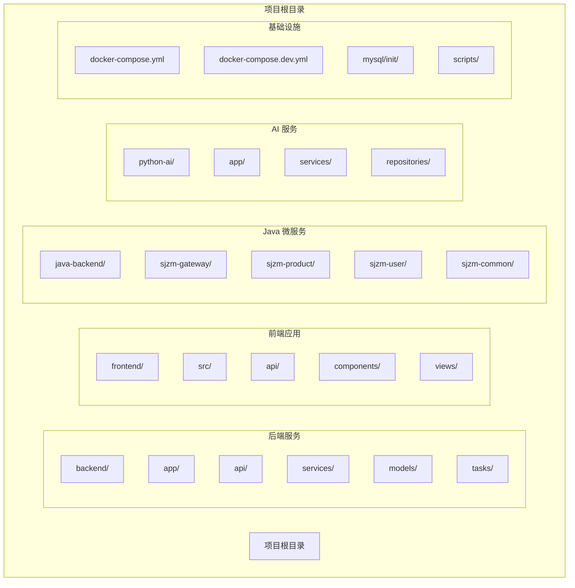

**图表来源**
- [docker-compose.yml:1-36](file://docker-compose.yml#L1-L36)
- [docker-compose.dev.yml:1-224](file://docker-compose.dev.yml#L1-L224)

## 核心组件
项目包含四个主要组件，每个都有独立的开发环境配置：

### 后端服务（Python FastAPI）
- **技术栈**：FastAPI 0.128.0 + SQLAlchemy + Celery
- **数据库**：MySQL 8.0 + Redis 7.0 + Qdrant 向量数据库
- **AI 功能**：集成百度和腾讯图像识别服务
- **文件存储**：支持本地存储和腾讯云 COS

### 前端应用（Vue3 + TypeScript）
- **框架**：Vue 3.5 + TypeScript + Vite
- **UI 组件**：Element Plus + 自定义组件库
- **状态管理**：Pinia
- **路由**：Vue Router 4.0

### Java 微服务
- **网关服务**：Spring Cloud Gateway
- **用户服务**：用户管理、权限控制
- **产品服务**：商品数据管理、选品分析
- **注册中心**：Nacos 2.3.1

### AI 服务
- **向量检索**：Qdrant 向量数据库
- **模型缓存**：本地模型文件缓存
- **图像分析**：集成第三方 AI 服务

**章节来源**
- [README.md:103-109](file://README.md#L103-L109)
- [backend/requirements.txt:1-35](file://backend/requirements.txt#L1-L35)

## 架构概览
开发环境采用容器化架构，所有服务通过 Docker Compose 统一管理：

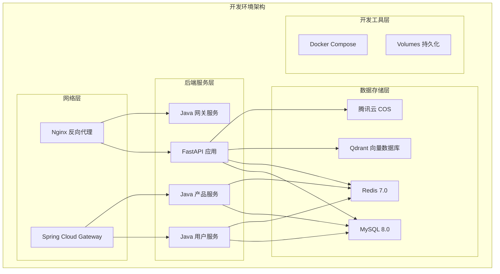

**图表来源**
- [docker-compose.dev.yml:40-200](file://docker-compose.dev.yml#L40-L200)
- [docker-compose.yml:7-36](file://docker-compose.yml#L7-L36)

## 详细组件分析

### Docker 容器化开发环境

#### 基础服务配置
开发环境使用 Docker Compose 管理多个服务，每个服务都有独立的配置文件：

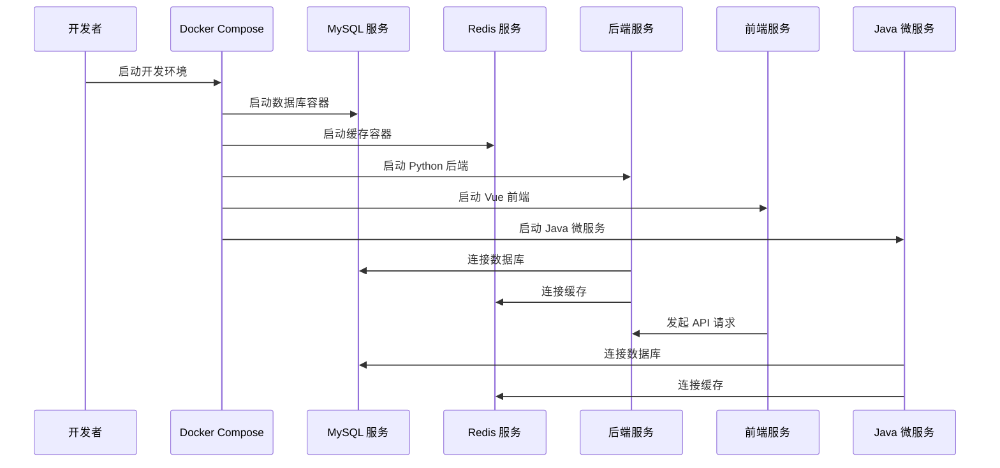

**图表来源**
- [docker-compose.dev.yml:40-200](file://docker-compose.dev.yml#L40-L200)

#### 环境变量配置
开发环境使用 .env.example 作为模板，需要复制为 .env 并修改敏感信息：

| 环境变量 | 默认值 | 用途 |
|---------|--------|------|
| MYSQL_PASSWORD | sijue123456 | MySQL 数据库密码 |
| MYSQL_DATABASE | sijuelishi | 数据库名称 |
| SECRET_KEY | your-secret-key | JWT 签名密钥 |
| COS_ENABLED | false | 是否启用腾讯云 COS |
| COS_SECRET_ID | xxx | 腾讯云 SecretId |
| COS_SECRET_KEY | xxx | 腾讯云 SecretKey |
| COS_BUCKET | xxx | COS 存储桶 |

**章节来源**
- [README.md:58-73](file://README.md#L58-L73)
- [.env.example](file://.env.example)

#### 端口映射配置
开发环境的服务端口映射如下：

| 服务 | 容器端口 | 主机端口 | 用途 |
|------|----------|----------|------|
| MySQL | 3306 | 3307 | 数据库服务 |
| Redis | 6379 | 6379 | 缓存服务 |
| Backend | 8090 | 8090 | Python 后端 API |
| Frontend | 8179 | 8179 | Vue 前端开发服务器 |
| Java User | 8001 | 8001 | 用户服务 |
| Java Product | 8002 | 8002 | 产品服务 |
| Gateway | 9000 | 9000 | Spring Cloud 网关 |
| Nacos | 8848 | 8848 | 注册中心 |

**章节来源**
- [docker-compose.dev.yml:11-24](file://docker-compose.dev.yml#L11-L24)
- [docker-compose.dev.yml:62-101](file://docker-compose.dev.yml#L62-L101)

### Python 后端开发环境

#### 依赖安装
后端使用 requirements.txt 管理依赖，主要组件包括：

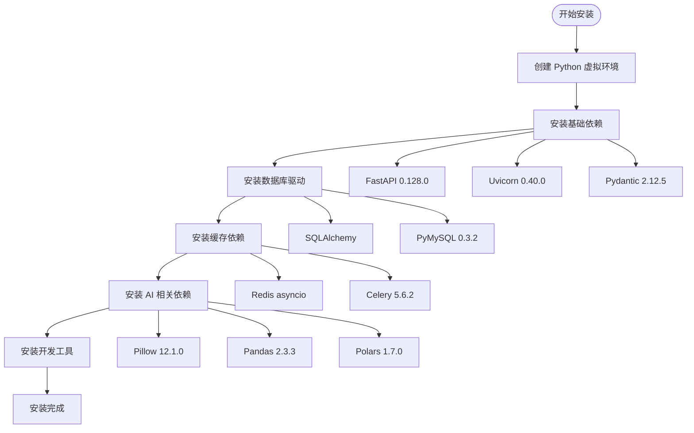

**图表来源**
- [backend/requirements.txt:1-35](file://backend/requirements.txt#L1-L35)

#### 开发服务器配置
后端使用 Uvicorn 提供热重载开发服务器：

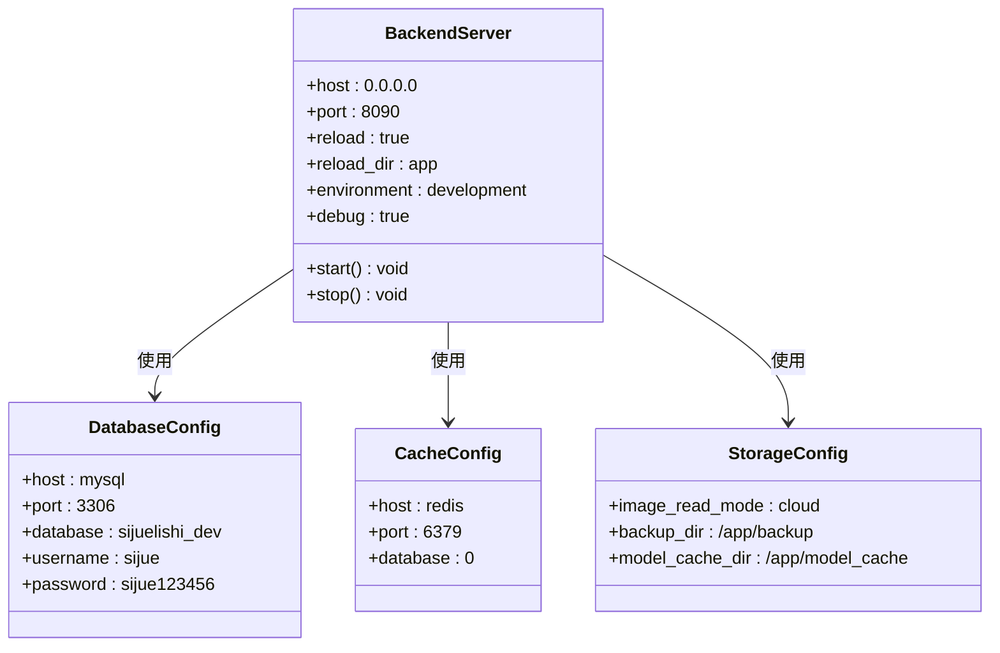

**图表来源**
- [backend/Dockerfile.dev:10-11](file://backend/Dockerfile.dev#L10-L11)
- [docker-compose.dev.yml:48-74](file://docker-compose.dev.yml#L48-L74)

**章节来源**
- [backend/Dockerfile.dev:1-11](file://backend/Dockerfile.dev#L1-L11)
- [backend/requirements.txt:1-35](file://backend/requirements.txt#L1-L35)

### Vue.js 前端开发环境

#### 项目配置
前端使用 Vite 作为构建工具，支持热重载开发：

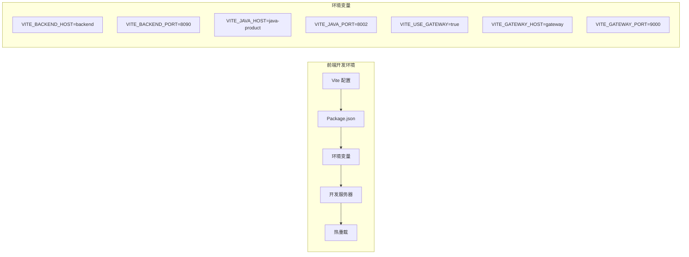

**图表来源**
- [docker-compose.dev.yml:85-94](file://docker-compose.dev.yml#L85-L94)

#### 开发服务器启动
前端开发服务器配置如下：

| 配置项 | 值 | 说明 |
|--------|----|------|
| 主机地址 | 0.0.0.0 | 允许外部访问 |
| 端口号 | 8179 | 与 Docker 映射端口一致 |
| 严格端口 | true | 防止端口冲突 |
| 最大内存 | 2048MB | 防止内存溢出 |
| 后端代理 | 启用 | 通过网关访问后端 API |

**章节来源**
- [docker-compose.dev.yml:81-101](file://docker-compose.dev.yml#L81-L101)
- [frontend/package.json](file://frontend/package.json)

### Java 微服务开发环境

#### 多模块构建
Java 微服务采用多模块架构，使用 Maven 管理依赖：

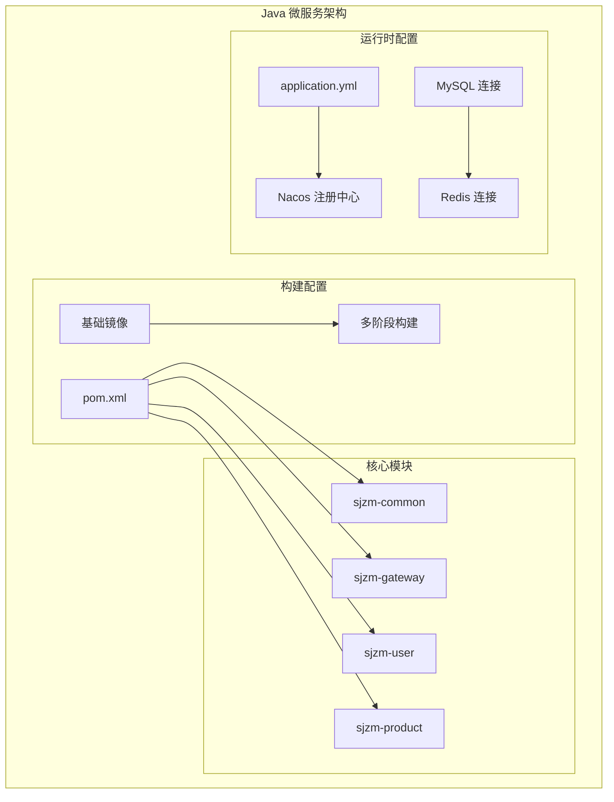

**图表来源**
- [java-backend/Dockerfile:1-40](file://java-backend/Dockerfile#L1-L40)
- [java-backend/pom.xml](file://java-backend/pom.xml)

#### 服务启动配置
Java 微服务支持多种启动模式：

| 服务 | 端口 | 环境变量 | 启动参数 |
|------|------|----------|----------|
| 用户服务 | 8001 | JAVA_USER | -Dspring.profiles.active=dev |
| 产品服务 | 8002 | JAVA_PRODUCT | -Dspring.profiles.active=dev |
| 网关服务 | 9000 | GATEWAY | -Dspring.profiles.active=dev |
| Nacos | 8848 | NACOS_SERVER | standalone 模式 |

**章节来源**
- [docker-compose.dev.yml:107-200](file://docker-compose.dev.yml#L107-L200)
- [java-backend/src/main/resources/application.yml](file://java-backend/src/main/resources/application.yml)

### AI 服务开发环境

#### 独立部署
AI 服务作为独立的 Python 应用运行：

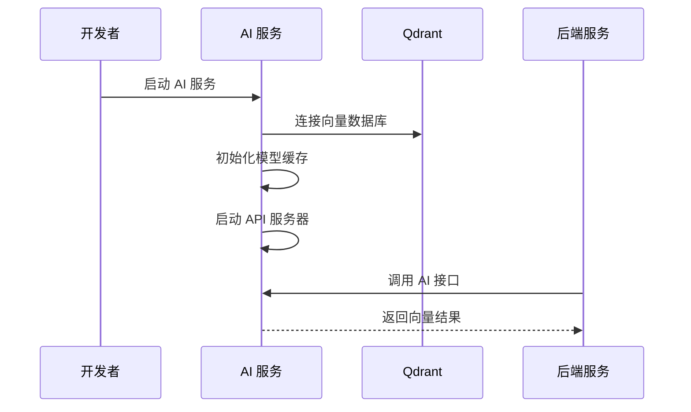

**图表来源**
- [python-ai/requirements.txt](file://python-ai/requirements.txt)

#### 依赖配置
AI 服务主要依赖向量检索和模型处理：

| 依赖包 | 版本 | 用途 |
|--------|------|------|
| qdrant-client | 最新 | 向量数据库客户端 |
| numpy | 2.4.1 | 数值计算 |
| pandas | 2.3.3 | 数据处理 |
| polars | 1.7.0 | 高性能数据处理 |
| pillow | 12.1.0 | 图像处理 |

**章节来源**
- [python-ai/requirements.txt](file://python-ai/requirements.txt)

## 依赖分析

### 容器间依赖关系
开发环境中的服务依赖关系如下：

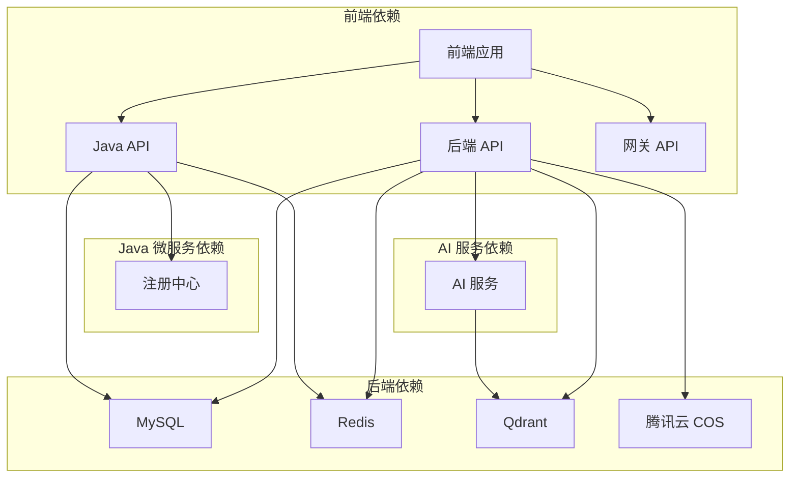

**图表来源**
- [docker-compose.dev.yml:75-165](file://docker-compose.dev.yml#L75-L165)

### 数据库初始化
开发环境提供完整的数据库初始化脚本：

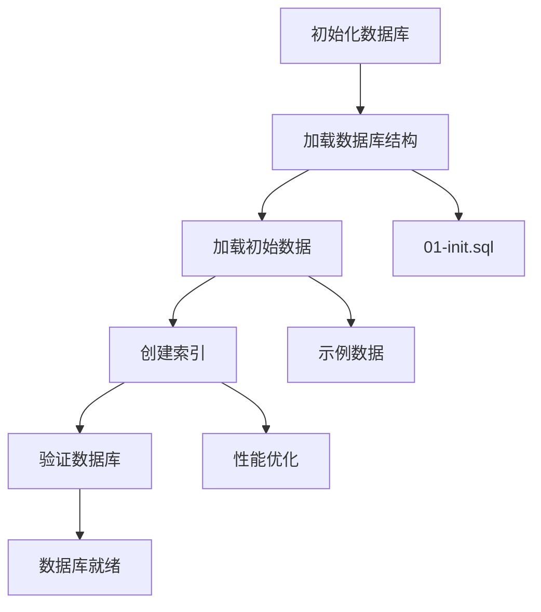

**图表来源**
- [mysql/init/01-init.sql](file://mysql/init/01-init.sql)

**章节来源**
- [docker-compose.dev.yml:1-224](file://docker-compose.dev.yml#L1-L224)
- [mysql/init/01-init.sql](file://mysql/init/01-init.sql)

## 性能考虑
开发环境的性能优化策略：

### 内存配置
- **前端开发服务器**：最大内存 2048MB
- **Java 微服务**：用户服务 1024MB，产品服务 1024MB，网关服务 256MB
- **Python 后端**：根据需求调整 Uvicorn workers 数量

### 缓存策略
- **Redis 缓存**：使用连接池提高性能
- **模型缓存**：AI 服务本地模型缓存
- **图片缓存**：缩略图本地缓存

### 数据库优化
- **连接池**：配置合适的连接数
- **索引优化**：为常用查询字段创建索引
- **查询优化**：使用分页和限制返回数量

## 故障排除指南

### 常见启动问题

#### Docker 容器无法启动
1. **检查端口占用**
   ```bash
   # 检查端口使用情况
   netstat -ano | findstr :8090
   netstat -ano | findstr :8179
   netstat -ano | findstr :8001
   netstat -ano | findstr :8002
   netstat -ano | findstr :9000
   ```

2. **查看容器日志**
   ```bash
   docker compose logs -f
   docker compose logs backend
   docker compose logs frontend
   ```

3. **重启特定服务**
   ```bash
   docker compose stop backend
   docker compose start backend
   ```

#### 数据库连接失败
1. **检查数据库状态**
   ```bash
   docker compose exec mysql mysqladmin ping
   ```

2. **验证连接参数**
   - 主机：mysql
   - 端口：3306
   - 数据库：sijuelishi_dev
   - 用户：sijue
   - 密码：sijue123456

3. **重新初始化数据库**
   ```bash
   docker compose exec mysql mysql -u sijue -p sijuelishi_dev < mysql/init/01-init.sql
   ```

#### 前端热重载失效
1. **检查 Vite 配置**
   ```bash
   # 确认开发服务器正在运行
   docker compose exec frontend ps aux | grep vite
   ```

2. **清除缓存**
   ```bash
   docker compose exec frontend rm -rf node_modules/.vite
   ```

3. **重启前端服务**
   ```bash
   docker compose stop frontend
   docker compose start frontend
   ```

#### Java 微服务启动失败
1. **检查 Maven 依赖**
   ```bash
   docker compose exec java-product mvn dependency:resolve
   ```

2. **查看服务日志**
   ```bash
   docker compose logs java-product
   docker compose logs gateway
   ```

3. **检查 Nacos 状态**
   ```bash
   docker compose exec nacos curl http://localhost:8848/nacos
   ```

### 环境变量问题
1. **复制环境变量模板**
   ```bash
   cp .env.example .env
   ```

2. **修改敏感信息**
   - 修改 SECRET_KEY 为随机字符串
   - 设置真实的数据库密码
   - 如需使用 COS，填写真实密钥

3. **验证环境变量**
   ```bash
   docker compose exec backend printenv | grep -E "(SECRET|MYSQL|COS)"
   ```

### 网络连接问题
1. **检查 Docker 网络**
   ```bash
   docker network ls
   docker network inspect bridge
   ```

2. **验证服务可达性**
   ```bash
   # 测试后端 API
   curl http://localhost:8090/health
   
   # 测试 Java 服务
   curl http://localhost:8001/user/health
   curl http://localhost:8002/product/health
   
   # 测试网关
   curl http://localhost:9000/gateway/health
   ```

3. **检查 DNS 解析**
   ```bash
   docker compose exec backend nslookup mysql
   docker compose exec backend nslookup redis
   ```

### 性能问题诊断
1. **监控资源使用**
   ```bash
   # 查看容器资源使用
   docker stats
   
   # 查看系统资源
   top
   ```

2. **优化内存配置**
   ```bash
   # 调整前端内存限制
   export NODE_OPTIONS="--max-old-space-size=4096"
   
   # 重启前端服务
   docker compose restart frontend
   ```

3. **检查数据库性能**
   ```bash
   docker compose exec mysql mysql -u sijue -p -e "SHOW PROCESSLIST"
   docker compose exec mysql mysql -u sijue -p -e "SHOW ENGINE INNODB STATUS\G"
   ```

**章节来源**
- [README.md:75-92](file://README.md#L75-L92)
- [docker-compose.dev.yml:1-224](file://docker-compose.dev.yml#L1-L224)

## 结论
通过本指南，您应该能够成功搭建思觉智贸项目的开发环境。项目提供了两种开发方式：纯本地开发和 Docker 容器化开发。Docker 方案更加标准化，适合团队协作；本地开发方案更灵活，适合个性化配置。

建议新开发者：
1. 优先使用 Docker 容器化方案，确保环境一致性
2. 熟悉各个服务的端口和功能定位
3. 掌握基本的故障排除方法
4. 了解项目的多模块架构设计
5. 建立良好的开发工作流和代码规范

如有任何问题，请参考项目文档或联系项目维护者。

## 附录

### 开发环境启动脚本
项目提供了便捷的启动脚本：

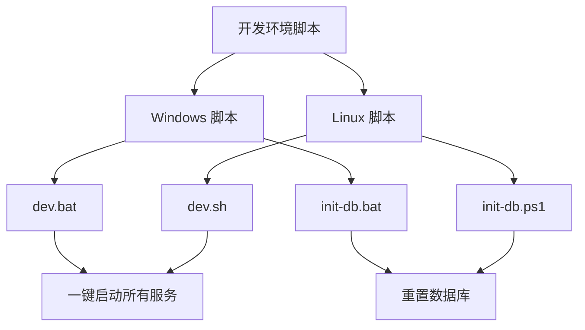

**图表来源**
- [dev.bat](file://dev.bat)
- [dev.sh](file://dev.sh)
- [init-db.bat](file://init-db.bat)
- [init-db.ps1](file://init-db.ps1)

### IDE 配置建议
1. **VS Code 插件推荐**
   - Python 扩展包
   - Vue.js 扩展包
   - Java 扩展包
   - Docker 扩展包
   - PostgreSQL 扩展包

2. **调试配置**
   - 后端：配置 Python 调试器
   - 前端：配置 Chrome 调试器
   - Java：配置远程调试
   - 数据库：配置 MySQL 连接

3. **代码格式化**
   - Python：Black + isort
   - JavaScript/TypeScript：Prettier + ESLint
   - Java：Google Java Style

### 开发最佳实践
1. **代码规范**
   - 遵循 PEP8 Python 规范
   - 遵循 Airbnb JavaScript 规范
   - 遵循 Google Java 规范

2. **版本控制**
   - 使用 Git Flow 工作流
   - 提交信息遵循约定式提交
   - 分支命名规范明确

3. **测试策略**
   - 单元测试覆盖率 >= 80%
   - 集成测试覆盖核心业务流程
   - 端到端测试验证用户流程