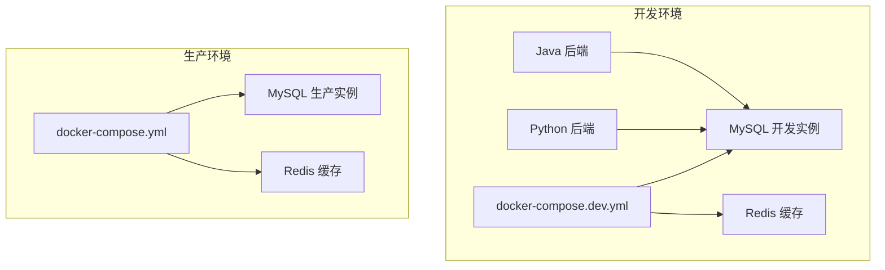
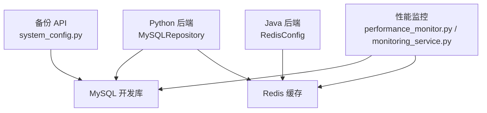
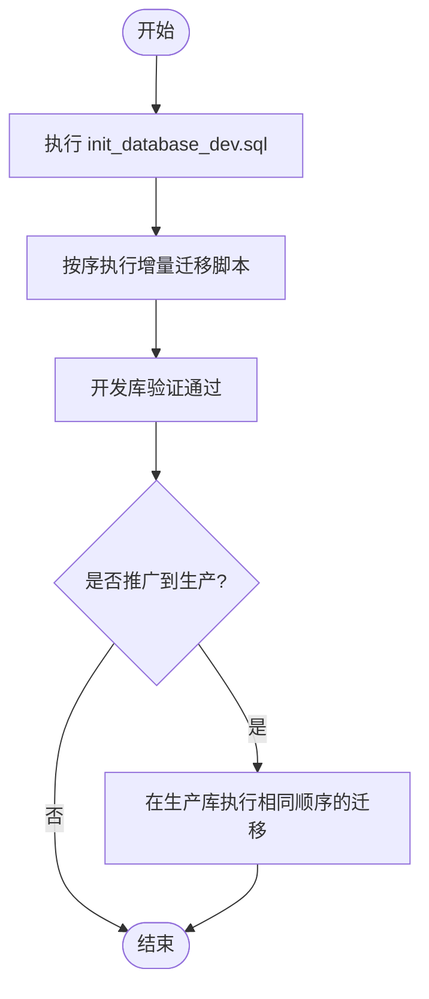
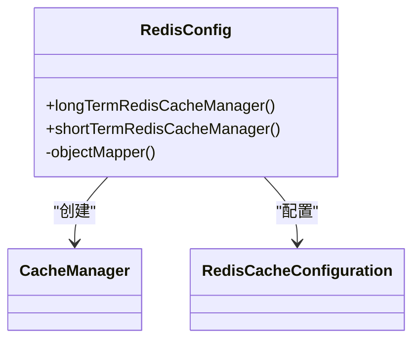
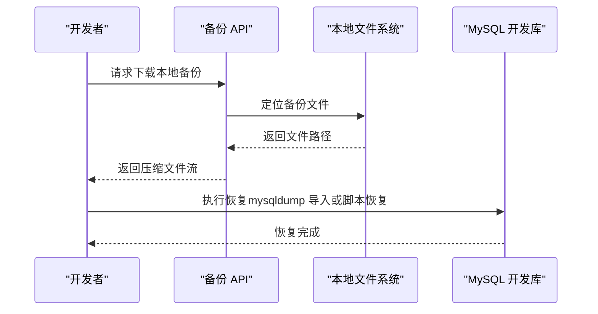
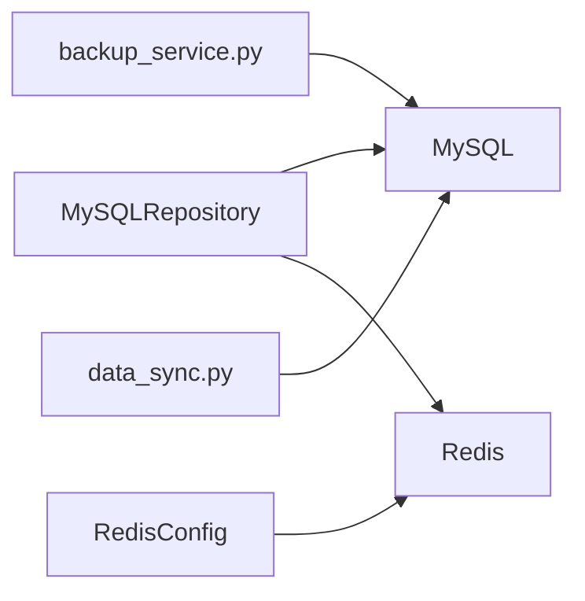

# 数据库配置

<cite>
**本文引用的文件**
- [backend/app/repositories/mysql_repo.py](file://backend/app/repositories/mysql_repo.py)
- [backend/app/repositories/migrate_selection_tables.py](file://backend/app/repositories/migrate_selection_tables.py)
- [docs/database/README.md](file://docs/database/README.md)
- [docs/项目逻辑/系统设置/备份功能.md](file://docs/项目逻辑/系统设置/备份功能.md)
- [java-backend/src/main/java/com/sjzm/config/RedisConfig.java](file://java-backend/src/main/java/com/sjzm/config/RedisConfig.java)
- [java-backend/sjzm-common/src/main/java/com/sjzm/config/RedisConfig.java](file://java-backend/sjzm-common/src/main/java/com/sjzm/config/RedisConfig.java)
- [scripts/env_consistency/data_sync.py](file://scripts/env_consistency/data_sync.py)
- [backend/app/api/v1/system_config.py](file://backend/app/api/v1/system_config.py)
- [backend/app/services/backup_service.py](file://backend/app/services/backup_service.py)
- [backend/app/utils/performance_monitor.py](file://backend/app/utils/performance_monitor.py)
- [backend/app/services/monitoring_service.py](file://backend/app/services/monitoring_service.py)
- [prometheus/prometheus.yml](file://prometheus/prometheus.yml)
- [docker-compose.dev.yml](file://docker-compose.dev.yml)
- [docker-compose.yml](file://docker-compose.yml)
- [mysql/init/01-init.sql](file://mysql/init/01-init.sql)
- [backend/migrations/init_database_dev.sql](file://backend/migrations/init_database_dev.sql)
- [backend/migrations/init_database.sql](file://backend/migrations/init_database.sql)
- [backend/migrations/create_scoring_tables.sql](file://backend/migrations/create_scoring_tables.sql)
- [backend/migrations/add_images_index.sql](file://backend/migrations/add_images_index.sql)
- [backend/migrations/add_role_indexes.sql](file://backend/migrations/add_role_indexes.sql)
- [backend/migrations/add_download_tasks_table.sql](file://backend/migrations/add_download_tasks_table.sql)
- [backend/migrations/system_log_tables.sql](file://backend/migrations/system_log_tables.sql)
- [backend/migrations/create_final_drafts_table.sql](file://backend/migrations/create_final_drafts_table.sql)
- [backend/migrations/create_material_carrier_tables.sql](file://backend/migrations/create_material_carrier_tables.sql)
- [backend/migrations/check_uk_source.sql](file://backend/migrations/check_uk_source.sql)
- [backend/migrations/check_source.sql](file://backend/migrations/check_source.sql)
- [backend/migrations/check_data.sql](file://backend/migrations/check_data.sql)
- [backend/migrations/check_product_type.sql](file://backend/migrations/check_product_type.sql)
- [backend/migrations/check_columns.sql](file://backend/migrations/check_columns.sql)
- [backend/migrations/check_country_values.sql](file://backend/migrations/check_country_values.sql)
- [backend/migrations/update_existing_data.sql](file://backend/migrations/update_existing_data.sql)
- [backend/migrations/fix_carrier_sku.sql](file://backend/migrations/fix_carrier_sku.sql)
- [backend/migrations/remove_carrier_sku.sql](file://backend/migrations/remove_carrier_sku.sql)
- [backend/migrations/add_missing_fields.sql](file://backend/migrations/add_missing_fields.sql)
- [backend/migrations/add_grade_fields.sql](file://backend/migrations/add_grade_fields.sql)
- [backend/migrations/add_grade_fields_fixed.sql](file://backend/migrations/add_grade_fields_fixed.sql)
- [backend/migrations/add_scoring_fields.sql](file://backend/migrations/add_scoring_fields.sql)
- [backend/migrations/add_infringement_label.sql](file://backend/migrations/add_infringement_label.sql)
- [backend/migrations/add_original_image_metadata.sql](file://backend/migrations/add_original_image_metadata.sql)
- [backend/migrations/add_original_image_metadata_single.sql](file://backend/migrations/add_original_image_metadata_single.sql)
- [backend/migrations/add_original_zip_fields.sql](file://backend/migrations/add_original_zip_fields.sql)
- [backend/migrations/add_thumbnail_columns.sql](file://backend/migrations/add_thumbnail_columns.sql)
- [backend/migrations/add_image_storage_fields.sql](file://backend/migrations/add_image_storage_fields.sql)
- [backend/migrations/add_image_storage_fields_sijuelishi.sql](file://backend/migrations/add_image_storage_fields_sijuelishi.sql)
- [backend/migrations/add_cos_fields.sql](file://backend/migrations/add_cos_fields.sql)
- [backend/migrations/add_country_and_filter_mode.sql](file://backend/migrations/add_country_and_filter_mode.sql)
- [backend/migrations/add_country_and_filter_mode_to_recycle_bin.sql](file://backend/migrations/add_country_and_filter_mode_to_recycle_bin.sql)
- [backend/migrations/debug_country.sql](file://backend/migrations/debug_country.sql)
- [backend/migrations/init_scoring_system.sql](file://backend/migrations/init_scoring_system.sql)
- [backend/migrations/init_scoring_system_simple.sql](file://backend/migrations/init_scoring_system_simple.sql)
- [backend/migrations/update_material_library_table.sql](file://backend/migrations/update_material_library_table.sql)
- [backend/migrations/check_local_images.sql](file://backend/migrations/check_local_images.sql)
- [backend/migrations/check_db_urls.sql](file://backend/migrations/check_db_urls.sql)
- [backend/migrations/check_final_draft_tables.sql](file://backend/migrations/check_final_draft_tables.sql)
- [backend/migrations/check_product_data_tables.sql](file://backend/migrations/check_product_data_tables.sql)
- [backend/migrations/check_database_tables.py](file://backend/migrations/check_database_tables.py)
- [backend/migrations/execute_sql_migration.py](file://backend/migrations/execute_sql_migration.py)
- [backend/migrations/create_aggregation_tables.py](file://backend/migrations/create_aggregation_tables.py)
- [backend/migrations/add_performance_indexes.py](file://backend/migrations/add_performance_indexes.py)
- [backend/migrations/analyze_product_data.py](file://backend/migrations/analyze_product_data.py)
- [backend/migrations/check_table_structure.py](file://backend/migrations/check_table_structure.py)
- [backend/migrations/extract_categories.py](file://backend/migrations/extract_categories.py)
- [backend/migrations/trigger_scoring.py](file://backend/migrations/trigger_scoring.py)
- [backend/migrations/fix_scoring.py](file://backend/migrations/fix_scoring.py)
- [backend/migrations/url_check_scheduler.py](file://backend/migrations/url_check_scheduler.py)
- [backend/migrations/url_maintenance.py](file://backend/migrations/url_maintenance.py)
- [backend/migrations/cleanup.py](file://backend/migrations/cleanup.py)
- [backend/migrations/data_migration.py](file://backend/migrations/data_migration.py)
- [backend/migrations/verify_sku_24.py](file://backend/migrations/verify_sku_24.py)
- [backend/migrations/add_local_thumbnail_fields.sql](file://backend/migrations/add_local_thumbnail_fields.sql)
- [backend/migrations/update_existing_drafts.py](file://backend/migrations/update_existing_drafts.py)
- [backend/migrations/fix_image_urls.py](file://backend/migrations/fix_image_urls.py)
- [backend/migrations/cos_migration.py](file://backend/migrations/cos_migration.py)
- [backend/migrations/create_file_links_folder.py](file://backend/migrations/create_file_links_folder.py)
- [backend/migrations/_parquet_cols.py](file://backend/migrations/_parquet_cols.py)
- [backend/migrations/merge_parquet_files_v2.py](file://backend/migrations/merge_parquet_files_v2.py)
- [backend/migrations/read_excel.py](file://backend/migrations/read_excel.py)
- [backend/migrations/batch_convert_to_parquet.py](file://backend/migrations/batch_convert_to_parquet.py)
- [backend/migrations/restore_dev.sh](file://backend/migrations/restore_dev.sh)
- [backend/migrations/import_db.sh](file://backend/migrations/import_db.sh)
- [backend/migrations/import_final.sh](file://backend/migrations/import_final.sh)
- [backend/migrations/build-prod-init-sql.ps1](file://backend/migrations/build-prod-init-sql.ps1)
- [backend/migrations/test_marketplace_only.json](file://backend/migrations/test_marketplace_only.json)
- [backend/migrations/test_marketplace_variation_N.json](file://backend/migrations/test_marketplace_variation_N.json)
- [backend/migrations/test_marketplace_variation_Y.json](file://backend/migrations/test_marketplace_variation_Y.json)
- [backend/migrations/测试卖家精灵API.py](file://backend/migrations/测试卖家精灵API.py)
- [backend/migrations/export_asins.py](file://backend/migrations/export_asins.py)
- [backend/migrations/check_asin_duplicate.py](file://backend/migrations/check_asin_duplicate.py)
- [backend/migrations/check_asin_sales.py](file://backend/migrations/check_asin_sales.py)
- [backend/migrations/check_overlap.py](file://backend/migrations/check_overlap.py)
- [backend/migrations/check_parquet_columns.py](file://backend/migrations/check_parquet_columns.py)
- [backend/migrations/merge_parquet_files_v2.py](file://backend/migrations/merge_parquet_files_v2.py)
- [backend/migrations/read_excel.py](file://backend/migrations/read_excel.py)
- [backend/migrations/batch_convert_to_parquet.py](file://backend/migrations/batch_convert_to_parquet.py)
- [backend/migrations/restore_dev.sh](file://backend/migrations/restore_dev.sh)
- [backend/migrations/import_db.sh](file://backend/migrations/import_db.sh)
- [backend/migrations/import_final.sh](file://backend/migrations/import_final.sh)
- [backend/migrations/build-prod-init-sql.ps1](file://backend/migrations/build-prod-init-sql.ps1)
- [backend/migrations/test_marketplace_only.json](file://backend/migrations/test_marketplace_only.json)
- [backend/migrations/test_marketplace_variation_N.json](file://backend/migrations/test_marketplace_variation_N.json)
- [backend/migrations/test_marketplace_variation_Y.json](file://backend/migrations/test_marketplace_variation_Y.json)
- [backend/migrations/测试卖家精灵API.py](file://backend/migrations/测试卖家精灵API.py)
- [backend/migrations/export_asins.py](file://backend/migrations/export_asins.py)
- [backend/migrations/check_asin_duplicate.py](file://backend/migrations/check_asin_duplicate.py)
- [backend/migrations/check_asin_sales.py](file://backend/migrations/check_asin_sales.py)
- [backend/migrations/check_overlap.py](file://backend/migrations/check_overlap.py)
- [backend/migrations/check_parquet_columns.py](file://backend/migrations/check_parquet_columns.py)
</cite>

## 目录
1. [简介](#简介)
2. [项目结构](#项目结构)
3. [核心组件](#核心组件)
4. [架构总览](#架构总览)
5. [详细组件分析](#详细组件分析)
6. [依赖分析](#依赖分析)
7. [性能考虑](#性能考虑)
8. [故障排查指南](#故障排查指南)
9. [结论](#结论)
10. [附录](#附录)

## 简介
本指南面向数据库开发环境的搭建与维护，覆盖 MySQL 的安装与初始化配置（字符集、存储引擎、性能参数）、数据库用户与权限、迁移脚本执行顺序与版本管理、Redis 缓存服务本地配置与持久化、数据库备份与恢复实践、外键与索引策略、查询优化方法，以及监控与性能分析工具的配置。文档基于仓库现有实现与文档进行整理，确保与实际代码一致。

## 项目结构
数据库相关的关键位置与职责如下：
- MySQL 初始化与开发库脚本：位于 backend/migrations 与 mysql/init
- Python 后端数据库连接与迁移：backend/app/repositories 与 backend/migrations
- Java 后端 Redis 缓存配置：java-backend/*/src/main/java/**/RedisConfig.java
- 备份与恢复：docs/项目逻辑/系统设置/备份功能.md、scripts/env_consistency/data_sync.py、backup API
- 监控与性能分析：prometheus.yml、backend/app/utils/performance_monitor.py、backend/app/services/monitoring_service.py
- Docker 编排：docker-compose.dev.yml、docker-compose.yml

**图表来源**
- [docker-compose.dev.yml](file://docker-compose.dev.yml)
- [docker-compose.yml](file://docker-compose.yml)

**章节来源**
- [docker-compose.dev.yml](file://docker-compose.dev.yml)
- [docker-compose.yml](file://docker-compose.yml)

## 核心组件
- MySQL 连接与连接池：Python 后端通过 settings 注入连接参数，统一在 MySQLRepository 中建立连接池与生命周期管理。
- 迁移脚本体系：以 init_database_dev.sql 为开发库初始化入口，后续按语义命名的 SQL 脚本进行增量变更；同时提供 Python 迁移辅助脚本。
- Redis 缓存：Java 后端提供多级缓存配置（短时、长时），支持序列化与事务感知。
- 备份与恢复：提供容器内 mysqldump 备份、本地备份 API 下载、脚本化的开发库恢复流程。
- 监控与性能分析：Prometheus 配置、后端性能监控工具与服务。

**章节来源**
- [backend/app/repositories/mysql_repo.py](file://backend/app/repositories/mysql_repo.py)
- [backend/app/repositories/migrate_selection_tables.py](file://backend/app/repositories/migrate_selection_tables.py)
- [java-backend/src/main/java/com/sjzm/config/RedisConfig.java](file://java-backend/src/main/java/com/sjzm/config/RedisConfig.java)
- [docs/项目逻辑/系统设置/备份功能.md](file://docs/项目逻辑/系统设置/备份功能.md)
- [prometheus/prometheus.yml](file://prometheus/prometheus.yml)

## 架构总览
下图展示开发环境中数据库与应用的交互关系，包括 Python 后端、Java 后端、MySQL 与 Redis 的连接路径。

**图表来源**
- [backend/app/repositories/mysql_repo.py](file://backend/app/repositories/mysql_repo.py)
- [java-backend/src/main/java/com/sjzm/config/RedisConfig.java](file://java-backend/src/main/java/com/sjzm/config/RedisConfig.java)
- [backend/app/api/v1/system_config.py](file://backend/app/api/v1/system_config.py)
- [backend/app/utils/performance_monitor.py](file://backend/app/utils/performance_monitor.py)
- [backend/app/services/monitoring_service.py](file://backend/app/services/monitoring_service.py)

## 详细组件分析

### MySQL 安装与初始化配置
- 初始化脚本
  - 开发库初始化：init_database_dev.sql
  - 生产库初始化：init_database.sql
  - 核心业务表初始化：create_scoring_tables.sql、create_final_drafts_table.sql、create_material_carrier_tables.sql、system_log_tables.sql、add_download_tasks_table.sql
- 字符集与存储引擎
  - 建议在初始化脚本中显式指定字符集与存储引擎，确保开发与生产一致性
- 性能参数优化
  - 可在初始化脚本或数据库启动参数中设置关键参数，如 innodb_buffer_pool_size、innodb_log_file_size、innodb_flush_log_at_trx_commit 等（具体数值依据硬件与负载调整）

**章节来源**
- [backend/migrations/init_database_dev.sql](file://backend/migrations/init_database_dev.sql)
- [backend/migrations/init_database.sql](file://backend/migrations/init_database.sql)
- [backend/migrations/create_scoring_tables.sql](file://backend/migrations/create_scoring_tables.sql)
- [backend/migrations/create_final_drafts_table.sql](file://backend/migrations/create_final_drafts_table.sql)
- [backend/migrations/create_material_carrier_tables.sql](file://backend/migrations/create_material_carrier_tables.sql)
- [backend/migrations/system_log_tables.sql](file://backend/migrations/system_log_tables.sql)
- [backend/migrations/add_download_tasks_table.sql](file://backend/migrations/add_download_tasks_table.sql)

### 数据库用户与权限
- 用户与权限
  - 建议为开发环境创建专用用户，并限制其权限范围（仅限开发库）
  - 生产与开发库分别配置不同用户，避免交叉访问
- 密码策略
  - 使用强密码，定期轮换；在容器编排中通过环境变量注入，避免硬编码

**章节来源**
- [docs/database/README.md](file://docs/database/README.md)

### 迁移脚本执行顺序与版本管理
- 执行顺序
  - 先执行 init_database_dev.sql 初始化开发库，再按语义顺序执行各增量脚本
  - Python 迁移辅助脚本可用于在开发库验证后再推广至生产
- 版本管理
  - 采用语义化命名的 SQL 文件，如 add_*、fix_*、update_*、remove_*，便于追溯与回滚
  - 文档明确禁止在迁移文件中执行 DML，数据变更应使用独立脚本

**图表来源**
- [docs/database/README.md](file://docs/database/README.md)
- [backend/migrations/init_database_dev.sql](file://backend/migrations/init_database_dev.sql)

**章节来源**
- [docs/database/README.md](file://docs/database/README.md)
- [backend/migrations/execute_sql_migration.py](file://backend/migrations/execute_sql_migration.py)

### Redis 缓存服务本地配置与持久化
- 配置要点
  - Java 后端提供多级缓存配置：短时缓存（分钟级）、长时缓存（小时级），并启用事务感知
  - 序列化策略：字符串键、JSON 值，支持时间类型序列化
- 持久化建议
  - 开发环境可使用 RDB 快照或 AOF 日志，结合容器卷持久化
  - 生产环境建议开启 AOF 并配置合适的 fsync 策略

**图表来源**
- [java-backend/src/main/java/com/sjzm/config/RedisConfig.java](file://java-backend/src/main/java/com/sjzm/config/RedisConfig.java)
- [java-backend/sjzm-common/src/main/java/com/sjzm/config/RedisConfig.java](file://java-backend/sjzm-common/src/main/java/com/sjzm/config/RedisConfig.java)

**章节来源**
- [java-backend/src/main/java/com/sjzm/config/RedisConfig.java](file://java-backend/src/main/java/com/sjzm/config/RedisConfig.java)
- [java-backend/sjzm-common/src/main/java/com/sjzm/config/RedisConfig.java](file://java-backend/sjzm-common/src/main/java/com/sjzm/config/RedisConfig.java)

### 数据库备份与恢复（开发环境实践）
- 备份
  - 容器内 mysqldump 备份：支持单事务导出与压缩
  - 后端 API 下载本地备份：通过 system_config.py 提供的接口下载本地备份文件
- 恢复
  - 脚本化恢复：data_sync.py 支持将快照恢复到开发库，并可选择性备份恢复前的开发库
  - 命令行恢复：使用 mysql 客户端导入压缩或普通 SQL 文件

**图表来源**
- [backend/app/api/v1/system_config.py](file://backend/app/api/v1/system_config.py)
- [docs/项目逻辑/系统设置/备份功能.md](file://docs/项目逻辑/系统设置/备份功能.md)
- [scripts/env_consistency/data_sync.py](file://scripts/env_consistency/data_sync.py)

**章节来源**
- [docs/项目逻辑/系统设置/备份功能.md](file://docs/项目逻辑/系统设置/备份功能.md)
- [backend/app/api/v1/system_config.py](file://backend/app/api/v1/system_config.py)
- [scripts/env_consistency/data_sync.py](file://scripts/env_consistency/data_sync.py)

### 外键约束、索引策略与查询优化
- 外键约束
  - 建议在开发库中启用外键约束，保证参照完整性；生产库根据性能需求可评估是否启用
- 索引策略
  - 常见索引：角色相关索引（add_role_indexes.sql）、图片相关索引（add_images_index.sql）
  - 聚合与统计：create_aggregation_tables.py 用于构建宽表与物化视图，减少复杂查询成本
- 查询优化
  - 使用性能监控工具定位慢查询，结合索引与查询重写优化
  - 分析脚本：analyze_product_data.py、check_table_structure.py、check_database_tables.py

**章节来源**
- [backend/migrations/add_role_indexes.sql](file://backend/migrations/add_role_indexes.sql)
- [backend/migrations/add_images_index.sql](file://backend/migrations/add_images_index.sql)
- [backend/migrations/create_aggregation_tables.py](file://backend/migrations/create_aggregation_tables.py)
- [backend/migrations/analyze_product_data.py](file://backend/migrations/analyze_product_data.py)
- [backend/migrations/check_table_structure.py](file://backend/migrations/check_table_structure.py)
- [backend/migrations/check_database_tables.py](file://backend/migrations/check_database_tables.py)

### 数据库监控与性能分析
- Prometheus 配置：prometheus.yml 用于采集指标
- 后端监控工具：performance_monitor.py、monitoring_service.py 提供性能观测与告警集成
- 建议
  - 将 MySQL 与 Redis 指标纳入 Prometheus 抓取范围
  - 结合慢查询日志与 EXPLAIN 分析热点 SQL

**章节来源**
- [prometheus/prometheus.yml](file://prometheus/prometheus.yml)
- [backend/app/utils/performance_monitor.py](file://backend/app/utils/performance_monitor.py)
- [backend/app/services/monitoring_service.py](file://backend/app/services/monitoring_service.py)

## 依赖分析
- Python 后端依赖 MySQLRepository 进行连接池管理，迁移脚本通过 settings 注入连接参数
- Java 后端通过 RedisConfig 管理多级缓存，提升读取性能
- 备份与恢复依赖 mysqldump 与 mysql 客户端，以及后端 API 与脚本

**图表来源**
- [backend/app/repositories/mysql_repo.py](file://backend/app/repositories/mysql_repo.py)
- [java-backend/src/main/java/com/sjzm/config/RedisConfig.java](file://java-backend/src/main/java/com/sjzm/config/RedisConfig.java)
- [backend/app/services/backup_service.py](file://backend/app/services/backup_service.py)
- [scripts/env_consistency/data_sync.py](file://scripts/env_consistency/data_sync.py)

**章节来源**
- [backend/app/repositories/mysql_repo.py](file://backend/app/repositories/mysql_repo.py)
- [java-backend/src/main/java/com/sjzm/config/RedisConfig.java](file://java-backend/src/main/java/com/sjzm/config/RedisConfig.java)
- [backend/app/services/backup_service.py](file://backend/app/services/backup_service.py)
- [scripts/env_consistency/data_sync.py](file://scripts/env_consistency/data_sync.py)

## 性能考虑
- 连接池参数：pool_size、max_overflow、pool_recycle、pool_timeout
- 存储引擎与字符集：在初始化阶段统一设置，避免运行期切换
- 索引与查询：优先使用覆盖索引与合适的选择性列；避免全表扫描
- 缓存策略：区分短时与长时缓存，合理设置 TTL，降低数据库压力

**章节来源**
- [backend/app/repositories/mysql_repo.py](file://backend/app/repositories/mysql_repo.py)
- [backend/migrations/add_images_index.sql](file://backend/migrations/add_images_index.sql)
- [backend/migrations/add_role_indexes.sql](file://backend/migrations/add_role_indexes.sql)

## 故障排查指南
- 连接失败
  - 检查 settings 中的主机、端口、用户名、密码是否正确
  - 确认容器网络与端口映射
- 迁移失败
  - 查看迁移脚本执行日志，确认语法与依赖顺序
  - 开发库先行验证，再推广到生产
- 备份/恢复异常
  - 使用容器内 mysqldump 备份，确认压缩与目标路径
  - 恢复前可选择性备份开发库，防止数据丢失
- 慢查询
  - 使用性能监控工具定位热点 SQL，结合索引与查询重写优化

**章节来源**
- [backend/app/repositories/mysql_repo.py](file://backend/app/repositories/mysql_repo.py)
- [docs/项目逻辑/系统设置/备份功能.md](file://docs/项目逻辑/系统设置/备份功能.md)
- [scripts/env_consistency/data_sync.py](file://scripts/env_consistency/data_sync.py)
- [backend/app/utils/performance_monitor.py](file://backend/app/utils/performance_monitor.py)

## 结论
本指南基于仓库现有实现，提供了从安装初始化、用户权限、迁移管理、缓存配置、备份恢复到监控与性能优化的完整开发环境实践路径。建议在团队内固化执行流程与检查清单，确保开发与生产的数据库一致性与稳定性。

## 附录
- 初始化与常用脚本
  - 开发库初始化：init_database_dev.sql
  - 生产库初始化：init_database.sql
  - 常用业务表初始化：create_scoring_tables.sql、create_final_drafts_table.sql、create_material_carrier_tables.sql、system_log_tables.sql、add_download_tasks_table.sql
- 迁移脚本分类
  - 字段变更：add_*、fix_*、update_*、remove_*
  - 数据校验：check_*、verify_*
  - 聚合与分析：create_aggregation_tables.py、analyze_product_data.py、extract_categories.py
- 备份与恢复命令
  - 容器内备份：mysqldump + gzip
  - 恢复命令：mysql 导入压缩或普通 SQL 文件
- 监控与指标
  - Prometheus 配置：prometheus.yml
  - 后端性能监控：performance_monitor.py、monitoring_service.py

**章节来源**
- [backend/migrations/init_database_dev.sql](file://backend/migrations/init_database_dev.sql)
- [backend/migrations/init_database.sql](file://backend/migrations/init_database.sql)
- [backend/migrations/create_scoring_tables.sql](file://backend/migrations/create_scoring_tables.sql)
- [backend/migrations/create_final_drafts_table.sql](file://backend/migrations/create_final_drafts_table.sql)
- [backend/migrations/create_material_carrier_tables.sql](file://backend/migrations/create_material_carrier_tables.sql)
- [backend/migrations/system_log_tables.sql](file://backend/migrations/system_log_tables.sql)
- [backend/migrations/add_download_tasks_table.sql](file://backend/migrations/add_download_tasks_table.sql)
- [docs/项目逻辑/系统设置/备份功能.md](file://docs/项目逻辑/系统设置/备份功能.md)
- [prometheus/prometheus.yml](file://prometheus/prometheus.yml)
- [backend/app/utils/performance_monitor.py](file://backend/app/utils/performance_monitor.py)
- [backend/app/services/monitoring_service.py](file://backend/app/services/monitoring_service.py)