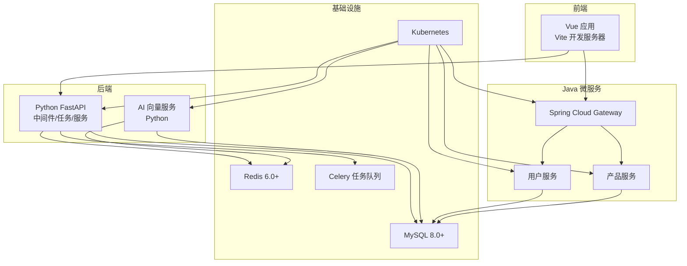
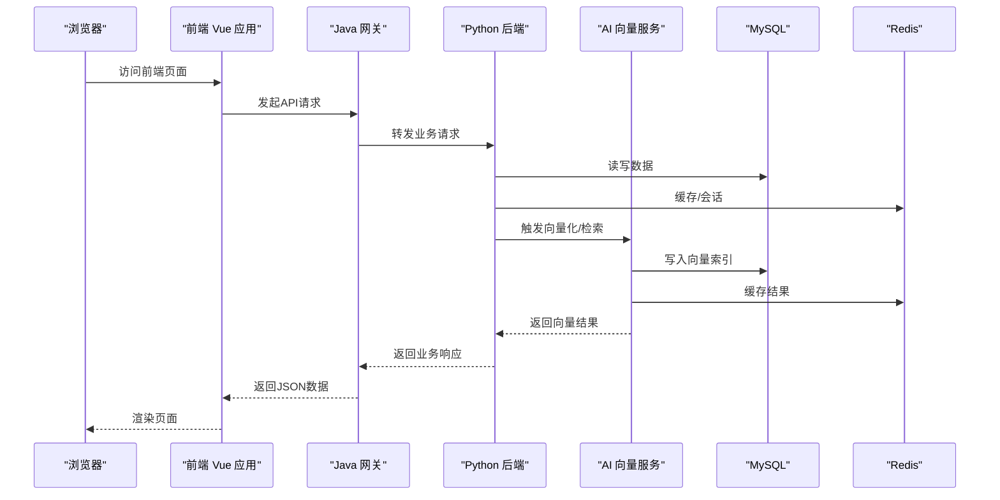
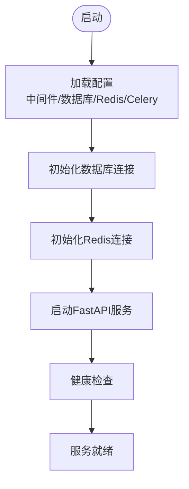
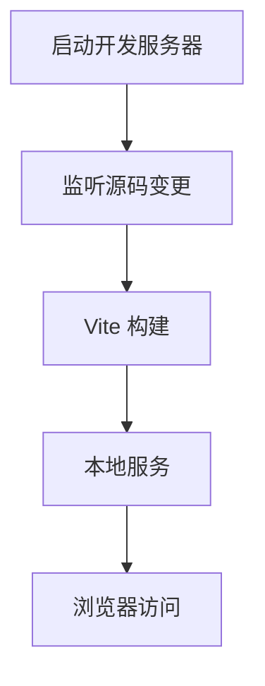
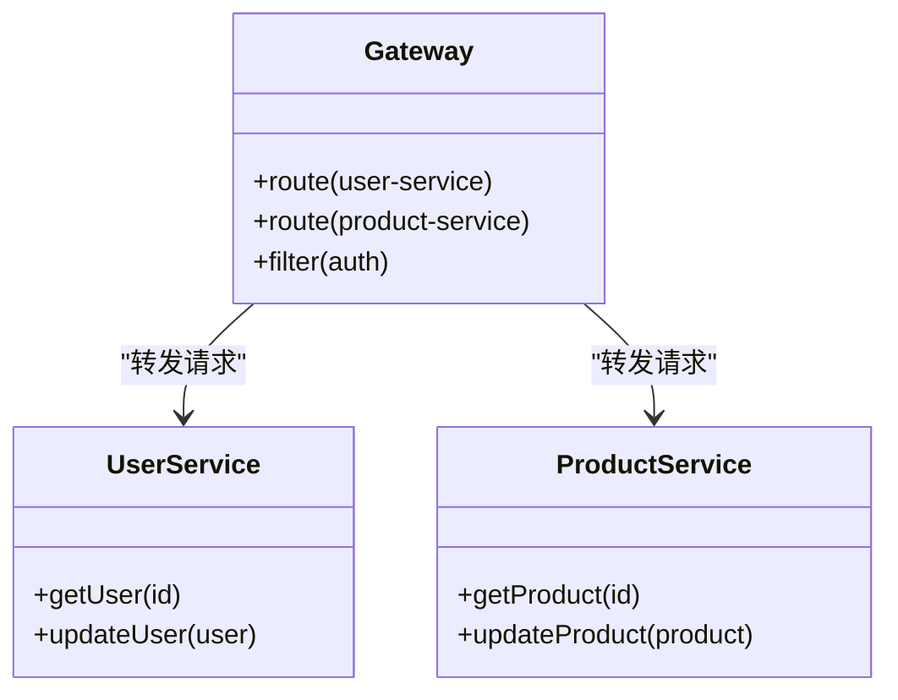
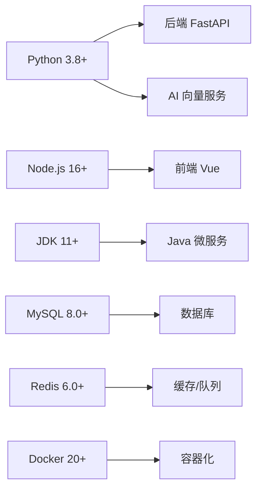

# 系统要求

<cite>
**本文引用的文件**
- [requirements.txt](file://backend/requirements.txt)
- [package.json](file://frontend/package.json)
- [pom.xml](file://java-backend/pom.xml)
- [Dockerfile](file://backend/Dockerfile)
- [Dockerfile](file://frontend/Dockerfile)
- [Dockerfile](file://python-ai/Dockerfile)
- [docker-compose.yml](file://docker-compose.yml)
- [docker-compose.dev.yml](file://docker-compose.dev.yml)
- [docker-compose.prod.yml](file://docker-compose.prod.yml)
- [docker-compose.prod-simple.yml](file://docker-compose.prod-simple.yml)
- [docker-compose.base.yml](file://docker-compose.base.yml)
- [config.py](file://backend/config.py)
- [config.py](file://python-ai/config.py)
- [application.yml](file://java-backend/src/main/resources/application.yml)
- [application-prod.yml](file://java-backend/src/main/resources/application-prod.yml)
- [start_vite_dev.py](file://backend/start_vite_dev.py)
- [start_celery.py](file://backend/start_celery.py)
- [start_java_dev.py](file://backend/start_java_dev.py)
- [dev.sh](file://dev.sh)
- [dev.bat](file://dev.bat)
- [prod.sh](file://prod.sh)
- [init-db.ps1](file://init-db.ps1)
- [init-db.bat](file://init-db.bat)
- [README.md](file://README.md)
- [启动.md](file://启动.md)
- [Docker生产环境独立部署方案.md](file://docs/架构/Docker生产环境独立部署方案.md)
- [架构设计文档-微服务分离方案.md](file://docs/架构/架构设计文档-微服务分离方案.md)
- [AI 选品 Agent — 实施方案.md](file://docs/AI 选品 Agent — 实施方案.md)
- [Java后端API测试清单.md](file://docs/Java后端API测试清单.md)
- [开发流程.md](file://docs/development/standards.md)
- [性能监控与调优.md](file://docs/monitoring/performance_monitoring.md)
</cite>

## 目录
1. [简介](#简介)
2. [项目结构](#项目结构)
3. [核心组件](#核心组件)
4. [架构概览](#架构概览)
5. [详细组件分析](#详细组件分析)
6. [依赖分析](#依赖分析)
7. [性能考虑](#性能考虑)
8. [故障排除指南](#故障排除指南)
9. [结论](#结论)
10. [附录](#附录)

## 简介
本文件为思觉智贸项目的系统要求文档，旨在明确开发与运行环境的最低硬件配置、操作系统兼容性、软件版本要求及性能基准建议。项目采用多语言混合架构：后端Python（FastAPI）、前端Vue、Java微服务网关与业务模块、AI向量服务（Python）、数据库（MySQL 8.0+）、缓存（Redis 6.0+）、消息队列（Celery）、容器编排（Docker 20+）以及Kubernetes部署支持。本文档基于仓库中的配置文件与文档进行整理，确保开发者能够快速搭建符合要求的开发环境。

## 项目结构
项目采用分层与多模块组织方式：
- 后端Python服务：提供REST API、任务处理、中间件与数据库交互
- 前端Vue应用：单页应用，通过Vite构建与开发服务器
- Java微服务：网关与业务模块（用户、产品），Spring Boot应用
- AI向量服务：Python服务，负责向量化与检索
- 数据库与缓存：MySQL 8.0+、Redis 6.0+
- 容器化：Docker Compose统一编排开发与生产环境
- 文档与脚本：部署、监控、开发流程与架构说明

**图表来源**
- [docker-compose.yml](file://docker-compose.yml)
- [docker-compose.dev.yml](file://docker-compose.dev.yml)
- [docker-compose.prod.yml](file://docker-compose.prod.yml)
- [docker-compose.prod-simple.yml](file://docker-compose.prod-simple.yml)
- [docker-compose.base.yml](file://docker-compose.base.yml)

**章节来源**
- [docker-compose.yml](file://docker-compose.yml)
- [docker-compose.dev.yml](file://docker-compose.dev.yml)
- [docker-compose.prod.yml](file://docker-compose.prod.yml)
- [docker-compose.prod-simple.yml](file://docker-compose.prod-simple.yml)
- [docker-compose.base.yml](file://docker-compose.base.yml)

## 核心组件
- Python后端（FastAPI）
  - 使用依赖管理与版本约束，见后文依赖分析
  - 支持Celery异步任务与Redis缓存
  - 提供健康检查、认证、日志等中间件
- 前端Vue应用
  - Vite构建与开发服务器，支持热重载
  - TypeScript类型定义与组件化架构
- Java微服务
  - Spring Cloud Gateway作为统一入口
  - 用户与产品服务模块，配置化管理
- AI向量服务
  - 负责向量化与检索，依赖Qdrant向量数据库
- 数据库与缓存
  - MySQL 8.0+用于主数据存储
  - Redis 6.0+用于缓存与会话
- 容器化与编排
  - Docker 20+用于镜像构建与运行
  - Docker Compose管理多服务编排
  - Kubernetes部署支持

**章节来源**
- [requirements.txt](file://backend/requirements.txt)
- [package.json](file://frontend/package.json)
- [pom.xml](file://java-backend/pom.xml)
- [Dockerfile](file://backend/Dockerfile)
- [Dockerfile](file://frontend/Dockerfile)
- [Dockerfile](file://python-ai/Dockerfile)
- [docker-compose.yml](file://docker-compose.yml)
- [application.yml](file://java-backend/src/main/resources/application.yml)
- [application-prod.yml](file://java-backend/src/main/resources/application-prod.yml)

## 架构概览
系统采用前后端分离与微服务架构，通过Docker Compose在本地实现一体化开发环境；生产环境支持Kubernetes部署。核心交互路径如下：

**图表来源**
- [docker-compose.yml](file://docker-compose.yml)
- [application.yml](file://java-backend/src/main/resources/application.yml)
- [config.py](file://backend/config.py)
- [config.py](file://python-ai/config.py)

**章节来源**
- [docker-compose.yml](file://docker-compose.yml)
- [application.yml](file://java-backend/src/main/resources/application.yml)
- [config.py](file://backend/config.py)
- [config.py](file://python-ai/config.py)

## 详细组件分析

### Python 后端（FastAPI）
- 技术栈与版本
  - Python 版本：从依赖文件可见使用较新的Python特性，建议使用Python 3.8+以满足依赖兼容性
  - 依赖管理：集中于requirements.txt，包含FastAPI、SQLAlchemy、Celery、Redis客户端等
  - 运行方式：通过Dockerfile构建镜像，或本地开发脚本启动
- 关键配置
  - 中间件：认证、错误处理、超时、日志
  - 任务队列：Celery集成，支持后台任务与定时任务
  - 数据库：SQLAlchemy ORM，支持MySQL 8.0+
  - 缓存：Redis连接与键空间管理
- 性能要点
  - 异步处理与并发模型需结合Celery与Redis优化
  - 数据库连接池与索引策略影响查询性能

**图表来源**
- [config.py](file://backend/config.py)
- [start_celery.py](file://backend/start_celery.py)

**章节来源**
- [requirements.txt](file://backend/requirements.txt)
- [config.py](file://backend/config.py)
- [start_celery.py](file://backend/start_celery.py)

### 前端 Vue 应用
- 技术栈与版本
  - Node.js：package.json中声明了Node与包管理器版本，建议使用Node.js 16+以保证构建稳定性
  - 包管理：pnpm/yarn/npm均可，具体以项目配置为准
  - 构建工具：Vite，支持热重载与快速开发
- 关键配置
  - 类型系统：TypeScript类型定义
  - 组件化：Element Plus、自定义组件体系
  - 状态管理：Pinia Store
- 性能要点
  - 代码分割与懒加载提升首屏性能
  - 图片缓存与离线缓存策略

**图表来源**
- [package.json](file://frontend/package.json)
- [start_vite_dev.py](file://backend/start_vite_dev.py)

**章节来源**
- [package.json](file://frontend/package.json)
- [start_vite_dev.py](file://backend/start_vite_dev.py)

### Java 微服务（Gateway + 业务模块）
- 技术栈与版本
  - JDK：Spring Boot与Spring Cloud要求JDK 11+，建议使用JDK 11+
  - 构建：Maven（pom.xml）
  - 网关：Spring Cloud Gateway统一入口
  - 业务模块：用户、产品服务
- 关键配置
  - 应用配置：application.yml与生产配置application-prod.yml
  - JVM参数：jvm-options.env
- 性能要点
  - 网关限流与熔断策略
  - 服务注册与发现（Nacos compose中可见）

**图表来源**
- [pom.xml](file://java-backend/pom.xml)
- [application.yml](file://java-backend/src/main/resources/application.yml)
- [application-prod.yml](file://java-backend/src/main/resources/application-prod.yml)

**章节来源**
- [pom.xml](file://java-backend/pom.xml)
- [application.yml](file://java-backend/src/main/resources/application.yml)
- [application-prod.yml](file://java-backend/src/main/resources/application-prod.yml)

### AI 向量服务
- 技术栈与版本
  - Python：与后端一致，建议Python 3.8+
  - 依赖：Qdrant客户端、向量检索相关库
- 关键配置
  - Qdrant连接与索引管理
  - 模型缓存与下载机制
- 性能要点
  - 向量维度与索引类型影响检索性能
  - 批量插入与增量更新策略

**章节来源**
- [requirements.txt](file://python-ai/requirements.txt)
- [config.py](file://python-ai/config.py)

### 数据库与缓存
- MySQL
  - 版本：8.0+
  - 初始化脚本：多套迁移脚本与初始化SQL
- Redis
  - 版本：6.0+
  - 用途：缓存、会话、Celery任务队列

**章节来源**
- [docker-compose.yml](file://docker-compose.yml)
- [init-db.ps1](file://init-db.ps1)
- [init-db.bat](file://init-db.bat)

## 依赖分析
基于仓库中的配置文件，整理核心依赖的版本要求与兼容性矩阵：

- Python 3.8+
  - 后端与AI服务均依赖Python 3.8+，以满足现代语法与第三方库兼容性
- Node.js 16+
  - 前端构建工具链要求Node 16+，确保Vite与包管理器稳定运行
- JDK 11+
  - Java微服务使用Spring Boot与Spring Cloud，要求JDK 11+
- MySQL 8.0+
  - 数据库版本要求8.0+，配合迁移脚本与ORM使用
- Redis 6.0+
  - 缓存与会话、Celery队列依赖Redis 6.0+
- Docker 20+
  - 容器镜像构建与运行需要Docker 20+

**图表来源**
- [requirements.txt](file://backend/requirements.txt)
- [requirements.txt](file://python-ai/requirements.txt)
- [package.json](file://frontend/package.json)
- [pom.xml](file://java-backend/pom.xml)
- [docker-compose.yml](file://docker-compose.yml)

**章节来源**
- [requirements.txt](file://backend/requirements.txt)
- [requirements.txt](file://python-ai/requirements.txt)
- [package.json](file://frontend/package.json)
- [pom.xml](file://java-backend/pom.xml)
- [docker-compose.yml](file://docker-compose.yml)

## 性能考虑
- 硬件配置建议（最低）
  - CPU：Intel i5-12400F 或 AMD Ryzen 5 3600X 及以上
  - 内存：16 GB DDR4/DDR5（开发+多服务）
  - 存储：500 GB SSD（系统盘）+ 1 TB HDD（数据与缓存）
  - 网络：千兆有线网络
- 资源占用建议
  - MySQL：单实例约2 GB内存，建议分配4 GB
  - Redis：单实例约512 MB内存，建议分配1 GB
  - Python后端：单实例约512 MB内存，建议分配1 GB
  - Celery worker：按任务负载动态扩展
  - Java网关与业务服务：单实例约1 GB内存，建议分配2 GB
  - 前端开发服务器：约256 MB内存
  - AI向量服务：根据向量规模与并发，建议分配2–4 GB
- 性能基准
  - 数据库：使用索引与连接池优化查询延迟
  - 缓存：合理设置TTL与键空间，避免内存碎片
  - 异步任务：Celery并发与队列分区提升吞吐
  - 前端：启用代码分割与懒加载，减少首屏体积
- 监控与调优
  - 结合项目文档中的监控实践，持续观察CPU、内存、磁盘IO与网络使用情况

**章节来源**
- [开发流程.md](file://docs/development/standards.md)
- [性能监控与调优.md](file://docs/monitoring/performance_monitoring.md)

## 故障排除指南
- 环境准备
  - 确认Python 3.8+、Node.js 16+、JDK 11+、Docker 20+已正确安装
  - 数据库与缓存服务可通过Docker Compose一键启动
- 常见问题
  - 数据库连接失败：检查MySQL 8.0+服务状态与账号权限
  - Redis连接失败：确认Redis 6.0+服务可用与端口开放
  - 前端无法启动：检查Node.js版本与包管理器缓存清理
  - Java服务启动异常：核对JDK版本与Maven依赖
  - Celery任务无响应：检查Redis连接与队列配置
- 排障脚本
  - 使用提供的初始化脚本与启动脚本快速定位问题
  - 参考项目文档中的部署与监控实践

**章节来源**
- [init-db.ps1](file://init-db.ps1)
- [init-db.bat](file://init-db.bat)
- [dev.sh](file://dev.sh)
- [dev.bat](file://dev.bat)
- [prod.sh](file://prod.sh)
- [启动.md](file://启动.md)

## 结论
本系统要求具备现代化的多语言开发环境与容器化能力。遵循本文档的版本要求与性能建议，可在Windows、macOS、Linux上高效搭建开发环境，并通过Docker Compose与Kubernetes实现稳定的本地与生产部署。建议开发者优先满足最低硬件配置，并结合项目监控与调优实践，持续优化系统性能与稳定性。

## 附录
- 操作系统兼容性
  - Windows：PowerShell脚本与批处理文件支持一键启动
  - macOS：Bash脚本与Docker Desktop
  - Linux：Shell脚本与Docker Engine
- 推荐配置
  - 开发机：32 GB内存、1 TB SSD
  - 高并发场景：64 GB内存、2 TB SSD
- 参考文档
  - 架构设计与部署方案
  - 开发流程与标准
  - 监控与性能调优

**章节来源**
- [README.md](file://README.md)
- [启动.md](file://启动.md)
- [Docker生产环境独立部署方案.md](file://docs/架构/Docker生产环境独立部署方案.md)
- [架构设计文档-微服务分离方案.md](file://docs/架构/架构设计文档-微服务分离方案.md)
- [AI 选品 Agent — 实施方案.md](file://docs/AI 选品 Agent — 实施方案.md)
- [Java后端API测试清单.md](file://docs/Java后端API测试清单.md)
- [开发流程.md](file://docs/development/standards.md)