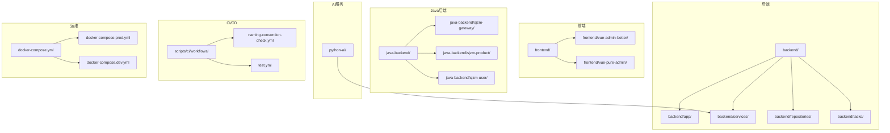
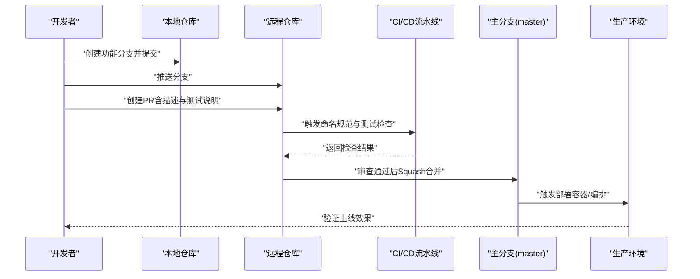
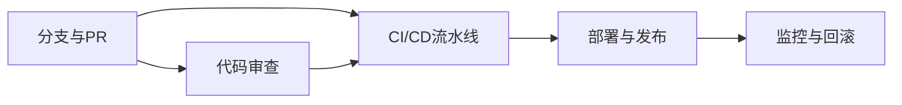

# Git工作流程

<cite>
**本文引用的文件**
- [cliff.toml](file://cliff.toml)
- [TEAM_WORKFLOW.md](file://TEAM_WORKFLOW.md)
- [CHANGELOG.md](file://CHANGELOG.md)
- [naming-convention-check.yml](file://scripts/ci/workflows/naming-convention-check.yml)
- [test.yml](file://scripts/ci/workflows/test.yml)
- [git_manager.py](file://scripts/git_sync/git_manager.py)
- [config.py](file://scripts/git_sync/config.py)
- [frontend/.dockerignore](file://frontend/.dockerignore)
- [.gitignore](file://.gitignore)
- [dev.sh](file://dev.sh)
- [prod.sh](file://prod.sh)
- [docker-compose.yml](file://docker-compose.yml)
- [docker-compose.prod.yml](file://docker-compose.prod.yml)
- [docker-compose.dev.yml](file://docker-compose.dev.yml)
- [backend/.gitignore](file://backend/.gitignore)
- [frontend/package.json](file://frontend/package.json)
</cite>

## 目录
1. [引言](#引言)
2. [项目结构](#项目结构)
3. [核心组件](#核心组件)
4. [架构总览](#架构总览)
5. [详细组件分析](#详细组件分析)
6. [依赖分析](#依赖分析)
7. [性能考虑](#性能考虑)
8. [故障排查指南](#故障排查指南)
9. [结论](#结论)
10. [附录](#附录)

## 引言
本文件为“思觉智贸”项目制定统一的Git工作流程规范，覆盖分支策略、提交消息格式、PR流程、合并策略、冲突处理、代码审查、CI/CD集成、远程同步与备份、紧急回滚、团队协作与任务跟踪、以及常用工具配置与命令清单。目标是确保团队在多语言（前端、后端、Java、AI服务）混合开发场景下，保持一致的版本控制实践，提升交付质量与协作效率。

## 项目结构
项目采用多模块结构，包含前端、后端、Java网关与服务、AI向量服务、数据库迁移脚本、CI/CD工作流、以及运维编排文件。Git工作流围绕以下关键目录展开：
- 前端与UI框架：frontend 及其子模块（vue-admin-better、vue-pure-admin）
- 后端与API：backend 及其子模块（app、services、repositories、tasks）
- Java微服务：java-backend（网关与业务模块）
- AI向量服务：python-ai
- 数据库迁移与脚本：migrations、scripts
- CI/CD：scripts/ci/workflows
- 运维编排：docker-compose.*、k8s

图表来源
- [docker-compose.yml](file://docker-compose.yml)
- [docker-compose.prod.yml](file://docker-compose.prod.yml)
- [docker-compose.dev.yml](file://docker-compose.dev.yml)

章节来源
- [docker-compose.yml](file://docker-compose.yml)
- [docker-compose.prod.yml](file://docker-compose.prod.yml)
- [docker-compose.dev.yml](file://docker-compose.dev.yml)

## 核心组件
- 分支策略与命名规范：以 master 为主生产分支，禁止直推；功能/修复/重构分支命名清晰，用完即删。
- 提交消息规范：遵循约定式提交，支持自动变更日志生成。
- PR与合并：PR需通过CI与代码审查，建议使用 Squash and merge 保持主干整洁。
- 冲突处理：PR冲突时优先 rebase 或合并 master 后解决冲突再推送。
- CI/CD：命名规范检查与多层级测试流水线，覆盖单元、集成、系统、UAT与覆盖率。
- 远程同步与备份：提供自动化Git同步脚本与容器化部署，保障多环境一致性。
- 紧急回滚：通过版本标签与容器镜像回退实现快速恢复。

章节来源
- [TEAM_WORKFLOW.md](file://TEAM_WORKFLOW.md)
- [cliff.toml](file://cliff.toml)
- [naming-convention-check.yml](file://scripts/ci/workflows/naming-convention-check.yml)
- [test.yml](file://scripts/ci/workflows/test.yml)

## 架构总览
下图展示了从开发者本地到CI/CD再到生产部署的整体流程，强调分支策略、PR审查、CI检查与合并策略之间的关系。

图表来源
- [TEAM_WORKFLOW.md](file://TEAM_WORKFLOW.md)
- [naming-convention-check.yml](file://scripts/ci/workflows/naming-convention-check.yml)
- [test.yml](file://scripts/ci/workflows/test.yml)
- [docker-compose.prod.yml](file://docker-compose.prod.yml)

## 详细组件分析

### 分支策略与命名规范
- 主分支（master）：仅接收来自PR的Squash合并，保持生产可用。
- 功能分支（feat/*）：用于新功能开发，命名应简洁明确。
- 修复分支（fix/*）：用于缺陷修复，建议关联问题单号或简述。
- 重构分支（refactor/*）：仅做结构性调整，不引入新功能或修复缺陷。
- 发布分支（release/*）：建议保留但非强制，若使用可命名为 release/vX.Y.Z。
- 分支清理：PR合入后立即删除分支，避免分支膨胀。

章节来源
- [TEAM_WORKFLOW.md](file://TEAM_WORKFLOW.md)

### 提交消息格式与变更日志
- 约定式提交类型：feat、fix、docs、refactor、perf、test、style、chore、ci、restore 等。
- 自动变更日志：通过 git-cliff 配置按类型分组生成 CHANGELOG，支持跳过特定提交类型。
- 建议在PR中补充变更日志条目，便于发布管理。

章节来源
- [cliff.toml](file://cliff.toml)
- [CHANGELOG.md](file://CHANGELOG.md)

### PR模板与合并要求
- PR模板建议字段：标题（中文）、摘要、变更点、影响范围、测试步骤、风险与回滚预案。
- 合并要求：
  - CI全通过（命名规范、测试、覆盖率检查）。
  - 至少一名Reviewer批准。
  - 使用 Squash and merge 保持主干整洁。
- 合并后清理分支。

章节来源
- [TEAM_WORKFLOW.md](file://TEAM_WORKFLOW.md)
- [naming-convention-check.yml](file://scripts/ci/workflows/naming-convention-check.yml)
- [test.yml](file://scripts/ci/workflows/test.yml)

### 冲突解决策略
- PR出现冲突时，优先在分支上 rebase 或 merge master，解决冲突后再推送。
- 若多人同时修改同一文件，建议及时沟通与同步，必要时拆分任务。
- 冲突解决后务必运行本地测试，确保无回归。

章节来源
- [TEAM_WORKFLOW.md](file://TEAM_WORKFLOW.md)

### 代码审查流程
- 明确审查人职责与反馈时限，避免长时间无人响应。
- 审查关注点：功能正确性、边界条件、性能影响、安全性、可维护性、测试覆盖。
- 对于重大变更，建议先开设计讨论（Issue或内部评审），再进行PR。

章节来源
- [TEAM_WORKFLOW.md](file://TEAM_WORKFLOW.md)

### CI/CD与自动化检查
- 命名规范检查：对代码命名进行增量检查，并生成报告。
- 测试矩阵：Windows Runner、Node 18/20并行测试，覆盖单元、集成、系统、UAT与覆盖率。
- 环境一致性检查：Python依赖与环境一致性验证。
- 覆盖率上报：Codecov集成，报告上传Artifacts以便追溯。

章节来源
- [naming-convention-check.yml](file://scripts/ci/workflows/naming-convention-check.yml)
- [test.yml](file://scripts/ci/workflows/test.yml)

### 远程仓库同步与备份
- 自动化同步脚本：提供Git同步管理器、钩子管理器与冲突管理器，支持多环境路径与排除规则。
- 配置要点：启用自动提交/推送/拉取，定义提交模板与默认分支，按环境划分同步路径与忽略模式。
- 备份策略：结合容器化部署与版本标签，定期导出镜像与配置快照。

章节来源
- [git_manager.py](file://scripts/git_sync/git_manager.py)
- [config.py](file://scripts/git_sync/config.py)

### 紧急回滚流程
- 版本标签：为每次可发布版本打标签，便于快速定位。
- 容器回滚：通过镜像版本切换与编排文件回滚，最小化停机时间。
- 数据回滚：结合数据库迁移脚本与备份记录，必要时执行逆向迁移。
- 通知与复盘：回滚后发布公告并组织复盘会议。

章节来源
- [docker-compose.prod.yml](file://docker-compose.prod.yml)
- [CHANGELOG.md](file://CHANGELOG.md)

### 团队协作规范、任务分配与进度跟踪
- 任务分配：通过Issue/需求卡片分配给责任人，明确截止日期与验收标准。
- 进度跟踪：使用看板（如GitHub Projects）可视化任务状态，每日站会同步进展。
- 文档与知识沉淀：在docs与各模块README中记录设计决策与最佳实践。

章节来源
- [TEAM_WORKFLOW.md](file://TEAM_WORKFLOW.md)

### Git工具配置与常用命令清单
- 工具配置：ESLint通过 .gitignore 进行忽略路径过滤，避免误报。
- 常用命令：创建分支、提交、推送、拉取、rebase、merge、tag、diff、log、stash、clean。
- 开发脚本：dev.sh 与 prod.sh 提供一键启动开发与生产环境。

章节来源
- [frontend/package.json](file://frontend/package.json)
- [dev.sh](file://dev.sh)
- [prod.sh](file://prod.sh)

## 依赖分析
- 分支与PR依赖：master 依赖 PR 的 Squash 合并；PR 依赖 CI 检查与 Review。
- CI 依赖：命名规范检查与测试矩阵相互独立，最终由通知阶段汇总状态。
- 运维依赖：docker-compose.* 依赖镜像构建与环境变量，生产部署依赖版本标签与回滚策略。

图表来源
- [TEAM_WORKFLOW.md](file://TEAM_WORKFLOW.md)
- [naming-convention-check.yml](file://scripts/ci/workflows/naming-convention-check.yml)
- [test.yml](file://scripts/ci/workflows/test.yml)
- [docker-compose.prod.yml](file://docker-compose.prod.yml)

章节来源
- [TEAM_WORKFLOW.md](file://TEAM_WORKFLOW.md)
- [naming-convention-check.yml](file://scripts/ci/workflows/naming-convention-check.yml)
- [test.yml](file://scripts/ci/workflows/test.yml)

## 性能考虑
- 提交粒度：小步提交，避免单次提交过大导致冲突与审查困难。
- 历史重写：仅在本地或未公开分支进行 rebase/cherry-pick，避免破坏共享历史。
- CI并行：利用测试矩阵与并行任务缩短流水线时长。
- 依赖管理：统一包管理器与锁定文件，减少CI安装耗时。

## 故障排查指南
- 提交消息不规范：检查约定式提交类型与描述是否符合规范。
- CI失败：查看Artifacts中的报告，逐项修复问题并重新触发流水线。
- 冲突无法解决：在分支上 rebase master，逐个文件解决冲突并验证测试。
- 本地与远端差异：使用 clean、reset、stash 等命令清理工作区，确保与远端一致。
- Docker构建异常：检查 .dockerignore 与 docker-compose 配置，确认镜像缓存与网络。

章节来源
- [TEAM_WORKFLOW.md](file://TEAM_WORKFLOW.md)
- [naming-convention-check.yml](file://scripts/ci/workflows/naming-convention-check.yml)
- [test.yml](file://scripts/ci/workflows/test.yml)
- [frontend/.dockerignore](file://frontend/.dockerignore)

## 结论
通过统一的分支策略、约定式提交、严格的PR与CI流程、以及完善的回滚与备份机制，思觉智贸项目能够在多语言、多模块环境下保持高效协作与稳定交付。建议持续优化CI矩阵与测试覆盖面，强化代码审查与文档沉淀，确保团队长期可持续发展。

## 附录
- 常用命令速查
  - 创建与切换分支：git checkout -b feat/xxx
  - 提交与推送：git add . && git commit -m "type: 描述" && git push origin feat/xxx
  - 合并策略：PR使用 Squash and merge
  - 冲突解决：git pull origin master 后解决冲突并推送
  - 历史重写：仅限本地或未公开分支，rebase/cherry-pick谨慎使用
  - 清理工作区：git stash / git reset / git clean
- 工具与配置
  - ESLint 通过 .gitignore 过滤路径
  - Docker 构建与部署由 docker-compose.* 管理
  - CI/CD 由 GitHub Actions 工作流驱动

章节来源
- [frontend/package.json](file://frontend/package.json)
- [docker-compose.yml](file://docker-compose.yml)
- [docker-compose.prod.yml](file://docker-compose.prod.yml)
- [docker-compose.dev.yml](file://docker-compose.dev.yml)
- [TEAM_WORKFLOW.md](file://TEAM_WORKFLOW.md)