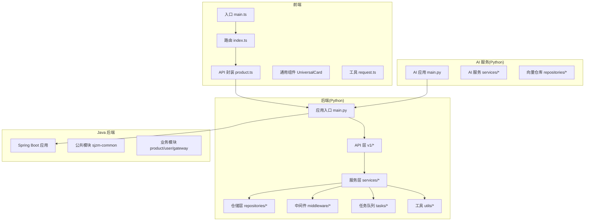
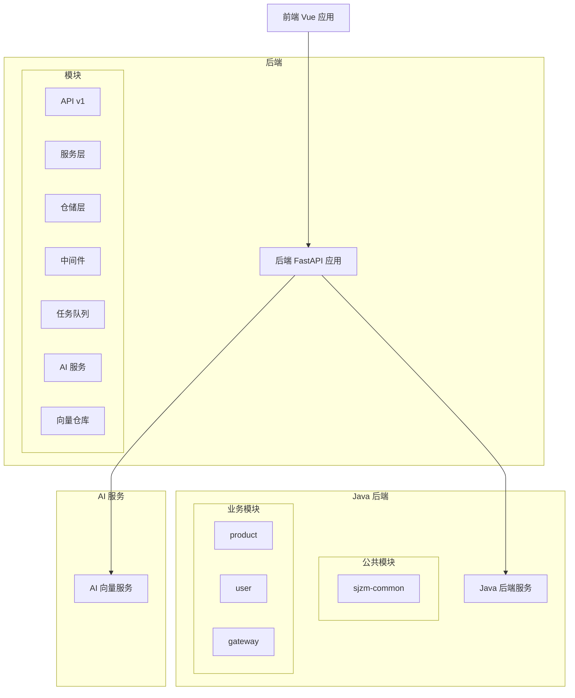
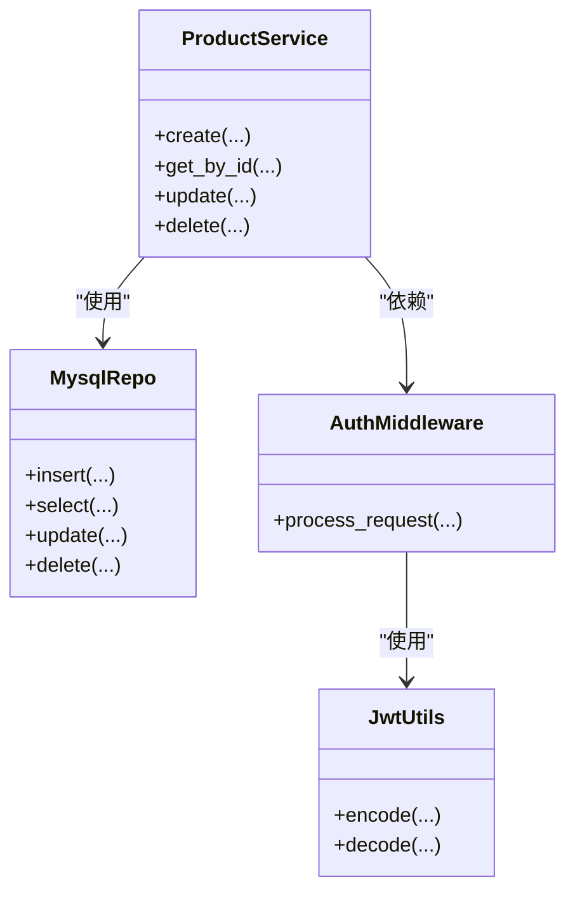
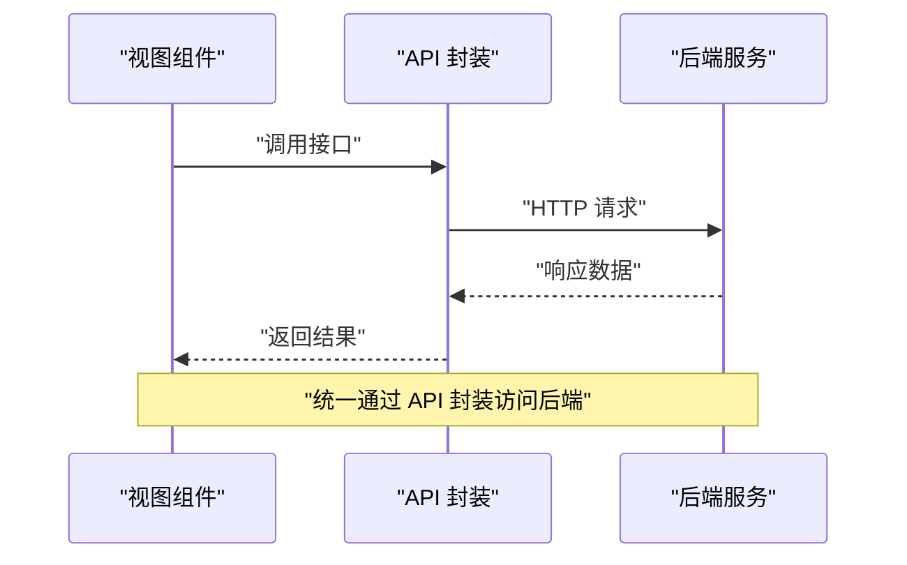
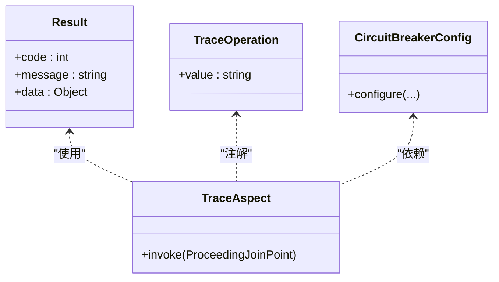
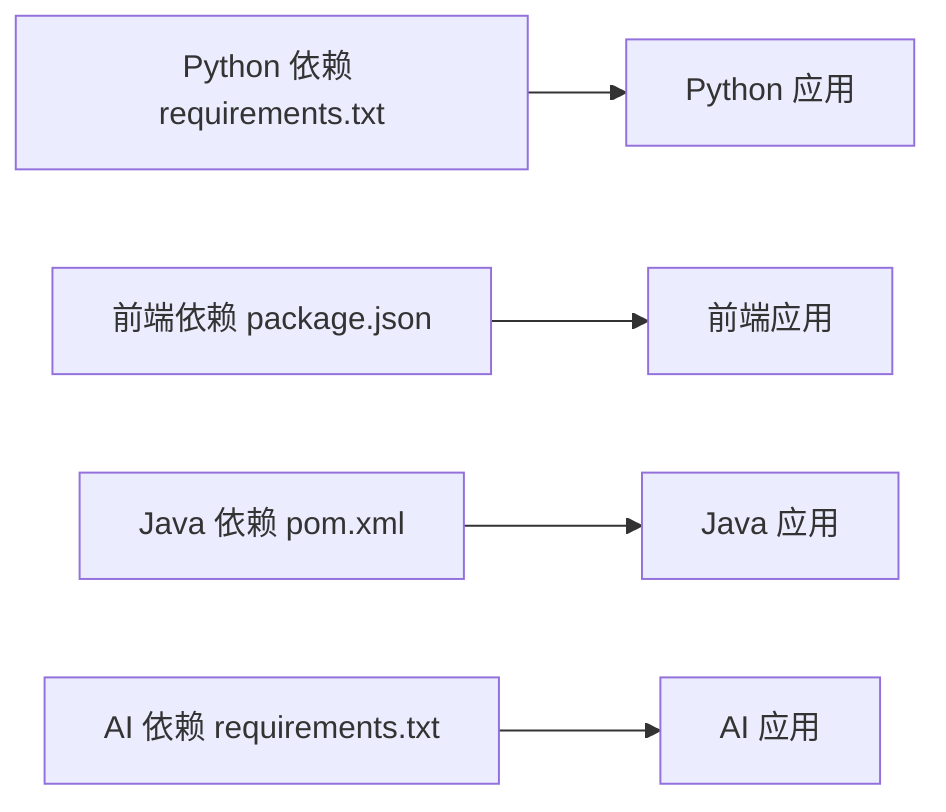

# 代码规范

<cite>
**本文档引用的文件**
- [backend/requirements.txt](file://backend/requirements.txt)
- [backend/app/main.py](file://backend/app/main.py)
- [backend/app/api/v1/__init__.py](file://backend/app/api/v1/__init__.py)
- [backend/app/api/v1/auth.py](file://backend/app/api/v1/auth.py)
- [backend/app/middleware/auth_middleware.py](file://backend/app/middleware/auth_middleware.py)
- [backend/app/utils/jwt_utils.py](file://backend/app/utils/jwt_utils.py)
- [backend/app/services/product_service.py](file://backend/app/services/product_service.py)
- [backend/app/repositories/mysql_repo.py](file://backend/app/repositories/mysql_repo.py)
- [backend/app/tasks/celery_app.py](file://backend/app/tasks/celery_app.py)
- [backend/scripts/check_database_tables.py](file://backend/scripts/check_database_tables.py)
- [frontend/package.json](file://frontend/package.json)
- [frontend/.eslintrc.js](file://frontend/.eslintrc.js)
- [frontend/.stylelintrc.js](file://frontend/.stylelintrc.js)
- [frontend/prettier.config.js](file://frontend/prettier.config.js)
- [frontend/vue-pure-admin/eslint.config.js](file://frontend/vue-pure-admin/eslint.config.js)
- [frontend/vue-pure-admin/stylelint.config.js](file://frontend/vue-pure-admin/stylelint.config.js)
- [frontend/vue-pure-admin/.prettierrc.js](file://frontend/vue-pure-admin/.prettierrc.js)
- [frontend/src/main.ts](file://frontend/src/main.ts)
- [frontend/src/api/product.ts](file://frontend/src/api/product.ts)
- [frontend/src/components/UniversalCard/index.vue](file://frontend/src/components/UniversalCard/index.vue)
- [frontend/src/utils/request.ts](file://frontend/src/utils/request.ts)
- [frontend/src/router/index.ts](file://frontend/src/router/index.ts)
- [frontend/vue-admin-better/layouts/Permissions/permissions.js](file://frontend/vue-admin-better/layouts/Permissions/permissions.js)
- [frontend/vue-admin-better/layouts/prettier.config.js](file://frontend/vue-admin-better/layouts/prettier.config.js)
- [frontend/vite.config.js](file://frontend/vite.config.js)
- [frontend/tsconfig.json](file://frontend/tsconfig.json)
- [frontend/vue-pure-admin/tsconfig.json](file://frontend/vue-pure-admin/tsconfig.json)
- [java-backend/pom.xml](file://java-backend/pom.xml)
- [java-backend/sjzm-common/src/main/java/com/sjzm/common/Result.java](file://java-backend/sjzm-common/src/main/java/com/sjzm/common/Result.java)
- [java-backend/sjzm-common/src/main/java/com/sjzm/annotation/TraceOperation.java](file://java-backend/sjzm-common/src/main/java/com/sjzm/annotation/TraceOperation.java)
- [java-backend/sjzm-common/src/main/java/com/sjzm/aspect/TraceAspect.java](file://java-backend/sjzm-common/src/main/java/com/sjzm/aspect/TraceAspect.java)
- [java-backend/sjzm-common/src/main/java/com/sjzm/config/CircuitBreakerConfig.java](file://java-backend/sjzm-common/src/main/java/com/sjzm/config/CircuitBreakerConfig.java)
- [java-backend/src/main/resources/application.yml](file://java-backend/src/main/resources/application.yml)
- [python-ai/requirements.txt](file://python-ai/requirements.txt)
- [python-ai/app/main.py](file://python-ai/app/main.py)
- [python-ai/app/services/vector_service.py](file://python-ai/app/services/vector_service.py)
- [python-ai/app/repositories/qdrant_repo.py](file://python-ai/app/repositories/qdrant_repo.py)
- [scripts/ci/workflows/naming-convention-check.yml](file://scripts/ci/workflows/naming-convention-check.yml)
- [backend/.gitignore](file://backend/.gitignore)
- [frontend/.dockerignore](file://frontend/.dockerignore)
- [java-backend/Dockerfile](file://java-backend/Dockerfile)
- [backend/Dockerfile](file://backend/Dockerfile)
- [frontend/Dockerfile](file://frontend/Dockerfile)
</cite>

## 目录
1. 引言
2. 项目结构
3. 核心组件
4. 架构总览
5. 详细组件分析
6. 依赖分析
7. 性能考虑
8. 故障排查指南
9. 结论
10. 附录

## 引言
本文件为“思觉智贸”项目制定统一的代码规范，覆盖 Python、JavaScript/TypeScript、Java 三类语言，明确命名约定、缩进与注释标准、代码结构要求，并配套格式化工具配置与自动格式化流程。规范同时强调模块划分、依赖管理、循环引用规避、模块解耦与接口设计原则，确保跨语言项目的代码一致性与可维护性。

## 项目结构
项目采用多语言分层与模块化组织：
- 后端（Python/FastAPI）：按领域与层次划分 API、中间件、模型、仓储、服务、任务与工具模块，便于职责清晰与扩展。
- 前端（Vue3/Vite）：按页面视图、通用组件、状态管理、路由、API 封装、工具库组织，支持模块化开发与测试。
- Java 后端（Spring Boot/Maven）：采用多模块聚合工程，公共模块封装通用注解、切面、异常与配置，业务模块按领域拆分。
- 脚本与 CI：提供数据库校验脚本、CI 工作流与命名规范检查，保障质量门禁。

图表来源
- [frontend/src/main.ts:1-50](file://frontend/src/main.ts#L1-L50)
- [frontend/src/router/index.ts:1-50](file://frontend/src/router/index.ts#L1-L50)
- [frontend/src/api/product.ts:1-100](file://frontend/src/api/product.ts#L1-L100)
- [frontend/src/components/UniversalCard/index.vue:1-120](file://frontend/src/components/UniversalCard/index.vue#L1-L120)
- [frontend/src/utils/request.ts:1-120](file://frontend/src/utils/request.ts#L1-L120)
- [backend/app/main.py:1-120](file://backend/app/main.py#L1-L120)
- [backend/app/api/v1/__init__.py:1-50](file://backend/app/api/v1/__init__.py#L1-L50)
- [backend/app/services/product_service.py:1-120](file://backend/app/services/product_service.py#L1-L120)
- [backend/app/repositories/mysql_repo.py:1-120](file://backend/app/repositories/mysql_repo.py#L1-L120)
- [backend/app/middleware/auth_middleware.py:1-120](file://backend/app/middleware/auth_middleware.py#L1-L120)
- [backend/app/tasks/celery_app.py:1-120](file://backend/app/tasks/celery_app.py#L1-L120)
- [backend/app/utils/jwt_utils.py:1-120](file://backend/app/utils/jwt_utils.py#L1-L120)
- [java-backend/sjzm-common/src/main/java/com/sjzm/common/Result.java:1-120](file://java-backend/sjzm-common/src/main/java/com/sjzm/common/Result.java#L1-L120)
- [python-ai/app/main.py:1-120](file://python-ai/app/main.py#L1-L120)
- [python-ai/app/services/vector_service.py:1-120](file://python-ai/app/services/vector_service.py#L1-L120)
- [python-ai/app/repositories/qdrant_repo.py:1-120](file://python-ai/app/repositories/qdrant_repo.py#L1-L120)

章节来源
- [backend/app/main.py:1-120](file://backend/app/main.py#L1-L120)
- [frontend/src/main.ts:1-50](file://frontend/src/main.ts#L1-L50)
- [java-backend/pom.xml:1-200](file://java-backend/pom.xml#L1-L200)

## 核心组件
本节从语言维度给出核心规范要点与最佳实践路径，帮助团队在不同技术栈下保持一致的代码风格与质量。

- Python 规范
  - 命名：模块与包使用蛇形命名；类使用帕斯卡命名；函数与变量使用蛇形命名；常量使用全大写下划线；保护成员以下划线前缀；私有成员以下划线前缀；魔法方法保留双下划线。
  - 缩进：统一使用 4 空格缩进，禁止混用制表符。
  - 注释：模块顶部含简要说明；函数/类含 docstring；复杂逻辑含行内注释；TODO/NOTE 使用统一格式。
  - 结构：按领域分层（API/中间件/服务/仓储/任务/工具），避免跨层直接调用；使用类型提示；遵循 PEP 8。
  - 格式化：使用 Black 进行自动格式化；配合 Flake8/Pyright 进行静态检查；在 CI 中执行格式化与检查。
  - 示例路径：模块初始化与 API 路由、认证中间件、JWT 工具、服务与仓储、任务队列与工具等。

- JavaScript/TypeScript 规范
  - 命名：文件与目录使用中划线或小驼峰；类/接口/类型使用帕斯卡命名；函数/变量使用小驼峰；常量使用全大写；枚举使用帕斯卡命名。
  - 缩进：统一使用 2 空格缩进；TS 文件严格启用类型检查。
  - 注释：函数/接口含 JSDoc；复杂分支含注释；TODO/NOTE 统一格式。
  - 结构：按功能域划分模块；API 封装统一入口；组件按职责拆分；路由与状态管理清晰；工具函数独立模块。
  - 格式化：使用 Prettier 统一格式；ESLint 规则约束语法与风格；Stylelint 约束样式；在 CI 中执行格式化与检查。
  - 示例路径：入口文件、路由、API 封装、通用组件、请求工具、Vite 配置、TS 配置等。

- Java 规范
  - 命名：包名全小写；类/接口使用帕斯卡命名；方法/变量使用小驼峰；常量全大写；枚举全大写；抽象类/接口前缀使用 I/Abs 等约定。
  - 缩进：统一使用 4 空格；大括号换行风格；链式调用对齐。
  - 注释：类/接口含 Javadoc；方法含参数与返回值说明；复杂逻辑含注释；TODO/NOTE 统一格式。
  - 结构：多模块聚合工程；公共模块抽取通用注解、切面、异常与配置；业务模块按领域拆分；DTO/VO 分离；Repository/Service 分层。
  - 格式化：使用 Maven 插件与 IDE 格式化；统一编码与换行；在 CI 中执行格式化与检查。
  - 示例路径：公共模块 Result、注解与切面、配置类、业务模块与资源文件等。

章节来源
- [backend/app/api/v1/__init__.py:1-50](file://backend/app/api/v1/__init__.py#L1-L50)
- [backend/app/middleware/auth_middleware.py:1-120](file://backend/app/middleware/auth_middleware.py#L1-L120)
- [backend/app/utils/jwt_utils.py:1-120](file://backend/app/utils/jwt_utils.py#L1-L120)
- [frontend/src/api/product.ts:1-100](file://frontend/src/api/product.ts#L1-L100)
- [frontend/src/utils/request.ts:1-120](file://frontend/src/utils/request.ts#L1-L120)
- [frontend/src/components/UniversalCard/index.vue:1-120](file://frontend/src/components/UniversalCard/index.vue#L1-L120)
- [java-backend/sjzm-common/src/main/java/com/sjzm/common/Result.java:1-120](file://java-backend/sjzm-common/src/main/java/com/sjzm/common/Result.java#L1-L120)
- [java-backend/sjzm-common/src/main/java/com/sjzm/annotation/TraceOperation.java:1-120](file://java-backend/sjzm-common/src/main/java/com/sjzm/annotation/TraceOperation.java#L1-L120)
- [java-backend/sjzm-common/src/main/java/com/sjzm/aspect/TraceAspect.java:1-120](file://java-backend/sjzm-common/src/main/java/com/sjzm/aspect/TraceAspect.java#L1-L120)

## 架构总览
跨语言架构通过统一的 API 约定与数据模型实现互通：
- 前端通过 API 封装访问后端服务，后端服务再调用 Java 后端或 AI 服务。
- 后端与 Java 后端通过 HTTP 接口交互，Java 后端内部模块解耦，公共模块提供横切能力。
- AI 服务作为独立 Python 应用，通过 HTTP 或消息队列与主后端协作。

图表来源
- [backend/app/main.py:1-120](file://backend/app/main.py#L1-L120)
- [java-backend/sjzm-common/src/main/java/com/sjzm/common/Result.java:1-120](file://java-backend/sjzm-common/src/main/java/com/sjzm/common/Result.java#L1-L120)
- [python-ai/app/main.py:1-120](file://python-ai/app/main.py#L1-L120)

## 详细组件分析

### Python 组件规范
- 命名约定
  - 模块与包：snake_case；例如 [backend/app/api/v1/__init__.py:1-50](file://backend/app/api/v1/__init__.py#L1-L50)。
  - 类：PascalCase；例如 [backend/app/services/product_service.py:1-120](file://backend/app/services/product_service.py#L1-L120)。
  - 函数/变量：snake_case；例如 [backend/app/utils/jwt_utils.py:1-120](file://backend/app/utils/jwt_utils.py#L1-L120)。
  - 常量：UPPER_CASE；例如 [backend/app/repositories/mysql_repo.py:1-120](file://backend/app/repositories/mysql_repo.py#L1-L120)。
  - 私有/受保护：_private/_protected；例如 [backend/app/middleware/auth_middleware.py:1-120](file://backend/app/middleware/auth_middleware.py#L1-L120)。
- 缩进与格式
  - 4 空格缩进；统一使用 Black；在 CI 中执行格式化与检查。
- 注释与文档
  - 模块顶部说明；函数/类含 docstring；复杂逻辑含行内注释；TODO/NOTE 统一格式。
- 结构与职责
  - API 层负责路由与请求处理；服务层负责业务编排；仓储层负责数据访问；中间件负责横切；任务队列负责异步；工具模块提供通用能力。
- 示例路径
  - [backend/app/api/v1/auth.py:1-120](file://backend/app/api/v1/auth.py#L1-L120)
  - [backend/app/middleware/auth_middleware.py:1-120](file://backend/app/middleware/auth_middleware.py#L1-L120)
  - [backend/app/utils/jwt_utils.py:1-120](file://backend/app/utils/jwt_utils.py#L1-L120)
  - [backend/app/services/product_service.py:1-120](file://backend/app/services/product_service.py#L1-L120)
  - [backend/app/repositories/mysql_repo.py:1-120](file://backend/app/repositories/mysql_repo.py#L1-L120)
  - [backend/app/tasks/celery_app.py:1-120](file://backend/app/tasks/celery_app.py#L1-L120)

图表来源
- [backend/app/services/product_service.py:1-120](file://backend/app/services/product_service.py#L1-L120)
- [backend/app/repositories/mysql_repo.py:1-120](file://backend/app/repositories/mysql_repo.py#L1-L120)
- [backend/app/middleware/auth_middleware.py:1-120](file://backend/app/middleware/auth_middleware.py#L1-L120)
- [backend/app/utils/jwt_utils.py:1-120](file://backend/app/utils/jwt_utils.py#L1-L120)

章节来源
- [backend/app/api/v1/__init__.py:1-50](file://backend/app/api/v1/__init__.py#L1-L50)
- [backend/app/api/v1/auth.py:1-120](file://backend/app/api/v1/auth.py#L1-L120)
- [backend/app/middleware/auth_middleware.py:1-120](file://backend/app/middleware/auth_middleware.py#L1-L120)
- [backend/app/utils/jwt_utils.py:1-120](file://backend/app/utils/jwt_utils.py#L1-L120)
- [backend/app/services/product_service.py:1-120](file://backend/app/services/product_service.py#L1-L120)
- [backend/app/repositories/mysql_repo.py:1-120](file://backend/app/repositories/mysql_repo.py#L1-L120)
- [backend/app/tasks/celery_app.py:1-120](file://backend/app/tasks/celery_app.py#L1-L120)

### JavaScript/TypeScript 组件规范
- 命名约定
  - 文件与目录：kebab-case 或 camelCase；例如 [frontend/src/api/product.ts:1-100](file://frontend/src/api/product.ts#L1-L100)。
  - 类/接口/类型：PascalCase；例如 [frontend/src/types/common.ts:1-120](file://frontend/src/types/common.ts#L1-L120)。
  - 函数/变量：camelCase；例如 [frontend/src/utils/request.ts:1-120](file://frontend/src/utils/request.ts#L1-L120)。
  - 常量：UPPER_CASE；例如 [frontend/src/utils/storage.ts:1-120](file://frontend/src/utils/storage.ts#L1-L120)。
- 缩进与格式
  - 2 空格缩进；TS 严格类型检查；统一使用 Prettier；ESLint 与 Stylelint 约束。
- 注释与文档
  - 函数/接口含 JSDoc；复杂分支含注释；TODO/NOTE 统一格式。
- 结构与职责
  - 入口文件负责应用初始化；路由负责页面导航；API 封装统一请求；通用组件复用性强；工具函数独立模块；TS 配置统一。
- 示例路径
  - [frontend/src/main.ts:1-50](file://frontend/src/main.ts#L1-L50)
  - [frontend/src/router/index.ts:1-50](file://frontend/src/router/index.ts#L1-L50)
  - [frontend/src/api/product.ts:1-100](file://frontend/src/api/product.ts#L1-L100)
  - [frontend/src/components/UniversalCard/index.vue:1-120](file://frontend/src/components/UniversalCard/index.vue#L1-L120)
  - [frontend/src/utils/request.ts:1-120](file://frontend/src/utils/request.ts#L1-L120)
  - [frontend/vite.config.js:1-120](file://frontend/vite.config.js#L1-L120)
  - [frontend/tsconfig.json:1-120](file://frontend/tsconfig.json#L1-L120)
  - [frontend/vue-pure-admin/tsconfig.json:1-120](file://frontend/vue-pure-admin/tsconfig.json#L1-L120)

图表来源
- [frontend/src/api/product.ts:1-100](file://frontend/src/api/product.ts#L1-L100)
- [frontend/src/utils/request.ts:1-120](file://frontend/src/utils/request.ts#L1-L120)
- [backend/app/main.py:1-120](file://backend/app/main.py#L1-L120)

章节来源
- [frontend/src/main.ts:1-50](file://frontend/src/main.ts#L1-L50)
- [frontend/src/router/index.ts:1-50](file://frontend/src/router/index.ts#L1-L50)
- [frontend/src/api/product.ts:1-100](file://frontend/src/api/product.ts#L1-L100)
- [frontend/src/components/UniversalCard/index.vue:1-120](file://frontend/src/components/UniversalCard/index.vue#L1-L120)
- [frontend/src/utils/request.ts:1-120](file://frontend/src/utils/request.ts#L1-L120)
- [frontend/vite.config.js:1-120](file://frontend/vite.config.js#L1-L120)
- [frontend/tsconfig.json:1-120](file://frontend/tsconfig.json#L1-L120)
- [frontend/vue-pure-admin/tsconfig.json:1-120](file://frontend/vue-pure-admin/tsconfig.json#L1-L120)

### Java 组件规范
- 命名约定
  - 包名：全小写；例如 [java-backend/sjzm-common/src/main/java/com/sjzm/common/Result.java:1-120](file://java-backend/sjzm-common/src/main/java/com/sjzm/common/Result.java#L1-L120)。
  - 类/接口：PascalCase；例如 [java-backend/sjzm-common/src/main/java/com/sjzm/annotation/TraceOperation.java:1-120](file://java-backend/sjzm-common/src/main/java/com/sjzm/annotation/TraceOperation.java#L1-L120)。
  - 方法/变量：camelCase；例如 [java-backend/sjzm-common/src/main/java/com/sjzm/aspect/TraceAspect.java:1-120](file://java-backend/sjzm-common/src/main/java/com/sjzm/aspect/TraceAspect.java#L1-L120)。
  - 常量：UPPER_CASE；例如 [java-backend/sjzm-common/src/main/java/com/sjzm/config/CircuitBreakerConfig.java:1-120](file://java-backend/sjzm-common/src/main/java/com/sjzm/config/CircuitBreakerConfig.java#L1-L120)。
- 缩进与格式
  - 4 空格缩进；统一编码与换行；IDE 格式化；Maven 插件辅助。
- 注释与文档
  - 类/接口含 Javadoc；方法含参数与返回值说明；复杂逻辑含注释；TODO/NOTE 统一格式。
- 结构与职责
  - 多模块聚合工程；公共模块抽取通用注解、切面、异常与配置；业务模块按领域拆分；DTO/VO 分离；Repository/Service 分层。
- 示例路径
  - [java-backend/sjzm-common/src/main/java/com/sjzm/common/Result.java:1-120](file://java-backend/sjzm-common/src/main/java/com/sjzm/common/Result.java#L1-L120)
  - [java-backend/sjzm-common/src/main/java/com/sjzm/annotation/TraceOperation.java:1-120](file://java-backend/sjzm-common/src/main/java/com/sjzm/annotation/TraceOperation.java#L1-L120)
  - [java-backend/sjzm-common/src/main/java/com/sjzm/aspect/TraceAspect.java:1-120](file://java-backend/sjzm-common/src/main/java/com/sjzm/aspect/TraceAspect.java#L1-L120)
  - [java-backend/sjzm-common/src/main/java/com/sjzm/config/CircuitBreakerConfig.java:1-120](file://java-backend/sjzm-common/src/main/java/com/sjzm/config/CircuitBreakerConfig.java#L1-L120)
  - [java-backend/src/main/resources/application.yml:1-200](file://java-backend/src/main/resources/application.yml#L1-L200)

图表来源
- [java-backend/sjzm-common/src/main/java/com/sjzm/common/Result.java:1-120](file://java-backend/sjzm-common/src/main/java/com/sjzm/common/Result.java#L1-L120)
- [java-backend/sjzm-common/src/main/java/com/sjzm/annotation/TraceOperation.java:1-120](file://java-backend/sjzm-common/src/main/java/com/sjzm/annotation/TraceOperation.java#L1-L120)
- [java-backend/sjzm-common/src/main/java/com/sjzm/aspect/TraceAspect.java:1-120](file://java-backend/sjzm-common/src/main/java/com/sjzm/aspect/TraceAspect.java#L1-L120)
- [java-backend/sjzm-common/src/main/java/com/sjzm/config/CircuitBreakerConfig.java:1-120](file://java-backend/sjzm-common/src/main/java/com/sjzm/config/CircuitBreakerConfig.java#L1-L120)

章节来源
- [java-backend/sjzm-common/src/main/java/com/sjzm/common/Result.java:1-120](file://java-backend/sjzm-common/src/main/java/com/sjzm/common/Result.java#L1-L120)
- [java-backend/sjzm-common/src/main/java/com/sjzm/annotation/TraceOperation.java:1-120](file://java-backend/sjzm-common/src/main/java/com/sjzm/annotation/TraceOperation.java#L1-L120)
- [java-backend/sjzm-common/src/main/java/com/sjzm/aspect/TraceAspect.java:1-120](file://java-backend/sjzm-common/src/main/java/com/sjzm/aspect/TraceAspect.java#L1-L120)
- [java-backend/sjzm-common/src/main/java/com/sjzm/config/CircuitBreakerConfig.java:1-120](file://java-backend/sjzm-common/src/main/java/com/sjzm/config/CircuitBreakerConfig.java#L1-L120)
- [java-backend/src/main/resources/application.yml:1-200](file://java-backend/src/main/resources/application.yml#L1-L200)

### AI 服务组件规范
- 命名与结构
  - 模块化组织：API、服务、仓库；命名与 Python 后端一致；类型提示与格式化工具同 Python。
- 示例路径
  - [python-ai/app/main.py:1-120](file://python-ai/app/main.py#L1-L120)
  - [python-ai/app/services/vector_service.py:1-120](file://python-ai/app/services/vector_service.py#L1-L120)
  - [python-ai/app/repositories/qdrant_repo.py:1-120](file://python-ai/app/repositories/qdrant_repo.py#L1-L120)

章节来源
- [python-ai/app/main.py:1-120](file://python-ai/app/main.py#L1-L120)
- [python-ai/app/services/vector_service.py:1-120](file://python-ai/app/services/vector_service.py#L1-L120)
- [python-ai/app/repositories/qdrant_repo.py:1-120](file://python-ai/app/repositories/qdrant_repo.py#L1-L120)

## 依赖分析
- Python 后端依赖管理
  - 使用 requirements.txt 管理依赖；建议使用 pip-tools 或 Poetry 管理版本锁定与升级。
  - 示例路径：[backend/requirements.txt:1-200](file://backend/requirements.txt#L1-L200)
- 前端依赖管理
  - 使用 package.json 管理依赖；ESLint/Stylelint/Prettier 配置在根目录与子工程中分别维护。
  - 示例路径：[frontend/package.json:1-200](file://frontend/package.json#L1-L200)、[frontend/.eslintrc.js:1-200](file://frontend/.eslintrc.js#L1-L200)、[frontend/.stylelintrc.js:1-200](file://frontend/.stylelintrc.js#L1-L200)、[frontend/prettier.config.js:1-200](file://frontend/prettier.config.js#L1-L200)、[frontend/vue-pure-admin/eslint.config.js:1-200](file://frontend/vue-pure-admin/eslint.config.js#L1-L200)、[frontend/vue-pure-admin/stylelint.config.js:1-200](file://frontend/vue-pure-admin/stylelint.config.js#L1-L200)、[frontend/vue-pure-admin/.prettierrc.js:1-200](file://frontend/vue-pure-admin/.prettierrc.js#L1-L200)
- Java 后端依赖管理
  - 使用 Maven pom.xml 管理依赖与插件；多模块聚合工程；公共模块抽取横切能力。
  - 示例路径：[java-backend/pom.xml:1-200](file://java-backend/pom.xml#L1-L200)
- AI 服务依赖管理
  - 使用 requirements.txt 管理依赖；建议与后端保持一致的依赖管理策略。
  - 示例路径：[python-ai/requirements.txt:1-200](file://python-ai/requirements.txt#L1-L200)

图表来源
- [backend/requirements.txt:1-200](file://backend/requirements.txt#L1-L200)
- [frontend/package.json:1-200](file://frontend/package.json#L1-L200)
- [java-backend/pom.xml:1-200](file://java-backend/pom.xml#L1-L200)
- [python-ai/requirements.txt:1-200](file://python-ai/requirements.txt#L1-L200)

章节来源
- [backend/requirements.txt:1-200](file://backend/requirements.txt#L1-L200)
- [frontend/package.json:1-200](file://frontend/package.json#L1-L200)
- [java-backend/pom.xml:1-200](file://java-backend/pom.xml#L1-L200)
- [python-ai/requirements.txt:1-200](file://python-ai/requirements.txt#L1-L200)

## 性能考虑
- Python
  - 使用类型提示提升静态检查效率；避免全局变量与重复计算；合理使用缓存与连接池；日志级别控制；异步任务队列处理耗时操作。
- JavaScript/TypeScript
  - 合理拆分组件与懒加载；减少不必要的重渲染；使用防抖与节流；统一请求合并与缓存；构建产物按需加载。
- Java
  - 合理配置线程池与超时；使用连接池与缓存；监控与熔断；异步处理与消息队列；资源文件集中管理。

## 故障排查指南
- 命名规范检查
  - 在 CI 中执行命名规范检查工作流，确保跨语言项目命名一致性。
  - 示例路径：[scripts/ci/workflows/naming-convention-check.yml:1-200](file://scripts/ci/workflows/naming-convention-check.yml#L1-L200)
- 版本与依赖冲突
  - Python：使用虚拟环境与锁定文件；前端：lock 文件与固定版本；Java：Maven 依赖解析与传递性管理。
- 日志与监控
  - 后端与 Java 后端统一日志输出与级别；前端统一错误上报；AI 服务统一指标采集。
- Docker 与部署
  - 后端、前端、Java 后端分别提供 Dockerfile；.dockerignore 与 .gitignore 规范排除无关文件。
  - 示例路径：[backend/Dockerfile:1-200](file://backend/Dockerfile#L1-L200)、[frontend/Dockerfile:1-200](file://frontend/Dockerfile#L1-L200)、[java-backend/Dockerfile:1-200](file://java-backend/Dockerfile#L1-L200)、[backend/.gitignore:1-200](file://backend/.gitignore#L1-L200)、[frontend/.dockerignore:1-200](file://frontend/.dockerignore#L1-L200)

章节来源
- [scripts/ci/workflows/naming-convention-check.yml:1-200](file://scripts/ci/workflows/naming-convention-check.yml#L1-L200)
- [backend/Dockerfile:1-200](file://backend/Dockerfile#L1-L200)
- [frontend/Dockerfile:1-200](file://frontend/Dockerfile#L1-L200)
- [java-backend/Dockerfile:1-200](file://java-backend/Dockerfile#L1-L200)
- [backend/.gitignore:1-200](file://backend/.gitignore#L1-L200)
- [frontend/.dockerignore:1-200](file://frontend/.dockerignore#L1-L200)

## 结论
通过统一的命名约定、缩进与注释标准、模块划分与依赖管理规范，以及格式化工具与 CI 的自动化保障，思觉智贸项目可在 Python、JavaScript/TypeScript、Java 三大语言栈上实现一致的代码风格与高质量交付。建议持续完善 CI 工作流与文档，推动团队形成良好的编码习惯与协作机制。

## 附录
- 代码格式化工具与配置
  - Python：Black、Flake8、Pyright；在 CI 中执行格式化与静态检查。
  - JavaScript/TypeScript：Prettier、ESLint、Stylelint；在 CI 中执行格式化与检查。
  - Java：Maven 插件与 IDE 格式化；统一编码与换行。
- 自动格式化流程
  - 前端：在提交前执行 Prettier、ESLint、Stylelint；在 CI 中再次校验。
  - 后端：在提交前执行 Black、Flake8、类型检查；在 CI 中再次校验。
  - Java：在提交前执行 IDE 格式化与 Maven 插件；在 CI 中再次校验。
- 循环引用避免与模块解耦
  - 通过分层与接口隔离避免循环依赖；服务层不直接依赖仓储层实现；组件间通过接口通信；工具模块无业务耦合。
- 接口设计原则
  - 统一的 API 命名与返回结构；前后端约定一致的数据模型；错误码与消息标准化；鉴权与限流策略统一。