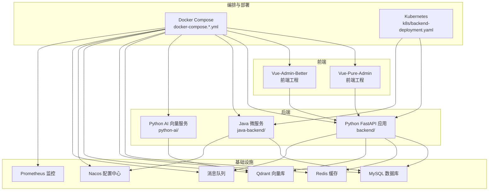
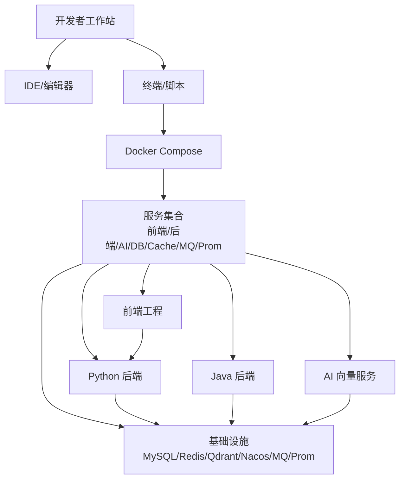
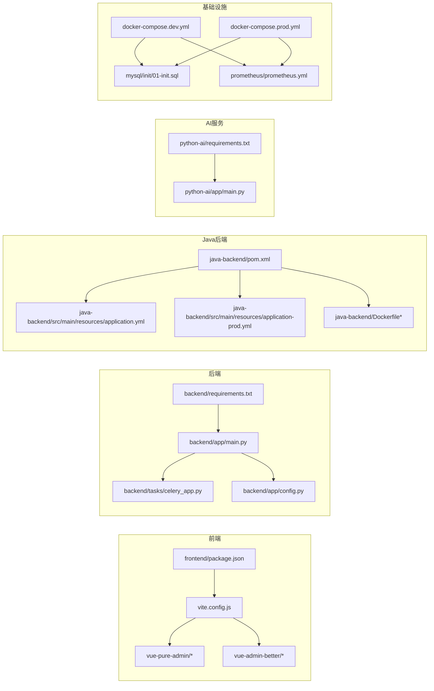

# 环境配置

<cite>
**本文引用的文件**
- [dev.sh](file://dev.sh)
- [prod.sh](file://prod.sh)
- [docker-compose.yml](file://docker-compose.yml)
- [docker-compose.dev.yml](file://docker-compose.dev.yml)
- [docker-compose.prod.yml](file://docker-compose.prod.yml)
- [docker-compose.prod-simple.yml](file://docker-compose.prod-simple.yml)
- [docker-compose.base.yml](file://docker-compose.base.yml)
- [backend/Dockerfile](file://backend/Dockerfile)
- [backend/Dockerfile.dev](file://backend/Dockerfile.dev)
- [backend/start_java_dev.py](file://backend/start_java_dev.py)
- [backend/start_vite_dev.py](file://backend/start_vite_dev.py)
- [backend/requirements.txt](file://backend/requirements.txt)
- [backend/config.py](file://backend/config.py)
- [backend/app/main.py](file://backend/app/main.py)
- [backend/app/config.py](file://backend/app/config.py)
- [frontend/package.json](file://frontend/package.json)
- [frontend/vite.config.js](file://frontend/vite.config.js)
- [frontend/tsconfig.json](file://frontend/tsconfig.json)
- [frontend/vue-pure-admin/tsconfig.json](file://frontend/vue-pure-admin/tsconfig.json)
- [frontend/vue-pure-admin/pnpm-lock.yaml](file://frontend/vue-pure-admin/pnpm-lock.yaml)
- [frontend/vue-pure-admin/.prettierrc.js](file://frontend/vue-pure-admin/.prettierrc.js)
- [frontend/vue-pure-admin/eslint.config.js](file://frontend/vue-pure-admin/eslint.config.js)
- [frontend/vue-pure-admin/stylelint.config.js](file://frontend/vue-pure-admin/stylelint.config.js)
- [frontend/vue-pure-admin/postcss.config.js](file://frontend/vue-pure-admin/postcss.config.js)
- [frontend/vue-pure-admin/.stylelintignore](file://frontend/vue-pure-admin/.stylelintignore)
- [frontend/vue-pure-admin/.lintstagedrc](file://frontend/vue-pure-admin/.lintstagedrc)
- [frontend/vue-pure-admin/.markdownlint.json](file://frontend/vue-pure-admin/.markdownlint.json)
- [frontend/vue-pure-admin/.npmrc](file://frontend/vue-pure-admin/.npmrc)
- [frontend/vue-pure-admin/.browserslistrc](file://frontend/vue-pure-admin/.browserslistrc)
- [frontend/vue-pure-admin/README.md](file://frontend/vue-pure-admin/README.md)
- [frontend/vue-pure-admin/deploy.sh](file://frontend/vue-pure-admin/deploy.sh)
- [frontend/vue-pure-admin/push.sh](file://frontend/vue-pure-admin/push.sh)
- [frontend/vue-admin-better/package.json](file://frontend/vue-admin-better/package.json)
- [frontend/vue-admin-better/rspack.config.js](file://frontend/vue-admin-better/rspack.config.js)
- [frontend/vue-admin-better/babel.config.js](file://frontend/vue-admin-better/babel.config.js)
- [frontend/vue-admin-better/.editorconfig](file://frontend/vue-admin-better/.editorconfig)
- [frontend/vue-admin-better/.eslintignore](file://frontend/vue-admin-better/.eslintignore)
- [frontend/vue-admin-better/.eslintrc.cjs](file://frontend/vue-admin-better/.eslintrc.cjs)
- [frontend/vue-admin-better/.stylelintrc.js](file://frontend/vue-admin-better/.stylelintrc.js)
- [frontend/vue-admin-better/README.md](file://frontend/vue-admin-better/README.md)
- [frontend/vue-admin-better/deploy.sh](file://frontend/vue-admin-better/deploy.sh)
- [frontend/vue-admin-better/push.sh](file://frontend/vue-admin-better/push.sh)
- [java-backend/pom.xml](file://java-backend/pom.xml)
- [java-backend/src/main/resources/application.yml](file://java-backend/src/main/resources/application.yml)
- [java-backend/src/main/resources/application-prod.yml](file://java-backend/src/main/resources/application-prod.yml)
- [java-backend/jvm-config/jvm-options.env](file://java-backend/jvm-config/jvm-options.env)
- [k8s/backend-deployment.yaml](file://k8s/backend-deployment.yaml)
- [prometheus/prometheus.yml](file://prometheus/prometheus.yml)
- [mysql/init/01-init.sql](file://mysql/init/01-init.sql)
- [scripts/environment/setup_dev_environment.py](file://scripts/environment/setup_dev_environment.py)
- [scripts/environment/create_dev_database.py](file://scripts/environment/create_dev_database.py)
- [scripts/environment/setup_frontend_isolation.py](file://scripts/environment/setup_frontend_isolation.py)
- [scripts/startup/start_with_hot_reload.py](file://scripts/startup/start_with_hot_reload.py)
- [scripts/startup/start_prod_multiprocess.py](file://scripts/startup/start_prod_multiprocess.py)
- [scripts/cleanup/cleanup_production_frontend.bat](file://scripts/cleanup/cleanup_production_frontend.bat)
- [scripts/deploy/deploy_frontend_to_production.bat](file://scripts/deploy/deploy_frontend_to_production.bat)
- [scripts/git_sync/git_sync_config.json](file://scripts/git_sync/git_sync_config.json)
- [scripts/git_sync/auto_sync.py](file://scripts/git_sync/auto_sync.py)
- [scripts/git_sync/git_manager.py](file://scripts/git_sync/git_manager.py)
- [scripts/git_sync/conflict_manager.py](file://scripts/git_sync/conflict_manager.py)
- [scripts/git_sync/hook_manager.py](file://scripts/git_sync/hook_manager.py)
- [scripts/monitoring/performance_monitor.py](file://scripts/monitoring/performance_monitor.py)
- [scripts/env_consistency/alert_system.py](file://scripts/env_consistency/alert_system.py)
- [scripts/env_consistency/core_validator.py](file://scripts/env_consistency/core_validator.py)
- [scripts/env_consistency/data_sync.py](file://scripts/env_consistency/data_sync.py)
- [scripts/env_consistency/validate_env_consistency.py](file://scripts/env_consistency/validate_env_consistency.py)
- [docs/development/standards.md](file://docs/development/standards.md)
- [docs/docker使用经验/README.md](file://docs/docker使用经验/README.md)
- [docs/docker使用经验/MySQL跨环境数据复制.md](file://docs/docker使用经验/MySQL跨环境数据复制.md)
- [docs/架构/Docker生产环境独立部署方案.md](file://docs/架构/Docker生产环境独立部署方案.md)
- [docs/生产部署检查清单.md](file://docs/生产部署检查清单.md)
- [docs/开发流程.md](file://docs/开发流程.md)
- [docs/项目自检清单.md](file://docs/项目自检清单.md)
- [.github/workflows/ci.yml](file://.github/workflows/ci.yml)
</cite>

## 目录
1. [简介](#简介)
2. [项目结构](#项目结构)
3. [核心组件](#核心组件)
4. [架构总览](#架构总览)
5. [详细组件分析](#详细组件分析)
6. [依赖关系分析](#依赖关系分析)
7. [性能考虑](#性能考虑)
8. [故障排查指南](#故障排查指南)
9. [结论](#结论)
10. [附录](#附录)

## 简介
本文件为“思觉智贸”项目的开发环境配置规范，旨在统一开发、测试与生产的环境标准，确保团队协作一致性与可重复性。内容覆盖IDE配置建议、依赖管理（Python虚拟环境、Node.js版本与包管理器、Java SDK）、环境变量与配置文件组织、Docker与容器编排、数据库与缓存、外部API密钥管理、开发工具链与调试、性能监控集成，以及一键初始化与部署脚本。

## 项目结构
项目采用多语言混合架构：前端基于Vue生态（含两个Admin主题工程），后端包含Python FastAPI应用、Java Spring Boot微服务网关与业务模块，AI向量服务独立运行，数据库与缓存通过Docker Compose编排，Kubernetes用于生产部署，Prometheus用于监控。

图示来源
- [docker-compose.yml](file://docker-compose.yml)
- [docker-compose.dev.yml](file://docker-compose.dev.yml)
- [docker-compose.prod.yml](file://docker-compose.prod.yml)
- [k8s/backend-deployment.yaml](file://k8s/backend-deployment.yaml)

章节来源
- [docker-compose.yml](file://docker-compose.yml)
- [docker-compose.dev.yml](file://docker-compose.dev.yml)
- [docker-compose.prod.yml](file://docker-compose.prod.yml)
- [k8s/backend-deployment.yaml](file://k8s/backend-deployment.yaml)

## 核心组件
- 前端工程（Vue）：提供两套Admin主题工程，分别位于frontend/vue-pure-admin与frontend/vue-admin-better，均包含完整的构建、打包与部署脚本。
- Python后端：FastAPI应用，负责API接口、任务调度、中间件与服务编排。
- Java后端：Spring Boot微服务，包含网关与业务模块，支持Docker镜像与生产部署。
- AI向量服务：独立的Python服务，对接Qdrant进行向量化检索。
- 数据库与缓存：MySQL、Redis、Qdrant通过Docker Compose统一编排。
- 监控：Prometheus配置文件与相关脚本。
- CI/CD：GitHub Actions工作流与本地一键脚本。

章节来源
- [frontend/package.json](file://frontend/package.json)
- [backend/app/main.py](file://backend/app/main.py)
- [java-backend/pom.xml](file://java-backend/pom.xml)
- [python-ai/requirements.txt](file://python-ai/requirements.txt)
- [prometheus/prometheus.yml](file://prometheus/prometheus.yml)
- [.github/workflows/ci.yml](file://.github/workflows/ci.yml)

## 架构总览
开发环境通过Docker Compose快速拉起完整栈；生产环境可选择Docker独立部署或Kubernetes编排。前端工程通过Vite/Rspack构建，后端通过Gunicorn/Uvicorn运行，Java后端通过Maven构建与Docker镜像发布。

图示来源
- [docker-compose.yml](file://docker-compose.yml)
- [backend/Dockerfile](file://backend/Dockerfile)
- [backend/Dockerfile.dev](file://backend/Dockerfile.dev)
- [java-backend/Dockerfile](file://java-backend/Dockerfile)
- [java-backend/Dockerfile.prod](file://java-backend/Dockerfile.prod)

## 详细组件分析

### IDE与编辑器配置
- 推荐使用JetBrains系列（PyCharm/IntelliJ/WebStorm）或VS Code，启用格式化、类型检查与ESLint/Prettier等自动修复。
- 团队已提供IDE Inspection Profiles与XML配置，建议在新成员入职时导入以统一风格。
- 前端工程包含多套ESLint、Stylelint、Prettier与Browserslist配置，建议在IDE中启用对应插件并绑定保存时自动修复。

章节来源
- [scripts/ide/inspectionProfiles/Project_Default.xml](file://scripts/ide/inspectionProfiles/Project_Default.xml)
- [frontend/vue-pure-admin/eslint.config.js](file://frontend/vue-pure-admin/eslint.config.js)
- [frontend/vue-pure-admin/.prettierrc.js](file://frontend/vue-pure-admin/.prettierrc.js)
- [frontend/vue-pure-admin/stylelint.config.js](file://frontend/vue-pure-admin/stylelint.config.js)
- [frontend/vue-admin-better/.eslintrc.cjs](file://frontend/vue-admin-better/.eslintrc.cjs)
- [frontend/vue-admin-better/.stylelintrc.js](file://frontend/vue-admin-better/.stylelintrc.js)

### Python虚拟环境与依赖管理
- 使用Python 3.10+，建议通过pyenv或conda管理版本，创建独立虚拟环境。
- 后端依赖集中于requirements.txt，AI服务独立requirements.txt，建议分环境安装。
- 本地开发可通过脚本启动后端与Celery任务，热重载与调试可通过脚本与配置实现。

章节来源
- [backend/requirements.txt](file://backend/requirements.txt)
- [python-ai/requirements.txt](file://python-ai/requirements.txt)
- [backend/start_java_dev.py](file://backend/start_java_dev.py)
- [backend/start_vite_dev.py](file://backend/start_vite_dev.py)

### Node.js版本与包管理器
- 建议使用nvm管理Node.js版本，优先使用LTS版本。
- 前端工程使用pnpm作为包管理器，建议在CI与本地保持版本一致。
- Vite与Rspack配置文件分别位于两套前端工程根目录，建议统一版本与依赖锁定文件。

章节来源
- [frontend/package.json](file://frontend/package.json)
- [frontend/vue-pure-admin/pnpm-lock.yaml](file://frontend/vue-pure-admin/pnpm-lock.yaml)
- [frontend/vue-admin-better/package.json](file://frontend/vue-admin-better/package.json)
- [frontend/vite.config.js](file://frontend/vite.config.js)
- [frontend/vue-admin-better/rspack.config.js](file://frontend/vue-admin-better/rspack.config.js)

### Java SDK与Maven配置
- Java后端使用Maven构建，建议使用OpenJDK 17+。
- 工程包含多模块（common/gateway/product/user），建议在IDE中导入聚合pom。
- JVM参数通过jvm-options.env注入，生产与开发镜像分别提供Dockerfile与prod镜像。

章节来源
- [java-backend/pom.xml](file://java-backend/pom.xml)
- [java-backend/jvm-config/jvm-options.env](file://java-backend/jvm-config/jvm-options.env)
- [java-backend/Dockerfile](file://java-backend/Dockerfile)
- [java-backend/Dockerfile.prod](file://java-backend/Dockerfile.prod)

### 环境变量与配置文件组织
- Python后端提供app/config.py与顶层config.py，建议区分开发/测试/生产环境，使用dotenv或容器环境变量注入。
- Java后端提供application.yml与application-prod.yml，建议通过Spring Profiles切换环境。
- 前端工程通过Vite与Rspack配置文件读取环境变量，建议在根目录维护.env.development与.env.production。

章节来源
- [backend/app/config.py](file://backend/app/config.py)
- [backend/config.py](file://backend/config.py)
- [java-backend/src/main/resources/application.yml](file://java-backend/src/main/resources/application.yml)
- [java-backend/src/main/resources/application-prod.yml](file://java-backend/src/main/resources/application-prod.yml)
- [frontend/vite.config.js](file://frontend/vite.config.js)

### 敏感信息保护
- 建议使用环境变量或密钥管理服务（如Vault/KMS）存储数据库密码、第三方API密钥与加密私钥。
- Git忽略敏感文件与临时目录，避免将.env或密钥文件提交到仓库。
- 对外API密钥通过配置中心或Secret管理，禁止硬编码在源码中。

章节来源
- [docs/开发流程.md](file://docs/开发流程.md)
- [docs/项目自检清单.md](file://docs/项目自检清单.md)

### Docker环境与容器编排
- 开发环境：docker-compose.dev.yml定义前端、后端、数据库、缓存、消息队列与监控服务。
- 生产环境：docker-compose.prod.yml与docker-compose.prod-simple.yml提供不同复杂度的部署方案。
- 基础镜像：backend/Dockerfile与backend/Dockerfile.dev分别用于开发与基础镜像构建。
- Java后端提供独立Dockerfile与prod镜像，便于Kubernetes部署。

章节来源
- [docker-compose.dev.yml](file://docker-compose.dev.yml)
- [docker-compose.prod.yml](file://docker-compose.prod.yml)
- [docker-compose.prod-simple.yml](file://docker-compose.prod-simple.yml)
- [backend/Dockerfile](file://backend/Dockerfile)
- [backend/Dockerfile.dev](file://backend/Dockerfile.dev)
- [java-backend/Dockerfile](file://java-backend/Dockerfile)
- [java-backend/Dockerfile.prod](file://java-backend/Dockerfile.prod)

### 数据库连接与初始化
- 数据库初始化SQL位于mysql/init/01-init.sql，建议在开发环境首次启动时执行。
- 开发环境脚本提供数据库创建与初始化，生产环境建议通过迁移工具与只读备份策略保证安全。

章节来源
- [mysql/init/01-init.sql](file://mysql/init/01-init.sql)
- [scripts/environment/create_dev_database.py](file://scripts/environment/create_dev_database.py)

### 缓存服务设置
- Redis用于会话、缓存与任务队列，建议在Docker Compose中统一管理。
- 缓存预热与清理脚本可用于开发与生产环境的运维。

章节来源
- [docker-compose.yml](file://docker-compose.yml)
- [scripts/startup/start_with_hot_reload.py](file://scripts/startup/start_with_hot_reload.py)

### 外部API密钥管理
- 建议通过环境变量注入百度、腾讯等平台的API密钥，并在配置文件中按环境区分。
- 建议对API调用进行限流与熔断，避免单点故障影响整体系统。

章节来源
- [backend/app/config.py](file://backend/app/config.py)
- [backend/services/baidu_image_recognition_service.py](file://backend/services/baidu_image_recognition_service.py)
- [backend/services/tencent_image_recognition_service.py](file://backend/services/tencent_image_recognition_service.py)

### 开发工具链与调试
- 前端：Vite/Rspack提供热重载与TypeScript支持；ESLint/Prettier/Stylelint保障代码质量。
- 后端：Uvicorn/Gunicorn支持热重载与多进程；Celery任务队列配合Redis。
- 调试：建议在IDE中配置断点调试与日志级别调整；Python与Java均支持远程调试端口。

章节来源
- [frontend/vite.config.js](file://frontend/vite.config.js)
- [backend/app/main.py](file://backend/app/main.py)
- [backend/tasks/celery_app.py](file://backend/tasks/celery_app.py)

### 性能监控集成
- Prometheus配置文件位于prometheus/prometheus.yml，建议与后端指标端点结合使用。
- 建议在生产环境开启慢查询日志与关键路径埋点，结合APM工具进行全链路追踪。

章节来源
- [prometheus/prometheus.yml](file://prometheus/prometheus.yml)
- [scripts/monitoring/performance_monitor.py](file://scripts/monitoring/performance_monitor.py)

### 环境初始化脚本与一键部署
- 一键启动：dev.sh用于开发环境启动，prod.sh用于生产环境启动。
- 初始化数据库：init-db脚本与Python脚本协同完成数据库初始化。
- 清理与部署：提供清理生产前端与部署前端到生产的批处理脚本。
- CI/CD：GitHub Actions工作流用于自动化测试与构建。

章节来源
- [dev.sh](file://dev.sh)
- [prod.sh](file://prod.sh)
- [init-db.ps1](file://init-db.ps1)
- [scripts/environment/setup_dev_environment.py](file://scripts/environment/setup_dev_environment.py)
- [scripts/cleanup/cleanup_production_frontend.bat](file://scripts/cleanup/cleanup_production_frontend.bat)
- [scripts/deploy/deploy_frontend_to_production.bat](file://scripts/deploy/deploy_frontend_to_production.bat)
- [.github/workflows/ci.yml](file://.github/workflows/ci.yml)

## 依赖关系分析

图示来源
- [frontend/package.json](file://frontend/package.json)
- [frontend/vite.config.js](file://frontend/vite.config.js)
- [backend/requirements.txt](file://backend/requirements.txt)
- [backend/app/main.py](file://backend/app/main.py)
- [backend/tasks/celery_app.py](file://backend/tasks/celery_app.py)
- [backend/app/config.py](file://backend/app/config.py)
- [java-backend/pom.xml](file://java-backend/pom.xml)
- [java-backend/src/main/resources/application.yml](file://java-backend/src/main/resources/application.yml)
- [java-backend/src/main/resources/application-prod.yml](file://java-backend/src/main/resources/application-prod.yml)
- [python-ai/requirements.txt](file://python-ai/requirements.txt)
- [python-ai/app/main.py](file://python-ai/app/main.py)
- [mysql/init/01-init.sql](file://mysql/init/01-init.sql)
- [prometheus/prometheus.yml](file://prometheus/prometheus.yml)
- [docker-compose.dev.yml](file://docker-compose.dev.yml)
- [docker-compose.prod.yml](file://docker-compose.prod.yml)

## 性能考虑
- 前端：合理拆分包体积，启用懒加载与代码分割；在开发环境使用SourceMap提升调试效率。
- 后端：使用异步I/O与连接池，限制并发与超时；对热点接口进行缓存与限流。
- 数据库：建立必要索引，定期分析慢查询；使用只读副本分担压力。
- 缓存：合理设置TTL与淘汰策略，避免缓存穿透与雪崩。
- 监控：采集关键指标（CPU、内存、QPS、错误率、响应时间），设置告警阈值。

## 故障排查指南
- 环境一致性：使用validate_env_consistency.py与core_validator.py校验环境变量与配置一致性。
- 数据同步：data_sync.py用于跨环境数据同步，注意幂等性与事务边界。
- 前端隔离：setup_frontend_isolation.py用于隔离前端开发环境，避免端口冲突。
- Git同步：git_sync_config.json与auto_sync.py、git_manager.py、conflict_manager.py、hook_manager.py共同保障分支同步与冲突处理。
- 性能监控：performance_monitor.py与prometheus.yml配合定位性能瓶颈。

章节来源
- [scripts/env_consistency/validate_env_consistency.py](file://scripts/env_consistency/validate_env_consistency.py)
- [scripts/env_consistency/core_validator.py](file://scripts/env_consistency/core_validator.py)
- [scripts/env_consistency/data_sync.py](file://scripts/env_consistency/data_sync.py)
- [scripts/environment/setup_frontend_isolation.py](file://scripts/environment/setup_frontend_isolation.py)
- [scripts/git_sync/git_sync_config.json](file://scripts/git_sync/git_sync_config.json)
- [scripts/git_sync/auto_sync.py](file://scripts/git_sync/auto_sync.py)
- [scripts/git_sync/git_manager.py](file://scripts/git_sync/git_manager.py)
- [scripts/git_sync/conflict_manager.py](file://scripts/git_sync/conflict_manager.py)
- [scripts/git_sync/hook_manager.py](file://scripts/git_sync/hook_manager.py)
- [scripts/monitoring/performance_monitor.py](file://scripts/monitoring/performance_monitor.py)

## 结论
通过统一的IDE配置、严格的依赖管理、完善的Docker编排与监控体系，以及标准化的初始化与部署脚本，“思觉智贸”项目能够在多语言混合环境下实现高效协作与稳定交付。建议团队在日常开发中持续完善CI/CD流程与环境一致性校验，确保从开发到生产的无缝衔接。

## 附录
- 开发流程与规范参考：docs/development/standards.md
- Docker使用经验与跨环境数据复制：docs/docker使用经验/*
- 生产部署检查清单：docs/生产部署检查清单.md
- 架构与部署方案：docs/架构/*