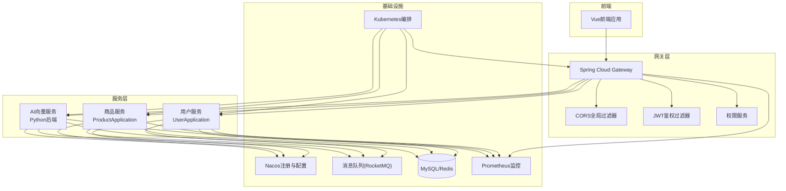
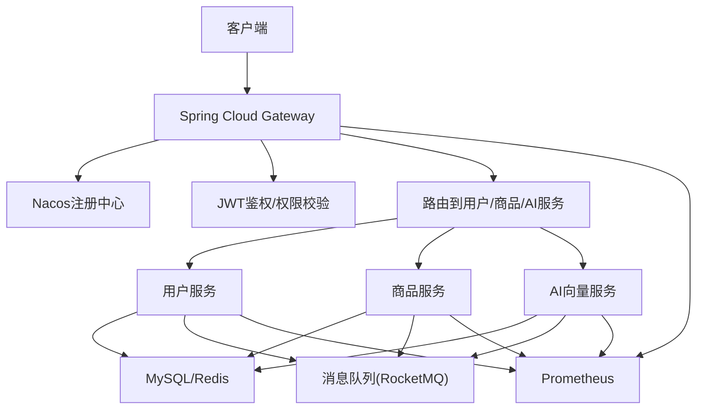
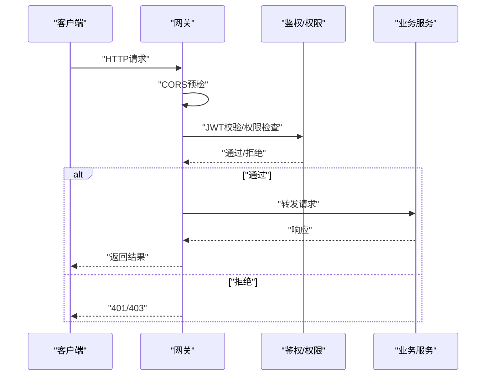
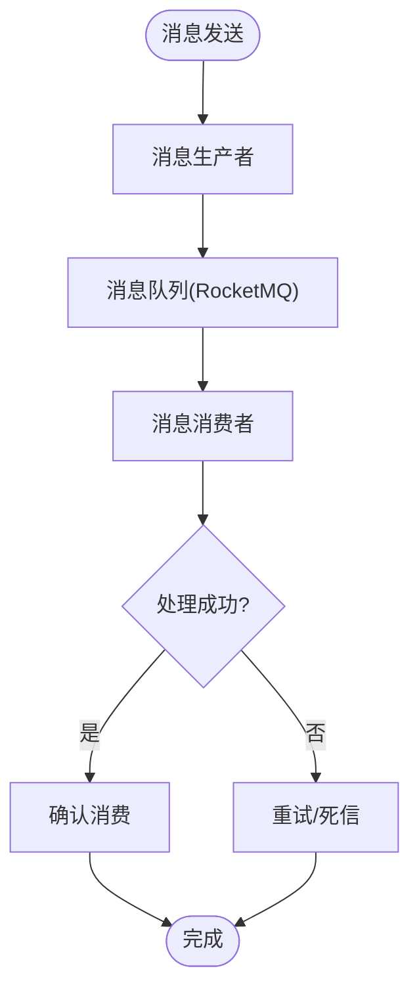
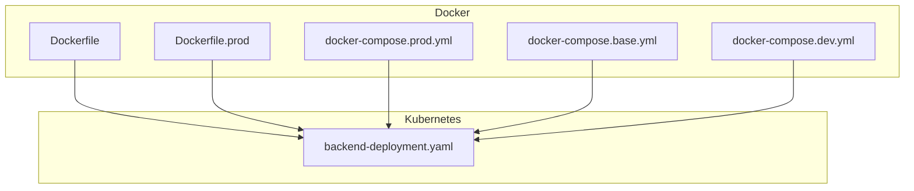
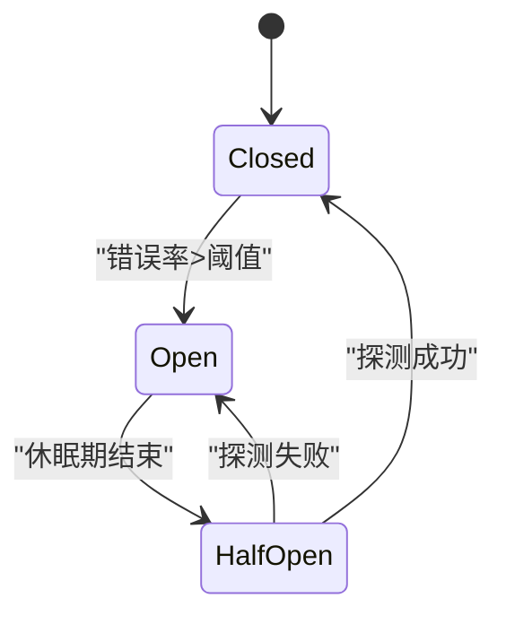
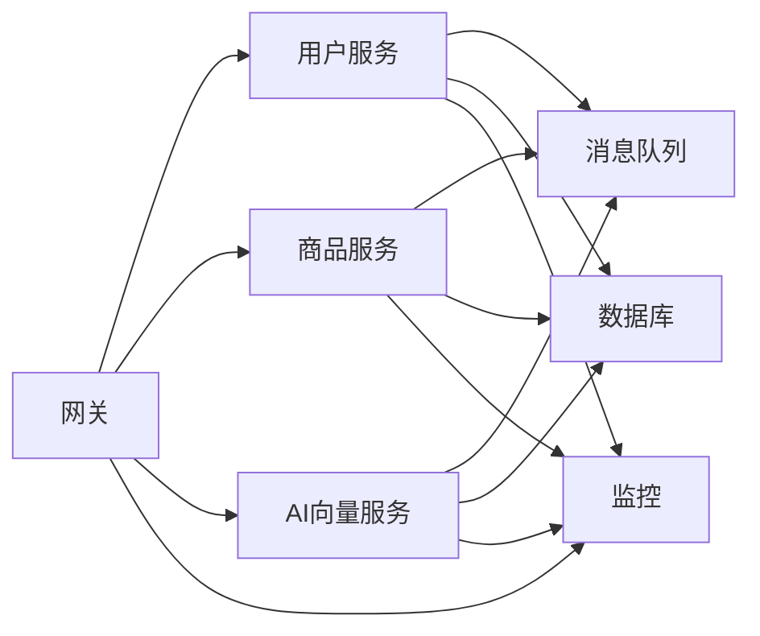

# 微服务扩展

<cite>
**本文引用的文件**
- [README.md](file://README.md)
- [ARCHITECTURE.md](file://docs/架构/ARCHITECTURE.md)
- [Docker生产环境独立部署方案.md](file://docs/架构/Docker生产环境独立部署方案.md)
- [Gateway.md](file://docs/项目逻辑/微服务/Gateway.md)
- [架构设计文档-微服务分离方案.md](file://docs/架构设计文档-微服务分离方案.md)
- [Dockerfile](file://java-backend/Dockerfile)
- [Dockerfile.prod](file://java-backend/Dockerfile.prod)
- [docker-compose.nacos.yml](file://java-backend/docker-compose.nacos.yml)
- [pom.xml](file://java-backend/pom.xml)
- [SjzmBackendApplication.java](file://java-backend/src/main/java/com/sjzm/SjzmBackendApplication.java)
- [application.yml](file://java-backend/src/main/resources/application.yml)
- [application-prod.yml](file://java-backend/src/main/resources/application-prod.yml)
- [GatewayApplication.java](file://java-backend/sjzm-gateway/src/main/java/com/sjzm/gateway/GatewayApplication.java)
- [CorsGlobalFilter.java](file://java-backend/sjzm-gateway/src/main/java/com/sjzm/gateway/CorsGlobalFilter.java)
- [JwtAuthGatewayFilter.java](file://java-backend/sjzm-gateway/src/main/java/com/sjzm/gateway/JwtAuthGatewayFilter.java)
- [PermissionService.java](file://java-backend/sjzm-gateway/src/main/java/com/sjzm/gateway/PermissionService.java)
- [CircuitBreakerConfig.java](file://java-backend/sjzm-common/src/main/java/com/sjzm/config/CircuitBreakerConfig.java)
- [RateLimitConfig.java](file://java-backend/sjzm-common/src/main/java/com/sjzm/config/RateLimitConfig.java)
- [RedissonConfig.java](file://java-backend/sjzm-common/src/main/java/com/sjzm/config/RedissonConfig.java)
- [MessageProducer.java](file://java-backend/sjzm-common/src/main/java/com/sjzm/mq/MessageProducer.java)
- [MessageConsumer.java](file://java-backend/sjzm-common/src/main/java/com/sjzm/mq/MessageConsumer.java)
- [RocketMQ配置目录](file://java-backend/sjzm-common/src/main/java/com/sjzm/mq/rocketmq)
- [ProductApplication.java](file://java-backend/sjzm-product/src/main/java/com/sjzm/product/ProductApplication.java)
- [UserApplication.java](file://java-backend/sjzm-user/src/main/java/com/sjzm/user/UserApplication.java)
- [backend-deployment.yaml](file://k8s/backend-deployment.yaml)
- [prometheus.yml](file://prometheus/prometheus.yml)
- [docker-compose.prod.yml](file://docker-compose.prod.yml)
- [docker-compose.dev.yml](file://docker-compose.dev.yml)
- [docker-compose.base.yml](file://docker-compose.base.yml)
- [start_celery.py](file://backend/start_celery.py)
- [celery_app.py](file://backend/tasks/celery_app.py)
- [monitoring_service.py](file://backend/scripts/monitoring/performance_monitor.py)
- [performance_monitor.py](file://backend/utils/performance_monitor.py)
- [system_log_service.py](file://backend/services/system_log_service.py)
- [logs.py](file://backend/app/api/v1/logs.py)
- [system_config.py](file://backend/app/api/v1/system_config.py)
- [system_log.py](file://backend/models/system_log.py)
- [system_log_tables.sql](file://backend/migrations/system_log_tables.sql)
</cite>

## 目录
1. [引言](#引言)
2. [项目结构](#项目结构)
3. [核心组件](#核心组件)
4. [架构总览](#架构总览)
5. [详细组件分析](#详细组件分析)
6. [依赖关系分析](#依赖关系分析)
7. [性能考虑](#性能考虑)
8. [故障排查指南](#故障排查指南)
9. [结论](#结论)
10. [附录](#附录)

## 引言
本文件面向“思觉智贸系统”的微服务扩展与落地实践，目标是提供一套完整的微服务拆分原则、边界定义、服务聚合策略，以及从Spring Boot配置、服务注册发现、负载均衡到容器化部署、Kubernetes编排与服务网格的实施蓝图。同时覆盖服务间通信（REST、消息队列、事件驱动）、监控与日志、分布式追踪、服务降级与熔断等关键能力，帮助团队在现有单体基础上平滑演进为高可用、可扩展的微服务体系。

## 项目结构
当前仓库已具备Java后端微服务骨架（网关、用户、商品服务）与Python后端（含Celery任务与AI向量服务），并配套Docker与Kubernetes部署资源。前端通过统一网关进行路由与鉴权，后端采用Nacos作为注册中心与配置中心，Prometheus用于指标采集。

图表来源
- [GatewayApplication.java](file://java-backend/sjzm-gateway/src/main/java/com/sjzm/gateway/GatewayApplication.java)
- [CorsGlobalFilter.java](file://java-backend/sjzm-gateway/src/main/java/com/sjzm/gateway/CorsGlobalFilter.java)
- [JwtAuthGatewayFilter.java](file://java-backend/sjzm-gateway/src/main/java/com/sjzm/gateway/JwtAuthGatewayFilter.java)
- [PermissionService.java](file://java-backend/sjzm-gateway/src/main/java/com/sjzm/gateway/PermissionService.java)
- [UserApplication.java](file://java-backend/sjzm-user/src/main/java/com/sjzm/user/UserApplication.java)
- [ProductApplication.java](file://java-backend/sjzm-product/src/main/java/com/sjzm/product/ProductApplication.java)
- [docker-compose.nacos.yml](file://java-backend/docker-compose.nacos.yml)
- [prometheus.yml](file://prometheus/prometheus.yml)
- [backend-deployment.yaml](file://k8s/backend-deployment.yaml)

章节来源
- [README.md](file://README.md)
- [ARCHITECTURE.md](file://docs/架构/ARCHITECTURE.md)
- [Docker生产环境独立部署方案.md](file://docs/架构/Docker生产环境独立部署方案.md)

## 核心组件
- 网关层：统一入口、跨域、鉴权、权限校验与路由转发。
- 用户服务：用户管理、角色权限、会话与安全。
- 商品服务：商品数据、评分、选品、素材库等业务域。
- AI向量服务：向量化检索、相似度匹配、模型缓存与下载。
- 基础设施：Nacos注册与配置、消息队列、MySQL/Redis、Prometheus、Kubernetes。

章节来源
- [SjzmBackendApplication.java](file://java-backend/src/main/java/com/sjzm/SjzmBackendApplication.java)
- [UserApplication.java](file://java-backend/sjzm-user/src/main/java/com/sjzm/user/UserApplication.java)
- [ProductApplication.java](file://java-backend/sjzm-product/src/main/java/com/sjzm/product/ProductApplication.java)
- [GatewayApplication.java](file://java-backend/sjzm-gateway/src/main/java/com/sjzm/gateway/GatewayApplication.java)

## 架构总览
微服务架构以“网关+多业务服务+基础设施”为核心，遵循以下原则：
- 服务边界：按业务域划分（用户、商品、AI向量），避免交叉耦合。
- 服务自治：每个服务独立开发、测试、部署与扩缩容。
- 统一网关：集中处理跨域、鉴权、限流、路由与可观测性。
- 注册发现：基于Nacos实现服务注册与动态路由。
- 事件驱动：通过消息队列解耦异步任务与跨服务协作。
- 可观测性：Prometheus采集指标，结合日志与链路追踪实现全链路监控。

图表来源
- [application.yml](file://java-backend/src/main/resources/application.yml)
- [docker-compose.nacos.yml](file://java-backend/docker-compose.nacos.yml)
- [prometheus.yml](file://prometheus/prometheus.yml)

## 详细组件分析

### 网关组件（Spring Cloud Gateway）
- 职责：统一入口、CORS、JWT鉴权、权限校验、路由转发。
- 关键点：全局过滤器链、权限服务对接、与下游服务的健康检查与超时控制。
- 扩展建议：引入灰度发布、重试与熔断策略；对热点接口做本地缓存与限流。

图表来源
- [CorsGlobalFilter.java](file://java-backend/sjzm-gateway/src/main/java/com/sjzm/gateway/CorsGlobalFilter.java)
- [JwtAuthGatewayFilter.java](file://java-backend/sjzm-gateway/src/main/java/com/sjzm/gateway/JwtAuthGatewayFilter.java)
- [PermissionService.java](file://java-backend/sjzm-gateway/src/main/java/com/sjzm/gateway/PermissionService.java)

章节来源
- [GatewayApplication.java](file://java-backend/sjzm-gateway/src/main/java/com/sjzm/gateway/GatewayApplication.java)
- [CorsGlobalFilter.java](file://java-backend/sjzm-gateway/src/main/java/com/sjzm/gateway/CorsGlobalFilter.java)
- [JwtAuthGatewayFilter.java](file://java-backend/sjzm-gateway/src/main/java/com/sjzm/gateway/JwtAuthGatewayFilter.java)
- [PermissionService.java](file://java-backend/sjzm-gateway/src/main/java/com/sjzm/gateway/PermissionService.java)

### 用户服务（User）
- 职责：用户生命周期、角色权限、会话管理。
- 数据：MySQL用户表、Redis会话与缓存。
- 扩展：引入鉴权中心（如Keycloak）或自研Token服务；支持多租户与审计日志。

章节来源
- [UserApplication.java](file://java-backend/sjzm-user/src/main/java/com/sjzm/user/UserApplication.java)

### 商品服务（Product）
- 职责：商品数据、评分、选品、素材库、下载任务。
- 数据：MySQL主库、Redis缓存、向量库（Qdrant）。
- 扩展：商品搜索引入ES或向量化检索；任务系统与Celery解耦。

章节来源
- [ProductApplication.java](file://java-backend/sjzm-product/src/main/java/com/sjzm/product/ProductApplication.java)

### AI向量服务（Python）
- 职责：向量化处理、相似度检索、模型缓存与下载。
- 通信：通过HTTP或消息队列与Java服务交互。
- 扩展：支持多模型并行、批量向量化、增量索引与热更新。

章节来源
- [python-ai/README.md](file://python-ai/README.md)
- [python-ai/main.py](file://python-ai/app/main.py)

### 消息队列（RocketMQ）
- 职责：异步解耦、削峰填谷、事件驱动。
- 配置：生产者/消费者抽象类与具体实现。
- 扩展：引入死信队列、幂等消费、事务消息与延迟消息。

图表来源
- [MessageProducer.java](file://java-backend/sjzm-common/src/main/java/com/sjzm/mq/MessageProducer.java)
- [MessageConsumer.java](file://java-backend/sjzm-common/src/main/java/com/sjzm/mq/MessageConsumer.java)
- [RocketMQ配置目录](file://java-backend/sjzm-common/src/main/java/com/sjzm/mq/rocketmq)

章节来源
- [MessageProducer.java](file://java-backend/sjzm-common/src/main/java/com/sjzm/mq/MessageProducer.java)
- [MessageConsumer.java](file://java-backend/sjzm-common/src/main/java/com/sjzm/mq/MessageConsumer.java)

### 监控与日志（Prometheus + 日志聚合）
- 指标采集：Prometheus抓取各服务指标，结合Grafana可视化。
- 日志：统一输出结构化日志，接入ELK或Loki进行聚合查询。
- 追踪：集成OpenTelemetry或SkyWalking实现分布式追踪。

章节来源
- [prometheus.yml](file://prometheus/prometheus.yml)
- [system_log_service.py](file://backend/services/system_log_service.py)
- [logs.py](file://backend/app/api/v1/logs.py)
- [system_log.py](file://backend/models/system_log.py)
- [system_log_tables.sql](file://backend/migrations/system_log_tables.sql)

### 容器化与Kubernetes编排
- Docker镜像：基础镜像与生产镜像分离，构建参数化。
- Compose：开发/生产环境编排，包含Nacos、MySQL、Redis、Prometheus。
- Kubernetes：Deployment/Service/Ingress/ConfigMap/Secret，配合Helm或Kustomize。

图表来源
- [Dockerfile](file://java-backend/Dockerfile)
- [Dockerfile.prod](file://java-backend/Dockerfile.prod)
- [docker-compose.base.yml](file://docker-compose.base.yml)
- [docker-compose.dev.yml](file://docker-compose.dev.yml)
- [docker-compose.prod.yml](file://docker-compose.prod.yml)
- [backend-deployment.yaml](file://k8s/backend-deployment.yaml)

章节来源
- [Dockerfile](file://java-backend/Dockerfile)
- [Dockerfile.prod](file://java-backend/Dockerfile.prod)
- [docker-compose.base.yml](file://docker-compose.base.yml)
- [docker-compose.dev.yml](file://docker-compose.dev.yml)
- [docker-compose.prod.yml](file://docker-compose.prod.yml)
- [backend-deployment.yaml](file://k8s/backend-deployment.yaml)

### 服务拆分原则与边界定义
- 业务边界：以领域模型与用例为核心，避免“共享内核”导致紧耦合。
- 数据边界：每服务拥有独立数据库或读写分离，必要时通过事件最终一致性。
- 接口边界：对外暴露清晰的API契约，内部通过消息或RPC协作。
- 团队边界：按服务Owner组织，减少沟通成本与冲突。

章节来源
- [架构设计文档-微服务分离方案.md](file://docs/架构设计文档-微服务分离方案.md)
- [Gateway.md](file://docs/项目逻辑/微服务/Gateway.md)

### 服务聚合与组合
- 网关聚合：将多个下游服务的响应在网关层聚合，减少客户端多次请求。
- 事件聚合：通过事件总线将跨服务状态变化广播给订阅者。
- 任务编排：对长耗时操作采用Saga或CQRS模式，保证一致性与可观测性。

章节来源
- [application.yml](file://java-backend/src/main/resources/application.yml)

### 新微服务开发指南（Spring Boot）
- 项目结构：模块化（common、gateway、service子模块），共享配置与工具。
- 配置管理：application.yml + 环境差异化配置，结合Nacos动态刷新。
- 注册发现：Eureka/Nacos自动注册，健康检查与权重路由。
- 负载均衡：Ribbon/LoadBalancer + 负载策略（轮询/加权/最少连接）。
- 安全：JWT + RBAC + 网关统一鉴权。
- 监控：Actuator + Prometheus + Grafana。
- 限流/熔断：Resilience4j + Redisson限流 + Sentinel/Huawei Cloud CSE。
- 任务：Celery（Python）与Spring Task（Java）双栈，消息队列解耦。

章节来源
- [pom.xml](file://java-backend/pom.xml)
- [application.yml](file://java-backend/src/main/resources/application.yml)
- [application-prod.yml](file://java-backend/src/main/resources/application-prod.yml)
- [CircuitBreakerConfig.java](file://java-backend/sjzm-common/src/main/java/com/sjzm/config/CircuitBreakerConfig.java)
- [RateLimitConfig.java](file://java-backend/sjzm-common/src/main/java/com/sjzm/config/RateLimitConfig.java)
- [RedissonConfig.java](file://java-backend/sjzm-common/src/main/java/com/sjzm/config/RedissonConfig.java)
- [start_celery.py](file://backend/start_celery.py)
- [celery_app.py](file://backend/tasks/celery_app.py)

### 服务间通信机制
- REST调用：服务直连，带超时与重试；网关侧做限流与熔断。
- 消息队列：异步事件驱动，支持事务消息与幂等消费。
- 事件驱动：基于RocketMQ实现领域事件，订阅者自治更新。

章节来源
- [MessageProducer.java](file://java-backend/sjzm-common/src/main/java/com/sjzm/mq/MessageProducer.java)
- [MessageConsumer.java](file://java-backend/sjzm-common/src/main/java/com/sjzm/mq/MessageConsumer.java)

### 服务降级、熔断与容错
- 降级：当依赖服务不可用时，返回兜底数据或空结果。
- 熔断：连续错误超过阈值触发熔断，休眠期后半开探测。
- 容错：超时、重试、隔离（线程池/信号量），幂等设计。

图表来源
- [CircuitBreakerConfig.java](file://java-backend/sjzm-common/src/main/java/com/sjzm/config/CircuitBreakerConfig.java)

章节来源
- [CircuitBreakerConfig.java](file://java-backend/sjzm-common/src/main/java/com/sjzm/config/CircuitBreakerConfig.java)
- [RateLimitConfig.java](file://java-backend/sjzm-common/src/main/java/com/sjzm/config/RateLimitConfig.java)
- [RedissonConfig.java](file://java-backend/sjzm-common/src/main/java/com/sjzm/config/RedissonConfig.java)

## 依赖关系分析
- 组件耦合：网关对所有服务有直接依赖；服务间通过消息队列弱耦合。
- 外部依赖：Nacos、MySQL、Redis、RocketMQ、Prometheus。
- 风险点：消息丢失、重复消费、跨服务事务一致性、限流策略不当导致雪崩。

图表来源
- [pom.xml](file://java-backend/pom.xml)
- [docker-compose.nacos.yml](file://java-backend/docker-compose.nacos.yml)
- [prometheus.yml](file://prometheus/prometheus.yml)

章节来源
- [pom.xml](file://java-backend/pom.xml)
- [docker-compose.nacos.yml](file://java-backend/docker-compose.nacos.yml)
- [prometheus.yml](file://prometheus/prometheus.yml)

## 性能考虑
- 缓存策略：多级缓存（本地+Redis），热点数据预热，失效策略与并发更新。
- 数据库优化：索引、分库分表、只读副本、慢查询治理。
- 异步化：耗时任务入队，避免阻塞主线程。
- 并发与限流：线程池隔离、信号量限流、令牌桶/漏桶算法。
- 观测性：埋点关键路径，采样与聚合，压测与容量规划。

## 故障排查指南
- 网关问题：检查CORS与JWT过滤器链，确认路由规则与健康检查。
- 服务不可用：查看注册中心状态、日志与指标，定位CPU/内存/连接数。
- 消息积压：检查消费者吞吐、重试次数、死信队列，优化批处理大小。
- 数据不一致：核查事件顺序、幂等键、补偿机制。
- 性能瓶颈：结合火焰图与慢查询，优化热点接口与SQL。

章节来源
- [monitoring_service.py](file://backend/scripts/monitoring/performance_monitor.py)
- [performance_monitor.py](file://backend/utils/performance_monitor.py)
- [system_log_service.py](file://backend/services/system_log_service.py)
- [logs.py](file://backend/app/api/v1/logs.py)

## 结论
通过网关统一入口、服务自治与事件驱动，结合完善的监控与容错机制，思觉智贸系统可在保障稳定性的同时持续演进。建议优先完成服务拆分与边界定义，再推进容器化与Kubernetes编排，并逐步引入服务网格与更细粒度的可观测能力。

## 附录
- 部署清单：镜像构建、Compose/K8s部署、Nacos初始化、Prometheus抓取配置。
- 运维手册：灰度发布、回滚策略、应急响应流程。
- 最佳实践：API版本化、幂等设计、事件溯源、CQRS与Saga。