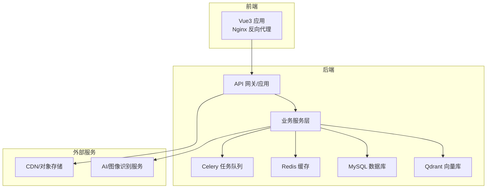
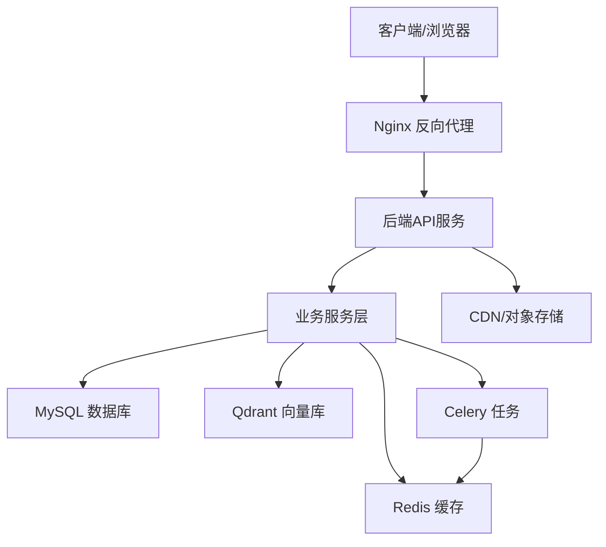
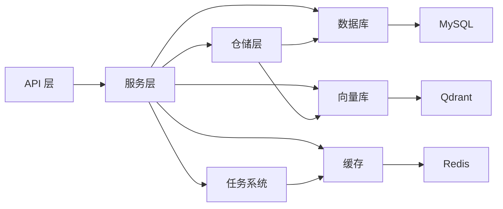

# 性能扩展方案

<cite>
**本文引用的文件**
- [backend/app/config.py](file://backend/app/config.py)
- [backend/app/main.py](file://backend/app/main.py)
- [backend/app/repositories/redis_repo.py](file://backend/app/repositories/redis_repo.py)
- [backend/app/tasks/celery_app.py](file://backend/app/tasks/celery_app.py)
- [backend/app/services/cache_warmup_service.py](file://backend/app/services/cache_warmup_service.py)
- [backend/app/utils/performance_monitor.py](file://backend/app/utils/performance_monitor.py)
- [backend/app/middleware/timeout.py](file://backend/app/middleware/timeout.py)
- [backend/app/middleware/error_middleware.py](file://backend/app/middleware/error_middleware.py)
- [backend/app/middleware/logging.py](file://backend/app/middleware/logging.py)
- [backend/app/middleware/auth_middleware.py](file://backend/app/middleware/auth_middleware.py)
- [backend/app/services/monitoring_service.py](file://backend/app/services/monitoring_service.py)
- [backend/app/services/product_data_service.py](file://backend/app/services/product_data_service.py)
- [backend/app/services/image_service.py](file://backend/app/services/image_service.py)
- [backend/app/services/file_upload_service.py](file://backend/app/services/file_upload_service.py)
- [backend/app/services/system_log_service.py](file://backend/app/services/system_log_service.py)
- [backend/app/repositories/mysql_repo.py](file://backend/app/repositories/mysql_repo.py)
- [backend/app/repositories/qdrant_repo.py](file://backend/app/repositories/qdrant_repo.py)
- [backend/app/api/v1/products.py](file://backend/app/api/v1/products.py)
- [backend/app/api/v1/images.py](file://backend/app/api/v1/images.py)
- [backend/app/api/v1/file_links.py](file://backend/app/api/v1/file_links.py)
- [backend/app/api/v1/download_tasks.py](file://backend/app/api/v1/download_tasks.py)
- [backend/app/api/v1/statistics.py](file://backend/app/api/v1/statistics.py)
- [backend/app/api/v1/logs.py](file://backend/app/api/v1/logs.py)
- [backend/app/api/v1/system_config.py](file://backend/app/api/v1/system_config.py)
- [backend/app/api/v1/health.py](file://backend/app/api/v1/health.py)
- [backend/app/api/v1/auth.py](file://backend/app/api/v1/auth.py)
- [backend/app/api/v1/carrier_library.py](file://backend/app/api/v1/carrier_library.py)
- [backend/app/api/v1/material_library.py](file://backend/app/api/v1/material_library.py)
- [backend/app/api/v1/final_drafts.py](file://backend/app/api/v1/final_drafts.py)
- [backend/app/api/v1/selection.py](file://backend/app/api/v1/selection.py)
- [backend/app/api/v1/recycle_bin.py](file://backend/app/api/v1/recycle_bin.py)
- [backend/app/api/v1/tags.py](file://backend/app/api/v1/tags.py)
- [backend/app/api/v1/users.py](file://backend/app/api/v1/users.py)
- [backend/app/api/v1/announcements.py](file://backend/app/api/v1/announcements.py)
- [backend/app/api/v1/import_.py](file://backend/app/api/v1/import_.py)
- [backend/app/api/v1/export.py](file://backend/app/api/v1/export.py)
- [backend/app/api/v1/scoring.py](file://backend/app/api/v1/scoring.py)
- [backend/app/api/v1/selection_recycle.py](file://backend/app/api/v1/selection_recycle.py)
- [backend/app/api/v1/product_recycle.py](file://backend/app/api/v1/product_recycle.py)
- [backend/app/api/v1/categories.py](file://backend/app/api/v1/categories.py)
- [backend/app/api/v1/lingxing.py](file://backend/app/api/v1/lingxing.py)
- [backend/app/api/v1/image_proxy.py](file://backend/app/api/v1/image_proxy.py)
- [backend/app/api/v1/product_sales.py](file://backend/app/api/v1/product_sales.py)
- [backend/app/db/migrations/create_final_drafts_table.sql](file://backend/app/db/migrations/create_final_drafts_table.sql)
- [backend/migrations/init_database.sql](file://backend/migrations/init_database.sql)
- [backend/migrations/add_images_index.sql](file://backend/migrations/add_images_index.sql)
- [backend/migrations/add_role_indexes.sql](file://backend/migrations/add_role_indexes.sql)
- [backend/migrations/create_scoring_tables.sql](file://backend/migrations/create_scoring_tables.sql)
- [backend/migrations/create_material_carrier_tables.sql](file://backend/migrations/create_material_carrier_tables.sql)
- [backend/migrations/add_download_tasks_table.sql](file://backend/migrations/add_download_tasks_table.sql)
- [backend/migrations/system_log_tables.sql](file://backend/migrations/system_log_tables.sql)
- [backend/migrations/create_final_drafts_table.sql](file://backend/migrations/create_final_drafts_table.sql)
- [backend/scripts/check_database_tables.py](file://backend/scripts/check_database_tables.py)
- [backend/scripts/check_product_data_tables.py](file://backend/scripts/check_product_data_tables.py)
- [backend/scripts/url_check_scheduler.py](file://backend/scripts/url_check_scheduler.py)
- [backend/scripts/url_maintenance.py](file://backend/scripts/url_maintenance.py)
- [backend/scripts/data_migration.py](file://backend/scripts/data_migration.py)
- [backend/scripts/cleanup.py](file://backend/scripts/cleanup.py)
- [backend/scripts/trigger_scoring.py](file://backend/scripts/trigger_scoring.py)
- [backend/scripts/update_existing_drafts.py](file://backend/scripts/update_existing_drafts.py)
- [backend/scripts/execute_sql_migration.py](file://backend/scripts/execute_sql_migration.py)
- [backend/scripts/add_local_thumbnail_fields.sql](file://backend/scripts/add_local_thumbnail_fields.sql)
- [backend/scripts/update_material_library_table.py](file://backend/scripts/update_material_library_table.py)
- [backend/scripts/cos_migration.py](file://backend/scripts/cos_migration.py)
- [backend/scripts/fix_image_urls.py](file://backend/scripts/fix_image_urls.py)
- [backend/scripts/fix_scoring.py](file://backend/scripts/fix_scoring.py)
- [backend/scripts/check_final_draft_tables.py](file://backend/scripts/check_final_draft_tables.py)
- [backend/scripts/check_local_images.py](file://backend/scripts/check_local_images.py)
- [backend/scripts/check_db_urls.py](file://backend/scripts/check_db_urls.py)
- [backend/scripts/_parquet_cols.py](file://backend/scripts/_parquet_cols.py)
- [backend/scripts/batch_convert_to_parquet.py](file://backend/scripts/batch_convert_to_parquet.py)
- [backend/scripts/merge_parquet_files_v2.py](file://backend/scripts/merge_parquet_files_v2.py)
- [backend/scripts/create_file_links_folder.py](file://backend/scripts/create_file_links_folder.py)
- [backend/scripts/check_asin_duplicate.py](file://backend/scripts/check_asin_duplicate.py)
- [backend/scripts/check_asin_sales.py](file://backend/scripts/check_asin_sales.py)
- [backend/scripts/test_marketplace_only.json](file://backend/scripts/test_marketplace_only.json)
- [backend/scripts/test_marketplace_variation_N.json](file://backend/scripts/test_marketplace_variation_N.json)
- [backend/scripts/test_marketplace_variation_Y.json](file://backend/scripts/test_marketplace_variation_Y.json)
- [backend/scripts/analysis/generate_liumiao_report_final.py](file://backend/scripts/analysis/generate_liumiao_report_final.py)
- [backend/scripts/analysis/generate_monthly_summary_report.py](file://backend/scripts/analysis/generate_monthly_summary_report.py)
- [backend/scripts/analysis/generate_report_from_excel.py](file://backend/scripts/analysis/generate_report_from_excel.py)
- [backend/scripts/analysis/sku_monthly_summary.py](file://backend/scripts/analysis/sku_monthly_summary.py)
- [backend/scripts/scheduler/update_aggregation_tables.py](file://backend/scripts/scheduler/update_aggregation_tables.py)
- [backend/scripts/startup/start_prod_multiprocess.py](file://backend/scripts/startup/start_prod_multiprocess.py)
- [backend/scripts/startup/start_with_hot_reload.py](file://backend/scripts/startup/start_with_hot_reload.py)
- [backend/scripts/environment/setup_dev_environment.py](file://backend/scripts/environment/setup_dev_environment.py)
- [backend/scripts/environment/create_dev_database.py](file://backend/scripts/environment/create_dev_database.py)
- [backend/scripts/environment/setup_frontend_isolation.py](file://backend/scripts/environment/setup_frontend_isolation.py)
- [backend/scripts/deployment/blue_green_deployment.py](file://backend/scripts/deployment/blue_green_deployment.py)
- [backend/scripts/deployment/canary_deployment.py](file://backend/scripts/deployment/canary_deployment.py)
- [backend/scripts/deployment/monitor_deployment.py](file://backend/scripts/deployment/monitor_deployment.py)
- [backend/scripts/deployment/sync_dev_to_prod.py](file://backend/scripts/deployment/sync_dev_to_prod.py)
- [backend/scripts/deployment/sync_frontend.py](file://backend/scripts/deployment/sync_frontend.py)
- [backend/scripts/monitoring/performance_monitor.py](file://backend/scripts/monitoring/performance_monitor.py)
- [backend/scripts/utils/system/performance_monitor.py](file://backend/scripts/utils/system/performance_monitor.py)
- [backend/scripts/utils/system/hot_reload.py](file://backend/scripts/utils/system/hot_reload.py)
- [backend/scripts/utils/system/file_watcher.py](file://backend/scripts/utils/system/file_watcher.py)
- [backend/scripts/utils/system/config_reloader.py](file://backend/scripts/utils/system/config_reloader.py)
- [backend/scripts/utils/system/system_check.py](file://backend/scripts/utils/system/system_check.py)
- [backend/scripts/utils/task/task_manager.py](file://backend/scripts/utils/task/task_manager.py)
- [backend/scripts/utils/middleware/timeout_middleware.py](file://backend/scripts/utils/middleware/timeout_middleware.py)
- [backend/scripts/utils/validation/composite_product_validator.py](file://backend/scripts/utils/validation/composite_product_validator.py)
- [backend/scripts/utils/utils.py](file://backend/scripts/utils/utils.py)
- [backend/scripts/utils/error_logger.py](file://backend/scripts/utils/error_logger.py)
- [backend/scripts/utils/qdrant_monitor.py](file://backend/scripts/utils/qdrant_monitor.py)
- [backend/scripts/env_consistency/alert_system.py](file://backend/scripts/env_consistency/alert_system.py)
- [backend/scripts/env_consistency/core_validator.py](file://backend/scripts/env_consistency/core_validator.py)
- [backend/scripts/env_consistency/data_sync.py](file://backend/scripts/env_consistency/data_sync.py)
- [backend/scripts/env_consistency/validate_env_consistency.py](file://backend/scripts/env_consistency/validate_env_consistency.py)
- [backend/scripts/git_sync/auto_sync.py](file://backend/scripts/git_sync/auto_sync.py)
- [backend/scripts/git_sync/conflict_manager.py](file://backend/scripts/git_sync/conflict_manager.py)
- [backend/scripts/git_sync/git_manager.py](file://backend/scripts/git_sync/git_manager.py)
- [backend/scripts/git_sync/git_sync_config.json](file://backend/scripts/git_sync/git_sync_config.json)
- [backend/scripts/git_sync/hook_manager.py](file://backend/scripts/git_sync/hook_manager.py)
- [backend/scripts/git_sync/config.py](file://backend/scripts/git_sync/config.py)
- [backend/docker-compose.prod.yml](file://backend/docker-compose.prod.yml)
- [backend/docker-compose.dev.yml](file://backend/docker-compose.dev.yml)
- [backend/Dockerfile](file://backend/Dockerfile)
- [backend/Dockerfile.dev](file://backend/Dockerfile.dev)
- [backend/requirements.txt](file://backend/requirements.txt)
- [backend/start_celery.py](file://backend/start_celery.py)
- [backend/start_java_dev.py](file://backend/start_java_dev.py)
- [backend/start_vite_dev.py](file://backend/start_vite_dev.py)
- [frontend/nginx.conf](file://frontend/nginx.conf)
- [frontend/nginx.prod.conf](file://frontend/nginx.prod.conf)
- [frontend/package.json](file://frontend/package.json)
- [frontend/vite.config.js](file://frontend/vite.config.js)
- [frontend/src/utils/imageCacheOptimizer.ts](file://frontend/src/utils/imageCacheOptimizer.ts)
- [frontend/src/utils/imageOfflineCache.ts](file://frontend/src/utils/imageOfflineCache.ts)
- [frontend/src/utils/cacheManager.ts](file://frontend/src/utils/cacheManager.ts)
- [frontend/src/utils/memoryMonitor.ts](file://frontend/src/utils/memoryMonitor.ts)
- [frontend/src/utils/requestMerge.ts](file://frontend/src/utils/requestMerge.ts)
- [frontend/src/types/performance.d.ts](file://frontend/src/types/performance.d.ts)
- [frontend/src/views/ProductDataDashboard/index.vue](file://frontend/src/views/ProductDataDashboard/index.vue)
- [frontend/src/views/ImageManagement/index.vue](file://frontend/src/views/ImageManagement/index.vue)
- [frontend/src/components/LazyImage/index.vue](file://frontend/src/components/LazyImage/index.vue)
- [frontend/src/components/UniversalList/index.vue](file://frontend/src/components/UniversalList/index.vue)
- [frontend/src/components/VirtualList/index.vue](file://frontend/src/components/VirtualList/index.vue)
- [frontend/src/stores/productData.ts](file://frontend/src/stores/productData.ts)
- [frontend/src/stores/user.ts](file://frontend/src/stores/user.ts)
- [frontend/src/stores/app.ts](file://frontend/src/stores/app.ts)
- [frontend/src/router/index.ts](file://frontend/src/router/index.ts)
- [frontend/src/utils/request.ts](file://frontend/src/utils/request.ts)
- [frontend/src/utils/imageUrlUtil.ts](file://frontend/src/utils/imageUrlUtil.ts)
- [frontend/src/api/product.ts](file://frontend/src/api/product.ts)
- [frontend/src/api/image.ts](file://frontend/src/api/image.ts)
- [frontend/src/api/fileLink.ts](file://frontend/src/api/fileLink.ts)
- [frontend/src/api/downloadTask.ts](file://frontend/src/api/downloadTask.ts)
- [frontend/src/api/statistics.ts](file://frontend/src/api/statistics.ts)
- [frontend/src/api/logs.ts](file://frontend/src/api/logs.ts)
- [frontend/src/api/systemConfig.ts](file://frontend/src/api/systemConfig.ts)
- [frontend/src/api/user.ts](file://frontend/src/api/user.ts)
- [frontend/src/api/selection.ts](file://frontend/src/api/selection.ts)
- [frontend/src/api/materialLibrary.ts](file://frontend/src/api/materialLibrary.ts)
- [frontend/src/api/carrierLibrary.ts](file://frontend/src/api/carrierLibrary.ts)
- [frontend/src/api/finalDraft.ts](file://frontend/src/api/finalDraft.ts)
- [frontend/src/api/selectionRecycle.ts](file://frontend/src/api/selectionRecycle.ts)
- [frontend/src/api/productRecycle.ts](file://frontend/src/api/productRecycle.ts)
- [frontend/src/api/tags.ts](file://frontend/src/api/tags.ts)
- [frontend/src/api/announcements.ts](file://frontend/src/api/announcements.ts)
- [frontend/src/api/import_export.ts](file://frontend/src/api/import_export.ts)
- [frontend/src/api/export.ts](file://frontend/src/api/export.ts)
- [frontend/src/api/scoring.ts](file://frontend/src/api/scoring.ts)
- [frontend/src/api/categories.ts](file://frontend/src/api/categories.ts)
- [frontend/src/api/lingxing.ts](file://frontend/src/api/lingxing.ts)
- [frontend/src/api/productSales.ts](file://frontend/src/api/productSales.ts)
- [frontend/src/api/logClick.ts](file://frontend/src/api/logClick.ts)
- [frontend/src/api/resourceCollection.ts](file://frontend/src/api/resourceCollection.ts)
- [frontend/src/api/report.ts](file://frontend/src/api/report.ts)
- [frontend/src/api/user.ts](file://frontend/src/api/user.ts)
- [frontend/src/api/user.ts](file://frontend/src/api/user.ts)
- [frontend/src/api/user.ts](file://frontend/src/api/user.ts)
- [frontend/src/api/user.ts](file://frontend/src/api/user.ts)
- [frontend/src/api/user.ts](file://frontend/src/api/user.ts)
- [frontend/src/api/user.ts](file://frontend/src/api/user.ts)
- [frontend/src/api/user.ts](file://frontend/src/api/user.ts)
- [frontend/src/api/user.ts](file://frontend/src/api/user.ts)
- [frontend/src/api/user.ts](file://frontend/src/api/user.ts)
- [frontend/src/api/user.ts](file://frontend/src/api/user.ts)
- [frontend/src/api/user.ts](file://frontend/src/api/user.ts)
- [frontend/src/api/user.ts](file://frontend/src/api/user.ts)
- [frontend/src/api/user.ts](file://frontend/src/api/user.ts)
- [frontend/src/api/user.ts](file://frontend/src/api/user.ts)
- [frontend/src/api/user.ts](file://frontend/src/api/user.ts)
- [frontend/src/api/user.ts](file://frontend/src/api/user.ts)
- [frontend/src/api/user.ts](file://frontend/src/api/user.ts)
- [frontend/src/api/user.ts](file://frontend/src/api/user.ts)
- [frontend/src/api/user.ts](file://frontend/src/api/user.ts)
- [frontend/src/api/user.ts](file://frontend/src/api/user.ts)
- [frontend/src/api/user.ts](file://frontend/src/api/user.ts)
- [frontend/src/api/user.ts](file://frontend/src/api/user.ts)
- [frontend/src/api/user.ts](file://frontend/src/api/user.ts)
- [frontend/src/api/user.ts](file://frontend/src/api/user.ts)
- [frontend/src/api/user.ts](file://frontend/src/api/user.ts)
- [frontend/src/api/user.ts](file://frontend/src/api/user.ts)
- [frontend/src/api/user.ts](file://frontend/src/api/user.ts)
- [frontend/src/api/user.ts](file://frontend/src/api/user.ts)
- [frontend/src/api/user.ts](file://frontend/src/api/user.ts)
- [frontend/src/api/user.ts](file://frontend/src/api/user.ts)
- [frontend/src/api/user.ts](file://frontend/src/api/user.ts)
- [frontend/src/api/user.ts](file://frontend/src/api/user.ts......)
</cite>

## 目录
1. [引言](#引言)
2. [项目结构](#项目结构)
3. [核心组件](#核心组件)
4. [架构总览](#架构总览)
5. [详细组件分析](#详细组件分析)
6. [依赖关系分析](#依赖关系分析)
7. [性能考虑](#性能考虑)
8. [故障排查指南](#故障排查指南)
9. [结论](#结论)
10. [附录](#附录)

## 引言
本方案面向“思觉智贸系统”的性能扩展目标，围绕水平扩展与垂直优化两条主线，系统性给出负载均衡、缓存优化、数据库调优、Redis集群与消息队列扩展、异步处理优化、监控指标、性能基准测试与瓶颈分析方法、自动扩缩容与资源调度、容量规划、CDN与静态资源优化、以及性能测试工具与流程建议。文档以仓库现有代码为依据，结合API、服务层、中间件、任务系统、前端缓存与CDN配置等进行深入分析，并提供可落地的实施路径。

## 项目结构
系统采用前后端分离架构：后端Python（FastAPI/Falcon风格）+ 前端Vue3 + 多语言AI服务（Java网关/服务）。后端通过Docker编排，支持开发与生产环境；数据库包含MySQL与向量库Qdrant；消息队列基于Celery；缓存使用Redis；静态资源由Nginx提供并支持CDN接入。

图示来源
- [backend/app/main.py](file://backend/app/main.py)
- [backend/app/tasks/celery_app.py](file://backend/app/tasks/celery_app.py)
- [backend/app/repositories/redis_repo.py](file://backend/app/repositories/redis_repo.py)
- [backend/app/repositories/mysql_repo.py](file://backend/app/repositories/mysql_repo.py)
- [backend/app/repositories/qdrant_repo.py](file://backend/app/repositories/qdrant_repo.py)
- [frontend/nginx.conf](file://frontend/nginx.conf)

章节来源
- [backend/app/main.py](file://backend/app/main.py)
- [backend/app/config.py](file://backend/app/config.py)
- [backend/docker-compose.prod.yml](file://backend/docker-compose.prod.yml)
- [frontend/nginx.conf](file://frontend/nginx.conf)

## 核心组件
- API层：提供REST接口，覆盖商品、素材、下载任务、统计、日志、系统配置、认证等模块。
- 服务层：封装业务逻辑，如产品数据、图片、上传、评分引擎、监控、备份等。
- 中间件：统一超时、错误、鉴权、日志处理。
- 任务系统：Celery异步任务，处理下载、清理、缓存预热等后台工作。
- 存储与缓存：MySQL、Redis、Qdrant；静态资源由Nginx提供。
- 前端缓存与CDN：Nginx反代与静态资源分发，前端缓存与懒加载组件。

章节来源
- [backend/app/api/v1/products.py](file://backend/app/api/v1/products.py)
- [backend/app/api/v1/images.py](file://backend/app/api/v1/images.py)
- [backend/app/api/v1/file_links.py](file://backend/app/api/v1/file_links.py)
- [backend/app/api/v1/download_tasks.py](file://backend/app/api/v1/download_tasks.py)
- [backend/app/api/v1/statistics.py](file://backend/app/api/v1/statistics.py)
- [backend/app/api/v1/logs.py](file://backend/app/api/v1/logs.py)
- [backend/app/api/v1/system_config.py](file://backend/app/api/v1/system_config.py)
- [backend/app/api/v1/health.py](file://backend/app/api/v1/health.py)
- [backend/app/api/v1/auth.py](file://backend/app/api/v1/auth.py)
- [backend/app/api/v1/carrier_library.py](file://backend/app/api/v1/carrier_library.py)
- [backend/app/api/v1/material_library.py](file://backend/app/api/v1/material_library.py)
- [backend/app/api/v1/final_drafts.py](file://backend/app/api/v1/final_drafts.py)
- [backend/app/api/v1/selection.py](file://backend/app/api/v1/selection.py)
- [backend/app/api/v1/recycle_bin.py](file://backend/app/api/v1/recycle_bin.py)
- [backend/app/api/v1/tags.py](file://backend/app/api/v1/tags.py)
- [backend/app/api/v1/users.py](file://backend/app/api/v1/users.py)
- [backend/app/api/v1/announcements.py](file://backend/app/api/v1/announcements.py)
- [backend/app/api/v1/import_.py](file://backend/app/api/v1/import_.py)
- [backend/app/api/v1/export.py](file://backend/app/api/v1/export.py)
- [backend/app/api/v1/scoring.py](file://backend/app/api/v1/scoring.py)
- [backend/app/api/v1/selection_recycle.py](file://backend/app/api/v1/selection_recycle.py)
- [backend/app/api/v1/product_recycle.py](file://backend/app/api/v1/product_recycle.py)
- [backend/app/api/v1/categories.py](file://backend/app/api/v1/categories.py)
- [backend/app/api/v1/lingxing.py](file://backend/app/api/v1/lingxing.py)
- [backend/app/api/v1/image_proxy.py](file://backend/app/api/v1/image_proxy.py)
- [backend/app/api/v1/product_sales.py](file://backend/app/api/v1/product_sales.py)
- [backend/app/services/product_data_service.py](file://backend/app/services/product_data_service.py)
- [backend/app/services/image_service.py](file://backend/app/services/image_service.py)
- [backend/app/services/file_upload_service.py](file://backend/app/services/file_upload_service.py)
- [backend/app/services/system_log_service.py](file://backend/app/services/system_log_service.py)
- [backend/app/middleware/timeout.py](file://backend/app/middleware/timeout.py)
- [backend/app/middleware/error_middleware.py](file://backend/app/middleware/error_middleware.py)
- [backend/app/middleware/logging.py](file://backend/app/middleware/logging.py)
- [backend/app/middleware/auth_middleware.py](file://backend/app/middleware/auth_middleware.py)
- [backend/app/tasks/celery_app.py](file://backend/app/tasks/celery_app.py)
- [backend/app/repositories/redis_repo.py](file://backend/app/repositories/redis_repo.py)
- [backend/app/repositories/mysql_repo.py](file://backend/app/repositories/mysql_repo.py)
- [backend/app/repositories/qdrant_repo.py](file://backend/app/repositories/qdrant_repo.py)
- [frontend/nginx.conf](file://frontend/nginx.conf)

## 架构总览
系统采用多容器编排，后端服务通过Nginx对外暴露，静态资源由Nginx提供并可接入CDN。业务请求经API层进入服务层，热点数据走Redis缓存，结构化数据落库至MySQL，向量数据存储于Qdrant。异步任务通过Celery执行，配合Redis作为消息中间件。

图示来源
- [backend/app/main.py](file://backend/app/main.py)
- [backend/app/tasks/celery_app.py](file://backend/app/tasks/celery_app.py)
- [backend/app/repositories/redis_repo.py](file://backend/app/repositories/redis_repo.py)
- [backend/app/repositories/mysql_repo.py](file://backend/app/repositories/mysql_repo.py)
- [backend/app/repositories/qdrant_repo.py](file://backend/app/repositories/qdrant_repo.py)
- [frontend/nginx.conf](file://frontend/nginx.conf)

## 详细组件分析

### 负载均衡与水平扩展
- 反向代理与静态资源：Nginx负责静态资源分发与HTTP请求转发，支持上游多实例后端。
- 后端扩展：通过Docker Compose或Kubernetes部署多个后端实例，结合Nginx或云LB实现流量分发。
- 会话与状态：后端无状态化设计，用户态信息存于Redis，避免粘性会话。
- 扩展策略：按CPU/内存/请求数/响应时间等指标动态扩缩容，优先增加后端实例数。

章节来源
- [frontend/nginx.conf](file://frontend/nginx.conf)
- [frontend/nginx.prod.conf](file://frontend/nginx.prod.conf)
- [backend/docker-compose.prod.yml](file://backend/docker-compose.prod.yml)

### 缓存优化与Redis集群
- 缓存键设计：遵循“前缀:实体:主键”命名规范，便于清理与命中。
- 缓存穿透与击穿：对空值设置短 TTL，热点数据预热，分布式锁防抖。
- 缓存更新策略：写时失效或延迟双删，保证一致性。
- 集群部署：使用Redis Sentinel或Redis Cluster，提升可用性与吞吐。
- 预热机制：启动阶段或定时任务批量写入热点数据，降低冷启动影响。

章节来源
- [backend/app/repositories/redis_repo.py](file://backend/app/repositories/redis_repo.py)
- [backend/app/services/cache_warmup_service.py](file://backend/app/services/cache_warmup_service.py)

### 数据库性能调优
- 索引优化：为高频查询字段建立索引，如图片URL、角色索引、最终稿关联字段。
- 分表分库：按业务维度拆分大表，减少单表扫描范围。
- 连接池与事务：合理配置连接池大小，避免长事务与死锁。
- 读写分离：主库写入，从库读取，配合延迟复制降低同步延迟。
- 统计与归档：定期归档历史数据，保持热数据区精简。

章节来源
- [backend/migrations/add_images_index.sql](file://backend/migrations/add_images_index.sql)
- [backend/migrations/add_role_indexes.sql](file://backend/migrations/add_role_indexes.sql)
- [backend/migrations/create_scoring_tables.sql](file://backend/migrations/create_scoring_tables.sql)
- [backend/migrations/create_material_carrier_tables.sql](file://backend/migrations/create_material_carrier_tables.sql)
- [backend/migrations/add_download_tasks_table.sql](file://backend/migrations/add_download_tasks_table.sql)
- [backend/migrations/system_log_tables.sql](file://backend/migrations/system_log_tables.sql)
- [backend/migrations/create_final_drafts_table.sql](file://backend/migrations/create_final_drafts_table.sql)
- [backend/app/repositories/mysql_repo.py](file://backend/app/repositories/mysql_repo.py)

### 消息队列扩展与异步处理
- Celery架构：Worker消费队列任务，结果可落库或回传给API。
- 队列隔离：不同优先级/类型任务分列，避免相互阻塞。
- 幂等与重试：任务幂等设计，指数退避重试，死信队列兜底。
- 资源绑定：根据任务CPU/IO特性分配Worker核数与内存。

章节来源
- [backend/app/tasks/celery_app.py](file://backend/app/tasks/celery_app.py)
- [backend/start_celery.py](file://backend/start_celery.py)

### 前端缓存与CDN优化
- Nginx缓存：静态资源设置强缓存，版本化文件名，CDN加速。
- 图片懒加载与离线缓存：组件按需加载，本地持久化缓存，减少重复请求。
- 请求合并与去重：对高频请求进行合并与去重，降低网络开销。
- 内存监控：前端内存使用趋势监控，及时释放无用资源。

章节来源
- [frontend/nginx.conf](file://frontend/nginx.conf)
- [frontend/nginx.prod.conf](file://frontend/nginx.prod.conf)
- [frontend/src/utils/imageCacheOptimizer.ts](file://frontend/src/utils/imageCacheOptimizer.ts)
- [frontend/src/utils/imageOfflineCache.ts](file://frontend/src/utils/imageOfflineCache.ts)
- [frontend/src/utils/cacheManager.ts](file://frontend/src/utils/cacheManager.ts)
- [frontend/src/utils/memoryMonitor.ts](file://frontend/src/utils/memoryMonitor.ts)
- [frontend/src/utils/requestMerge.ts](file://frontend/src/utils/requestMerge.ts)

### 监控与可观测性
- 指标采集：请求量、错误率、P95/P99延迟、CPU/内存/磁盘/网络、Redis命中率、数据库慢查询。
- 日志聚合：统一格式化日志，结构化字段便于检索与告警。
- 告警策略：阈值触发、趋势异常、依赖链路中断。
- 性能基线：建立不同场景下的基线指标，用于回归检测。

章节来源
- [backend/app/utils/performance_monitor.py](file://backend/app/utils/performance_monitor.py)
- [backend/app/services/monitoring_service.py](file://backend/app/services/monitoring_service.py)
- [backend/scripts/monitoring/performance_monitor.py](file://backend/scripts/monitoring/performance_monitor.py)
- [backend/scripts/utils/system/performance_monitor.py](file://backend/scripts/utils/system/performance_monitor.py)

### 自动扩缩容与资源调度
- 水平扩容：基于CPU/内存/请求速率/队列长度触发扩缩容。
- 垂直扩容：针对高并发接口或计算密集型任务提升实例规格。
- 调度策略：亲和性与反亲和性、污点容忍、资源预留，保障关键任务优先。
- 容量规划：峰值流量预测、缓存命中率目标、数据库写入放大系数。

章节来源
- [backend/docker-compose.prod.yml](file://backend/docker-compose.prod.yml)
- [k8s/backend-deployment.yaml](file://k8s/backend-deployment.yaml)

### 瓶颈分析方法
- 端到端压测：模拟真实用户行为，定位API、缓存、数据库、队列各环节瓶颈。
- 线程/进程分析：查看CPU热点与阻塞点，优化算法与并发模型。
- 数据库慢查询：开启慢日志，分析索引缺失与锁等待。
- 缓存命中率：通过指标与采样验证缓存策略有效性。

章节来源
- [backend/app/utils/performance_monitor.py](file://backend/app/utils/performance_monitor.py)
- [backend/app/services/monitoring_service.py](file://backend/app/services/monitoring_service.py)

### 性能测试工具与流程
- 工具选择：JMeter/K6/Locust（接口压测）、Chrome DevTools/Tracing（前端性能）、sysdig/htop（系统侧）。
- 场景设计：登录/浏览/搜索/上传/导出/评分等典型路径。
- 回归流程：每次发布前执行冒烟与回归，记录关键指标，发现回归立即阻断。

章节来源
- [backend/scripts/test/test_marketplace_only.json](file://backend/scripts/test/test_marketplace_only.json)
- [backend/scripts/test/test_marketplace_variation_N.json](file://backend/scripts/test/test_marketplace_variation_N.json)
- [backend/scripts/test/test_marketplace_variation_Y.json](file://backend/scripts/test/test_marketplace_variation_Y.json)

## 依赖关系分析

图示来源
- [backend/app/api/v1/products.py](file://backend/app/api/v1/products.py)
- [backend/app/services/product_data_service.py](file://backend/app/services/product_data_service.py)
- [backend/app/repositories/mysql_repo.py](file://backend/app/repositories/mysql_repo.py)
- [backend/app/repositories/qdrant_repo.py](file://backend/app/repositories/qdrant_repo.py)
- [backend/app/repositories/redis_repo.py](file://backend/app/repositories/redis_repo.py)
- [backend/app/tasks/celery_app.py](file://backend/app/tasks/celery_app.py)

## 性能考虑
- 接口层面：对高频接口启用缓存，限制并发与限流；对批量操作使用分页与异步。
- 数据库层面：索引与分区策略、连接池与只读副本、慢查询优化。
- 缓存层面：预热、淘汰策略、热点保护、多级缓存（本地+远端）。
- 队列层面：优先级队列、死信处理、重试与幂等。
- 前端层面：懒加载、请求合并、CDN与缓存头、内存与渲染优化。
- 运维层面：自动化扩缩容、容量预警、变更灰度与回滚。

## 故障排查指南
- 超时与熔断：中间件统一超时控制，必要时快速失败并降级。
- 错误日志：结构化输出，包含请求ID、用户ID、耗时、参数摘要。
- 缓存异常：检查键空间、TTL、过期策略；必要时清空重建。
- 数据库异常：慢查询分析、连接数上限、锁等待与死锁排查。
- 队列堆积：检查Worker数量与任务复杂度，必要时扩容或拆分队列。

章节来源
- [backend/app/middleware/timeout.py](file://backend/app/middleware/timeout.py)
- [backend/app/middleware/error_middleware.py](file://backend/app/middleware/error_middleware.py)
- [backend/app/middleware/logging.py](file://backend/app/middleware/logging.py)
- [backend/app/middleware/auth_middleware.py](file://backend/app/middleware/auth_middleware.py)

## 结论
通过“水平扩展+垂直优化”的双轨策略，结合缓存、数据库、消息队列与前端CDN的协同优化，系统可在高并发场景下保持稳定与低延迟。建议以指标驱动的自动化扩缩容为核心，辅以完善的监控与压测体系，持续迭代性能基线，确保业务增长与用户体验的双重保障。

## 附录
- 关键接口与服务映射可参考API目录与服务层实现。
- 配置与部署相关文件可参考Docker编排与Nginx配置。
- 性能测试脚本与报告生成工具位于scripts目录中。