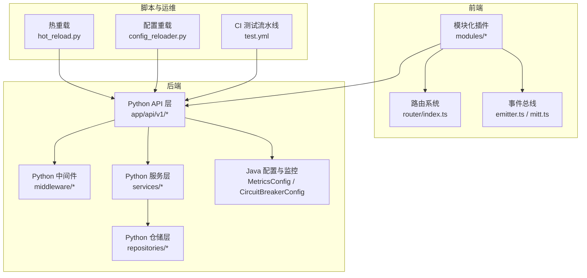
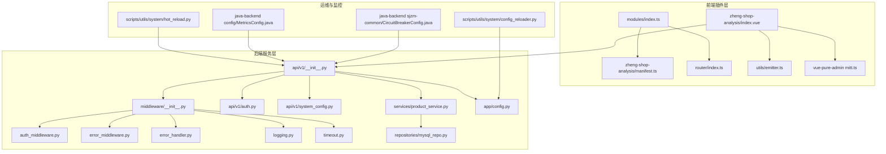
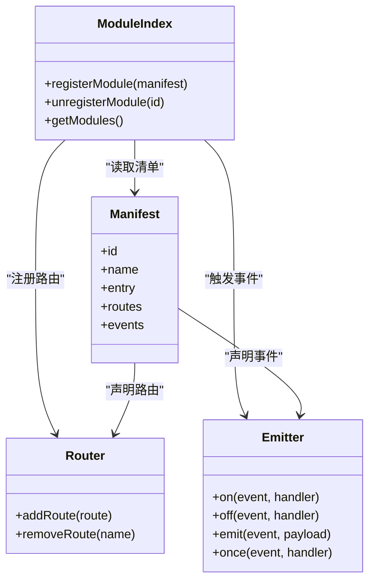
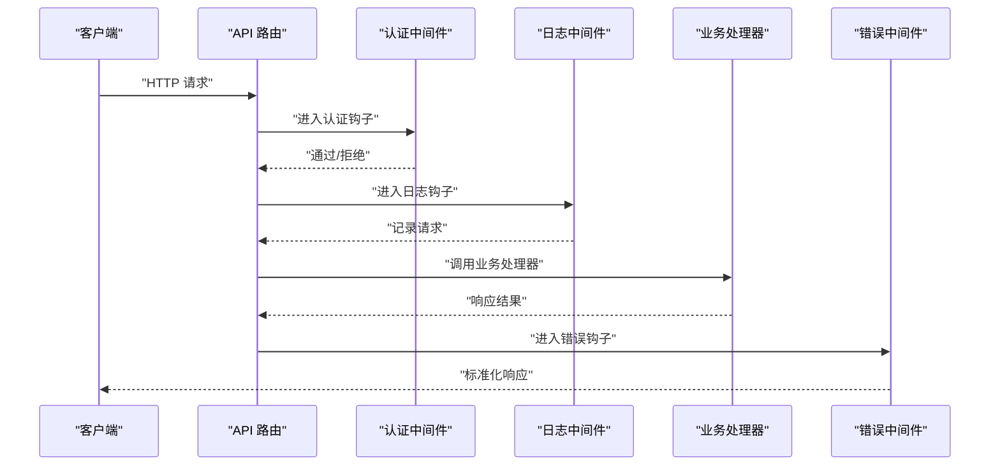
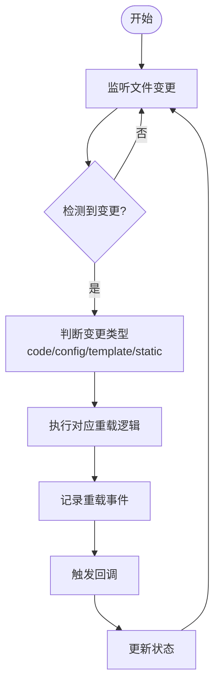
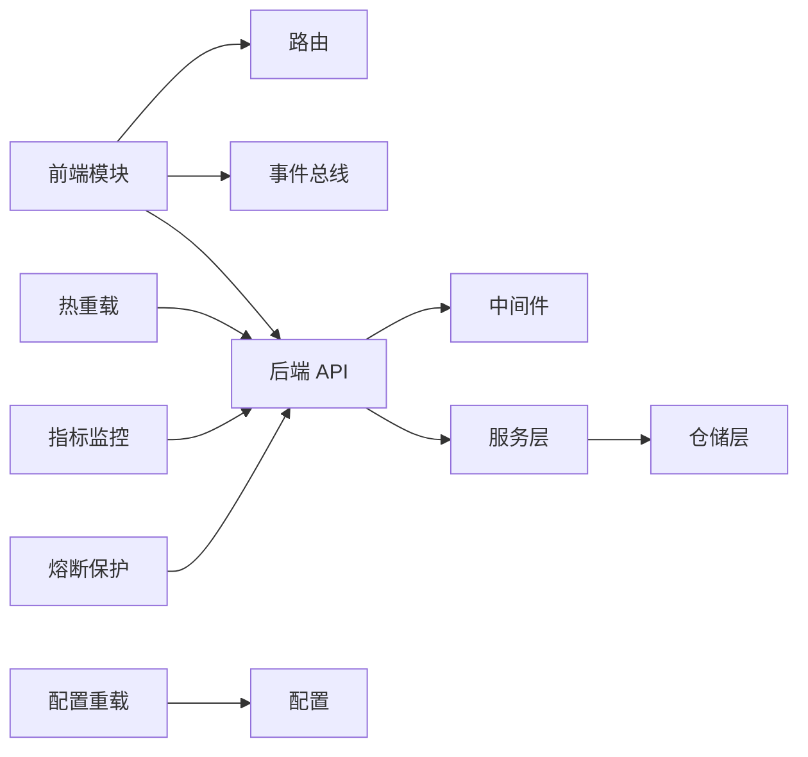

# 插件开发框架

<cite>
**本文引用的文件**
- [backend/app/main.py](file://backend/app/main.py)
- [backend/app/config.py](file://backend/app/config.py)
- [backend/app/middleware/__init__.py](file://backend/app/middleware/__init__.py)
- [backend/app/middleware/auth_middleware.py](file://backend/app/middleware/auth_middleware.py)
- [backend/app/middleware/error_handler.py](file://backend/app/middleware/error_handler.py)
- [backend/app/middleware/error_middleware.py](file://backend/app/middleware/error_middleware.py)
- [backend/app/middleware/logging.py](file://backend/app/middleware/logging.py)
- [backend/app/middleware/timeout.py](file://backend/app/middleware/timeout.py)
- [backend/app/api/v1/__init__.py](file://backend/app/api/v1/__init__.py)
- [backend/app/api/v1/auth.py](file://backend/app/api/v1/auth.py)
- [backend/app/api/v1/products.py](file://backend/app/api/v1/products.py)
- [backend/app/api/v1/system_config.py](file://backend/app/api/v1/system_config.py)
- [backend/app/services/__init__.py](file://backend/app/services/__init__.py)
- [backend/app/services/product_service.py](file://backend/app/services/product_service.py)
- [backend/app/repositories/__init__.py](file://backend/app/repositories/__init__.py)
- [backend/app/repositories/mysql_repo.py](file://backend/app/repositories/mysql_repo.py)
- [backend/app/utils/performance_monitor.py](file://backend/app/utils/performance_monitor.py)
- [scripts/utils/system/hot_reload.py](file://scripts/utils/system/hot_reload.py)
- [scripts/utils/system/config_reloader.py](file://scripts/utils/system/config_reloader.py)
- [frontend/src/modules/index.ts](file://frontend/src/modules/index.ts)
- [frontend/src/modules/types.ts](file://frontend/src/modules/types.ts)
- [frontend/src/modules/zheng-shop-analysis/manifest.ts](file://frontend/src/modules/zheng-shop-analysis/manifest.ts)
- [frontend/src/modules/zheng-shop-analysis/index.vue](file://frontend/src/modules/zheng-shop-analysis/index.vue)
- [frontend/src/router/index.ts](file://frontend/src/router/index.ts)
- [frontend/src/utils/emitter.ts](file://frontend/src/utils/emitter.ts)
- [frontend/vue-pure-admin/src/utils/mitt.ts](file://frontend/vue-pure-admin/src/utils/mitt.ts)
- [frontend/vue-pure-admin/src/layout/hooks/useMultiFrame.ts](file://frontend/vue-pure-admin/src/layout/hooks/useMultiFrame.ts)
- [frontend/AGENTS.md](file://frontend/AGENTS.md)
- [java-backend/src/main/java/com/sjzm/config/MetricsConfig.java](file://java-backend/src/main/java/com/sjzm/config/MetricsConfig.java)
- [java-backend/sjzm-common/src/main/java/com/sjzm/config/CircuitBreakerConfig.java](file://java-backend/sjzm-common/src/main/java/com/sjzm/config/CircuitBreakerConfig.java)
- [openspec/changes/verify-java-backend-completeness/specs/api-endpoint-audit/spec.md](file://openspec/changes/verify-java-backend-completeness/specs/api-endpoint-audit/spec.md)
- [openspec/changes/microservices-migration/specs/independent-deployment/spec.md](file://openspec/changes/microservices-migration/specs/independent-deployment/spec.md)
- [scripts/ci/workflows/test.yml](file://scripts/ci/workflows/test.yml)
</cite>

## 目录
1. [引言](#引言)
2. [项目结构](#项目结构)
3. [核心组件](#核心组件)
4. [架构总览](#架构总览)
5. [详细组件分析](#详细组件分析)
6. [依赖分析](#依赖分析)
7. [性能考虑](#性能考虑)
8. [故障排查指南](#故障排查指南)
9. [结论](#结论)
10. [附录](#附录)

## 引言
本文件面向“思觉智贸系统”的插件开发团队，提供一套完整、可落地的插件开发框架文档。内容涵盖插件系统架构设计、开发模式、注册机制、生命周期管理、依赖注入、接口定义规范（API 扩展点、中间件钩子、事件处理器）、配置管理、热重载机制、版本兼容性处理、插件间通信与数据共享、测试策略与调试工具、性能监控等。目标是帮助开发者从简单功能扩展逐步过渡到复杂业务模块集成，并确保插件在前后端与微服务架构下的稳定运行。

## 项目结构
系统采用前后端分离与微服务架构：
- 后端由 Python FastAPI 与 Java Spring Boot 双栈构成，提供 REST API 与中间件体系。
- 前端采用 Vue3 + TypeScript，支持模块化插件与事件总线通信。
- 脚本层提供热重载、配置重载、CI 流水线与系统监控工具。
- 开发规范通过 OpenSpec 文档保障 API 与部署一致性。

图表来源
- [backend/app/api/v1/__init__.py](file://backend/app/api/v1/__init__.py)
- [backend/app/middleware/__init__.py](file://backend/app/middleware/__init__.py)
- [frontend/src/router/index.ts](file://frontend/src/router/index.ts)
- [frontend/src/utils/emitter.ts](file://frontend/src/utils/emitter.ts)
- [frontend/vue-pure-admin/src/utils/mitt.ts](file://frontend/vue-pure-admin/src/utils/mitt.ts)
- [scripts/utils/system/hot_reload.py](file://scripts/utils/system/hot_reload.py)
- [scripts/utils/system/config_reloader.py](file://scripts/utils/system/config_reloader.py)
- [java-backend/src/main/java/com/sjzm/config/MetricsConfig.java](file://java-backend/src/main/java/com/sjzm/config/MetricsConfig.java)
- [java-backend/sjzm-common/src/main/java/com/sjzm/config/CircuitBreakerConfig.java](file://java-backend/sjzm-common/src/main/java/com/sjzm/config/CircuitBreakerConfig.java)

章节来源
- [backend/app/main.py](file://backend/app/main.py)
- [backend/app/config.py](file://backend/app/config.py)
- [frontend/AGENTS.md](file://frontend/AGENTS.md)

## 核心组件
- 插件注册与发现
  - 前端模块注册：通过模块清单与路由注册实现插件发现与装配。
  - 后端 API 扩展：通过 API 蓝图或控制器扩展点实现插件式路由挂载。
- 生命周期管理
  - 初始化、启用、禁用、卸载阶段的钩子与回调。
  - 热重载与配置重载驱动的动态更新。
- 依赖注入
  - 后端通过服务层与仓储层解耦，前端通过事件总线与全局状态共享依赖。
- 接口定义规范
  - API 扩展点、中间件钩子、事件处理器三类扩展点。
- 配置管理
  - 集中式配置与按需重载，支持热更新场景。
- 版本兼容性
  - OpenSpec 规范保障前后端 API 与部署一致性。

章节来源
- [frontend/src/modules/index.ts](file://frontend/src/modules/index.ts)
- [frontend/src/modules/types.ts](file://frontend/src/modules/types.ts)
- [backend/app/api/v1/__init__.py](file://backend/app/api/v1/__init__.py)
- [backend/app/middleware/__init__.py](file://backend/app/middleware/__init__.py)
- [scripts/utils/system/hot_reload.py](file://scripts/utils/system/hot_reload.py)
- [scripts/utils/system/config_reloader.py](file://scripts/utils/system/config_reloader.py)
- [openspec/changes/verify-java-backend-completeness/specs/api-endpoint-audit/spec.md](file://openspec/changes/verify-java-backend-completeness/specs/api-endpoint-audit/spec.md)

## 架构总览
下图展示插件系统在整体架构中的位置与交互关系：

图表来源
- [frontend/src/modules/index.ts](file://frontend/src/modules/index.ts)
- [frontend/src/modules/zheng-shop-analysis/manifest.ts](file://frontend/src/modules/zheng-shop-analysis/manifest.ts)
- [frontend/src/modules/zheng-shop-analysis/index.vue](file://frontend/src/modules/zheng-shop-analysis/index.vue)
- [frontend/src/router/index.ts](file://frontend/src/router/index.ts)
- [frontend/src/utils/emitter.ts](file://frontend/src/utils/emitter.ts)
- [frontend/vue-pure-admin/src/utils/mitt.ts](file://frontend/vue-pure-admin/src/utils/mitt.ts)
- [backend/app/middleware/__init__.py](file://backend/app/middleware/__init__.py)
- [backend/app/middleware/auth_middleware.py](file://backend/app/middleware/auth_middleware.py)
- [backend/app/middleware/error_middleware.py](file://backend/app/middleware/error_middleware.py)
- [backend/app/middleware/error_handler.py](file://backend/app/middleware/error_handler.py)
- [backend/app/middleware/logging.py](file://backend/app/middleware/logging.py)
- [backend/app/middleware/timeout.py](file://backend/app/middleware/timeout.py)
- [backend/app/api/v1/__init__.py](file://backend/app/api/v1/__init__.py)
- [backend/app/api/v1/auth.py](file://backend/app/api/v1/auth.py)
- [backend/app/api/v1/system_config.py](file://backend/app/api/v1/system_config.py)
- [backend/app/services/product_service.py](file://backend/app/services/product_service.py)
- [backend/app/repositories/mysql_repo.py](file://backend/app/repositories/mysql_repo.py)
- [backend/app/config.py](file://backend/app/config.py)
- [scripts/utils/system/hot_reload.py](file://scripts/utils/system/hot_reload.py)
- [scripts/utils/system/config_reloader.py](file://scripts/utils/system/config_reloader.py)
- [java-backend/src/main/java/com/sjzm/config/MetricsConfig.java](file://java-backend/src/main/java/com/sjzm/config/MetricsConfig.java)
- [java-backend/sjzm-common/src/main/java/com/sjzm/config/CircuitBreakerConfig.java](file://java-backend/sjzm-common/src/main/java/com/sjzm/config/CircuitBreakerConfig.java)

## 详细组件分析

### 前端插件系统（模块化与事件总线）
- 模块注册与清单
  - 通过模块索引与清单文件声明插件元数据与入口组件，实现自动注册与路由挂载。
- 事件总线
  - 提供轻量级事件发布/订阅，支持跨组件通信与插件间解耦。
- 多框架/多视图容器
  - 提供多视图映射与管理，便于插件在不同布局或容器内渲染。

图表来源
- [frontend/src/modules/index.ts](file://frontend/src/modules/index.ts)
- [frontend/src/modules/types.ts](file://frontend/src/modules/types.ts)
- [frontend/src/modules/zheng-shop-analysis/manifest.ts](file://frontend/src/modules/zheng-shop-analysis/manifest.ts)
- [frontend/src/modules/zheng-shop-analysis/index.vue](file://frontend/src/modules/zheng-shop-analysis/index.vue)
- [frontend/src/router/index.ts](file://frontend/src/router/index.ts)
- [frontend/src/utils/emitter.ts](file://frontend/src/utils/emitter.ts)
- [frontend/vue-pure-admin/src/utils/mitt.ts](file://frontend/vue-pure-admin/src/utils/mitt.ts)
- [frontend/vue-pure-admin/src/layout/hooks/useMultiFrame.ts](file://frontend/vue-pure-admin/src/layout/hooks/useMultiFrame.ts)

章节来源
- [frontend/src/modules/index.ts](file://frontend/src/modules/index.ts)
- [frontend/src/modules/types.ts](file://frontend/src/modules/types.ts)
- [frontend/src/modules/zheng-shop-analysis/manifest.ts](file://frontend/src/modules/zheng-shop-analysis/manifest.ts)
- [frontend/src/modules/zheng-shop-analysis/index.vue](file://frontend/src/modules/zheng-shop-analysis/index.vue)
- [frontend/src/router/index.ts](file://frontend/src/router/index.ts)
- [frontend/src/utils/emitter.ts](file://frontend/src/utils/emitter.ts)
- [frontend/vue-pure-admin/src/utils/mitt.ts](file://frontend/vue-pure-admin/src/utils/mitt.ts)
- [frontend/vue-pure-admin/src/layout/hooks/useMultiFrame.ts](file://frontend/vue-pure-admin/src/layout/hooks/useMultiFrame.ts)

### 后端插件系统（API 扩展点与中间件钩子）
- API 扩展点
  - 在 API 蓝图或控制器层提供扩展点，允许插件注册新的路由与处理器。
- 中间件钩子
  - 认证、错误处理、日志、超时等中间件作为插件钩子，支持前置/后置拦截。
- 服务层与仓储层
  - 服务层封装业务逻辑，仓储层抽象数据访问，二者通过依赖注入解耦。

图表来源
- [backend/app/api/v1/__init__.py](file://backend/app/api/v1/__init__.py)
- [backend/app/middleware/auth_middleware.py](file://backend/app/middleware/auth_middleware.py)
- [backend/app/middleware/logging.py](file://backend/app/middleware/logging.py)
- [backend/app/middleware/error_middleware.py](file://backend/app/middleware/error_middleware.py)

章节来源
- [backend/app/api/v1/__init__.py](file://backend/app/api/v1/__init__.py)
- [backend/app/middleware/auth_middleware.py](file://backend/app/middleware/auth_middleware.py)
- [backend/app/middleware/logging.py](file://backend/app/middleware/logging.py)
- [backend/app/middleware/error_middleware.py](file://backend/app/middleware/error_middleware.py)

### 配置管理与热重载
- 配置重载
  - 监控配置文件变更，触发回调以更新运行时配置。
- 热重载
  - 监控代码与模板变更，动态重载模块并记录重载历史与事件。

图表来源
- [scripts/utils/system/hot_reload.py](file://scripts/utils/system/hot_reload.py)
- [scripts/utils/system/config_reloader.py](file://scripts/utils/system/config_reloader.py)

章节来源
- [scripts/utils/system/hot_reload.py](file://scripts/utils/system/hot_reload.py)
- [scripts/utils/system/config_reloader.py](file://scripts/utils/system/config_reloader.py)

### 版本兼容性与 API 对齐
- OpenSpec 规范确保：
  - Java 控制器与 Python 后端 API 的端点映射一致。
  - HTTP 方法与路径保持兼容，满足前端调用预期。
- 微服务独立部署与健康检查保障运行时一致性。

章节来源
- [openspec/changes/verify-java-backend-completeness/specs/api-endpoint-audit/spec.md](file://openspec/changes/verify-java-backend-completeness/specs/api-endpoint-audit/spec.md)
- [openspec/changes/microservices-migration/specs/independent-deployment/spec.md](file://openspec/changes/microservices-migration/specs/independent-deployment/spec.md)

## 依赖分析
- 前端模块依赖
  - 模块清单决定路由与事件依赖；事件总线提供跨模块通信。
- 后端服务依赖
  - 服务层依赖仓储层；中间件层横切关注点；API 层聚合业务能力。
- 运维依赖
  - 热重载与配置重载依赖文件系统与回调机制；监控与熔断依赖外部指标系统。

图表来源
- [frontend/src/modules/index.ts](file://frontend/src/modules/index.ts)
- [frontend/src/router/index.ts](file://frontend/src/router/index.ts)
- [frontend/src/utils/emitter.ts](file://frontend/src/utils/emitter.ts)
- [backend/app/api/v1/__init__.py](file://backend/app/api/v1/__init__.py)
- [backend/app/middleware/__init__.py](file://backend/app/middleware/__init__.py)
- [backend/app/services/product_service.py](file://backend/app/services/product_service.py)
- [backend/app/repositories/mysql_repo.py](file://backend/app/repositories/mysql_repo.py)
- [scripts/utils/system/hot_reload.py](file://scripts/utils/system/hot_reload.py)
- [scripts/utils/system/config_reloader.py](file://scripts/utils/system/config_reloader.py)
- [java-backend/src/main/java/com/sjzm/config/MetricsConfig.java](file://java-backend/src/main/java/com/sjzm/config/MetricsConfig.java)
- [java-backend/sjzm-common/src/main/java/com/sjzm/config/CircuitBreakerConfig.java](file://java-backend/sjzm-common/src/main/java/com/sjzm/config/CircuitBreakerConfig.java)

章节来源
- [backend/app/services/product_service.py](file://backend/app/services/product_service.py)
- [backend/app/repositories/mysql_repo.py](file://backend/app/repositories/mysql_repo.py)
- [backend/app/config.py](file://backend/app/config.py)

## 性能考虑
- 后端性能监控
  - 通过指标记录 HTTP 请求耗时、缓存命中/未命中、MQ 消息与数据库查询耗时，辅助定位瓶颈。
- 熔断与降级
  - 为关键服务配置熔断器，避免级联故障。
- 前端性能
  - 使用事件总线与虚拟列表等手段降低渲染压力；合理拆分模块，按需加载。

章节来源
- [java-backend/src/main/java/com/sjzm/config/MetricsConfig.java](file://java-backend/src/main/java/com/sjzm/config/MetricsConfig.java)
- [java-backend/sjzm-common/src/main/java/com/sjzm/config/CircuitBreakerConfig.java](file://java-backend/sjzm-common/src/main/java/com/sjzm/config/CircuitBreakerConfig.java)
- [backend/app/utils/performance_monitor.py](file://backend/app/utils/performance_monitor.py)

## 故障排查指南
- 热重载异常
  - 检查文件监听状态与重载历史，确认重载类型与回调是否正确触发。
- 配置重载失败
  - 校验配置文件格式与变更监听器状态，确认变更处理器是否注册。
- 中间件链路异常
  - 逐个检查认证、日志、错误处理中间件的顺序与异常分支。
- 事件总线问题
  - 确认事件命名规范、订阅者是否正确移除以及一次性事件是否按预期清理。

章节来源
- [scripts/utils/system/hot_reload.py](file://scripts/utils/system/hot_reload.py)
- [scripts/utils/system/config_reloader.py](file://scripts/utils/system/config_reloader.py)
- [frontend/src/utils/emitter.ts](file://frontend/src/utils/emitter.ts)
- [frontend/vue-pure-admin/src/utils/mitt.ts](file://frontend/vue-pure-admin/src/utils/mitt.ts)
- [backend/app/middleware/__init__.py](file://backend/app/middleware/__init__.py)

## 结论
本插件开发框架以“前后端模块化 + 中间件钩子 + 事件总线 + 配置与热重载 + 监控与熔断”为核心，既保证了插件的可扩展性与可维护性，又兼顾了运行时稳定性与可观测性。建议在实际开发中遵循 OpenSpec 的 API 与部署规范，严格使用事件总线进行插件间通信，利用热重载与配置重载提升开发效率，并通过指标与熔断保障系统韧性。

## 附录
- 开发示例（路径指引）
  - 简单功能扩展：在前端模块清单中声明路由与事件，后端 API 中新增处理器并通过中间件完成鉴权与日志。
  - 复杂业务模块集成：将服务层与仓储层解耦，通过配置重载动态调整参数，配合热重载快速迭代。
- 测试策略与调试工具
  - 使用 CI 流水线覆盖单元、集成、系统与 UAT 测试；结合事件总线与日志中间件进行端到端调试。
- 性能监控方法
  - 基于指标与熔断配置，建立告警与回滚机制，定期复盘热点路径与慢查询。

章节来源
- [scripts/ci/workflows/test.yml](file://scripts/ci/workflows/test.yml)
- [frontend/AGENTS.md](file://frontend/AGENTS.md)